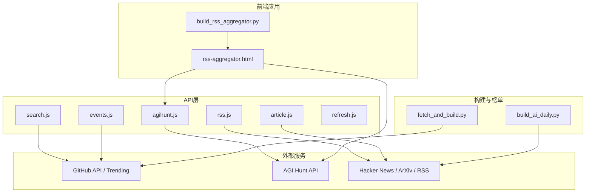
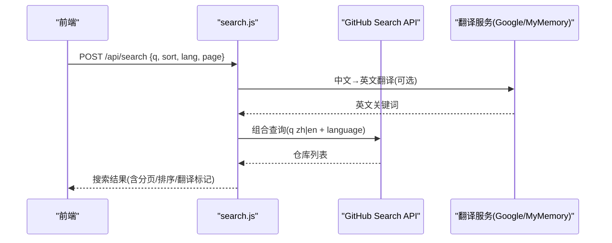
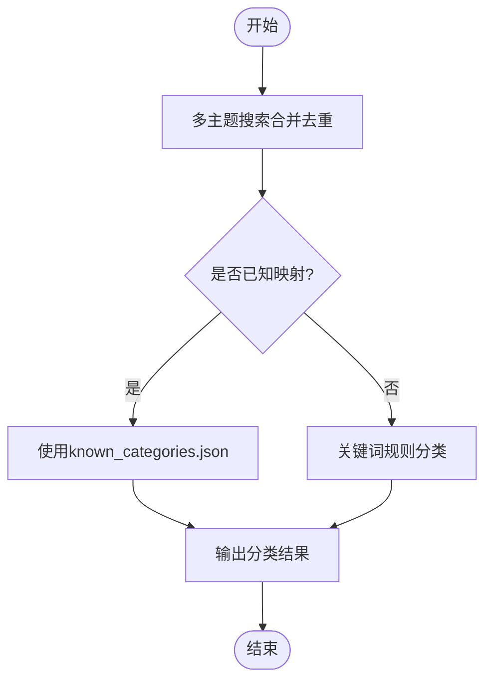
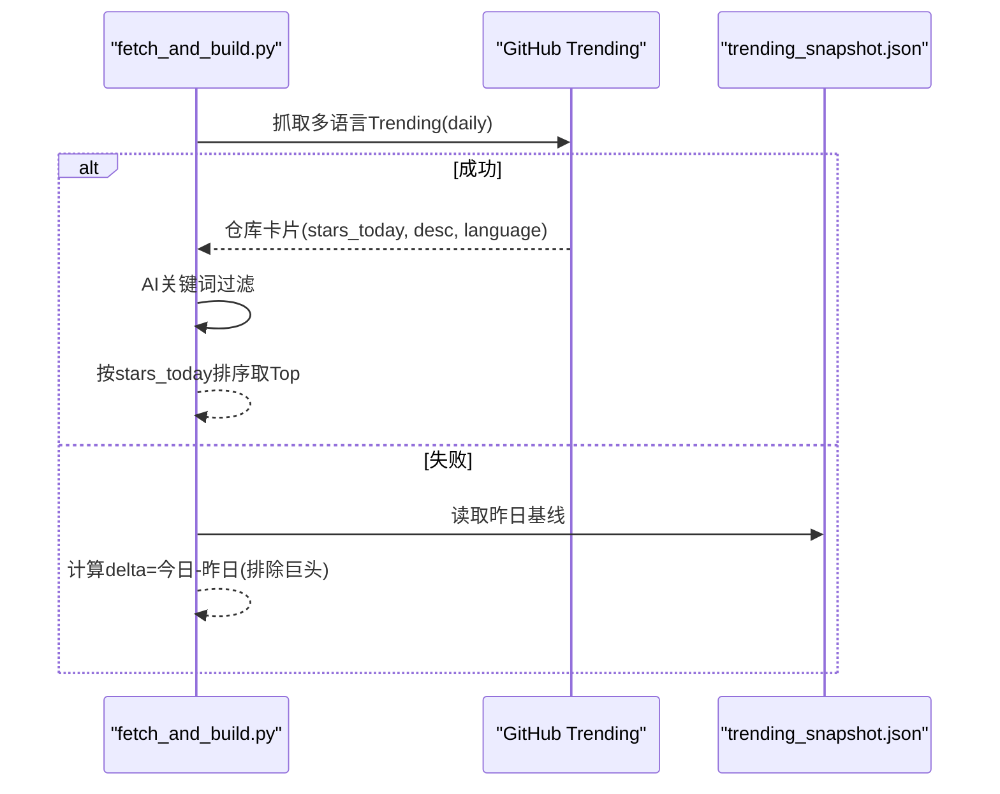
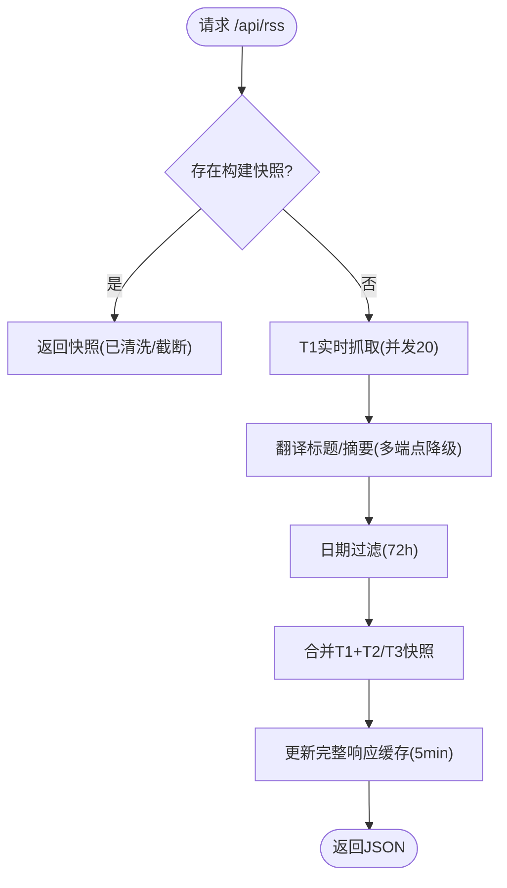
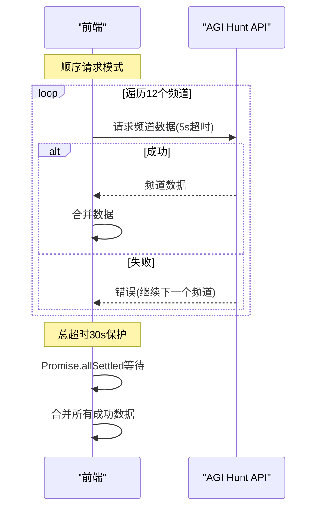
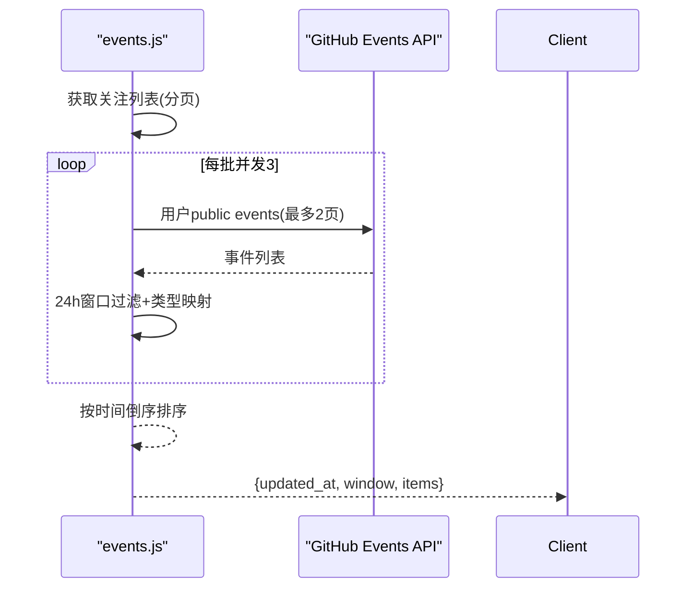
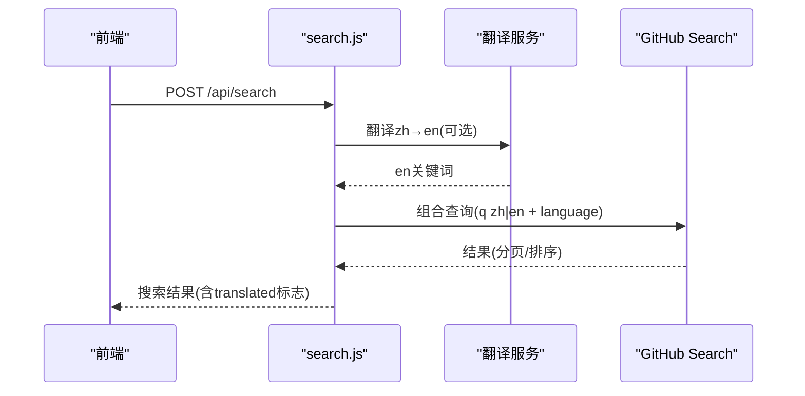
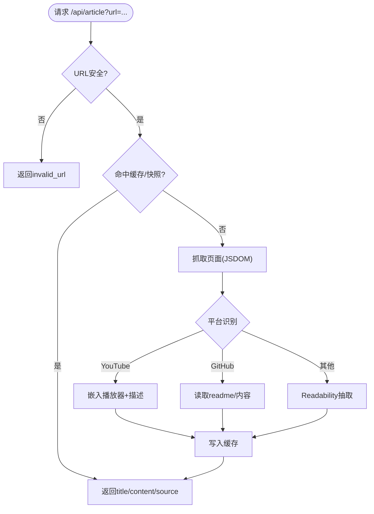
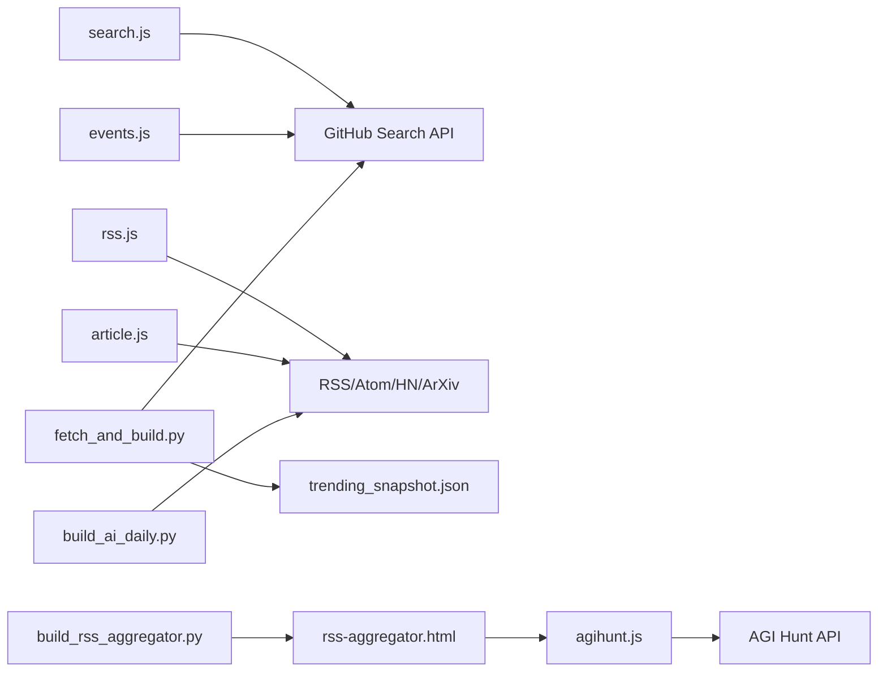

# AI项目追踪API

<cite>
**本文引用的文件**
- [README.md](file://README.md)
- [package.json](file://package.json)
- [api/agihunt.js](file://api/agihunt.js)
- [api/search.js](file://api/search.js)
- [api/events.js](file://api/events.js)
- [api/refresh.js](file://api/refresh.js)
- [api/rss.js](file://api/rss.js)
- [api/article.js](file://api/article.js)
- [rss-aggregator.html](file://rss-aggregator.html)
- [build_rss_aggregator.py](file://build_rss_aggregator.py)
- [fetch_and_build.py](file://fetch_and_build.py)
- [build_ai_daily.py](file://build_ai_daily.py)
- [known_categories.json](file://known_categories.json)
</cite>

## 更新摘要
**所做更改**
- 更新了AGI Hunt资讯聚合组件，从并行请求改为顺序处理以适配移动端6个并发连接限制
- 新增逐通道超时控制和容错机制，确保部分频道失败时仍能获取其他频道内容
- 优化了移动端网络环境下的请求策略和用户体验
- 增强了错误处理和降级机制的文档说明

## 目录
1. [简介](#简介)
2. [项目结构](#项目结构)
3. [核心组件](#核心组件)
4. [架构总览](#架构总览)
5. [详细组件分析](#详细组件分析)
6. [依赖关系分析](#依赖关系分析)
7. [性能考量](#性能考量)
8. [故障排查指南](#故障排查指南)
9. [结论](#结论)
10. [附录：API使用示例与最佳实践](#附录api使用示例与最佳实践)

## 简介
本仓库提供一套"AI项目追踪"能力，涵盖：
- 项目池管理：基于GitHub主题搜索构建AI项目池（机器学习、深度学习、NLP等），并维护已知分类映射。
- 趋势计算与排行榜：抓取GitHub Trending每日数据，结合快照差值生成涨星榜；同时按星标生成总榜与新秀榜。
- 资讯聚合：通过RSS/Atom、Hacker News、ArXiv、The Verge、TechCrunch、36氪等多渠道聚合AI资讯，支持翻译与HTML清洗。
- 实时动态：聚合关注账号近24小时事件，形成时间线。
- 搜索与推荐：跨语言关键词搜索GitHub仓库，支持分页与排序；结合分类与热度进行推荐展示。
- 全文提取：对文章链接进行安全抓取与内容抽取，优先使用构建时快照缓存。

该方案以Vercel Serverless函数作为API层，Python脚本负责定时构建与榜单生成，前端静态页面由Pages托管。

**章节来源**
- [README.md:1-22](file://README.md#L1-L22)

## 项目结构
- API层（Vercel Serverless）
  - agihunt.js：AGI Hunt资讯代理，带CORS白名单、内存缓存、上游鉴权。
  - search.js：全网GitHub仓库搜索，中文→英文翻译降级，结果与翻译双缓存。
  - events.js：关注账号近24小时事件聚合，并发控制与滚动窗口过滤。
  - refresh.js：触发GitHub Actions workflow_dispatch的受控入口。
  - rss.js：API-First RSS聚合，分层T1/T2/T3抓取，多源合并、翻译、HTML深度清洗。
  - article.js：文章全文提取，支持YouTube/GitHub/通用Readability，含安全URL校验与快照回退。
- 构建与榜单（Python）
  - fetch_and_build.py：拉取Star列表、智能分类、构建AI项目池、Trending抓取与排行榜生成。
  - build_ai_daily.py：AI晨报生成，多渠道快讯抓取与分类渲染。
- 前端应用
  - rss-aggregator.html：AI动态流聚合页面，集成AIHOT和AGI Hunt资讯源。
  - build_rss_aggregator.py：构建时的RSS聚合器，包含前端JavaScript逻辑。
- 数据与配置
  - known_categories.json：已知仓库到分类的稳定映射。
  - package.json：Node依赖（JSDOM、Readability）。
  - index.html/template.html：前端页面与模板。

**图表来源**
- [api/agihunt.js:1-113](file://api/agihunt.js#L1-L113)
- [api/search.js:1-177](file://api/search.js#L1-L177)
- [api/events.js:1-161](file://api/events.js#L1-L161)
- [api/rss.js:1-468](file://api/rss.js#L1-L468)
- [api/article.js:1-203](file://api/article.js#L1-L203)
- [api/refresh.js:1-65](file://api/refresh.js#L1-L65)
- [rss-aggregator.html:1920-2229](file://rss-aggregator.html#L1920-L2229)
- [build_rss_aggregator.py:3433-3667](file://build_rss_aggregator.py#L3433-L3667)
- [fetch_and_build.py:188-400](file://fetch_and_build.py#L188-L400)
- [build_ai_daily.py:137-400](file://build_ai_daily.py#L137-L400)

**章节来源**
- [package.json:1-9](file://package.json#L1-L9)
- [known_categories.json:1-224](file://known_categories.json#L1-L224)

## 核心组件
- 项目池与分类
  - 通过GitHub主题搜索（ai、machine-learning、deep-learning、llm、gpt、agent）构建AI项目池，去重并按星标排序。
  - 未知项目采用关键词规则分类，已有项目走known_categories.json保持稳定。
- 趋势与排行榜
  - 总榜：按总星标排序。
  - 涨星榜：优先抓取GitHub Trending daily的stars today，AI关键词过滤后排序；失败则回退快照差值模式。
  - 新秀榜：最近7天新建且满足最小星标的项目。
- 资讯聚合
  - T1实时抓取（高优先级源），T2/T3从构建时快照读取；统一日期过滤（72h或36h）与HTML深度清洗。
  - 英文源标题/摘要自动翻译（Google/MyMemory多端点降级）。
- **AGI Hunt资讯聚合（已更新）**
  - 采用顺序请求模式，避免移动端并发连接槽排队问题。
  - 每个频道独立超时控制（5秒单请求超时 + 30秒总超时）。
  - 容错机制：单个频道失败不影响其他频道获取。
  - 支持12个专业频道：模型、研究、编程Agent、产品、多模态、基础设施、硬件、创投、政策、AGI、公司、趣味。
- 实时动态
  - 获取用户关注列表，逐用户拉取public events，按24小时滚动窗口过滤，映射为7类事件。
- 搜索与推荐
  - 中文输入先翻译为英文，组合"中文 OR 英文"查询GitHub搜索；支持语言过滤、排序与分页。
  - 搜索结果缓存，翻译结果缓存，降低上游压力。
- 全文提取
  - 安全URL校验，优先命中构建时快照中的全文；否则抓取目标页，针对YouTube/GitHub/通用页面分别抽取。

**章节来源**
- [fetch_and_build.py:188-400](file://fetch_and_build.py#L188-L400)
- [build_ai_daily.py:137-400](file://build_ai_daily.py#L137-L400)
- [api/rss.js:1-468](file://api/rss.js#L1-L468)
- [api/events.js:1-161](file://api/events.js#L1-L161)
- [api/search.js:1-177](file://api/search.js#L1-L177)
- [api/article.js:1-203](file://api/article.js#L1-L203)
- [rss-aggregator.html:1927-2055](file://rss-aggregator.html#L1927-L2055)
- [build_rss_aggregator.py:3468-3491](file://build_rss_aggregator.py#L3468-L3491)

## 架构总览
系统分为三层：
- 数据源层：GitHub API/Trending、AGI Hunt、Hacker News、ArXiv、各类RSS/Atom。
- 处理层：Serverless函数与Python构建脚本，负责抓取、解析、翻译、清洗、缓存、聚合。
- 应用层：前端静态页面与API调用，展示项目池、趋势、排行榜、资讯流与实时动态。

**图表来源**
- [api/search.js:30-91](file://api/search.js#L30-L91)
- [api/search.js:96-177](file://api/search.js#L96-L177)

## 详细组件分析

### 组件A：项目池管理与分类体系
- 项目池构建
  - 多主题搜索合并去重，字段包含名称、所有者、描述、语言、星标、创建时间等。
  - 新秀榜：限定最近7天创建且满足最低星标阈值。
- 分类体系
  - 已知映射：known_categories.json稳定维持仓库到分类的映射。
  - 规则分类：对未知项目，依据名称/描述/Topics匹配关键词，覆盖Agent、视频创作、编程工具、内容创作、学习教程、助手应用、实用工具、金融交易、商业一人公司、前端设计等类别。
- 复杂度与优化
  - 搜索合并去重时间复杂度近似O(N log N)，可通过哈希表降至O(N)。
  - 规则分类为字符串匹配，可引入更细粒度词典与权重评分提升准确率。

**图表来源**
- [fetch_and_build.py:188-212](file://fetch_and_build.py#L188-L212)
- [fetch_and_build.py:89-127](file://fetch_and_build.py#L89-L127)
- [known_categories.json:1-224](file://known_categories.json#L1-L224)

**章节来源**
- [fetch_and_build.py:188-212](file://fetch_and_build.py#L188-L212)
- [fetch_and_build.py:89-127](file://fetch_and_build.py#L89-L127)
- [known_categories.json:1-224](file://known_categories.json#L1-L224)

### 组件B：趋势计算与排行榜生成
- 总榜：按总星标排序，限制展示数量。
- 涨星榜：
  - 主路径：抓取GitHub Trending daily（多语言页合并去重），AI关键词过滤后按stars today排序。
  - 降级路径：若Trending抓取失败，使用trending_snapshot.json与当前星标差值计算delta，排除超大项目。
- 新秀榜：最近7天新建且满足最低星标的项目。
- 指标说明
  - stars_today：当日新增星标数（来自Trending）。
  - delta：在降级模式下表示与昨日基线的星标差值。

**图表来源**
- [fetch_and_build.py:301-400](file://fetch_and_build.py#L301-L400)

**章节来源**
- [fetch_and_build.py:301-400](file://fetch_and_build.py#L301-L400)

### 组件C：资讯聚合与翻译（RSS/Atom/HN/ArXiv）
- 分层抓取
  - T1实时抓取（高优先级源），T2/T3从构建时快照读取。
  - 统一日期过滤（72h或36h），只保留近期条目。
- 翻译与清洗
  - 英文源标题/摘要自动翻译（Google/MyMemory多端点降级）。
  - HTML深度清洗：移除广告、推广、订阅引导等噪音，仅保留安全标签。
- 缓存策略
  - 完整响应缓存5分钟；单源滚动缓存保留上次成功抓取的数据；翻译结果本地缓存。

**图表来源**
- [api/rss.js:289-468](file://api/rss.js#L289-L468)
- [build_ai_daily.py:137-400](file://build_ai_daily.py#L137-L400)

**章节来源**
- [api/rss.js:1-468](file://api/rss.js#L1-L468)
- [build_ai_daily.py:137-400](file://build_ai_daily.py#L137-L400)

### 组件D：AGI Hunt资讯聚合（已更新）
- **顺序请求模式**
  - 为避免移动端6个并发连接限制导致的连接槽排队问题，采用顺序请求方式。
  - 遍历12个专业频道：models（模型）、research（研究）、coding-agents（编程&Agent）、products（应用）、multimodal（多模态）、infra（Infra）、hardware（具身）、funding（创投）、policy（安全）、agi（漫话AGI）、companies（公司和人）、fun（Fun）。
- **逐通道超时控制**
  - 单请求超时：5秒（AbortController控制）。
  - 总超时控制：30秒（防止长时间阻塞）。
  - 每个频道独立超时，互不影响。
- **容错机制**
  - 单个频道失败时继续处理其他频道。
  - 使用Promise.allSettled等待所有请求完成。
  - 错误静默处理，不影响整体流程。
- **渐进式渲染**
  - AIHOT数据先到先渲染，不等AGI Hunt。
  - 最终合并所有数据并按时间排序。

**图表来源**
- [rss-aggregator.html:2032-2055](file://rss-aggregator.html#L2032-L2055)
- [build_rss_aggregator.py:3468-3491](file://build_rss_aggregator.py#L3468-L3491)

**章节来源**
- [rss-aggregator.html:1927-2055](file://rss-aggregator.html#L1927-L2055)
- [build_rss_aggregator.py:3468-3491](file://build_rss_aggregator.py#L3468-L3491)

### 组件E：实时动态聚合（关注账号近24小时）
- 流程
  - 获取关注列表（分页），每批并发3个用户。
  - 每个用户最多拉取2页public events，按北京时间24小时窗口过滤。
  - 映射为7类事件（创建仓库、Star、关注、PR发布、Release、公开、Push）。
- 缓存
  - 结果内存缓存10分钟，减少GitHub API开销。

**图表来源**
- [api/events.js:55-161](file://api/events.js#L55-L161)

**章节来源**
- [api/events.js:1-161](file://api/events.js#L1-L161)

### 组件F：搜索与推荐（跨语言GitHub仓库搜索）
- 流程
  - 中文输入尝试翻译为英文（Google→MyMemory→失败原词）。
  - 构建"中文 OR 英文"查询，附加语言过滤。
  - 调用GitHub搜索API，处理422重试（清洗查询）、403/429限频提示。
  - 结果与翻译结果分别缓存（10分钟/1小时）。
- 分页与排序
  - per_page=30，page上限34；支持best-match/stars/updated排序。

**图表来源**
- [api/search.js:30-91](file://api/search.js#L30-L91)
- [api/search.js:96-177](file://api/search.js#L96-L177)

**章节来源**
- [api/search.js:1-177](file://api/search.js#L1-L177)

### 组件G：文章全文提取与安全控制
- 安全校验
  - 仅允许http/https，禁止内网与localhost域名。
- 抽取策略
  - YouTube：嵌入播放器与描述。
  - GitHub：读取readme或仓库内容。
  - 通用：Readability抽取正文，回退meta描述。
- 缓存与快照
  - 优先命中构建时快照中的全文；否则抓取并缓存（TTL 4小时，最大500条）。

**图表来源**
- [api/article.js:55-123](file://api/article.js#L55-L123)
- [api/article.js:125-203](file://api/article.js#L125-L203)

**章节来源**
- [api/article.js:1-203](file://api/article.js#L1-L203)

## 依赖关系分析
- 外部依赖
  - GitHub API/Trending：用于项目池、搜索、事件聚合、触发Actions。
  - AGI Hunt API：资讯代理，需环境变量密钥。
  - Hacker News Algolia、ArXiv、RSS/Atom：资讯聚合。
- 内部依赖
  - Node依赖：jsdom、@mozilla/readability用于页面解析与全文抽取。
  - Python标准库：urllib、json、re、datetime、xml.etree.ElementTree用于抓取与解析。
- 耦合与解耦
  - API层与构建脚本职责清晰：API提供实时能力，构建脚本负责离线/定时任务。
  - 缓存机制降低外部依赖压力（内存缓存、滚动缓存、快照回退）。

**图表来源**
- [api/search.js:1-177](file://api/search.js#L1-L177)
- [api/events.js:1-161](file://api/events.js#L1-L161)
- [api/agihunt.js:1-113](file://api/agihunt.js#L1-L113)
- [api/rss.js:1-468](file://api/rss.js#L1-L468)
- [api/article.js:1-203](file://api/article.js#L1-L203)
- [fetch_and_build.py:188-400](file://fetch_and_build.py#L188-L400)
- [build_ai_daily.py:137-400](file://build_ai_daily.py#L137-L400)
- [rss-aggregator.html:1920-2229](file://rss-aggregator.html#L1920-L2229)
- [build_rss_aggregator.py:3433-3667](file://build_rss_aggregator.py#L3433-L3667)

**章节来源**
- [package.json:1-9](file://package.json#L1-L9)

## 性能考量
- 并发与限流
  - RSS聚合：并发20路，单源超时5s，失败快速回退。
  - 事件聚合：每批并发3用户，失败静默跳过。
  - 搜索：翻译与GitHub搜索均设置超时，429/403限频友好提示。
  - **AGI Hunt聚合：顺序请求模式，避免移动端连接槽排队，单请求5s超时，总超时30s**。
- 缓存策略
  - 内存缓存：搜索结果10分钟、翻译1小时、RSS完整响应5分钟、文章全文4小时。
  - 滚动缓存：单源上次成功数据保留，避免重复失败。
  - 快照回退：构建时生成的快照用于快速加载与全文抽取。
- 降级与容错
  - 翻译多端点降级（Google→MyMemory→失败原词）。
  - Trending抓取失败回退快照差值模式。
  - RSS/Atom解析失败回退本地JSON。
  - **AGI Hunt单个频道失败不影响其他频道，确保部分失败时仍能获取其他频道内容**。

[本节为通用性能指导，不直接分析具体文件]

## 故障排查指南
- 常见错误与处理
  - 403 Forbidden：CORS未放行或缺少必要头（如X-Search-Key/X-Refresh-Key）。
  - 422 Bad Request：GitHub搜索语法异常，自动清洗查询重试一次。
  - 429 Too Many Requests：上游限频，返回友好提示并建议稍后重试。
  - 502 Bad Gateway：上游服务不可用（GitHub/AGI Hunt/RSS），记录日志并返回统一错误。
  - 500 Internal Error：环境变量缺失（如GH_TOKEN/REFRESH_KEY/AGIHUNT_API_KEY）。
- **AGI Hunt特定问题**
  - 移动端连接超时：检查网络连接质量，确认未超过6个并发连接限制。
  - 频道访问失败：单个频道失败不影响整体，检查具体频道状态。
  - 超时问题：确认单请求5s和总超时30s配置合理。
- 调试建议
  - 检查环境变量配置是否正确。
  - 查看Vercel日志定位上游HTTP状态码与响应体片段。
  - 对于RSS/Atom解析问题，确认XML格式与命名空间。
  - 监控AGI Hunt各频道响应时间和成功率。

**章节来源**
- [api/search.js:145-152](file://api/search.js#L145-L152)
- [api/refresh.js:29-37](file://api/refresh.js#L29-L37)
- [api/agihunt.js:57-67](file://api/agihunt.js#L57-L67)
- [api/rss.js:463-466](file://api/rss.js#L463-L466)
- [api/events.js:126-130](file://api/events.js#L126-L130)

## 结论
本方案通过Serverless函数与Python构建脚本协同，实现了AI项目的发现、追踪与分析闭环：
- 项目池与分类体系稳定可靠，兼顾已知映射与规则分类。
- 趋势计算与排行榜具备高可用降级策略，确保数据连续性。
- 资讯聚合覆盖多平台，翻译与清洗提升可读性。
- **AGI Hunt资讯聚合经过重大优化，采用顺序请求模式适配移动端网络环境，增强容错能力**。
- 搜索与推荐支持跨语言与分页排序，便于用户探索。
- 全文提取保障阅读体验，安全校验防止滥用。

[本节为总结性内容，不直接分析具体文件]

## 附录：API使用示例与最佳实践
- 项目查询（搜索）
  - 方法：POST /api/search
  - 请求体：{ q: "视频创作", sort: "best-match"|"stars"|"updated", lang?: "Python", page?: 1 }
  - 响应：包含query、translated标志、page、total、items（full_name、desc、language、stars、updated_at、html_url、topics）。
  - 注意：需携带X-Search-Key头，值为REFRESH_KEY；CORS仅允许白名单Origin。
  - 参考实现路径：[api/search.js:96-177](file://api/search.js#L96-L177)

- 趋势分析与排行榜
  - 总榜/涨星榜/新秀榜由构建脚本生成，前端通过静态资源或API消费。
  - 涨星榜优先使用GitHub Trending daily的stars today；失败回退快照差值。
  - 参考实现路径：[fetch_and_build.py:301-400](file://fetch_and_build.py#L301-L400)

- 推荐功能
  - 基于分类与热度（stars、stars_today）进行排序与筛选。
  - 结合known_categories.json稳定分类，规则分类补充未知项目。
  - 参考实现路径：[fetch_and_build.py:89-127](file://fetch_and_build.py#L89-L127), [known_categories.json:1-224](file://known_categories.json#L1-L224)

- 数据源集成
  - GitHub：搜索、Trending、Events、Actions触发。
  - AGI Hunt：资讯代理，需AGIHUNT_API_KEY，支持12个专业频道。
  - Hacker News/ArXiv/RSS：资讯聚合，支持多端点翻译与HTML清洗。
  - **AGI Hunt前端集成：顺序请求模式，逐通道超时控制，容错机制**。
  - 参考实现路径：[api/agihunt.js:1-113](file://api/agihunt.js#L1-L113), [api/rss.js:1-468](file://api/rss.js#L1-L468), [build_ai_daily.py:137-400](file://build_ai_daily.py#L137-L400), [rss-aggregator.html:1927-2055](file://rss-aggregator.html#L1927-L2055)

- **AGI Hunt最佳实践**
  - 使用顺序请求模式避免移动端连接槽排队问题。
  - 设置合理的超时时间：单请求5秒，总请求30秒。
  - 利用容错机制，单个频道失败不影响其他频道。
  - 渐进式渲染，先显示可用的数据，提升用户体验。
  - 监控各频道响应时间和成功率，及时发现问题。

[本节为使用指导，不直接分析具体文件]