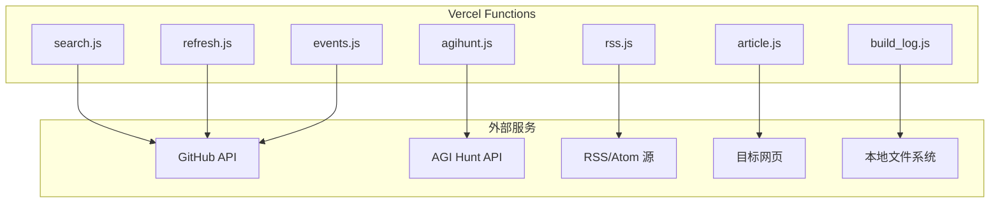
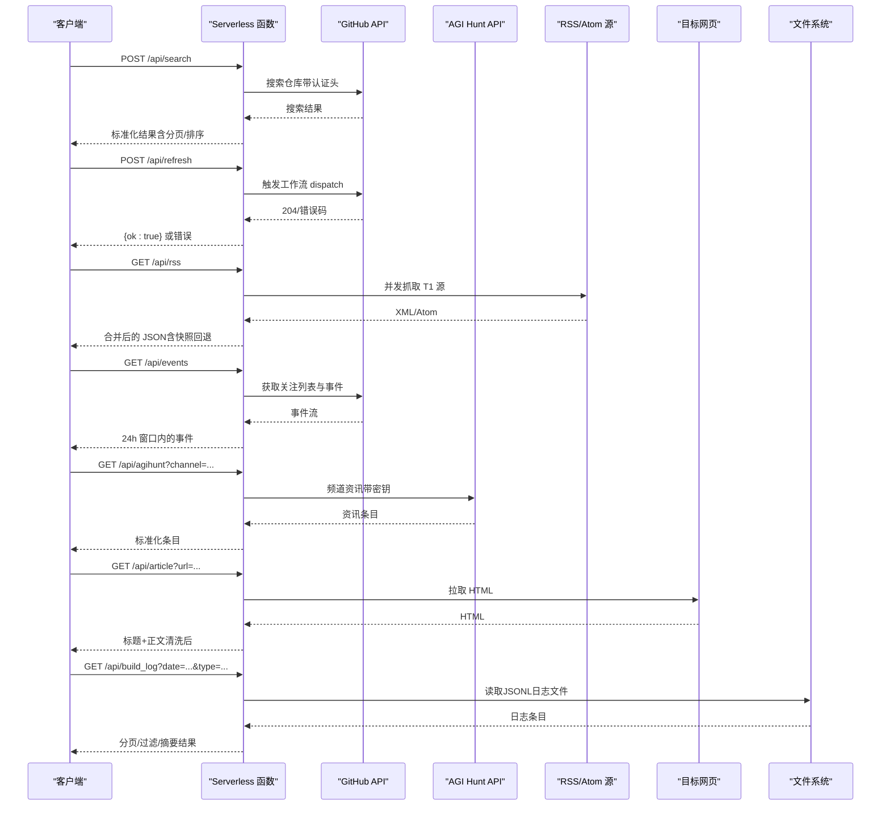
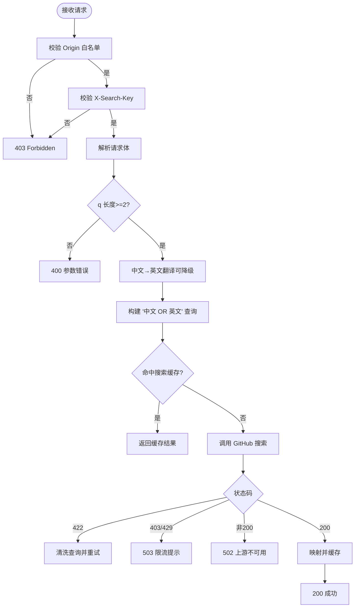
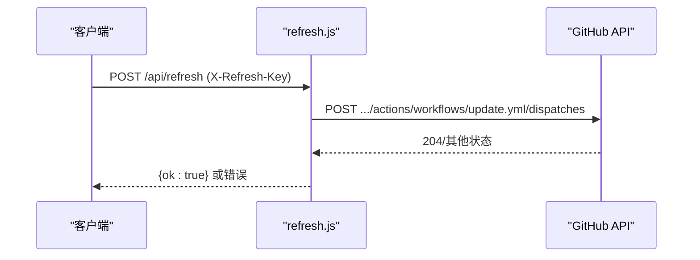
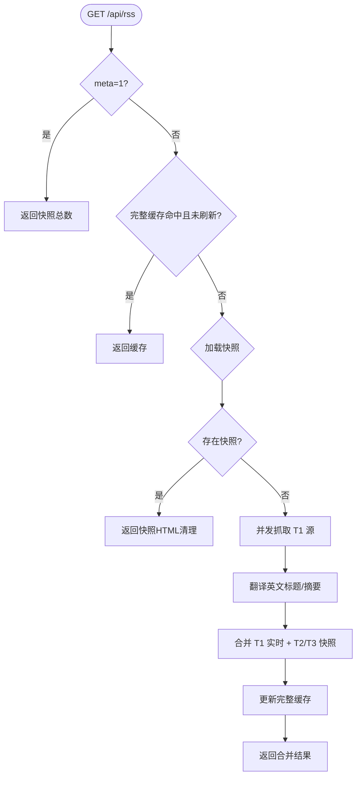
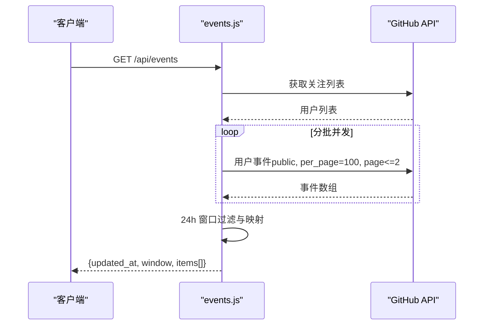
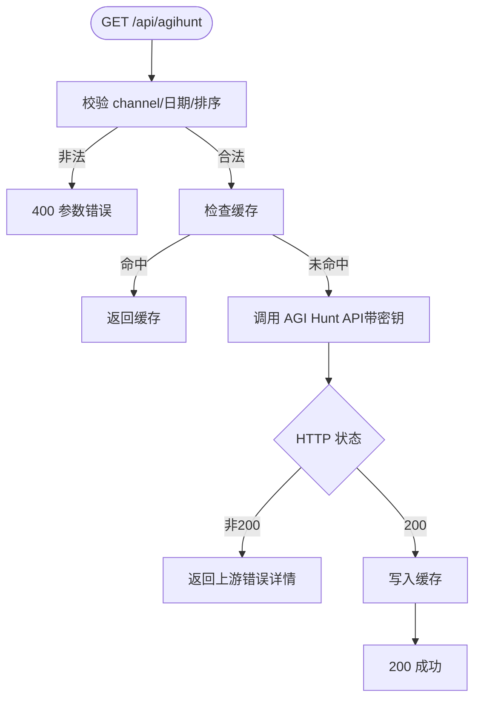
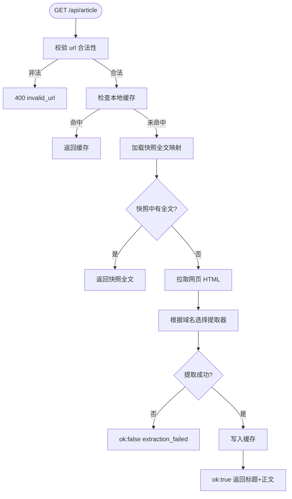
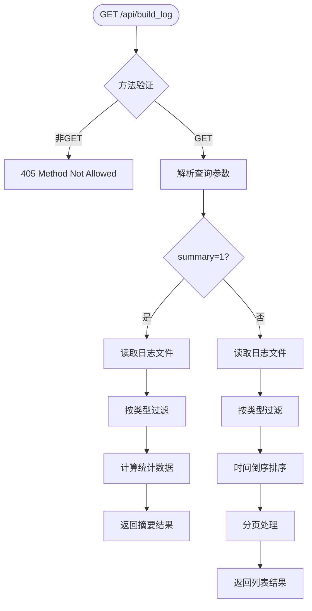
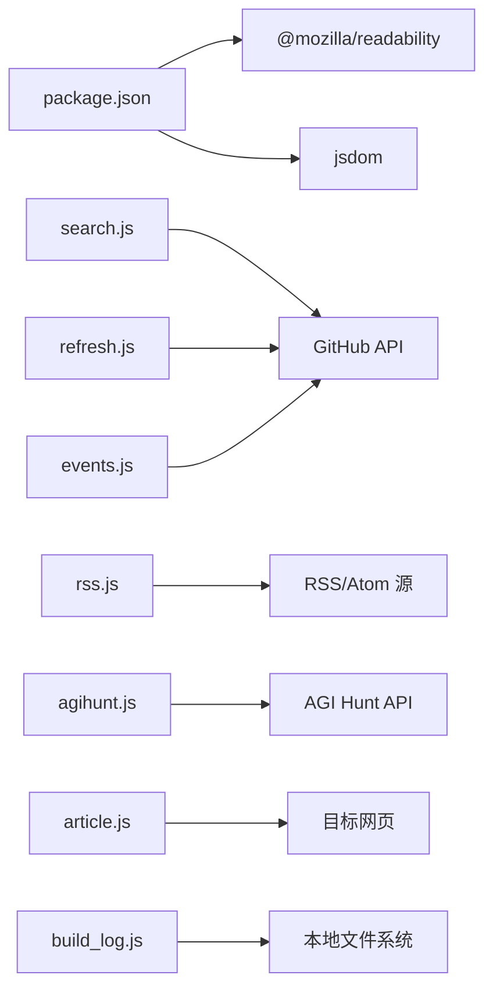

# API服务接口

<cite>
**本文引用的文件**
- [api/search.js](file://api/search.js)
- [api/refresh.js](file://api/refresh.js)
- [api/rss.js](file://api/rss.js)
- [api/events.js](file://api/events.js)
- [api/agihunt.js](file://api/agihunt.js)
- [api/article.js](file://api/article.js)
- [api/build_log.js](file://api/build_log.js)
- [vercel.json](file://vercel.json)
- [package.json](file://package.json)
- [README.md](file://README.md)
</cite>

## 更新摘要
**变更内容**
- 移除收藏夹API端点（api/favorites.js）相关文档，该端点已被完全删除
- 移除相关审计工具在artifacts/audit/目录的引用
- 更新项目结构图以反映当前服务器中心架构，不再包含客户端侧API端点
- 更新核心组件列表以移除已删除的收藏夹功能
- 更新架构总览序列图以移除收藏夹数据流
- 更新性能与限流部分以移除收藏夹端点的缓存策略
- 更新故障排查指南以移除收藏夹相关错误处理
- 更新附录部分以移除收藏夹端点的安全考虑

## 目录
1. [简介](#简介)
2. [项目结构](#项目结构)
3. [核心组件](#核心组件)
4. [架构总览](#架构总览)
5. [详细组件分析](#详细组件分析)
6. [依赖关系分析](#依赖关系分析)
7. [性能与限流](#性能与限流)
8. [故障排查指南](#故障排查指南)
9. [结论](#结论)
10. [附录：版本、安全与兼容性](#附录版本安全与兼容性)

## 简介
本项目提供一组基于 Vercel Serverless Functions 的 RESTful API，用于：
- 跨语言 GitHub 仓库搜索（支持中文关键词翻译）
- 触发 GitHub Actions 工作流以刷新数据
- 聚合 RSS/Atom 源并返回 JSON（含全文提取与清洗）
- 聚合关注账号近 24 小时动态事件
- 代理 AGI Hunt 资讯接口（频道化内容）
- 从网页中提取文章正文（YouTube/GitHub/通用页面）
- 查询构建日志并提供分页、日期过滤、事件类型筛选和摘要统计功能

所有端点遵循最小权限原则，通过环境变量注入敏感配置，并提供 CORS、请求体大小限制、超时控制与缓存策略。

**章节来源**
- [README.md:1-22](file://README.md#L1-L22)

## 项目结构
- api/*：各功能对应的 Serverless Function 入口
- vercel.json：函数路由与最大执行时长配置
- package.json：运行时依赖（jsdom、@mozilla/readability）
- build_logs/*：JSONL格式的构建日志文件
- README.md：项目背景与自动更新说明

**图表来源**
- [vercel.json:1-14](file://vercel.json#L1-L14)
- [api/search.js:1-177](file://api/search.js#L1-L177)
- [api/refresh.js:1-65](file://api/refresh.js#L1-L65)
- [api/rss.js:1-545](file://api/rss.js#L1-L545)
- [api/events.js:1-161](file://api/events.js#L1-L161)
- [api/agihunt.js:1-113](file://api/agihunt.js#L1-L113)
- [api/article.js:1-203](file://api/article.js#L1-L203)
- [api/build_log.js:1-101](file://api/build_log.js#L1-L101)

**章节来源**
- [vercel.json:1-14](file://vercel.json#L1-L14)
- [package.json:1-9](file://package.json#L1-L9)

## 核心组件
- search.js：POST /api/search，跨语言 GitHub 仓库搜索，带翻译降级与内存缓存
- refresh.js：POST /api/refresh，触发 starhub 仓库 update.yml 工作流
- rss.js：GET /api/rss，聚合 RSS/Atom 源，支持快照回退与滚动缓存
- events.js：GET /api/events，聚合关注用户近 24 小时公开事件
- agihunt.js：GET /api/agihunt，代理 AGI Hunt 频道资讯
- article.js：GET /api/article?url=...，提取网页正文（YouTube/GitHub/通用）
- build_log.js：GET /api/build_log，查询构建日志，支持分页、日期过滤、类型筛选和摘要统计

**章节来源**
- [api/search.js:1-177](file://api/search.js#L1-L177)
- [api/refresh.js:1-65](file://api/refresh.js#L1-L65)
- [api/rss.js:1-545](file://api/rss.js#L1-L545)
- [api/events.js:1-161](file://api/events.js#L1-L161)
- [api/agihunt.js:1-113](file://api/agihunt.js#L1-L113)
- [api/article.js:1-203](file://api/article.js#L1-L203)
- [api/build_log.js:1-101](file://api/build_log.js#L1-L101)

## 架构总览

**图表来源**
- [api/search.js:96-176](file://api/search.js#L96-L176)
- [api/refresh.js:12-64](file://api/refresh.js#L12-L64)
- [api/rss.js:366-544](file://api/rss.js#L366-L544)
- [api/events.js:114-160](file://api/events.js#L114-L160)
- [api/agihunt.js:46-112](file://api/agihunt.js#L46-L112)
- [api/article.js:125-202](file://api/article.js#L125-L202)
- [api/build_log.js:41-100](file://api/build_log.js#L41-L100)

## 详细组件分析

### 跨语言搜索 API（search.js）
- 方法：POST
- URL：/api/search
- 请求体（JSON）：
  - q: string，必填，至少 2 个字符
  - sort: enum，可选，best-match|stars|updated，默认 best-match
  - lang: string，可选，按语言过滤
  - page: number，可选，1..34，默认 1
- 认证：
  - 头部 X-Search-Key 必须等于环境变量 REFRESH_KEY
  - 仅白名单 Origin 允许跨域
- 响应（JSON）：
  - query: string
  - translated: boolean
  - page, total, items[]
  - items 字段：full_name, desc, language, stars, updated_at, html_url, topics（最多 3 个）
- 行为要点：
  - 中文关键词先翻译为英文（Google → MyMemory 降级），失败则原词直搜
  - 构建查询时处理空格加引号；若翻译结果与原词相同则仅用原词
  - 对 GitHub 422 查询语法错误进行清洗重试一次
  - 内存缓存：搜索结果 10 分钟，翻译结果 1 小时
  - 速率限制：上游 403/429 返回 503 提示"搜索太频繁"
- 错误码：
  - 400 请求体格式错误或参数不合法
  - 403 未授权（Origin 不在白名单或缺少/错误 X-Search-Key）
  - 500 缺少 GH_TOKEN
  - 502 上游不可用
  - 503 上游限流

**图表来源**
- [api/search.js:96-176](file://api/search.js#L96-L176)

**章节来源**
- [api/search.js:1-177](file://api/search.js#L1-L177)

### 数据刷新 API（refresh.js）
- 方法：POST
- URL：/api/refresh
- 认证：
  - 头部 X-Refresh-Key 必须等于环境变量 REFRESH_KEY
  - 或来自白名单 Origin（服务端调用场景）
- 响应（JSON）：
  - ok: true（200）
  - 错误对象（非 204 上游响应时）
- 行为要点：
  - 调用 GitHub Actions workflow_dispatch 触发 update.yml（ref=main）
  - 使用 GH_TOKEN 作为细粒度 PAT，具备 Actions:write 权限
- 错误码：
  - 403 未授权
  - 500 缺少 GH_TOKEN
  - 502 上游不可用

**图表来源**
- [api/refresh.js:12-64](file://api/refresh.js#L12-L64)

**章节来源**
- [api/refresh.js:1-67](file://api/refresh.js#L1-L67)

### RSS 内容处理 API（rss.js）
- 方法：GET
- URL：/api/rss
- 查询参数：
  - meta=1：轻量探测，返回快照总条数（total）
  - refresh=1：强制刷新，跳过完整响应缓存
- 响应（JSON）：
  - t: 时间戳
  - sources[]: 每个源包含 key/name/cat/color/tier/items[]
  - items 字段：t(标题), u(链接), s(摘要), d(发布时间), 可能含 fc(全文)
- 行为要点：
  - 优先返回构建时生成的快照（rss_api_snapshot.json），否则实时抓取 T1 源
  - 并发抓取 T1 源（CONCURRENCY=20），T2/T3 从快照读取
  - 英文源标题/摘要可在线翻译（多端点降级）
  - 深度清洗 HTML，移除广告/推广/二维码等噪音
  - 滚动缓存：每个源保留上次成功抓取的数据，失败时返回旧数据并标记 _stale
  - 完整响应缓存 TTL 5 分钟；meta 探测无缓存
- 错误码：
  - 500 内部错误（捕获异常）

**图表来源**
- [api/rss.js:366-544](file://api/rss.js#L366-L544)

**章节来源**
- [api/rss.js:1-545](file://api/rss.js#L1-L545)

### GitHub 事件处理 API（events.js）
- 方法：GET
- URL：/api/events
- 响应（JSON）：
  - updated_at: 北京时间字符串
  - window: "24h"
  - items[]: 事件条目，包含 kind/actor/repo/title/tag/size/url/time/day/date
- 行为要点：
  - 获取关注用户列表（每页 100，最多 5 页）
  - 每个用户拉取 events/public（最多 2 页）
  - 过滤最近 24 小时事件，映射为 7 类事件（repo/star/follow/pr/release/public/push）
  - 分批并发（CONCURRENCY=3），失败用户静默跳过
  - 结果内存缓存 10 分钟
- 错误码：
  - 502 上游不可用

**图表来源**
- [api/events.js:55-112](file://api/events.js#L55-L112)
- [api/events.js:114-160](file://api/events.js#L114-L160)

**章节来源**
- [api/events.js:1-161](file://api/events.js#L1-L161)

### AI 项目追踪 API（agihunt.js）
- 方法：GET
- URL：/api/agihunt
- 查询参数：
  - channel: 必填，枚举值（models/research/coding-agents/products/multimodal/infra/hardware/funding/policy/agi/companies/fun）
  - day: 可选，YYYY-MM-DD 或 YYYYMMDD，默认当天（北京时间）
  - sort: new|hot，默认 hot
- 响应（JSON）：
  - channel, day, sort, updated_at, items[]
- 行为要点：
  - 在服务端持有 AGIHUNT_API_KEY，避免前端暴露密钥
  - 结果按 channel|day|sort 缓存 10 分钟，最多 20 项
  - 严格校验 channel 白名单，防止任意参数转发
- 错误码：
  - 400 非法 channel 或日期格式
  - 500 未配置 AGIHUNT_API_KEY
  - 502 上游请求失败

**图表来源**
- [api/agihunt.js:46-112](file://api/agihunt.js#L46-L112)

**章节来源**
- [api/agihunt.js:1-113](file://api/agihunt.js#L1-L113)

### 文章内容提取 API（article.js）
- 方法：GET
- URL：/api/article
- 查询参数：
  - url: string，必填，仅允许 http/https，禁止内网地址
- 响应（JSON）：
  - ok: boolean
  - url, title, content, source（youtube/github/readability/meta/rss_fulltext）
  - 错误时返回 error 字段（missing_url/invalid_url/fetch_failed/timeout/extraction_failed）
- 行为要点：
  - 优先从快照中查找已抓取的全文（rss_api_snapshot.json）
  - 否则拉取目标网页，使用 JSDOM + Readability 提取正文
  - YouTube/GitHub 特殊处理
  - 内存缓存最多 500 项，TTL 4 小时
- 错误码：
  - 400 缺失或非法 url
  - 5xx 网络或解析失败（统一封装为 ok:false）

**图表来源**
- [api/article.js:125-202](file://api/article.js#L125-L202)

**章节来源**
- [api/article.js:1-203](file://api/article.js#L1-L203)

### 构建日志查询 API（build_log.js）
- 方法：GET
- URL：/api/build_log
- 查询参数：
  - date: string，可选，YYYY-MM-DD 格式，指定查询日期
  - type: string，可选，事件类型过滤（build/trigger/deploy/refresh）
  - limit: number，可选，每页数量，默认 50，最大 200
  - offset: number，可选，偏移量，默认 0
  - summary: string，可选，设置为 "1" 时返回摘要统计
- 响应（JSON）：
  - 列表模式：{ total, entries[], limit, offset }
  - 摘要模式：{ date, builds, triggers, deploys, refreshes, last_build, last_deploy, total_items_latest, total_items_oldest, items_delta }
- 行为要点：
  - 支持 CORS 安全限制，仅允许特定域名访问
  - 默认读取最近 7 天的日志文件，支持按日期精确查询
  - 日志文件采用 JSONL 格式存储，每行一个 JSON 对象
  - 支持事件类型过滤和时间倒序排列
  - 摘要模式提供构建统计、增量变化等信息
  - 设置 Cache-Control: no-store 确保实时数据
- 错误码：
  - 405 不支持的方法
  - 403 未授权的跨域请求

**图表来源**
- [api/build_log.js:41-100](file://api/build_log.js#L41-L100)

**章节来源**
- [api/build_log.js:1-101](file://api/build_log.js#L1-L101)

## 依赖关系分析
- 运行时依赖：
  - jsdom：用于 article.js 解析 HTML
  - @mozilla/readability：用于通用文章正文提取
- 外部依赖：
  - GitHub API：search、workflow_dispatch、users/events
  - AGI Hunt API：频道资讯
  - RSS/Atom 源：第三方站点
  - 翻译服务：Google Translate、MyMemory（search.js 与 rss.js 中使用）
  - 本地文件系统：build_log.js 读取 JSONL 日志文件

**图表来源**
- [package.json:1-9](file://package.json#L1-L9)
- [api/search.js:75-91](file://api/search.js#L75-L91)
- [api/refresh.js:40-54](file://api/refresh.js#L40-L54)
- [api/rss.js:203-285](file://api/rss.js#L203-L285)
- [api/events.js:41-63](file://api/events.js#L41-L63)
- [api/agihunt.js:83-93](file://api/agihunt.js#L83-L93)
- [api/article.js:158-177](file://api/article.js#L158-L177)
- [api/build_log.js:13-39](file://api/build_log.js#L13-L39)

**章节来源**
- [package.json:1-9](file://package.json#L1-L9)

## 性能与限流
- 超时控制：
  - search.js：翻译 8s，GitHub 搜索 15s
  - rss.js：单源抓取 5s，并发 20
  - events.js：单次 GitHub 请求 12s
  - agihunt.js：10s
  - article.js：8s
  - build_log.js：10s（文件I/O操作）
- 缓存策略：
  - search.js：搜索结果 10 分钟，翻译 1 小时
  - rss.js：完整响应 5 分钟；滚动缓存（每源）；快照回退
  - events.js：结果 10 分钟
  - agihunt.js：按 channel|day|sort 缓存 10 分钟，最多 20 项
  - article.js：全文提取缓存 4 小时，最多 500 项
  - build_log.js：无缓存（Cache-Control: no-store）
- 速率限制：
  - search.js：上游 403/429 返回 503 提示"搜索太频繁"
  - events.js：关注用户分批并发（3），失败用户静默跳过
  - rss.js：并发抓取 T1 源，失败回退到滚动缓存
  - build_log.js：limit 参数限制最大 200 条记录
- 体积与传输：
  - rss.js：提供 meta=1 轻量探测，避免整包拉取大响应
  - build_log.js：支持分页查询，避免一次性返回大量数据

## 故障排查指南
- 常见错误与定位：
  - 403 Forbidden：检查 Origin 是否在白名单；检查 X-Search-Key/X-Refresh-Key 是否正确
  - 400 Bad Request：检查请求体/查询参数是否合法（如 url、channel、day 格式）
  - 500 Internal Error：检查环境变量是否配置（GH_TOKEN、REFRESH_KEY、AGIHUNT_API_KEY）
  - 502 Bad Gateway：上游服务不可用（GitHub/AGI Hunt/目标网页）
  - 503 Service Unavailable：上游限流（GitHub 搜索）
  - 405 Method Not Allowed：build_log.js 仅支持 GET 方法
- 日志与监控：
  - 使用 Vercel 函数日志查看上游 HTTP 状态与异常堆栈
  - rss.js 输出快照加载、翻译缓存、抓取统计等信息
  - events.js 输出更新时间、窗口、事件数量
  - build_log.js 输出日志文件读取、过滤、分页信息
- 调试建议：
  - 使用 meta=1 快速验证 RSS 快照可用性
  - 使用 refresh=1 强制刷新 RSS 并观察 X-RSS-Refresh 响应头
  - 对 article.js 使用不同 URL 测试提取效果（YouTube/GitHub/通用）
  - 对 build_log.js 使用 summary=1 快速验证日志可用性，使用 date 参数指定日期范围

**章节来源**
- [api/search.js:109-117](file://api/search.js#L109-L117)
- [api/refresh.js:29-38](file://api/refresh.js#L29-L38)
- [api/rss.js:300-312](file://api/rss.js#L300-L312)
- [api/events.js:126-130](file://api/events.js#L126-L130)
- [api/agihunt.js:57-61](file://api/agihunt.js#L57-L61)
- [api/article.js:134-141](file://api/article.js#L134-L141)
- [api/build_log.js:50-51](file://api/build_log.js#L50-L51)

## 结论
本 API 集合围绕 GitHub 生态与内容聚合，提供了跨语言搜索、工作流触发、RSS 聚合、事件聚合、AI 资讯代理、网页正文提取、构建日志查询等功能。通过严格的认证、CORS 白名单、超时与缓存策略，确保在 Serverless 环境下的稳定性与性能。当前架构专注于服务器端数据处理能力，移除了客户端侧的收藏夹API端点，使系统更加简洁高效。建议在生产环境中：
- 合理设置环境变量与密钥管理
- 监控上游限流与错误率
- 利用缓存与快照机制降低外部依赖压力
- 定期评估翻译与全文提取质量
- 监控构建日志的生成与查询性能

## 附录：版本、安全与兼容性
- 版本信息：
  - GitHub API 版本：2022-11-28（search/refresh/events）
  - AGI Hunt Skill Version：1.2.2（agihunt.js）
- 安全考虑：
  - 敏感配置通过环境变量注入（GH_TOKEN、REFRESH_KEY、AGIHUNT_API_KEY）
  - CORS 白名单限制跨域访问
  - article.js 对 URL 进行安全校验，禁止内网地址
  - build_log.js 实现严格的 CORS 安全限制，仅允许特定域名访问
  - 不向上游调用者泄露上游错误细节（防信息泄露）
- 速率限制：
  - 依据上游服务限制（GitHub 搜索/事件、AGI Hunt）
  - 服务端通过缓存与并发控制缓解压力
  - build_log.js 通过 limit 参数限制单次查询规模
- 向后兼容：
  - 现有响应结构保持稳定（items 字段语义明确）
  - 新增 meta=1 与 refresh=1 参数不影响既有调用
  - build_log.js 作为独立端点，不影响现有 API
- 弃用与迁移：
  - 当前未发现弃用端点；如需调整，建议通过版本化路径或扩展查询参数实现
  - favorites.js 端点已完全移除，相关功能不再可用

**章节来源**
- [api/search.js:82-86](file://api/search.js#L82-L86)
- [api/refresh.js:45-51](file://api/refresh.js#L45-L51)
- [api/events.js:43-49](file://api/events.js#L43-L49)
- [api/agihunt.js:87-91](file://api/agihunt.js#L87-L91)
- [api/article.js:55-67](file://api/article.js#L55-L67)
- [api/build_log.js:8-11](file://api/build_log.js#L8-L11)