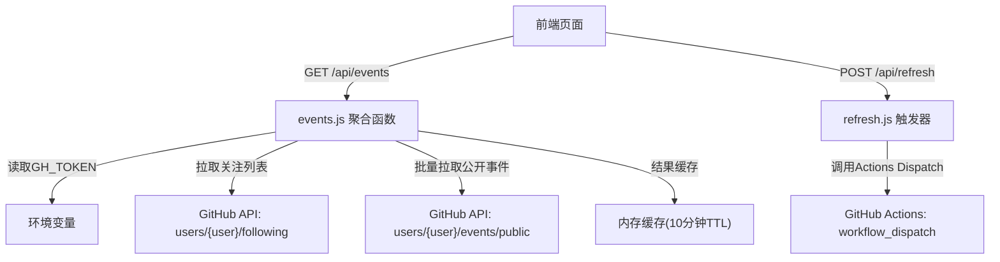
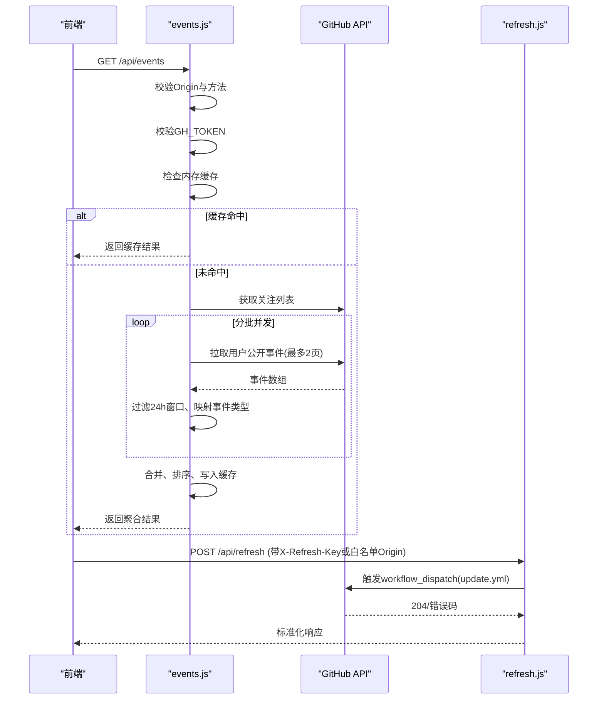
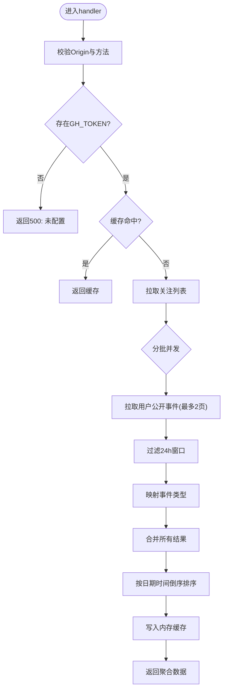
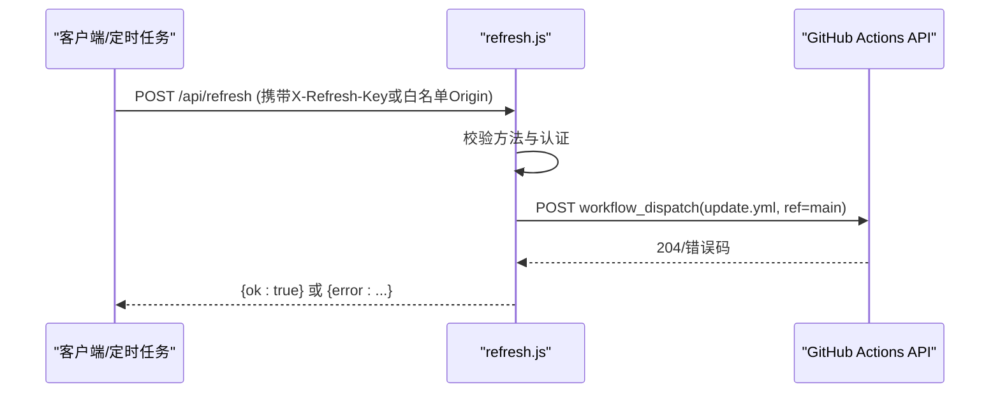
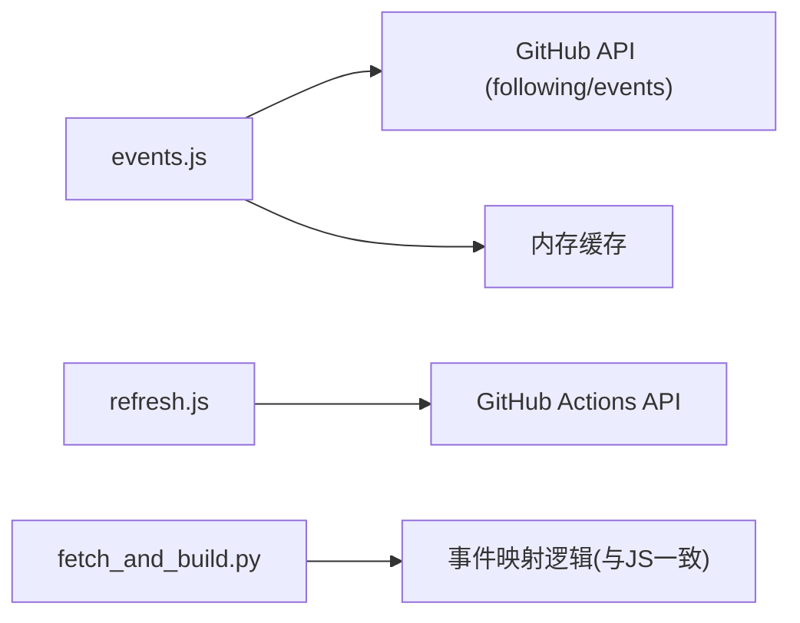

# GitHub事件处理API

<cite>
**本文引用的文件**
- [api/events.js](file://api/events.js)
- [api/refresh.js](file://api/refresh.js)
- [README.md](file://README.md)
- [docs/superpowers/plans/2026-08-15-starhub-realtime.md](file://docs/superpowers/plans/2026-08-15-starhub-realtime.md)
- [fetch_and_build.py](file://fetch_and_build.py)
</cite>

## 目录
1. [简介](#简介)
2. [项目结构](#项目结构)
3. [核心组件](#核心组件)
4. [架构总览](#架构总览)
5. [详细组件分析](#详细组件分析)
6. [依赖关系分析](#依赖关系分析)
7. [性能考量](#性能考量)
8. [故障排查指南](#故障排查指南)
9. [结论](#结论)
10. [附录](#附录)

## 简介
本文件为“GitHub事件处理API”的权威文档，聚焦于仓库中用于聚合与展示GitHub动态的接口实现。当前代码库并未提供接收GitHub Webhook推送的端点；相反，系统通过轮询GitHub公开事件流（用户关注列表 + 各用户的public events）来聚合近24小时内的Star、Fork、Issue等事件，并以统一的JSON格式返回给前端渲染。本文档将围绕以下主题展开：
- API端点说明与请求/响应约定
- 事件类型识别与payload解析策略
- 数据转换、业务逻辑与状态同步
- 错误处理策略：无效事件过滤、失败降级与重试思路
- 与其他系统的集成方式与最佳实践

## 项目结构
本项目采用“按功能划分”的组织方式，API层位于 api/ 目录下，每个文件对应一个独立的Vercel Serverless函数。与GitHub事件聚合相关的核心文件如下：
- api/events.js：聚合关注用户的公开事件，过滤近24小时窗口，映射为统一条目并缓存返回
- api/refresh.js：触发远端GitHub Actions工作流的中间件（非Webhook接收）
- fetch_and_build.py：Python侧的事件聚合脚本，与JS版本保持行为一致（用于构建静态页面或离线处理）
- docs/superpowers/plans/2026-08-15-starhub-realtime.md：实时更新计划文档，包含相关设计背景与扩展点

图表来源
- [api/events.js:114-160](file://api/events.js#L114-L160)
- [api/refresh.js:12-64](file://api/refresh.js#L12-L64)

章节来源
- [README.md:1-22](file://README.md#L1-L22)
- [api/events.js:1-161](file://api/events.js#L1-L161)
- [api/refresh.js:1-65](file://api/refresh.js#L1-L65)

## 核心组件
- 事件聚合函数（/api/events）
  - 职责：获取关注列表，并发拉取各用户的公开事件，过滤近24小时窗口，映射为标准条目，排序后返回
  - 关键特性：CORS白名单、方法校验、令牌校验、内存缓存、并发控制、失败静默跳过
- 刷新触发器（/api/refresh）
  - 职责：在受控条件下触发远端GitHub Actions工作流（update.yml），用于重新生成静态页面
  - 关键特性：Origin白名单或X-Refresh-Key校验、POST限制、上游错误封装

章节来源
- [api/events.js:1-161](file://api/events.js#L1-L161)
- [api/refresh.js:1-65](file://api/refresh.js#L1-L65)

## 架构总览
整体流程以“轮询+聚合”为主，而非“Webhook推送”。前端定时或按需调用/api/events，后端从GitHub公开事件流拉取数据，进行时间窗口过滤与事件类型映射，最终输出统一结构供前端渲染。同时提供/api/refresh作为受控触发器，用于手动或定时重建静态内容。

图表来源
- [api/events.js:114-160](file://api/events.js#L114-L160)
- [api/refresh.js:12-64](file://api/refresh.js#L12-L64)

## 详细组件分析

### 事件聚合接口 /api/events
- 入口与访问控制
  - 仅支持GET与OPTIONS预检；非白名单Origin直接拒绝
  - 需要配置环境变量GH_TOKEN，否则返回500
- 缓存机制
  - 内存缓存TTL为10分钟；命中则直接返回，减少GitHub API压力
- 数据拉取与并发
  - 先拉取关注列表（分页至多5页）
  - 每批并发度为3，使用Promise.allSettled保证部分失败不影响整体
  - 单个用户事件拉取失败时静默跳过，避免级联失败
- 时间窗口与事件映射
  - 使用北京时间计算“今天/昨天”，过滤近24小时窗口
  - 事件类型映射包括：创建仓库(CreateEvent)、收藏(WatchEvent.started)、关注(FollowEvent)、PR(PullRequestEvent.opened)、发布(ReleaseEvent.published)、公开(PublicEvent)、推送(PushEvent.size>0)
- 输出结构
  - updated_at：更新时间（北京时间）
  - window：固定为“24h”
  - items：事件条目数组，每项包含kind、actor、repo、time、day、date、url等字段

图表来源
- [api/events.js:114-160](file://api/events.js#L114-L160)
- [api/events.js:55-112](file://api/events.js#L55-L112)

章节来源
- [api/events.js:1-161](file://api/events.js#L1-L161)

### 刷新触发器 /api/refresh
- 入口与访问控制
  - 仅支持POST与OPTIONS预检；允许白名单Origin或通过X-Refresh-Key认证
  - 缺少必要参数或认证失败返回403
- 触发逻辑
  - 调用GitHub Actions的workflow_dispatch接口，触发update.yml（ref=main）
  - 成功返回200，失败封装为通用错误信息，避免泄露上游细节
- 用途
  - 配合定时任务或外部服务（如cron-job.org）定期重建静态页面

图表来源
- [api/refresh.js:12-64](file://api/refresh.js#L12-L64)

章节来源
- [api/refresh.js:1-65](file://api/refresh.js#L1-L65)

### 事件类型与payload解析
- 支持的GitHub事件类型与筛选条件
  - CreateEvent：当ref_type为repository时视为“创建仓库”
  - WatchEvent：当action为started时视为“收藏”
  - FollowEvent：记录关注目标
  - PullRequestEvent：当action为opened时视为“新PR”
  - ReleaseEvent：当action为published时视为“发布新版本”
  - PublicEvent：标记项目公开
  - PushEvent：当size>0时记录推送规模
- payload解析要点
  - 统一提取actor.login、repo.name、created_at等基础字段
  - 针对不同类型从payload中提取特定字段（如pull_request.title、release.tag_name等）
  - 对缺失字段提供默认值，确保输出稳定

章节来源
- [api/events.js:66-112](file://api/events.js#L66-L112)
- [fetch_and_build.py:513-557](file://fetch_and_build.py#L513-L557)

### 数据转换与状态同步
- 时间处理
  - 使用UTC时间戳转换为北京时间，便于“今天/昨天”判断
  - 格式化输出为YYYY-MM-DD HH:mm形式
- 数据结构
  - 统一输出items数组，每项包含kind、actor、repo、time、day、date、url等
  - 不同kind对应不同语义（如star、pr、release、push等）
- 状态同步
  - 前端可基于updated_at与window字段判断数据新鲜度
  - 结合缓存TTL与前端轮询策略，实现低开销的实时体验

章节来源
- [api/events.js:25-39](file://api/events.js#L25-L39)
- [api/events.js:150-156](file://api/events.js#L150-L156)

## 依赖关系分析
- 外部依赖
  - GitHub API：用于拉取关注列表与公开事件
  - Vercel环境：提供Serverless运行时与环境变量注入
- 内部依赖
  - 事件聚合逻辑集中在events.js，refresh.js独立负责触发工作流
  - Python脚本fetch_and_build.py与JS版本保持行为一致，便于离线或构建阶段复用

图表来源
- [api/events.js:41-63](file://api/events.js#L41-L63)
- [api/refresh.js:40-60](file://api/refresh.js#L40-L60)
- [fetch_and_build.py:513-557](file://fetch_and_build.py#L513-L557)

章节来源
- [api/events.js:1-161](file://api/events.js#L1-L161)
- [api/refresh.js:1-65](file://api/refresh.js#L1-L65)
- [fetch_and_build.py:513-557](file://fetch_and_build.py#L513-L557)

## 性能考量
- 缓存策略
  - 内存缓存TTL为10分钟，显著降低GitHub API调用频率
  - 前端建议每30分钟轮询一次，进一步减少后端压力
- 并发控制
  - 关注用户分批并发（每批3个），避免瞬时高负载
  - 使用Promise.allSettled容忍部分失败，提升整体可用性
- 时间窗口优化
  - 仅拉取近24小时事件，减少数据处理量
  - 单用户事件最多翻页2次，避免无限拉取
- 资源限制
  - 设置超时信号（AbortSignal.timeout）防止长时间阻塞
  - 严格限制HTTP请求头与User-Agent，符合GitHub API规范

[本节为通用性能指导，不直接分析具体文件]

## 故障排查指南
- 常见错误与处理
  - GH_TOKEN未配置：返回500，需检查环境变量
  - Origin不在白名单：返回403，需更新ALLOWED_ORIGINS
  - GitHub API不可用：返回502，记录日志并提示上游服务异常
  - 单个用户事件拉取失败：静默跳过，不影响其他用户数据
- 调试建议
  - 检查浏览器控制台网络面板，确认/api/events返回200且包含items
  - 验证缓存是否命中（updated_at是否与预期一致）
  - 对于refresh接口，确认X-Refresh-Key或Origin是否正确
- 重试机制
  - 当前实现未内置指数退避重试，建议在客户端或服务端增加重试逻辑
  - 对于关键路径（如refresh），可结合外部调度器实现重试

章节来源
- [api/events.js:126-160](file://api/events.js#L126-L160)
- [api/refresh.js:29-64](file://api/refresh.js#L29-L64)

## 结论
本项目实现了基于轮询的GitHub事件聚合能力，通过/api/events提供近24小时内的Star、Fork、Issue等事件，并通过/api/refresh支持可控的静态内容重建。虽然未直接接收GitHub Webhook推送，但通过高效的数据拉取、缓存与并发控制，实现了低延迟、高可用的事件展示方案。未来可考虑引入Webhook接收端点，以实现更实时的数据处理与更强的事件驱动能力。

[本节为总结性内容，不直接分析具体文件]

## 附录
- 事件类型映射参考
  - Star：WatchEvent.started
  - Fork：CreateEvent.ref_type=repository（实际为创建仓库，Fork事件未在代码中显式处理）
  - Issue：PullRequestEvent.opened（以PR形式体现）
  - Release：ReleaseEvent.published
  - Push：PushEvent.size>0
- 集成最佳实践
  - 前端轮询间隔建议≥30秒，避免频繁请求
  - 服务端应记录错误日志，便于问题定位
  - 环境变量管理：GH_TOKEN、REFRESH_KEY等敏感信息应通过安全渠道注入

[本节为补充信息，不直接分析具体文件]