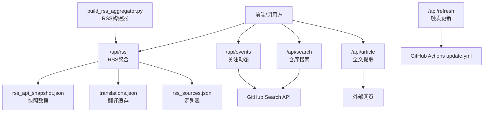
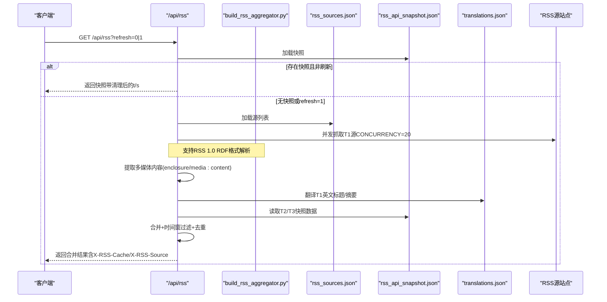
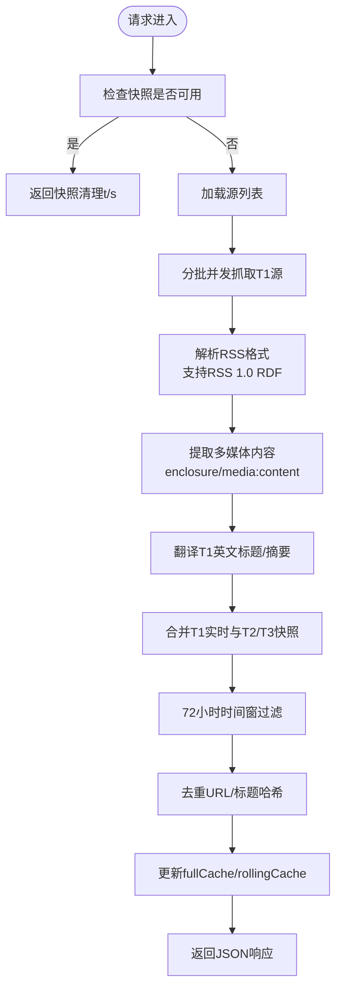
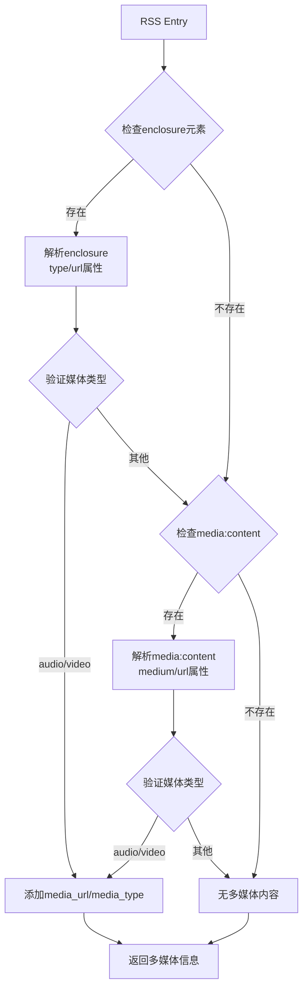
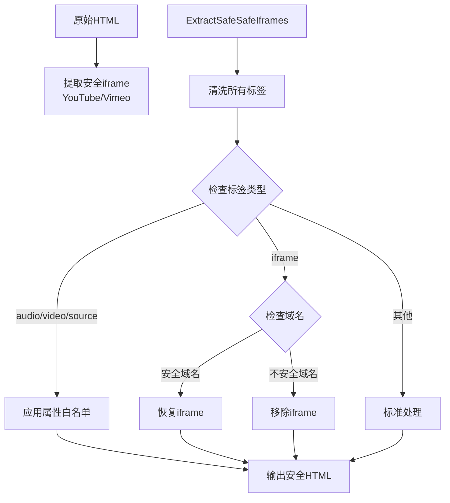
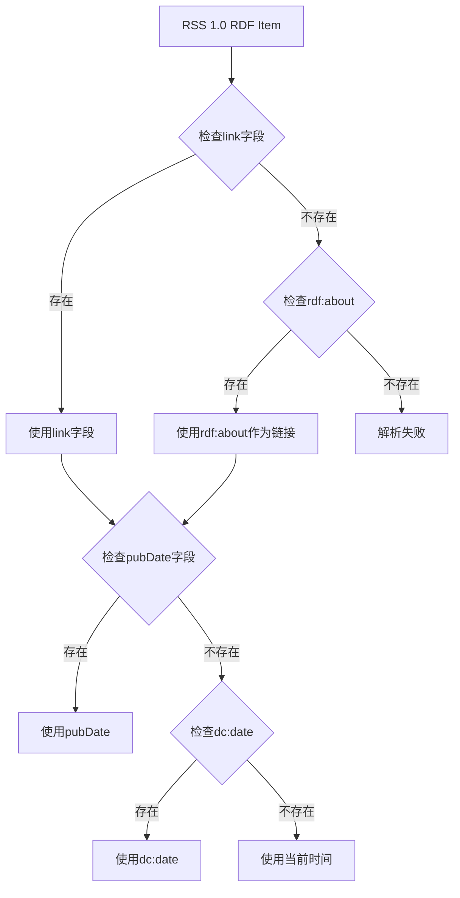
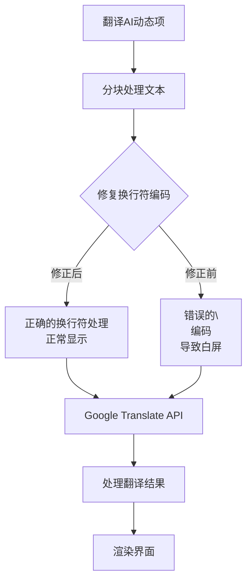
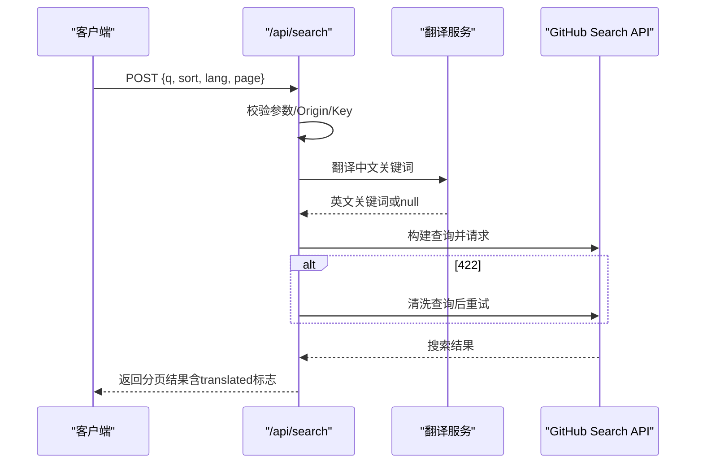
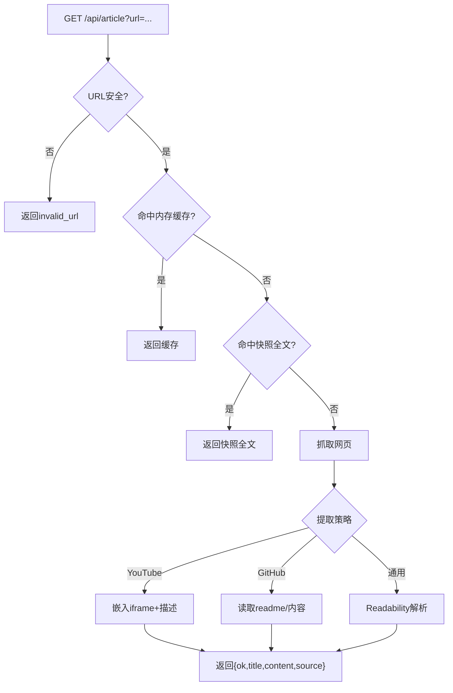
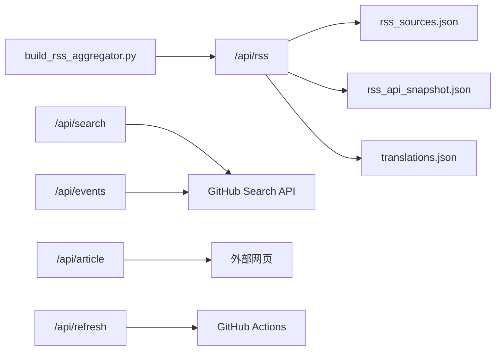

# RSS内容处理API

<cite>
**本文引用的文件**
- [api/rss.js](file://api/rss.js)
- [build_rss_aggregator.py](file://build_rss_aggregator.py)
- [api/search.js](file://api/search.js)
- [api/article.js](file://api/article.js)
- [api/refresh.js](file://api/refresh.js)
- [api/agihunt.js](file://api/agihunt.js)
- [api/events.js](file://api/events.js)
- [README.md](file://README.md)
</cite>

## 更新摘要
**变更内容**
- **新增** RSS API增强了多媒体内容处理能力，支持音频和视频内容的提取与展示
- **新增** extractMediaFromEntry函数，用于从RSS条目中提取enclosure和media:content中的多媒体资源
- **扩展** SAFE_TAGS集合，新增audio、video、source、iframe元素支持
- **新增** SAFE_IFRAME_HOSTS域名验证机制，仅允许YouTube、Vimeo等安全域名的iframe嵌入
- **增强** HTML清洗功能，支持多媒体标签的安全处理和属性白名单控制

## 目录
1. [简介](#简介)
2. [项目结构](#项目结构)
3. [核心组件](#核心组件)
4. [架构总览](#架构总览)
5. [详细组件分析](#详细组件分析)
6. [依赖关系分析](#依赖关系分析)
7. [性能考量](#性能考量)
8. [故障排查指南](#故障排查指南)
9. [结论](#结论)
10. [附录：API使用示例](#附录api使用示例)

## 简介
本仓库提供一组基于 Vercel Serverless 的 API，用于 RSS 内容的聚合、解析、清洗、翻译与展示，并配套 GitHub 仓库搜索、文章全文提取、关注账号动态聚合以及触发构建更新等能力。核心目标包括：
- 统一接入多种 RSS/Atom/RSS 1.0 RDF 源，进行内容提取、格式化、分类与搜索
- **新增** 支持多媒体内容（音频、视频）的提取、清洗和安全展示
- 实现内容去重、缓存策略与增量更新逻辑
- 提供健壮的错误处理与重试机制（如源失效、格式异常、解析失败）
- 支持批量获取、条件过滤与分页查询
- 优化并发请求控制、内存使用与 CDN 缓存策略

## 项目结构
- api/rss.js：RSS 聚合主入口，负责多源抓取、解析、HTML 清洗、翻译、合并与缓存
- build_rss_aggregator.py：RSS 构建器，支持 RSS 1.0 RDF 格式解析和多MB内容处理
- api/search.js：GitHub 仓库搜索代理，支持中文关键词翻译与组合查询
- api/article.js：网页全文提取服务，支持 YouTube、GitHub 及通用页面
- api/refresh.js：触发 GitHub Actions workflow_dispatch，驱动数据更新
- api/agihunt.js：AGI Hunt 资讯代理，带频道白名单与缓存
- api/events.js：关注账号近 24 小时事件聚合，按时间窗口过滤
- README.md：项目说明与自动更新流程



图表来源
- [api/rss.js:1-545](file://api/rss.js#L1-L545)
- [build_rss_aggregator.py:1120-1339](file://build_rss_aggregator.py#L1120-L1339)
- [api/search.js:1-177](file://api/search.js#L1-L177)
- [api/article.js:1-203](file://api/article.js#L1-L203)
- [api/events.js:1-161](file://api/events.js#L1-L161)
- [api/refresh.js:1-65](file://api/refresh.js#L1-L65)

章节来源
- [README.md:1-22](file://README.md#L1-L22)

## 核心组件
- RSS 聚合器（/api/rss）
  - 支持 Atom、RSS 2.0 与 RSS 1.0 RDF 三种格式解析
  - **新增** 多媒体内容提取：支持enclosure和media:content中的音频视频资源
  - HTML 安全清洗与深度广告/推广内容去除
  - **新增** 多媒体标签支持：audio、video、source、iframe元素的安全处理
  - 英文标题/摘要实时翻译（Google/MyMemory 降级）
  - 分层抓取：T1 实时抓取 + T2/T3 从快照读取
  - 滚动缓存与完整响应缓存，支持 refresh 强制刷新
  - 72 小时时间窗过滤与去重（通过 URL/标题哈希）
- 仓库搜索（/api/search）
  - 中文关键词翻译为英文后组合查询
  - 搜索结果内存缓存（10 分钟），翻译结果缓存（1 小时）
  - 分页限制与 422 查询语法重试
- 全文提取（/api/article）
  - 优先命中快照中的 fullContent
  - 针对 YouTube/GitHub 专用提取，通用页面使用 Readability
  - 安全 URL 校验与超时控制
- 关注动态（/api/events）
  - 近 24 小时滚动窗口，7 类事件映射
  - 每用户最多 2 页，批并发 3
- 触发更新（/api/refresh）
  - 通过 GitHub Actions workflow_dispatch 触发构建
- AGI Hunt 代理（/api/agihunt）
  - 频道白名单、参数校验、10 分钟缓存

章节来源
- [api/rss.js:191-275](file://api/rss.js#L191-L275)
- [build_rss_aggregator.py:1120-1339](file://build_rss_aggregator.py#L1120-L1339)
- [api/search.js:31-177](file://api/search.js#L31-L177)
- [api/article.js:15-203](file://api/article.js#L15-L203)
- [api/events.js:55-161](file://api/events.js#L55-L161)
- [api/refresh.js:12-65](file://api/refresh.js#L12-L65)
- [api/agihunt.js:46-113](file://api/agihunt.js#L46-L113)

## 架构总览
RSS 聚合采用"快照优先 + 实时抓取"的分层架构：
- 构建时生成 rss_api_snapshot.json，包含 72 小时累积数据
- 运行时优先返回快照；若需刷新或快照不可用，则对 T1 源进行实时抓取，并与 T2/T3 快照合并
- 翻译模块在 T1 英文源上执行，结果写入 translations.json 缓存
- **新增** 多媒体内容处理：在RSS解析阶段提取enclosure和media:content中的音视频资源
- 滚动缓存保留每个源上次成功抓取的数据，失败时回退旧数据并标记 _stale



图表来源
- [api/rss.js:21-57](file://api/rss.js#L21-L57)
- [api/rss.js:191-275](file://api/rss.js#L191-L275)
- [api/rss.js:203-285](file://api/rss.js#L203-L285)
- [api/rss.js:325-462](file://api/rss.js#L325-L462)
- [build_rss_aggregator.py:1120-1339](file://build_rss_aggregator.py#L1120-L1339)

## 详细组件分析

### RSS 聚合器（/api/rss）
- **更新的** 支持的源类型
  - Atom：解析 <entry>，提取 title/link/summary/published/updated
  - RSS 2.0：解析 <item>，提取 title/link/description/content:encoded/pubDate/dc:date
  - **新增** RSS 1.0 RDF：解析 {http://purl.org/rss/1.0/} 命名空间，支持 rdf:about 链接和 dc:date 日期字段
- **新增** 多媒体内容提取功能
  - extractMediaFromEntry函数：从RSS条目中提取enclosure和media:content中的多媒体资源
  - 支持音频和视频类型的自动识别（audio/*, video/* MIME类型）
  - 提取结果包含media_url和media_type字段，供前端播放器使用
- 内容解析规则
  - stripHtml：移除 CDATA、脚本样式、转义字符、未闭合标签片段
  - sanitizeHtml：仅允许安全标签集合，**新增** audio、video、source、iframe元素支持
  - **新增** SAFE_IFRAME_HOSTS域名验证：仅允许youtube.com、youtu.be、vimeo.com等安全域名
  - deepCleanHtml：移除广告/推广/订阅/二维码/评论等噪音块，压缩空行
  - truncate：摘要截断到 200 字，尽量以句号结尾
- 输出格式
  - 每项包含 t(标题)、u(链接)、s(摘要)、d(发布时间)，可选 fc(全文)
  - **新增** mu(媒体URL)、mt(媒体类型)字段，用于多媒体内容展示
  - 源对象包含 key/name/cat/color/tier/items
- 去重机制
  - 滚动缓存以 source.key 为键，记录 items 与 lastModified
  - 合并阶段通过 URL/标题哈希避免重复条目
- 缓存策略
  - 完整响应缓存 fullCache（TTL 5 分钟），refresh=1 跳过缓存
  - 滚动缓存 rollingCache 保留最近成功抓取结果，失败时回退并标记 _stale
  - 翻译缓存 translations.json 持久化，按 md5(text) 索引
- 增量更新逻辑
  - 日期过滤 cutoff = now - 72h，只保留近期内容
  - T1 实时抓取 + T2/T3 快照合并，保证时效性与稳定性
- 错误处理
  - 单源超时 FETCH_TIMEOUT=5s，失败返回滚动缓存旧数据或空数据并标记 _error
  - 处理器捕获异常返回 500



图表来源
- [api/rss.js:155-199](file://api/rss.js#L155-L199)
- [api/rss.js:191-275](file://api/rss.js#L191-L275)
- [api/rss.js:203-285](file://api/rss.js#L203-L285)
- [api/rss.js:325-462](file://api/rss.js#L325-L462)
- [build_rss_aggregator.py:1120-1339](file://build_rss_aggregator.py#L1120-L1339)

章节来源
- [api/rss.js:59-151](file://api/rss.js#L59-L151)
- [api/rss.js:191-275](file://api/rss.js#L191-L275)
- [api/rss.js:203-285](file://api/rss.js#L203-L285)
- [api/rss.js:289-468](file://api/rss.js#L289-L468)
- [build_rss_aggregator.py:1120-1339](file://build_rss_aggregator.py#L1120-L1339)

### 多媒体内容处理增强
**新增功能** RSS API多媒体内容处理能力
- extractMediaFromEntry函数：智能提取RSS条目中的多媒体资源
- 支持enclosure元素：解析type和url属性，识别audio/video类型
- 支持media:content元素：解析medium属性和URL，支持audio/video类型
- 多媒体信息集成：将提取的媒体URL和类型添加到RSS项中



图表来源
- [api/rss.js:191-214](file://api/rss.js#L191-L214)
- [build_rss_aggregator.py:1149-1166](file://build_rss_aggregator.py#L1149-L1166)

章节来源
- [api/rss.js:191-214](file://api/rss.js#L191-L214)
- [build_rss_aggregator.py:1149-1166](file://build_rss_aggregator.py#L1149-L1166)

### HTML安全清洗增强
**新增功能** 多媒体标签支持和iframe域名验证
- SAFE_TAGS扩展：新增audio、video、source、iframe元素支持
- SAFE_IFRAME_HOSTS域名验证：仅允许youtube.com、youtu.be、vimeo.com等安全域名
- 多媒体标签属性白名单：
  - audio: src, controls, preload
  - video: src, controls, preload, poster, width, height
  - source: src, type
  - iframe: src, width, height, frameborder, allowfullscreen
- 安全的iframe处理：提取安全iframe占位符，清洗后还原



图表来源
- [api/rss.js:89-157](file://api/rss.js#L89-L157)
- [build_rss_aggregator.py:1123-1230](file://build_rss_aggregator.py#L1123-L1230)

章节来源
- [api/rss.js:89-157](file://api/rss.js#L89-L157)
- [build_rss_aggregator.py:1123-1230](file://build_rss_aggregator.py#L1123-L1230)

### RSS 1.0 RDF 格式解析增强
**新增功能** RSS 1.0 RDF 格式支持
- 命名空间识别：{http://purl.org/rss/1.0/}
- 链接提取：支持 rdf:about 属性作为链接源
- 日期提取：支持 dc:date 字段作为发布日期
- 内容提取：支持 content:encoded 模块内容



图表来源
- [build_rss_aggregator.py:1466-1485](file://build_rss_aggregator.py#L1466-L1485)

章节来源
- [build_rss_aggregator.py:1445-1485](file://build_rss_aggregator.py#L1445-L1485)

### 翻译API稳定性修复
**重要修复** 解决翻译API调用中的换行符处理问题
- 修复了build_rss_aggregator.py第3382行的翻译API调用
- 修正了chunk.join('\\n')中的换行符编码问题，避免了白屏显示
- 提升了前端AI动态流的翻译功能稳定性
- 确保Google Translate API正确接收多行文本输入



图表来源
- [build_rss_aggregator.py:3375-3396](file://build_rss_aggregator.py#L3375-L3396)

章节来源
- [build_rss_aggregator.py:3375-3396](file://build_rss_aggregator.py#L3375-L3396)

### 仓库搜索（/api/search）
- 输入参数
  - q：关键词（至少 2 字符）
  - sort：best-match|stars|updated（默认 best-match）
  - lang：语言过滤（可选）
  - page：页码（1..34）
- 翻译与查询构建
  - 中文关键词翻译为英文（Google → MyMemory 降级）
  - 构建 "中文 OR 英文" 查询，含空格加引号
- 缓存
  - 搜索结果缓存 TTL 10 分钟（key=q|sort|lang|page）
  - 翻译结果缓存 TTL 1 小时（key=原词）
- 错误处理
  - 422 查询语法：去掉引号与多余空白后重试一次
  - 403/429：返回 503 提示"搜索太频繁"
  - 其他上游错误：返回 502 不泄露细节



图表来源
- [api/search.js:31-91](file://api/search.js#L31-L91)
- [api/search.js:96-177](file://api/search.js#L96-L177)

章节来源
- [api/search.js:1-177](file://api/search.js#L1-L177)

### 全文提取（/api/article）
- 优先级
  - 命中 rss_api_snapshot.json 中的 fullContent（url→content映射）
  - 否则抓取网页，按域名选择提取策略：
    - YouTube：嵌入 iframe + og:description
    - GitHub：读取 #readme/.repository-content/article
    - 通用：Readability 解析正文
- 安全与缓存
  - isSafeUrl：禁止本地/内网/私有地址
  - 内存缓存（最大 500 项，TTL 4 小时）
  - 响应头设置 CDN 友好缓存（public, max-age=14400, s-maxage=86400）



图表来源
- [api/article.js:15-67](file://api/article.js#L15-L67)
- [api/article.js:69-123](file://api/article.js#L69-L123)
- [api/article.js:125-203](file://api/article.js#L125-L203)

章节来源
- [api/article.js:1-203](file://api/article.js#L1-L203)

### 关注动态（/api/events）
- 逻辑
  - 获取关注列表（最多 5 页）
  - 每用户拉取 events/public（最多 2 页）
  - 过滤近 24 小时事件，映射 7 类事件（repo/star/follow/pr/release/public/push）
  - 批并发 3，失败用户静默跳过
- 输出
  - updated_at/window/items，items 包含 kind/actor/repo/title/tag/url/time/day/date

章节来源
- [api/events.js:1-161](file://api/events.js#L1-L161)

### 触发更新（/api/refresh）
- 功能
  - 通过 GitHub API 触发 workflow_dispatch（ref=main）
  - 认证：REFRESH_KEY + GH_TOKEN
  - CORS 白名单 Origin
- 错误处理
  - 未配置 GH_TOKEN：500
  - GitHub API 失败：返回对应状态码（不泄露细节）

章节来源
- [api/refresh.js:1-65](file://api/refresh.js#L1-L65)

### AGI Hunt 代理（/api/agihunt）
- 功能
  - 代理 AGI Hunt Agent API，频道白名单校验
  - 参数 day 支持 YYYY-MM-DD 或 YYYYMMDD，sort new/hot
  - 结果缓存 10 分钟
- 错误处理
  - 上游返回非 2xx：返回状态码与简要详情
  - 网络异常：502

章节来源
- [api/agihunt.js:1-113](file://api/agihunt.js#L1-L113)

## 依赖关系分析
- 模块耦合
  - /api/rss 依赖 rss_sources.json、rss_api_snapshot.json、translations.json
  - /api/search 依赖环境变量 GH_TOKEN、REFRESH_KEY
  - /api/article 依赖 jsdom、@mozilla/readability
  - /api/events 依赖 GH_TOKEN
  - /api/refresh 依赖 GH_TOKEN
  - **新增** build_rss_aggregator.py 依赖 RSS 1.0 RDF 解析库和多MB内容处理
- 外部依赖
  - GitHub API（Search、Events、Actions）
  - Google/MyMemory 翻译服务
  - 外部网页（HTTP/HTTPS）
- 潜在循环依赖
  - 无直接循环依赖，各端点独立



图表来源
- [api/rss.js:21-57](file://api/rss.js#L21-L57)
- [build_rss_aggregator.py:1120-1339](file://build_rss_aggregator.py#L1120-L1339)
- [api/search.js:75-91](file://api/search.js#L75-L91)
- [api/article.js:15-38](file://api/article.js#L15-L38)
- [api/events.js:41-63](file://api/events.js#L41-L63)
- [api/refresh.js:40-54](file://api/refresh.js#L40-L54)

章节来源
- [api/rss.js:21-57](file://api/rss.js#L21-L57)
- [build_rss_aggregator.py:1120-1339](file://build_rss_aggregator.py#L1120-L1339)
- [api/search.js:75-91](file://api/search.js#L75-L91)
- [api/article.js:15-38](file://api/article.js#L15-L38)
- [api/events.js:41-63](file://api/events.js#L41-L63)
- [api/refresh.js:40-54](file://api/refresh.js#L40-L54)

## 性能考量
- 并发控制
  - RSS 抓取 CONCURRENCY=20，批处理降低瞬时压力
  - 关注动态每批并发 3，避免 GitHub API 限流
- 内存使用
  - 滚动缓存 Map 仅保留最近成功数据
  - 全文提取缓存上限 500 项，LRU 淘汰最旧
  - 翻译缓存持久化至 translations.json，减少重复翻译
- CDN 缓存策略
  - RSS 响应设置 public, max-age=300，refresh=1 时 no-store
  - 全文提取设置 s-maxage=86400，利于边缘缓存
- 超时与重试
  - 单源抓取超时 5s，翻译 3s，搜索 15s，全文提取 8s
  - 搜索 422 查询语法清洗后重试一次
- 增量更新
  - 72 小时时间窗过滤，减少无效数据
  - 分层抓取：T1 实时 + T2/T3 快照，平衡时效与成本
- **新增** 多媒体内容处理优化
  - 智能多媒体提取：仅在RSS条目中包含enclosure或media:content时处理
  - 安全的iframe处理：仅提取和还原YouTube/Vimeo等安全域名的iframe
  - 多媒体标签属性白名单：严格控制audio/video/source元素的属性
- **新增** RSS 1.0 RDF 解析优化
  - 智能字段提取：优先使用标准字段，回退到 RDF 属性
  - 命名空间处理：高效识别和处理 {http://purl.org/rss/1.0/} 命名空间
- **新增** 翻译API稳定性优化
  - 修正换行符编码问题，避免白屏显示
  - 提升前端AI动态流翻译功能的可靠性

## 故障排查指南
- RSS 源失效
  - 现象：_error 字段或 _stale 标记
  - 处理：检查滚动缓存，确认源 URL 可达性，调整 FETCH_TIMEOUT
- 内容格式异常
  - 现象：stripHtml/sanitizeHtml/deepCleanHtml 处理后内容过短
  - 处理：检查源 XML 结构，必要时扩展 SAFE_TAGS 或正则规则
- **新增** 多媒体内容提取问题
  - 现象：RSS项中缺少mu(media_url)或mt(media_type)字段
  - 处理：检查RSS源是否正确包含enclosure或media:content元素，验证MIME类型
- **新增** iframe安全验证问题
  - 现象：iframe被意外移除或无法显示
  - 处理：检查iframe的src属性是否指向SAFE_IFRAME_HOSTS允许的域名
- **新增** 多媒体标签处理问题
  - 现象：audio/video/source标签被移除或属性丢失
  - 处理：检查标签是否在SAFE_TAGS集合中，验证属性是否在白名单中
- RSS 1.0 RDF 解析问题
  - 现象：RSS 1.0 格式内容无法正确提取链接或日期
  - 处理：检查 rdf:about 属性和 dc:date 字段是否存在，验证命名空间声明
- 翻译API白屏问题
  - 现象：前端AI动态流显示白屏或翻译失败
  - 处理：检查build_rss_aggregator.py第3382行的换行符编码，确保使用正确的join('\\n')方法
- 解析失败
  - 现象：parseFeed 未匹配到 entry/item
  - 处理：验证源是否为标准 RSS/Atom/RSS 1.0，增加调试日志
- 翻译失败
  - 现象：translations.json 未命中，Google/MyMemory 均失败
  - 处理：检查网络连通性，降级使用原词
- 搜索受限
  - 现象：403/429 返回"搜索太频繁"
  - 处理：降低请求频率，检查 GH_TOKEN 配额
- 全文提取失败
  - 现象：extraction_failed
  - 处理：检查 isSafeUrl 与 Readability 解析结果，考虑添加特定域名适配

章节来源
- [api/rss.js:243-273](file://api/rss.js#L243-L273)
- [api/rss.js:191-214](file://api/rss.js#L191-L214)
- [api/rss.js:89-157](file://api/rss.js#L89-L157)
- [build_rss_aggregator.py:1123-1230](file://build_rss_aggregator.py#L1123-L1230)
- [build_rss_aggregator.py:1466-1485](file://build_rss_aggregator.py#L1466-L1485)
- [build_rss_aggregator.py:3375-3396](file://build_rss_aggregator.py#L3375-L3396)
- [api/search.js:141-153](file://api/search.js#L141-L153)
- [api/article.js:168-201](file://api/article.js#L168-L201)

## 结论
本 RSS 内容处理 API 通过分层抓取、智能清洗、实时翻译与多级缓存，实现了高可用、高性能的内容聚合与展示。配合 GitHub 搜索、全文提取与关注动态，形成完整的知识发现与工作流闭环。**最新的RSS 1.0 RDF格式支持、多媒体内容处理增强和翻译API稳定性修复进一步增强了对多样化RSS源的兼容性和系统可靠性**。建议在生产环境中：
- 合理配置 REFRESH_KEY 与 GH_TOKEN，确保安全性
- 监控滚动缓存命中率与翻译成功率
- 根据流量调整 CONCURRENCY 与 CACHE_TTL
- 定期维护 rss_sources.json 与快照数据
- **新增** 测试RSS 1.0 RDF格式源的兼容性和解析准确性
- **新增** 监控多媒体内容提取功能，确保enclosure和media:content的正确处理
- **新增** 验证iframe安全验证机制，防止恶意域名嵌入
- **新增** 监控翻译API调用稳定性，特别是换行符处理的正确性

## 附录：API使用示例

### RSS 聚合
- 批量获取：GET /api/rss
  - 返回所有源的 items，支持 X-RSS-Cache 头判断缓存命中
  - **新增** 多媒体内容：items可能包含mu(media_url)和mt(media_type)字段
- 条件过滤：前端对 sources[].cat 进行筛选
- 分页查询：RSS 本身不支持分页，可通过前端截取 items 实现
- 刷新：GET /api/rss?refresh=1 强制重新抓取
- **新增** RSS 1.0 RDF 源支持：自动识别并解析 {http://purl.org/rss/1.0/} 格式
- **新增** 多媒体内容展示：前端可使用audio/video标签播放提取的多媒体资源

章节来源
- [api/rss.js:289-468](file://api/rss.js#L289-L468)
- [api/rss.js:191-275](file://api/rss.js#L191-L275)
- [build_rss_aggregator.py:1120-1339](file://build_rss_aggregator.py#L1120-L1339)

### 仓库搜索
- 基本查询：POST /api/search Body: {q: "视频创作", sort: "best-match", lang: "Python", page: 1}
- 排序：sort 支持 best-match|stars|updated
- 分页：page 上限 34，per_page=30

章节来源
- [api/search.js:1-177](file://api/search.js#L1-L177)

### 全文提取
- 获取全文：GET /api/article?url=https://example.com
- 支持 YouTube/GitHub/通用页面，返回 content 与 source

章节来源
- [api/article.js:125-203](file://api/article.js#L125-L203)

### 关注动态
- 获取近 24 小时事件：GET /api/events
- 返回 items 包含 kind/actor/repo/title/tag/url/time/day/date

章节来源
- [api/events.js:114-161](file://api/events.js#L114-L161)

### 触发更新
- 触发构建：POST /api/refresh Headers: X-Refresh-Key: <REFRESH_KEY>
- 成功后可轮询 /api/rss?meta=1 检测新构建

章节来源
- [api/refresh.js:12-65](file://api/refresh.js#L12-L65)

### AGI Hunt 资讯
- 获取频道资讯：GET /api/agihunt?channel=models&day=2026-09-06&sort=hot
- 频道白名单：models/research/coding-agents/products/multimodal/infra/hardware/funding/policy/agi/companies/fun

章节来源
- [api/agihunt.js:46-113](file://api/agihunt.js#L46-L113)

### 多媒体内容使用示例
**新增** 多媒体内容处理和使用
- RSS响应中的多媒体字段：
  - mu: 媒体URL（如音频文件或视频链接）
  - mt: 媒体类型（如audio/mp3、video/mp4）
- 前端播放示例：
  ```javascript
  // 检查是否有多媒体内容
  if (item.mu && item.mt) {
    const mediaElement = document.createElement('audio');
    mediaElement.src = item.mu;
    mediaElement.controls = true;
    // 对于视频使用video标签
  }
  ```
- 支持的媒体类型：
  - 音频：audio/* MIME类型
  - 视频：video/* MIME类型
  - 来自enclosure或media:content元素

章节来源
- [api/rss.js:191-275](file://api/rss.js#L191-L275)
- [api/rss.js:297-307](file://api/rss.js#L297-L307)