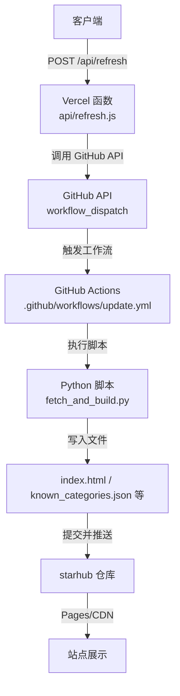
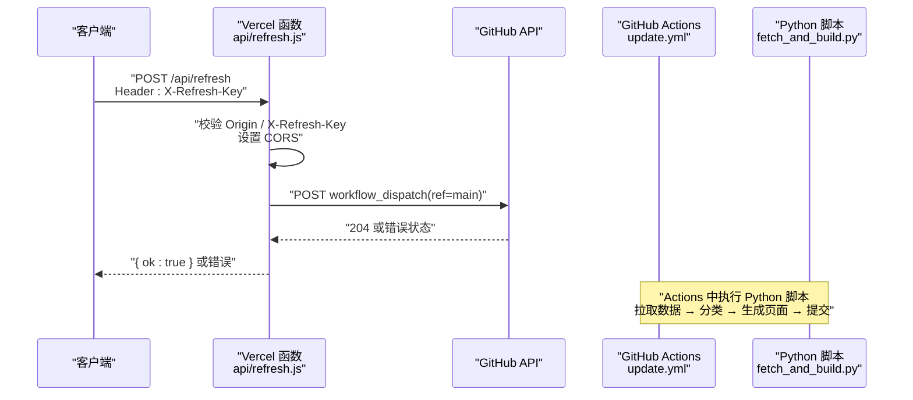
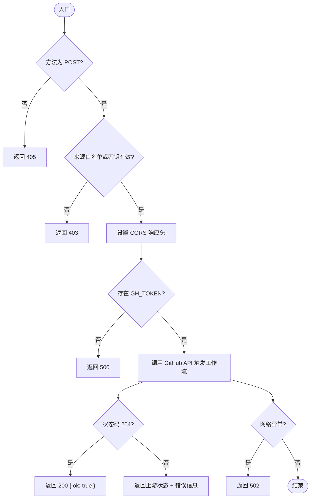
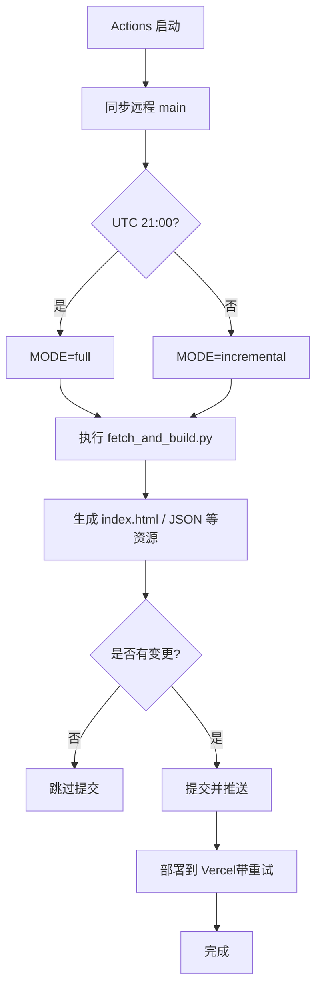
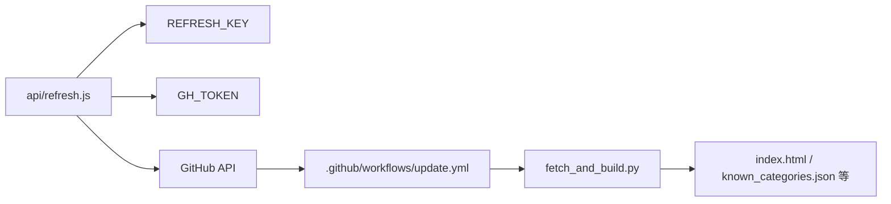

# 数据刷新API

<cite>
**本文引用的文件**
- [api/refresh.js](file://api/refresh.js)
- [.github/workflows/update.yml](file://.github/workflows/update.yml)
- [fetch_and_build.py](file://fetch_and_build.py)
- [vercel.json](file://vercel.json)
- [README.md](file://README.md)
</cite>

## 目录
1. [简介](#简介)
2. [项目结构](#项目结构)
3. [核心组件](#核心组件)
4. [架构总览](#架构总览)
5. [详细组件分析](#详细组件分析)
6. [依赖关系分析](#依赖关系分析)
7. [性能与限流](#性能与限流)
8. [故障排查指南](#故障排查指南)
9. [结论](#结论)
10. [附录：请求与响应规范](#附录请求与响应规范)

## 简介
本接口提供“数据刷新”能力，用于触发 starhub 仓库的 GitHub Actions 工作流更新，从而重新拉取 Star 收藏数据、执行智能分类并生成页面。该接口为 Vercel Serverless Function，通过环境变量进行认证与鉴权，并通过 CORS 白名单限制来源域名。

## 项目结构
- API 层：Vercel Serverless Function 暴露 /api/refresh 端点，负责鉴权、CORS 处理与调用 GitHub Actions Dispatch。
- 构建层：GitHub Actions 定时或手动触发 update.yml，运行 Python 脚本 fetch_and_build.py，完成数据拉取、分类与页面生成。
- 部署配置：vercel.json 定义函数最大执行时长等运行时参数。

图表来源
- [api/refresh.js:12-64](file://api/refresh.js#L12-L64)
- [.github/workflows/update.yml:1-93](file://.github/workflows/update.yml#L1-L93)
- [fetch_and_build.py:1-660](file://fetch_and_build.py#L1-L660)

章节来源
- [README.md:1-22](file://README.md#L1-L22)

## 核心组件
- 刷新接口（api/refresh.js）
  - 职责：校验来源与密钥、设置 CORS、调用 GitHub Actions Dispatch、返回统一结果。
  - 关键行为：
    - 仅允许 POST 方法；OPTIONS 预检按策略放行或拒绝。
    - 支持两种放行条件：Origin 在白名单，或携带正确的 X-Refresh-Key 头并与 REFRESH_KEY 一致。
    - 需要 GH_TOKEN 环境变量以调用 GitHub API。
    - 成功时返回 { ok: true }；失败时返回错误信息。
- 工作流（update.yml）
  - 职责：定时/手动触发后，同步最新代码、决定全量或增量模式、执行 Python 脚本、提交变更并部署到 Vercel。
  - 并发控制：cancel-in-progress:true，确保同一任务只保留最新一次执行。
- 构建脚本（fetch_and_build.py）
  - 职责：拉取 Star 列表、执行智能分类规则、生成 index.html 及相关 JSON 资源，并输出 AI 晨报等。
- 部署配置（vercel.json）
  - 职责：声明各函数的最大执行时长，其中 refresh 函数为 10 秒。

章节来源
- [api/refresh.js:12-64](file://api/refresh.js#L12-L64)
- [.github/workflows/update.yml:1-93](file://.github/workflows/update.yml#L1-L93)
- [fetch_and_build.py:1-660](file://fetch_and_build.py#L1-L660)
- [vercel.json:1-13](file://vercel.json#L1-L13)

## 架构总览
刷新流程从浏览器或服务端发起 POST 请求到 /api/refresh，经鉴权与 CORS 处理后，调用 GitHub Actions Dispatch 触发 update.yml。工作流在 GitHub 环境中执行 Python 脚本，完成数据拉取、分类与页面生成，并提交到仓库，最终由 Pages/Vercel 重新部署。

图表来源
- [api/refresh.js:12-64](file://api/refresh.js#L12-L64)
- [.github/workflows/update.yml:1-93](file://.github/workflows/update.yml#L1-L93)

## 详细组件分析

### 刷新接口（POST /api/refresh）
- 认证与安全
  - 来源白名单：仅允许指定 Origin 访问（比较前统一小写）。
  - 密钥校验：请求需携带 X-Refresh-Key 头，值必须与服务端 REFRESH_KEY 环境变量一致。
  - 若满足任一条件则放行，否则返回 403。
- CORS 配置
  - 对允许的 Origin 设置 Access-Control-Allow-Origin 为具体来源；对密钥放行但非白名单的请求设置为 *。
  - 允许的方法：POST, OPTIONS；允许的头部：Content-Type, X-Refresh-Key。
  - 设置 Vary: Origin 以正确缓存。
- 请求体
  - 无请求体要求；接口不解析 body。
- 执行步骤
  - 检查方法是否为 POST，非 POST 返回 405。
  - 校验来源与密钥，不通过返回 403。
  - 读取 GH_TOKEN 环境变量，未配置返回 500。
  - 调用 GitHub API 触发 update.yml 工作流（ref=main）。
  - 根据上游返回状态码返回 200（{ ok: true }）或对应错误。
  - 捕获异常返回 502（上游服务不可用）。
- 超时与并发
  - 函数最大执行时长在 vercel.json 中设置为 10 秒，适合轻量转发场景。

图表来源
- [api/refresh.js:12-64](file://api/refresh.js#L12-L64)
- [vercel.json:1-13](file://vercel.json#L1-L13)

章节来源
- [api/refresh.js:12-64](file://api/refresh.js#L12-L64)
- [vercel.json:1-13](file://vercel.json#L1-L13)

### 工作流与构建（update.yml 与 fetch_and_build.py）
- 触发方式
  - 定时：凌晨全量构建与白天多次增量构建。
  - 手动：workflow_dispatch（由 /api/refresh 触发）。
- 构建模式
  - 根据 UTC 时间判断 full/incremental 模式，减少不必要的全量开销。
- 数据处理
  - 使用 Python 脚本拉取 Star 列表、执行智能分类规则、生成 index.html 与相关 JSON 资源。
- 提交与部署
  - 有变更则提交并 push；包含 force-with-lease 安全网与重试逻辑。
  - 部署到 Vercel，带退避重试机制。

图表来源
- [.github/workflows/update.yml:1-93](file://.github/workflows/update.yml#L1-L93)
- [fetch_and_build.py:1-660](file://fetch_and_build.py#L1-L660)

章节来源
- [.github/workflows/update.yml:1-93](file://.github/workflows/update.yml#L1-L93)
- [fetch_and_build.py:1-660](file://fetch_and_build.py#L1-L660)

## 依赖关系分析
- 外部依赖
  - GitHub API：用于触发工作流。
  - Vercel 平台：托管 Serverless 函数与部署产物。
- 内部依赖
  - api/refresh.js 依赖环境变量 REFRESH_KEY、GH_TOKEN。
  - update.yml 依赖 Python 环境与 fetch_and_build.py。
  - fetch_and_build.py 依赖标准库与仓库内已知分类映射。

图表来源
- [api/refresh.js:12-64](file://api/refresh.js#L12-L64)
- [.github/workflows/update.yml:1-93](file://.github/workflows/update.yml#L1-L93)
- [fetch_and_build.py:1-660](file://fetch_and_build.py#L1-L660)

章节来源
- [api/refresh.js:12-64](file://api/refresh.js#L12-L64)
- [.github/workflows/update.yml:1-93](file://.github/workflows/update.yml#L1-L93)
- [fetch_and_build.py:1-660](file://fetch_and_build.py#L1-L660)

## 性能与限流
- 函数执行时长
  - refresh 函数最大执行时长为 10 秒，适合快速转发场景。
- GitHub API 限流
  - 当前实现未内置 429 重试与指数退避；如遇限流，建议在上游（Actions 或后续扩展）增加重试与退避策略。
- 并发与取消
  - Actions 使用 cancel-in-progress:true，避免重复构建冲突。
- 缓存
  - 接口未设置 Cache-Control；如需缓存可结合 CDN 策略。

[本节为通用指导，不直接分析具体文件]

## 故障排查指南
- 常见错误与定位
  - 403 Forbidden：来源不在白名单且未携带正确 X-Refresh-Key；或密钥不匹配。
  - 405 Method Not Allowed：非 POST 请求。
  - 500 未配置 GH_TOKEN：检查 Vercel 环境变量是否已设置。
  - 502 上游服务不可用：GitHub API 网络异常或不可达。
  - 其他状态码：来自 GitHub API 的错误（如 401/403/404/422/429），接口会原样返回状态码与错误消息。
- 日志与监控
  - 接口注释说明：GitHub 错误细节不会回显给调用者，详情由 Vercel 日志记录。建议在 Vercel 控制台查看函数日志与请求链路。
- 建议改进
  - 增加 429 重试与指数退避，提升鲁棒性。
  - 增加结构化日志（请求 ID、耗时、上游状态码），便于追踪。
  - 对敏感错误信息进行脱敏，避免泄露仓库或令牌信息。

章节来源
- [api/refresh.js:12-64](file://api/refresh.js#L12-L64)

## 结论
/api/refresh 是一个轻量、安全的刷新入口，通过严格的来源与密钥校验保护后端资源，并将刷新任务委派给 GitHub Actions 执行。配合 update.yml 与 fetch_and_build.py，实现了“触发—构建—部署”的完整闭环。建议在生产环境补充限流重试、结构化日志与更细粒度的监控指标，以提升稳定性与可观测性。

[本节为总结，不直接分析具体文件]

## 附录：请求与响应规范

- 端点与方法
  - POST /api/refresh
- 请求头
  - Content-Type: application/json（可选，接口不解析 body）
  - X-Refresh-Key: 与 REFRESH_KEY 一致的字符串（当来源不在白名单时必须提供）
- 请求体
  - 无要求
- 响应体
  - 成功：{ ok: true }
  - 失败：{ error: "错误描述" }
- 状态码
  - 200：刷新触发成功
  - 403：来源未授权或缺少/错误的密钥
  - 405：方法不允许
  - 500：GH_TOKEN 未配置
  - 502：上游服务不可用
  - 其他：来自 GitHub API 的状态码（如 401/403/404/422/429）

章节来源
- [api/refresh.js:12-64](file://api/refresh.js#L12-L64)