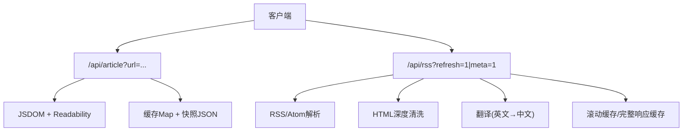
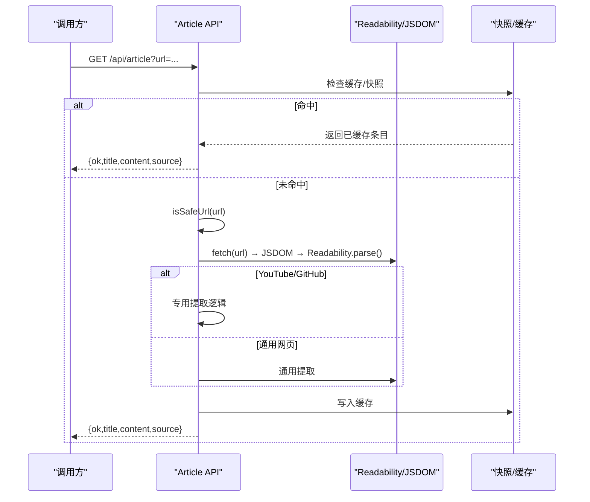
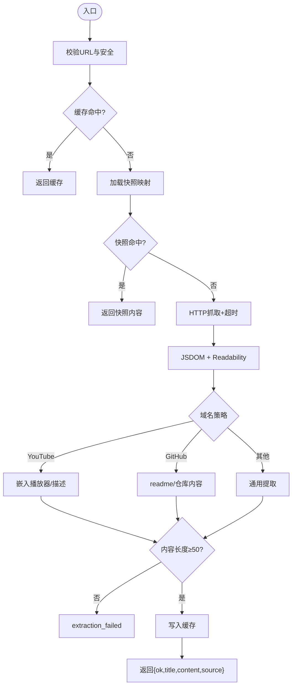
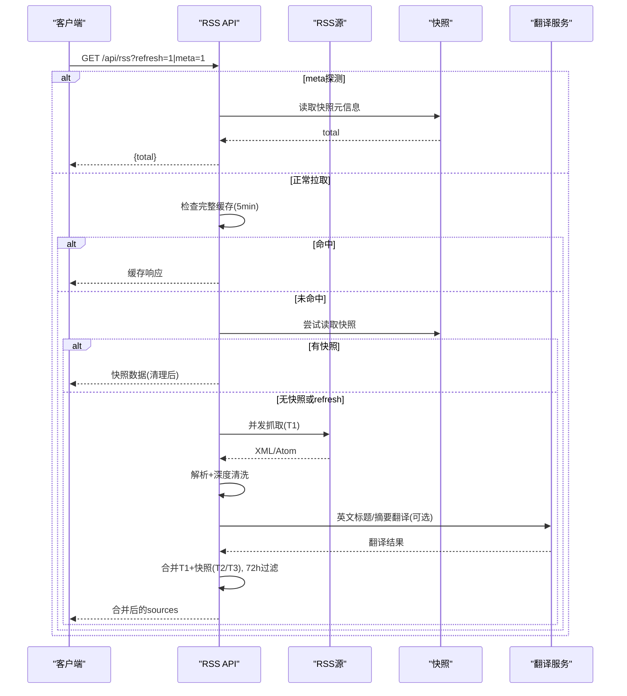
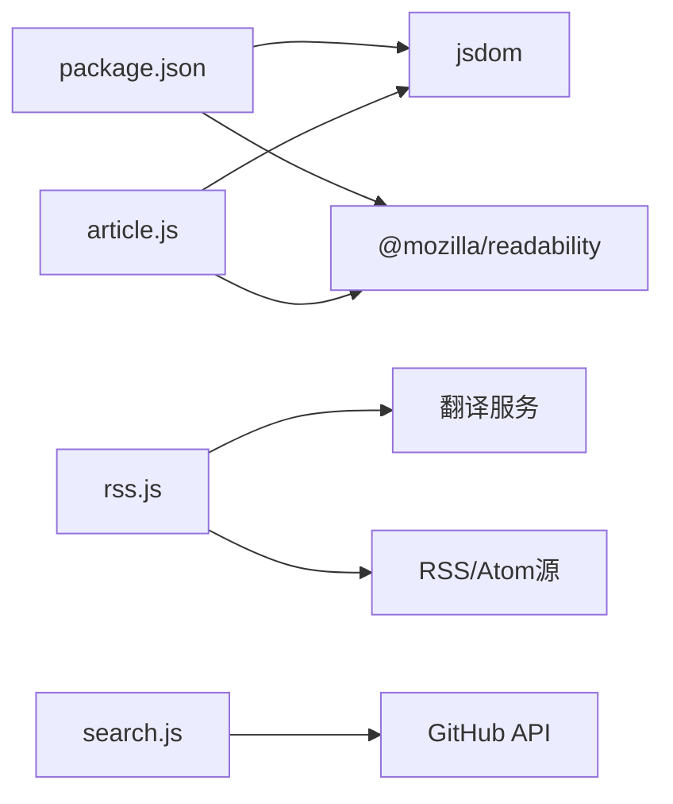

# 文章内容提取API

<cite>
**本文引用的文件**
- [api/article.js](file://api/article.js)
- [api/rss.js](file://api/rss.js)
- [api/search.js](file://api/search.js)
- [package.json](file://package.json)
- [README.md](file://README.md)
</cite>

## 目录
1. [简介](#简介)
2. [项目结构](#项目结构)
3. [核心组件](#核心组件)
4. [架构总览](#架构总览)
5. [详细组件分析](#详细组件分析)
6. [依赖关系分析](#依赖关系分析)
7. [性能与优化](#性能与优化)
8. [故障排查指南](#故障排查指南)
9. [结论](#结论)
10. [附录：API使用示例](#附录api使用示例)

## 简介
本项目提供“文章内容提取API”，用于从各类网页源（博客、新闻网站、技术文档、视频站点等）抓取并清洗页面内容，输出标准化的文章正文。其核心能力包括：
- HTML解析与主内容识别（基于 Mozilla Readability）
- 广告与噪音去除、链接与图片处理
- 多语言支持（中英文自动检测与适配）
- 内容格式化选项（HTML正文、纯文本摘要、结构化数据）
- 批量提取与质量评估（通过RSS聚合接口与快照机制）
- 并发控制、缓存机制与错误恢复

该API以Vercel Serverless Functions形式部署，配合构建时生成的快照数据，实现高可用与高性能的内容获取。

## 项目结构
- api/article.js：单页URL的文章提取服务，支持YouTube、GitHub与通用网页
- api/rss.js：RSS/Atom聚合服务，负责多源抓取、深度清洗、翻译与合并
- api/search.js：跨语言仓库搜索（辅助能力，非本文重点）
- package.json：声明JS DOM与Readability依赖
- README.md：项目说明与更新流程

图表来源
- [api/article.js:1-203](file://api/article.js#L1-L203)
- [api/rss.js:1-468](file://api/rss.js#L1-L468)

章节来源
- [README.md:1-22](file://README.md#L1-L22)
- [package.json:1-9](file://package.json#L1-L9)

## 核心组件
- 文章提取器（article.js）
  - 安全URL校验、超时控制、UA设置
  - 专用提取：YouTube、GitHub；通用提取：Readability
  - 内存缓存与快照内容回退
- RSS聚合器（rss.js）
  - 多源并发抓取、XML/Atom解析
  - HTML深度清洗（广告、推广、二维码、订阅引导等）
  - 英文源标题/摘要的自动翻译（Google/MyMemory）
  - 分层策略：T1实时抓取，T2/T3快照读取
  - 滚动缓存与完整响应缓存，时间窗口过滤（72小时）
- 搜索（search.js）
  - 中文关键词自动翻译为英文，组合查询
  - 结果缓存与限流保护

章节来源
- [api/article.js:1-203](file://api/article.js#L1-L203)
- [api/rss.js:1-468](file://api/rss.js#L1-L468)
- [api/search.js:1-177](file://api/search.js#L1-L177)

## 架构总览

图表来源
- [api/article.js:55-203](file://api/article.js#L55-L203)

## 详细组件分析

### 文章提取API（/api/article）
- 输入参数
  - url: 字符串，目标网页地址（仅http/https，禁止内网/本地）
- 处理流程
  - CORS预检与头设置
  - URL合法性与安全校验
  - 缓存命中直接返回
  - 加载快照内容映射（rss_api_snapshot.json），命中则返回
  - 发起HTTP请求（带超时与UA），解析DOM
  - 根据域名选择提取策略：
    - YouTube：嵌入播放器与描述
    - GitHub：优先readme或仓库内容区域
    - 通用：Readability提取主内容，失败回退到meta description
  - 内容长度阈值过滤（至少50字符）
  - 写入缓存并返回标准化结果
- 输出结构
  - ok: boolean
  - url: string
  - title: string
  - content: string（HTML片段）
  - source: string（youtube/github/readability/meta）
- 错误码
  - missing_url、invalid_url、timeout、fetch_failed、extraction_failed

图表来源
- [api/article.js:55-203](file://api/article.js#L55-L203)

章节来源
- [api/article.js:1-203](file://api/article.js#L1-L203)

### RSS聚合与内容清洗（/api/rss）
- 功能要点
  - 支持RSS/Atom格式，解析title/link/summary/content:encoded/pubDate
  - 深度HTML清洗：移除广告、推广、二维码、订阅、评论、分页、footer-links等噪声
  - 白名单标签过滤，移除危险脚本/样式/iframe/form
  - 英文源标题/摘要自动翻译（Google/MyMemory），失败降级
  - 分层抓取：T1实时抓取，T2/T3从快照读取
  - 滚动缓存（每源上次成功数据）、完整响应缓存（5分钟）
  - 时间窗口过滤：仅保留最近72小时条目
- 输出结构（节选）
  - t: 时间戳
  - sources: [{key,name,cat,color,tier,items:[{t,s,d,fc?}]}]
  - meta端点：?meta=1 返回总条数（轻量探测）
- 错误与降级
  - 单源失败返回旧数据并标记_stale
  - 无缓存时返回空列表并标记_error

图表来源
- [api/rss.js:15-468](file://api/rss.js#L15-L468)

章节来源
- [api/rss.js:1-468](file://api/rss.js#L1-L468)

### 搜索API（/api/search）
- 用途：跨语言GitHub仓库搜索（辅助能力）
- 流程：中文→英文翻译（Google/MyMemory）→组合查询→缓存结果
- 防护：CORS白名单、X-Search-Key鉴权、限流友好提示
- 输出：query、translated、page、total、items（精简字段）

章节来源
- [api/search.js:1-177](file://api/search.js#L1-L177)

## 依赖关系分析
- 运行时依赖
  - jsdom：在Node环境中模拟浏览器DOM，供Readability解析
  - @mozilla/readability：主内容提取算法，识别文章主体、去除导航/广告
- 外部依赖
  - 各RSS/Atom源（博客、新闻、技术社区）
  - 翻译服务（Google Translate、MyMemory）
  - GitHub API（搜索、事件、Actions触发）

图表来源
- [package.json:1-9](file://package.json#L1-L9)
- [api/article.js:1-203](file://api/article.js#L1-L203)
- [api/rss.js:1-468](file://api/rss.js#L1-L468)
- [api/search.js:1-177](file://api/search.js#L1-L177)

章节来源
- [package.json:1-9](file://package.json#L1-L9)

## 性能与优化
- 并发控制
  - RSS聚合采用分批并发（默认20路），降低整体延迟
  - 关注动态聚合按用户批并发（默认3路），避免上游限流
- 缓存机制
  - 文章提取：内存Map缓存（最大500项，TTL 4小时），结合快照内容映射
  - RSS聚合：滚动缓存（每源上次成功数据）、完整响应缓存（5分钟）
  - 搜索：搜索结果缓存10分钟，翻译结果缓存1小时
- 超时与降级
  - 抓取超时（文章8s，RSS 5s，搜索15s），失败时返回旧数据或空列表
  - 翻译失败降级为原文
- 内容质量
  - 最小内容长度阈值（≥50字符）过滤低质量结果
  - 72小时时间窗口过滤，保证时效性
- 网络与资源
  - 合理User-Agent与Accept头，提升兼容性
  - 快照数据减少重复抓取，降低带宽与延迟

[本节为通用性能建议，不直接分析具体代码行]

## 故障排查指南
- 常见错误
  - missing_url：缺少url参数
  - invalid_url：非法或内网URL被拒绝
  - timeout/fetch_failed：网络超时或请求失败
  - extraction_failed：无法提取有效内容（过短或解析失败）
  - 上游不可用：GitHub API限流或服务异常
- 定位方法
  - 检查CORS与预检请求是否通过
  - 确认URL可访问且为http/https
  - 查看日志中的快照加载情况与缓存命中率
  - 对RSS源进行单独验证（XML/Atom格式是否正确）
- 恢复策略
  - 重试请求（指数退避）
  - 切换翻译端点（Google→MyMemory）
  - 使用快照数据作为兜底

章节来源
- [api/article.js:125-203](file://api/article.js#L125-L203)
- [api/rss.js:203-273](file://api/rss.js#L203-L273)
- [api/search.js:129-176](file://api/search.js#L129-L176)

## 结论
本API通过“实时抓取+快照回退”的双层架构，结合Readability主内容识别与深度HTML清洗，稳定地从多种网页源提取高质量文章。内置缓存、并发控制与翻译适配，满足中英文内容的自动化处理需求。对于批量场景，可通过RSS聚合接口高效获取与过滤内容；对于单页场景，文章提取API提供简洁易用的端点。

[本节为总结性内容，不直接分析具体代码行]

## 附录：API使用示例

### 文章提取
- 端点：GET /api/article
- 参数：url（必填）
- 示例：
  - https://your-domain/api/article?url=https://example.com/blog/post
- 成功响应：
  - { ok: true, url, title, content, source }
- 失败响应：
  - { ok: false, error: "missing_url" | "invalid_url" | "timeout" | "fetch_failed" | "extraction_failed" }

章节来源
- [api/article.js:125-203](file://api/article.js#L125-L203)

### RSS聚合
- 端点：GET /api/rss
- 参数：
  - refresh=1：强制刷新（跳过缓存）
  - meta=1：仅返回快照总条数（轻量探测）
- 示例：
  - https://your-domain/api/rss?refresh=1
  - https://your-domain/api/rss?meta=1
- 成功响应：
  - { t, sources: [{ key, name, cat, color, tier, items: [...] }] }
- 失败/降级：
  - _stale: true（旧数据）
  - _error: "..."（错误信息）

章节来源
- [api/rss.js:289-468](file://api/rss.js#L289-L468)

### 搜索（辅助）
- 端点：POST /api/search
- 头部：X-Search-Key（需与服务端配置一致）
- 请求体：{ q, sort?, lang?, page? }
- 示例：
  - POST /api/search
  - Body: { q: "视频创作", sort: "stars", lang: "Python", page: 1 }
- 成功响应：
  - { query, translated, page, total, items: [...] }

章节来源
- [api/search.js:96-176](file://api/search.js#L96-L176)