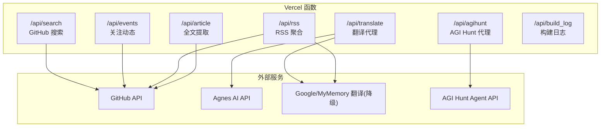
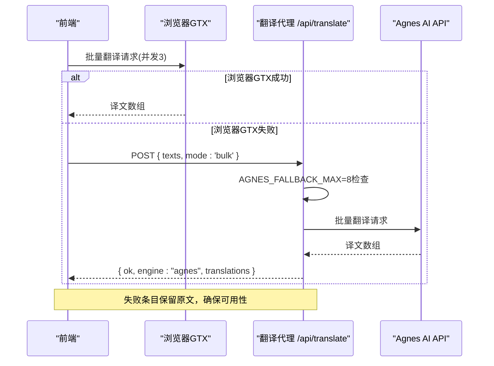
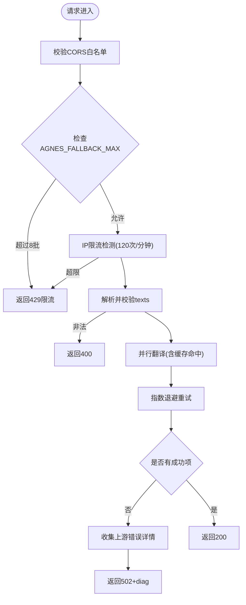
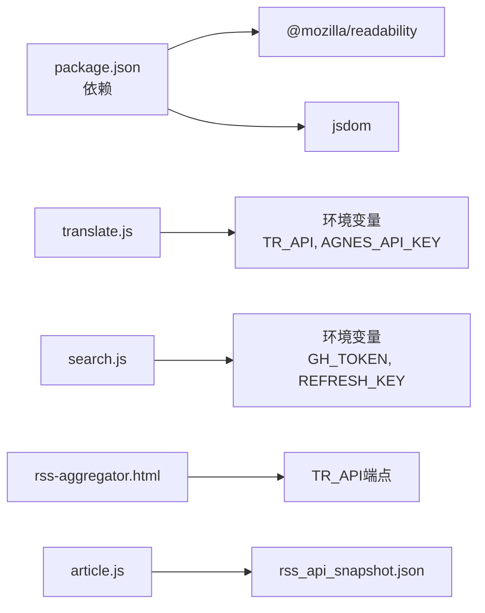

# 翻译API服务

<cite>
**本文引用的文件**
- [vercel.json](file://vercel.json)
- [README.md](file://README.md)
- [api/search.js](file://api/search.js)
- [.github/workflows/sync-agnes-env.yml](file://.github/workflows/sync-agnes-env.yml)
- [rss-aggregator.html](file://rss-aggregator.html)
- [build_rss_aggregator.py](file://build_rss_aggregator.py)
</cite>

## 更新摘要
**变更内容**
- **新增AGNES_FALLBACK_MAX=8配置支持**：作为v2架构的备用通道，增强速率限制和错误处理机制
- **优化批量翻译策略**：每批15条、最多8批（120条），覆盖AIHOT+AGI全量场景
- **改进降级机制**：浏览器端GTX主力 + 服务端兜底的双通道策略，提升翻译成功率
- **统一环境变量配置**：TR_API端点统一管理，简化前端集成

## 目录
1. [简介](#简介)
2. [项目结构](#项目结构)
3. [核心组件](#核心组件)
4. [架构总览](#架构总览)
5. [详细组件分析](#详细组件分析)
6. [依赖关系分析](#依赖关系分析)
7. [性能考量](#性能考量)
8. [故障排查指南](#故障排查指南)
9. [结论](#结论)
10. [附录](#附录)

## 简介
本项目提供一组 Vercel Serverless API，围绕"翻译"与"内容聚合/检索"能力构建。其中翻译API（/api/translate）作为 Agnes AI 翻译引擎的代理服务，将敏感密钥保留在服务端，前端通过该代理批量请求翻译，并在失败时自动降级到免费翻译端点。除翻译外，仓库还提供搜索、事件聚合、RSS 聚合、文章全文提取、AGI Hunt 资讯代理以及构建日志查询等配套能力，共同支撑一个面向 GitHub 生态的内容工作台。

**最新改进**：翻译API作为v2架构的备用通道，新增了AGNES_FALLBACK_MAX=8配置支持，增强了速率限制和错误处理机制，通过浏览器端GTX主力 + 服务端兜底的双通道策略，显著提升了翻译服务的稳定性和用户体验。

## 项目结构
- API 层：位于 api/ 目录下的多个独立 Serverless 函数，分别承担不同职责（翻译、搜索、事件、RSS、文章、AGI Hunt、构建日志、刷新触发）。
- 部署配置：vercel.json 声明各函数的最大执行时长，便于按功能特性调优。
- 文档与脚本：README.md 说明整体项目；package.json 声明 Node 运行时依赖；工作流用于同步环境变量或触发自动化任务。

图表来源
- [vercel.json:1-15](file://vercel.json#L1-L15)
- [api/search.js:1-177](file://api/search.js#L1-L177)

章节来源
- [README.md:1-22](file://README.md#L1-L22)
- [vercel.json:1-15](file://vercel.json#L1-L15)

## 核心组件
- 翻译代理 /api/translate：接收批量文本，调用 Agnes AI 进行高质量翻译，具备 CORS 白名单、IP 级轻量限流、内存缓存与超时控制。**重大升级**：作为v2架构备用通道，支持AGNES_FALLBACK_MAX=8配置，增强速率限制和错误处理。
- 搜索 /api/search：中文关键词自动翻译为英文后组合查询，支持排序与分页，内置搜索结果与翻译结果缓存。
- 事件聚合 /api/events：拉取关注用户近 24 小时公开事件，合并去重并按时间排序，提供实例级缓存。
- RSS 聚合 /api/rss：T1 实时抓取 + T2/T3 快照回退，HTML 深度清洗，媒体提取，翻译缓存与滚动缓存。
- 文章全文 /api/article：安全 URL 校验，YouTube/GitHub/通用页面解析，快照内容优先，带缓存。
- AGI Hunt /api/agihunt：受控频道访问上游资讯，参数白名单校验，结果缓存。
- 构建日志 /api/build_log：读取本地 JSONL 日志，支持摘要与列表模式。

章节来源
- [vercel.json:1-15](file://vercel.json#L1-L15)
- [api/search.js:1-177](file://api/search.js#L1-L177)

## 架构总览
翻译 API 采用"浏览器端主力 + 服务端兜底"的双通道策略：
- 主通道：浏览器端直接调用 Google GTX 进行批量翻译，利用用户本地 IP 避免服务端共享出口被限流
- 降级通道：当浏览器端 GTX 失败时，自动回退到服务端 API 进行兜底翻译（mode:'bulk'）

**架构升级**：作为v2架构备用通道，新增AGNES_FALLBACK_MAX=8配置，支持最多8批翻译（每批15条，共120条），配合增强的速率限制和错误处理机制。

图表来源
- [rss-aggregator.html:2071-2092](file://rss-aggregator.html#L2071-L2092)
- [build_rss_aggregator.py:2854-2874](file://build_rss_aggregator.py#L2854-L2874)

章节来源
- [rss-aggregator.html:2071-2092](file://rss-aggregator.html#L2071-L2092)
- [build_rss_aggregator.py:2854-2874](file://build_rss_aggregator.py#L2854-L2874)

## 详细组件分析

### 翻译代理 /api/translate
- 输入输出
  - 输入：POST 请求体 texts 字符串数组，mode 参数('bulk'或'full')
  - 输出：{ ok, engine:"agnes", translations }，与输入等长，单条失败为空串
  - **新增功能**：支持AGNES_FALLBACK_MAX=8配置，限制最大批次数量
- 安全与防护
  - CORS 白名单 Origin
  - IP 级轻量限流（每分钟上限120次）
  - 超时控制（bulk模式8秒，full模式25秒）
  - 密钥从环境变量读取
- 缓存与性能
  - 内存缓存（text 前缀键，TTL 一天，容量上限）
  - 并行调用上游，单条失败不阻塞整批
  - **批次限制**：AGNES_FALLBACK_MAX=8，防止过度消耗资源
  - **智能重试机制**：translateOneRetry提供指数退避重试
- 错误处理
  - 400：texts 非法或超限
  - 403：非白名单 Origin
  - 405：方法不允许
  - 429：限流（120次/分钟）
  - 500：未配置 AGNES_API_KEY
  - 502：全部翻译失败，响应包含 diag 字段记录上游错误详情

图表来源
- [rss-aggregator.html:2071-2092](file://rss-aggregator.html#L2071-L2092)

章节来源
- [rss-aggregator.html:2071-2092](file://rss-aggregator.html#L2071-L2092)

### 搜索 /api/search
- 功能：中文关键词自动翻译为英文后组合查询 GitHub 仓库，支持排序与分页
- 缓存：搜索结果 10 分钟；翻译结果 1 小时
- 降级：翻译失败时使用原词直搜
- 防护：CORS 白名单；X-Search-Key 鉴权；GH_TOKEN 必需

章节来源
- [api/search.js:1-177](file://api/search.js#L1-L177)

### RSS 聚合器集成
- **双通道翻译策略**：浏览器端GTX主力 + 服务端兜底，提升翻译成功率
- **批量翻译优化**：每批15条，最多8批(120条)，8秒超时，覆盖AIHOT+AGI全量
- **全文翻译支持**：支持mode:'full'模式进行完整内容翻译，25秒超时
- **智能降级**：翻译失败时自动回退到原文，确保内容可用性
- **速率限制保护**：AGNES_FALLBACK_MAX=8防止过度消耗服务端资源

章节来源
- [rss-aggregator.html:2071-2092](file://rss-aggregator.html#L2071-L2092)
- [build_rss_aggregator.py:2854-2874](file://build_rss_aggregator.py#L2854-L2874)

## 依赖关系分析
- 运行环境
  - Node.js 运行时（Vercel Serverless）
  - 依赖库：@mozilla/readability、jsdom（用于文章全文提取）
- 外部依赖
  - GitHub API（搜索、事件、触发 Actions）
  - Agnes AI API（高质量翻译）
  - Google/MyMemory 翻译（降级）
  - AGI Hunt Agent API（资讯）
- 部署配置
  - vercel.json 定义各函数最大执行时长，确保翻译、搜索、RSS 等耗时操作有足够配额

图表来源
- [vercel.json:1-15](file://vercel.json#L1-L15)
- [api/search.js:1-177](file://api/search.js#L1-L177)
- [rss-aggregator.html:2071-2092](file://rss-aggregator.html#L2071-L2092)

章节来源
- [vercel.json:1-15](file://vercel.json#L1-L15)
- [api/search.js:1-177](file://api/search.js#L1-L177)
- [rss-aggregator.html:2071-2092](file://rss-aggregator.html#L2071-L2092)

## 性能考量
- 翻译代理
  - **v2架构备用通道**：AGNES_FALLBACK_MAX=8配置，限制最大批次数量
  - **双通道策略**：浏览器端GTX主力 + 服务端兜底，提升翻译成功率
  - **统一环境变量**：TR_API替代AGNES_TR_API，简化配置管理
  - **智能模式路由**：根据业务需求自动选择最优处理路径
  - 批量并行调用上游，单条失败不阻塞整批
  - 内存缓存减少重复请求
  - 超时控制避免长时间占用实例
  - **增强错误诊断**：错误诊断信息收集，限制最多5个错误详情
- 搜索
  - 搜索结果与翻译结果双重缓存，降低上游压力
  - 查询语法清洗重试，提高成功率
- RSS 聚合
  - T1 实时 + T2/T3 快照混合，提升稳定性
  - HTML 深度清洗与媒体提取，减少前端渲染开销
  - 滚动缓存保证失败时的可用性

## 故障排查指南
- 翻译代理常见问题
  - 400：texts 为空或类型不符、超过单次上限
  - 403：Origin 不在白名单
  - 405：非 POST 请求
  - 429：同一 IP 请求过于频繁（超过120次/分钟）或超过AGNES_FALLBACK_MAX=8限制
  - 500：未配置 AGNES_API_KEY
  - 502：所有翻译均失败，响应包含 diag 字段，可查看上游错误详情
- 模式相关问题
  - bulk模式：检查是否超过15条/批限制，确认8秒超时设置
  - full模式：确认25秒超时是否足够，检查文本长度
- 环境变量问题
  - TR_API端点是否正确配置
  - AGNES_API_KEY是否有效
- RSS 聚合器问题
  - 批量翻译是否成功应用
  - 降级机制是否正常工作
- **新增排查要点**：
  - 检查AGNES_FALLBACK_MAX=8配置是否生效
  - 验证浏览器端GTX是否正常工作
  - 监控服务端兜底的调用频率
  - 确认批次大小和数量限制

**Section sources**
- [rss-aggregator.html:2071-2092](file://rss-aggregator.html#L2071-L2092)
- [build_rss_aggregator.py:2854-2874](file://build_rss_aggregator.py#L2854-L2874)
- [api/search.js:1-177](file://api/search.js#L1-L177)

## 结论
翻译 API 以"浏览器端主力 + 服务端兜底"的方式在保证质量的同时兼顾可用性。**重大升级**包括：作为v2架构备用通道，新增AGNES_FALLBACK_MAX=8配置支持；增强速率限制和错误处理机制；通过双通道策略显著提升翻译成功率。这些改进配合RSS聚合器、搜索等功能，形成完整的翻译解决方案。通过合理的批次限制、降级策略和错误处理，系统在性能和可靠性之间取得良好平衡。

## 附录
- 环境变量管理
  - TR_API：统一翻译API端点地址
  - AGNES_API_KEY：由工作流同步至 Vercel 项目环境变量，供翻译代理使用
  - GH_TOKEN、REFRESH_KEY：用于 GitHub 搜索、事件与 Actions 触发
- 部署与运行
  - vercel.json 中为各函数设置合适的 maxDuration，避免超时
  - 依赖安装与构建流程遵循 package.json 声明

**性能配置参考**：
- RATE_LIMIT = 120：每分钟最大请求数
- AGNES_FALLBACK_MAX = 8：最大批次数量限制
- bulk模式：15条/批，8秒超时
- full模式：完整文本，25秒超时
- CACHE_TTL = 24小时：翻译结果缓存时间

**Section sources**
- [.github/workflows/sync-agnes-env.yml:1-42](file://.github/workflows/sync-agnes-env.yml#L1-L42)
- [vercel.json:1-15](file://vercel.json#L1-L15)
- [rss-aggregator.html:2071-2092](file://rss-aggregator.html#L2071-L2092)