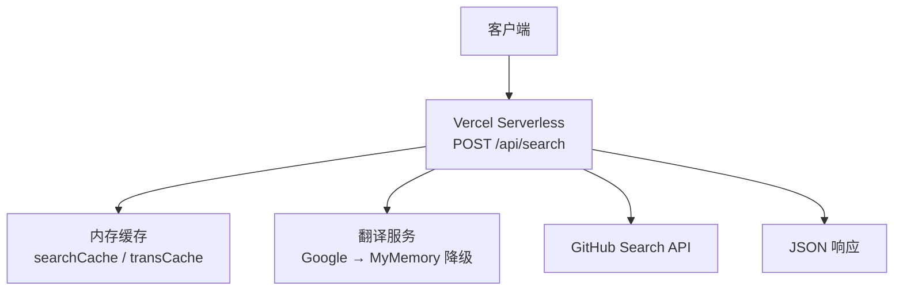
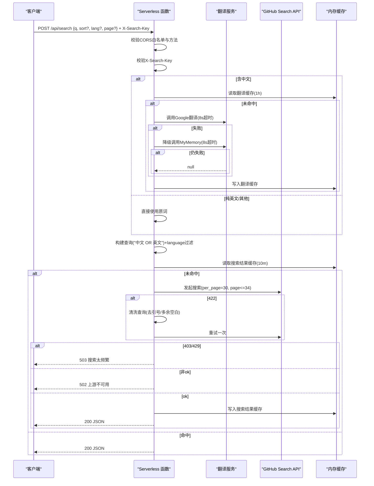
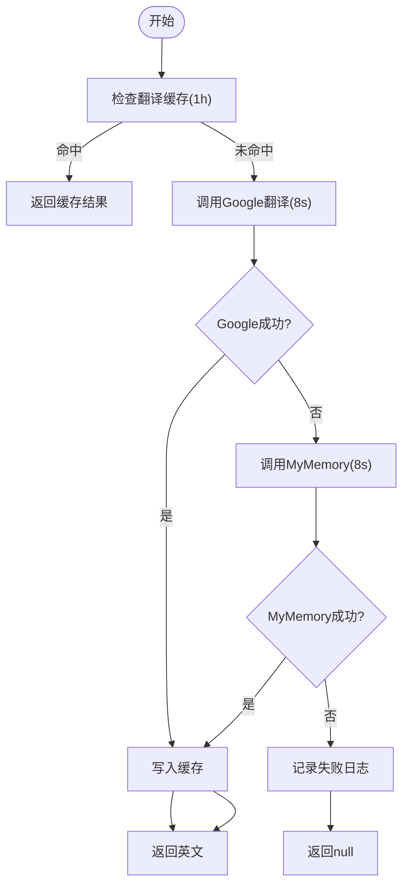
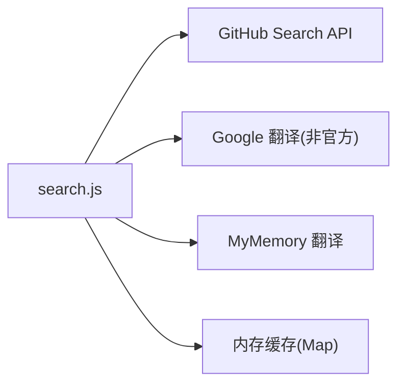

# 跨语言搜索API

<cite>
**本文引用的文件**
- [api/search.js](file://api/search.js)
- [api/refresh.js](file://api/refresh.js)
- [README.md](file://README.md)
- [package.json](file://package.json)
</cite>

## 目录
1. [简介](#简介)
2. [项目结构](#项目结构)
3. [核心组件](#核心组件)
4. [架构总览](#架构总览)
5. [详细组件分析](#详细组件分析)
6. [依赖关系分析](#依赖关系分析)
7. [性能考量](#性能考量)
8. [故障排查指南](#故障排查指南)
9. [结论](#结论)
10. [附录：接口规范与示例](#附录接口规范与示例)

## 简介
本仓库提供 Vercel Serverless Function 形式的“跨语言 GitHub 仓库搜索”能力，对外暴露 POST /api/search 端点。该端点支持中文关键词自动翻译为英文，并以“中文 OR 英文”的组合策略查询 GitHub 仓库；同时支持按编程语言、排序方式与分页进行过滤。请求需通过 CORS 白名单校验并携带认证头 X-Search-Key。内部实现包含内存级缓存（搜索结果 10 分钟 TTL、翻译结果 1 小时 TTL）以及针对上游限流与语法错误的容错重试机制。

## 项目结构
- api/search.js：实现跨语言搜索的 Serverless 函数入口，包含认证、CORS、参数校验、翻译降级、查询构建、GitHub 搜索调用、错误处理与缓存。
- api/refresh.js：用于触发 GitHub Actions workflow_dispatch 的中转函数，展示了与本端点一致的 CORS 与认证模式（便于参考）。
- README.md：项目说明与 Pages 部署信息。
- package.json：项目元信息与少量依赖（与本 API 无直接运行期依赖）。

图表来源
- [api/search.js:1-177](file://api/search.js#L1-L177)

章节来源
- [api/search.js:1-177](file://api/search.js#L1-L177)
- [api/refresh.js:1-65](file://api/refresh.js#L1-L65)
- [README.md:1-22](file://README.md#L1-L22)
- [package.json:1-9](file://package.json#L1-L9)

## 核心组件
- 认证与访问控制
  - CORS 白名单：仅允许指定 Origin（比较时统一小写），OPTIONS 预检返回 204/403。
  - 认证头：必须携带 X-Search-Key，且值与服务端环境变量 REFRESH_KEY 一致，否则返回 403。
- 参数校验与规范化
  - q：必填，至少 2 个字符。
  - sort：可选，限定为 best-match、stars、updated，默认 best-match。
  - lang：可选，作为 language:xxx 追加到查询。
  - page：可选，范围 1..MAX_PAGE（MAX_PAGE=34），默认 1。
- 翻译流程（中文→英文）
  - 优先尝试 Google 非官方端点（超时 8s），失败则降级到 MyMemory（超时 8s），均失败返回 null。
  - 翻译结果以原词为 key 缓存 1 小时。
- 查询构建
  - 若含中文且翻译成功，构造“中文 OR 英文”；若翻译结果为空或与原文相同，则仅使用原词。
  - 对含空格的词加引号，避免 GitHub 将空格视为 AND。
  - 可选附加 language:lang 过滤器。
- 搜索与分页
  - per_page=30，page 上限 34（对应 GitHub 最多前 1000 条）。
  - 非 best-match 时附带 sort 与 order=desc。
- 缓存
  - 搜索结果以 query|sort|page 为 key 缓存 10 分钟。
  - 翻译结果以原词为 key 缓存 1 小时。
- 错误处理
  - 422（查询语法错误）：清洗后重试一次。
  - 403/429（速率限制）：返回 503 提示稍后再试。
  - 其他上游错误：返回 502，不泄露上游细节。

章节来源
- [api/search.js:7-20](file://api/search.js#L7-L20)
- [api/search.js:22-28](file://api/search.js#L22-L28)
- [api/search.js:31-66](file://api/search.js#L31-L66)
- [api/search.js:68-73](file://api/search.js#L68-L73)
- [api/search.js:75-91](file://api/search.js#L75-L91)
- [api/search.js:93-94](file://api/search.js#L93-L94)
- [api/search.js:96-176](file://api/search.js#L96-L176)

## 架构总览
下图展示从请求进入到响应的完整调用链，包括认证、翻译降级、查询构建、GitHub 搜索、缓存命中与错误处理分支。

图表来源
- [api/search.js:31-66](file://api/search.js#L31-L66)
- [api/search.js:68-73](file://api/search.js#L68-L73)
- [api/search.js:75-91](file://api/search.js#L75-L91)
- [api/search.js:93-94](file://api/search.js#L93-L94)
- [api/search.js:96-176](file://api/search.js#L96-L176)

## 详细组件分析

### 认证与CORS
- 仅允许白名单 Origin（统一小写比较），OPTIONS 预检返回 204/403。
- 必须携带 X-Search-Key，值等于环境变量 REFRESH_KEY，否则 403。
- 与 refresh.js 保持一致的防护思路，便于统一管理。

章节来源
- [api/search.js:7-10](file://api/search.js#L7-L10)
- [api/search.js:96-117](file://api/search.js#L96-L117)
- [api/refresh.js:7-27](file://api/refresh.js#L7-L27)

### 翻译流程（Google → MyMemory 降级）
- 优先调用 Google 非官方端点（sl=zh-CN, tl=en, dt=t），超时 8s。
- 失败则降级到 MyMemory（langpair=zh-CN|en），超时 8s。
- 任一成功即返回英文；均失败返回 null。
- 翻译结果以原词为 key 缓存 1 小时。

图表来源
- [api/search.js:31-66](file://api/search.js#L31-L66)

章节来源
- [api/search.js:31-66](file://api/search.js#L31-L66)

### 查询构建逻辑
- 若输入含中文且翻译成功，构造“中文 OR 英文”。
- 若翻译结果为空或与原文相同，仅使用原词。
- 对含空格的词加引号，避免 GitHub 默认将空格解析为 AND。
- 可选追加 language:lang 过滤器。

章节来源
- [api/search.js:68-73](file://api/search.js#L68-L73)
- [api/search.js:129-134](file://api/search.js#L129-L134)

### GitHub 搜索与分页
- per_page=30，page 上限 34（对应 GitHub 最多前 1000 条）。
- 非 best-match 时设置 sort 与 order=desc。
- 请求带 Authorization Bearer GH_TOKEN、Accept、X-GitHub-Api-Version、User-Agent。

章节来源
- [api/search.js:12-16](file://api/search.js#L12-L16)
- [api/search.js:75-91](file://api/search.js#L75-L91)

### 错误处理与重试
- 422（查询语法错误）：去除引号与多余空白后重试一次。
- 403/429（速率限制）：返回 503 提示稍后再试。
- 其他上游错误：返回 502，不泄露上游细节。
- 请求体过大或格式错误：返回 400。

章节来源
- [api/search.js:93-94](file://api/search.js#L93-L94)
- [api/search.js:139-152](file://api/search.js#L139-L152)
- [api/search.js:119-127](file://api/search.js#L119-L127)

### 内存缓存机制
- 搜索结果缓存 key：query|sort|page，TTL 10 分钟。
- 翻译结果缓存 key：原词，TTL 1 小时。
- 模块级 Map 存储，冷启动丢失可接受（Serverless 单实例有效）。

章节来源
- [api/search.js:18-28](file://api/search.js#L18-L28)
- [api/search.js:136-171](file://api/search.js#L136-L171)

## 依赖关系分析
- 外部依赖
  - GitHub Search API：需要 GH_TOKEN（fine-grained PAT），具备搜索权限。
  - Google 翻译非官方端点：免 key，但可能限流或变更。
  - MyMemory 翻译 API：免费额度有限，存在警告与限流。
- 内部耦合
  - 认证/CORS 与 refresh.js 保持一致，便于统一治理。
  - 翻译与搜索解耦，通过 buildQuery 组合最终查询。

图表来源
- [api/search.js:31-91](file://api/search.js#L31-L91)

章节来源
- [api/search.js:31-91](file://api/search.js#L31-L91)

## 性能考量
- 翻译缓存 1 小时显著降低重复翻译开销。
- 搜索结果缓存 10 分钟减少重复上游请求。
- 超时控制：翻译 8s、GitHub 搜索 15s，避免长尾阻塞。
- 分页限制 per_page=30、最大 34 页，符合 GitHub 搜索上限。
- 建议
  - 前端合理合并请求，避免高频重复查询。
  - 对热门关键词在前端做短期本地缓存。
  - 监控上游限流（429）与异常率，必要时引入退避重试。

[本节为通用性能建议，不直接分析具体文件]

## 故障排查指南
- 403 Forbidden
  - 检查是否来自白名单 Origin。
  - 检查是否携带正确的 X-Search-Key 且与服务端 REFRESH_KEY 一致。
- 400 Bad Request
  - 检查 q 是否为空或长度不足 2。
  - 检查请求体是否为合法 JSON 且大小不超过限制。
- 422 Unprocessable Entity
  - 服务端会自动清洗查询并重试一次；若仍失败，检查关键词中是否存在非法符号或过多引号。
- 503 Service Unavailable
  - 上游 GitHub 搜索达到速率限制（403/429），建议稍后重试或降低频率。
- 502 Bad Gateway
  - 上游服务不可用或网络异常，查看 Vercel 日志定位。

章节来源
- [api/search.js:96-117](file://api/search.js#L96-L117)
- [api/search.js:119-127](file://api/search.js#L119-L127)
- [api/search.js:139-152](file://api/search.js#L139-L152)

## 结论
该 API 实现了跨语言 GitHub 仓库搜索的核心能力：中文关键词自动翻译、组合查询、分页与排序、严格的认证与 CORS 控制、健壮的容错与缓存机制。通过双端点翻译降级与 422 清洗重试，提升了可用性；通过内存缓存降低了上游压力。建议在业务侧结合缓存与退避策略进一步优化用户体验。

[本节为总结性内容，不直接分析具体文件]

## 附录：接口规范与示例

### 端点
- 方法：POST
- 路径：/api/search
- 内容类型：application/json

### 请求头
- Content-Type: application/json
- X-Search-Key: 与服务端环境变量 REFRESH_KEY 一致的值

### 请求体
- q: string，必填，至少 2 个字符
- sort: string，可选，枚举值 best-match | stars | updated，默认 best-match
- lang: string，可选，如 Python、JavaScript 等
- page: number，可选，范围 1..34，默认 1

### 响应体
- query: string，实际使用的查询字符串
- translated: boolean，是否进行了翻译
- page: number，当前页码
- total: number，匹配总数
- items: array，每项包含：
  - full_name: string
  - desc: string
  - language: string
  - stars: number
  - updated_at: string
  - html_url: string
  - topics: array<string>，最多 3 个

### 状态码
- 200：成功
- 400：请求体格式错误或参数无效
- 403：CORS 或认证失败
- 405：方法不允许
- 502：上游服务不可用
- 503：上游限流（403/429）

### 请求示例
- 基本搜索
  - 请求：POST /api/search，Body: { q: "视频创作", sort: "best-match", lang: "Python", page: 1 }，Header: X-Search-Key: <REFRESH_KEY>
- 排序与分页
  - 请求：POST /api/search，Body: { q: "机器学习", sort: "stars", page: 2 }

### 响应示例
- 成功
  - 状态码：200
  - Body: { query: "...", translated: true, page: 1, total: 1234, items: [...] }

### 错误处理建议
- 422：客户端无需特殊处理，服务端已自动清洗并重试。
- 403/429：客户端应提示用户稍后再试，并可实施指数退避重试。
- 400：检查 q 长度与 JSON 格式。

章节来源
- [api/search.js:7-20](file://api/search.js#L7-L20)
- [api/search.js:96-176](file://api/search.js#L96-L176)