# UI组件库

<cite>
**本文引用的文件**
- [index.html](file://index.html)
- [template.html](file://template.html)
- [rss-aggregator.html](file://rss-aggregator.html)
- [ai-daily.html](file://ai-daily.html)
- [build_rss_aggregator.py](file://build_rss_aggregator.py)
- [package.json](file://package.json)
- [README.md](file://README.md)
</cite>

## 更新摘要
**所做更改**
- 新增分段控件组件（hp-seg）和分段按钮（hp-seg-btn）的完整文档
- 新增平台芯片组件（plat-chip）的详细实现说明
- 增强洞察面板组件的可访问性属性支持
- 更新组件交互模式和状态管理机制
- 补充新组件的样式定制和响应式适配指南

## 目录
1. [简介](#简介)
2. [项目结构](#项目结构)
3. [核心组件](#核心组件)
4. [架构总览](#架构总览)
5. [详细组件分析](#详细组件分析)
6. [依赖关系分析](#依赖关系分析)
7. [性能与内存优化](#性能与内存优化)
8. [可访问性与国际化](#可访问性与国际化)
9. [故障排查](#故障排查)
10. [结论](#结论)
11. [附录：样式主题与定制指南](#附录样式主题与定制指南)

## 简介
本项目是一个以"编辑数据书"风格为设计语言的静态站点集合，包含 GitHub Star 收藏台、AI 晨报、RSS 聚合阅读器等页面。整体采用纯前端实现，通过 CSS 变量实现主题切换与样式隔离，使用事件委托与轻量 DOM 更新提升交互性能，并提供键盘可达性、模态焦点陷阱等可访问性支持。构建脚本负责拉取数据并生成页面，GitHub Actions 定时更新。

**最新更新**：新增了分段控件、平台芯片和增强的洞察面板组件，提供更丰富的用户交互体验和数据展示能力。

## 项目结构
- 入口页面 index.html：收藏台主界面，包含导航栏、搜索、筛选、卡片/列表视图、侧边趋势面板、模态对话框等。
- 模板 template.html：与 index.html 同构的页面模板，便于批量生成或替换内容。
- RSS 聚合 rss-aggregator.html：多源 RSS 聚合阅读器，提供卡片墙、侧边信源面板、分享弹窗、阅读器模式等。
- AI 晨报 ai-daily.html：按分类组织的日报排版页面。
- 构建脚本 build_rss_aggregator.py：定义信源、分类标签、渲染逻辑（含前端片段），输出 HTML。
- 配置与说明 package.json、README.md：依赖声明与仓库说明。

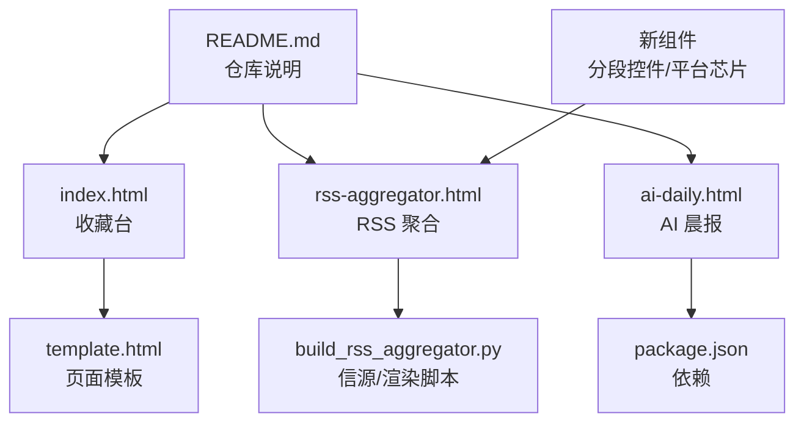

**图表来源**
- [index.html:1-120](file://index.html#L1-L120)
- [rss-aggregator.html:1-120](file://rss-aggregator.html#L1-L120)
- [build_rss_aggregator.py:1032-1042](file://build_rss_aggregator.py#L1032-L1042)
- [package.json:1-9](file://package.json#L1-L9)
- [README.md:1-22](file://README.md#L1-L22)

**章节来源**
- [README.md:1-22](file://README.md#L1-L22)
- [package.json:1-9](file://package.json#L1-L9)

## 核心组件
- 按钮 Button：基础交互控件，支持 primary/loading/disabled 状态，统一尺寸与过渡动效。
- 卡片 Card：两种形态——普通条目卡与封面卡 cover-card；支持已读/打开/收藏状态、缩略图失败降级。
- 导航栏 Navigation：顶部品牌区 + 链接组 + 下拉菜单 nav-drop，支持高亮与键盘可达。
- 标签页 Tabs：侧边 tabs 与趋势 tabs，用于切换内容区域。
- 模态 Modal：排行榜与搜索模态，具备焦点陷阱、Esc 关闭、aria-modal 属性。
- 工具栏 Toolbar：搜索框、语言/星标筛选、排序选择器、刷新按钮等。
- 侧边面板 Side Panel：RSS 聚合中的信源抽屉，支持折叠分类与搜索。
- Toast 提示：全局轻提示，用于操作反馈。
- 统计条 Stats：数字展示区块，带图标与单位。
- **分段控件 Segmented Control**：hp-seg 容器配合 hp-seg-btn 按钮，支持单选分组切换，具备完整的可访问性支持。
- **平台芯片 Platform Chip**：plat-chip 彩色标签，支持颜色标识、选中状态和动态显示/隐藏。
- **洞察面板 Insight Panel**：增强的侧边面板，支持 PC 右抽屉和移动端底部 Sheet 布局，具备完善的焦点管理和滚动锁定。

**章节来源**
- [index.html:151-163](file://index.html#L151-L163)
- [index.html:326-437](file://index.html#L326-L437)
- [index.html:112-150](file://index.html#L112-L150)
- [index.html:177-188](file://index.html#L177-L188)
- [index.html:564-602](file://index.html#L564-L602)
- [rss-aggregator.html:120-166](file://rss-aggregator.html#L120-L166)
- [rss-aggregator.html:169-198](file://rss-aggregator.html#L169-L198)
- [index.html:667-685](file://index.html#L667-L685)
- [index.html:193-218](file://index.html#L193-L218)
- [rss-aggregator.html:467-478](file://rss-aggregator.html#L467-L478)
- [rss-aggregator.html:512-520](file://rss-aggregator.html#L512-L520)

## 架构总览
页面由"头部导航 + 主体内容 + 侧边信息 + 模态/面板"构成。CSS 变量集中管理主题色、阴影、圆角、字体等，通过 data-theme 切换明暗主题。交互层通过事件委托绑定在容器上，减少重复监听；状态类名控制显示/隐藏与激活态。构建脚本将数据注入模板，生成最终 HTML。

**新增组件架构**：分段控件采用 tablist/tab 语义化结构，平台芯片支持动态过滤和动画切换，洞察面板实现了跨设备的一致用户体验。

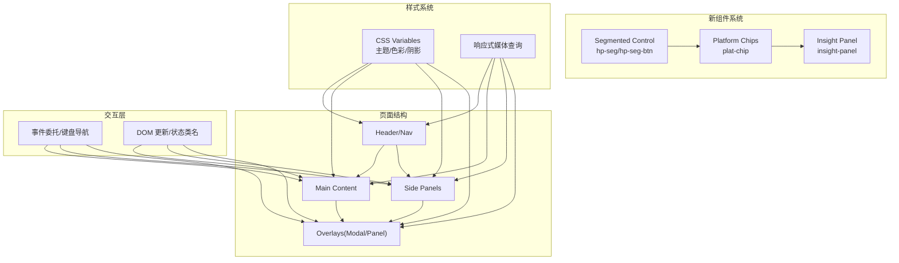

**图表来源**
- [index.html:17-73](file://index.html#L17-L73)
- [index.html:748-800](file://index.html#L748-L800)
- [rss-aggregator.html:9-32](file://rss-aggregator.html#L9-L32)
- [rss-aggregator.html:1195-1222](file://rss-aggregator.html#L1195-L1222)
- [rss-aggregator.html:467-478](file://rss-aggregator.html#L467-L478)
- [rss-aggregator.html:512-520](file://rss-aggregator.html#L512-L520)

## 详细组件分析

### 按钮 Button
- 外观与状态：基础样式 .btn，支持 .primary/.loading/:disabled；加载态通过旋转动画指示。
- 交互：统一高度与内边距，hover 时边框与背景变化；禁用态降低透明度并禁止指针事件。
- 组合：可与 icon 组合，保持视觉一致性。

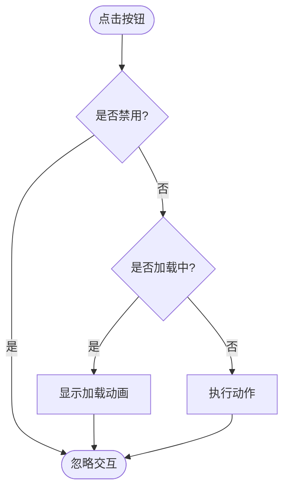

**图表来源**
- [index.html:151-163](file://index.html#L151-L163)

**章节来源**
- [index.html:151-163](file://index.html#L151-L163)

### 卡片 Card（普通与封面）
- 普通卡：标题、描述、元数据行、收藏按钮；悬停微动效与阴影提升。
- 封面卡 cover-card：上部封面图（失败回退到分类色+首字母）、中部名称与摘要、底部元数据；支持 visited/open 状态类名。
- 事件：事件委托在 #wall 上处理收藏、标记已读、打开详情；图片加载失败捕获隐藏 img。

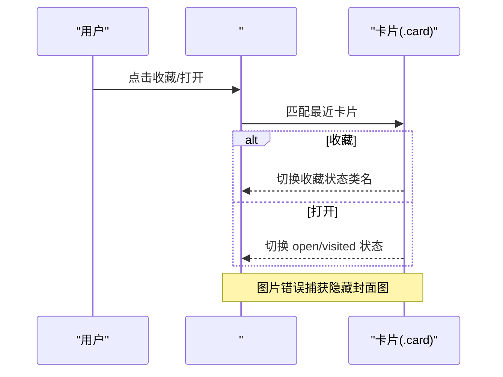

**图表来源**
- [build_rss_aggregator.py:2262-2315](file://build_rss_aggregator.py#L2262-L2315)
- [rss-aggregator.html:864-886](file://rss-aggregator.html#L864-L886)

**章节来源**
- [index.html:326-437](file://index.html#L326-L437)
- [build_rss_aggregator.py:2262-2315](file://build_rss_aggregator.py#L2262-L2315)
- [rss-aggregator.html:864-886](file://rss-aggregator.html#L864-L886)

### 导航栏 Navigation 与下拉菜单
- 结构：品牌区 + 链接组 + 下拉菜单 nav-drop；下拉面板绝对定位，通过 .open 控制显隐。
- 交互：按钮 aria-expanded 控制展开；箭头旋转指示；hover 高亮。
- 可访问性：aria-label、role 等语义化标注。

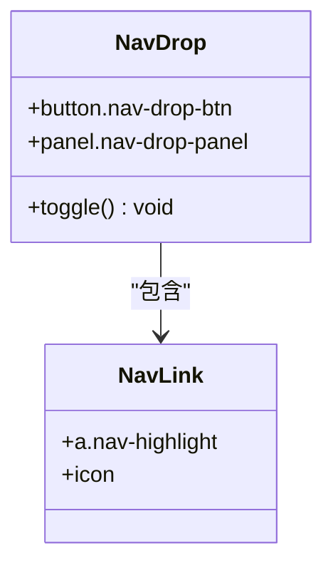

**图表来源**
- [index.html:112-150](file://index.html#L112-L150)
- [index.html:754-784](file://index.html#L754-L784)

**章节来源**
- [index.html:112-150](file://index.html#L112-L150)
- [index.html:754-784](file://index.html#L754-L784)

### 标签页 Tabs（侧边与趋势）
- 侧边 tabs：side-tabs 容器，.on 表示激活；配合 .trending/.feed 显示/隐藏。
- 趋势 tabs：trend-tab 支持 rising/total/new/sort 多种激活态，颜色区分。
- 交互：点击切换 on 类名，联动内容区显示。

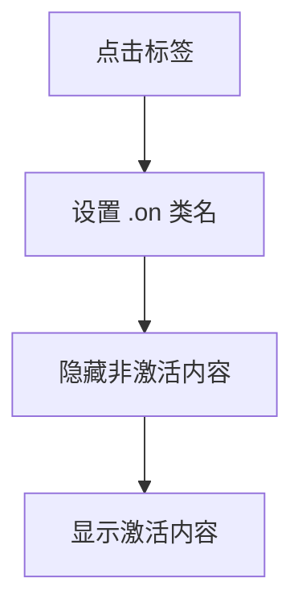

**图表来源**
- [index.html:177-188](file://index.html#L177-L188)
- [index.html:470-482](file://index.html#L470-L482)

**章节来源**
- [index.html:177-188](file://index.html#L177-L188)
- [index.html:470-482](file://index.html#L470-L482)

### 模态 Modal（排行榜/搜索）
- 结构：遮罩 + 面板，面板内包含标题、关闭按钮、标签页、列表等。
- 行为：打开/关闭通过 .open 控制；Esc 关闭；焦点陷阱限制 Tab 循环。
- 可访问性：role="dialog"、aria-modal、aria-label。

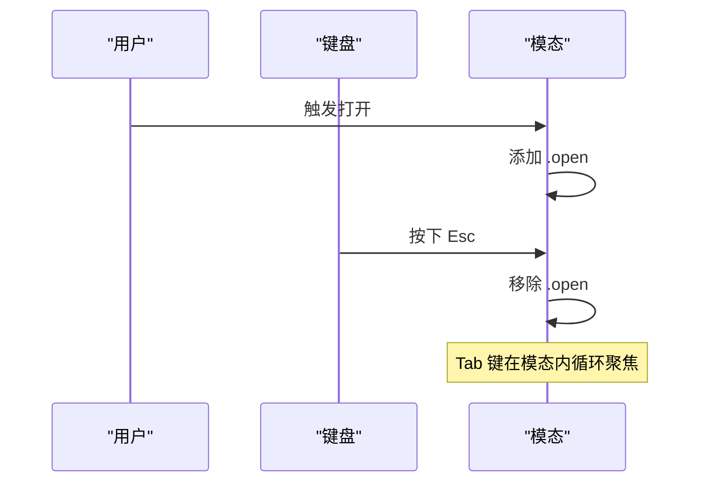

**图表来源**
- [index.html:564-602](file://index.html#L564-L602)
- [rss-aggregator.html:1195-1222](file://rss-aggregator.html#L1195-L1222)

**章节来源**
- [index.html:564-602](file://index.html#L564-L602)
- [rss-aggregator.html:1195-1222](file://rss-aggregator.html#L1195-L1222)

### 工具栏 Toolbar（搜索/筛选/排序）
- 元素：搜索输入、语言/星标筛选、排序选择器、刷新按钮。
- 交互：输入聚焦高亮边框；筛选按钮切换 on 类；排序改变列表顺序。
- 响应式：小屏下自动换行与全宽布局。

**章节来源**
- [index.html:274-301](file://index.html#L274-L301)
- [rss-aggregator.html:54-74](file://rss-aggregator.html#L54-L74)

### 侧边面板 Side Panel（RSS 信源抽屉）
- 结构：头部标题 + 搜索 + 分类折叠 + 信源列表。
- 交互：滑入/滑出通过 body 类名控制；分类折叠切换箭头方向；搜索过滤列表。
- 可访问性：焦点可见环、键盘导航。

**章节来源**
- [rss-aggregator.html:169-198](file://rss-aggregator.html#L169-L198)
- [rss-aggregator.html:1195-1222](file://rss-aggregator.html#L1195-L1222)

### Toast 提示
- 位置：固定底部居中，支持安全区域适配。
- 行为：show 类控制显示与位移；自动淡入淡出。

**章节来源**
- [index.html:667-685](file://index.html#L667-L685)

### 统计条 Stats
- 布局：网格四列，分隔线分割；数值使用等宽字体增强可读性。
- 用途：展示关键指标（如收藏数、类别数等）。

**章节来源**
- [index.html:193-218](file://index.html#L193-L218)

### 分段控件 Segmented Control（新增）
- **结构**：hp-seg 容器配合 role="tablist"，内部包含多个 hp-seg-btn 按钮，每个按钮具有 role="tab" 和 aria-selected 属性。
- **样式特性**：容器使用 flex 布局，支持横向滚动；按钮默认透明背景，选中状态使用卡片背景和阴影效果。
- **交互逻辑**：点击按钮切换选中状态，同时更新 aria-selected 属性；支持键盘导航（Tab/Space/Enter）。
- **响应式适配**：在小屏幕设备上支持水平滚动，确保所有选项可访问。

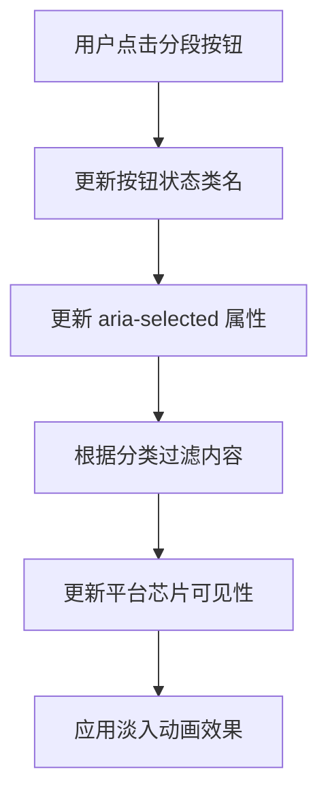

**图表来源**
- [rss-aggregator.html:2780-2791](file://rss-aggregator.html#L2780-L2791)
- [rss-aggregator.html:2827-2856](file://rss-aggregator.html#L2827-L2856)

**章节来源**
- [rss-aggregator.html:467-478](file://rss-aggregator.html#L467-L478)
- [rss-aggregator.html:2780-2791](file://rss-aggregator.html#L2780-L2791)
- [rss-aggregator.html:2827-2856](file://rss-aggregator.html#L2827-L2856)

### 平台芯片 Platform Chip（新增）
- **结构**：plat-chip 按钮元素，包含彩色圆点标识和平台名称；支持 data-p 和 data-cat 数据属性。
- **样式特性**：胶囊形状设计，支持边框和背景色变化；选中状态使用品牌色背景和白色文字。
- **交互功能**：点击切换选中状态，支持动态显示/隐藏；移动端支持水平滚动和展开/收起功能。
- **数据绑定**：通过 JavaScript 动态生成，支持平台分类过滤和数量统计。

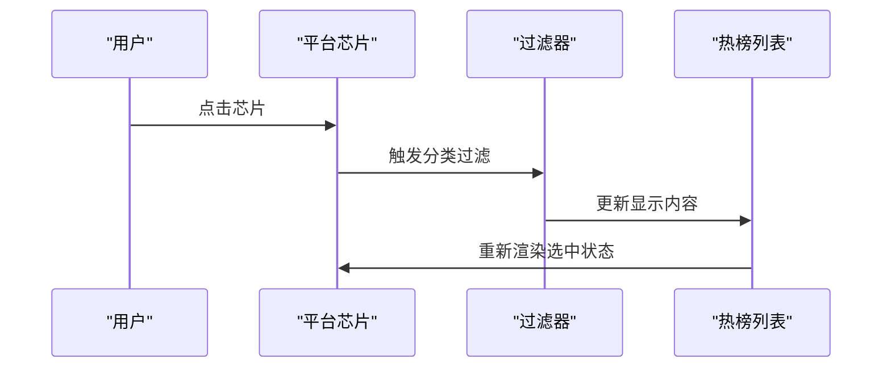

**图表来源**
- [rss-aggregator.html:2792-2818](file://rss-aggregator.html#L2792-L2818)
- [rss-aggregator.html:2857-2888](file://rss-aggregator.html#L2857-L2888)

**章节来源**
- [rss-aggregator.html:475-478](file://rss-aggregator.html#L475-L478)
- [rss-aggregator.html:2792-2818](file://rss-aggregator.html#L2792-L2818)
- [rss-aggregator.html:2857-2888](file://rss-aggregator.html#L2857-L2888)

### 洞察面板 Insight Panel（增强版）
- **结构**：insight-panel 容器，支持 PC 端右侧抽屉和移动端底部 Sheet 布局；包含头部、导航条和内容区域。
- **可访问性增强**：完整的 role="dialog"、aria-modal="true"、aria-label 属性；焦点管理确保键盘用户友好。
- **交互特性**：打开时锁定页面滚动，关闭时恢复滚动位置；支持 ESC 键关闭和焦点陷阱。
- **内容渲染**：动态生成 AI 分析报告，包括统计数据、核心态势、信号看板、关键词等模块。

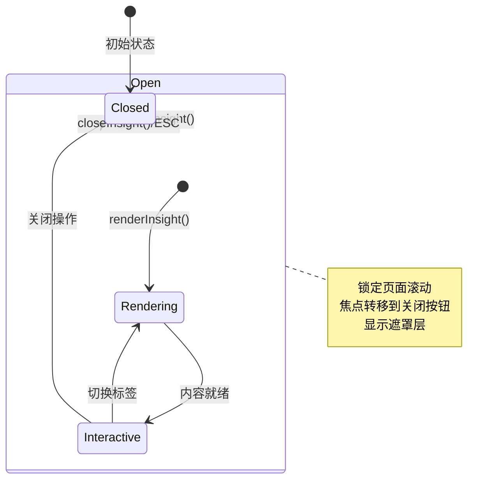

**图表来源**
- [rss-aggregator.html:2893-2921](file://rss-aggregator.html#L2893-L2921)
- [rss-aggregator.html:2923-2979](file://rss-aggregator.html#L2923-L2979)

**章节来源**
- [rss-aggregator.html:512-520](file://rss-aggregator.html#L512-L520)
- [rss-aggregator.html:715-722](file://rss-aggregator.html#L715-L722)
- [rss-aggregator.html:2893-2921](file://rss-aggregator.html#L2893-L2921)
- [rss-aggregator.html:2923-2979](file://rss-aggregator.html#L2923-L2979)

## 依赖关系分析
- 运行时依赖：无框架依赖，纯 HTML/CSS/JS；仅引入 Google Fonts 字体。
- 构建期依赖：package.json 中声明 jsdom 与 @mozilla/readability，用于解析与提取内容（在 Python 环境中使用）。
- 外部资源：GitHub Pages 托管，Actions 定时任务驱动更新。

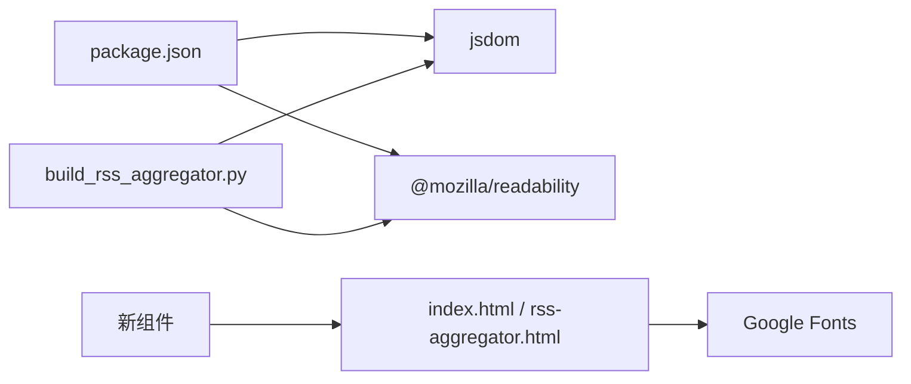

**图表来源**
- [package.json:1-9](file://package.json#L1-L9)
- [build_rss_aggregator.py:1032-1042](file://build_rss_aggregator.py#L1032-L1042)

**章节来源**
- [package.json:1-9](file://package.json#L1-L9)
- [build_rss_aggregator.py:1032-1042](file://build_rss_aggregator.py#L1032-L1042)

## 性能与内存优化
- 事件委托：在 #wall 等容器上一次性绑定 click/keydown/error，避免为每个子元素重复监听，降低内存占用与重排开销。
- 增量更新：updateCardStates 仅切换类名而不重建 DOM，减少重绘与回流。
- 图片懒加载与解码优化：封面图使用 loading="lazy" 与 decoding="async"，失败时隐藏 img 回退到分类色占位。
- 内容可见性：封面卡使用 content-visibility/auto 与 contain-intrinsic-size，提升滚动性能。
- 响应式与媒体查询：合理断点减少不必要布局计算。
- 动画与过渡：使用 transform 与 opacity 等合成属性，避免昂贵布局。
- **新组件优化**：分段控件和平台芯片使用 CSS 类名切换而非 DOM 重建；洞察面板采用延迟渲染策略，仅在打开时生成内容。

**章节来源**
- [build_rss_aggregator.py:2262-2315](file://build_rss_aggregator.py#L2262-L2315)
- [rss-aggregator.html:864-886](file://rss-aggregator.html#L864-L886)
- [index.html:372-437](file://index.html#L372-L437)
- [rss-aggregator.html:2884-2887](file://rss-aggregator.html#L2884-L2887)

## 可访问性与国际化
- 键盘可达性：卡片与按钮支持 Enter/Space 触发；模态与阅读器支持焦点陷阱；Esc 关闭覆盖层。
- 语义化与 ARIA：导航 aria-label、模态 role="dialog"/aria-modal、aria-expanded 控制下拉。
- 焦点可见：focus-visible 高亮边框，确保键盘用户可见焦点。
- 国际化：html lang="zh-CN"，文本均为中文；主题切换不影响文案。
- 无障碍对比度：暗色模式下调整弱化灰与未读绿至符合对比度要求。
- **新组件可访问性**：分段控件使用标准的 tablist/tab 语义；平台芯片支持键盘导航；洞察面板具备完整的焦点管理和屏幕阅读器支持。

**章节来源**
- [rss-aggregator.html:1195-1222](file://rss-aggregator.html#L1195-L1222)
- [index.html:754-784](file://index.html#L754-L784)
- [rss-aggregator.html:9-32](file://rss-aggregator.html#L9-L32)
- [rss-aggregator.html:2784-2786](file://rss-aggregator.html#L2784-L2786)
- [rss-aggregator.html:2900-2915](file://rss-aggregator.html#L2900-L2915)

## 故障排查
- 封面图加载失败：捕获 error 事件并隐藏 img，显示分类色 fallback。
- 模态无法关闭：检查是否被其他覆盖层遮挡；确认 Esc 事件未被阻止；验证焦点陷阱函数是否正确调用。
- 键盘导航异常：确认事件监听绑定在正确容器；输入框内按键应跳过全局快捷键。
- 主题不生效：检查 html 根节点 data-theme 是否正确设置；确认 CSS 变量覆盖优先级。
- **新组件问题**：分段控件状态不同步时检查 aria-selected 属性；平台芯片显示异常时验证 data-cat 属性；洞察面板焦点丢失时确认焦点管理函数调用。

**章节来源**
- [build_rss_aggregator.py:2296-2300](file://build_rss_aggregator.py#L2296-L2300)
- [rss-aggregator.html:1195-1222](file://rss-aggregator.html#L1195-L1222)
- [index.html:745-746](file://index.html#L745-L746)
- [rss-aggregator.html:2831-2835](file://rss-aggregator.html#L2831-L2835)
- [rss-aggregator.html:2907-2915](file://rss-aggregator.html#L2907-L2915)

## 结论
该 UI 组件库以简洁的 CSS 变量体系与事件委托为核心，实现了高可用、高性能的前端组件集合。通过状态类名驱动 UI 变化，结合响应式设计与可访问性实践，满足多场景下的展示与交互需求。构建脚本与自动化流程保障了数据的持续更新与页面生成效率。

**最新改进**：新增的分段控件、平台芯片和增强的洞察面板组件进一步丰富了用户交互体验，提供了更直观的数据筛选和信息展示方式，同时保持了良好的性能和可访问性标准。

## 附录：样式主题与定制指南
- 主题切换：通过 documentElement.dataset.theme 切换 light/dark；CSS 变量集中定义于 :root 与 [data-theme="dark"]。
- 自定义令牌：修改 --brand、--bg、--card、--shadow 等变量即可快速定制配色与质感。
- 组件扩展：基于现有类名（如 .btn、.card、.nav-drop）叠加新类名，遵循命名约定与层级结构。
- 字体与排版：通过 --font-display/--font-body/--font-mono 统一字体栈；字号与行高遵循设计系统。
- 响应式：利用媒体查询调整布局与尺寸，确保移动端体验一致。
- **新组件定制**：分段控件可通过修改 .hp-seg 和 .hp-seg-btn 样式进行定制；平台芯片支持自定义颜色和尺寸；洞察面板可通过 CSS 变量调整布局和间距。

**章节来源**
- [index.html:17-73](file://index.html#L17-L73)
- [rss-aggregator.html:9-32](file://rss-aggregator.html#L9-L32)
- [ai-daily.html:9-22](file://ai-daily.html#L9-L22)
- [rss-aggregator.html:467-478](file://rss-aggregator.html#L467-L478)
- [rss-aggregator.html:512-520](file://rss-aggregator.html#L512-L520)