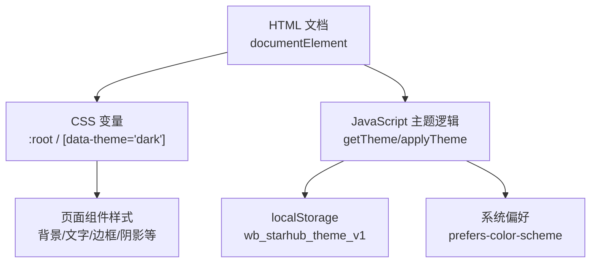
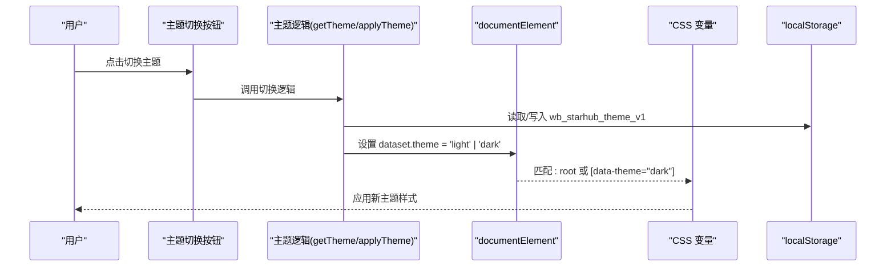
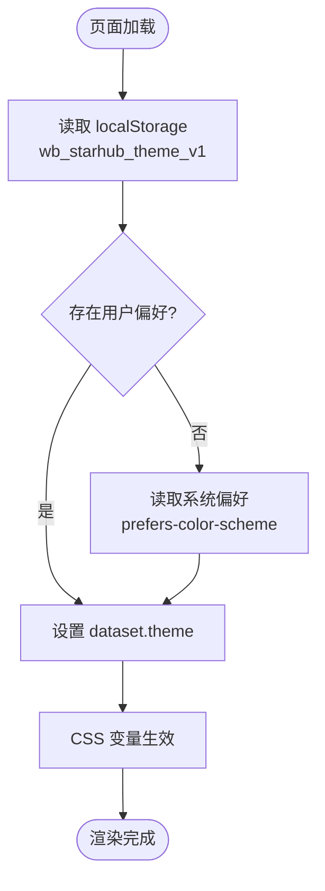
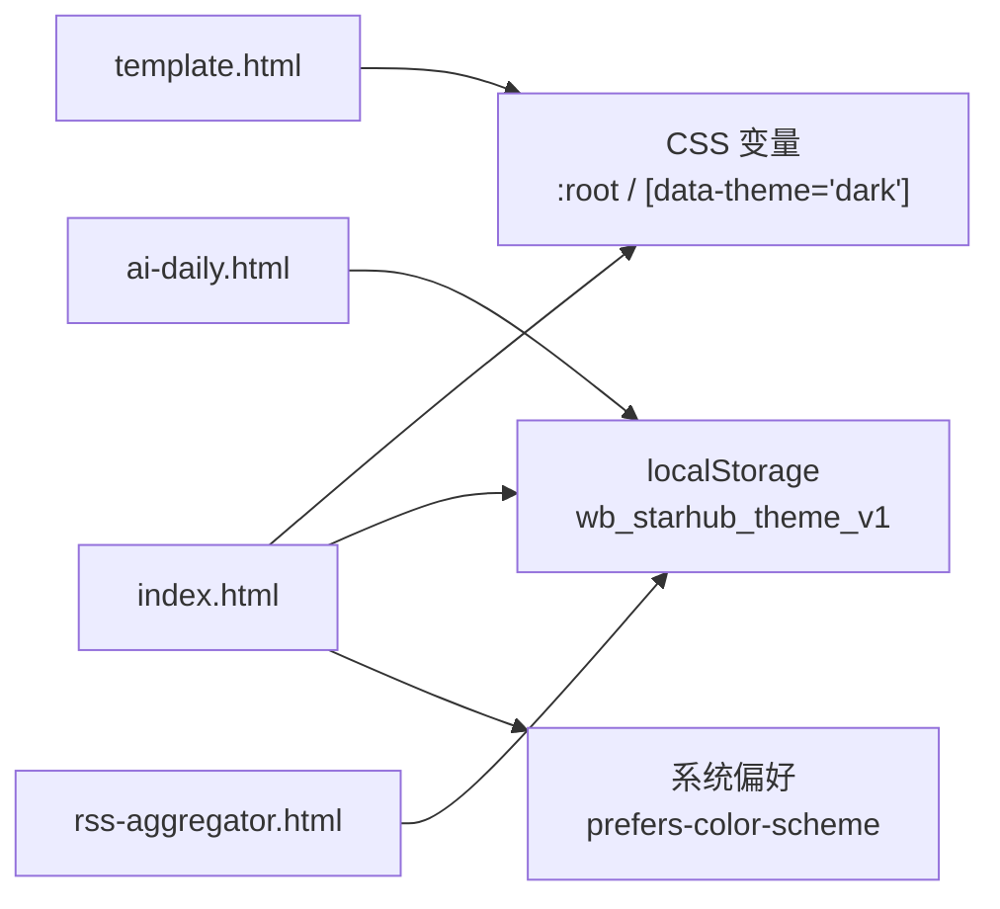

# 主题系统

<cite>
**本文引用的文件**
- [index.html](file://index.html)
- [template.html](file://template.html)
- [ai-daily.html](file://ai-daily.html)
- [rss-aggregator.html](file://rss-aggregator.html)
</cite>

## 目录
1. [简介](#简介)
2. [项目结构](#项目结构)
3. [核心组件](#核心组件)
4. [架构总览](#架构总览)
5. [详细组件分析](#详细组件分析)
6. [依赖关系分析](#依赖关系分析)
7. [性能考量](#性能考量)
8. [故障排查指南](#故障排查指南)
9. [结论](#结论)
10. [附录：主题定制与扩展指南](#附录：主题定制与扩展指南)

## 简介
本主题系统基于 CSS 自定义属性（CSS Variables）实现明暗主题切换，通过为根元素设置 data-theme 属性来切换变量集。所有页面样式均通过引用这些变量完成渲染，从而实现“一处定义、全局生效”的主题管理。用户偏好通过 localStorage 持久化，并在页面加载时自动恢复；同时尊重系统级 prefers-color-scheme 设置作为默认值。

## 项目结构
- 主题变量集中定义在页面的 <style> 中，使用 :root 声明默认（浅色）变量，使用 [data-theme="dark"] 覆盖为深色变量。
- 主题状态由 JavaScript 维护，并通过 document.documentElement.dataset.theme 驱动样式切换。
- 多个页面共享同一套主题机制：index.html、template.html、ai-daily.html、rss-aggregator.html。

图表来源
- [index.html:18-73](file://index.html#L18-L73)
- [index.html:1001-1011](file://index.html#L1001-L1011)
- [index.html:745](file://index.html#L745)

章节来源
- [index.html:18-73](file://index.html#L18-L73)
- [index.html:745](file://index.html#L745)
- [index.html:1001-1011](file://index.html#L1001-L1011)

## 核心组件
- CSS 变量层
  - 在 :root 中定义浅色主题的所有语义化变量（如 --bg, --text, --brand, --card, --shadow 等）。
  - 在 [data-theme="dark"] 中覆盖同名变量，形成完整的深色主题映射。
  - 变量命名遵循语义化前缀与用途分组，便于维护与扩展。
- 主题状态层
  - getTheme()：从 localStorage 读取用户选择，若不存在则回退到系统偏好。
  - applyTheme(t)：将 t 写入 document.documentElement.dataset.theme，并更新图标状态。
- 交互层
  - 按钮点击事件触发主题切换，写入 localStorage，并重新渲染相关 UI（如分类标签颜色、列表等）。
- 存储层
  - 使用键 wb_starhub_theme_v1 存储用户主题偏好。
  - 兼容不同页面独立实现，但 key 保持一致，利于跨页体验一致。

章节来源
- [index.html:18-73](file://index.html#L18-L73)
- [index.html:1001-1011](file://index.html#L1001-L1011)
- [index.html:1842-1846](file://index.html#L1842-L1846)
- [ai-daily.html:199-213](file://ai-daily.html#L199-L213)
- [rss-aggregator.html:601-610](file://rss-aggregator.html#L601-L610)

## 架构总览
主题系统采用“数据驱动样式”的架构：JS 仅负责状态管理与持久化，CSS 负责根据状态渲染视觉表现。这种解耦使得主题扩展与维护成本极低。

图表来源
- [index.html:1001-1011](file://index.html#L1001-L1011)
- [index.html:1842-1846](file://index.html#L1842-L1846)
- [index.html:745](file://index.html#L745)

## 详细组件分析

### CSS 变量体系与命名规范
- 基础色板
  - 背景与内容：--bg, --card, --border, --border2, --text, --muted, --faint
  - 品牌与强调：--brand, --brand-strong, --brand-line, --brand-weak, --accent, --accent-solid
  - 功能色：--star, --star-bg, --mark, --upd-color, --upd-bg
  - 反馈与层级：--hover, --hover-line, --track, --track-hover, --shadow, --shadow-card, --shadow-lift
  - 字体族：--font-display, --font-body, --font-mono
  - 封面卡专用：--cover-h, --cover-h-sm, --cover-bg, --cover-weave, --fav-chip-bg, --card-pad, --chip-pill, --ease-lift
- 继承与复用
  - 通过 var(--brand) 等方式组合派生变量，减少重复定义，提升一致性。
  - 深色主题通过覆盖同名变量实现整体替换，无需改动业务样式。

章节来源
- [index.html:18-73](file://index.html#L18-L73)
- [template.html:18-73](file://template.html#L18-L73)

### 主题切换流程与用户偏好存储
- 初始化
  - 页面加载时执行脚本，优先读取 localStorage 中的 wb_starhub_theme_v1，否则使用系统偏好 prefers-color-scheme 决定初始主题。
  - 将结果写入 document.documentElement.dataset.theme，使 CSS 立即生效。
- 切换
  - 点击主题按钮后，计算新主题值，写入 localStorage，并调用 applyTheme 更新 DOM 与图标。
  - 部分页面在切换后触发局部重渲染（如分类标签颜色、列表），确保动态样式正确。

图表来源
- [index.html:745](file://index.html#L745)
- [index.html:1001-1011](file://index.html#L1001-L1011)
- [ai-daily.html:199-213](file://ai-daily.html#L199-L213)
- [rss-aggregator.html:601-610](file://rss-aggregator.html#L601-L610)

章节来源
- [index.html:745](file://index.html#L745)
- [index.html:1001-1011](file://index.html#L1001-L1011)
- [index.html:1842-1846](file://index.html#L1842-L1846)
- [ai-daily.html:199-213](file://ai-daily.html#L199-L213)
- [rss-aggregator.html:601-610](file://rss-aggregator.html#L601-L610)

### 主题与组件集成与样式隔离
- 组件样式全部通过 CSS 变量引用主题色，避免硬编码颜色，从而天然支持主题切换。
- 针对特定组件（如封面卡、模态框、统计区、滚动条等）提供独立的变量覆盖点，保证在不同主题下的可读性与对比度。
- 通过 [data-theme="dark"] 选择器对个别组件进行微调（如遮罩透明度、图片滤镜、边框颜色等），实现精细控制。

章节来源
- [index.html:75-743](file://index.html#L75-L743)
- [template.html:75-743](file://template.html#L75-L743)

### 分类标签颜色与可访问性
- 分类标签颜色依据当前主题动态计算，确保文本与背景的对比度满足可访问性要求。
- 通过亮度钳制算法限制颜色的明暗范围，避免在浅色或深色背景下出现不可读情况。

章节来源
- [index.html:1139-1160](file://index.html#L1139-L1160)

## 依赖关系分析
- 页面间依赖
  - index.html 与 template.html 包含相同的主题变量与逻辑，可作为模板与生产版本对照。
  - ai-daily.html 与 rss-aggregator.html 各自实现了轻量版主题切换，保持 key 一致以统一偏好。
- 外部依赖
  - 无第三方主题库，完全基于原生 CSS 变量与 localStorage。
  - 依赖浏览器 API：matchMedia('prefers-color-scheme')、localStorage、dataset。

图表来源
- [index.html:18-73](file://index.html#L18-L73)
- [index.html:745](file://index.html#L745)
- [ai-daily.html:199-213](file://ai-daily.html#L199-L213)
- [rss-aggregator.html:601-610](file://rss-aggregator.html#L601-L610)

章节来源
- [index.html:18-73](file://index.html#L18-L73)
- [index.html:745](file://index.html#L745)
- [ai-daily.html:199-213](file://ai-daily.html#L199-L213)
- [rss-aggregator.html:601-610](file://rss-aggregator.html#L601-L610)

## 性能考量
- 零运行时开销：主题切换仅修改一个 DOM 属性，CSS 引擎即时重绘，无额外计算。
- 变量复用：通过 var() 引用减少重复定义，降低样式表体积与解析成本。
- 渐进增强：在不支持某些特性的环境下，提供降级样式（如 color-mix 不支持时的回退）。
- 首屏体验：在 <head> 中尽早注入主题初始化脚本，避免闪烁（FOUC）。

[本节为通用指导，不直接分析具体文件]

## 故障排查指南
- 主题未生效
  - 检查 document.documentElement.dataset.theme 是否正确设置为 light/dark。
  - 确认 CSS 中 :root 与 [data-theme="dark"] 变量是否完整对应。
- 切换后图标未更新
  - 确认 applyTheme 中对 #themeIcon 的 SVG 内容进行了更新。
- 本地存储异常
  - 检查 localStorage 读写权限与容量限制；必要时捕获异常并回退到系统偏好。
- 动态组件颜色异常
  - 检查动态计算的颜色函数（如分类标签颜色）是否考虑了当前主题上下文。

章节来源
- [index.html:1001-1011](file://index.html#L1001-L1011)
- [index.html:1842-1846](file://index.html#L1842-L1846)
- [index.html:1139-1160](file://index.html#L1139-L1160)

## 结论
本项目主题系统以 CSS 变量为核心，结合极简的 JS 状态管理，实现了高效、可维护、可扩展的明暗主题切换。通过统一的变量命名与覆盖策略，保证了多页面一致的视觉体验与良好的可访问性。未来可在现有基础上继续扩展更多主题变体（如高对比度模式、品牌主题等），而无需重构样式结构。

[本节为总结，不直接分析具体文件]

## 附录：主题定制与扩展指南
- 新增主题
  - 在 :root 中定义默认变量，在 [data-theme="dark"] 中覆盖对应变量。
  - 如需新增主题（如 brand 主题），可增加选择器覆盖变量集，并在 JS 中增加切换逻辑。
- 变量命名建议
  - 按用途分组：背景/文字/边框/品牌/功能/阴影/字体/组件专用。
  - 使用语义化名称，避免魔法数字与硬编码颜色。
- 组件集成要点
  - 所有颜色通过 var() 引用，禁止硬编码十六进制值。
  - 对特殊组件（封面卡、模态框、滚动条）提供独立变量覆盖点，便于精细化调整。
- 可访问性
  - 确保文本与背景对比度达标，必要时使用亮度钳制算法。
  - 关注焦点态、选中态、禁用态在不同主题下的可见性。
- 性能优化
  - 尽量复用变量，减少重复定义。
  - 避免在切换时进行大量 DOM 操作，优先依赖 CSS 变量驱动。

[本节为通用指导，不直接分析具体文件]