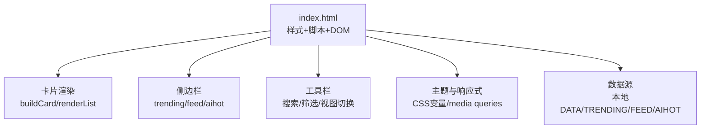
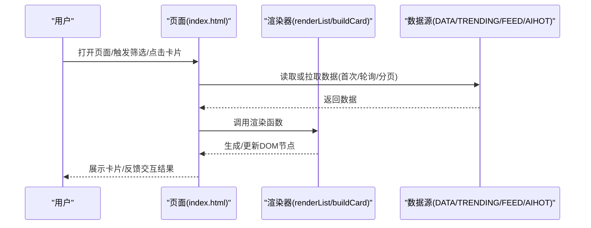
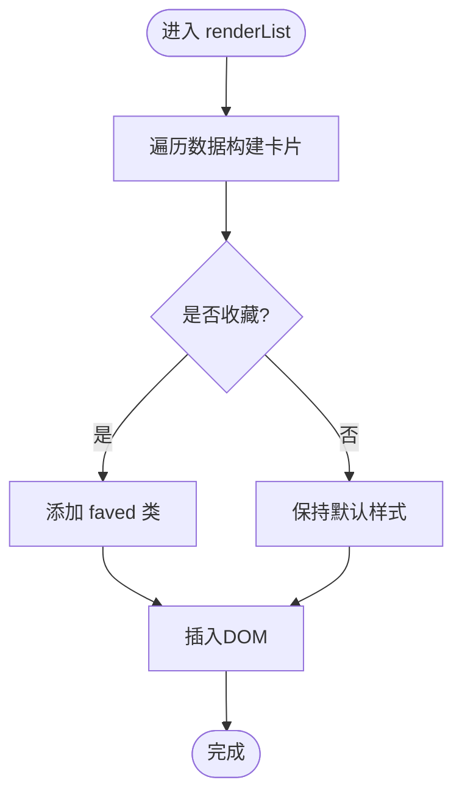
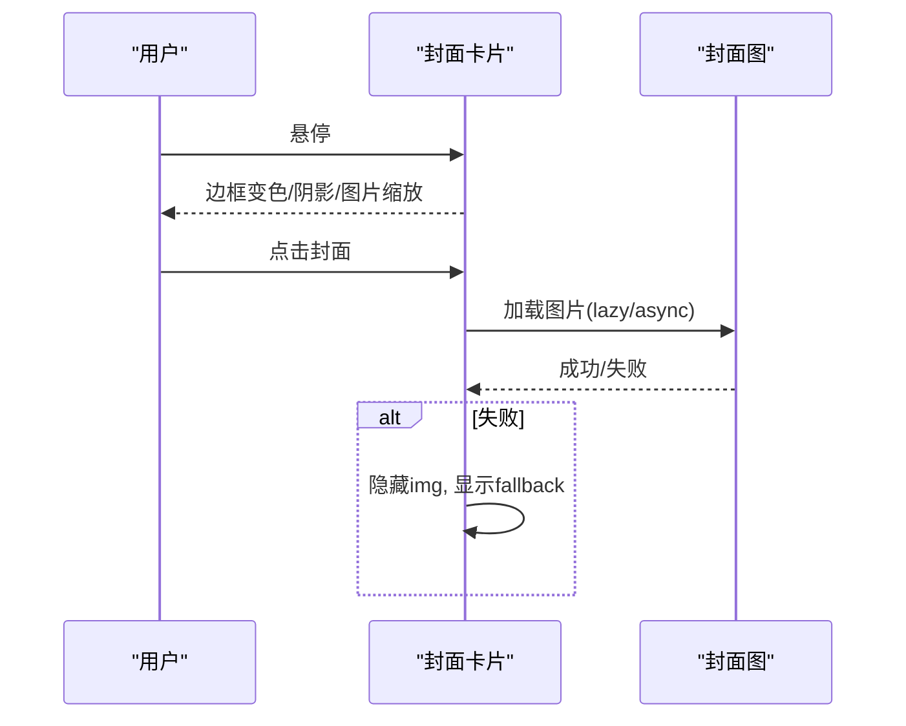
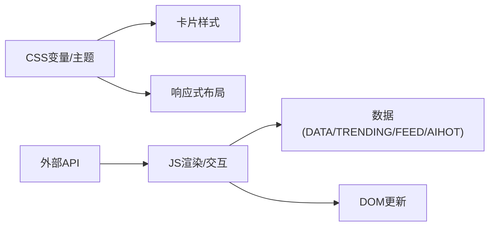

# 卡片组件

<cite>
**本文引用的文件**
- [index.html](file://index.html)
- [README.md](file://README.md)
</cite>

## 目录
1. [简介](#简介)
2. [项目结构](#项目结构)
3. [核心组件](#核心组件)
4. [架构总览](#架构总览)
5. [详细组件分析](#详细组件分析)
6. [依赖关系分析](#依赖关系分析)
7. [性能考量](#性能考量)
8. [故障排查指南](#故障排查指南)
9. [结论](#结论)
10. [附录](#附录)

## 简介
本仓库是一个“GitHub Star 收藏台”的前端页面，采用单页 HTML + CSS + JS 实现。页面包含多种卡片类型：项目卡片、统计卡片、趋势卡片、RSS/资讯流卡片等，支持主题切换（明/暗）、响应式布局、搜索与筛选、收藏置顶、数据刷新与轮询更新。文档聚焦于卡片的布局结构、样式属性、内容展示方式、交互行为（悬停、点击跳转、数据更新机制）、使用示例与组合模式、响应式设计与主题适配方案，以及数据绑定机制与性能优化技巧。

## 项目结构
- 入口页面 index.html 承载全部 UI、样式与脚本逻辑，包含：
  - 全局 CSS 变量与主题（明/暗）
  - 多类卡片样式（项目卡片、封面卡片、列表行、趋势项、资讯条目等）
  - 渲染与交互脚本（数据获取、过滤、排序、收藏、搜索、轮询）
- README.md 说明仓库结构与自动更新流程。

图表来源
- [index.html:10-74](file://index.html#L10-L74)
- [index.html:326-435](file://index.html#L326-L435)
- [index.html:1162-1167](file://index.html#L1162-L1167)
- [index.html:1500-1513](file://index.html#L1500-L1513)
- [index.html:1540-1588](file://index.html#L1540-L1588)
- [index.html:1690-1726](file://index.html#L1690-L1726)

章节来源
- [README.md:1-22](file://README.md#L1-L22)
- [index.html:10-74](file://index.html#L10-L74)

## 核心组件
- 项目卡片（基础卡片与封面卡片）
  - 基础卡片：用于紧凑信息展示，含名称、描述、元数据（语言、星标等），支持收藏按钮与分类标签。
  - 封面卡片：三段式布局（封面区/正文区/元数据吸底区），带封面图懒加载与失败降级、收藏悬浮按钮、分类标签、打开链接等。
- 统计卡片（数据指标条）
  - 以网格形式展示关键指标（如总数、新增、增长等），无外框，强调数字与图标。
- 趋势卡片（侧边栏排行）
  - 按“上升/总量/新发现”等维度展示热门项目，支持切换标签与更多详情弹窗。
- 资讯/Feed 卡片（关注动态与AI热点）
  - 关注动态：时间线式条目，显示动作类型、目标与时间。
  - AI热点：分类筛选、分页加载、来源标注与相对时间。

章节来源
- [index.html:194-217](file://index.html#L194-L217)
- [index.html:326-435](file://index.html#L326-L435)
- [index.html:461-517](file://index.html#L461-L517)
- [index.html:518-562](file://index.html#L518-L562)
- [index.html:1540-1588](file://index.html#L1540-L1588)
- [index.html:1690-1726](file://index.html#L1690-L1726)

## 架构总览
页面通过统一的数据模型与渲染函数将不同来源的数据映射到各类卡片中；交互事件集中在事件绑定阶段，采用事件委托提升性能；主题与响应式通过 CSS 变量与媒体查询控制。

图表来源
- [index.html:1162-1167](file://index.html#L1162-L1167)
- [index.html:1500-1513](file://index.html#L1500-L1513)
- [index.html:1540-1588](file://index.html#L1540-L1588)
- [index.html:1690-1726](file://index.html#L1690-L1726)
- [index.html:1744-1908](file://index.html#L1744-L1908)

## 详细组件分析

### 项目卡片（基础卡片）
- 布局结构
  - 顶部：所有者/名称区域，右侧收藏按钮。
  - 中部：描述文本，支持展开/收起。
  - 底部：元数据（语言色点、星标数、分类标签等）。
- 样式属性
  - 边框、圆角、阴影、悬停上浮与高亮边框。
  - 收藏状态时背景渐变与边框色变化。
- 交互行为
  - 悬停：边框变色、轻微上移、阴影加深。
  - 点击收藏：切换收藏状态并持久化至本地存储，重新渲染列表。
  - 描述展开/收起：切换类名控制行数限制。
- 数据绑定
  - 通过 buildCard 创建 article.card，根据是否收藏添加 faved 类。
  - 分类颜色由 catColor 计算，考虑主题差异。
- 性能要点
  - 仅对必要元素进行 DOM 操作；收藏变更触发局部重渲染。

图表来源
- [index.html:326-367](file://index.html#L326-L367)
- [index.html:1162-1167](file://index.html#L1162-L1167)
- [index.html:1910-1916](file://index.html#L1910-L1916)

章节来源
- [index.html:326-367](file://index.html#L326-L367)
- [index.html:1162-1167](file://index.html#L1162-L1167)
- [index.html:1910-1916](file://index.html#L1910-L1916)

### 项目卡片（封面卡片）
- 布局结构
  - 上部：封面图（失败时回退为纸纹与首字母占位）。
  - 中部：名称、描述、分类标签。
  - 下部：元数据吸底区（语言、星标、更新时间、打开链接）。
- 样式属性
  - 自定义高度变量、图片缩放过渡、悬停边框混色与阴影。
  - 收藏按钮带毛玻璃背景，适配明暗主题。
- 交互行为
  - 悬停：封面图轻微放大、卡片边框与阴影变化（仅在精确指针设备生效）。
  - 点击封面或打开链接：跳转到外部仓库。
  - 收藏：同基础卡片。
- 数据绑定
  - 封面图优先使用 cover_image，否则尝试 GitHub OpenGraph 地址。
  - 错误处理：监听 error 事件，隐藏 img 并添加 no-img 类以显示 fallback。
- 性能要点
  - 图片 lazy loading、async decoding、referrerpolicy 优化。
  - 错误重试一次，避免瞬时网络抖动导致误判。

图表来源
- [index.html:369-435](file://index.html#L369-L435)
- [index.html:1990-2002](file://index.html#L1990-L2002)

章节来源
- [index.html:369-435](file://index.html#L369-L435)
- [index.html:1990-2002](file://index.html#L1990-L2002)

### 统计卡片（数据指标条）
- 布局结构
  - 四列网格，每项包含图标、数值、标签。
- 样式属性
  - 无边框内嵌风格，强调数字与图标色彩。
- 交互行为
  - 数字滚动动画：首次进入视口触发计数动画。
- 数据绑定
  - 从 DATA 长度等聚合数据渲染。
- 性能要点
  - IntersectionObserver 仅触发一次，避免重复动画。

章节来源
- [index.html:194-217](file://index.html#L194-L217)
- [index.html:1963-1984](file://index.html#L1963-L1984)

### 趋势卡片（侧边栏排行）
- 布局结构
  - 标签切换（上升/总量/新发现），列表项包含排名、名称、描述、原因、增量徽章、语言、星标、时间。
- 样式属性
  - 前三名排名特殊配色；增量徽章使用更新色。
- 交互行为
  - 切换标签：更新 active 态并渲染对应数据。
  - “更多”弹窗：展示完整列表。
- 数据绑定
  - 从 TRENDING 对象按当前 tab 渲染。
- 性能要点
  - 仅渲染前 20 项，减少 DOM 压力。

章节来源
- [index.html:461-517](file://index.html#L461-L517)
- [index.html:1500-1535](file://index.html#L1500-L1535)

### 资讯/Feed 卡片（关注动态与AI热点）
- 关注动态
  - 时间线条目，显示动作类型、目标与时间；支持实时拉取与静默降级。
  - 每 30 分钟轮询，页面不可见时暂停。
- AI热点
  - 主源先渲染，新闻源异步追加；支持分类筛选与游标分页加载更多。
  - 标题去重、相对时间展示。
- 数据绑定
  - FEED 与 AIHOT 数据分别渲染；失败时保持静态兜底。
- 性能要点
  - 异步加载不阻塞首屏；超时放弃；去重避免重复渲染。

章节来源
- [index.html:518-562](file://index.html#L518-L562)
- [index.html:1540-1588](file://index.html#L1540-L1588)
- [index.html:1690-1726](file://index.html#L1690-L1726)
- [index.html:1728-1741](file://index.html#L1728-L1741)

### 列表视图（行卡片）
- 布局结构
  - 行级展示：名称、描述、元数据、收藏按钮。
- 样式属性
  - 行悬停背景变化；收藏行背景渐变。
- 交互行为
  - 与卡片视图一致，支持收藏与分类筛选。
- 数据绑定
  - 复用同一数据源，按视图切换渲染。

章节来源
- [index.html:438-454](file://index.html#L438-L454)

## 依赖关系分析
- 样式依赖
  - 全局 CSS 变量定义主题色板与尺寸，覆盖明/暗主题。
  - 媒体查询控制响应式布局（栅格列数、侧边栏位置、卡片高度等）。
- 脚本依赖
  - 渲染函数依赖数据对象（DATA/TRENDING/FEED/AIHOT）。
  - 事件绑定集中管理，使用事件委托降低绑定成本。
- 外部资源
  - 字体（Google Fonts）、图片（封面图/OpenGraph）。
  - API（事件流、AI热点、新闻代理）在浏览器直连，无需 Key。

图表来源
- [index.html:10-74](file://index.html#L10-L74)
- [index.html:687-743](file://index.html#L687-L743)
- [index.html:1744-1908](file://index.html#L1744-L1908)

章节来源
- [index.html:10-74](file://index.html#L10-L74)
- [index.html:687-743](file://index.html#L687-L743)
- [index.html:1744-1908](file://index.html#L1744-L1908)

## 性能考量
- 图片优化
  - 封面图使用 lazy loading、async decoding、referrerpolicy 控制，减少带宽与隐私风险。
  - 错误处理：捕获加载失败，隐藏图片并显示 fallback，必要时重试一次。
- 渲染优化
  - 列表仅渲染前 20 项；分类筛选与搜索在前端完成，避免频繁请求。
  - 事件委托：一次性绑定容器事件，减少内存占用。
- 动画与可见性
  - 统计数字滚动仅在首次进入视口触发；页面不可见时暂停轮询。
- 主题与响应式
  - 通过 CSS 变量与媒体查询高效切换主题与布局，避免重排重绘过多。

章节来源
- [index.html:369-435](file://index.html#L369-L435)
- [index.html:1515-1529](file://index.html#L1515-L1529)
- [index.html:1728-1741](file://index.html#L1728-L1741)
- [index.html:1963-1984](file://index.html#L1963-L1984)
- [index.html:1990-2002](file://index.html#L1990-L2002)

## 故障排查指南
- 封面图加载失败
  - 现象：封面图不显示或闪烁。
  - 处理：检查 error 监听是否正确注册；确认 fallback 类 no-img 已添加；必要时手动重试。
- 数据为空或加载失败
  - 现象：列表或侧边栏无内容。
  - 处理：检查 API 返回状态；确认静默降级逻辑；查看控制台错误。
- 收藏状态未保存
  - 现象：刷新后收藏丢失。
  - 处理：检查 localStorage 写入是否成功；确认 saveFavs 被调用。
- 主题切换无效
  - 现象：明/暗主题未生效。
  - 处理：检查 data-theme 属性设置；确认 CSS 变量覆盖正确。

章节来源
- [index.html:1990-2002](file://index.html#L1990-L2002)
- [index.html:1910-1916](file://index.html#L1910-L1916)
- [index.html:1842-1846](file://index.html#L1842-L1846)

## 结论
该项目的卡片组件体系以单一 HTML 文件为核心，通过清晰的样式分层与模块化脚本实现了多类型卡片的高效渲染与交互。封面卡片提供了丰富的视觉表现与良好的容错机制；统计、趋势与资讯卡片则满足了数据展示与信息聚合需求。整体设计注重性能与可访问性，结合主题与响应式能力，适用于多场景下的前端展示。

## 附录

### 卡片使用示例与组合模式
- 基础项目卡片
  - 适用：快速浏览仓库基本信息。
  - 组合：与分类标签、筛选器配合使用。
- 封面项目卡片
  - 适用：强调视觉与品牌感的项目展示。
  - 组合：与收藏、打开链接、分类标签组合。
- 统计卡片
  - 适用：首页概览，突出关键指标。
  - 组合：置于页面顶部，配合滚动动画。
- 趋势卡片
  - 适用：侧边栏推荐，引导用户发现热门项目。
  - 组合：与“更多”弹窗联动，提供完整列表。
- 资讯/Feed 卡片
  - 适用：关注动态与AI热点聚合。
  - 组合：分类筛选、分页加载、实时更新。

章节来源
- [index.html:326-435](file://index.html#L326-L435)
- [index.html:461-517](file://index.html#L461-L517)
- [index.html:518-562](file://index.html#L518-L562)
- [index.html:1540-1588](file://index.html#L1540-L1588)
- [index.html:1690-1726](file://index.html#L1690-L1726)

### 响应式设计与主题适配方案
- 响应式
  - 栅格列数随屏幕宽度调整；侧边栏在小屏下变为静态布局；卡片高度自适应。
- 主题
  - 通过 data-theme 切换明/暗主题；CSS 变量统一管控颜色与阴影；部分效果针对精确指针设备启用。

章节来源
- [index.html:687-743](file://index.html#L687-L743)
- [index.html:10-74](file://index.html#L10-L74)

### 数据绑定机制与性能优化技巧
- 数据绑定
  - 构建卡片时根据数据字段生成 DOM；分类颜色与主题相关；收藏状态影响样式与排序。
- 性能优化
  - 事件委托、懒加载图片、IntersectionObserver 触发动画、分页与去重、静默降级与超时控制。

章节来源
- [index.html:1162-1167](file://index.html#L1162-L1167)
- [index.html:1963-1984](file://index.html#L1963-L1984)
- [index.html:1690-1726](file://index.html#L1690-L1726)