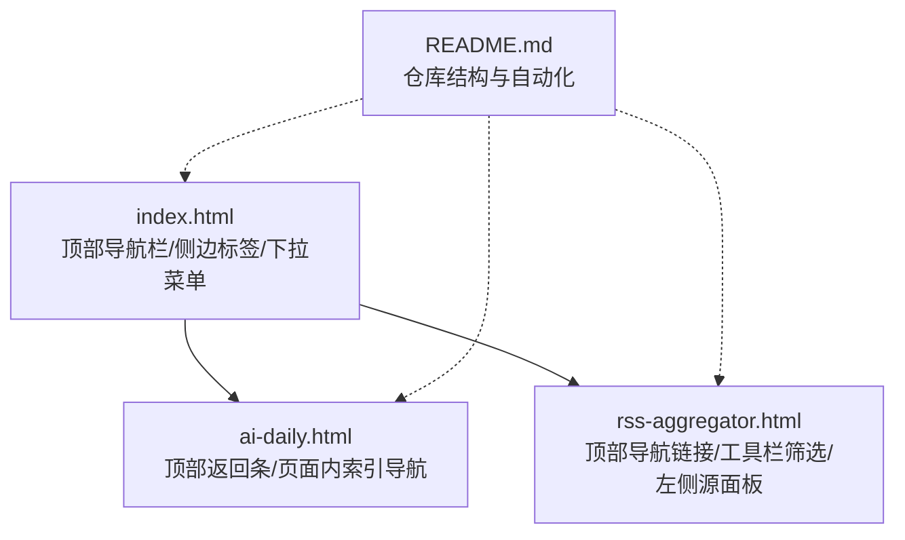
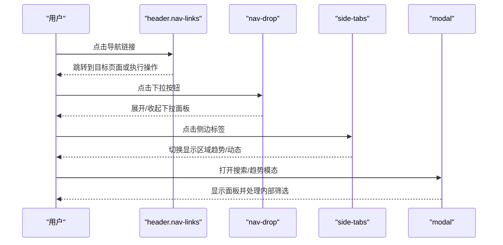
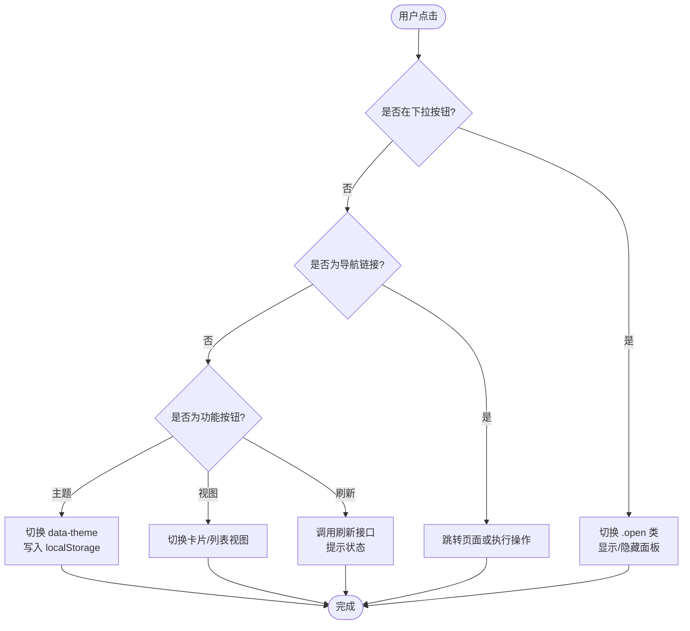
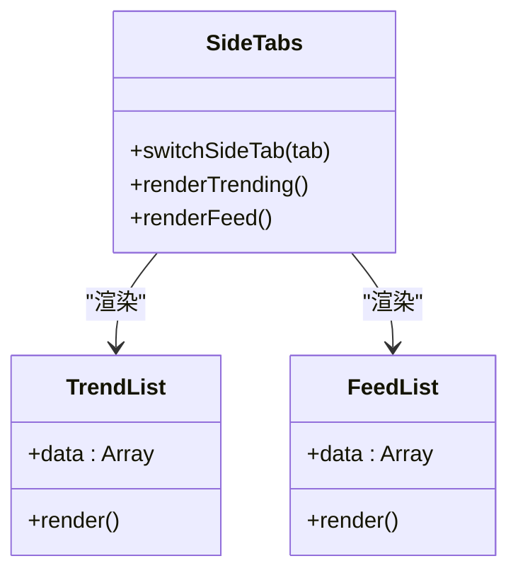
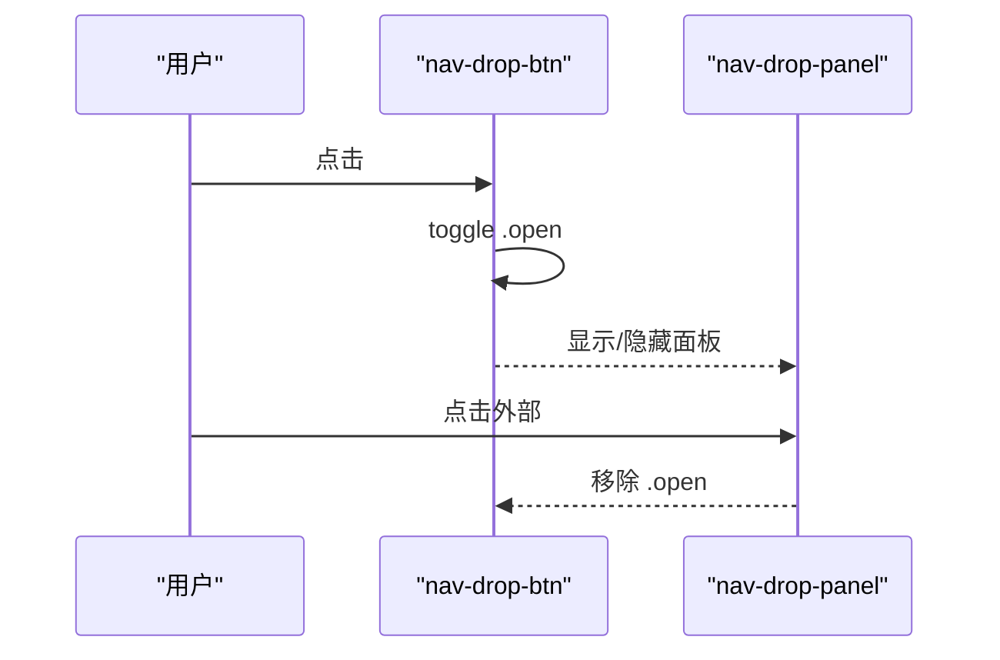
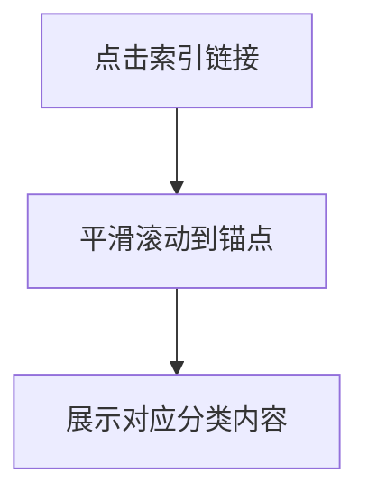
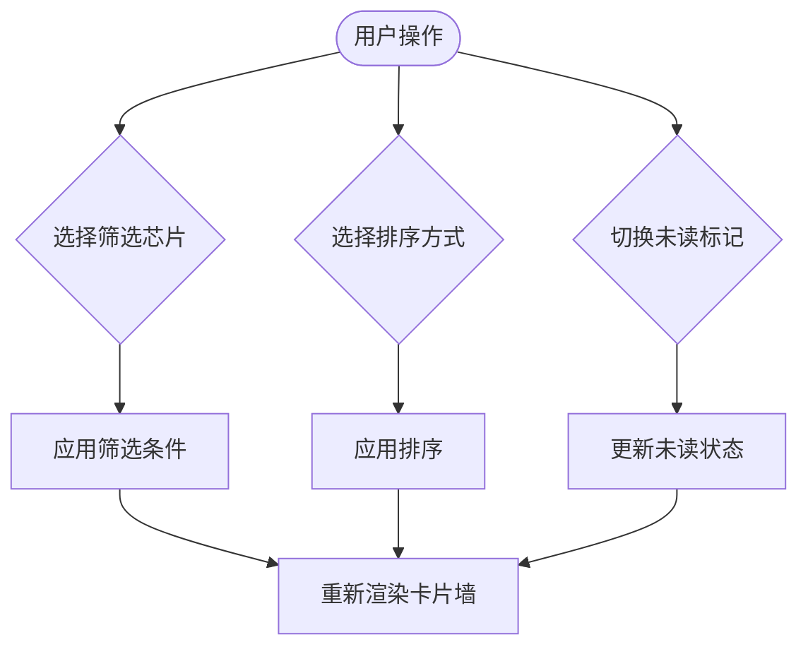
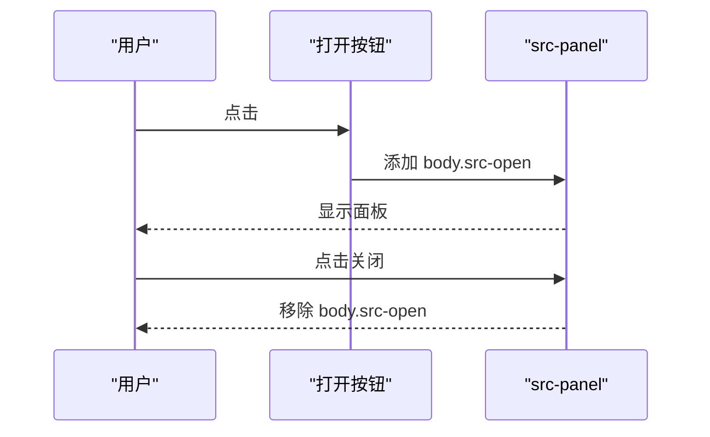
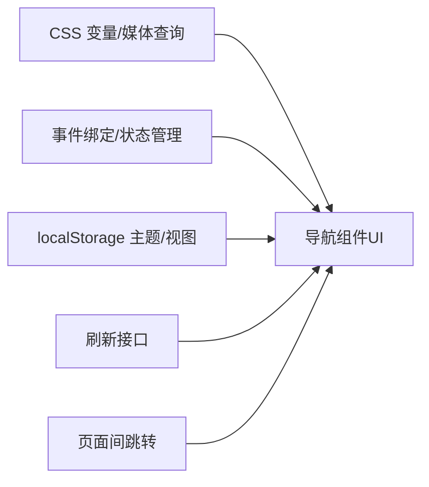

# 导航组件

<cite>
**本文引用的文件**
- [index.html](file://index.html)
- [ai-daily.html](file://ai-daily.html)
- [rss-aggregator.html](file://rss-aggregator.html)
- [README.md](file://README.md)
</cite>

## 目录
1. [简介](#简介)
2. [项目结构](#项目结构)
3. [核心组件](#核心组件)
4. [架构总览](#架构总览)
5. [详细组件分析](#详细组件分析)
6. [依赖关系分析](#依赖关系分析)
7. [性能考量](#性能考量)
8. [故障排查指南](#故障排查指南)
9. [结论](#结论)
10. [附录：使用与扩展](#附录使用与扩展)

## 简介
本文件为“StarHub”站点中的导航组件提供系统化文档，覆盖顶部导航栏、侧边标签页、下拉菜单、页面内索引导航等。内容包含结构设计、样式配置、交互逻辑、状态管理、路由切换与跳转机制、可访问性支持、移动端适配方案，以及性能优化与用户体验设计原则。所有说明均基于仓库中实际 HTML/CSS/JS 实现进行归纳。

## 项目结构
- 入口页面 index.html 承载主工作台，包含顶部导航栏（站点导航 + 功能按钮）、侧边标签页（趋势/动态）和主体内容区。
- ai-daily.html 为独立日报页面，包含顶部返回条、主题切换按钮与页面内分类索引导航。
- rss-aggregator.html 为 RSS 聚合阅读器页面，包含顶部导航链接、工具栏筛选、左侧源面板抽屉等导航元素。
- README.md 说明仓库结构与自动更新流程，帮助理解页面生成与部署背景。

图表来源
- [index.html:90-150](file://index.html#L90-L150)
- [ai-daily.html:33-74](file://ai-daily.html#L33-L74)
- [rss-aggregator.html:39-66](file://rss-aggregator.html#L39-L66)
- [README.md:7-13](file://README.md#L7-L13)

章节来源
- [README.md:7-13](file://README.md#L7-L13)

## 核心组件
- 顶部导航栏（Header Nav）
  - 站点导航链接（如 AI 晨报、RSS 聚合）
  - 下拉菜单（学习资源、资讯平台、AI 工具）
  - 功能按钮（视图切换、主题切换、导出/导入、刷新）
- 侧边标签页（Side Tabs）
  - 趋势列表与关注动态的切换容器
- 页面内索引导航
  - 日报页面的分类锚点索引
- 工具栏与筛选导航
  - RSS 聚合页面的信源筛选、排序、未读切换等
- 左侧源面板（Drawer）
  - 可滑出的侧边面板用于选择信源与分类

章节来源
- [index.html:112-150](file://index.html#L112-L150)
- [index.html:177-188](file://index.html#L177-L188)
- [ai-daily.html:66-74](file://ai-daily.html#L66-L74)
- [rss-aggregator.html:54-66](file://rss-aggregator.html#L54-L66)
- [rss-aggregator.html:169-198](file://rss-aggregator.html#L169-L198)

## 架构总览
导航组件由“静态结构 + CSS 样式 + JS 事件绑定”三部分构成：
- 结构层：HTML 语义化标签与类名组织导航区域
- 样式层：CSS 变量、响应式媒体查询、过渡动画
- 交互层：事件监听、状态切换、模态框控制、键盘快捷键

图表来源
- [index.html:754-784](file://index.html#L754-L784)
- [index.html:177-188](file://index.html#L177-L188)
- [index.html:1858-1893](file://index.html#L1858-L1893)

## 详细组件分析

### 顶部导航栏（Header Nav）
- 结构
  - 品牌标识与标题
  - 站点导航链接（高亮样式）
  - 下拉菜单（带箭头指示与面板）
  - 功能按钮组（视图、主题、导出/导入、刷新）
- 样式要点
  - 粘性定位与毛玻璃背景
  - 胶囊形按钮与悬停反馈
  - 下拉面板绝对定位与过渡动画
- 交互逻辑
  - 下拉菜单通过添加/移除 open 类控制显隐
  - 主题切换通过 data-theme 属性与本地存储持久化
  - 视图切换在卡片与列表之间切换
  - 刷新按钮调用外部接口触发数据更新
- 可访问性
  - aria-label、aria-expanded、aria-haspopup 等语义属性
  - focus-visible 可见焦点环（在部分页面）
- 移动端适配
  - 小屏下导航链接横向滚动、下拉面板左对齐

图表来源
- [index.html:90-150](file://index.html#L90-L150)
- [index.html:1842-1851](file://index.html#L1842-L1851)
- [index.html:1824-1839](file://index.html#L1824-L1839)

章节来源
- [index.html:90-150](file://index.html#L90-L150)
- [index.html:754-800](file://index.html#L754-L800)
- [index.html:1842-1851](file://index.html#L1842-L1851)
- [index.html:1824-1839](file://index.html#L1824-L1839)

### 侧边标签页（Side Tabs）
- 结构
  - 标签按钮组（趋势、动态）
  - 对应内容区域（趋势列表、关注动态）
- 样式要点
  - 统一边框与激活态高亮
  - 非激活内容隐藏
- 交互逻辑
  - 点击标签切换 on 类，控制内容显示
  - 与趋势标签、搜索模态联动
- 可访问性
  - 通过按钮与 aria 属性表达当前选中状态
- 移动端适配
  - 在小屏幕下侧边区域自适应布局

图表来源
- [index.html:177-188](file://index.html#L177-L188)
- [index.html:1858-1867](file://index.html#L1858-L1867)

章节来源
- [index.html:177-188](file://index.html#L177-L188)
- [index.html:1858-1867](file://index.html#L1858-L1867)

### 下拉菜单（Dropdown）
- 结构
  - 触发按钮（含图标与箭头）
  - 下拉面板（多个链接项）
- 样式要点
  - 绝对定位与居中偏移
  - 透明度与可见性过渡
  - 悬停高亮与图标透明度变化
- 交互逻辑
  - 点击按钮切换 open 类
  - 点击面板外关闭（通过全局 click 监听）
- 可访问性
  - aria-expanded、aria-haspopup 描述状态
- 移动端适配
  - 面板左对齐以适应窄屏

图表来源
- [index.html:126-149](file://index.html#L126-L149)
- [index.html:1890-1893](file://index.html#L1890-L1893)

章节来源
- [index.html:126-149](file://index.html#L126-L149)
- [index.html:1890-1893](file://index.html#L1890-L1893)

### 页面内索引导航（日报）
- 结构
  - 分类索引条（罗马数字编号与计数）
  - 各分类区块（id 锚点）
- 样式要点
  - 居中对齐与间距
  - 悬停颜色变化
- 交互逻辑
  - 点击索引平滑滚动到对应区块
- 可访问性
  - aria-label 标注索引用途
- 移动端适配
  - 多列布局在小屏下退化为单列

图表来源
- [ai-daily.html:66-74](file://ai-daily.html#L66-L74)
- [ai-daily.html:169-171](file://ai-daily.html#L169-L171)

章节来源
- [ai-daily.html:66-74](file://ai-daily.html#L66-L74)
- [ai-daily.html:169-171](file://ai-daily.html#L169-L171)

### 工具栏与筛选导航（RSS 聚合）
- 结构
  - 工具栏（标题、信源按钮、筛选芯片、刷新、未读切换）
  - 搜索行（全局搜索、排序选择）
- 样式要点
  - 胶囊形按钮与激活态高亮
  - 聚焦可见环与过渡效果
- 交互逻辑
  - 筛选芯片切换 on 类以过滤内容
  - 刷新按钮加载数据并显示加载状态
  - 未读切换标记已读/未读
- 可访问性
  - 按钮与输入框具备 focus-visible 样式
- 移动端适配
  - 工具栏换行与弹性布局

图表来源
- [rss-aggregator.html:54-66](file://rss-aggregator.html#L54-L66)
- [rss-aggregator.html:102-118](file://rss-aggregator.html#L102-L118)

章节来源
- [rss-aggregator.html:54-66](file://rss-aggregator.html#L54-L66)
- [rss-aggregator.html:102-118](file://rss-aggregator.html#L102-L118)

### 左侧源面板（Drawer）
- 结构
  - 头部（标题、关闭按钮、搜索）
  - 列表（全部、分类、信源）
- 样式要点
  - 固定定位与滑出动画
  - 遮罩层（Scrim）控制交互范围
- 交互逻辑
  - 打开/关闭面板切换 body 类
  - 选择信源后高亮并过滤内容
- 可访问性
  - 关闭按钮与搜索输入具备焦点样式
- 移动端适配
  - 宽度限制与视口适配

图表来源
- [rss-aggregator.html:169-198](file://rss-aggregator.html#L169-L198)

章节来源
- [rss-aggregator.html:169-198](file://rss-aggregator.html#L169-L198)

## 依赖关系分析
- 样式依赖
  - CSS 变量统一管理主题色、阴影、圆角等
  - 媒体查询实现响应式布局
  - 过渡与动画提升交互体验
- 脚本依赖
  - 事件绑定负责导航状态切换与内容渲染
  - 本地存储持久化主题与视图偏好
  - 网络请求触发数据刷新与更新
- 页面间依赖
  - 顶部导航链接在不同页面间跳转
  - 共享主题与风格保持一致

图表来源
- [index.html:18-73](file://index.html#L18-L73)
- [index.html:1842-1851](file://index.html#L1842-L1851)
- [index.html:1824-1839](file://index.html#L1824-L1839)

章节来源
- [index.html:18-73](file://index.html#L18-L73)
- [index.html:1842-1851](file://index.html#L1842-L1851)
- [index.html:1824-1839](file://index.html#L1824-L1839)

## 性能考量
- 减少重排与重绘
  - 使用类切换而非频繁修改样式
  - 避免在高频事件中执行昂贵计算
- 合理使用动画
  - 仅对必要元素启用过渡与动画
  - 尊重 prefers-reduced-motion 设置
- 网络请求节流
  - 刷新按钮冷却时间防止重复提交
- 图片与内容懒加载
  - 封面图错误降级与重试机制
- 可访问性与性能平衡
  - 保持语义化与焦点管理的同时避免过度 DOM 操作

[本节为通用指导，不直接分析具体文件]

## 故障排查指南
- 下拉菜单无法展开
  - 检查是否缺少 .open 类切换逻辑
  - 确认全局点击监听是否正确移除 .open
- 主题切换无效
  - 检查 data-theme 属性与本地存储键值
  - 确认 applyTheme 函数是否被调用
- 刷新失败
  - 检查网络请求状态码与错误信息
  - 确认冷却时间与按钮禁用状态
- 侧边标签切换异常
  - 检查 on 类是否正确切换
  - 确认内容区域显示/隐藏逻辑

章节来源
- [index.html:1890-1893](file://index.html#L1890-L1893)
- [index.html:1842-1851](file://index.html#L1842-L1851)
- [index.html:1824-1839](file://index.html#L1824-L1839)
- [index.html:1858-1867](file://index.html#L1858-L1867)

## 结论
该项目的导航组件采用简洁的 HTML/CSS/JS 实现，具备良好的可维护性与可扩展性。通过语义化结构、统一的样式变量与清晰的事件绑定，实现了顶部导航、侧边标签、下拉菜单、页面内索引与工具栏筛选等功能。同时兼顾了可访问性与移动端适配，提供了流畅的用户体验。建议在后续迭代中继续遵循现有模式，确保新增导航元素的一致性与性能。

[本节为总结性内容，不直接分析具体文件]

## 附录：使用与扩展
- 新增顶部导航链接
  - 在 nav-links 中添加 a 元素，必要时添加 nav-highlight 类
  - 确保 href 指向正确页面或执行相应操作
- 新增下拉菜单
  - 复制现有 nav-drop 结构，调整内容与样式
  - 确保 aria 属性与交互逻辑一致
- 扩展侧边标签
  - 添加新的 side-tab 与对应内容区域
  - 更新 switchSideTab 逻辑以支持新标签
- 自定义主题
  - 修改 CSS 变量以适配品牌色
  - 确保明暗模式下的对比度与可读性
- 移动端优化
  - 调整媒体查询以适配不同屏幕尺寸
  - 优化触摸交互与手势支持

[本节为通用指导，不直接分析具体文件]