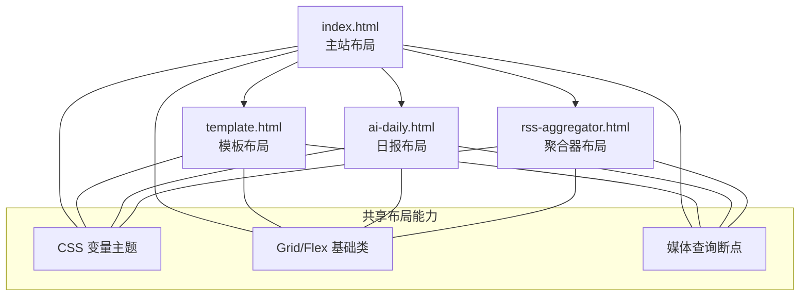
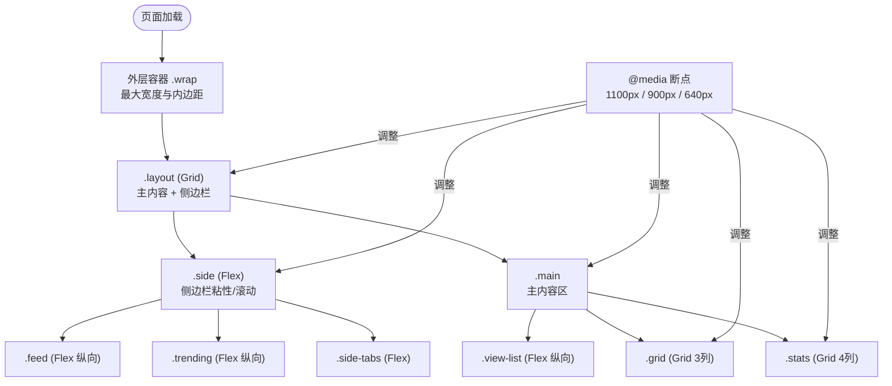
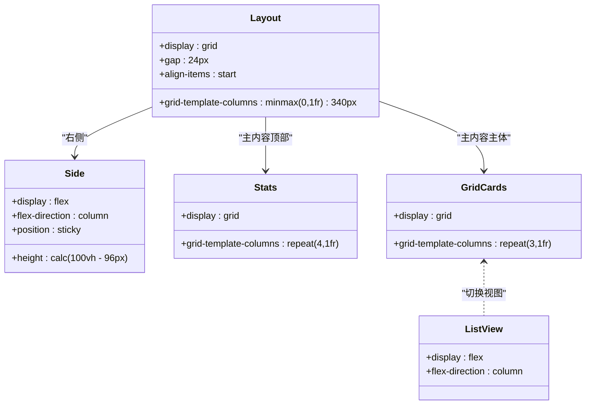
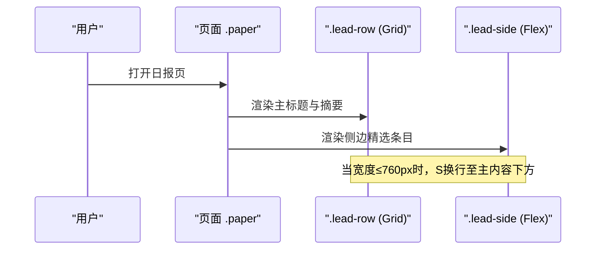
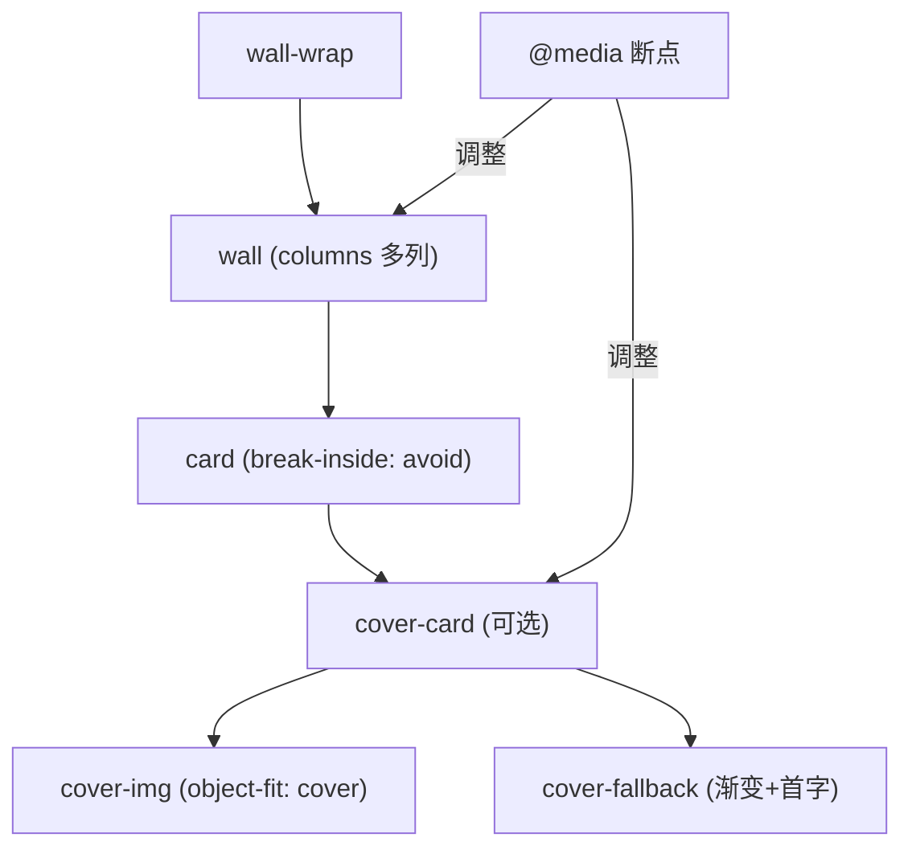
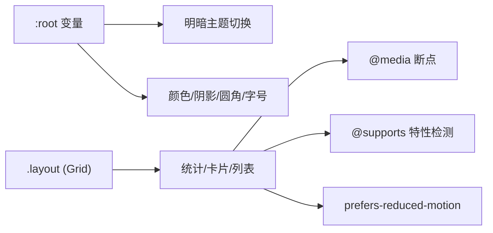

# 布局组件

<cite>
**本文引用的文件**
- [index.html](file://index.html)
- [template.html](file://template.html)
- [ai-daily.html](file://ai-daily.html)
- [rss-aggregator.html](file://rss-aggregator.html)
</cite>

## 目录
1. [简介](#简介)
2. [项目结构](#项目结构)
3. [核心组件](#核心组件)
4. [架构总览](#架构总览)
5. [详细组件分析](#详细组件分析)
6. [依赖关系分析](#依赖关系分析)
7. [性能考虑](#性能考虑)
8. [故障排查指南](#故障排查指南)
9. [结论](#结论)
10. [附录](#附录)

## 简介
本文件聚焦于本项目中的“布局组件”体系，系统梳理并说明项目中使用的网格布局（CSS Grid）、弹性布局（Flexbox）、响应式容器与断点策略。文档覆盖：
- 页面级布局、侧边栏与主内容区的栅格组织
- 卡片墙、统计面板、列表视图等常用布局模式
- 响应式断点、移动端适配与可访问性支持
- 打印样式与交互体验优化
- 性能考量与浏览器兼容性处理

## 项目结构
本项目为多页面静态站点，布局相关样式以内联 <style> 形式存在于各 HTML 文件中，采用 CSS 变量统一主题与尺寸，配合媒体查询实现响应式。主要页面包括：
- index.html / template.html：主站“收藏台”布局（双列栅格 + 侧边栏）
- ai-daily.html：日报页（单栏/双栏混合栅格）
- rss-aggregator.html：RSS 聚合器（瀑布流卡片墙 + 左侧抽屉）

**图表来源**
- [index.html:172-175](file://index.html#L172-L175)
- [ai-daily.html:83-106](file://ai-daily.html#L83-L106)
- [rss-aggregator.html:120-124](file://rss-aggregator.html#L120-L124)

**章节来源**
- [index.html:172-175](file://index.html#L172-L175)
- [ai-daily.html:83-106](file://ai-daily.html#L83-L106)
- [rss-aggregator.html:120-124](file://rss-aggregator.html#L120-L124)

## 核心组件
- 页面级栅格框架
  - 主布局使用 CSS Grid 将页面分为“主内容区 + 固定宽度侧边栏”，在窄屏下自动切换为单列堆叠。
  - 侧边栏使用 Flexbox 纵向排列，支持粘性定位与滚动区域控制。
- 统计面板
  - 使用 Grid 四列均分，在小屏下回退到两列，保证数据可读性。
- 卡片网格与封面卡
  - 卡片网格默认三列，小屏逐步降级至两列、一列；封面卡通过 CSS 变量控制高度，适配不同屏幕。
- 列表视图
  - 通过切换 class 将网格转为 Flex 纵向列表，行内元素使用 Flex 对齐与信息分区。
- 日报页布局
  - 首屏采用 1.6fr : 1fr 的双栏栅格，侧边信息在窄屏下换行堆叠。
  - 内容区块采用双列栅格，便于长文阅读。
- RSS 聚合器卡片墙
  - 使用 columns 多列瀑布流布局，按最小列宽自适应列数；提供封面卡变体与悬停动效门控。

**章节来源**
- [index.html:172-175](file://index.html#L172-L175)
- [index.html:194-198](file://index.html#L194-L198)
- [index.html:327-333](file://index.html#L327-L333)
- [index.html:438-454](file://index.html#L438-L454)
- [ai-daily.html:83-106](file://ai-daily.html#L83-L106)
- [rss-aggregator.html:120-124](file://rss-aggregator.html#L120-L124)

## 架构总览
下图展示了页面级布局的组成与响应式行为：

**图表来源**
- [index.html:172-175](file://index.html#L172-L175)
- [index.html:194-198](file://index.html#L194-L198)
- [index.html:327-333](file://index.html#L327-L333)
- [index.html:438-454](file://index.html#L438-L454)
- [index.html:688-739](file://index.html#L688-L739)

## 详细组件分析

### 页面级栅格与侧边栏（index.html / template.html）
- 栅格定义
  - 使用 Grid 将页面划分为“主内容 + 340px 侧边栏”，gap 控制间距，align-items 控制垂直对齐。
- 侧边栏
  - 使用 Flex 纵向排列，设置粘性定位与视口高度，内部包含分类标签与列表区域。
- 统计面板
  - 使用 Grid 四列均分，边框分隔；在 900px 以下切换为两列，避免拥挤。
- 卡片网格
  - 默认三列，随断点递减至两列、一列；卡片使用 Flex 纵向排版，元数据区域使用 Flex 横向排列。
- 列表视图
  - 通过添加 view-list 类将网格切换为 Flex 纵向列表，行内元素使用 Flex 划分名称、描述、元数据区域。

**图表来源**
- [index.html:172-175](file://index.html#L172-L175)
- [index.html:194-198](file://index.html#L194-L198)
- [index.html:327-333](file://index.html#L327-L333)
- [index.html:438-454](file://index.html#L438-L454)

**章节来源**
- [index.html:172-175](file://index.html#L172-L175)
- [index.html:194-198](file://index.html#L194-L198)
- [index.html:327-333](file://index.html#L327-L333)
- [index.html:438-454](file://index.html#L438-L454)

### 日报页布局（ai-daily.html）
- 首屏双栏
  - 使用 Grid 1.6fr : 1fr 的主次内容比例，侧边信息在窄屏下换行堆叠。
- 内容区块
  - 使用双列栅格展示条目，保持阅读节奏与视觉密度。
- 响应式
  - 在 760px 以下将首屏改为单列，侧边信息上移并加顶部分隔线；内容区块也切换为单列。

**图表来源**
- [ai-daily.html:83-90](file://ai-daily.html#L83-L90)
- [ai-daily.html:106-118](file://ai-daily.html#L106-L118)
- [ai-daily.html:129-136](file://ai-daily.html#L129-L136)

**章节来源**
- [ai-daily.html:83-90](file://ai-daily.html#L83-L90)
- [ai-daily.html:106-118](file://ai-daily.html#L106-L118)
- [ai-daily.html:129-136](file://ai-daily.html#L129-L136)

### RSS 聚合器卡片墙（rss-aggregator.html）
- 卡片墙
  - 使用 columns 多列瀑布流，按最小列宽自适应列数，适合长短不一的内容卡片。
- 封面卡
  - 提供图片优先的封面卡样式，无图时显示分类色渐变与首字占位；悬停缩放仅在精确指针设备生效。
- 响应式
  - 在 1100px、900px、700px 等多处断点调整列数与卡片高度，确保移动端可用性。

**图表来源**
- [rss-aggregator.html:120-124](file://rss-aggregator.html#L120-L124)
- [rss-aggregator.html:152-166](file://rss-aggregator.html#L152-L166)
- [rss-aggregator.html:281-292](file://rss-aggregator.html#L281-L292)

**章节来源**
- [rss-aggregator.html:120-124](file://rss-aggregator.html#L120-L124)
- [rss-aggregator.html:152-166](file://rss-aggregator.html#L152-L166)
- [rss-aggregator.html:281-292](file://rss-aggregator.html#L281-L292)

## 依赖关系分析
- 组件耦合
  - 页面级布局（.layout）依赖子组件（.main、.side），并通过媒体查询协调其表现。
  - 卡片网格（.grid）与列表视图（.view-list）通过类名切换复用同一数据结构，降低重复样式。
- 外部依赖
  - 字体资源通过 Google Fonts 引入，影响首屏渲染；可通过本地化或预连接优化。
- 兼容性与特性检测
  - 使用 @supports 对 color-mix 等现代特性进行降级处理，确保旧浏览器可用。
  - 使用 prefers-reduced-motion 尊重用户的运动偏好，禁用不必要的过渡与动画。

**图表来源**
- [index.html:17-73](file://index.html#L17-L73)
- [index.html:426-435](file://index.html#L426-L435)
- [index.html:740-743](file://index.html#L740-L743)

**章节来源**
- [index.html:17-73](file://index.html#L17-L73)
- [index.html:426-435](file://index.html#L426-L435)
- [index.html:740-743](file://index.html#L740-L743)

## 性能考虑
- 布局计算与重排
  - 使用 Grid 与 Flex 减少嵌套层级，避免过度嵌套导致的复杂布局计算。
  - 卡片使用 content-visibility 与 contain-intrinsic-size 提升大列表渲染性能（封面卡）。
- 图片与背景
  - 封面图使用 object-fit 与滤镜优化显示；在无图时提供轻量占位，减少网络请求。
- 动画与过渡
  - 仅在精确指针设备启用悬停缩放；通过 prefers-reduced-motion 禁用动画，提升无障碍体验。
- 字体与资源
  - 使用 preconnect 与 font-display 策略优化字体加载；必要时可本地化字体以减少外部依赖。
- 断点与列数
  - 合理设置断点与列数，避免在小屏出现水平滚动或拥挤布局。

**章节来源**
- [index.html:372-376](file://index.html#L372-L376)
- [index.html:426-435](file://index.html#L426-L435)
- [index.html:740-743](file://index.html#L740-L743)
- [rss-aggregator.html:152-166](file://rss-aggregator.html#L152-L166)

## 故障排查指南
- 侧边栏溢出或不可见
  - 检查 .side 的 position、height 与 overflow 设置；确认父容器是否限制了高度。
- 卡片网格错位
  - 检查 .grid 的 grid-template-columns 与 gap；确认是否在媒体查询中正确降级列数。
- 列表视图异常
  - 确认是否添加了 view-list 类；检查行内元素的 flex 属性与文本溢出处理。
- 封面卡图片不显示
  - 检查图片路径与 no-img 降级逻辑；确认 .cover-img 与 .cover-fallback 的显隐规则。
- 动画不符合预期
  - 检查 @media (hover:hover) and (pointer:fine) 条件；确认 prefers-reduced-motion 是否被触发。

**章节来源**
- [index.html:172-175](file://index.html#L172-L175)
- [index.html:327-333](file://index.html#L327-L333)
- [index.html:438-454](file://index.html#L438-L454)
- [rss-aggregator.html:152-166](file://rss-aggregator.html#L152-L166)
- [index.html:426-435](file://index.html#L426-L435)

## 结论
本项目布局体系以 CSS Grid 与 Flexbox 为核心，结合 CSS 变量与媒体查询实现了跨设备的自适应布局。通过卡片网格、封面卡、列表视图等组件化设计，兼顾了美观与性能。响应式断点清晰，可访问性与兼容性处理完善，适合在多种场景下复用与扩展。

## 附录

### 断点与屏幕适配策略
- 主站（index.html / template.html）
  - 1100px：侧边栏从粘性切换为静态，网格由三列降为两列。
  - 900px：统计面板由四列降为两列，搜索区重新布局。
  - 640px：网格降为一列，头部按钮文字隐藏，仅保留图标。
- 日报页（ai-daily.html）
  - 760px：首屏由双栏切换为单栏，侧边信息上移。
- 聚合器（rss-aggregator.html）
  - 1100px/900px/700px：多列瀑布流按最小列宽动态调整列数，封面卡高度随屏变化。

**章节来源**
- [index.html:688-739](file://index.html#L688-L739)
- [ai-daily.html:129-136](file://ai-daily.html#L129-L136)
- [rss-aggregator.html:281-292](file://rss-aggregator.html#L281-L292)

### 可访问性支持
- 主题切换按钮提供 aria-label，便于屏幕阅读器识别。
- 导航链接使用语义化标签与 aria-expanded 控制下拉状态。
- 焦点可见环与键盘操作友好，确保可导航性。
- 尊重 prefers-reduced-motion，禁用不必要动画。

**章节来源**
- [index.html:787-800](file://index.html#L787-L800)
- [ai-daily.html:153-156](file://ai-daily.html#L153-L156)
- [index.html:740-743](file://index.html#L740-L743)

### 打印样式适配
- 当前样式未显式定义 @media print 规则，建议：
  - 隐藏非关键 UI（如侧边栏、工具栏、悬浮按钮）。
  - 简化背景与阴影，提高对比度与可读性。
  - 强制分页符以避免卡片被截断。
  - 使用黑白或低饱和度配色，节省墨水。

[本节为通用建议，不直接引用具体代码]