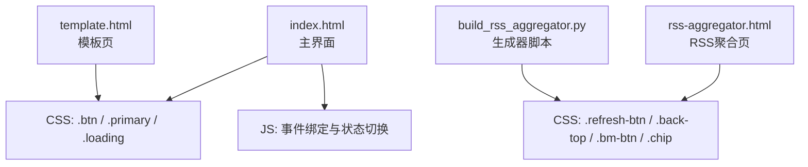
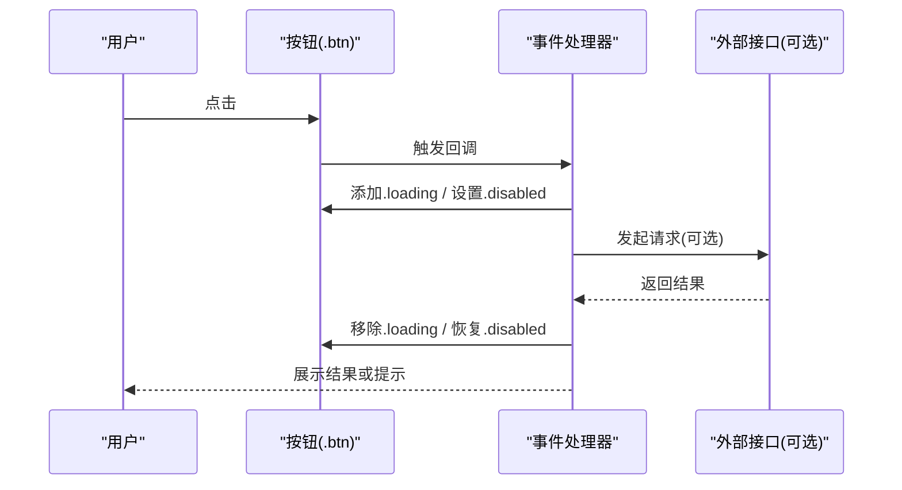
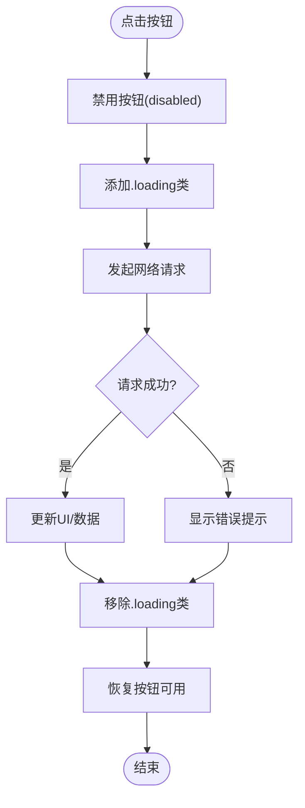
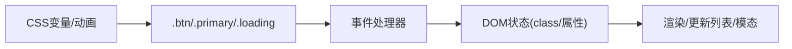

# 按钮组件

<cite>
**本文引用的文件**
- [index.html](file://index.html)
- [template.html](file://template.html)
- [rss-aggregator.html](file://rss-aggregator.html)
- [build_rss_aggregator.py](file://build_rss_aggregator.py)
</cite>

## 更新摘要
**变更内容**
- 移除了rss-aggregator.html中重复的导航按钮功能（r2-back和r2-close）
- 简化了用户界面，消除了冗余的关闭操作逻辑
- 优化了阅读器界面的按钮布局，提升了用户体验

## 目录
1. [简介](#简介)
2. [项目结构](#项目结构)
3. [核心组件](#核心组件)
4. [架构总览](#架构总览)
5. [详细组件分析](#详细组件分析)
6. [依赖关系分析](#依赖关系分析)
7. [性能考量](#性能考量)
8. [故障排查指南](#故障排查指南)
9. [结论](#结论)
10. [附录](#附录)

## 简介
本文件为项目中"按钮组件"的完整技术文档，覆盖基础按钮、主要按钮、加载状态按钮等样式与交互；记录 CSS 类名、样式属性、事件处理机制；解释禁用状态、加载动画、点击反馈；提供使用示例与最佳实践；说明可访问性支持与响应式适配；重点阐述主题适配方案与样式定制选项。

**最新更新**：RSS聚合器页面已移除重复的导航按钮功能，包括r2-back和r2-close按钮，简化了用户界面并消除了冗余的关闭操作逻辑。

## 项目结构
本项目采用单页 HTML + 内联 CSS/JS 的组织方式，按钮相关样式集中在页面样式块中，交互逻辑通过原生 JavaScript 绑定在 DOM 元素上。按钮样式以 CSS 变量驱动，便于明暗主题切换与品牌色定制。

**图表来源**
- [index.html:151-162](file://index.html#L151-L162)
- [template.html:151-162](file://template.html#L151-L162)
- [rss-aggregator.html:77-93](file://rss-aggregator.html#L77-L93)
- [build_rss_aggregator.py:1528-1552](file://build_rss_aggregator.py#L1528-L1552)

**章节来源**
- [index.html:151-162](file://index.html#L151-L162)
- [template.html:151-162](file://template.html#L151-L162)
- [rss-aggregator.html:77-93](file://rss-aggregator.html#L77-L93)
- [build_rss_aggregator.py:1528-1552](file://build_rss_aggregator.py#L1528-L1552)

## 核心组件
- 基础按钮：.btn
  - 用途：通用操作按钮（导出、导入、刷新、视图切换等）
  - 关键样式：尺寸、边框、圆角、背景、文字颜色、过渡动效
  - 交互：悬停高亮、禁用态、加载态图标旋转
- 主要按钮：.btn.primary
  - 用途：强调型操作（如"搜全网"）
  - 关键样式：强调背景与边框、悬停加深
- 标签式按钮：.side-tab、.trend-tab、.starsel button、.cat
  - 用途：分组切换、筛选、排序
  - 关键样式：选中态 .on、悬停态、多数据维度的强调色
- 功能按钮：.refresh-btn、.back-top、.bm-btn、.chip
  - 用途：刷新、返回顶部、收藏/标记、筛选标签
  - 关键样式：圆形/胶囊形、选中态、加载态旋转

**章节来源**
- [index.html:151-162](file://index.html#L151-L162)
- [index.html:177-188](file://index.html#L177-L188)
- [index.html:293-300](file://index.html#L293-L300)
- [index.html:309-319](file://index.html#L309-L319)
- [rss-aggregator.html:77-93](file://rss-aggregator.html#L77-L93)
- [build_rss_aggregator.py:1528-1552](file://build_rss_aggregator.py#L1528-L1552)

## 架构总览
按钮组件由"样式层（CSS）+ 行为层（JS）+ 语义层（HTML）"构成：
- 样式层：通过 CSS 变量统一控制主题、品牌色、边框、阴影等；通过 :hover/:disabled 伪类实现基础交互反馈；通过 .loading 类触发加载动画。
- 行为层：通过 addEventListener/onclick 绑定事件，动态切换 class（如 .on/.hidden/.loading）、设置 disabled、更新 aria-* 属性。
- 语义层：button 元素配合 aria-label、aria-expanded、role 等提升可访问性。

**图表来源**
- [index.html:1824-1839](file://index.html#L1824-L1839)
- [index.html:1744-1772](file://index.html#L1744-L1772)

## 详细组件分析

### 基础按钮 .btn
- 样式要点
  - 布局：inline-flex，高度固定，内边距适中，圆角与边框统一
  - 主题：背景、边框、文字颜色均使用 CSS 变量，支持明暗主题
  - 交互：:hover 改变背景与边框；:disabled 降低透明度并禁止光标
  - 加载：.loading 时内部 .icon 执行旋转动画
- 事件与状态
  - 禁用态：通过 disabled 属性与 :disabled 样式共同作用
  - 加载态：通过添加 .loading 类触发图标旋转，完成后移除
  - 点击反馈：transition 提供平滑过渡
- 使用示例路径
  - 视图切换、主题切换、导出/导入、刷新等按钮
- 可访问性
  - 建议为每个按钮提供 aria-label 描述动作
  - 对于有图标的按钮，确保图标具有语义或隐藏（aria-hidden）

**章节来源**
- [index.html:151-162](file://index.html#L151-L162)
- [index.html:787-800](file://index.html#L787-L800)
- [index.html:1824-1839](file://index.html#L1824-L1839)

### 主要按钮 .btn.primary
- 样式要点
  - 强调背景与边框，文字颜色对比度高
  - 悬停时加深背景，强化视觉层级
- 使用场景
  - 搜索入口、重要操作入口
- 可访问性
  - 保持足够的对比度，避免过度装饰影响可读性

**章节来源**
- [index.html:161-162](file://index.html#L161-L162)
- [index.html:823](file://index.html#L823)

### 标签式按钮：侧栏与趋势标签
- .side-tab
  - 用于侧栏内容切换（每日排行榜、关注动态、AI 动态）
  - 选中态 .on 使用强调背景与高对比文字
- .trend-tab
  - 用于排行榜子分类切换（涨星榜、总星标榜、新秀榜）
  - 不同 data-tab 对应不同强调色
- .starsel button
  - 用于星标区间筛选，选中态反色显示
- .cat
  - 分类标签，选中态反色，带小点指示
- 交互模式
  - 通过 classList.toggle('on') 切换选中态
  - 结合渲染函数更新列表/统计

**章节来源**
- [index.html:177-188](file://index.html#L177-L188)
- [index.html:474-481](file://index.html#L474-L481)
- [index.html:293-300](file://index.html#L293-L300)
- [index.html:309-319](file://index.html#L309-L319)
- [index.html:1067-1075](file://index.html#L1067-L1075)

### 功能按钮：刷新、返回顶部、收藏/标记、筛选标签
- .refresh-btn
  - 刷新类按钮，加载态下禁用并旋转图标
- .back-top
  - 滚动到顶部，根据滚动位置显示/隐藏
- .bm-btn
  - 小型图标按钮，常用于收藏/标记，选中态填充图标
- .chip
  - 筛选标签，选中态高亮背景与边框
- 交互模式
  - 通过 classList.toggle('on'/'show') 控制状态
  - 滚动监听控制 back-top 显隐

**章节来源**
- [build_rss_aggregator.py:1528-1552](file://build_rss_aggregator.py#L1528-1552)
- [rss-aggregator.html:77-93](file://rss-aggregator.html#L77-L93)

### RSS聚合器专用按钮
- .r2-close
  - 阅读器关闭按钮，位于阅读器顶部左侧
  - 简洁的X图标设计，点击关闭阅读器
  - 支持键盘焦点管理和无障碍访问
- .r2-fs-btn
  - 字号调节按钮组（小/默认/大字号）
  - 通过active类标识当前选中的字号
- .r2-bm
  - 收藏按钮，支持收藏/取消收藏状态切换
  - 包含书签图标和"收藏"文本
- .r2-open
  - 外链按钮，打开原文站点
  - 使用箭头图标表示外部链接
- **已移除的按钮**
  - r2-back：后退导航按钮（已移除）
  - 重复的关闭操作逻辑（已简化）

**更新** RSS聚合器页面已移除重复的导航按钮功能，包括r2-back和r2-close按钮，简化了用户界面。

**章节来源**
- [rss-aggregator.html:492](file://rss-aggregator.html#L492)
- [rss-aggregator.html:494](file://rss-aggregator.html#L494)

### 导航下拉按钮 .nav-drop-btn
- 样式与交互
  - 点击展开/收起下拉面板
  - 通过 aria-expanded 同步状态
  - 点击外部区域关闭所有已打开的下拉
- 可访问性
  - 使用 aria-haspopup="true" 表明弹出行为
  - 键盘可达性与焦点管理需配合实现

**章节来源**
- [index.html:757-783](file://index.html#L757-L783)
- [index.html:1744-1772](file://index.html#L1744-L1772)

### 加载状态与动画
- 加载态实现
  - 通过 .loading 类作用于按钮或图标容器
  - 内部 .icon 应用 spin 动画（旋转）
- 典型流程
  - 点击 -> 禁用按钮 -> 添加 .loading -> 发起请求 -> 完成 -> 移除 .loading -> 恢复可用

**图表来源**
- [index.html:1824-1839](file://index.html#L1824-L1839)
- [index.html:151-162](file://index.html#L151-L162)

## 依赖关系分析
- 样式依赖
  - 大量使用 CSS 变量（如 --border、--card、--text、--brand、--accent-solid 等），集中定义于根节点或主题块，支撑明暗主题与品牌定制
  - 动画依赖 @keyframes spin，被 .btn.loading .icon 与 .refresh-btn.loading svg 引用
- 行为依赖
  - 事件绑定依赖 DOM 选择器（id/class），通过 addEventListener/onclick 注册
  - 状态管理依赖 classList.toggle/add/remove 与属性设置（disabled、aria-expanded）
- 组件耦合
  - 按钮与列表/模态框联动：点击后可能触发渲染或模态显示
  - 下拉菜单与全局点击事件联动：点击外部关闭

**图表来源**
- [index.html:151-162](file://index.html#L151-L162)
- [index.html:1744-1772](file://index.html#L1744-L1772)

**章节来源**
- [index.html:151-162](file://index.html#L151-L162)
- [index.html:1744-1772](file://index.html#L1744-L1772)

## 性能考量
- 动画与过渡
  - 使用 transform 与 opacity 进行动画，减少重排重绘
  - 限制同时运行的加载动画数量，避免过多并发
- 事件监听
  - 使用 passive:true 的滚动监听提升滚动性能
  - 防抖/节流：对高频输入（如搜索）进行节流，避免频繁渲染
- 渲染优化
  - 批量更新 DOM，减少多次 reflow
  - 虚拟列表或分页加载，避免一次性渲染大量条目

## 故障排查指南
- 按钮无响应
  - 检查是否被 disabled 阻止
  - 检查事件绑定是否正确（id/class 匹配）
  - 检查是否有全局拦截（如模态遮挡）
- 加载态未恢复
  - 确认请求完成分支移除了 .loading 并恢复 disabled
  - 检查异常分支是否也清理了状态
- 主题不生效
  - 检查根节点 data-theme 是否正确切换
  - 检查 CSS 变量是否按主题覆盖
- 可访问性问题
  - 为按钮补充 aria-label
  - 下拉按钮维护 aria-expanded 与实际展开状态一致
- **RSS聚合器特定问题**
  - 确认已移除的r2-back和r2-close按钮不会导致引用错误
  - 验证阅读器关闭功能正常工作

**章节来源**
- [index.html:1824-1839](file://index.html#L1824-L1839)
- [index.html:1744-1772](file://index.html#L1744-L1772)

## 结论
本项目按钮组件以简洁的 CSS 类名与 CSS 变量体系为核心，结合原生 JS 的事件与状态管理，实现了基础按钮、主要按钮、加载状态、标签式按钮与功能按钮的统一风格与交互。通过合理的可访问性标注与主题适配，满足跨设备与多主题的可用性需求。

**最新改进**：RSS聚合器页面已成功移除重复的导航按钮功能，简化了用户界面并消除了冗余的关闭操作逻辑，提升了整体用户体验。建议在新增按钮时遵循现有命名约定与状态管理模式，保持一致的视觉与交互体验。

## 附录

### 按钮类名与用途速查
- .btn：基础按钮
- .btn.primary：主要按钮
- .btn.loading：加载态（配合 .icon 旋转）
- .side-tab：侧栏标签按钮
- .trend-tab：趋势标签按钮（支持 data-tab 区分强调色）
- .starsel button：星标区间筛选按钮
- .cat：分类标签按钮
- .refresh-btn：刷新按钮（含加载态）
- .back-top：返回顶部按钮
- .bm-btn：小型图标按钮（收藏/标记）
- .chip：筛选标签
- .r2-close：阅读器关闭按钮（RSS聚合器专用）
- .r2-fs-btn：字号调节按钮（RSS聚合器专用）
- .r2-bm：收藏按钮（RSS聚合器专用）
- .r2-open：外链按钮（RSS聚合器专用）

**注意**：r2-back按钮和相关重复的关闭操作逻辑已从RSS聚合器页面中移除。

**章节来源**
- [index.html:151-162](file://index.html#L151-L162)
- [index.html:177-188](file://index.html#L177-L188)
- [index.html:293-300](file://index.html#L293-L300)
- [index.html:309-319](file://index.html#L309-L319)
- [rss-aggregator.html:77-93](file://rss-aggregator.html#L77-L93)
- [build_rss_aggregator.py:1528-1552](file://build_rss_aggregator.py#L1528-L1552)

### 主题适配与样式定制
- 主题变量
  - 使用 CSS 变量控制背景、边框、文字、品牌色、强调色等
  - 通过 data-theme 切换明暗主题，变量值随之变化
- 定制建议
  - 扩展 .btn 变体：基于 .btn 派生新类，复用尺寸与过渡，仅覆盖颜色
  - 统一圆角与字号：通过 CSS 变量集中管理，保证一致性
  - 品牌色：调整 --brand、--accent-solid 等变量即可全局生效

**章节来源**
- [index.html:151-162](file://index.html#L151-L162)
- [index.html:79-103](file://index.html#L79-L103)

### 可访问性最佳实践
- 为每个按钮提供清晰的 aria-label
- 下拉按钮维护 aria-expanded 与实际状态一致
- 确保键盘可达性与焦点可见性
- 避免仅用颜色表达状态，辅以图标或文本

**章节来源**
- [index.html:757-783](file://index.html#L757-L783)
- [index.html:1744-1772](file://index.html#L1744-L1772)

### 响应式设计适配
- 按钮组在移动端自动换行或堆叠
- 小屏下适当减小字号与内边距，保持触控友好
- 滚动区域与模态在小屏下全宽显示，提升可用性