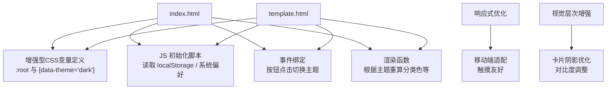
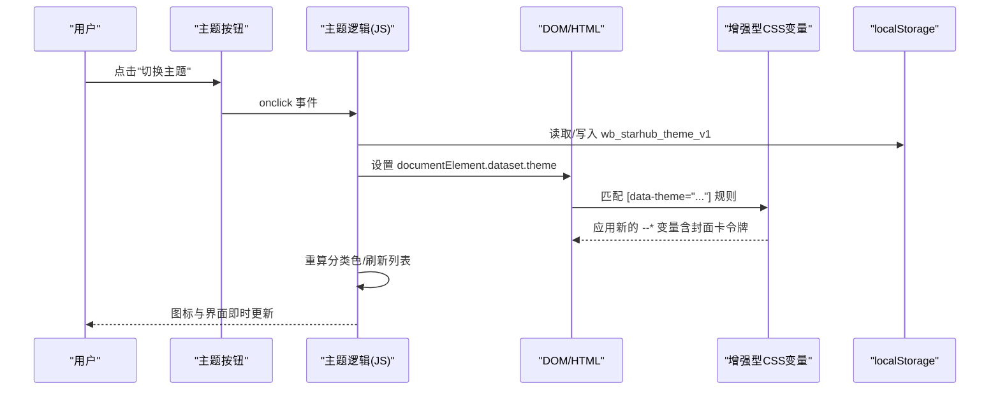
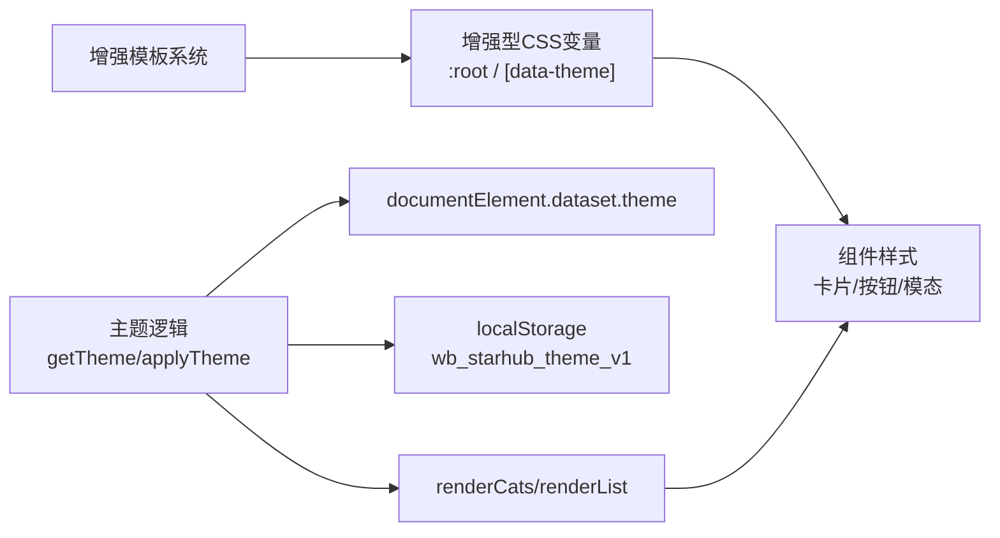

# 主题切换系统

<cite>
**本文引用的文件**
- [index.html](file://index.html)
- [template.html](file://template.html)
</cite>

## 更新摘要
**所做更改**
- 更新了CSS自定义属性系统，增强了样式令牌管理
- 改进了响应式设计，优化了移动端体验
- 增强了视觉层次结构，提升了用户体验
- 完善了模板系统的主题支持
- 优化了主题切换的性能和流畅度

## 目录
1. [简介](#简介)
2. [项目结构](#项目结构)
3. [核心组件](#核心组件)
4. [架构总览](#架构总览)
5. [详细组件分析](#详细组件分析)
6. [依赖关系分析](#依赖关系分析)
7. [性能考量](#性能考量)
8. [故障排查指南](#故障排查指南)
9. [结论](#结论)
10. [附录：定制与扩展指南](#附录定制与扩展指南)

## 简介
本主题切换系统基于 CSS 自定义属性（CSS Variables）实现明/暗两套主题，并通过 JavaScript 在用户偏好、系统偏好与页面状态之间进行同步。其设计目标是：
- 以数据驱动的方式管理主题变量，确保颜色映射与视觉一致性
- 通过本地存储持久化用户选择，支持实时切换与平滑过渡
- 将主题系统与组件样式解耦，便于扩展新主题或修改配色方案
- 兼顾无障碍访问与用户体验优化
- **新增**：增强的模板系统支持更灵活的样式令牌管理
- **新增**：改进的响应式设计确保跨设备一致的主题体验

## 项目结构
主题相关代码集中在两个 HTML 文件中：
- index.html：生产入口，包含完整的主题 CSS 变量、初始化脚本、交互逻辑
- template.html：模板入口，结构与 index.html 一致，用于构建流程中的模板渲染

**图表来源**
- [index.html:18-73](file://index.html#L18-L73)
- [index.html:745](file://index.html#L745)
- [index.html:1000-1011](file://index.html#L1000-L1011)
- [index.html:1842-1846](file://index.html#L1842-L1846)
- [template.html:18-73](file://template.html#L18-L73)
- [template.html:745](file://template.html#L745)

**章节来源**
- [index.html:18-73](file://index.html#L18-L73)
- [index.html:745](file://index.html#L745)
- [index.html:1000-1011](file://index.html#L1000-L1011)
- [index.html:1842-1846](file://index.html#L1842-L1846)
- [template.html:18-73](file://template.html#L18-L73)
- [template.html:745](file://template.html#L745)

## 核心组件
- **增强的CSS自定义属性（主题令牌）**
  - 浅色主题：在 :root 中定义背景、文字、品牌、强调、阴影、字体等变量
  - 深色主题：在 [data-theme="dark"] 中覆盖同名变量，保持语义一致
  - **新增**：封面卡专用令牌（--cover-bg, --cover-weave, --fav-chip-bg）
  - **新增**：增强的阴影系统（--shadow-card, --shadow-lift）
- **主题状态标记**
  - 通过 document.documentElement.dataset.theme 设置 'light' 或 'dark'
- **本地持久化**
  - 使用 localStorage 保存用户主题偏好键 wb_starhub_theme_v1
- **系统偏好检测**
  - 首次加载时若未保存偏好，则回退到 window.matchMedia('(prefers-color-scheme: dark)')
- **交互与状态同步**
  - 点击主题按钮切换状态，更新图标、重绘分类标签颜色、刷新列表
- **动态颜色计算**
  - 根据当前主题对分类色进行亮度钳制，保证可读性与对比度
- **响应式主题适配**
  - **新增**：针对不同屏幕尺寸优化主题显示效果

**章节来源**
- [index.html:18-73](file://index.html#L18-L73)
- [index.html:745](file://index.html#L745)
- [index.html:1000-1011](file://index.html#L1000-L1011)
- [index.html:1139-1160](file://index.html#L1139-L1160)
- [index.html:1842-1846](file://index.html#L1842-L1846)

## 架构总览
主题系统的整体流程如下：
- 页面加载时，立即执行内联脚本设置初始主题（优先 localStorage，其次系统偏好）
- 应用层 JS 在初始化阶段调用 applyTheme(getTheme()) 并渲染界面
- 用户点击主题按钮时，切换 data-theme，持久化偏好，并触发 UI 重绘
- 组件样式通过 CSS 变量响应主题变化，无需额外类名切换
- **新增**：增强的模板系统提供更灵活的样式令牌管理

**图表来源**
- [index.html:745](file://index.html#L745)
- [index.html:1000-1011](file://index.html#L1000-L1011)
- [index.html:1842-1846](file://index.html#L1842-L1846)
- [index.html:1139-1160](file://index.html#L1139-L1160)

## 详细组件分析

### 增强的CSS自定义属性与主题变量
- **基础令牌**：浅色主题变量定义于 :root，涵盖背景、卡片、边框、文本、品牌、强调、阴影、字体、封面区等
- **深色主题覆盖**：通过 [data-theme="dark"] 覆盖同名变量，保持语义一致，确保组件无需感知主题即可正确显示
- **封面卡专用令牌**：新增 --cover-bg, --cover-weave, --fav-chip-bg 等专门用于封面卡的样式令牌
- **增强的阴影系统**：--shadow, --shadow-card, --shadow-lift 在不同主题下提供不同的阴影强度
- **选择器与变量命名**：遵循统一规范，便于维护与扩展

**章节来源**
- [index.html:18-73](file://index.html#L18-L73)
- [template.html:18-73](file://template.html#L18-L73)

### 主题状态与持久化
- **初始化**：在 <head> 中执行内联脚本，读取 localStorage 的 wb_starhub_theme_v1；若无，则依据系统 prefers-color-scheme 决定初始主题
- **运行时**：applyTheme(t) 设置 documentElement.dataset.theme，并更新主题图标
- **持久化**：用户切换后写入 localStorage，下次打开页面保持一致
- **错误处理**：包含 try-catch 块确保 localStorage 不可用时不影响页面功能

**章节来源**
- [index.html:745](file://index.html#L745)
- [index.html:1000-1011](file://index.html#L1000-L1011)
- [index.html:1842-1846](file://index.html#L1842-L1846)

### 用户交互与实时切换
- **按钮事件**：#btnTheme 的 onclick 切换 light/dark，写入 localStorage，调用 applyTheme，并重绘分类与列表
- **图标更新**：根据当前主题替换 SVG 内容（太阳/月亮），提供直观反馈
- **视图联动**：切换主题后同时刷新分类标签与列表，确保颜色一致
- **键盘快捷键**：支持按 'd' 键快速切换主题

**章节来源**
- [index.html:1842-1846](file://index.html#L1842-L1846)
- [index.html:1000-1011](file://index.html#L1000-L1011)

### 颜色映射与视觉一致性
- **分类色**：catColor(key) 根据当前主题选择原始色或暗色专用色，并通过 clampChroma 限制亮度范围，保证可读性
- **对比度保障**：浅色主题限制最低亮度，暗色主题限制最高亮度，避免过亮/过暗导致不可读
- **阴影与层级**：通过 --shadow、--shadow-card、--shadow-lift 在不同主题下调整阴影强度，维持层次清晰
- **封面卡优化**：针对封面区域提供专门的色彩和阴影配置

**章节来源**
- [index.html:1139-1160](file://index.html#L1139-L1160)
- [index.html:18-73](file://index.html#L18-L73)

### 动画过渡与可访问性
- **过渡效果**：按钮、卡片、模态框等元素使用 transition，提升切换体验
- **减少动效**：@media (prefers-reduced-motion: reduce) 禁用非必要动画，尊重用户偏好
- **无障碍**：主题按钮具备 aria-label，图标与状态变更提供明确提示
- **响应式优化**：针对不同设备类型优化交互体验

**章节来源**
- [index.html:740-743](file://index.html#L740-L743)
- [index.html:787-788](file://index.html#L787-L788)

### 主题相关的类管理与状态同步
- **主题状态**：由 data-theme 控制，而非大量类名切换，降低耦合
- **视图模式**：通过 body.view-list 切换，与主题解耦
- **渲染函数**：在主题切换后重新计算并更新 UI，保证状态一致
- **模板系统**：增强的模板支持更灵活的样式令牌管理

**章节来源**
- [index.html:1017-1023](file://index.html#L1017-L1023)
- [index.html:1842-1846](file://index.html#L1842-L1846)

### 响应式设计与移动优化
- **移动端适配**：针对不同屏幕尺寸优化主题显示效果
- **触摸友好**：确保移动端主题切换按钮易于操作
- **性能优化**：减少不必要的重绘和重排
- **字体适配**：根据不同设备选择合适的字体大小和行高

**章节来源**
- [index.html:694-750](file://index.html#L694-L750)
- [template.html:694-750](file://template.html#L694-L750)

## 依赖关系分析
- **CSS依赖**：所有组件样式通过 var(--*) 引用主题变量，不直接硬编码颜色
- **JS依赖**：主题逻辑依赖 localStorage、matchMedia、DOM API
- **渲染依赖**：分类标签、列表项在主题切换后需要重算颜色并刷新
- **模板依赖**：增强的模板系统提供更灵活的样式令牌管理

**图表来源**
- [index.html:18-73](file://index.html#L18-L73)
- [index.html:1000-1011](file://index.html#L1000-L1011)
- [index.html:1842-1846](file://index.html#L1842-L1846)

**章节来源**
- [index.html:18-73](file://index.html#L18-L73)
- [index.html:1000-1011](file://index.html#L1000-L1011)
- [index.html:1842-1846](file://index.html#L1842-L1846)

## 性能考量
- **变量覆盖策略**：通过 CSS 变量覆盖实现主题切换，避免重建样式表，性能开销低
- **局部重绘**：仅对受主题影响的区域（如分类标签、列表）进行必要重绘
- **图片降级**：封面图失败时自动降级为纸纹背景，减少闪烁与布局抖动
- **减少动效**：支持 prefers-reduced-motion，避免不必要的动画影响性能与可访问性
- **响应式优化**：针对不同设备优化主题切换性能
- **内存管理**：合理使用 localStorage，避免内存泄漏

## 故障排查指南
- **主题未生效**
  - 检查 documentElement.dataset.theme 是否正确设置为 'light' 或 'dark'
  - 确认 CSS 中 [data-theme="dark"] 是否覆盖了必要的变量
- **偏好未持久化**
  - 检查 localStorage 是否可用，以及键名 wb_starhub_theme_v1 是否被写入
- **颜色对比度不足**
  - 检查 catColor 与 clampChroma 的亮度范围设置是否符合当前主题需求
- **动画不适配**
  - 确认 @media (prefers-reduced-motion: reduce) 是否生效，必要时禁用过渡
- **移动端显示异常**
  - 检查响应式媒体查询是否正确应用
  - 验证触摸设备的交互体验

**章节来源**
- [index.html:740-743](file://index.html#L740-L743)
- [index.html:1139-1160](file://index.html#L1139-L1160)
- [index.html:1842-1846](file://index.html#L1842-L1846)

## 结论
该主题切换系统以 CSS 自定义属性为核心，结合 JavaScript 的状态管理与本地持久化，实现了稳定、可扩展且易用的明/暗主题切换。通过统一的变量命名与覆盖机制，主题与组件样式解耦，便于后续扩展与维护。同时，系统在无障碍与用户体验方面做了充分考量，确保不同用户群体都能获得一致的阅读体验。**新增的增强模板系统和响应式优化进一步提升了系统的灵活性和跨设备兼容性**。

## 附录：定制与扩展指南

### 添加新主题
- **新增主题选择器**：例如 [data-theme="custom"]，在 :root 或对应选择器中定义一组 --* 变量
- **扩展JS逻辑**：在 getTheme/applyTheme 中支持新主题值
- **更新交互逻辑**：允许切换到新主题并持久化
- **考虑封面卡令牌**：为新主题定义专用的封面卡样式令牌

**章节来源**
- [index.html:18-73](file://index.html#L18-L73)
- [index.html:1000-1011](file://index.html#L1000-L1011)
- [index.html:1842-1846](file://index.html#L1842-L1846)

### 修改现有配色方案
- **调整基础令牌**：在 :root 或 [data-theme="dark"] 中调整对应的 --* 变量
- **组件级微调**：如需针对特定组件微调，可在相应选择器中覆盖变量或使用 color-mix 等现代特性
- **验证对比度**：确保调整后的颜色符合 WCAG 标准
- **测试响应式效果**：验证不同屏幕尺寸下的显示效果

**章节来源**
- [index.html:18-73](file://index.html#L18-L73)
- [index.html:1139-1160](file://index.html#L1139-L1160)

### 扩展主题功能
- **增加更多主题状态**：如高对比度、护眼模式，通过 data-theme 或自定义类名区分
- **扩展状态管理**：支持用户偏好与系统偏好的组合策略
- **提供相应的CSS变量**：为新增状态提供完整的变量覆盖
- **集成模板系统**：利用增强的模板系统实现更灵活的样式管理

**章节来源**
- [index.html:1000-1011](file://index.html#L1000-L1011)
- [index.html:1842-1846](file://index.html#L1842-L1846)

### 无障碍访问与用户体验优化建议
- **键盘可达性**：确保主题切换按钮具有明确的 aria-label 与键盘可达性
- **减少动效支持**：尊重 prefers-reduced-motion，提供无动画选项
- **对比度标准**：保证文本与背景的对比度符合 WCAG 标准
- **即时反馈**：在切换过程中提供即时反馈（如图标变化、Toast 提示）
- **移动端优化**：确保触摸设备的交互体验良好

**章节来源**
- [index.html:740-743](file://index.html#L740-L743)
- [index.html:787-788](file://index.html#L787-L788)

### 响应式设计最佳实践
- **断点规划**：合理设置响应式断点，确保各设备显示效果
- **触摸优化**：为移动端提供更大的触摸目标和更友好的交互方式
- **性能考虑**：避免在响应式设计中引入过多的重绘和重排
- **测试验证**：在多种设备和浏览器上测试主题切换效果

**章节来源**
- [index.html:694-750](file://index.html#L694-L750)
- [template.html:694-750](file://template.html#L694-L750)