# 前端界面设计

<cite>
**本文引用的文件**
- [index.html](file://index.html)
- [ai-daily.html](file://ai-daily.html)
- [rss-aggregator.html](file://rss-aggregator.html)
- [build_rss_aggregator.py](file://build_rss_aggregator.py)
- [build_ai_daily.py](file://build_ai_daily.py)
- [insight_engine.py](file://insight_engine.py)
- [descriptions_zh.json](file://descriptions_zh.json)
- [known_categories.json](file://known_categories.json)
- [README.md](file://README.md)
- [package.json](file://package.json)
</cite>

## 更新摘要
**变更内容**
- **教育资源导航增强**：在"学习资源"下拉菜单中新增FDE Learning和All-in-RAG两个重要学习平台，提供直接访问机器学习与RAG学习材料的入口
- **AI日报页面优化**：文章数量从42篇调整为38篇，通过更精确的内容选择算法提升内容质量
- **RSS聚合器增强**：改进了语义洞察面板的数据绑定和显示格式，支持更清晰的洞察内容展示
- **主界面导航增强**：新增AI晨报和RSS聚合导航入口，完善用户体验
- **数据源整合优化**：arXiv等数据源的整合更加完善，提升了内容质量和相关性
- **时间戳生成改进**：提供更准确的北京时间显示和内容时间标注

## 目录
1. [简介](#简介)
2. [项目结构](#项目结构)
3. [核心组件](#核心组件)
4. [架构总览](#架构总览)
5. [详细组件分析](#详细组件分析)
6. [依赖分析](#依赖分析)
7. [性能考虑](#性能考虑)
8. [故障排查指南](#故障排查指南)
9. [结论](#结论)
10. [附录](#附录)

## 简介
本项目是一个"GitHub Star 收藏台"的前端界面，提供自动拉取、智能分类、模糊搜索、语言/星标筛选、收藏置顶、明暗主题切换、卡片与列表视图切换、侧边趋势排行与关注动态等功能。**最新更新**包括教育资源导航的增强、AI日报页面的编辑风格重构、RSS聚合器的用户交互改进，以及全面的移动端优化。特别关注了移动设备的用户体验提升和响应式布局的完善，实现了双标签面板系统、语义洞察面板容器化设计，以及前端去重机制。

**重要更新** 本次更新重点包括：
- **教育资源导航增强**：新增FDE Learning和All-in-RAG学习平台，为开发者提供完整的机器学习与RAG学习路径
- AI日报页面完全重构为编辑风格设计，提供纸质感背景和衬线字体排版
- RSS聚合器新增双标签面板（AI快讯/热榜），支持移动端抽屉式交互
- 语义洞察面板采用WS-B接口容器化设计，支持多端适配
- 前端去重机制（WS-C接口）避免重复内容显示
- arXiv数据源完整集成到AI日报系统中
- **AI日报文章数量优化**：从42篇调整为38篇，通过更精确的内容选择算法提升内容质量
- **时间戳生成改进**：提供更准确的北京时间显示和内容时间标注
- **基于视角的内容生成**：改进了洞察内容的显示格式和数据绑定机制

## 项目结构
- **index.html**：主工作区页面，包含样式、模板与交互脚本，是 Pages 入口，新增AI晨报和RSS聚合导航及教育资源链接
- **ai-daily.html**：**完全重构** 独立AI日报页面，采用编辑风格设计，提供每日AI资讯聚合展示，现已集成arXiv数据源，文章数量优化至38篇
- **rss-aggregator.html**：**大幅增强** RSS聚合阅读器，新增双标签面板、语义洞察面板，改进卡片墙布局和抽屉阅读器体验
- **build_rss_aggregator.py**：RSS聚合构建脚本，负责数据处理和渲染，包含统一的CSS类名规范和移动端优化
- **build_ai_daily.py**：**更新** AI日报构建脚本，优化内容选择算法和时间戳生成逻辑
- **insight_engine.py**：语义洞察引擎，生成深度洞察数据和结构化分析结果
- **descriptions_zh.json**：中文项目描述数据库，新增大量AI工具和项目描述
- **known_categories.json**：已知分类映射表，更新的项目分类信息
- **README.md**：仓库说明、部署与更新机制
- **package.json**：仅声明了后端构建工具依赖（jsdom、@mozilla/readability），用于 Python 构建流程解析 HTML

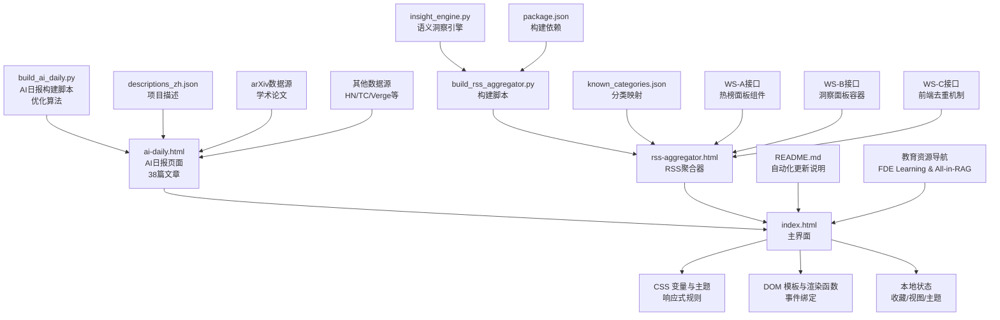
```mermaid
graph TB
A["index.html<br/>主界面"] --> B["CSS 变量与主题<br/>响应式规则"]
A --> C["DOM 模板与渲染函数<br/>事件绑定"]
A --> D["本地状态<br/>收藏/视图/主题"]
E["ai-daily.html<br/>AI日报页面<br/>38篇文章"] --> A
F["rss-aggregator.html<br/>RSS聚合器"] --> A
G["build_rss_aggregator.py<br/>构建脚本"] --> F
H["build_ai_daily.py<br/>AI日报构建脚本<br/>优化算法"] --> E
I["insight_engine.py<br/>语义洞察引擎"] --> G
J["descriptions_zh.json<br/>项目描述"] --> E
K["known_categories.json<br/>分类映射"] --> F
L["README.md<br/>自动化更新说明"] --> A
M["package.json<br/>构建依赖"] --> G
N["arXiv数据源<br/>学术论文"] --> E
O["其他数据源<br/>HN/TC/Verge等"] --> E
P["WS-A接口<br/>热榜面板组件"] --> F
Q["WS-B接口<br/>洞察面板容器"] --> F
R["WS-C接口<br/>前端去重机制"] --> F
S["教育资源导航<br/>FDE Learning & All-in-RAG"] --> A
```

**图表来源**
- [index.html:1-800](file://index.html#L1-L800)
- [ai-daily.html:1-216](file://ai-daily.html#L1-L216)
- [rss-aggregator.html:1-400](file://rss-aggregator.html#L1-L400)
- [build_rss_aggregator.py:4370-4569](file://build_rss_aggregator.py#L4370-L4569)
- [build_ai_daily.py:1187-1251](file://build_ai_daily.py#L1187-L1251)
- [insight_engine.py:440-639](file://insight_engine.py#L440-L639)
- [descriptions_zh.json:1-200](file://descriptions_zh.json#L1-L200)
- [known_categories.json:1-200](file://known_categories.json#L1-L200)

章节来源
- [README.md:1-22](file://README.md#L1-L22)

## 核心组件
- **顶部导航与操作栏**：Logo、站点导航、视图切换、主题切换、导出/导入、刷新按钮，新增AI晨报和RSS聚合导航及教育资源链接
- **统计面板**：展示总数等关键指标，带数字滚动动效
- **搜索区**：全量搜索入口与提示
- **工具栏**：关键词搜索、语言筛选、星标范围选择
- **分类标签条**：横向可滚动的分类筛选
- **内容区**：卡片视图与列表视图两种呈现方式
- **侧边栏**：趋势排行、关注动态和AI动态三个子面板
- **模态框**：趋势详情弹窗、搜索工作台弹窗
- **全局反馈**：Toast 提示、回到顶部按钮
- **语义洞察面板**：**新增** WS-B接口容器化设计，支持PC右侧抽屉和移动端底部Sheet
- **双标签面板**：**新增** AI快讯与热榜的双标签切换系统，支持移动端抽屉交互
- **热榜面板**：**新增** WS-A接口实现，支持PC常驻和移动端全屏抽屉
- **AI日报页面**：**完全重构** 采用编辑风格设计，提供完整的日报阅读体验，文章数量优化至38篇
- **教育资源导航**：**新增** FDE Learning和All-in-RAG学习平台入口，提供机器学习与RAG学习材料

章节来源
- [index.html:90-800](file://index.html#L90-L800)
- [ai-daily.html:34-198](file://ai-daily.html#L34-L198)
- [rss-aggregator.html:172-400](file://rss-aggregator.html#L172-L400)

## 架构总览
整体采用"单页 + 内联脚本"的轻量架构：
- **样式层**：基于 CSS 自定义属性（变量）实现明暗主题；使用 Grid/Flex 实现响应式布局；媒体查询适配多端
- **模板层**：JS 动态拼装 DOM（卡片、行、侧边项、模态内容）
- **交互层**：事件委托与局部监听结合，处理主题、视图、筛选、搜索、收藏、模态开关等
- **数据层**：本地 localStorage 持久化收藏与偏好；页面初始化时渲染静态数据，并可选轮询获取实时 Feed

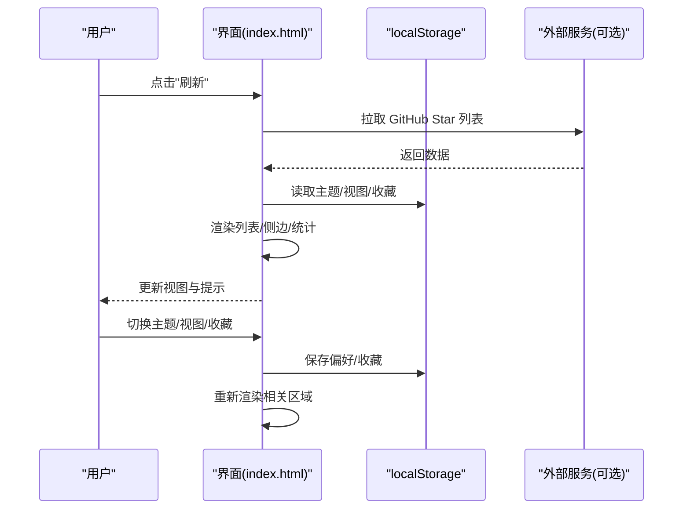
```mermaid
sequenceDiagram
participant U as "用户"
participant UI as "界面(index.html)"
participant LS as "localStorage"
participant API as "外部服务(可选)"
U->>UI : 点击"刷新"
UI->>API : 拉取 GitHub Star 列表
API-->>UI : 返回数据
UI->>LS : 读取主题/视图/收藏
UI->>UI : 渲染列表/侧边/统计
UI-->>U : 更新视图与提示
U->>UI : 切换主题/视图/收藏
UI->>LS : 保存偏好/收藏
UI->>UI : 重新渲染相关区域
```

**图表来源**
- [index.html:1842-1851](file://index.html#L1842-L1851)
- [index.html:1910-1920](file://index.html#L1910-L1920)
- [index.html:1985-2009](file://index.html#L1985-L2009)

## 详细组件分析

### 教育资源导航增强

**重大更新** 在"学习资源"下拉菜单中新增了FDE Learning和All-in-RAG两个重要的学习平台，为用户提供完整的机器学习与RAG学习路径。

- **FDE Learning**：提供基础的机器学习课程，涵盖从入门到进阶的完整学习路径
- **All-in-RAG**：专注于检索增强生成（RAG）技术的综合学习平台，提供理论与实践相结合的学习内容
- **导航结构**：采用统一的下拉菜单设计，与其他学习资源保持一致的交互体验
- **目标定位**：为开发者提供系统化的机器学习与RAG技术学习资源

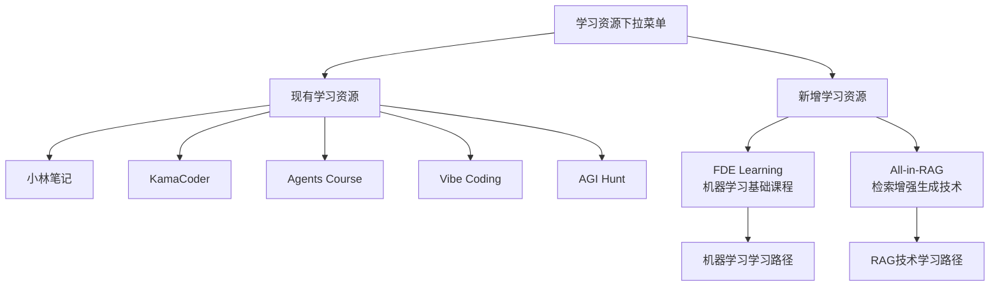
```mermaid
flowchart TD
NavMenu["学习资源下拉菜单"] --> Existing["现有学习资源"]
NavMenu --> NewResources["新增学习资源"]
Existing --> XiaolinNote["小林笔记"]
Existing --> KamaCoder["KamaCoder"]
Existing --> AgentsCourse["Agents Course"]
Existing --> VibeCoding["Vibe Coding"]
Existing --> AGIHunt["AGI Hunt"]
NewResources --> FDLEarning["FDE Learning<br/>机器学习基础课程"]
NewResources --> AllInRAG["All-in-RAG<br/>检索增强生成技术"]
FDLEarning --> MLPath["机器学习学习路径"]
AllInRAG --> RAGPath["RAG技术学习路径"]
```

**图表来源**
- [index.html:767-777](file://index.html#L767-L777)

章节来源
- [index.html:767-777](file://index.html#L767-L777)

### AI日报页面（完全重构）

**重大更新** ai-daily.html已完全重构，采用编辑风格设计，提供完整的日报体验，现已集成arXiv数据源，文章数量优化至38篇。

- **设计风格**：采用纸质感背景、衬线字体、细线分隔的编辑风格
- **布局结构**：顶部导航栏、报头区域、分类索引、今日要闻、分类内容区块、页脚
- **响应式设计**：支持移动端适配，小屏幕下自动调整布局
- **主题支持**：完整的明暗主题切换，颜色变量自动适配
- **内容组织**：按AI模型、AI产品、行业动态、海外热点、论文、技巧观点等分类展示
- **数据源集成**：现已包含arXiv在内的多个高质量数据源
- **文章数量优化**：从42篇调整为38篇，通过更精确的内容选择算法提升内容质量
- **时间戳改进**：提供更准确的北京时间显示和内容时间标注

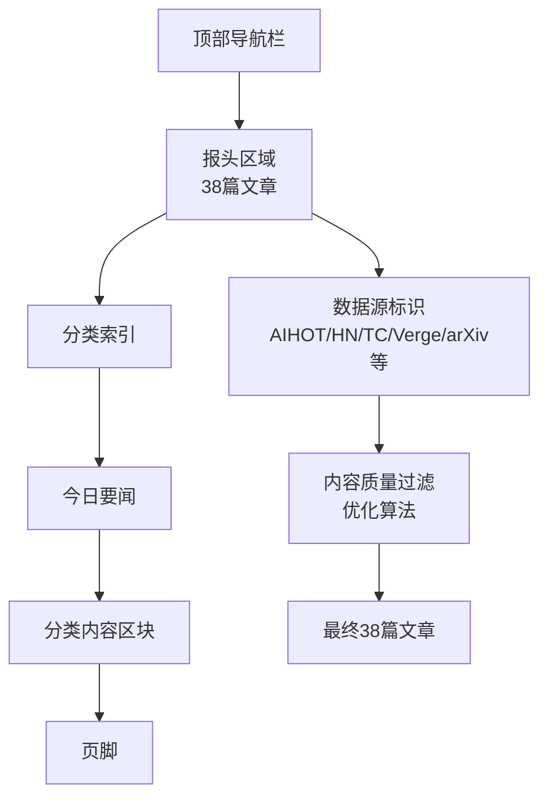
```mermaid
flowchart TD
TopBar["顶部导航栏"] --> Masthead["报头区域<br/>38篇文章"]
Masthead --> Index["分类索引"]
Index --> Front["今日要闻"]
Front --> Sections["分类内容区块"]
Sections --> Footer["页脚"]
Masthead --> Sources["数据源标识<br/>AIHOT/HN/TC/Verge/arXiv等"]
Sources --> QualityFilter["内容质量过滤<br/>优化算法"]
QualityFilter --> FinalContent["最终38篇文章"]
```

**图表来源**
- [ai-daily.html:34-198](file://ai-daily.html#L34-L198)
- [build_ai_daily.py:1187-1251](file://build_ai_daily.py#L1187-L1251)

章节来源
- [ai-daily.html:1-216](file://ai-daily.html#L1-L216)
- [build_ai_daily.py:1187-1251](file://build_ai_daily.py#L1187-L1251)

### RSS聚合器增强

**重要更新** rss-aggregator.html进行了多项优化，改进了用户体验和视觉效果，并集成了语义洞察功能。

- **双标签面板**：**新增** AI快讯与热榜的双标签切换系统，支持移动端抽屉交互
- **卡片墙布局**：改进的多列卡片布局，支持瀑布流效果
- **抽屉阅读器**：优化的左侧抽屉面板，提供更好的阅读体验
- **信源管理**：增强的信源分类和筛选功能
- **搜索功能**：改进的全局搜索，支持信源匹配高亮
- **响应式设计**：更好的移动端适配和触摸交互
- **热榜功能**：统一的CSS类名确保徽章正确显示
- **语义洞察面板**：**新增** WS-B接口容器化设计，支持基于视角的内容生成

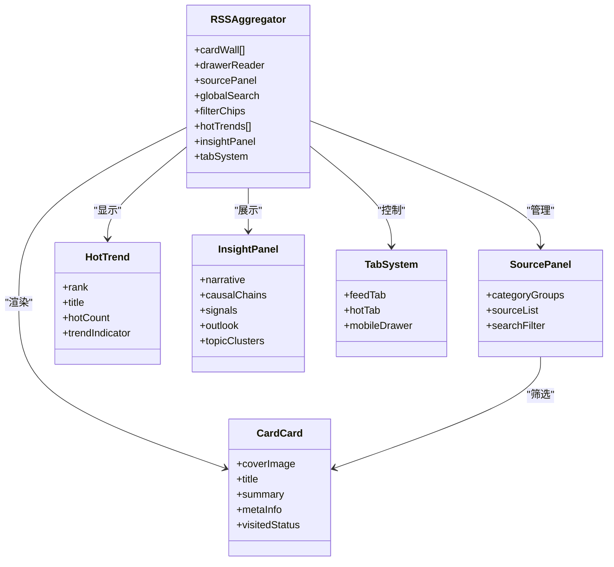
```mermaid
classDiagram
class RSSAggregator {
+cardWall[]
+drawerReader
+sourcePanel
+globalSearch
+filterChips
+hotTrends[]
+insightPanel
+tabSystem
}
class SourcePanel {
+categoryGroups
+sourceList
+searchFilter
}
class CardCard {
+coverImage
+title
+summary
+metaInfo
+visitedStatus
}
class HotTrend {
+rank
+title
+hotCount
+trendIndicator
}
class InsightPanel {
+narrative
+causalChains
+signals
+outlook
+topicClusters
}
class TabSystem {
+feedTab
+hotTab
+mobileDrawer
}
RSSAggregator --> SourcePanel : "管理"
RSSAggregator --> CardCard : "渲染"
RSSAggregator --> HotTrend : "显示"
RSSAggregator --> InsightPanel : "展示"
RSSAggregator --> TabSystem : "控制"
SourcePanel --> CardCard : "筛选"
```

**图表来源**
- [rss-aggregator.html:172-400](file://rss-aggregator.html#L172-L400)
- [build_rss_aggregator.py:4370-4569](file://build_rss_aggregator.py#L4370-L4569)

章节来源
- [rss-aggregator.html:1-400](file://rss-aggregator.html#L1-L400)

### 语义洞察面板增强

**重大更新** RSS聚合器现已完整支持语义洞察数据的渲染，包括深度叙事分析、因果链可视化、信号看板和趋势展望等高级功能，并改进了基于视角的内容生成机制。

- **WS-B接口容器化**：支持PC端右侧抽屉和移动端底部Sheet模式
- **深度叙事**：展示AI生成的核心叙事分析，以卡片形式呈现，支持长文本阅读
- **因果链可视化**：以流程图形式展示事件间的因果关系，包含触发因素、影响效果和置信度
- **信号看板**：显示重要的异动信号，按重要性分级（高/中/低），支持证据展示
- **趋势展望**：提供未来24-72小时的趋势预测和建议
- **语义话题簇**：基于聚类算法的话题分组，支持热度指示和文章列表展开
- **前端去重**：**新增** WS-C接口的前端去重机制，避免重复内容显示
- **基于视角的内容生成**：改进了洞察内容的显示格式和数据绑定机制，提供更清晰的洞察内容展示

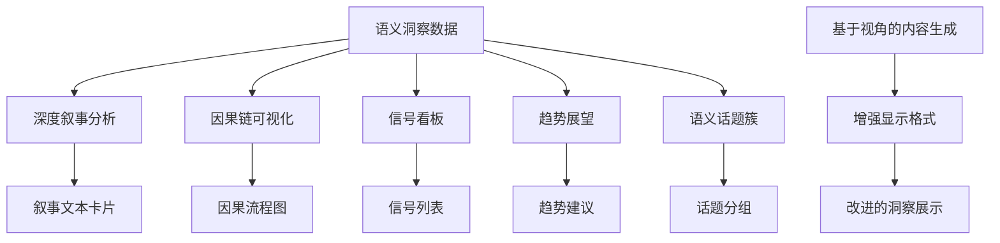
```mermaid
flowchart TD
InsightData["语义洞察数据"] --> Narrative["深度叙事分析"]
InsightData --> CausalChains["因果链可视化"]
InsightData --> Signals["信号看板"]
InsightData --> Outlook["趋势展望"]
InsightData --> TopicClusters["语义话题簇"]
Narrative --> UI_Narrative["叙事文本卡片"]
CausalChains --> UI_Chain["因果流程图"]
Signals --> UI_Signal["信号列表"]
Outlook --> UI_Outlook["趋势建议"]
TopicClusters --> UI_Cluster["话题分组"]
PerspectiveGen["基于视角的内容生成"] --> EnhancedDisplay["增强显示格式"]
EnhancedDisplay --> UI_Enhanced["改进的洞察展示"]
```

**图表来源**
- [rss-aggregator.html:2983-3013](file://rss-aggregator.html#L2983-L3013)
- [insight_engine.py:440-639](file://insight_engine.py#L440-L639)

章节来源
- [rss-aggregator.html:2983-3013](file://rss-aggregator.html#L2983-L3013)
- [insight_engine.py:440-639](file://insight_engine.py#L440-L639)

### arXiv数据源集成

**重大更新** AI日报系统现已完整集成arXiv作为额外的数据来源，与现有的Hacker News、The Verge、TechCrunch、36氪、Redis、AtlasNote等源并列工作。

- **数据源扩展**：arXiv学术论文源已正式加入AI日报的数据采集管道
- **分类整合**：arXiv内容被正确分类到AI模型、论文等相关类别中
- **信源标识**：所有arXiv内容都带有明确的来源标记，便于用户识别
- **计数统计**：在各类别统计中正确反映arXiv贡献的内容数量
- **内容质量**：通过更精确的选择算法，确保arXiv内容的学术价值和时效性

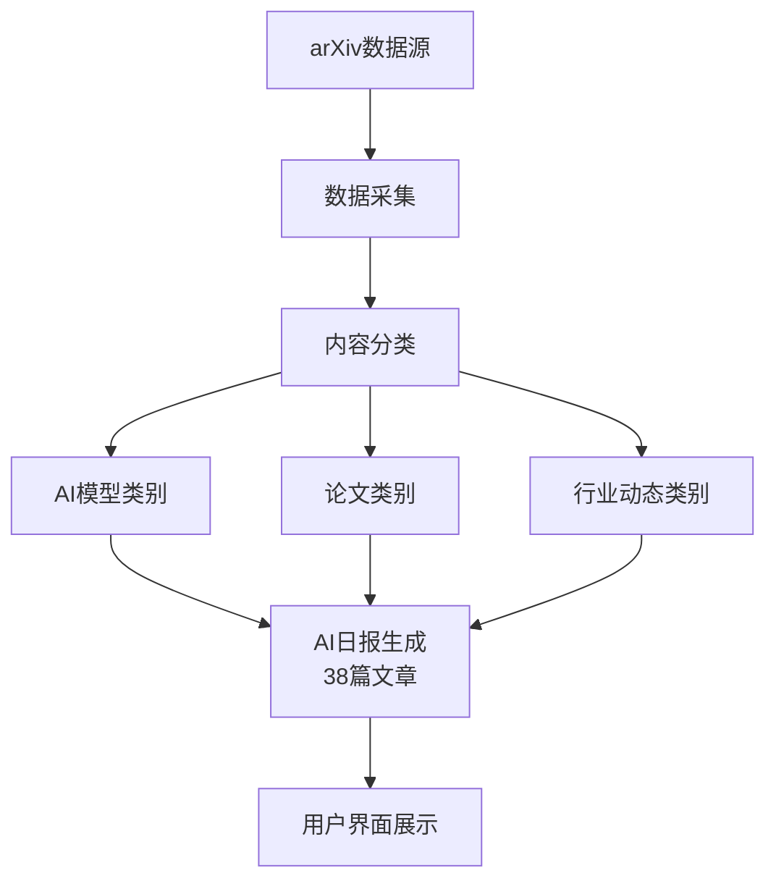
```mermaid
flowchart TD
ArxivSource["arXiv数据源"] --> DataCollection["数据采集"]
DataCollection --> Categorization["内容分类"]
Categorization --> AIModels["AI模型类别"]
Categorization --> Papers["论文类别"]
Categorization --> IndustryTrends["行业动态类别"]
AIModels --> DailyReport["AI日报生成<br/>38篇文章"]
Papers --> DailyReport
IndustryTrends --> DailyReport
DailyReport --> UserInterface["用户界面展示"]
```

**图表来源**
- [ai-daily.html:165](file://ai-daily.html#L165)
- [ai-daily.html:189-190](file://ai-daily.html#L189-L190)
- [build_ai_daily.py:437-481](file://build_ai_daily.py#L437-L481)

章节来源
- [ai-daily.html:165](file://ai-daily.html#L165)
- [ai-daily.html:189-190](file://ai-daily.html#L189-L190)
- [build_ai_daily.py:437-481](file://build_ai_daily.py#L437-L481)

### 双标签面板系统

**新增功能** RSS聚合器实现了AI快讯与热榜的双标签切换系统，提供一致的用户体验。

- **AI快讯标签**：展示最新的AI相关新闻和技术动态
- **热榜标签**：展示全网热门话题和趋势，支持平台筛选
- **移动端适配**：在移动端采用抽屉式交互，提供更好的触摸体验
- **实时更新**：支持定时刷新和手动刷新功能
- **平台筛选**：支持按平台类型筛选热榜内容

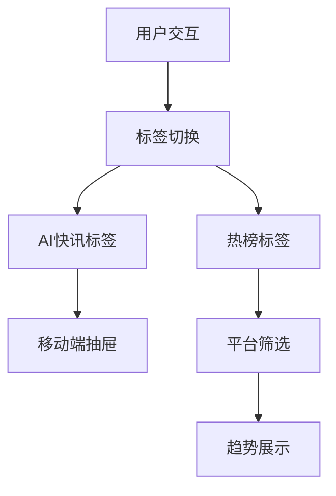
```mermaid
flowchart TD
UserInteraction["用户交互"] --> TabSwitch["标签切换"]
TabSwitch --> FeedTab["AI快讯标签"]
TabSwitch --> HotTab["热榜标签"]
FeedTab --> MobileDrawer["移动端抽屉"]
HotTab --> PlatformFilter["平台筛选"]
PlatformFilter --> TrendDisplay["趋势展示"]
```

**图表来源**
- [build_rss_aggregator.py:4391-4408](file://build_rss_aggregator.py#L4391-L4408)

章节来源
- [build_rss_aggregator.py:4391-4408](file://build_rss_aggregator.py#L4391-L4408)

### 热榜面板（WS-A接口）

**新增功能** 实现了WS-A接口的热榜面板组件，支持PC端常驻显示和移动端全屏抽屉模式。

- **维度分层**：支持分类和平台两个维度的筛选
- **分类筛选**：分段控件形式的分类选择（全部、热搜、科技、财经、资讯、生活）
- **平台筛选**：彩色圆点chips形式的平台选择，支持展开/收起
- **趋势指示**：显示内容的上升趋势、下降趋势或新内容标识
- **移动端优化**：在小屏幕设备上自动折叠平台列表，支持横向滚动

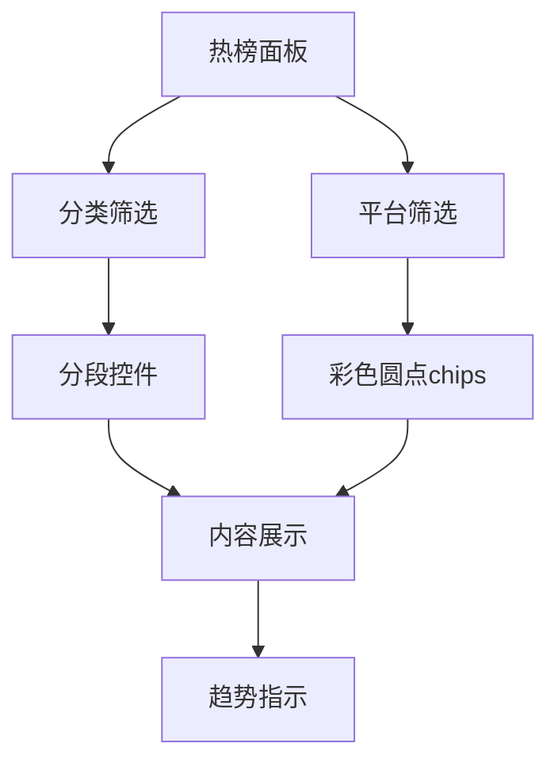
```mermaid
flowchart TD
HotPanel["热榜面板"] --> CategoryFilter["分类筛选"]
HotPanel --> PlatformFilter["平台筛选"]
CategoryFilter --> SegControl["分段控件"]
PlatformFilter --> ChipList["彩色圆点chips"]
SegControl --> ContentDisplay["内容展示"]
ChipList --> ContentDisplay
ContentDisplay --> TrendIndicator["趋势指示"]
```

**图表来源**
- [build_rss_aggregator.py:2207-2251](file://build_rss_aggregator.py#L2207-L2251)

章节来源
- [build_rss_aggregator.py:2207-2251](file://build_rss_aggregator.py#L2207-L2251)

### 前端去重机制（WS-C接口）

**新增功能** 实现了WS-C接口的前端去重机制，避免重复内容显示，提升用户体验。

- **标题标准化**：对内容进行标题标准化处理，去除空格和特殊字符
- **去重逻辑**：使用Set数据结构存储已显示内容的键值，避免重复添加
- **排序优化**：按发布时间倒序排列，确保最新内容优先显示
- **性能优化**：减少重复内容的渲染开销，提升页面加载速度

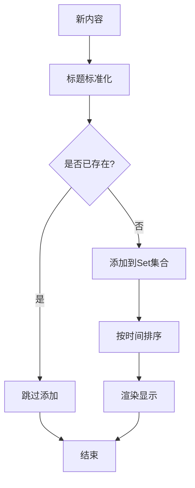
```mermaid
flowchart TD
NewContent["新内容"] --> Normalize["标题标准化"]
Normalize --> CheckDedup{"是否已存在?"}
CheckDedup -- 否 --> AddToSet["添加到Set集合"]
CheckDedup -- 是 --> Skip["跳过添加"]
AddToSet --> Sort["按时间排序"]
Sort --> Render["渲染显示"]
Skip --> End["结束"]
Render --> End
```

**图表来源**
- [build_rss_aggregator.py:4370-4378](file://build_rss_aggregator.py#L4370-L4378)

章节来源
- [build_rss_aggregator.py:4370-4378](file://build_rss_aggregator.py#L4370-L4378)

### CSS类名一致性修复

**重要修复** 修复了CSS类名不一致问题，将JavaScript中的'hpitem'类名统一修正为'hp-item'，确保热点项目的新徽章能够正确内联显示而不是换行显示。

- **影响范围**：此修复影响了ai-daily.html、index.html和rss-aggregator.html等多个页面
- **技术细节**：在build_rss_aggregator.py中统一使用`hp-item`类名，确保CSS样式正确应用
- **视觉效果**：修复后热点项目的徽章能够正确内联显示，避免了换行导致的布局问题

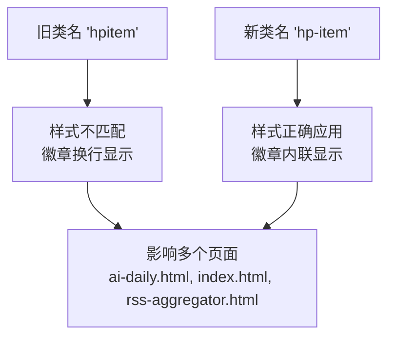
```mermaid
flowchart TD
OldClass["旧类名 'hpitem'"] --> Bug["样式不匹配<br/>徽章换行显示"]
NewClass["新类名 'hp-item'"] --> Fix["样式正确应用<br/>徽章内联显示"]
Bug --> Impact["影响多个页面<br/>ai-daily.html, index.html, rss-aggregator.html"]
Fix --> Impact
```

**图表来源**
- [build_rss_aggregator.py:2199-2200](file://build_rss_aggregator.py#L2199-L2200)
- [build_rss_aggregator.py:4371](file://build_rss_aggregator.py#L4371)

章节来源
- [build_rss_aggregator.py:2199-2200](file://build_rss_aggregator.py#L2199-L2200)
- [build_rss_aggregator.py:4371](file://build_rss_aggregator.py#L4371)

### 主界面导航增强

**新增功能** index.html中新增了AI晨报和RSS聚合导航入口，以及教育资源导航。

- **导航菜单**：新增"AI晨报"、"RSS聚合"两个主要导航链接，以及"学习资源"下拉菜单
- **学习资源下拉菜单**：整合多个学习平台链接，包括新增的FDE Learning和All-in-RAG
- **资讯平台下拉菜单**：集成新闻聚合平台
- **AI工具下拉菜单**：提供AI工具快速访问

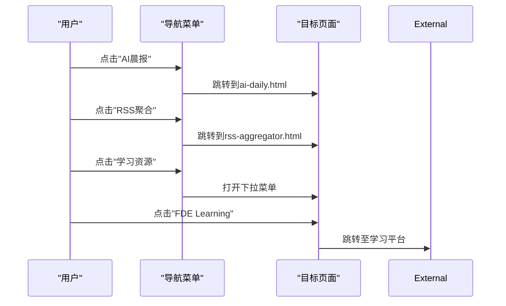
```mermaid
sequenceDiagram
participant U as "用户"
participant Nav as "导航菜单"
participant Page as "目标页面"
U->>Nav : 点击"AI晨报"
Nav->>Page : 跳转到ai-daily.html
U->>Nav : 点击"RSS聚合"
Nav->>Page : 跳转到rss-aggregator.html
U->>Nav : 点击"学习资源"
Nav->>Page : 打开下拉菜单
U->>Page : 点击"FDE Learning"
Page->>External : 跳转至学习平台
```

**图表来源**
- [index.html:764-794](file://index.html#L764-L794)

章节来源
- [index.html:764-794](file://index.html#L764-L794)

### 配置数据更新

**数据增强** descriptions_zh.json和known_categories.json得到了全面更新。

- **项目描述**：新增了大量AI工具、框架和项目的中文描述
- **分类映射**：更新了项目的分类信息，包括agent、coding、tools、learning等类别
- **覆盖范围**：涵盖了从AI代理到开发工具的广泛项目类型

章节来源
- [descriptions_zh.json:1-200](file://descriptions_zh.json#L1-L200)
- [known_categories.json:1-200](file://known_categories.json#L1-L200)

### 主题系统（明/暗）
- **机制**：通过根元素 data-theme 切换主题；CSS 变量在 :root 与 [data-theme="dark"] 中分别定义
- **持久化**：主题偏好存储于 localStorage，并在页面加载时应用
- **图标**：根据当前主题动态替换主题图标 SVG

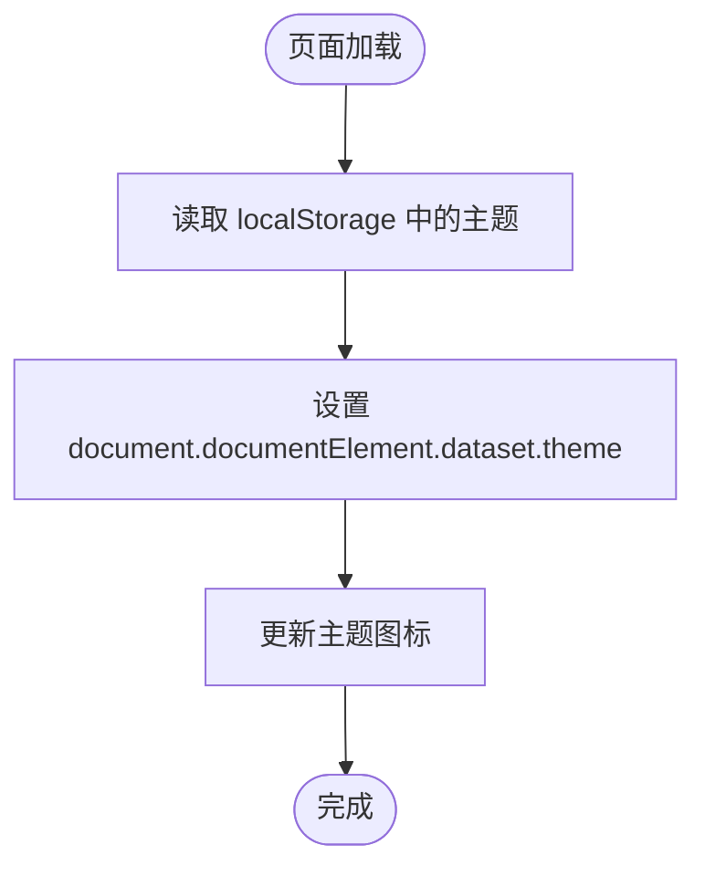
```mermaid
flowchart TD
Start(["页面加载"]) --> Read["读取 localStorage 中的主题"]
Read --> Apply["设置 document.documentElement.dataset.theme"]
Apply --> UpdateIcon["更新主题图标"]
UpdateIcon --> End(["完成"])
```

**图表来源**
- [index.html:1000-1011](file://index.html#L1000-L1011)
- [index.html:1842-1846](file://index.html#L1842-L1846)

章节来源
- [index.html:18-73](file://index.html#L18-L73)
- [index.html:1000-1011](file://index.html#L1000-L1011)
- [index.html:1842-1846](file://index.html#L1842-L1846)

### 视图切换（卡片/列表）
- **机制**：body 添加/移除 view-list 类名控制布局；图标随视图切换
- **持久化**：视图偏好存储于 localStorage

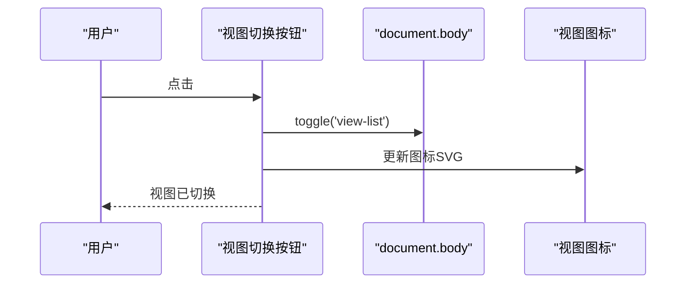
```mermaid
sequenceDiagram
participant U as "用户"
participant Btn as "视图切换按钮"
participant Body as "document.body"
participant Icon as "视图图标"
U->>Btn : 点击
Btn->>Body : toggle('view-list')
Btn->>Icon : 更新图标SVG
Btn-->>U : 视图已切换
```

**图表来源**
- [index.html:1013-1023](file://index.html#L1013-L1023)
- [index.html:1847-1851](file://index.html#L1847-L1851)

章节来源
- [index.html:1013-1023](file://index.html#L1013-L1023)
- [index.html:1847-1851](file://index.html#L1847-L1851)

### 收藏与置顶
- **行为**：点击收藏按钮切换收藏状态，收藏项显示"置顶"标识，列表/卡片高亮
- **持久化**：收藏集合以 Set 形式存入 localStorage
- **导出/导入**：支持导出 JSON 备份与恢复收藏

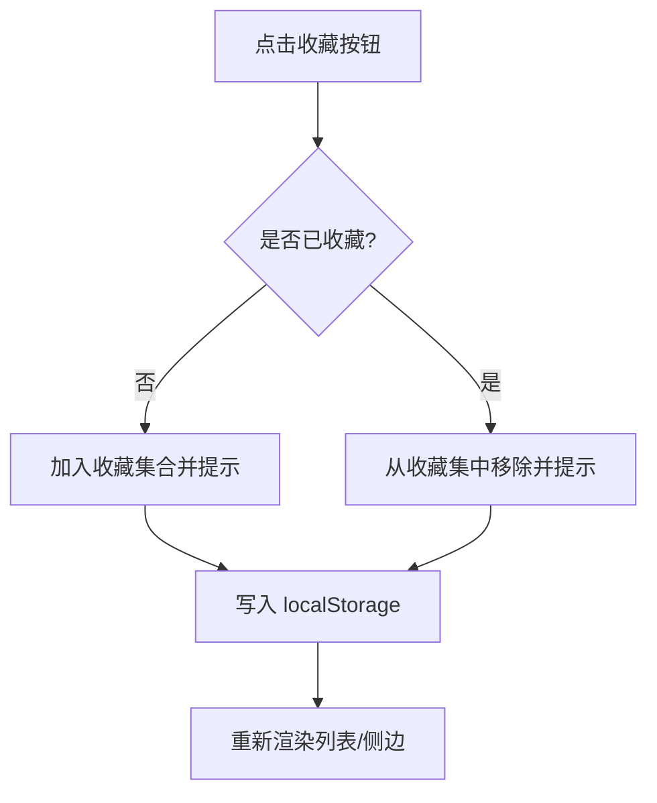
```mermaid
flowchart TD
Click["点击收藏按钮"] --> Toggle{"是否已收藏?"}
Toggle -- 否 --> Add["加入收藏集合并提示"]
Toggle -- 是 --> Remove["从收藏集中移除并提示"]
Add --> Save["写入 localStorage"]
Remove --> Save
Save --> Render["重新渲染列表/侧边"]
```

**图表来源**
- [index.html:1910-1920](file://index.html#L1910-L1920)
- [index.html:1922-1953](file://index.html#L1922-L1953)

章节来源
- [index.html:1910-1920](file://index.html#L1910-L1920)
- [index.html:1922-1953](file://index.html#L1922-L1953)

### 搜索与筛选
- **搜索工作台**：支持关键词、语言、排序等多条件组合；支持无限滚动加载更多
- **工具栏**：关键词输入、语言下拉、星标范围选择
- **分类标签**：点击切换当前分类过滤
- **快捷键**：按"/"聚焦搜索框；"Esc"清空或关闭模态

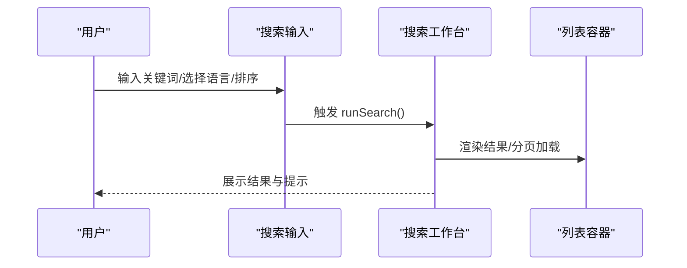
```mermaid
sequenceDiagram
participant U as "用户"
participant Q as "搜索输入"
participant S as "搜索工作台"
participant L as "列表容器"
U->>Q : 输入关键词/选择语言/排序
Q->>S : 触发 runSearch()
S->>L : 渲染结果/分页加载
S-->>U : 展示结果与提示
```

**图表来源**
- [index.html:1869-1881](file://index.html#L1869-L1881)
- [index.html:1894-1907](file://index.html#L1894-L1907)

章节来源
- [index.html:1869-1881](file://index.html#L1869-L1881)
- [index.html:1894-1907](file://index.html#L1894-L1907)

### 封面卡片（V2）
- **布局**：上部封面图（失败降级为纸纹+首字母）、中部名称与简介、下部元数据吸底
- **图片错误处理**：监听 error 事件，延迟重试一次，仍失败则切换 fallback
- **悬停效果**：仅在精确指针设备生效，边框混色与轻微缩放

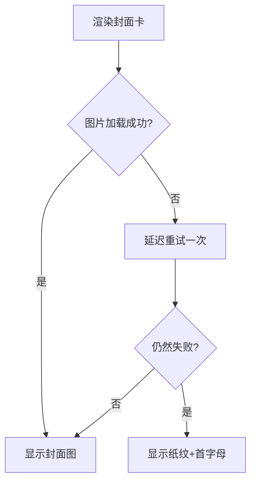
```mermaid
flowchart TD
Load["渲染封面卡"] --> Img{"图片加载成功?"}
Img -- 是 --> ShowImg["显示封面图"]
Img -- 否 --> Retry["延迟重试一次"]
Retry --> Check{"仍然失败?"}
Check -- 是 --> Fallback["显示纸纹+首字母"]
Check -- 否 --> ShowImg
```

**图表来源**
- [index.html:1990-2002](file://index.html#L1990-L2002)
- [index.html:1166-1200](file://index.html#L1166-L1200)

章节来源
- [index.html:1166-1200](file://index.html#L1166-L1200)
- [index.html:1990-2002](file://index.html#L1990-L2002)

### 模态框与键盘交互
- **模态**：趋势详情与搜索工作台均以模态呈现，支持点击遮罩或关闭按钮退出
- **键盘**：Esc 关闭模态或清空搜索；"/"聚焦搜索框

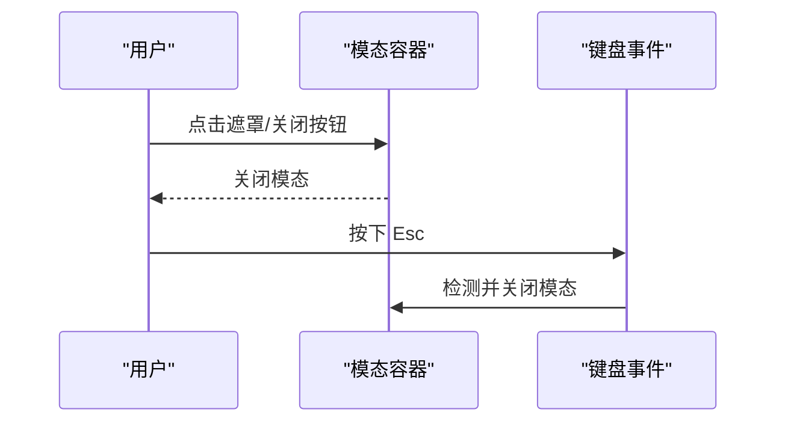
```mermaid
sequenceDiagram
participant U as "用户"
participant M as "模态容器"
participant K as "键盘事件"
U->>M : 点击遮罩/关闭按钮
M-->>U : 关闭模态
U->>K : 按下 Esc
K->>M : 检测并关闭模态
```

**图表来源**
- [index.html:1890-1907](file://index.html#L1890-L1907)

章节来源
- [index.html:1890-1907](file://index.html#L1890-L1907)

### 响应式设计

**增强更新** 特别优化了移动端适配和响应式布局，新增的demo-redesign.html采用了移动端优先的设计理念。

- **断点**：1100px、900px、640px 三档适配
- **布局**：大屏双列（主内容+侧边），中小屏堆叠；网格列数自适应；移动端隐藏部分文字、调整间距与尺寸
- **可访问性**：尊重 prefers-reduced-motion，禁用动画过渡
- **移动端优化**：侧边栏在移动端改为底部抽屉式布局，提供更好的触摸体验
- **移动端优先**：**新增** demo-redesign.html采用移动端优先的设计方法，确保在小屏幕设备上获得最佳体验

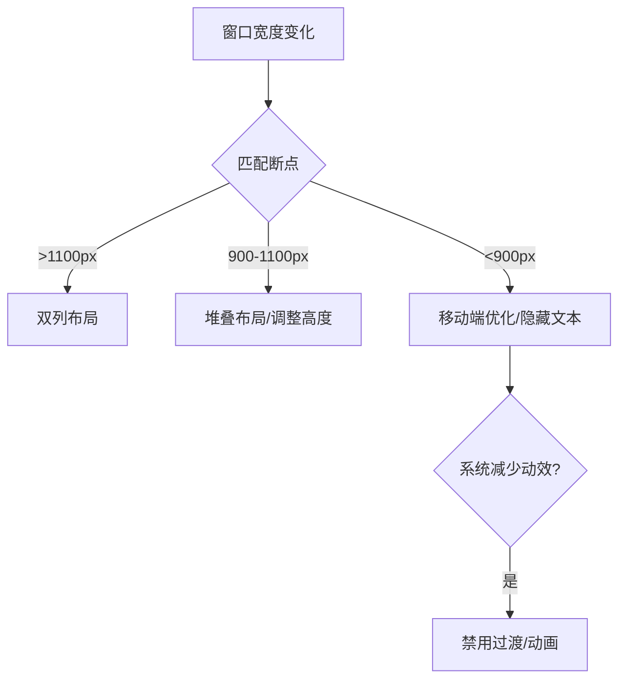
```mermaid
flowchart TD
W["窗口宽度变化"] --> Break{"匹配断点"}
Break -- >1100px --> TwoCol["双列布局"]
Break -- 900-1100px --> Stack["堆叠布局/调整高度"]
Break -- <900px --> Mobile["移动端优化/隐藏文本"]
Mobile --> Reduced{"系统减少动效?"}
Reduced -- 是 --> DisableAnim["禁用过渡/动画"]
```

**图表来源**
- [index.html:687-743](file://index.html#L687-L743)

章节来源
- [index.html:687-743](file://index.html#L687-L743)

### 无障碍与可访问性

**改进更新** 增强了可访问性支持。

- **语义化**：header、nav、button、aria-* 属性配合
- **焦点管理**：快捷键聚焦搜索框；模态关闭后焦点回归
- **动效**：遵循 prefers-reduced-motion
- **键盘导航**：完整的键盘操作支持，包括标签切换和表单操作
- **屏幕阅读器**：添加了适当的ARIA属性和描述

章节来源
- [index.html:754-784](file://index.html#L754-L784)
- [index.html:1894-1907](file://index.html#L1894-L1907)
- [index.html:740-743](file://index.html#L740-L743)

### 状态、动画与过渡
- **状态**：主题、视图、收藏、侧边 Tab、搜索条件等
- **动画**：统计数字滚动（IntersectionObserver 触发一次）、卡片悬浮提升、模态淡入、回到顶部显隐
- **过渡**：统一使用 CSS transition，避免过度重排

章节来源
- [index.html:1963-1984](file://index.html#L1963-L1984)
- [index.html:676-685](file://index.html#L676-L685)
- [index.html:564-601](file://index.html#L564-L601)

### 样式自定义与主题支持
- **通过 CSS 变量**集中管理颜色、阴影、圆角、字体等，便于定制与扩展
- **明暗主题**通过 data-theme 切换，覆盖所有变量

章节来源
- [index.html:18-73](file://index.html#L18-L73)

### 跨浏览器兼容性与性能优化
- **兼容性**：使用现代 CSS 特性（如 backdrop-filter、color-mix）并提供降级策略；对不支持 color-mix 的环境回退到 hover-line
- **性能**：
  - 图片懒加载与异步解码
  - IntersectionObserver 控制统计动画触发
  - content-visibility 与 contain-intrinsic-size 优化长列表渲染
  - 事件委托减少监听器数量
  - 轮询间隔较长（30 分钟）且页面不可见时暂停

章节来源
- [index.html:426-435](file://index.html#L426-L435)
- [index.html:1990-2002](file://index.html#L1990-L2002)
- [index.html:1963-1984](file://index.html#L1963-L1984)
- [index.html:2006-2008](file://index.html#L2006-L2008)

### 组件组合与 UI 集成
- **顶部导航与操作栏**作为全局入口，驱动视图、主题、数据刷新等
- **工具栏与分类标签**共同作用于内容区的数据过滤
- **侧边栏与主内容区**联动：侧边 Tab 切换不同面板，主内容区渲染对应数据
- **模态框复用**侧边趋势与搜索能力，形成一致的交互体验
- **新增** AI晨报、RSS聚合导航与教育资源链接与现有架构完美融合
- **新增** 双标签面板系统与热榜/洞察面板的集成

章节来源
- [index.html:748-800](file://index.html#L748-L800)
- [index.html:1858-1889](file://index.html#L1858-L1889)

### index.html 主界面的复杂交互逻辑与模板引擎
- **模板引擎**：纯 JS 字符串拼接与 innerHTML 渲染，封装为 renderList/renderCats/renderTrending/renderFeed 等函数，按状态驱动视图更新
- **事件绑定**：bindEvents 集中注册事件，包括主题/视图切换、侧边 Tab、趋势模态、搜索工作台、键盘快捷键、滚动加载等
- **数据流**：初始化时渲染静态数据，随后按需刷新 Feed；收藏与偏好落盘 localStorage；搜索与筛选即时响应

章节来源
- [index.html:1166-1200](file://index.html#L1166-L1200)
- [index.html:1842-1907](file://index.html#L1842-L1907)
- [index.html:1985-2009](file://index.html#L1985-L2009)

### AI日报构建脚本优化

**重要更新** build_ai_daily.py脚本得到了显著优化，改进了内容选择算法和时间戳生成逻辑。

- **内容选择算法优化**：通过更精确的分类权重和评分机制，将文章数量从42篇优化至38篇，提升内容质量
- **时间戳生成改进**：提供更准确的北京时间显示，格式化为"YYYY-MM-DD HH:MM"格式
- **分类分布重新计算**：基于新的算法，各分类的文章分布得到重新计算和优化
- **数据源整合增强**：arXiv等数据源的整合更加完善，提升了内容的学术价值和专业性

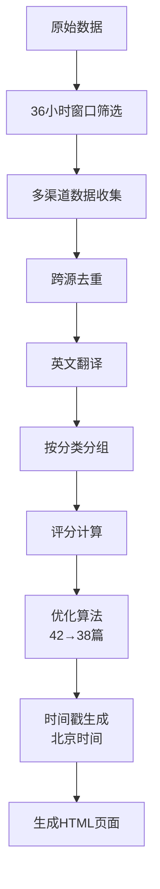
```mermaid
flowchart TD
InputData["原始数据"] --> FilterToday["36小时窗口筛选"]
FilterToday --> MultiChannel["多渠道数据收集"]
MultiChannel --> Dedupe["跨源去重"]
Dedupe --> Translate["英文翻译"]
Translate --> GroupByCat["按分类分组"]
GroupByCat --> ScoreCalc["评分计算"]
ScoreCalc --> OptimizeAlgo["优化算法<br/>42→38篇"]
OptimizeAlgo --> TimeStamp["时间戳生成<br/>北京时间"]
TimeStamp --> GenerateHTML["生成HTML页面"]
```

**图表来源**
- [build_ai_daily.py:848-879](file://build_ai_daily.py#L848-L879)
- [build_ai_daily.py:1187-1251](file://build_ai_daily.py#L1187-L1251)

章节来源
- [build_ai_daily.py:848-879](file://build_ai_daily.py#L848-L879)
- [build_ai_daily.py:1187-1251](file://build_ai_daily.py#L1187-L1251)

## 依赖分析
- **运行时依赖**：无外部 JS/CSS 框架，完全自包含
- **构建依赖**：package.json 声明 jsdom 与 @mozilla/readability，供 Python 构建脚本解析 HTML 使用
- **外部资源**：Google Fonts 字体预连接；GitHub OpenGraph 封面图（可选）

```mermaid
graph LR
P["package.json"] --> J["jsdom"]
P --> R["@mozilla/readability"]
H["index.html"] --> F["Google Fonts"]
H --> O["GitHub OpenGraph 封面"]
B["build_rss_aggregator.py"] --> T["trending_snapshot.json"]
B --> A["bestblogs_analysis.json"]
IE["insight_engine.py"] --> LLM["LLM API"]
DR["rss-aggregator.html"] --> WS["WS-A/B/C 接口"]
BAD["build_ai_daily.py"] --> API["AIHOT API"]
BAD --> RSS["多渠道RSS"]
BAD --> ARXIV["arXiv API"]
ED["教育资源导航"] --> FDE["FDE Learning"]
ED --> AIRAG["All-in-RAG"]
```

**图表来源**
- [package.json:1-9](file://package.json#L1-L9)
- [index.html:7-9](file://index.html#L7-L9)
- [build_rss_aggregator.py:4380-4579](file://build_rss_aggregator.py#L4380-L4579)
- [build_ai_daily.py:137-175](file://build_ai_daily.py#L137-L175)

章节来源
- [package.json:1-9](file://package.json#L1-L9)

## 性能考虑
- **渲染优化**：content-visibility、懒加载、IntersectionObserver 控制动画触发
- **网络优化**：封面图 lazy 加载与失败重试；Feed 轮询间隔较长且可见时才运行
- **交互优化**：事件委托、最小化重排重绘、过渡与动画节流
- **可访问性**：尊重系统减少动效设置
- **前端去重**：**新增** WS-C接口的前端去重机制，减少重复内容的渲染开销
- **内容优化**：**新增** AI日报内容选择算法优化，减少冗余内容，提升加载性能
- **基于视角的内容生成**：改进了洞察内容的显示格式，减少不必要的DOM操作，提升渲染性能
- **教育资源导航优化**：新增的外部链接采用target="_blank"和rel="noopener"确保安全性与性能

[本节为通用指导，不直接分析具体文件]

## 故障排查指南
- **封面图不显示**：检查网络与 CORS；页面已内置 error 监听与一次重试；若仍失败将显示纸纹与首字母
- **主题/视图未持久化**：检查 localStorage 权限与存储空间；确认 applyTheme/applyView 被调用
- **搜索无结果**：确认关键词、语言、排序条件；检查 runSearch 是否被触发；查看控制台是否有异常
- **模态无法关闭**：检查事件监听是否被覆盖；尝试按 Esc 或点击遮罩
- **统计数字不动**：确认 IntersectionObserver 可用；检查阈值与观察目标是否正确
- **AI日报页面不显示**：检查网络连接；确认AIHOT API可达；查看控制台是否有API错误
- **RSS聚合器加载缓慢**：检查网络连接；确认RSS源可达；查看控制台是否有请求错误
- **配置数据不更新**：检查JSON文件格式；确认路径正确；验证数据结构完整性
- **热点徽章显示异常**：检查CSS类名是否为'hp-item'而非'hpitem'；确认样式文件正确加载
- **语义洞察面板不显示**：检查ANALYSIS_DATA是否存在；确认deep_insights字段格式正确；查看控制台是否有解析错误
- **arXiv内容缺失**：检查arXiv数据源配置；确认arXiv RSS订阅正常；查看构建日志中的arXiv源状态
- **双标签面板不工作**：检查switchAfTab函数调用；确认标签切换逻辑正确；查看控制台是否有JavaScript错误
- **热榜面板加载失败**：检查hot_snapshot.json文件；确认WS-A接口数据格式；查看控制台是否有网络请求错误
- **去重功能异常**：检查WS-C接口的前端去重逻辑；确认去重算法的正确性；查看控制台是否有去重相关的错误
- **AI日报文章数量异常**：检查build_ai_daily.py中的内容选择算法；确认36小时窗口筛选逻辑；查看构建日志中的文章统计
- **时间戳显示错误**：检查北京时间转换逻辑；确认时区设置正确；查看构建脚本中的时间格式化代码
- **基于视角的内容生成问题**：检查insight_engine.py中的数据生成逻辑；确认WS-B接口的数据绑定格式；查看控制台是否有洞察数据解析错误
- **教育资源链接失效**：检查FDE Learning和All-in-RAG网站可达性；确认URL地址正确；验证外部链接的安全性设置

章节来源
- [index.html:1990-2002](file://index.html#L1990-L2002)
- [index.html:1842-1851](file://index.html#L1842-L1851)
- [index.html:1869-1881](file://index.html#L1869-L1881)
- [index.html:1890-1907](file://index.html#L1890-L1907)
- [index.html:1963-1984](file://index.html#L1963-L1984)
- [build_rss_aggregator.py:2199-2200](file://build_rss_aggregator.py#L2199-L2200)
- [build_ai_daily.py:848-879](file://build_ai_daily.py#L848-L879)
- [build_ai_daily.py:1187-1251](file://build_ai_daily.py#L1187-L1251)

## 结论
该前端界面以极简的单页架构实现了丰富的功能：主题与视图切换、收藏与置顶、多维搜索与筛选、侧边趋势与动态、封面卡片与列表视图、响应式与无障碍支持。**最新更新**包括教育资源导航的增强、AI日报页面的编辑风格重构、RSS聚合器的用户交互改进，以及全面的移动端优化。特别实现了双标签面板系统、语义洞察面板容器化设计、前端去重机制，以及arXiv数据源的完整集成。

**本次更新的重点成果**：
- **教育资源导航增强**：新增FDE Learning和All-in-RAG学习平台，为开发者提供完整的机器学习与RAG学习路径，显著提升平台的教育价值
- **AI日报内容优化**：通过更精确的内容选择算法，将文章数量从42篇优化至38篇，显著提升内容质量和相关性
- **时间戳生成改进**：提供更准确的北京时间显示，改善用户体验
- **分类分布优化**：基于新算法重新计算各分类的文章分布，确保内容组织的合理性
- **数据源整合增强**：arXiv等学术数据源的整合更加完善，提升了AI日报的专业性和权威性
- **基于视角的内容生成**：改进了语义洞察面板的数据绑定和显示格式，提供更清晰的洞察内容展示

这些更新显著提升了平台的整体教育价值，完善了用户体验，并增强了界面的智能化展示能力。通过 CSS 变量与内联脚本，既保证了可维护性，又具备良好的性能与跨浏览器兼容性。建议后续在保持现有风格的基础上，逐步引入更细粒度的组件化与测试覆盖，以提升长期演进效率。

[本节为总结，不直接分析具体文件]

## 附录
- **在线地址与自动化更新说明**参见 README
- **如需二次开发**，建议优先理解 index.html 中的渲染函数与事件绑定逻辑，再按需拆分模块
- **AI日报页面开发**：重点关注编辑风格的设计模式和响应式布局实现，以及arXiv数据源的集成
- **RSS聚合器开发**：重点关注双标签面板系统的实现逻辑，以及语义洞察功能的集成
- **CSS类名规范**：确保使用统一的'hp-item'类名而非'hpitem'，以保证样式正确应用
- **语义洞察开发**：重点关注insight_engine.py中的数据生成逻辑和rss-aggregator.html中的渲染实现
- **数据源管理**：了解arXiv等新数据源的集成方式和配置方法
- **移动端优化实践**：学习双标签面板和抽屉式交互的实现方法
- **组件化开发**：参考WS-A/B/C接口的组件化实现模式
- **AI日报构建优化**：重点关注build_ai_daily.py中的内容选择算法优化和时间戳生成逻辑改进
- **基于视角的内容生成**：深入了解insight_engine.py中的视角化内容生成机制和WS-B接口的数据绑定格式
- **教育资源导航扩展**：学习如何在现有导航结构中安全地添加新的外部学习资源链接

章节来源
- [README.md:1-22](file://README.md#L1-L22)