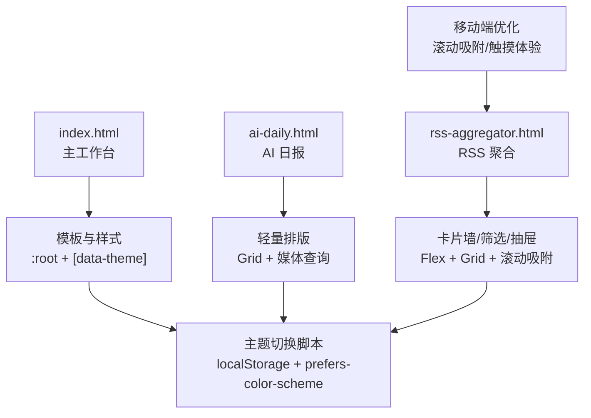
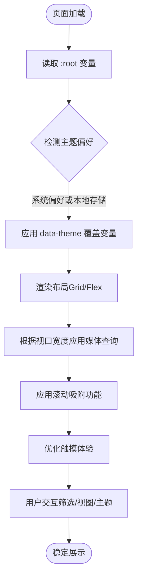
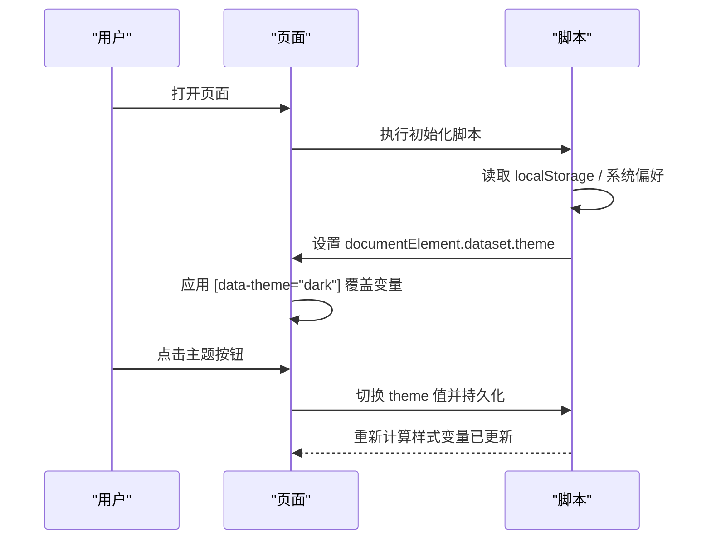
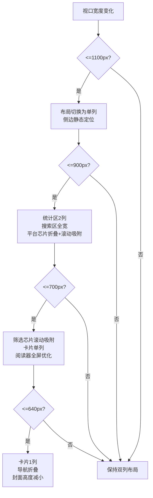
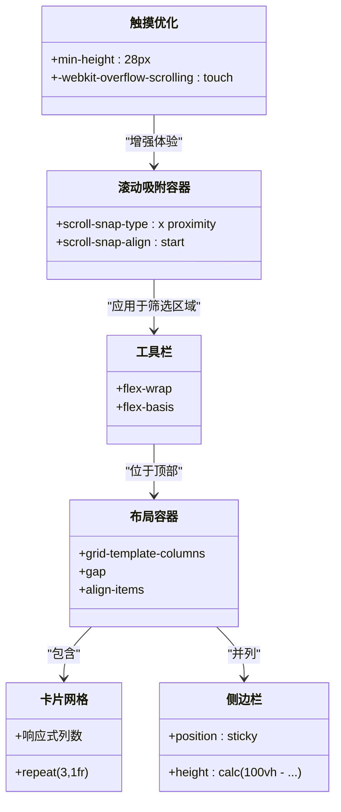
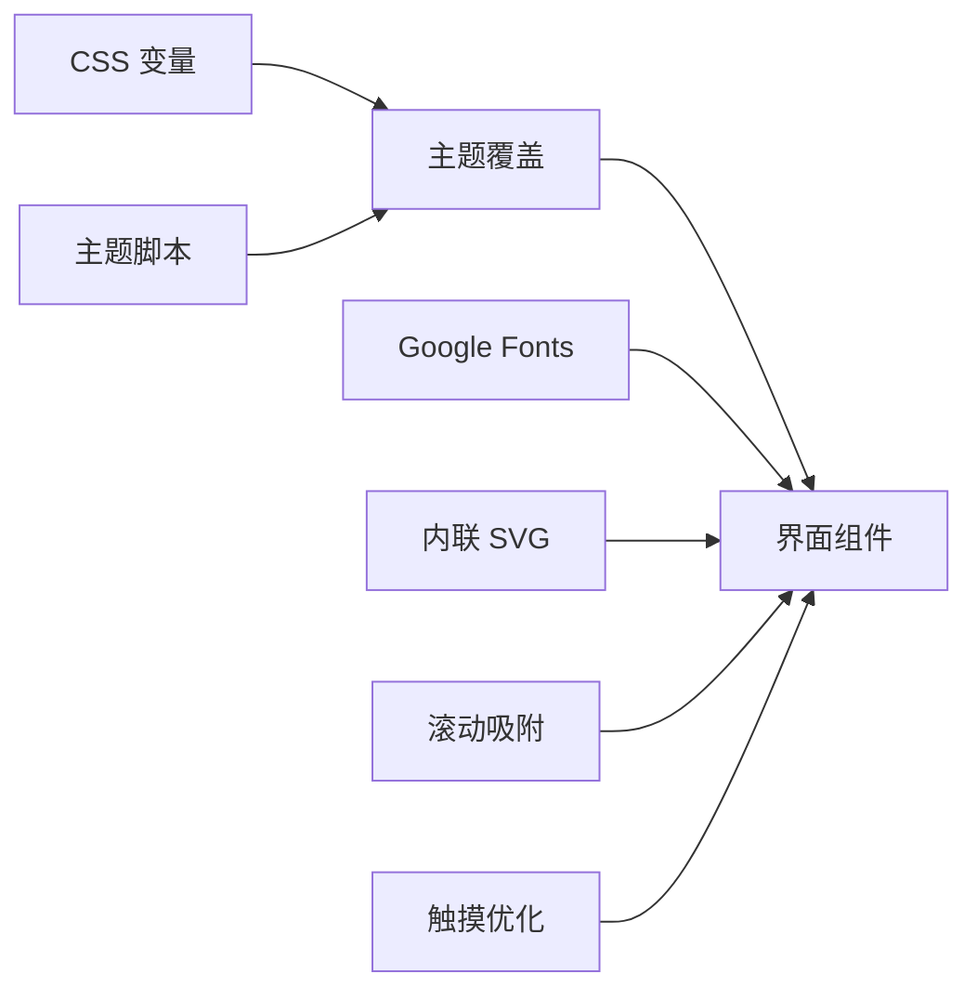

# 响应式设计系统

<cite>
**本文引用的文件**
- [index.html](file://index.html)
- [template.html](file://template.html)
- [ai-daily.html](file://ai-daily.html)
- [rss-aggregator.html](file://rss-aggregator.html)
</cite>

## 更新摘要
**变更内容**
- **新增**：RSS聚合器实现了滚动吸附功能，提升移动端筛选芯片和平台标签的横向滚动体验
- **新增**：AI日报页面优化了760px断点下的首屏布局，实现更好的移动端视觉层次
- **增强**：所有页面的触摸体验优化，包括更合适的触控区域和手势支持
- **优化**：移动端工具栏控件高度统一为28px，防止溢出挤压变形
- **改进**：响应式断点策略更加精细，针对不同屏幕尺寸提供最佳显示效果

## 目录
1. [简介](#简介)
2. [项目结构](#项目结构)
3. [核心组件](#核心组件)
4. [架构总览](#架构总览)
5. [详细组件分析](#详细组件分析)
6. [依赖关系分析](#依赖关系分析)
7. [性能考量](#性能考量)
8. [故障排查指南](#故障排查指南)
9. [结论](#结论)
10. [附录](#附录)

## 简介
本文件系统化梳理仓库中的响应式设计实现，重点覆盖：
- CSS 变量系统与明暗主题切换机制
- 媒体查询断点与布局适配策略
- Flexbox 与 Grid 在侧边栏自适应、卡片网格、移动端优化中的应用
- **新增**：滚动吸附功能与移动端交互优化
- 跨页面一致的样式组织与层叠策略
- 性能优化建议与跨浏览器兼容方案

该设计以"纸感数据书"风格为基调，通过统一的 CSS 变量、语义化类名和模块化媒体查询，确保在大屏到小屏的一致体验。**最新的移动端适配增强特别关注了触摸体验和布局适应性**。

## 项目结构
本项目由多个独立 HTML 页面组成，每个页面内嵌样式（CSS）与脚本（JS），并通过共享的变量命名约定与主题切换逻辑保持一致性。关键页面职责如下：
- index.html / template.html：主工作台，包含统计区、搜索区、分类标签、卡片/列表视图、侧边趋势与订阅流等
- ai-daily.html：AI 日报单页，采用更简洁的排版与栅格，针对移动端进行了专门优化
- rss-aggregator.html：RSS 聚合阅读器，提供卡片墙、筛选、来源抽屉等，实现了先进的移动端滚动吸附功能



**图表来源**
- [index.html:10-74](file://index.html#L10-L74)
- [ai-daily.html:8-22](file://ai-daily.html#L8-L22)
- [rss-aggregator.html:8-32](file://rss-aggregator.html#L8-L32)

**章节来源**
- [index.html:10-74](file://index.html#L10-L74)
- [ai-daily.html:8-22](file://ai-daily.html#L8-L22)
- [rss-aggregator.html:8-32](file://rss-aggregator.html#L8-L32)

## 核心组件
- 主题与令牌系统
  - 使用 :root 定义全局 CSS 变量（背景、文字、品牌色、边框、阴影、字体族、卡片尺寸等）
  - 通过 [data-theme="dark"] 覆盖变量实现明暗主题切换
  - 各页面保持变量命名一致，便于统一维护
- 布局系统
  - 主布局采用 Grid 两列（内容 + 侧边），在小屏时自动切换为单列
  - 卡片网格使用 Grid 多列，支持 3/2/1 列自适应
  - 工具栏、导航、筛选条使用 Flex 进行对齐与换行控制
- **新增**：滚动吸附系统
  - 为水平滚动容器添加 `scroll-snap-type: x proximity` 和 `scroll-snap-align: start`
  - 提升移动端横向滚动的精准度和用户体验
- 响应式断点
  - 典型断点：1100px、900px、640px（主工作台）；760px（日报）；移动端针对 RSS 聚合器也有专门调整
- 交互与可访问性
  - 主题切换按钮、视图切换、滚动回顶、模态框、筛选芯片等
  - 使用 aria-* 属性与 focus-visible 提升可访问性
- **新增**：移动端触摸优化
  - 统一的触控区域大小（28px最小高度）
  - 优化的滚动行为和手势支持
  - 改进的视觉层次和反馈

**章节来源**
- [index.html:10-74](file://index.html#L10-L74)
- [index.html:687-743](file://index.html#L687-L743)
- [ai-daily.html:8-22](file://ai-daily.html#L8-L22)
- [ai-daily.html:129-140](file://ai-daily.html#L129-L140)
- [rss-aggregator.html:8-32](file://rss-aggregator.html#L8-L32)

## 架构总览
整体样式架构遵循"变量优先、模块分层、媒体查询收口"的原则：
- 顶层变量集中声明，主题切换仅覆盖变量
- 组件样式按功能划分（头部、工具栏、卡片、侧边、模态等）
- 响应式规则集中在 media 块中，避免散落的条件样式
- 跨页面复用相同的变量命名与主题开关逻辑
- **新增**：移动端特定的滚动吸附和触摸优化



**图表来源**
- [index.html:10-74](file://index.html#L10-L74)
- [index.html:687-743](file://index.html#L687-L743)
- [ai-daily.html:8-22](file://ai-daily.html#L8-L22)
- [rss-aggregator.html:8-32](file://rss-aggregator.html#L8-L32)

## 详细组件分析

### CSS 变量与主题系统
- 变量范围
  - 基础色板：背景、卡片、边框、文字、弱化色、强调色
  - 品牌与辅助：品牌主色、深浅变体、线条、弱背景
  - 状态与反馈：悬停、选中、禁用、高亮标记、收藏态
  - 排版与视觉：字体族、圆角、阴影、封面高度、缓动曲线
- 主题切换机制
  - 通过 <script> 初始化 data-theme，优先读取本地存储，否则回退至系统偏好
  - 使用 [data-theme="dark"] 选择器覆盖 :root 变量，实现一键切换
  - 各页面均遵循相同模式，保证一致性



**图表来源**
- [index.html:745-746](file://index.html#L745-L746)
- [ai-daily.html:142-143](file://ai-daily.html#L142-L143)
- [rss-aggregator.html:8-32](file://rss-aggregator.html#L8-L32)

**章节来源**
- [index.html:10-74](file://index.html#L10-L74)
- [ai-daily.html:8-22](file://ai-daily.html#L8-L22)
- [rss-aggregator.html:8-32](file://rss-aggregator.html#L8-L32)

### 媒体查询与断点策略
- 主工作台（index/template）
  - 1100px：双列布局切换为单列，侧边改为静态定位，卡片网格从 3 列变为 2 列
  - 900px：统计区改为 2 列，搜索区在小屏下包裹并全宽显示
  - 640px：头部导航折叠，卡片网格回到 1 列，工具栏换行，封面高度缩小
- AI 日报（ai-daily）
  - 760px：首屏左右分栏改为上下堆叠，栏目栅格由 2 列变为 1 列
  - 优化了移动端标题字间距和索引区域的间距
- RSS 聚合器（rss-aggregator）
  - **新增**：900px断点下平台芯片折叠为水平滚动容器，启用滚动吸附
  - 700px：筛选芯片启用滚动吸附，卡片墙变为单列，阅读器模态框全屏优化
  - 卡片墙使用 columns 多列瀑布流，移动端降低列数与封面高度
  - 工具栏与筛选在小屏下换行，抽屉面板宽度限制并适配窄屏



**图表来源**
- [index.html:687-743](file://index.html#L687-L743)
- [ai-daily.html:129-140](file://ai-daily.html#L129-L140)
- [rss-aggregator.html:284-316](file://rss-aggregator.html#L284-L316)

**章节来源**
- [index.html:687-743](file://index.html#L687-L743)
- [ai-daily.html:129-140](file://ai-daily.html#L129-L140)
- [rss-aggregator.html:284-316](file://rss-aggregator.html#L284-L316)

### Flexbox 与 Grid 的应用
- 主布局
  - Grid 两列：主内容 + 侧边栏，侧边 sticky 定位，在小屏转为静态
  - 统计区 Grid 四列，小屏降为两列
- 卡片网格
  - 默认 3 列，1100px 以下 2 列，640px 以下 1 列
  - 封面卡使用固定高度变量，小屏切换较小高度
- 工具栏与筛选
  - Flex 排列，允许换行与弹性伸缩，保证小屏可用性
- 侧边栏与抽屉
  - 侧边栏在小屏上移序并静态定位；RSS 聚合器的来源抽屉通过 transform 滑入滑出
- **新增**：滚动吸附容器
  - 使用 `scroll-snap-type: x proximity` 实现水平滚动吸附
  - 配合 `scroll-snap-align: start` 确保元素对齐
  - 渐变遮罩提示可滚动内容



**图表来源**
- [index.html:172-191](file://index.html#L172-L191)
- [index.html:321-328](file://index.html#L321-L328)
- [index.html:687-743](file://index.html#L687-L743)
- [rss-aggregator.html:296-297](file://rss-aggregator.html#L296-L297)
- [rss-aggregator.html:495-497](file://rss-aggregator.html#L495-L497)

**章节来源**
- [index.html:172-191](file://index.html#L172-L191)
- [index.html:321-328](file://index.html#L321-L328)
- [index.html:687-743](file://index.html#L687-L743)

### 滚动吸附功能实现
**新增功能**：为提升移动端水平滚动体验，在多个容器中实现了滚动吸附功能

- **筛选芯片容器**
  - 使用 `scroll-snap-type: x proximity` 实现平滑吸附
  - 配合 `-webkit-mask-image` 创建渐变遮罩效果
  - 每个芯片设置 `scroll-snap-align: start` 确保对齐
- **平台芯片折叠**
  - 在900px断点下，平台芯片行自动折叠为水平滚动容器
  - 隐藏滚动条并提供"更多"按钮展开完整选项
  - 使用渐变遮罩提示可滚动内容
- **热榜维度行**
  - 分类切换按钮组支持水平滚动
  - 平台标签在移动端自动折叠并启用吸附

```css
/* 筛选芯片滚动吸附 */
.chips { 
  overflow-x:auto; 
  flex-wrap:nowrap; 
  max-width:100%; 
  padding-bottom:4px; 
  scroll-snap-type:x proximity; 
  -webkit-mask-image:linear-gradient(to right,#000 90%,transparent 100%); 
  mask-image:linear-gradient(to right,#000 90%,transparent 100%); 
}
.chip { 
  white-space:nowrap; 
  flex:none; 
  scroll-snap-align:start; 
}

/* 平台芯片折叠 */
.plat-row.collapsed{
  flex-wrap:nowrap;
  overflow-x:auto;
  scroll-snap-type:x proximity;
  max-width:100%;
  -webkit-mask-image:linear-gradient(to right,#000 88%,transparent);
  mask-image:linear-gradient(to right,#000 88%,transparent);
  scrollbar-width:none;
}
.plat-row.collapsed .plat-chip{scroll-snap-align:start;}
```

**章节来源**
- [rss-aggregator.html:296-297](file://rss-aggregator.html#L296-L297)
- [rss-aggregator.html:495-497](file://rss-aggregator.html#L495-L497)

### 具体适配示例（路径引用）
- 主工作台布局与卡片网格
  - 两列布局与小屏单列切换：[index.html:687-700](file://index.html#L687-L700)
  - 卡片网格列数变化：[index.html:687-700](file://index.html#L687-L700)
  - 封面卡高度变量与小屏覆盖：[index.html:44-48](file://index.html#L44-L48), [index.html:731-733](file://index.html#L731-L733)
- 统计区与搜索区
  - 统计区 4 列转 2 列：[index.html:701-712](file://index.html#L701-L712)
  - 搜索区在小屏全宽与换行：[index.html:701-712](file://index.html#L701-L712)
- AI 日报
  - 首屏分栏在小屏堆叠：[ai-daily.html:129-136](file://ai-daily.html#L129-L136)
  - 移动端标题字间距优化：[ai-daily.html:134](file://ai-daily.html#L134)
- RSS 聚合器
  - **新增**：滚动吸附筛选芯片：[rss-aggregator.html:296-297](file://rss-aggregator.html#L296-L297)
  - **新增**：平台芯片折叠行为：[rss-aggregator.html:495-497](file://rss-aggregator.html#L495-L497)
  - **新增**：排序选择器优化：[rss-aggregator.html:299](file://rss-aggregator.html#L299)
  - **新增**：移动端工具栏控件高度统一：[rss-aggregator.html:303-307](file://rss-aggregator.html#L303-L307)
  - 卡片墙与封面卡高度调整：[rss-aggregator.html:121-168](file://rss-aggregator.html#L121-L168)

**章节来源**
- [index.html:44-48](file://index.html#L44-L48)
- [index.html:687-743](file://index.html#L687-L743)
- [ai-daily.html:129-136](file://ai-daily.html#L129-L136)
- [rss-aggregator.html:296-297](file://rss-aggregator.html#L296-L297)
- [rss-aggregator.html:495-497](file://rss-aggregator.html#L495-L497)
- [rss-aggregator.html:303-307](file://rss-aggregator.html#L303-L307)
- [rss-aggregator.html:121-168](file://rss-aggregator.html#L121-L168)

### 样式层叠与组织方式
- 层叠顺序
  - 先定义 :root 变量，再定义基础样式，随后按组件模块组织，最后集中放置媒体查询
  - 主题覆盖通过 [data-theme="dark"] 选择器置于变量之后，确保优先级正确
- 组织原则
  - 变量集中管理，避免散落颜色硬编码
  - 组件样式按功能划分，便于维护与扩展
  - 媒体查询集中收口，减少重复与冲突

**章节来源**
- [index.html:10-74](file://index.html#L10-L74)
- [index.html:687-743](file://index.html#L687-L743)
- [ai-daily.html:8-22](file://ai-daily.html#L8-L22)
- [rss-aggregator.html:8-32](file://rss-aggregator.html#L8-L32)

## 依赖关系分析
- 样式依赖
  - 所有页面依赖统一的变量命名与主题切换逻辑
  - 组件样式相互独立，但共享主题变量，确保视觉一致性
- 脚本依赖
  - 主题初始化脚本依赖 localStorage 与系统偏好 API
  - 交互脚本（如视图切换、筛选）不直接依赖样式，但受样式状态影响
- 外部资源
  - 字体通过 Google Fonts 预连接与加载，提升首屏体验
  - SVG 图标内联，减少请求



**图表来源**
- [index.html:10-74](file://index.html#L10-L74)
- [index.html:745-746](file://index.html#L745-L746)
- [ai-daily.html:8-22](file://ai-daily.html#L8-L22)
- [rss-aggregator.html:8-32](file://rss-aggregator.html#L8-L32)

**章节来源**
- [index.html:10-74](file://index.html#L10-L74)
- [index.html:745-746](file://index.html#L745-L746)
- [ai-daily.html:8-22](file://ai-daily.html#L8-L22)
- [rss-aggregator.html:8-32](file://rss-aggregator.html#L8-L32)

## 性能考量
- 减少重排与重绘
  - 使用 transform 与 opacity 做动画，避免触发布局
  - 合理使用 content-visibility 与 contain-intrinsic-size 优化长列表渲染
- 图片与封面优化
  - 封面图使用 object-fit 与滤镜，小屏降低高度以减少渲染成本
  - 无图降级为渐变与首字母占位，避免空区域抖动
- 字体与资源
  - 使用 preconnect 与 display=swap 优化字体加载
  - 内联 SVG 图标减少 HTTP 请求
- 可访问性与体验
  - 尊重 prefers-reduced-motion，禁用不必要的动画
  - 焦点可见环与 aria 属性提升键盘导航体验
- **新增**：滚动吸附性能优化
  - 使用硬件加速的滚动吸附，避免JavaScript干预
  - 合理设置滚动容器尺寸，减少重排开销
- **新增**：触摸体验优化
  - 使用 `-webkit-overflow-scrolling: touch` 提升滚动流畅度
  - 统一的触控区域大小，确保良好的触摸操作体验

**章节来源**
- [index.html:372-436](file://index.html#L372-L436)
- [index.html:687-743](file://index.html#L687-L743)
- [ai-daily.html:129-140](file://ai-daily.html#L129-L140)
- [rss-aggregator.html:121-168](file://rss-aggregator.html#L121-L168)

## 故障排查指南
- 主题未生效
  - 检查是否设置了 data-theme 属性
  - 确认 :root 与 [data-theme="dark"] 变量覆盖顺序正确
  - 查看 localStorage 中是否存在旧主题键值
- 布局错乱
  - 检查媒体查询断点是否与当前视口匹配
  - 确认 Grid 列数与 Flex 换行是否正确
  - 验证侧边栏 sticky 定位与高度计算
- 图片异常
  - 检查封面图加载失败时的降级样式是否启用
  - 确认滤镜与缩放在小屏下的表现
- 可访问性问题
  - 确保焦点可见环存在
  - 检查 aria-* 属性是否完整
- **新增**：滚动吸附问题
  - 检查 `scroll-snap-type` 和 `scroll-snap-align` 是否正确设置
  - 确认滚动容器的 `overflow-x` 属性配置
  - 验证渐变遮罩的透明度设置
- **新增**：触摸体验问题
  - 检查触控区域的最小高度是否为28px
  - 确认 `-webkit-overflow-scrolling: touch` 是否正确应用
  - 验证移动端断点下的布局适配

**章节来源**
- [index.html:10-74](file://index.html#L10-L74)
- [index.html:687-743](file://index.html#L687-L743)
- [ai-daily.html:129-140](file://ai-daily.html#L129-L140)
- [rss-aggregator.html:121-168](file://rss-aggregator.html#L121-L168)

## 结论
该响应式设计系统通过统一的 CSS 变量、清晰的媒体查询断点与合理的 Flex/Grid 布局，实现了从桌面到移动端的平滑适配。**最新的移动端适配增强特别关注了触摸体验和滚动吸附功能**，特别是在处理大量筛选选项和平台标签时提供了更直观的操作方式。主题切换机制简单可靠，跨页面一致性强。建议在后续迭代中继续：
- 将变量进一步抽象为设计令牌文档
- 增加更多无障碍测试与自动化回归
- 对长列表与大图场景进行性能基准测试
- 探索更多现代CSS特性以提升用户体验
- **持续优化移动端触摸体验，特别是复杂交互场景**

## 附录
- 关键断点参考
  - 主工作台：1100px、900px、640px
  - AI 日报：760px
  - RSS 聚合器：卡片墙与封面高度在小屏调整
- 常用变量类别
  - 基础色板、品牌与辅助、状态与反馈、排版与视觉
- 推荐实践
  - 变量集中管理、组件样式模块化、媒体查询集中收口
  - 使用 transform/opacity 动画、content-visibility 优化渲染
  - 尊重系统偏好与可访问性需求
  - **新增**：合理使用滚动吸附提升移动端交互体验
  - **新增**：统一触控区域大小，确保良好的触摸操作体验