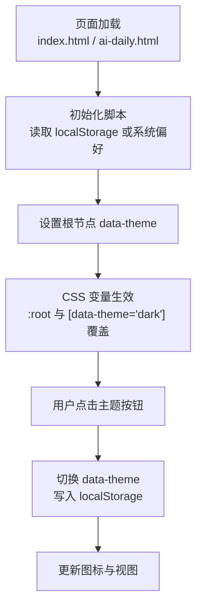
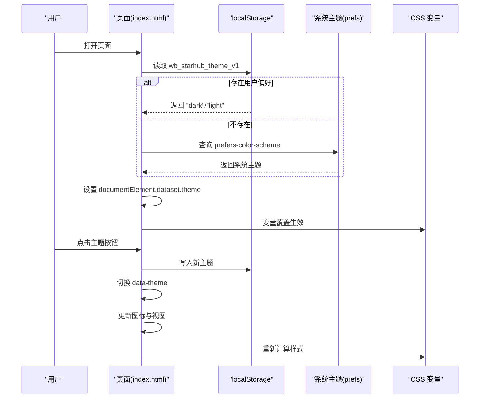
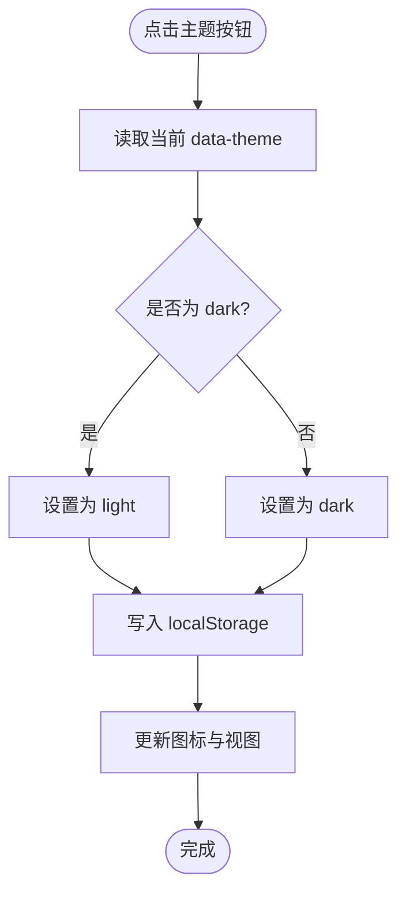
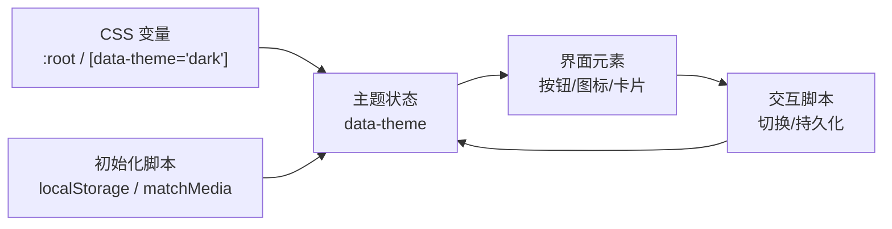

# 主题切换功能

<cite>
**本文引用的文件**
- [index.html](file://index.html)
- [ai-daily.html](file://ai-daily.html)
- [template.html](file://template.html)
- [README.md](file://README.md)
</cite>

## 目录
1. [简介](#简介)
2. [项目结构](#项目结构)
3. [核心组件](#核心组件)
4. [架构总览](#架构总览)
5. [详细组件分析](#详细组件分析)
6. [依赖关系分析](#依赖关系分析)
7. [性能考量](#性能考量)
8. [故障排查指南](#故障排查指南)
9. [结论](#结论)
10. [附录](#附录)

## 简介
本文件围绕“主题切换”能力，系统化说明明暗主题的切换机制、CSS 变量动态更新、主题状态持久化、系统主题自动检测与用户手动设置、切换动画与过渡体验、扩展与自定义方式、对页面性能的影响与优化策略，以及兼容性测试与浏览器支持情况。内容基于仓库中实际实现进行梳理，便于开发者快速理解与扩展。

## 项目结构
本项目为单页应用形态，主题相关逻辑集中在页面 HTML 文件中：
- 样式层：通过 CSS 变量定义明/暗两套配色，使用属性选择器[data-theme="dark"]覆盖默认变量。
- 初始化脚本：在 head 中执行一段内联脚本，优先读取本地存储的主题偏好，否则回退到系统主题偏好，并设置根节点 data-theme。
- 交互脚本：绑定主题切换按钮事件，切换时更新 data-theme、写入本地存储、刷新图标与视图。
- 多页面一致性：AI 日报页面也实现了相同的主题初始化与切换逻辑，保证跨页面一致体验。

图表来源
- [index.html:18-73](file://index.html#L18-L73)
- [index.html:745](file://index.html#L745)
- [index.html:1001-1011](file://index.html#L1001-L1011)
- [index.html:1842-1846](file://index.html#L1842-L1846)
- [ai-daily.html:9-22](file://ai-daily.html#L9-L22)
- [ai-daily.html:142](file://ai-daily.html#L142)
- [ai-daily.html:198-213](file://ai-daily.html#L198-L213)

章节来源
- [index.html:18-73](file://index.html#L18-L73)
- [index.html:745](file://index.html#L745)
- [index.html:1001-1011](file://index.html#L1001-L1011)
- [index.html:1842-1846](file://index.html#L1842-L1846)
- [ai-daily.html:9-22](file://ai-daily.html#L9-L22)
- [ai-daily.html:142](file://ai-daily.html#L142)
- [ai-daily.html:198-213](file://ai-daily.html#L198-L213)

## 核心组件
- CSS 变量与主题覆盖
  - :root 定义浅色主题变量集合；[data-theme="dark"] 覆盖为深色主题变量集合。
  - 关键变量包括背景、卡片、边框、文本、品牌色、阴影、封面背景等，确保明暗模式下的视觉一致性。
- 主题初始化
  - 页面加载时，优先从本地存储读取主题键值，若不存在则查询系统主题偏好（prefers-color-scheme），并将结果写入根节点 data-theme。
- 主题切换交互
  - 点击主题按钮后，切换 data-theme，写入本地存储，更新图标（太阳/月亮）并触发必要的渲染刷新。
- 多页面一致性
  - AI 日报页面同样具备主题初始化与切换逻辑，保持全站一致的体验。

章节来源
- [index.html:18-73](file://index.html#L18-L73)
- [index.html:745](file://index.html#L745)
- [index.html:1001-1011](file://index.html#L1001-L1011)
- [index.html:1842-1846](file://index.html#L1842-L1846)
- [ai-daily.html:9-22](file://ai-daily.html#L9-L22)
- [ai-daily.html:142](file://ai-daily.html#L142)
- [ai-daily.html:198-213](file://ai-daily.html#L198-L213)

## 架构总览
主题切换采用“数据驱动 + 属性选择器”的轻量方案：
- 数据层：localStorage 保存用户主题偏好；系统偏好作为初始回退。
- 表现层：CSS 变量集中管理颜色与阴影，通过 data-theme 切换整体外观。
- 控制层：JS 负责读取/写入偏好、切换 data-theme、更新 UI 图标与必要渲染。

图表来源
- [index.html:745](file://index.html#L745)
- [index.html:1001-1011](file://index.html#L1001-L1011)
- [index.html:1842-1846](file://index.html#L1842-L1846)
- [ai-daily.html:142](file://ai-daily.html#L142)
- [ai-daily.html:198-213](file://ai-daily.html#L198-L213)

## 详细组件分析

### CSS 变量与主题覆盖
- 浅色主题变量定义在 :root，涵盖背景、卡片、边框、文本、品牌色、阴影、字体等。
- 深色主题通过 [data-theme="dark"] 覆盖对应变量，确保对比度与可读性。
- 多处样式针对 [data-theme="dark"] 做了微调，如选中态、头部边框、统计图标颜色、封面图滤镜等。

章节来源
- [index.html:18-73](file://index.html#L18-L73)
- [index.html:88](file://index.html#L88)
- [index.html:98](file://index.html#L98)
- [index.html:209-211](file://index.html#L209-L211)
- [index.html:233](file://index.html#L233)
- [index.html:237](file://index.html#L237)
- [index.html:436](file://index.html#L436)
- [index.html:569](file://index.html#L569)

### 主题初始化与系统主题检测
- 页面加载时执行内联脚本：
  - 优先读取本地存储中的主题键值。
  - 若无记录，则通过 matchMedia('(prefers-color-scheme: dark)') 判断系统主题。
  - 将结果写入根节点 data-theme，使 CSS 变量立即生效。
- 该逻辑同时存在于 index.html 与 ai-daily.html，保证多页面一致性。

章节来源
- [index.html:745](file://index.html#L745)
- [ai-daily.html:142](file://ai-daily.html#L142)

### 主题切换交互与状态持久化
- 点击主题按钮：
  - 切换 data-theme 为 "dark" 或 "light"。
  - 写入本地存储（wb_starhub_theme_v1）。
  - 更新图标（太阳/月亮）并触发必要的渲染刷新（分类与列表重绘）。
- 图标同步：
  - 根据当前 data-theme 显示对应的 SVG 图标，提升可感知性。

图表来源
- [index.html:1842-1846](file://index.html#L1842-L1846)
- [index.html:1001-1011](file://index.html#L1001-L1011)
- [ai-daily.html:198-213](file://ai-daily.html#L198-L213)

章节来源
- [index.html:1842-1846](file://index.html#L1842-L1846)
- [index.html:1001-1011](file://index.html#L1001-L1011)
- [ai-daily.html:198-213](file://ai-daily.html#L198-L213)

### 动画效果与过渡体验
- 全局过渡：
  - 大量元素使用 transition 实现颜色、边框、背景、阴影的平滑变化。
  - 例如按钮、导航链接、卡片悬停、模态框、回到顶部按钮等。
- 减少动效支持：
  - 通过 @media (prefers-reduced-motion: reduce) 禁用不必要的过渡与动画，尊重用户系统设置。
- 封面图与遮罩：
  - 封面图片在暗色模式下降低亮度与饱和度，避免刺眼。
- 模态与提示：
  - 模态框与 Toast 使用淡入淡出与位移过渡，提升反馈感。

章节来源
- [index.html:113-124](file://index.html#L113-L124)
- [index.html:152-162](file://index.html#L152-L162)
- [index.html:328-333](file://index.html#L328-L333)
- [index.html:372-436](file://index.html#L372-L436)
- [index.html:565-577](file://index.html#L565-L577)
- [index.html:667-684](file://index.html#L667-L684)
- [index.html:740-743](file://index.html#L740-L743)

### 自定义选项与扩展机制
- 新增主题变量：
  - 在 :root 与 [data-theme="dark"] 中成对添加变量，并在需要处引用，即可无缝扩展新配色。
- 动态颜色处理：
  - 分类颜色会根据当前主题进行亮度钳制，确保明暗模式下均具备良好可读性。
- 多页面复用：
  - 可在其他页面复制主题初始化与切换逻辑，保持一致体验。
- 图标与文案：
  - 可根据主题切换不同图标或文案，增强可感知性与可用性。

章节来源
- [index.html:18-73](file://index.html#L18-L73)
- [index.html:1141-1160](file://index.html#L1141-L1160)
- [ai-daily.html:9-22](file://ai-daily.html#L9-L22)

### 主题切换对页面性能的影响与优化策略
- 影响点：
  - 切换 data-theme 会触发样式重算与重绘，但仅涉及 CSS 变量与少量 DOM 类名变更，开销较小。
  - 部分页面逻辑会在切换后重绘分类与列表，可能带来额外渲染成本。
- 优化策略：
  - 使用 CSS 变量而非逐元素修改样式，减少重排。
  - 仅在必要时触发渲染刷新（如分类与列表）。
  - 利用 prefers-reduced-motion 尊重用户动效偏好，降低 GPU/CPU 压力。
  - 封面图在暗色模式下调整滤镜，避免过度重绘。
  - 使用 IntersectionObserver 延迟非关键动画，减少首屏负担。

章节来源
- [index.html:740-743](file://index.html#L740-L743)
- [index.html:1842-1846](file://index.html#L1842-L1846)
- [index.html:1975-1984](file://index.html#L1975-L1984)
- [index.html:436](file://index.html#L436)

### 兼容性测试与浏览器支持
- 特性支持：
  - CSS 变量：现代浏览器广泛支持。
  - prefers-color-scheme：主流浏览器支持，用于系统主题检测。
  - localStorage：用于持久化主题偏好。
  - matchMedia：用于监听系统主题变化（可选扩展）。
- 降级策略：
  - 若 localStorage 不可用，初始化脚本已做 try/catch 保护，避免阻断页面。
  - 若系统不支持 prefers-color-scheme，将回退到默认浅色主题。
- 建议测试：
  - 在不同浏览器（Chrome、Firefox、Safari、Edge）及移动端验证主题切换与动画。
  - 验证在禁用 JavaScript 的情况下，页面仍可使用默认主题。
  - 验证在隐私模式或受限存储环境下，主题切换不会报错。

章节来源
- [index.html:745](file://index.html#L745)
- [index.html:1001-1004](file://index.html#L1001-L1004)
- [ai-daily.html:142](file://ai-daily.html#L142)
- [ai-daily.html:198-213](file://ai-daily.html#L198-L213)

## 依赖关系分析
- 样式依赖：
  - 所有颜色与阴影通过 CSS 变量统一管理，主题切换仅改变变量值，避免硬编码颜色。
- 脚本依赖：
  - 初始化脚本依赖 localStorage 与 matchMedia。
  - 交互脚本依赖主题按钮与图标元素的存在。
- 页面间一致性：
  - index.html 与 ai-daily.html 共享相同主题初始化与切换逻辑，确保用户体验一致。

图表来源
- [index.html:18-73](file://index.html#L18-L73)
- [index.html:745](file://index.html#L745)
- [index.html:1001-1011](file://index.html#L1001-L1011)
- [index.html:1842-1846](file://index.html#L1842-L1846)
- [ai-daily.html:9-22](file://ai-daily.html#L9-L22)
- [ai-daily.html:142](file://ai-daily.html#L142)
- [ai-daily.html:198-213](file://ai-daily.html#L198-L213)

章节来源
- [index.html:18-73](file://index.html#L18-L73)
- [index.html:745](file://index.html#L745)
- [index.html:1001-1011](file://index.html#L1001-L1011)
- [index.html:1842-1846](file://index.html#L1842-L1846)
- [ai-daily.html:9-22](file://ai-daily.html#L9-L22)
- [ai-daily.html:142](file://ai-daily.html#L142)
- [ai-daily.html:198-213](file://ai-daily.html#L198-L213)

## 性能考量
- 最小化重排：
  - 通过 CSS 变量与 data-theme 切换，避免逐元素样式修改。
- 按需渲染：
  - 主题切换后仅重绘必要区域（分类与列表）。
- 动效优化：
  - 使用 prefers-reduced-motion 尊重用户偏好，减少不必要动画。
- 资源加载：
  - 封面图错误处理与重试机制，避免阻塞渲染。

章节来源
- [index.html:1842-1846](file://index.html#L1842-L1846)
- [index.html:740-743](file://index.html#L740-L743)
- [index.html:1992-2002](file://index.html#L1992-L2002)

## 故障排查指南
- 主题未生效：
  - 检查根节点是否设置了 data-theme。
  - 确认 CSS 变量是否正确覆盖。
- 本地存储不可用：
  - 检查浏览器隐私模式或第三方 Cookie 限制。
  - 初始化脚本已做异常捕获，确保页面不崩溃。
- 系统主题检测失败：
  - 确认浏览器支持 prefers-color-scheme。
  - 若不支持，将回退到默认浅色主题。
- 图标未更新：
  - 检查主题按钮事件是否绑定成功。
  - 确认图标元素存在且可访问。

章节来源
- [index.html:745](file://index.html#L745)
- [index.html:1001-1011](file://index.html#L1001-L1011)
- [index.html:1842-1846](file://index.html#L1842-L1846)
- [ai-daily.html:142](file://ai-daily.html#L142)
- [ai-daily.html:198-213](file://ai-daily.html#L198-L213)

## 结论
本项目采用简洁高效的“CSS 变量 + data-theme”方案实现主题切换，具备以下优势：
- 易于维护：所有颜色与阴影集中在 CSS 变量中，新增主题只需覆盖变量。
- 用户体验佳：支持系统主题自动检测、用户手动切换、本地持久化与平滑过渡。
- 兼容性好：在现代浏览器上稳定运行，提供合理的降级策略。
- 可扩展性强：可通过新增变量与逻辑轻松扩展更多主题或个性化选项。

## 附录
- 相关文件路径
  - 主页面主题实现：[index.html](file://index.html)
  - AI 日报主题实现：[ai-daily.html](file://ai-daily.html)
  - 模板文件（含主题逻辑）：[template.html](file://template.html)
  - 项目说明：[README.md](file://README.md)

章节来源
- [index.html:18-73](file://index.html#L18-L73)
- [index.html:745](file://index.html#L745)
- [index.html:1001-1011](file://index.html#L1001-L1011)
- [index.html:1842-1846](file://index.html#L1842-L1846)
- [ai-daily.html:9-22](file://ai-daily.html#L9-L22)
- [ai-daily.html:142](file://ai-daily.html#L142)
- [ai-daily.html:198-213](file://ai-daily.html#L198-L213)
- [template.html:1006-1023](file://template.html#L1006-L1023)
- [README.md:1-22](file://README.md#L1-L22)