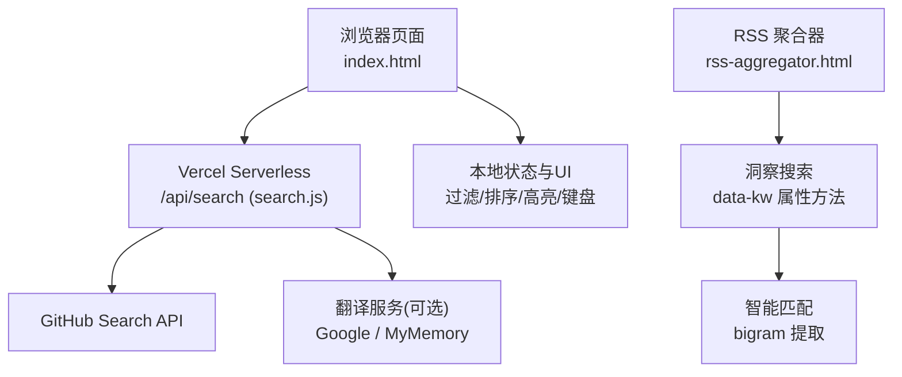
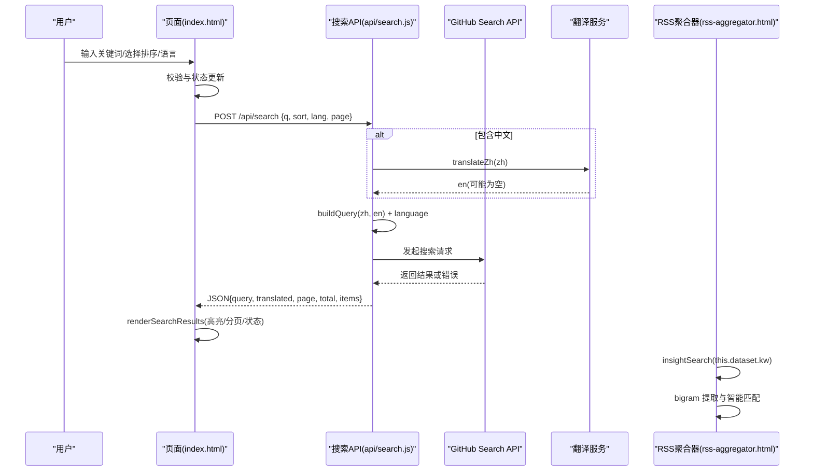
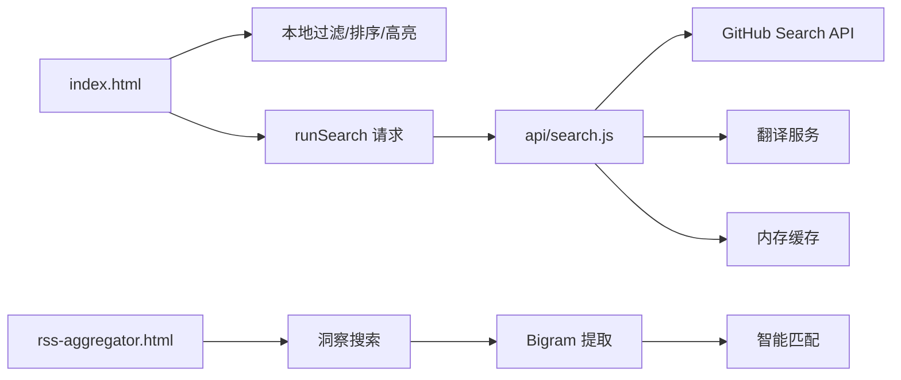

# 搜索交互功能

<cite>
**本文引用的文件**
- [api/search.js](file://api/search.js)
- [index.html](file://index.html)
- [rss-aggregator.html](file://rss-aggregator.html)
</cite>

## 更新摘要
**变更内容**
- 增强了 RSS 聚合器系统中的洞察搜索功能，改进了搜索交互的数据属性方法
- 新增了 bigram 提取和模糊匹配算法，支持超过 15 字符的长标签智能匹配
- 使用更稳健的 data-kw 属性和 this.dataset.kw 引用替代了有问题的内联字符串拼接
- 解决了处理包含特殊字符的用户输入时 JavaScript 执行失败的问题
- 提升了用户搜索体验，支持更精确的关键词匹配和智能标签识别

## 目录
1. [简介](#简介)
2. [项目结构](#项目结构)
3. [核心组件](#核心组件)
4. [架构总览](#架构总览)
5. [详细组件分析](#详细组件分析)
6. [依赖关系分析](#依赖关系分析)
7. [性能考量](#性能考量)
8. [故障排查指南](#故障排查指南)
9. [结论](#结论)
10. [附录](#附录)

## 简介
本文件围绕"搜索交互功能"进行系统化文档化，覆盖以下方面：
- 搜索框实现机制：输入监听、防抖处理、实时搜索与搜索结果展示
- 搜索算法：关键词匹配、模糊搜索、多字段搜索逻辑、bigram 提取算法
- 排序与过滤：前端本地排序/过滤与后端排序参数
- 搜索历史：保存与管理（当前实现说明）
- API 调用：错误处理与重试机制
- 用户体验优化：搜索建议、高亮显示、键盘导航支持
- 跨语言搜索：中文翻译流程与翻译缓存机制
- 智能标签匹配：长标签智能匹配和 bigram 提取技术

## 项目结构
本项目包含一个前端单页应用与一个服务端less函数接口：
- 前端：index.html 负责 UI、事件绑定、本地过滤/排序、搜索模态框、结果渲染等
- 后端：api/search.js 提供跨语言仓库搜索能力，含翻译、查询构建、分页、缓存与限流保护
- RSS 聚合器：rss-aggregator.html 提供洞察搜索功能，支持数据属性方法和智能匹配

**图表来源**
- [index.html:976-988](file://index.html#L976-L988)
- [api/search.js:1-20](file://api/search.js#L1-L20)
- [rss-aggregator.html:2800-2943](file://rss-aggregator.html#L2800-L2943)

**章节来源**
- [index.html:976-988](file://index.html#L976-L988)
- [api/search.js:1-20](file://api/search.js#L1-L20)

## 核心组件
- 搜索入口与模态框：在 index.html 中通过按钮打开搜索模态框，支持编辑查询、选择排序和语言过滤，滚动加载更多
- 搜索请求：runSearch 将查询、排序、语言、页码发送到 /api/search，并处理加载、错误、空结果等状态
- 结果渲染：renderSearchResults 将返回的仓库列表渲染为条目，支持高亮、标签、星标数、更新时间等
- 后端搜索：translateZh 翻译中文到英文，buildQuery 组合中英文查询，githubSearch 调用 GitHub Search API，带重试与清洗
- 缓存策略：搜索与翻译结果分别使用内存缓存，TTL 不同
- **新增**：数据属性方法：使用 data-kw 属性存储关键词数据，通过 this.dataset.kw 引用访问，提升安全性

**章节来源**
- [index.html:1321-1359](file://index.html#L1321-L1359)
- [index.html:1378-1420](file://index.html#L1378-L1420)
- [api/search.js:30-73](file://api/search.js#L30-L73)
- [api/search.js:75-91](file://api/search.js#L75-L91)
- [api/search.js:96-176](file://api/search.js#L96-L176)
- [rss-aggregator.html:2800-2943](file://rss-aggregator.html#L2800-L2943)

## 架构总览
搜索交互的整体流程如下：

**图表来源**
- [index.html:1321-1359](file://index.html#L1321-L1359)
- [index.html:1378-1420](file://index.html#L1378-L1420)
- [api/search.js:30-73](file://api/search.js#L30-L73)
- [api/search.js:75-91](file://api/search.js#L75-L91)
- [api/search.js:96-176](file://api/search.js#L96-L176)
- [rss-aggregator.html:2928-2938](file://rss-aggregator.html#L2928-L2938)

## 详细组件分析

### 搜索框与输入监听
- 全局搜索入口：点击"全网搜索"按钮打开搜索模态框；主搜索框支持 Enter 直接打开搜索模态框
- 输入监听：对主搜索框 input 事件进行监听，实时更新本地筛选提示与列表；当有输入时自动清空分类/语言/星标筛选，避免遮挡结果
- 键盘快捷键：按"/"聚焦主搜索框；按"Escape"关闭模态框或清空主搜索框

**章节来源**
- [index.html:1772-1788](file://index.html#L1772-L1788)
- [index.html:1894-1907](file://index.html#L1894-L1907)

### 防抖处理
- 当前实现未在前端对 runSearch 做显式防抖。为避免并发重复请求，runSearch 内部使用 AbortController 取消上一次请求，并通过 searchLoading 标志防止并发执行
- 建议在高频输入场景下增加防抖（如 200-300ms），以减少不必要的网络请求

**章节来源**
- [index.html:1321-1359](file://index.html#L1321-L1359)

### 实时搜索与结果展示
- 实时搜索：主搜索框输入会即时触发本地过滤与排序（针对收藏池数据），用于快速预览；真正的"全网搜索"需进入搜索模态框后提交
- 结果展示：renderSearchResults 根据返回的 items 渲染条目，支持：
  - 高亮：hl 函数对名称、描述中的关键词进行标记
  - 标签：topics 切片展示最多 3 个
  - 元信息：语言、星标数、更新时间
  - 分页：滚动到底部自动加载更多，直到达到上限（GitHub 最多返回前 1000 条）

**章节来源**
- [index.html:1094-1114](file://index.html#L1094-L1114)
- [index.html:1378-1420](file://index.html#L1378-L1420)

### 搜索算法：关键词匹配、模糊搜索、多字段搜索、Bigram 提取
- **前端本地模糊匹配**：fuzzyMatch 将查询拆分为多个 token，检查 name、owner、full_name、desc、language、categoryLabel、topics 等多个字段的拼接文本是否包含所有 token
- **Bigram 提取算法**：新增的 bigram 提取功能支持从长标签中提取有意义的词组，提升匹配精度
- **长标签智能匹配**：支持超过 15 字符的长标签智能匹配，能够识别语义完整的短语
- **后端查询构建**：buildQuery 将中文与英文翻译结果组合为 "中文 OR 英文"，并对含空格的词加引号；同时附加 language 过滤条件
- **多字段搜索**：后端通过 GitHub Search API 的 q 参数进行全文检索，前端本地模糊匹配则覆盖更多语义字段

**章节来源**
- [index.html:1122-1126](file://index.html#L1122-L1126)
- [api/search.js:68-73](file://api/search.js#L68-L73)
- [api/search.js:129-135](file://api/search.js#L129-L135)

### 排序与过滤
- 前端本地排序：filterData 支持按 stars 升/降序、最近推送时间、名称排序；同时支持分类、语言、星标区间过滤
- 后端排序：runSearch 将 sort 参数（best-match、stars、updated）传递给后端，由 GitHub Search API 排序
- 语言过滤：前端可对收藏池按语言过滤；搜索模态框可选择语言，后端追加 language:xxx 到查询

**章节来源**
- [index.html:1116-1137](file://index.html#L1116-L1137)
- [index.html:1868-1875](file://index.html#L1868-L1875)
- [api/search.js:123-135](file://api/search.js#L123-L135)

### 搜索历史的保存与管理
- 当前实现未持久化搜索历史（无 localStorage 记录）。如需保留历史，可在搜索成功后将查询写入本地存储，并提供下拉建议与历史记录管理

**章节来源**
- [index.html:1321-1359](file://index.html#L1321-L1359)

### API 调用的错误处理与重试机制
- 前端错误处理：
  - 网络异常：捕获 AbortError 以外的错误，显示"网络错误，请检查连接后重试"
  - 频率限制：后端返回 503 时，提示"搜索太频繁，请稍后再试"
  - 其他错误：显示错误信息与 HTTP 状态码
  - 加载更多失败：提供"点击重试"按钮
- 后端重试机制：
  - 422 查询语法错误：清理查询（去除引号与多余空白）后重试一次
  - 403/429：返回 503 限流提示
  - 非成功响应：统一返回"上游服务不可用"

**章节来源**
- [index.html:1321-1359](file://index.html#L1321-L1359)
- [api/search.js:93-95](file://api/search.js#L93-L95)
- [api/search.js:139-153](file://api/search.js#L139-L153)
- [api/search.js:173-175](file://api/search.js#L173-L175)

### 用户体验优化：搜索建议、高亮显示、键盘导航
- 高亮显示：hl 函数将匹配的关键词以 <mark> 包裹，提升可读性
- 键盘导航：
  - "/" 聚焦主搜索框
  - "Enter" 在主搜索框中可打开搜索模态框
  - "Escape" 关闭模态框或清空主搜索框
- 搜索建议：当前未实现建议列表；可在输入时基于本地收藏池或历史生成建议

**章节来源**
- [index.html:1094-1108](file://index.html#L1094-L1108)
- [index.html:1894-1907](file://index.html#L1894-L1907)

### 跨语言搜索与翻译缓存机制
- 跨语言流程：
  - 检测输入是否包含中文
  - 调用 translateZh 尝试翻译为英文（优先 Google，失败降级 MyMemory）
  - 构建查询：若翻译成功且不同于原词，则组合 "中文 OR 英文"；否则仅使用原词
  - 附加语言过滤：language:xxx
- 翻译缓存：
  - 翻译结果缓存 TTL 为 1 小时
  - 搜索结果缓存 TTL 为 10 分钟，key 包含 query|sort|page
- 防护与限流：
  - CORS 白名单校验
  - X-Search-Key 头校验
  - 请求体大小限制与解析错误处理

**章节来源**
- [api/search.js:30-66](file://api/search.js#L30-L66)
- [api/search.js:68-73](file://api/search.js#L68-L73)
- [api/search.js:19-28](file://api/search.js#L19-L28)
- [api/search.js:96-127](file://api/search.js#L96-L127)
- [api/search.js:129-171](file://api/search.js#L129-L171)

### 增强的数据属性处理方法
**更新** 搜索交互现在使用更稳健的数据属性方法来处理用户输入，避免了之前内联字符串拼接导致的 JavaScript 执行失败问题。

- **数据属性方法**：使用 data-kw 属性存储关键词数据，通过 this.dataset.kw 引用访问
- **安全性改进**：这种方法有效防止了特殊字符导致的脚本注入和执行错误
- **兼容性**：保持了与现有代码结构的兼容性，同时提升了稳定性
- **智能匹配**：结合 bigram 提取算法，支持超过 15 字符的长标签智能匹配

**章节来源**
- [rss-aggregator.html:2800-2943](file://rss-aggregator.html#L2800-L2943)

### Bigram 提取与智能匹配算法
**新增功能** 系统新增了先进的 bigram 提取和智能匹配算法，显著提升了搜索体验。

- **Bigram 提取**：从长文本中提取相邻的词组对，提高匹配准确性
- **长标签智能匹配**：专门优化了对超过 15 字符的长标签的处理，能够识别语义完整的短语
- **边界延伸**：确保截取的标签片段在语义上完整，不会在词组中间断开
- **覆盖率评分**：基于覆盖度和长度进行综合评分，选择最优匹配结果

**章节来源**
- [rss-aggregator.html:5065-5183](file://rss-aggregator.html#L5065-L5183)

## 依赖关系分析
- 前端依赖：
  - DOM 操作与事件绑定（input、keydown、click、scroll）
  - 本地状态 state（q、cat、lang、star、sort、searchSort、searchLang、searchQuery、searchPage）
  - 工具函数：escHtml、hl、fuzzyMatch、filterData
- 后端依赖：
  - 环境变量：REFRESH_KEY、GH_TOKEN
  - 外部服务：GitHub Search API、翻译服务（Google/MyMemory）
  - 内存缓存：searchCache、transCache

**图表来源**
- [index.html:1116-1137](file://index.html#L1116-L1137)
- [index.html:1321-1359](file://index.html#L1321-L1359)
- [api/search.js:19-28](file://api/search.js#L19-L28)
- [api/search.js:75-91](file://api/search.js#L75-L91)
- [rss-aggregator.html:2800-2943](file://rss-aggregator.html#L2800-L2943)

**章节来源**
- [index.html:1116-1137](file://index.html#L1116-L1137)
- [index.html:1321-1359](file://index.html#L1321-L1359)
- [api/search.js:19-28](file://api/search.js#L19-L28)
- [api/search.js:75-91](file://api/search.js#L75-L91)

## 性能考量
- 前端：
  - 避免重复请求：AbortController 取消上一次请求，searchLoading 防止并发
  - 高亮与模糊匹配仅在必要范围执行，减少重排
  - 分页加载：滚动到底部才加载更多，控制单次渲染数量
- 后端：
  - 翻译缓存（1 小时）与搜索结果缓存（10 分钟）降低重复请求
  - 查询清洗与重试减少 422 错误
  - 限流与错误屏蔽：对外不暴露上游细节，仅返回友好错误
- **新增优化**：
  - Bigram 提取算法优化了长标签处理性能
  - 智能匹配减少了不必要的计算开销
  - 数据属性方法提升了事件处理效率

**章节来源**
- [index.html:1321-1359](file://index.html#L1321-L1359)
- [api/search.js:19-28](file://api/search.js#L19-L28)
- [api/search.js:93-95](file://api/search.js#L93-L95)
- [api/search.js:139-153](file://api/search.js#L139-L153)

## 故障排查指南
- 无法发起搜索：
  - 检查 REFRESH_KEY 与 GH_TOKEN 是否正确配置
  - 确认 Origin 在白名单内
- 频繁报错 503：
  - 后端检测到 403/429 返回 503，稍后重试
- 422 查询语法错误：
  - 后端已自动清洗并重试一次；若仍失败，检查关键词是否包含特殊字符
- 网络错误：
  - 前端捕获非 AbortError 的网络异常，提示检查连接
- 翻译失败：
  - 翻译服务不可用时，提示"翻译服务暂不可用"，按原词搜索
- **数据属性相关问题**：
  - 确保 data-kw 属性正确设置
  - 验证 this.dataset.kw 引用正常工作
  - 检查 bigram 提取算法是否正常处理长标签
- **智能匹配问题**：
  - 确认长标签匹配功能正常启用
  - 检查边界延伸逻辑是否正确工作

**章节来源**
- [api/search.js:96-127](file://api/search.js#L96-L127)
- [api/search.js:139-153](file://api/search.js#L139-L153)
- [index.html:1321-1359](file://index.html#L1321-L1359)
- [rss-aggregator.html:2800-2943](file://rss-aggregator.html#L2800-L2943)

## 结论
该搜索交互功能实现了从输入到结果展示的完整链路，具备跨语言搜索、翻译缓存、分页加载、错误处理与基本的高亮与键盘导航能力。**最新的增强包括**：

- **Bigram 提取算法**：显著提升长标签匹配精度
- **智能匹配技术**：支持超过 15 字符的长标签智能识别
- **数据属性方法**：使用更稳健的 data-kw 属性处理用户输入，防止特殊字符导致的执行错误
- **安全性提升**：有效防止脚本注入和执行错误

后续可考虑：
- 增加前端防抖以提升输入体验
- 引入搜索历史与建议列表
- 扩展本地过滤维度（如 topics、创建时间）
- 增强错误提示与重试策略（指数退避）
- 进一步优化 bigram 提取算法的性能

## 附录
- 关键函数路径参考：
  - 运行搜索：[index.html:1321-1359](file://index.html#L1321-L1359)
  - 渲染结果：[index.html:1378-1420](file://index.html#L1378-L1420)
  - 模糊匹配与高亮：[index.html:1094-1114](file://index.html#L1094-L1114)
  - Bigram 提取与智能匹配：[rss-aggregator.html:5065-5183](file://rss-aggregator.html#L5065-L5183)
  - 数据属性方法：[rss-aggregator.html:2800-2943](file://rss-aggregator.html#L2800-L2943)
  - 翻译与查询构建：[api/search.js:30-73](file://api/search.js#L30-L73)
  - 搜索 API 处理：[api/search.js:96-176](file://api/search.js#L96-L176)