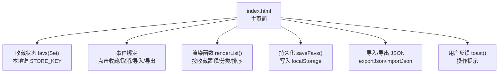
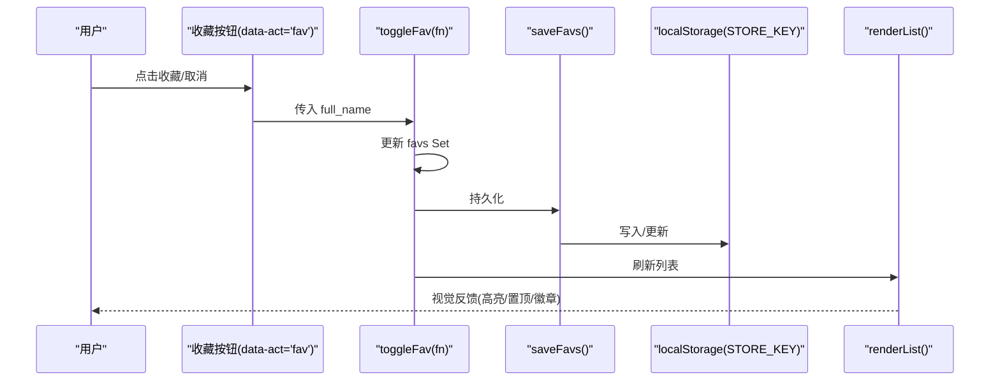
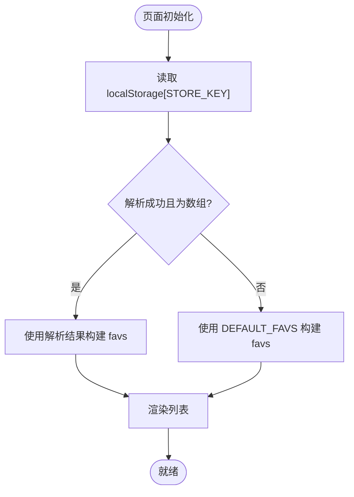
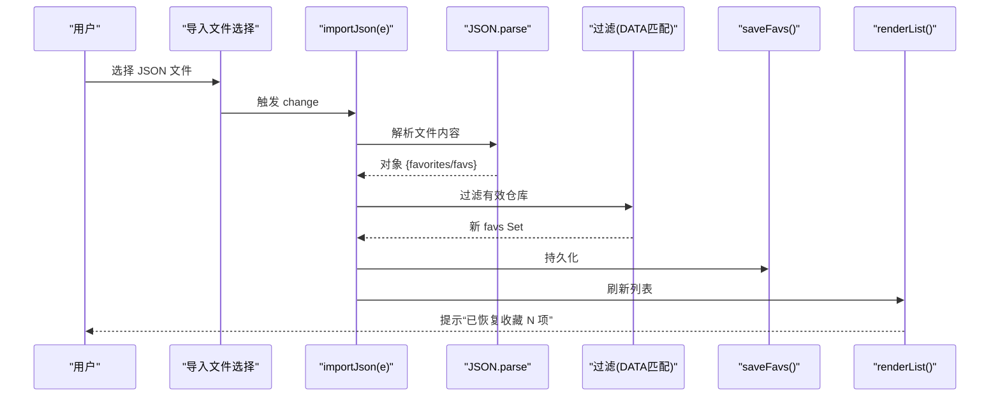
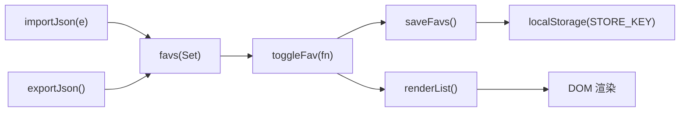

# 收藏管理功能

<cite>
**本文引用的文件**
- [index.html](file://index.html)
- [template.html](file://template.html)
</cite>

## 目录
1. [简介](#简介)
2. [项目结构](#项目结构)
3. [核心组件](#核心组件)
4. [架构总览](#架构总览)
5. [详细组件分析](#详细组件分析)
6. [依赖关系分析](#依赖关系分析)
7. [性能考量](#性能考量)
8. [故障排查指南](#故障排查指南)
9. [结论](#结论)
10. [附录](#附录)

## 简介
本文件为“收藏管理”功能的完整技术文档，覆盖以下方面：
- 收藏状态的本地存储机制与数据持久化策略（localStorage）
- 收藏操作实现：添加、取消、批量导入/导出
- 多标签页数据一致性说明与限制
- 用户反馈：视觉提示与操作确认（Toast）
- 收藏数据的导入/导出（JSON 备份与恢复）
- 收藏分类与排序在列表中的体现

## 项目结构
本项目为单页应用，收藏相关逻辑集中在两个 HTML 文件中：
- index.html：生产页面，包含完整的样式、脚本与交互逻辑
- template.html：模板页面，结构与逻辑与 index.html 基本一致

收藏管理的核心代码分布在上述文件的脚本区域中，包括状态初始化、事件绑定、渲染与持久化。

图表来源
- [index.html:970-1032](file://index.html#L970-L1032)
- [index.html:1134-1229](file://index.html#L1134-L1229)
- [index.html:1806-1816](file://index.html#L1806-L1816)
- [index.html:1910-1953](file://index.html#L1910-L1953)

章节来源
- [index.html:970-1032](file://index.html#L970-L1032)
- [index.html:1806-1816](file://index.html#L1806-L1816)
- [index.html:1910-1953](file://index.html#L1910-L1953)

## 核心组件
- 收藏状态容器：favs（Set），用于快速判断某仓库是否已收藏
- 本地存储键：STORE_KEY = 'wb_starhub_favs_v1'
- 持久化方法：saveFavs() 将 favs 序列化为数组并写入 localStorage
- 加载策略：启动时从 localStorage 读取，若非法则回退到默认值 DEFAULT_FAVS
- 交互入口：卡片或行项上的收藏按钮触发 toggleFav(fn)
- 列表渲染：renderList() 根据收藏状态进行置顶、高亮与样式切换
- 导入/导出：exportJson() 生成 JSON 文件；importJson(e) 解析并恢复收藏
- 用户反馈：toast(msg) 显示操作结果提示

章节来源
- [index.html:970-1032](file://index.html#L970-L1032)
- [index.html:1134-1229](file://index.html#L1134-L1229)
- [index.html:1910-1953](file://index.html#L1910-L1953)

## 架构总览
收藏管理采用“内存状态 + 本地持久化 + 视图渲染”的简单架构：
- 内存层：favs Set 作为唯一真实来源
- 持久化层：每次变更调用 saveFavs() 写入 localStorage
- 视图层：任何状态变更后调用 renderList() 刷新界面
- 导入/导出：通过 JSON 文件在浏览器端完成，不依赖后端

图表来源
- [index.html:1806-1816](file://index.html#L1806-L1816)
- [index.html:1910-1920](file://index.html#L1910-L1920)
- [index.html:1918-1920](file://index.html#L1918-L1920)
- [index.html:1229-1412](file://index.html#L1229-L1412)

## 详细组件分析

### 本地存储机制与数据持久化
- 存储键：STORE_KEY = 'wb_starhub_favs_v1'
- 数据结构：favs 为 Set<string>，元素为仓库全名（owner/repo）
- 初始化：
  - 尝试从 localStorage 读取并解析为数组
  - 仅当类型为数组时才使用，否则回退到 DEFAULT_FAVS
  - 异常捕获确保脏数据不会污染收藏集合并被写回
- 持久化：
  - 每次收藏/取消后调用 saveFavs()
  - 将 favs 转为数组并以 JSON 字符串形式写入 localStorage
  - 写入失败静默忽略，避免影响主流程

图表来源
- [index.html:970-1032](file://index.html#L970-L1032)

章节来源
- [index.html:970-1032](file://index.html#L970-L1032)

### 收藏操作：添加、取消与批量处理
- 添加/取消：
  - 通过 data-act="fav" 的事件委托统一处理
  - 提取 owner/name 拼接为 full_name
  - toggleFav(fn) 在 favs 中添加或删除，并立即持久化与渲染
- 批量操作：
  - 导入：importJson(e) 支持 JSON 文件，兼容 favorites 或 favs 字段
  - 过滤：仅保留当前 DATA 中存在的仓库，避免无效条目
  - 导出：exportJson() 生成标准 JSON 备份文件，包含类型、用户、时间戳与收藏列表

图表来源
- [index.html:1938-1953](file://index.html#L1938-L1953)
- [index.html:1910-1920](file://index.html#L1910-L1920)
- [index.html:1229-1412](file://index.html#L1229-L1412)

章节来源
- [index.html:1806-1816](file://index.html#L1806-L1816)
- [index.html:1910-1953](file://index.html#L1910-L1953)

### 多标签页数据一致性
- 当前实现未监听 storage 事件，因此多标签页之间不会自动同步
- 每个标签页维护独立的内存 favs，仅在自身页面内持久化
- 如需跨标签页同步，可在后续版本增加 onstorage 监听以合并变更

章节来源
- [index.html:1910-1953](file://index.html#L1910-L1953)

### 用户反馈：视觉提示与操作确认
- Toast 提示：
  - 收藏：显示“已收藏并置顶”
  - 取消收藏：显示“已取消收藏”
  - 导入成功：显示“已恢复收藏 N 项”
  - 导入失败：显示“导入失败：文件格式不正确”
  - 导出成功：显示“已导出备份（收藏 N 项）”
- 视觉反馈：
  - 收藏项在列表中置顶显示
  - 收藏项边框与背景高亮
  - 搜索结果的已收藏项显示“✓ 已收藏”徽章

章节来源
- [index.html:1134-1229](file://index.html#L1134-L1229)
- [index.html:1396-1412](file://index.html#L1396-L1412)
- [index.html:1910-1960](file://index.html#L1910-L1960)

### 导入/导出功能（JSON 备份与恢复）
- 导出：
  - 构造 payload 包含 type、user、exportedAt、favorites
  - 使用 Blob 创建下载链接，文件名含日期
  - 完成后释放 URL 对象
- 导入：
  - 读取文件文本，解析 JSON
  - 兼容 favorites 或 favs 字段
  - 仅保留当前 DATA 中存在的仓库
  - 恢复后持久化并刷新列表

章节来源
- [index.html:1922-1953](file://index.html#L1922-L1953)

### 收藏分类与排序
- 分类：
  - 通过 state.cat 控制当前筛选的分类
  - 点击分类标签切换 state.cat，并重新渲染列表
- 排序：
  - 支持按 stars 等维度排序（state.sort）
  - 收藏项优先置顶，再按排序规则排列
- 列表渲染：
  - 先分离收藏与非收藏集合
  - 对收藏集合置顶展示
  - 结合分类与排序规则渲染最终列表

章节来源
- [index.html:1067-1075](file://index.html#L1067-L1075)
- [index.html:1134-1229](file://index.html#L1134-L1229)
- [index.html:1798-1816](file://index.html#L1798-L1816)

## 依赖关系分析
- 模块耦合：
  - toggleFav 依赖 favs 状态与 saveFavs、renderList
  - importJson/exportJson 依赖全局 DATA 与 favs
  - 事件委托统一收集 data-act 动作，降低耦合
- 外部依赖：
  - 无后端依赖，所有逻辑在前端完成
  - 依赖浏览器 localStorage API
  - 依赖 DOM API（FileReader、Blob、URL.createObjectURL）

图表来源
- [index.html:1910-1953](file://index.html#L1910-L1953)
- [index.html:1229-1412](file://index.html#L1229-L1412)

章节来源
- [index.html:1910-1953](file://index.html#L1910-L1953)
- [index.html:1229-1412](file://index.html#L1229-L1412)

## 性能考量
- 使用 Set 存储收藏项，查找与去重复杂度接近 O(1)
- 列表渲染前分离收藏与非收藏集合，减少重复计算
- 导入时过滤无效仓库，避免无用数据进入 favs
- 导出使用 Blob 与 URL.createObjectURL，避免大字符串直接操作 DOM
- 建议：
  - 大数据量时可考虑分页或虚拟滚动优化渲染
  - 可引入防抖/节流减少频繁渲染
  - 多标签页同步可通过 storage 事件实现增量合并

## 故障排查指南
- 导入失败：
  - 检查 JSON 格式是否正确
  - 确认包含 favorites 或 favs 字段且为数组
  - 查看 toast 提示“导入失败：文件格式不正确”
- 收藏未生效：
  - 检查浏览器是否禁用 localStorage
  - 查看控制台是否有写入异常
  - 确认 favs 已更新并调用了 renderList
- 多标签页不同步：
  - 当前实现不支持跨标签页同步
  - 需新增 storage 事件监听以实现实时同步

章节来源
- [index.html:1938-1953](file://index.html#L1938-L1953)
- [index.html:1918-1920](file://index.html#L1918-L1920)

## 结论
收藏管理功能以简洁的前端架构实现了完整的收藏生命周期：
- 本地持久化：基于 localStorage 的安全读写与容错
- 操作闭环：添加/取消/导入/导出均具备即时反馈
- 可视化体验：收藏项置顶、高亮与徽章提示
- 可扩展性：为后续多标签页同步、分类扩展预留空间

## 附录
- 关键常量与变量
  - STORE_KEY: 'wb_starhub_favs_v1'
  - favs: Set<string>，收藏仓库全名集合
  - DEFAULT_FAVS: 默认收藏集合（初始化回退用）
- 关键函数
  - toggleFav(fn): 切换收藏状态
  - saveFavs(): 持久化收藏到 localStorage
  - exportJson(): 导出 JSON 备份
  - importJson(e): 导入 JSON 恢复收藏
  - renderList(): 渲染列表（含收藏置顶、分类、排序）
  - toast(msg): 显示操作提示

章节来源
- [index.html:970-1032](file://index.html#L970-L1032)
- [index.html:1910-1960](file://index.html#L1910-L1960)