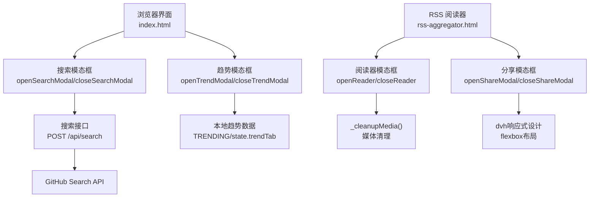
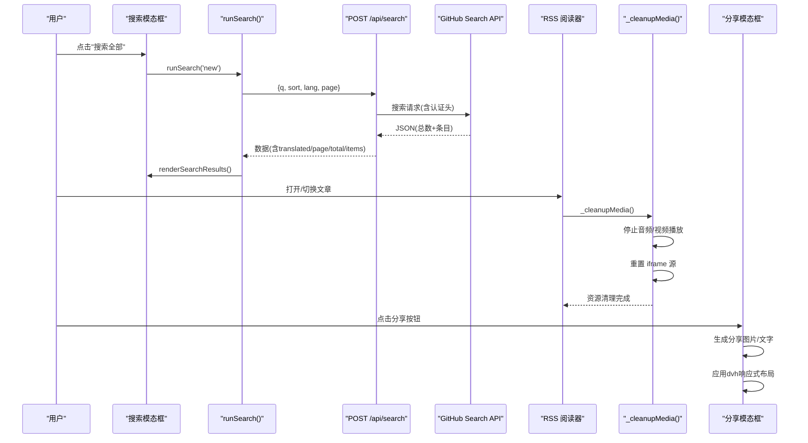
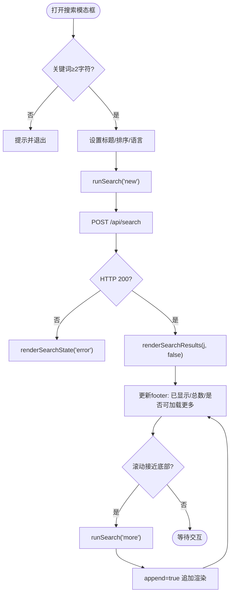
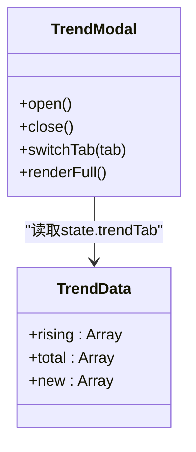
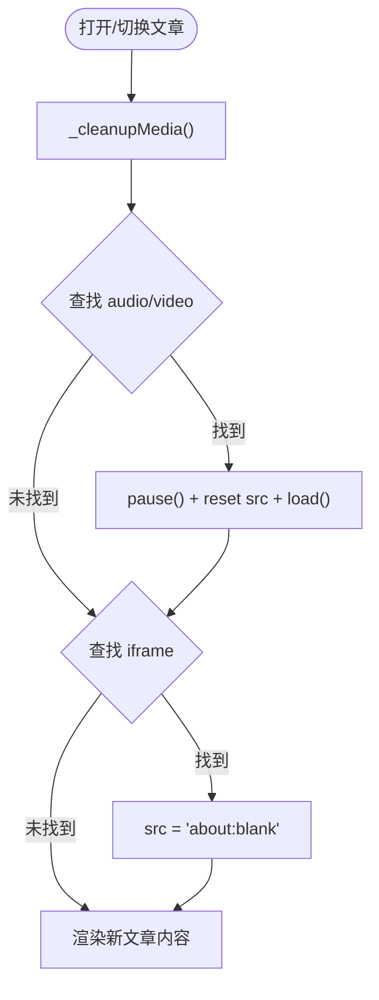
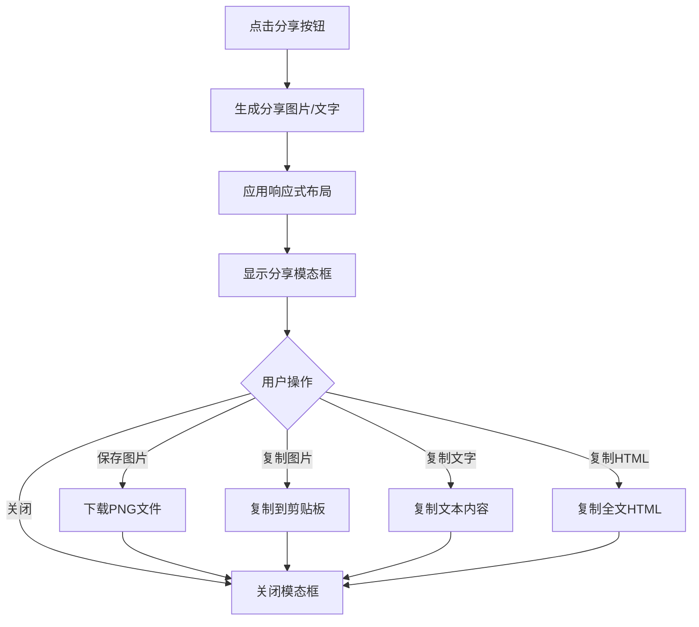
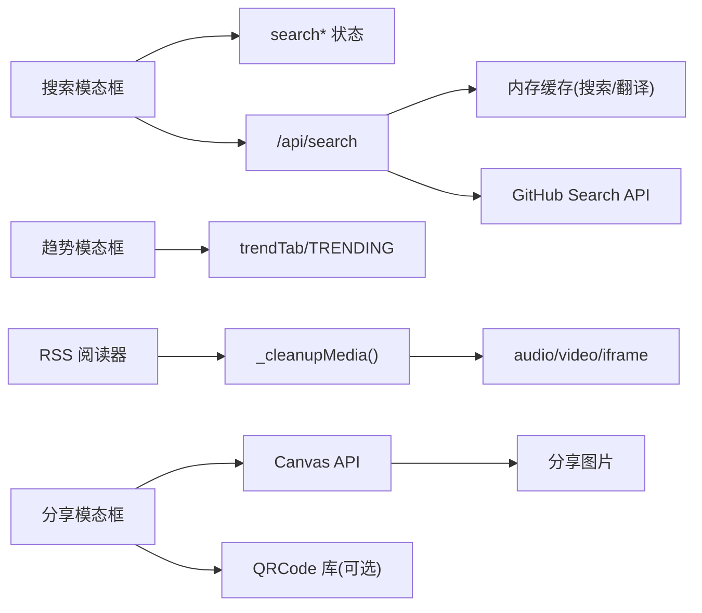

# 模态框交互

<cite>
**本文引用的文件**
- [index.html](file://index.html)
- [rss-aggregator.html](file://rss-aggregator.html)
- [api/search.js](file://api/search.js)
- [api/events.js](file://api/events.js)
</cite>

## 更新摘要
**变更内容**
- 分享模态框功能显著改进，使用现代视口单位(dvh)实现响应式设计
- 采用flexbox列布局配合高度约束(max-height: calc(100vh - 32px))，支持长图片和文本内容的内部滚动
- 保持头部、提示和操作按钮始终可见，提升用户体验
- 增强了RSS阅读器模态框的自动媒体清理功能
- 更新了文章切换和关闭时的资源管理

## 目录
1. [简介](#简介)
2. [项目结构](#项目结构)
3. [核心组件](#核心组件)
4. [架构总览](#架构总览)
5. [详细组件分析](#详细组件分析)
6. [依赖关系分析](#依赖关系分析)
7. [性能考量](#性能考量)
8. [故障排查指南](#故障排查指南)
9. [结论](#结论)

## 简介
本文件围绕"搜索模态框"、"趋势模态框"、"RSS 阅读器模态框"和"分享模态框"的交互实现进行系统化文档说明，覆盖打开/关闭机制、事件监听与状态管理、查询构建与结果展示、分页加载、排行榜数据展示与筛选、键盘导航（ESC 关闭、Tab 焦点管理）、响应式设计与移动端适配，以及内容懒加载与内存管理等性能优化点。**最新更新**：分享模态框现已采用现代化的dvh视口单位和flexbox布局，提供更好的移动端体验和长内容支持；RSS 阅读器模态框集成自动媒体清理功能，在关闭或切换文章时自动停止播放并释放媒体资源。

## 项目结构
- 前端主页面 index.html：包含样式、HTML 结构与全部交互逻辑（模态框开关、搜索与趋势渲染、键盘事件等）。
- RSS 聚合器 rss-aggregator.html：提供完整的 RSS 阅读器功能和改进的分享模态框，包括新的媒体清理机制和响应式设计。
- 后端接口 api/search.js：提供跨语言仓库搜索能力，支持中文翻译、查询构建、分页与缓存。
- 后端接口 api/events.js：聚合关注账号近 24 小时动态，供侧边栏 Feed 使用（与模态框无直接耦合，但为整体体验服务）。

**图表来源**
- [index.html:1301-1319](file://index.html#L1301-L1319)
- [index.html:1531-1537](file://index.html#L1531-L1537)
- [rss-aggregator.html:335-356](file://rss-aggregator.html#L335-L356)
- [rss-aggregator.html:985-992](file://rss-aggregator.html#L985-L992)
- [api/search.js:96-176](file://api/search.js#L96-L176)

章节来源
- [index.html:1-120](file://index.html#L1-L120)
- [rss-aggregator.html:1-100](file://rss-aggregator.html#L1-L100)
- [api/search.js:1-20](file://api/search.js#L1-L20)

## 核心组件
- 搜索模态框
  - 打开：校验关键词长度，设置标题与排序标签，初始化语言下拉，触发首次搜索。
  - 关闭：移除 open 类，中止正在进行的请求。
  - 查询构建：调用后端接口，支持 sort（best-match/stars/updated）与 lang 过滤；支持无限滚动加载更多。
  - 结果展示：显示查询词、翻译提示、列表项（名称、描述、语言、星标、更新时间、话题标签），底部显示已加载条数与是否还有更多。
  - 错误处理：网络错误、频率限制、上游不可用等状态提示与重试。
- 趋势模态框
  - 打开：同步当前趋势标签页并渲染完整榜单（最多 20 条）。
  - 关闭：移除 open 类。
  - 功能：按 rising/total/new 切换，展示涨星差值、语言、星标、原因等。
- **新增** RSS 阅读器模态框
  - 打开：渲染文章内容，支持 YouTube 视频嵌入和音频播放器。
  - 关闭：**自动调用 _cleanupMedia() 停止所有媒体播放并释放资源**。
  - 文章切换：**每次切换文章前自动清理上一篇文章的媒体资源**。
  - 媒体支持：YouTube iframe 嵌入、音频/视频播放器、iframe 清理。
- **新增** 分享模态框
  - 打开：生成分享图片，支持图片保存、复制和文字模式。
  - 关闭：移除 open 类，恢复焦点。
  - **响应式设计**：使用 dvh 视口单位和 flexbox 布局，支持长内容内部滚动。
  - **功能特性**：图片预览、文字卡片、二维码生成、全文 HTML 复制。
- 键盘导航
  - ESC：优先关闭趋势模态框，其次关闭搜索模态框；若焦点在首页搜索框则清空搜索并失焦。
  - Tab：未实现焦点陷阱，点击遮罩或带 data-close 的元素可关闭模态框。
- 响应式与移动端
  - 通过媒体查询调整布局、卡片尺寸、搜索区排列等，保证小屏可用。
  - **分享模态框**：使用 dvh 单位确保在不同设备上正确显示，flexbox 布局支持内容自适应。
- 性能优化
  - 搜索请求 AbortController 取消重复并发；分页基于 per_page=30 与 total_count 判断是否有下一页；翻译结果与搜索结果内存缓存；图片失败降级与延迟重试；IntersectionObserver 仅对统计数字执行一次动画。
  - **新增**：媒体资源自动清理，防止音频/视频资源泄漏；分享模态框优化了图片生成和渲染性能。

章节来源
- [index.html:1301-1442](file://index.html#L1301-L1442)
- [index.html:1444-1537](file://index.html#L1444-L1537)
- [rss-aggregator.html:335-356](file://rss-aggregator.html#L335-L356)
- [rss-aggregator.html:985-992](file://rss-aggregator.html#L985-L992)
- [rss-aggregator.html:1099-1100](file://rss-aggregator.html#L1099-L1100)
- [index.html:1890-1907](file://index.html#L1890-L1907)
- [index.html:687-743](file://index.html#L687-L743)
- [index.html:1962-2008](file://index.html#L1962-L2008)
- [api/search.js:18-28](file://api/search.js#L18-L28)

## 架构总览
搜索模态框与后端搜索接口协作完成"中文输入 → 翻译 → 组合查询 → GitHub 搜索 → 分页返回"的链路；趋势模态框基于本地数据渲染，无需额外请求；**RSS 阅读器模态框集成了智能媒体清理机制，确保文章切换和关闭时不会遗留媒体资源**；**分享模态框采用现代化响应式设计，提供更好的移动端体验**。

**图表来源**
- [index.html:1321-1420](file://index.html#L1321-L1420)
- [rss-aggregator.html:335-356](file://rss-aggregator.html#L335-L356)
- [rss-aggregator.html:985-992](file://rss-aggregator.html#L985-L992)
- [rss-aggregator.html:1099-1100](file://rss-aggregator.html#L1099-L1100)
- [api/search.js:75-91](file://api/search.js#L75-L91)
- [api/search.js:129-172](file://api/search.js#L129-L172)

## 详细组件分析

### 搜索模态框
- 打开与关闭
  - 打开：校验关键词长度，设置标题与排序高亮，初始化语言选项，立即显示原词占位，触发首次搜索。
  - 关闭：移除 open 类，中止正在进行的请求，避免后台继续消耗资源。
- 查询构建与请求
  - 前端发送 q、sort、lang、page；后端根据是否含中文调用翻译服务，构建"中文 OR 英文"查询，附加 language 过滤，调用 GitHub Search API。
  - 支持 per_page=30，page 上限 34（对应 GitHub 前 1000 条限制）。
- 结果展示与分页
  - 首屏渲染列表项，底部 footer 显示"已显示 X / 共 Y 条 · 滚动加载更多"。
  - 监听列表滚动，接近底部时自动加载下一页；当 items.length < per_page 或达到上限时停止。
- 错误处理与重试
  - 网络异常、上游不可用、频率限制等均有友好提示；提供"重试"按钮与"加载更多失败"重试入口。
- 编辑查询词
  - 支持在模态框内编辑查询词，Enter 确认，Escape 取消；变更后重新发起搜索。

**图表来源**
- [index.html:1301-1319](file://index.html#L1301-L1319)
- [index.html:1321-1420](file://index.html#L1321-L1420)
- [api/search.js:96-176](file://api/search.js#L96-L176)

章节来源
- [index.html:1301-1442](file://index.html#L1301-L1442)
- [api/search.js:1-177](file://api/search.js#L1-L177)

### 趋势模态框
- 打开与关闭
  - 打开：同步当前趋势标签页状态，渲染完整榜单（最多 20 条）。
  - 关闭：移除 open 类。
- 排行榜展示与筛选
  - 支持 rising/total/new 三种视图；rising 显示涨星差值 delta，total/new 显示不同语义的原因文案。
  - 列表项包含排名、仓库名、语言、星标、更新时间、原因等。
- 键盘与交互
  - 支持 ESC 关闭；点击遮罩或带 data-close 的元素关闭。

**图表来源**
- [index.html:1444-1537](file://index.html#L1444-L1537)

章节来源
- [index.html:1444-1537](file://index.html#L1444-L1537)

### **新增** RSS 阅读器模态框与媒体清理
- 打开与关闭
  - 打开：渲染文章内容，支持 YouTube 视频嵌入和音频播放器。
  - 关闭：**自动调用 _cleanupMedia() 停止所有媒体播放并释放资源**。
- **媒体清理机制**
  - **_cleanupMedia() 函数**：在关闭阅读器或切换文章时自动执行。
  - **音频/视频处理**：暂停所有 audio/video 元素，重置 src 属性，调用 load() 方法释放资源。
  - **iframe 清理**：将所有 iframe 的 src 设置为 'about:blank'，阻止外部资源继续加载。
  - **错误处理**：使用 try-catch 包裹每个清理操作，确保单个元素清理失败不影响其他元素。
- 文章切换流程
  - **renderReader() 函数**：在渲染新文章前先调用 _cleanupMedia()。
  - **openReader() 函数**：打开新文章时确保媒体资源已清理。
  - **_navReader() 函数**：导航到上一篇/下一篇时自动清理媒体。
- 媒体支持
  - YouTube iframe 嵌入：自动检测 YouTube 链接并嵌入播放器。
  - 音频/视频播放器：支持播客音频和视频内容，带有错误处理和回退机制。
  - 懒加载：媒体元素使用 preload='none' 避免预加载。

**图表来源**
- [rss-aggregator.html:985-992](file://rss-aggregator.html#L985-L992)
- [rss-aggregator.html:1099-1100](file://rss-aggregator.html#L1099-L1100)

章节来源
- [rss-aggregator.html:985-992](file://rss-aggregator.html#L985-L992)
- [rss-aggregator.html:1099-1100](file://rss-aggregator.html#L1099-L1100)
- [rss-aggregator.html:1233](file://rss-aggregator.html#L1233)

### **新增** 分享模态框与响应式设计
- **现代化响应式设计**
  - **dvh 视口单位**：使用 `max-height: calc(100dvh - 32px)` 确保在不同设备上正确适配，特别是移动设备的动态视口。
  - **flexbox 列布局**：采用 `display: flex; flex-direction: column` 实现垂直布局，支持内容自适应。
  - **内部滚动机制**：图片区域和文字卡片支持独立滚动，而头部、提示和操作按钮始终保持可见。
- **打开与关闭**
  - 打开：生成分享图片，支持图片保存、复制和文字模式；自动聚焦关闭按钮。
  - 关闭：移除 open 类，恢复之前的焦点元素。
- **功能特性**
  - **图片分享**：Canvas 生成的分享图片，支持二维码、品牌色主题。
  - **文字模式**：当 Canvas 不可用时，自动降级为纯文本卡片。
  - **多种操作**：保存图片、复制图片、复制文字、复制全文 HTML。
  - **用户体验**：长按图片保存、Toast 提示反馈、无障碍支持。
- **技术实现**
  - **响应式容器**：`.share-panel` 使用 `width: min(400px, 90vw)` 确保在小屏幕上正确显示。
  - **滚动优化**：图片区域使用 `-webkit-overflow-scrolling: touch` 提供流畅的触摸滚动体验。
  - **兼容性处理**：同时使用 vh 和 dvh 单位，确保旧浏览器兼容性。

**图表来源**
- [rss-aggregator.html:335-356](file://rss-aggregator.html#L335-L356)
- [rss-aggregator.html:553-567](file://rss-aggregator.html#L553-L567)
- [rss-aggregator.html:1912-1962](file://rss-aggregator.html#L1912-L1962)

章节来源
- [rss-aggregator.html:335-356](file://rss-aggregator.html#L335-L356)
- [rss-aggregator.html:553-567](file://rss-aggregator.html#L553-L567)
- [rss-aggregator.html:1912-1962](file://rss-aggregator.html#L1912-L1962)

### 键盘导航与焦点管理
- ESC 键
  - 优先级：先关闭趋势模态框，再关闭搜索模态框；若焦点在首页搜索框则清空搜索并失焦。
- Tab 键
  - 未实现焦点陷阱；可通过点击遮罩或带 data-close 的元素关闭模态框。
- 快捷键
  - 全局 "/" 聚焦到首页搜索框，便于快速开始搜索。

章节来源
- [index.html:1890-1907](file://index.html#L1890-L1907)

### 响应式设计与移动端适配
- 布局
  - 双列布局在小屏下切换为单列；侧边栏改为静态定位，高度自适应。
- 搜索区
  - 搜索英雄区在小屏下包裹成块状，按钮全宽，提示区域换行。
- 卡片与网格
  - 网格列数随屏幕宽度减少；封面图高度降低，正文与元数据间距缩小。
- **分享模态框优化**
  - **dvh 单位**：使用现代视口单位确保在不同设备上正确显示，特别是移动浏览器的地址栏变化场景。
  - **flexbox 布局**：垂直布局确保内容自适应，支持长内容滚动而不影响操作按钮可见性。
  - **触摸优化**：启用 `-webkit-overflow-scrolling: touch` 提供流畅的触摸滚动体验。
- 无障碍
  - 提供 prefers-reduced-motion 媒体查询禁用过渡与动画。

章节来源
- [index.html:687-743](file://index.html#L687-L743)
- [rss-aggregator.html:335-356](file://rss-aggregator.html#L335-L356)

## 依赖关系分析
- 前端与后端
  - 搜索模态框依赖 POST /api/search，需携带 X-Search-Key；后端对 Origin 白名单校验与限频保护。
  - 趋势模态框依赖本地 TRENDING 数据与 state.trendTab，无外部依赖。
  - **RSS 阅读器模态框**：依赖 _cleanupMedia() 函数进行媒体资源管理，无外部 API 依赖。
  - **分享模态框**：依赖 Canvas API 生成分享图片，支持降级为文字模式。
- 外部服务
  - 搜索接口依赖 GitHub Search API（需要 Bearer Token）；中文翻译依赖 Google/MyMemory 翻译端点。
  - **RSS 阅读器**：YouTube iframe 嵌入依赖 YouTube 服务，音频/视频播放器依赖外部媒体源。
  - **分享功能**：可选依赖 QRCode 库生成二维码，支持降级处理。
- 模块内依赖
  - 搜索状态 searchPage、searchHasMore、searchLoading、searchLoaded 控制分页与并发。
  - 趋势状态 trendTab 控制视图切换。
  - **RSS 阅读器状态**：curArt、visited、_prevFocusEl 等状态管理文章阅读和焦点恢复。
  - **分享状态**：_shareDataURL、_qrLoaded 等状态管理分享图片生成和二维码加载。

**图表来源**
- [index.html:1321-1420](file://index.html#L1321-L1420)
- [rss-aggregator.html:335-356](file://rss-aggregator.html#L335-L356)
- [rss-aggregator.html:985-992](file://rss-aggregator.html#L985-L992)
- [api/search.js:18-28](file://api/search.js#L18-L28)
- [api/search.js:129-172](file://api/search.js#L129-L172)

章节来源
- [index.html:1321-1420](file://index.html#L1321-L1420)
- [rss-aggregator.html:335-356](file://rss-aggregator.html#L335-L356)
- [rss-aggregator.html:985-992](file://rss-aggregator.html#L985-L992)
- [api/search.js:18-28](file://api/search.js#L18-L28)
- [api/search.js:129-172](file://api/search.js#L129-L172)

## 性能考量
- 请求去重与取消
  - 使用 AbortController 取消上一次未完成的请求，避免竞态与浪费。
- 分页与上限
  - per_page=30，page 上限 34（GitHub 前 1000 条），避免无效请求。
- 缓存策略
  - 搜索结果与翻译结果采用内存缓存（TTL 分别为 10 分钟与 1 小时），降低上游压力。
- 渲染优化
  - 列表追加渲染而非全量重建；封面图失败时降级为纸纹背景，并提供延迟重试。
- 动画与可见性
  - IntersectionObserver 仅在统计数字进入视口时触发一次计数动画，减少不必要计算。
- 内存管理
  - 关闭搜索模态框时中止请求；避免长时间持有 DOM 引用导致泄漏。
- **新增** 媒体资源管理
  - **自动清理**：_cleanupMedia() 函数在文章切换和关闭时自动释放媒体资源。
  - **资源释放**：暂停音频/视频播放，重置媒体源，清理 iframe 连接。
  - **错误隔离**：每个媒体元素的清理操作都包含错误处理，确保单个元素失败不影响整体清理。
  - **懒加载优化**：媒体元素使用 preload='none' 避免不必要的预加载。
- **新增** 分享模态框优化
  - **响应式布局**：dvh 单位确保在不同设备上正确显示，避免重排重绘。
  - **Canvas 优化**：分享图片生成时使用合适的画布尺寸，避免过大内存占用。
  - **降级处理**：Canvas 不可用时自动降级为文字模式，确保功能可用性。
  - **图片缓存**：分享图片数据URL缓存，避免重复生成。

章节来源
- [index.html:1321-1319](file://index.html#L1321-L1319)
- [rss-aggregator.html:335-356](file://rss-aggregator.html#L335-L356)
- [rss-aggregator.html:985-992](file://rss-aggregator.html#L985-L992)
- [index.html:1962-2008](file://index.html#L1962-L2008)
- [api/search.js:18-28](file://api/search.js#L18-L28)

## 故障排查指南
- 搜索频繁被限
  - 现象：返回 503 提示"搜索太频繁"。处理：稍后重试或降低请求频率。
- 上游不可用
  - 现象：返回 502 提示"GitHub 搜索服务暂不可用"。处理：检查网络与后端环境变量配置。
- 翻译服务不可用
  - 现象：提示"翻译服务暂不可用，已按原词搜索"。处理：可尝试更换关键词或稍后再试。
- 加载更多失败
  - 现象：footer 出现"加载更多失败，点击重试"。处理：点击重试按钮重新拉取下一页。
- 键盘关闭无效
  - 现象：ESC 无法关闭模态框。处理：确认焦点不在输入框；或点击遮罩/data-close 元素关闭。
- **新增** 媒体资源泄漏
  - 现象：切换文章后仍有音频/视频在后台播放。处理：检查 _cleanupMedia() 是否正确调用，确认媒体元素是否被正确清理。
- **新增** YouTube 嵌入问题
  - 现象：YouTube 视频无法正常加载或播放。处理：检查网络连接，确认 YouTube 服务可用性，查看控制台是否有跨域错误。
- **新增** 分享模态框显示问题
  - 现象：分享模态框在移动端显示异常或内容截断。处理：检查浏览器是否支持 dvh 单位，确认 CSS 样式是否正确应用。
- **新增** Canvas 生成失败
  - 现象：分享图片无法生成，显示空白或错误。处理：检查 Canvas API 支持情况，确认图片尺寸和内存限制。

章节来源
- [index.html:1341-1375](file://index.html#L1341-L1375)
- [index.html:1890-1907](file://index.html#L1890-L1907)
- [api/search.js:145-152](file://api/search.js#L145-L152)
- [rss-aggregator.html:335-356](file://rss-aggregator.html#L335-L356)
- [rss-aggregator.html:985-992](file://rss-aggregator.html#L985-L992)

## 结论
该项目的模态框交互以简洁的前端状态管理与清晰的后端接口分工实现了良好的用户体验：搜索模态框支持跨语言查询、智能翻译、分页加载与错误重试；趋势模态框提供多视角排行榜展示；**RSS 阅读器模态框新增了智能媒体清理机制，有效防止音频/视频资源泄漏**；**分享模态框采用了现代化的响应式设计，使用 dvh 视口单位和 flexbox 布局，提供更好的移动端体验和长内容支持**；键盘导航满足基本可达性需求；响应式样式确保移动端可用性；并通过请求取消、分页上限、内存缓存、懒加载与**媒体资源自动清理**等手段保障性能。**最新改进**：分享模态框的响应式设计确保了在各种设备上的良好显示效果，RSS 阅读器的 _cleanupMedia() 函数确保了在文章切换和关闭时能够彻底释放媒体资源，提升了应用的稳定性和用户体验。后续可在焦点陷阱、无障碍增强与更细粒度的错误分类方面持续优化。