# 用户交互逻辑

<cite>
**本文引用的文件**
- [index.html](file://index.html)
- [ai-daily.html](file://ai-daily.html)
- [template.html](file://template.html)
- [rss-aggregator.html](file://rss-aggregator.html)
- [api/search.js](file://api/search.js)
- [api/events.js](file://api/events.js)
- [api/refresh.js](file://api/refresh.js)
- [api/agihunt.js](file://api/agihunt.js)
- [api/article.js](file://api/article.js)
- [api/rss.js](file://api/rss.js)
- [_test_newsnow.py](file://_test_newsnow.py)
- [README.md](file://README.md)
</cite>

## 更新摘要
**变更内容**
- 新增热榜面板的分类筛选交互功能：实现了完整的分类筛选系统，包括数据属性标记、反向类别查找函数和智能过滤执行逻辑
- 增强平台Tab管理：为每个平台Tab添加data-cat属性，支持按分类动态显示/隐藏
- 优化用户体验：当当前选中的平台被分类筛选隐藏时，自动切换到第一个可见平台
- 完善状态管理：维护_hotCatKey状态变量，确保分类筛选状态的持久化

## 目录
1. [简介](#简介)
2. [项目结构](#项目结构)
3. [核心组件](#核心组件)
4. [架构总览](#架构总览)
5. [详细组件分析](#详细组件分析)
6. [依赖关系分析](#依赖关系分析)
7. [性能与体验优化](#性能与体验优化)
8. [故障排查指南](#故障排查指南)
9. [结论](#结论)
10. [附录](#附录)

## 简介
本文件聚焦于"GitHub Star 收藏台"的用户交互逻辑，覆盖点击事件、表单输入、搜索过滤、收藏功能、状态管理（本地存储、数据同步、偏好保存）、异步操作（API 调用、错误处理、加载状态）以及复杂交互场景的边界处理。**最新更新**：新增了智能页面可见性检测功能和多媒体播放能力，当用户切换标签页时自动暂停AIHOT轮询，返回时立即刷新内容，显著优化了资源使用和用户体验。同时增强了RSS聚合器的多媒体内容处理能力，支持YouTube视频嵌入和音频/视频文件的直接播放。**最新增强**：实现了完整的键盘快捷键系统和悬停复制功能，大幅提升了用户的操作效率和可访问性。**新增功能**：集成了NewsNow热点列表面板，通过右侧抽屉界面展示来自多个平台的热门内容，为用户提供丰富的资讯聚合体验。**最新改进**：新增了热榜面板的分类筛选交互功能，包括数据属性标记、反向类别查找函数和智能过滤执行逻辑，用户可以按热搜、科技、财经、资讯、生活等分类快速筛选平台。文档同时提供时序图与状态转换图，帮助读者快速理解前端与后端 Serverless 函数的协作方式。

## 项目结构
- 单页应用入口：index.html（包含样式、模板与全部前端交互逻辑）
- AI日报页面：ai-daily.html（独立的AI资讯展示页面）
- 模板文件：template.html（可复用的UI组件模板）
- RSS聚合器：rss-aggregator.html（包含热榜面板分类筛选功能）
- 服务端函数（Vercel Functions）：
  - api/search.js：全网仓库搜索（中文翻译 + GitHub 搜索 API）
  - api/events.js：关注账号动态聚合（近 24 小时滚动窗口）
  - api/refresh.js：触发 GitHub Actions workflow 刷新数据
  - api/agihunt.js：AGI Hunt 资讯代理（频道、日期、排序）
  - api/article.js：文章全文提取（YouTube/GitHub/通用页面）
  - api/rss.js：RSS聚合器（支持多媒体内容提取和安全过滤）
- NewsNow集成：外部热点数据源接口测试和集成
- 说明文档：README.md（项目目标、自动更新机制等）

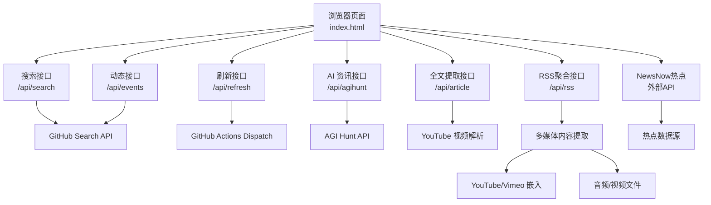

**图表来源**
- [index.html:1300-1360](file://index.html#L1300-L1360)
- [api/search.js:96-176](file://api/search.js#L96-L176)
- [api/events.js:114-160](file://api/events.js#L114-L160)
- [api/refresh.js:12-64](file://api/refresh.js#L12-L64)
- [api/agihunt.js:46-112](file://api/agihunt.js#L46-L112)
- [api/article.js:69-87](file://api/article.js#L69-87)
- [api/rss.js:191-214](file://api/rss.js#L191-L214)
- [_test_newsnow.py:3-9](file://_test_newsnow.py#L3-L9)

**章节来源**
- [README.md:1-22](file://README.md#L1-L22)

## 核心组件
- 全局状态与视图
  - 主题切换（明/暗）与持久化到 localStorage
  - 视图模式（卡片/列表）切换与持久化
  - 收藏集合（Set）持久化到 localStorage，支持导入/导出备份
- 筛选与搜索
  - 关键词输入、清空、回车打开搜索弹窗
  - 分类标签、语言下拉、星标区间筛选
  - 搜索弹窗内支持排序、语言过滤、无限滚动加载更多
- 侧边栏与动态流
  - 趋势榜（rising/total/new）切换
  - AI 动态流（AIHOT + 新闻源），分类筛选与分页加载
  - **新增**：NewsNow热点面板，右侧抽屉式界面展示多平台热门内容
  - **新增**：热榜面板分类筛选功能，支持按分类快速筛选平台
- **智能轮询系统**
  - 手动触发刷新按钮（冷却时间控制）
  - 每 30 分钟轮询关注动态（页面不可见时自动暂停）
  - **新增**：页面可见性检测，切换标签页时智能暂停/恢复轮询
- **多媒体播放系统**
  - YouTube视频ID解析和嵌入播放器
  - RSS媒体内容提取（enclosure和media:content）
  - 安全过滤的iframe嵌入（仅允许YouTube/Vimeo）
  - 音频/视频文件的直接播放支持
- **键盘快捷键系统**
  - '/'键：聚焦搜索框，提升搜索效率
  - 'd'键：切换明暗主题，无需鼠标操作
  - '?'键：显示快捷键帮助提示，增强可发现性
  - 'Esc'键：关闭弹窗或清空搜索焦点
- **悬停复制功能**
  - 卡片和列表视图中添加复制按钮
  - 一键复制仓库名称和链接
  - 支持现代浏览器Clipboard API和降级方案
- **NewsNow热点集成**
  - 外部热点数据源接入（newsnow.busiyi.world）
  - 多平台热点内容聚合展示
  - 右侧抽屉式界面设计，支持滚动浏览
- **热榜面板分类筛选**
  - 分类按钮组：全部、热搜、科技、财经、资讯、生活
  - 平台Tab数据属性标记：每个平台Tab携带data-cat属性
  - 反向类别查找：根据平台ID查找所属分类key
  - 智能过滤执行：动态显示/隐藏平台Tab，自动切换选中状态

**章节来源**
- [index.html:1000-1023](file://index.html#L1000-L1023)
- [index.html:1743-1908](file://index.html#L1743-L1908)
- [index.html:1910-1960](file://index.html:L1910-L1960)
- [index.html:1947-1970](file://index.html#L1947-L1970)
- [index.html:2025-2043](file://index.html#L2025-L2043)
- [rss-aggregator.html:2665-2740](file://rss-aggregator.html#L2665-L2740)
- [_test_newsnow.py:3-9](file://_test_newsnow.py#L3-L9)

## 架构总览
前端通过 index.html 中的事件绑定与渲染逻辑驱动界面变化；关键交互会调用 Vercel Serverless 函数完成跨域请求或外部服务访问。所有敏感密钥（如 GH_TOKEN、REFRESH_KEY、AGIHUNT_API_KEY）保存在服务端环境变量中，避免暴露到前端。**新增的智能轮询机制**通过监听页面可见性变化，在后台标签页时自动暂停资源消耗，提升整体性能。**新增的多媒体播放功能**通过YouTube ID解析和RSS媒体内容提取，为用户提供丰富的音视频内容体验。**最新的键盘快捷键和复制功能**进一步提升了用户操作效率和可访问性。**新增的NewsNow热点集成**通过外部API获取多平台热门内容，丰富了信息源的多样性。**最新的热榜面板分类筛选功能**通过数据属性标记和智能过滤逻辑，提供了更精细的平台筛选体验。

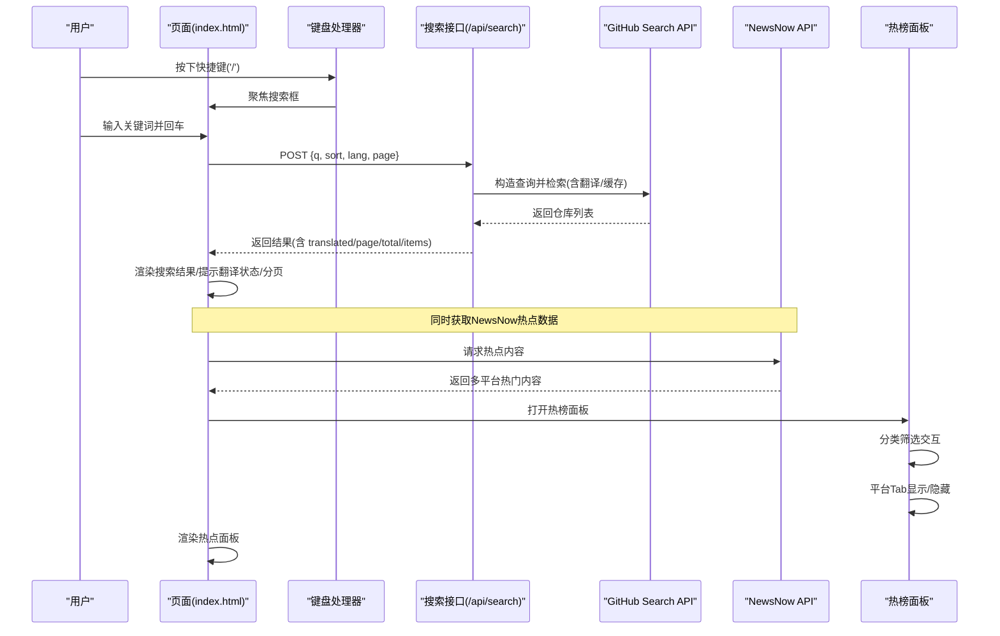

**图表来源**
- [index.html:1300-1360](file://index.html#L1300-L1360)
- [index.html:1947-1970](file://index.html#L1947-L1970)
- [api/search.js:96-176](file://api/search.js#L96-L176)
- [rss-aggregator.html:2665-2740](file://rss-aggregator.html#L2665-L2740)
- [_test_newsnow.py:3-9](file://_test_newsnow.py#L3-L9)

## 详细组件分析

### 热榜面板分类筛选功能
**新增功能**：实现了完整的热榜面板分类筛选交互系统，用户可以通过分类按钮快速筛选不同类别的平台。

#### 分类数据结构
- **分类定义**：定义了6个分类（全部、热搜、科技、财经、资讯、生活），每个分类包含key、name和members数组
- **平台映射**：每个平台都有对应的品牌色和品牌深色调，用于Tab显示
- **分类成员**：每个分类明确指定所属的平台ID数组

#### 数据属性标记
- **平台Tab标记**：每个平台Tab都带有data-cat属性，标识其所属分类
- **分类按钮标记**：分类按钮带有data-cat属性，用于事件处理和状态管理
- **状态变量**：使用_hotCatKey维护当前选中的分类状态

#### 反向类别查找函数
- **_platCat函数**：根据平台ID查找其所属分类key
- **遍历查找**：遍历分类数组，检查平台是否在members数组中
- **默认值处理**：如果平台不属于任何分类，返回'other'作为默认值

#### 智能过滤执行逻辑
- **_filterHotCat函数**：实现分类筛选的核心逻辑
- **动态显示控制**：根据当前分类设置平台Tab的display样式
- **自动状态切换**：如果当前选中的平台被隐藏，自动切换到第一个可见平台
- **视觉反馈**：更新分类按钮的on类名，提供清晰的选中状态指示

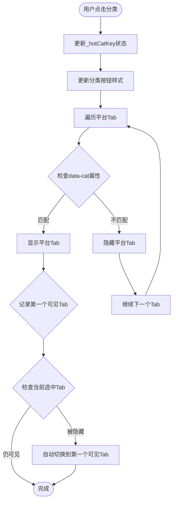

**图表来源**
- [rss-aggregator.html:2665-2740](file://rss-aggregator.html#L2665-L2740)

**章节来源**
- [rss-aggregator.html:2665-2740](file://rss-aggregator.html#L2665-L2740)

### NewsNow热点面板
**新增功能**：实现了NewsNow热点列表面板，通过右侧抽屉界面展示来自多个平台的热门内容。

#### 面板特性
- **右侧抽屉式设计**：采用现代化的抽屉式界面，不干扰主内容区域
- **多平台内容聚合**：整合GitHub Trending、今日热榜、赋范空间等多个平台的热门内容
- **滚动浏览体验**：支持流畅的滚动操作，便于浏览大量热点内容
- **实时更新机制**：定期刷新热点数据，确保内容时效性

#### 技术实现
- 使用fetch API调用外部热点数据源
- CSS样式提供平滑的动画效果和响应式设计
- JavaScript事件处理用户交互和数据更新

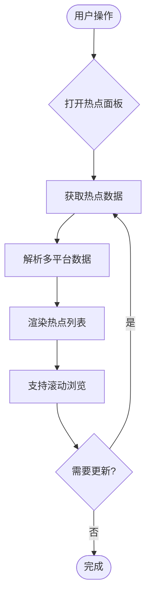

**图表来源**
- [_test_newsnow.py:3-9](file://_test_newsnow.py#L3-L9)

**章节来源**
- [_test_newsnow.py:3-9](file://_test_newsnow.py#L3-L9)

### 键盘快捷键系统
**新增功能**：实现了完整的键盘快捷键系统，大幅提升用户操作效率和可访问性。

#### 快捷键映射
- **'/'键**：聚焦搜索框，快速开始搜索
- **'d'键**：切换明暗主题，无需鼠标操作
- **'?'键**：显示快捷键帮助提示，增强功能可发现性
- **'Esc'键**：关闭弹窗或清空搜索焦点

#### 智能焦点管理
- 检测当前焦点位置，避免在输入框中误触快捷键
- 搜索模态框打开时禁用部分快捷键，防止冲突
- 支持组合键检测（Ctrl、Meta、Alt修饰键）

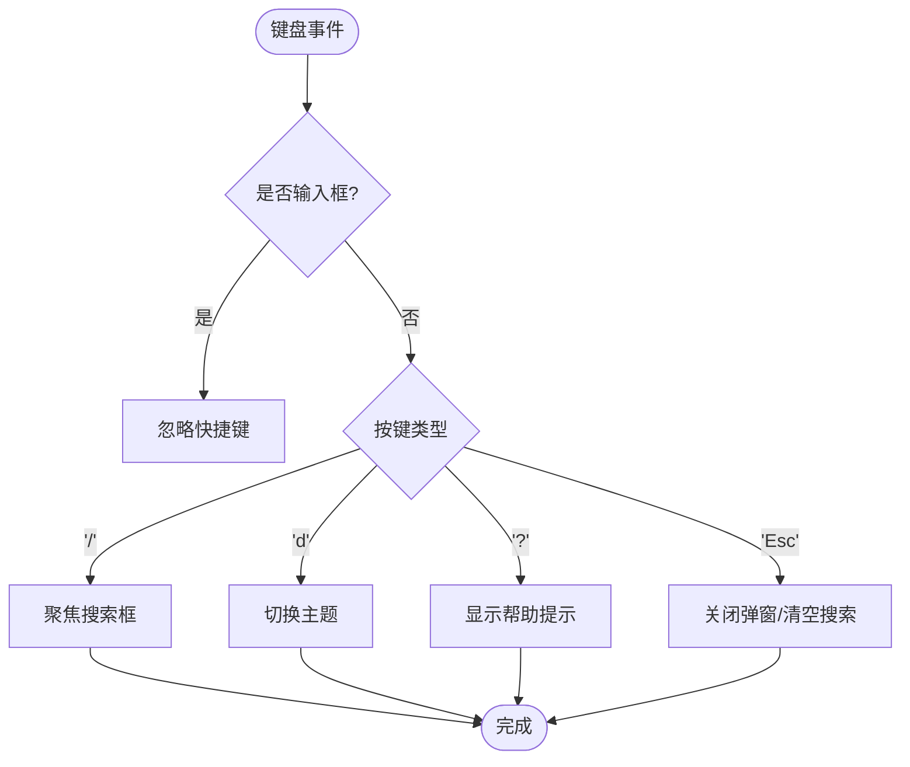

**图表来源**
- [index.html:1947-1970](file://index.html#L1947-L1970)

**章节来源**
- [index.html:1947-1970](file://index.html#L1947-L1970)

### 悬停复制功能
**新增功能**：在卡片和列表视图中添加了便捷的复制功能，用户可以快速复制仓库名称和链接。

#### 复制按钮实现
- 在每张卡片和列表行中添加复制按钮
- 使用现代浏览器Clipboard API优先，支持降级方案
- 提供即时的用户反馈（Toast提示）

#### 兼容性处理
- 优先使用 `navigator.clipboard.writeText()`
- 降级到 `document.execCommand('copy')` 方案
- 错误处理和用户友好提示

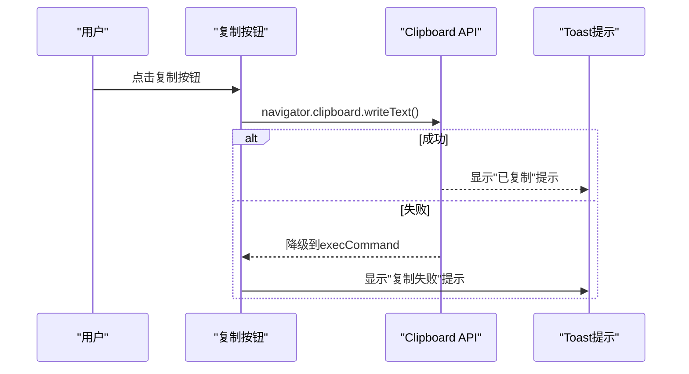

**图表来源**
- [index.html:1205-1227](file://index.html#L1205-L1227)
- [index.html:1865-1868](file://index.html#L1865-L1868)
- [index.html:2025-2043](file://index.html#L2025-L2043)

**章节来源**
- [index.html:1205-1227](file://index.html#L1205-L1227)
- [index.html:1865-1868](file://index.html#L1865-L1868)
- [index.html:2025-2043](file://index.html#L2025-L2043)

### 点击事件与导航
- 导航下拉菜单：点击切换 open 状态，点击外部区域关闭，多个独立下拉互斥
- 侧边栏 Tab 切换：趋势榜与 Feed 区切换
- 工具栏按钮：主题切换、视图切换、导出/导入、刷新
- 卡片操作：收藏、展开/收起描述、分类标签筛选、复制信息

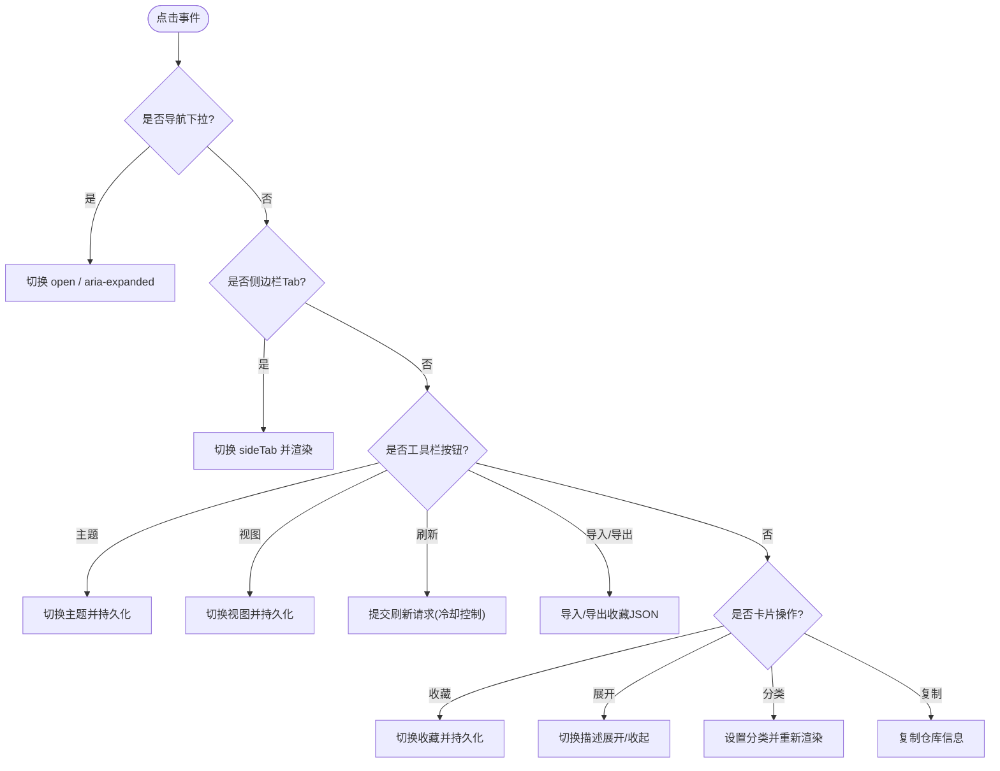

**图表来源**
- [index.html:1743-1908](file://index.html#L1743-L1908)
- [index.html:1842-1851](file://index.html#L1842-L1851)
- [index.html:1822-1839](file://index.html#L1822-L1839)
- [index.html:1865-1868](file://index.html#L1865-L1868)

**章节来源**
- [index.html:1743-1908](file://index.html#L1743-L1908)

### 表单输入与搜索过滤
- 关键词输入：实时更新 state.q，自动清空其他筛选以避免结果被遮挡；Enter 键触发搜索弹窗
- 清空按钮：清空输入并重置相关 UI
- 语言/排序/星标筛选：即时响应变更并重新渲染列表
- 搜索弹窗：支持排序、语言过滤、无限滚动加载更多；失败重试与友好提示

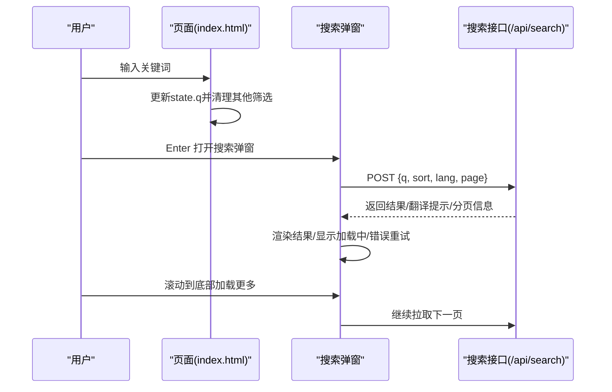

**图表来源**
- [index.html:1773-1789](file://index.html#L1773-L1789)
- [index.html:1300-1360](file://index.html#L1300-L1360)
- [api/search.js:96-176](file://api/search.js#L96-L176)

**章节来源**
- [index.html:1773-1789](file://index.html#L1773-L1789)
- [index.html:1300-1360](file://index.html#L1300-L1360)

### 收藏功能与本地存储
- 收藏切换：点击收藏图标切换收藏状态，立即持久化到 localStorage
- 置顶展示：收藏项在列表顶部优先显示
- 导入/导出：支持 JSON 备份与恢复，校验格式并提示成功/失败数量
- 防抖与容错：localStorage 写入异常捕获，不影响主流程

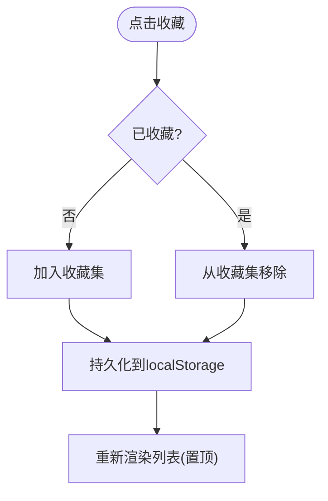

**图表来源**
- [index.html:1910-1920](file://index.html#L1910-L1920)
- [index.html:1922-1953](file://index.html#L1922-L1953)

**章节来源**
- [index.html:1910-1920](file://index.html#L1910-L1920)
- [index.html:1922-1953](file://index.html#L1922-L1953)

### 状态管理机制（本地存储、数据同步、偏好保存）
- 主题偏好：读取/写入 localStorage，默认跟随系统偏好
- 视图偏好：卡片/列表视图切换并持久化
- 收藏数据：以 Set 形式维护，序列化后存入 localStorage
- 初始化顺序：先应用主题与视图，再渲染分类、语言选择、列表、趋势榜与动态流

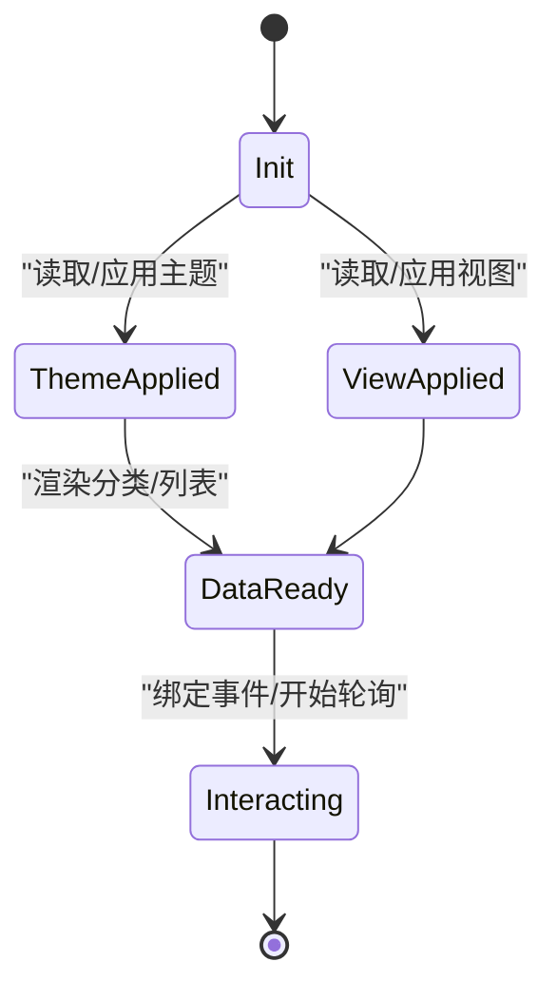

**图表来源**
- [index.html:1000-1023](file://index.html#L1000-L1023)
- [index.html:1985-2009](file://index.html#L1985-L2009)

**章节来源**
- [index.html:1000-1023](file://index.html#L1000-L1023)
- [index.html:1985-2009](file://index.html#L1985-L2009)

### 异步操作（API 调用、错误处理、加载状态）
- 搜索接口：AbortController 取消重复请求；分页加载；翻译失败降级为原词搜索；频率限制友好提示
- **智能轮询系统**：每 30 分钟轮询，页面不可见时自动暂停；回到页面立即刷新；失败静默兜底
- 刷新接口：冷却时间防止频繁提交；加载态与 Toast 反馈
- AI 资讯：主源优先渲染，新闻源异步追加；超时保护；去重与分页
- 全文提取：安全 URL 校验；JSDOM + Readability 解析；YouTube/GitHub 特殊处理

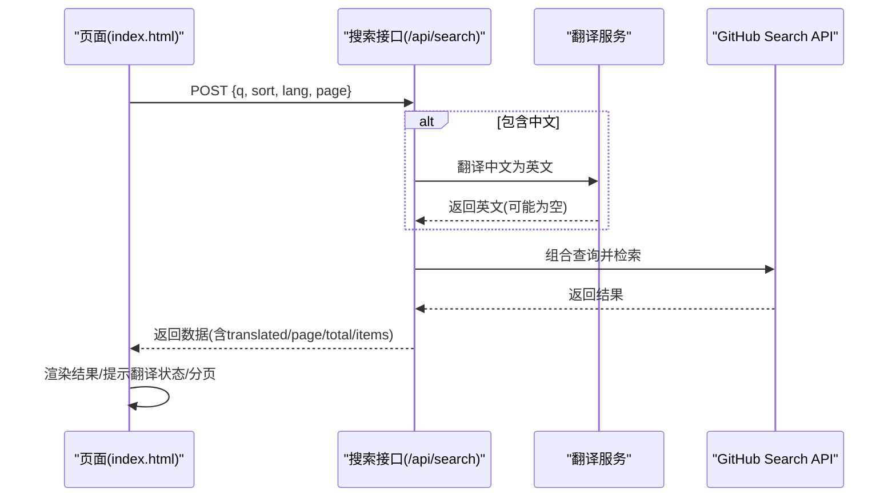

**图表来源**
- [index.html:1300-1360](file://index.html#L1300-L1360)
- [api/search.js:31-73](file://api/search.js#L31-L73)
- [api/search.js:75-91](file://api/search.js#L75-L91)
- [api/search.js:129-176](file://api/search.js#L129-L176)

**章节来源**
- [index.html:1300-1360](file://index.html#L1300-L1360)
- [api/search.js:31-73](file://api/search.js#L31-L73)
- [api/search.js:75-91](file://api/search.js#L75-L91)
- [api/search.js:129-176](file://api/search.js#L129-L176)

### 智能轮询与页面可见性检测
**新增功能**：实现了智能的页面可见性检测机制，优化了AIHOT轮询的资源使用效率。

- **轮询暂停机制**：当 `document.hidden` 为 true 时，自动暂停每 30 分钟的轮询请求
- **智能恢复逻辑**：当用户切换回页面时（visibilitychange 事件触发），立即执行一次数据刷新
- **条件刷新策略**：仅在当前处于 AIHOT 标签页时才刷新 AI 动态内容，避免不必要的网络请求
- **资源优化**：有效减少后台标签页的网络请求和内存占用，提升整体性能

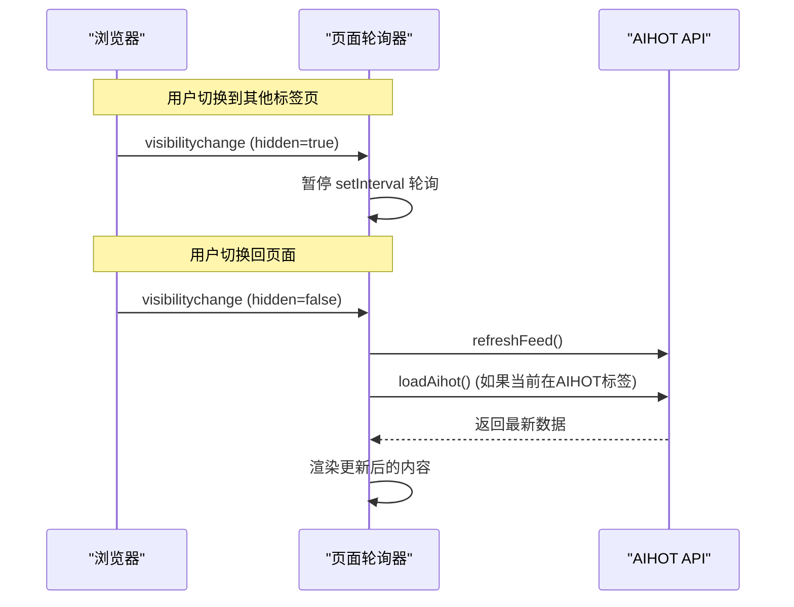

**图表来源**
- [index.html:1740-1752](file://index.html#L1740-L1752)

**章节来源**
- [index.html:1740-1752](file://index.html#L1740-L1752)

### 多媒体播放功能
**新增功能**：实现了完整的多媒体播放能力，支持YouTube视频嵌入和RSS媒体内容处理。

#### YouTube视频解析与嵌入
- **YouTube ID提取**：从URL中提取视频ID，支持youtube.com和youtu.be格式
- **嵌入式播放器**：生成安全的iframe嵌入代码，支持全屏播放
- **安全验证**：仅允许来自YouTube和Vimeo的嵌入内容

#### RSS媒体内容处理
- **媒体字段提取**：处理enclosure和media:content标签中的音频/视频内容
- **mu和mt字段**：媒体URL（mu）和媒体类型（mt）的标准化处理
- **安全过滤**：严格的HTML清洗和iframe域名白名单验证

#### 媒体渲染组件
- **自适应播放器**：根据媒体类型选择合适的播放器组件
- **加载状态管理**：显示加载进度和错误处理
- **性能优化**：懒加载和缓存机制

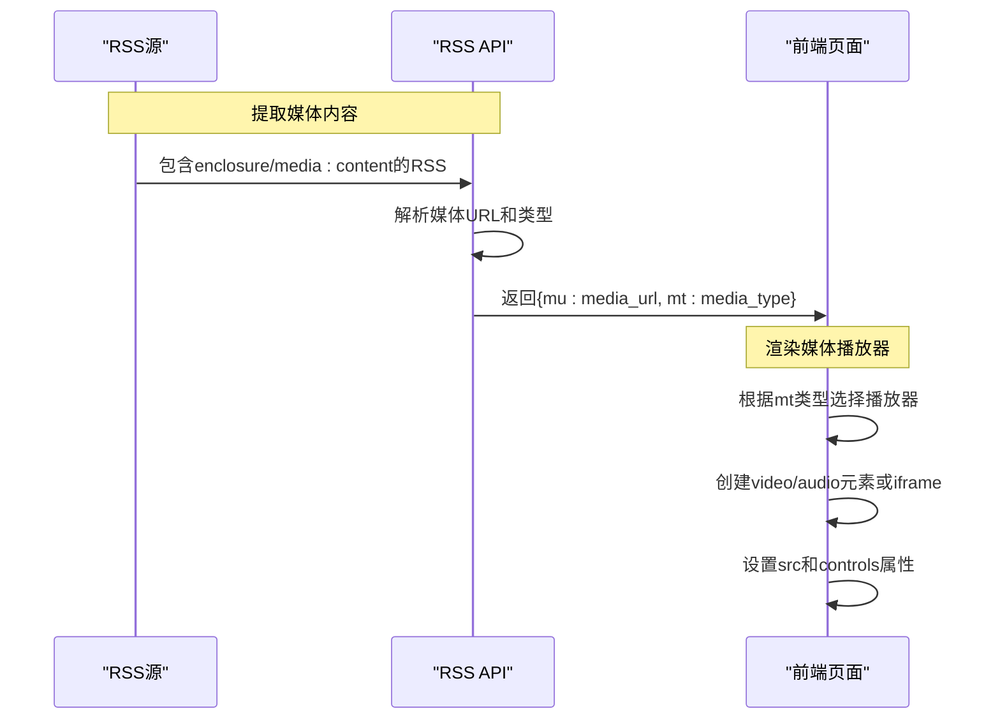

**图表来源**
- [api/rss.js:191-214](file://api/rss.js#L191-L214)
- [api/rss.js:297-306](file://api/rss.js#L297-L306)
- [api/article.js:69-87](file://api/article.js#L69-87)

**章节来源**
- [api/rss.js:191-214](file://api/rss.js#L191-L214)
- [api/rss.js:297-306](file://api/rss.js#L297-L306)
- [api/article.js:69-87](file://api/article.js#L69-87)

### 复杂交互场景与边界情况
- 并发搜索：使用 AbortController 取消上一次请求，避免竞态
- 翻译失败：回退到原词搜索，并在 UI 提示"翻译服务暂不可用"
- 搜索频率限制：服务端返回 503 时前端友好提示"搜索太频繁，请稍后再试"
- 图片加载失败：封面图 error 监听 + 延迟重试 + 降级纸纹背景
- **智能轮询节流**：页面不可见时暂停轮询，回到页面立即拉取一次，避免资源浪费
- **媒体加载失败**：YouTube嵌入失败时显示友好的错误提示和重试选项
- **刷新冷却**：60 秒内重复点击不触发，避免滥用
- **键盘冲突处理**：在输入框中使用时忽略快捷键，防止误操作
- **复制功能降级**：现代API不可用时自动降级到兼容方案
- **NewsNow热点加载**：外部API调用失败时显示友好提示，不影响主功能
- **热榜分类筛选边界**：当所有平台都被筛选隐藏时，确保有合理的空状态提示

**章节来源**
- [index.html:1321-1360](file://index.html#L1321-L1360)
- [index.html:1992-2002](file://index.html#L1992-L2002)
- [index.html:1728-1741](file://index.html#L1728-L1741)
- [index.html:1822-1839](file://index.html#L1822-L1839)
- [index.html:1947-1970](file://index.html#L1947-L1970)
- [index.html:2025-2043](file://index.html#L2025-L2043)
- [rss-aggregator.html:2724-2740](file://rss-aggregator.html#L2724-L2740)

## 依赖关系分析
- 前端依赖
  - 本地存储：localStorage（主题、视图、收藏）
  - DOM 操作：事件绑定、类名切换、内容渲染
  - 网络请求：fetch 调用各 Serverless 函数
  - **浏览器API**：Page Visibility API（document.hidden、visibilitychange 事件）
  - **媒体API**：Video/Audio元素、iframe嵌入
  - **剪贴板API**：navigator.clipboard（现代浏览器）+ execCommand（降级方案）
  - **键盘事件**：keydown事件监听和快捷键处理
- 后端依赖
  - GitHub API：搜索仓库、获取关注者动态、触发 Actions
  - 第三方翻译：Google Translate（非官方端点）与 MyMemory 降级
  - AGI Hunt API：资讯聚合
  - 全文提取：JSDOM + Readability
  - **媒体处理**：YouTube ID解析、RSS媒体内容提取、HTML安全过滤
- **外部依赖**
  - **NewsNow API**：外部热点数据源（newsnow.busiyi.world）
  - **多平台热点源**：GitHub Trending、今日热榜、赋范空间等

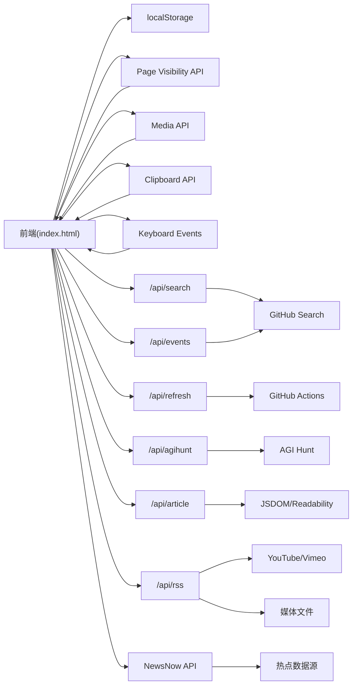

**图表来源**
- [index.html:1743-1908](file://index.html#L1743-L1908)
- [index.html:1947-1970](file://index.html#L1947-L1970)
- [index.html:2025-2043](file://index.html#L2025-L2043)
- [api/search.js:96-176](file://api/search.js#L96-L176)
- [api/events.js:114-160](file://api/events.js#L114-L160)
- [api/refresh.js:12-64](file://api/refresh.js#L12-L64)
- [api/agihunt.js:46-112](file://api/agihunt.js#L46-L112)
- [api/article.js:125-202](file://api/article.js#L125-L202)
- [api/rss.js:191-214](file://api/rss.js#L191-L214)
- [_test_newsnow.py:3-9](file://_test_newsnow.py#L3-L9)

**章节来源**
- [index.html:1743-1908](file://index.html#L1743-L1908)
- [index.html:1947-1970](file://index.html#L1947-L1970)
- [index.html:2025-2043](file://index.html#L2025-L2043)
- [api/search.js:96-176](file://api/search.js#L96-L176)
- [api/events.js:114-160](file://api/events.js#L114-L160)
- [api/refresh.js:12-64](file://api/refresh.js#L12-L64)
- [api/agihunt.js:46-112](file://api/agihunt.js#L46-L112)
- [api/article.js:125-202](file://api/article.js#L125-L202)
- [api/rss.js:191-214](file://api/rss.js#L191-L214)
- [_test_newsnow.py:3-9](file://_test_newsnow.py#L3-L9)

## 性能与体验优化
- 首屏优先：AI 动态主源先渲染，新闻源异步追加，避免阻塞
- 分页与去重：搜索与资讯流均支持分页与标题去重，减少重复渲染
- 缓存策略：搜索翻译结果与搜索结果内存缓存；动态接口 10 分钟 TTL；全文提取 4 小时 TTL
- **智能资源管理**：页面不可见时自动暂停轮询，显著降低后台标签页的资源消耗
- **即时响应恢复**：用户切换回页面时立即刷新数据，确保信息时效性
- **媒体性能优化**：YouTube嵌入懒加载，RSS媒体内容缓存，iframe安全预检
- **键盘效率提升**：快捷键系统减少鼠标操作，提升专业用户的工作效率
- **复制功能优化**：现代API优先使用，自动降级保证兼容性
- **NewsNow热点优化**：外部API调用异步处理，失败不影响主功能，提供优雅降级
- **热榜分类筛选优化**：分类筛选操作轻量高效，DOM操作最小化，用户体验流畅
- 资源降级：封面图加载失败自动降级为纸纹背景，提升视觉稳定性
- 可访问性：键盘快捷键（/ 聚焦搜索、d 切换主题、? 帮助、Esc 关闭）、ARIA 属性（aria-expanded）
- 用户体验：Toast 反馈、加载态、错误重试、冷却时间控制

## 故障排查指南
- 搜索失败
  - 检查网络与 CORS；查看服务端日志；确认 REFRESH_KEY/SEARCH_KEY 配置正确
  - 若出现 503，提示"搜索太频繁"，稍后再试
- 翻译失败
  - 前端会降级为原词搜索并提示；可尝试英文关键词
- 刷新失败
  - 检查 REFRESH_KEY 与 GH_TOKEN；确认 Vercel 部署可用
- **轮询问题排查**
  - 检查浏览器是否支持 Page Visibility API
  - 确认 visibilitychange 事件正常触发
  - 验证 document.hidden 状态变化是否符合预期
- **媒体播放问题排查**
  - 检查YouTube视频ID解析是否正确
  - 确认iframe嵌入域名是否在白名单中
  - 验证RSS媒体URL的可访问性和格式
- **键盘快捷键问题排查**
  - 检查事件监听器是否正确绑定
  - 确认焦点管理逻辑正常工作
  - 验证输入框检测逻辑避免冲突
- **复制功能问题排查**
  - 检查Clipboard API支持情况
  - 确认execCommand降级方案工作正常
  - 验证权限设置和HTTPS环境要求
- **NewsNow热点问题排查**
  - 检查外部API连接是否正常
  - 验证热点数据源可用性
  - 确认网络请求超时设置合理
- **热榜分类筛选问题排查**
  - 检查_hotCats分类数据是否正确加载
  - 验证平台Tab的data-cat属性是否正确设置
  - 确认_filterHotCat函数逻辑执行正常
  - 检查平台分类映射关系是否准确
- 动态加载失败
  - 页面不可见时轮询暂停属于正常行为；回到页面会自动拉取；失败静默兜底
- 全文提取失败
  - 检查 URL 安全性；部分站点无法解析将返回 extraction_failed

**章节来源**
- [index.html:1300-1360](file://index.html#L1300-L1360)
- [index.html:1822-1839](file://index.html#L1822-L1839)
- [index.html:1947-1970](file://index.html#L1947-L1970)
- [index.html:2025-2043](file://index.html#L2025-L2043)
- [api/search.js:129-176](file://api/search.js#L129-L176)
- [api/events.js:114-160](file://api/events.js#L114-L160)
- [api/article.js:125-202](file://api/article.js#L125-L202)
- [api/rss.js:191-214](file://api/rss.js#L191-L214)
- [_test_newsnow.py:3-9](file://_test_newsnow.py#L3-L9)
- [rss-aggregator.html:2665-2740](file://rss-aggregator.html#L2665-L2740)

## 结论
该项目的用户交互逻辑围绕"搜索、筛选、收藏、动态流"四大核心能力构建，采用前后端分离的 Serverless 架构，保证敏感密钥安全与可扩展性。前端通过完善的本地存储与状态管理实现个性化体验，并通过丰富的错误处理与降级策略保障可用性。**最新的智能轮询机制**进一步提升了性能表现，通过页面可见性检测有效减少了后台标签页的资源消耗，同时保证了用户返回时的数据时效性。**新增的多媒体播放功能**为用户提供了丰富的音视频内容体验，包括YouTube视频嵌入和RSS媒体内容处理，显著增强了平台的内容丰富度和用户粘性。**最新的键盘快捷键和复制功能**大幅提升了用户操作效率和可访问性，特别是对于专业用户和需要高效操作的场景。**新增的NewsNow热点集成**通过外部API获取多平台热门内容，丰富了信息源的多样性，为用户提供更全面的资讯聚合体验。**最新的热榜面板分类筛选功能**通过数据属性标记、反向类别查找函数和智能过滤执行逻辑，提供了更精细的平台筛选体验，用户可以按热搜、科技、财经、资讯、生活等分类快速定位感兴趣的平台，显著提升了信息获取效率。建议持续优化翻译成功率、图片加载鲁棒性与移动端交互细节，进一步提升整体体验。

## 附录
- 常用快捷键
  - "/"：聚焦搜索框
  - "d"：切换明暗主题
  - "?"：显示快捷键帮助
  - "Esc"：关闭弹窗或清空搜索焦点
- 数据备份
  - 导出：生成 JSON 文件，包含收藏列表
  - 导入：校验格式并恢复收藏
- **多媒体内容支持**
  - YouTube视频：支持标准URL格式嵌入播放
  - RSS媒体：支持enclosure和media:content格式的音频/视频
  - 安全限制：仅允许YouTube和Vimeo的iframe嵌入
- **复制功能**
  - 一键复制仓库名称和链接
  - 支持现代浏览器Clipboard API和降级方案
  - 提供即时的用户反馈
- **NewsNow热点集成**
  - 外部热点数据源：newsnow.busiyi.world
  - 多平台内容聚合：GitHub Trending、今日热榜、赋范空间等
  - 右侧抽屉式界面：不干扰主内容区域的现代化设计
  - 异步加载机制：外部API调用失败不影响主功能
- **热榜面板分类筛选**
  - 分类类型：全部、热搜、科技、财经、资讯、生活
  - 平台映射：每个平台都有明确的分类归属
  - 数据属性：platformTab携带data-cat属性
  - 智能切换：自动切换到第一个可见平台
  - 状态管理：_hotCatKey维护当前分类状态

**章节来源**
- [index.html:1922-1953](file://index.html#L1922-L1953)
- [index.html:1894-1907](file://index.html#L1894-L1907)
- [index.html:1947-1970](file://index.html#L1947-L1970)
- [index.html:2025-2043](file://index.html#L2025-L2043)
- [api/article.js:69-87](file://api/article.js#L69-87)
- [api/rss.js:191-214](file://api/rss.js#L191-L214)
- [_test_newsnow.py:3-9](file://_test_newsnow.py#L3-L9)
- [rss-aggregator.html:2665-2740](file://rss-aggregator.html#L2665-L2740)