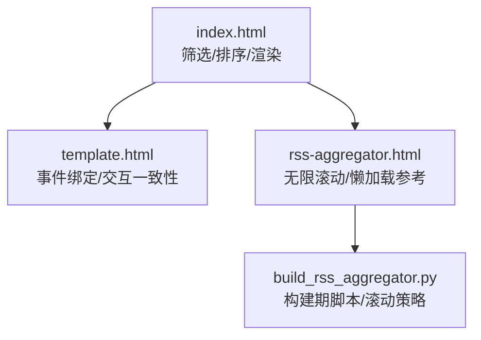
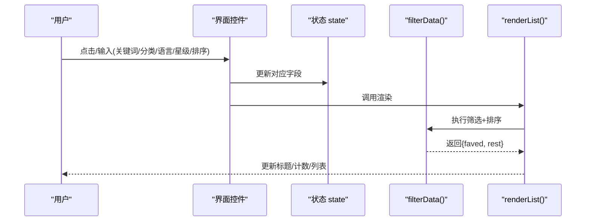
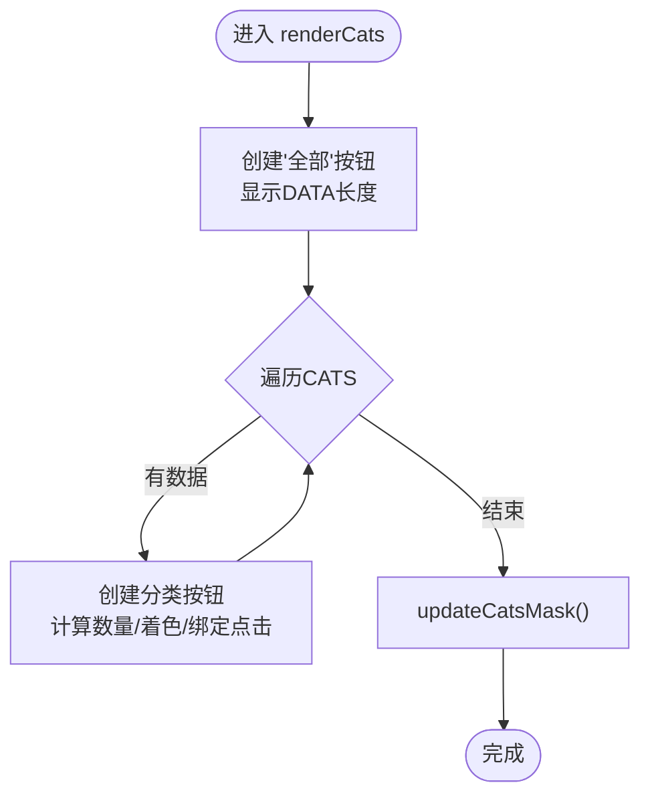
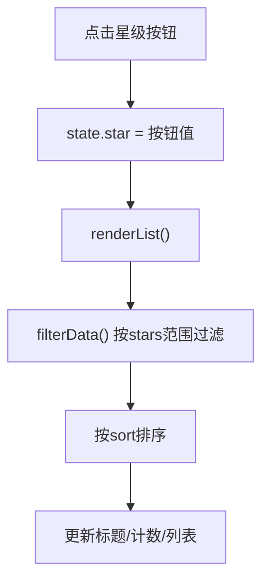
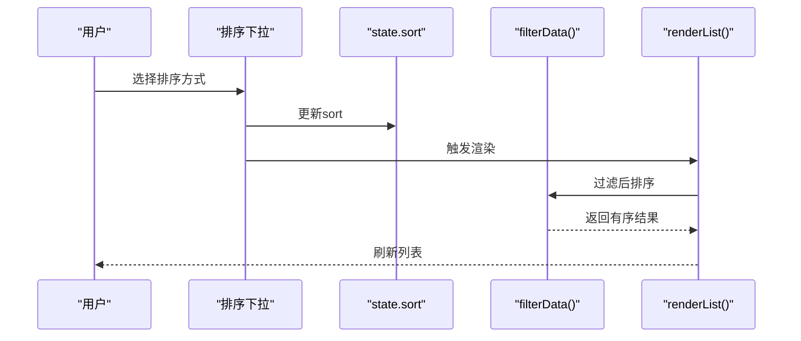
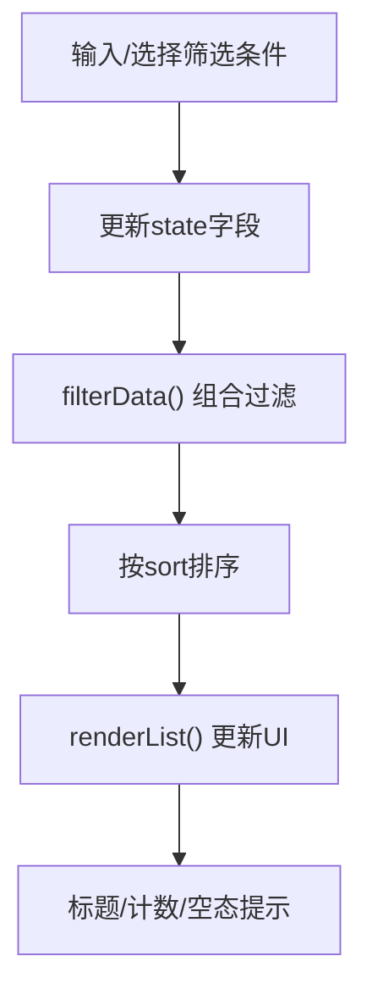
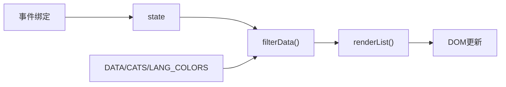

# 筛选排序系统

<cite>
**本文引用的文件**
- [index.html](file://index.html)
- [template.html](file://template.html)
- [rss-aggregator.html](file://rss-aggregator.html)
- [build_rss_aggregator.py](file://build_rss_aggregator.py)
</cite>

## 目录
1. [简介](#简介)
2. [项目结构](#项目结构)
3. [核心组件](#核心组件)
4. [架构总览](#架构总览)
5. [详细组件分析](#详细组件分析)
6. [依赖关系分析](#依赖关系分析)
7. [性能考虑](#性能考虑)
8. [故障排查指南](#故障排查指南)
9. [结论](#结论)
10. [附录](#附录)

## 简介
本文件系统性地梳理并文档化“GitHub 收藏台”的筛选与排序能力，覆盖以下目标：
- 分类筛选：类别标签生成、选中状态管理、筛选逻辑
- 星级筛选：星级范围选择、动态过滤算法
- 排序功能：按星标数、更新时间、名称等多维切换
- 组合筛选：多维度条件叠加（关键词、分类、语言、星级）
- 界面反馈：计数显示、清空操作、空态提示
- 性能优化：懒加载、IntersectionObserver、节流滚动等

## 项目结构
该筛选排序能力集中在单页应用内，主要实现位于 index.html；模板页面 template.html 提供一致的事件绑定与交互逻辑；RSS 聚合页面 rss-aggregator.html 与构建脚本 build_rss_aggregator.py 展示了无限滚动与懒加载的工程实践，可借鉴到列表渲染中。

**图表来源**
- [index.html:1025-1137](file://index.html#L1025-L1137)
- [template.html:1773-1815](file://template.html#L1773-L1815)
- [rss-aggregator.html:1281-1294](file://rss-aggregator.html#L1281-L1294)
- [build_rss_aggregator.py:2699-2712](file://build_rss_aggregator.py#L2699-L2712)

**章节来源**
- [index.html:1025-1137](file://index.html#L1025-L1137)
- [template.html:1773-1815](file://template.html#L1773-L1815)
- [rss-aggregator.html:1281-1294](file://rss-aggregator.html#L1281-L1294)
- [build_rss_aggregator.py:2699-2712](file://build_rss_aggregator.py#L2699-L2712)

## 核心组件
- 数据源与状态
  - 数据数组 DATA、分类定义 CATS、语言颜色 LANG_COLORS
  - 全局状态 state：q（关键词）、cat（分类）、lang（语言）、star（星级范围）、sort（排序方式）
  - 收藏集 favs（Set），持久化至 localStorage
- 筛选与排序
  - filterData：组合关键词、分类、语言、星级进行过滤，并按 sort 排序
  - fuzzyMatch：多字段模糊匹配
- 渲染
  - renderCats：动态生成分类标签及计数
  - renderLangSel：语言下拉选项
  - renderList：根据视图模式（卡片/列表）渲染结果，更新标题与计数
- 交互
  - 搜索输入、清空、重置全部筛选
  - 星级按钮组切换
  - 语言下拉切换
  - 排序下拉切换
  - 收藏/取消收藏与置顶展示

**章节来源**
- [index.html:1025-1137](file://index.html#L1025-L1137)
- [index.html:1061-1092](file://index.html#L1061-L1092)
- [index.html:1162-1268](file://index.html#L1162-L1268)
- [index.html:1773-1815](file://index.html#L1773-L1815)

## 架构总览
下图展示用户操作如何驱动状态变更，进而触发筛选、排序与渲染流程。

**图表来源**
- [index.html:1116-1137](file://index.html#L1116-L1137)
- [index.html:1229-1268](file://index.html#L1229-L1268)
- [index.html:1773-1815](file://index.html#L1773-L1815)

## 详细组件分析

### 分类筛选：类别标签生成、选中状态与筛选逻辑
- 类别标签生成
  - renderCats 遍历 CATS，为每个分类计算当前数据中的数量，生成带色点与计数的按钮
  - “全部”按钮始终存在，显示 DATA 总数
  - 通过 updateCatsMask 检测横向溢出，控制两端渐隐蒙版
- 选中状态管理
  - 点击分类按钮时，若已选中则取消，否则设为该分类 key
  - 同时更新按钮 on 类名以高亮选中项
- 筛选逻辑
  - filterData 在过滤阶段检查 state.cat，仅保留 category 匹配的条目
- 界面反馈
  - 标题文本根据是否选中分类动态显示“全部项目”或分类名
  - 列表计数实时更新

**图表来源**
- [index.html:1061-1084](file://index.html#L1061-L1084)

**章节来源**
- [index.html:1061-1084](file://index.html#L1061-L1084)
- [index.html:1116-1137](file://index.html#L1116-L1137)
- [index.html:1229-1268](file://index.html#L1229-L1268)

### 星级筛选：范围选择与动态过滤
- 星级范围
  - 支持 lt1k、1k10k、10k100k、gt100k 与 all
  - starSel 按钮组通过 data-v 标识值，点击后设置 state.star 并切换 on 样式
- 动态过滤
  - filterData 依据 state.star 对 stars 字段进行区间判断，剔除不满足条件的条目
- 界面反馈
  - 按钮选中态切换
  - 列表计数与空态提示联动

**图表来源**
- [index.html:1116-1137](file://index.html#L1116-L1137)
- [index.html:1773-1815](file://index.html#L1773-L1815)

**章节来源**
- [index.html:1116-1137](file://index.html#L1116-L1137)
- [index.html:1773-1815](file://index.html#L1773-L1815)

### 排序功能：多维切换逻辑
- 排序维度
  - stars-desc：星标降序
  - stars-asc：星标升序
  - recent：按 pushed_at 时间倒序
  - name：按名称字典序
- 切换机制
  - sortSel 下拉框 change 事件更新 state.sort 并触发 renderList
- 排序位置
  - 在 filterData 内部先过滤再排序，保证结果集正确

**图表来源**
- [index.html:1127-1133](file://index.html#L1127-L1133)
- [index.html:1798-1805](file://index.html#L1798-L1805)

**章节来源**
- [index.html:1127-1133](file://index.html#L1127-L1133)
- [index.html:1798-1805](file://index.html#L1798-L1805)

### 组合筛选：多维度数据过滤
- 组合维度
  - 关键词 q：跨 name/owner/full_name/desc/language/categoryLabel/topics 的多词模糊匹配
  - 分类 cat：精确匹配 category
  - 语言 lang：精确匹配 language
  - 星级 star：区间过滤 stars
- 交互规则
  - 当输入关键词时自动清空其他筛选（避免被挡住），并提供“清除所有筛选”按钮
- 结果呈现
  - 标题显示当前分类或“全部项目”，计数显示剩余条目数
  - 空态提示区分“有关键词”和“有筛选条件”的不同引导文案

**图表来源**
- [index.html:1110-1137](file://index.html#L1110-L1137)
- [index.html:1229-1268](file://index.html#L1229-L1268)
- [index.html:1773-1797](file://index.html#L1773-L1797)

**章节来源**
- [index.html:1110-1137](file://index.html#L1110-L1137)
- [index.html:1229-1268](file://index.html#L1229-L1268)
- [index.html:1773-1797](file://index.html#L1773-L1797)

### 筛选状态的用户界面反馈
- 计数显示
  - 标题右侧计数实时反映过滤后的条目数
  - 统计区显示总量、分类数、语言数、收藏数
- 清空操作
  - 搜索框清空按钮快速清除关键词
  - “清除所有筛选”一键重置 q/cat/lang/star，并恢复星级按钮默认态
- 空态提示
  - 无结果时显示不同提示文案，并在存在筛选时显示“清除所有筛选”入口

**章节来源**
- [index.html:1229-1268](file://index.html#L1229-L1268)
- [index.html:1773-1797](file://index.html#L1773-L1797)

### 性能优化策略：懒加载与虚拟滚动思路
- 懒加载
  - 封面图使用 loading="lazy" 与 decoding="async"，减少首屏压力
  - 图片错误监听 + 延迟重试，失败降级为纸纹占位
- IntersectionObserver
  - 统计数字仅在进入视口时触发一次动画，避免无关计算
- 无限滚动与节流
  - RSS 聚合页面采用滚动接近底部触发加载更多，配合节流锁防止重复请求
  - 可借鉴到主列表：基于可视区域与容器高度阈值触发分页加载
- 建议落地
  - 将 renderList 改为分页渲染，结合 IntersectionObserver 或滚动监听按需追加 DOM
  - 对大数据量场景启用虚拟滚动（仅渲染可视区条目），显著降低内存与重排开销

**章节来源**
- [index.html:1162-1200](file://index.html#L1162-L1200)
- [index.html:1975-1984](file://index.html#L1975-L1984)
- [rss-aggregator.html:1281-1294](file://rss-aggregator.html#L1281-L1294)
- [build_rss_aggregator.py:2699-2712](file://build_rss_aggregator.py#L2699-L2712)

## 依赖关系分析
- 模块耦合
  - filterData 强依赖 state 与 DATA/CATS/LANG_COLORS
  - renderCats/renderLangSel/renderList 依赖 state 与 DOM 节点
  - 事件绑定集中处理用户输入，统一更新 state 并触发渲染
- 外部依赖
  - 搜索模态框调用 /api/search.js 接口（跨站搜索）
  - 关注动态与 AI 动态通过 API 拉取，失败静默降级
- 潜在循环
  - 事件→state→渲染→DOM 更新，单向流，未见循环依赖

**图表来源**
- [index.html:1025-1137](file://index.html#L1025-L1137)
- [index.html:1773-1815](file://index.html#L1773-L1815)

**章节来源**
- [index.html:1025-1137](file://index.html#L1025-L1137)
- [index.html:1773-1815](file://index.html#L1773-L1815)

## 性能考虑
- 前端过滤与排序复杂度
  - 过滤 O(N)，排序 O(N log N)，N 为数据量；适合中小规模数据集
- 渲染成本
  - 全量 DOM 插入在大列表下可能卡顿；建议分页/虚拟滚动
- 网络与降级
  - 搜索与动态流失败时保持静态兜底，提升可用性
- 建议
  - 引入虚拟滚动（如仅渲染可视区元素）
  - 对长列表使用 requestIdleCallback 分片渲染
  - 合并多次状态更新，减少重复渲染

[本节为通用性能讨论，无需特定文件引用]

## 故障排查指南
- 搜索无结果
  - 检查是否处于“有关键词”模式，确认是否清除了其他筛选
  - 尝试缩短关键词或换英文词
- 星级筛选无效
  - 确认 star 值是否正确设置，按钮 on 类名是否同步
- 列表为空且未提示清空
  - 检查是否有隐藏筛选条件生效，使用“清除所有筛选”恢复
- 图片加载失败
  - 监听 error 事件，延迟重试一次；失败则降级为占位图

**章节来源**
- [index.html:1229-1268](file://index.html#L1229-L1268)
- [index.html:1992-2002](file://index.html#L1992-L2002)

## 结论
该筛选排序系统以简洁的状态机驱动，实现了关键词、分类、语言、星级的组合过滤与多种排序方式，并通过清晰的界面反馈提升用户体验。针对大数据量场景，建议引入分页与虚拟滚动进一步优化性能。RSS 聚合页面的无限滚动与节流策略可作为工程参考。

[本节为总结性内容，无需特定文件引用]

## 附录
- 关键函数路径
  - 筛选与排序：[index.html:1116-1137](file://index.html#L1116-L1137)
  - 分类渲染：[index.html:1061-1084](file://index.html#L1061-L1084)
  - 列表渲染：[index.html:1162-1268](file://index.html#L1162-L1268)
  - 事件绑定：[index.html:1773-1815](file://index.html#L1773-L1815)
  - 懒加载与IO：[index.html:1975-1984](file://index.html#L1975-L1984)
  - 无限滚动参考：[rss-aggregator.html:1281-1294](file://rss-aggregator.html#L1281-L1294), [build_rss_aggregator.py:2699-2712](file://build_rss_aggregator.py#L2699-L2712)