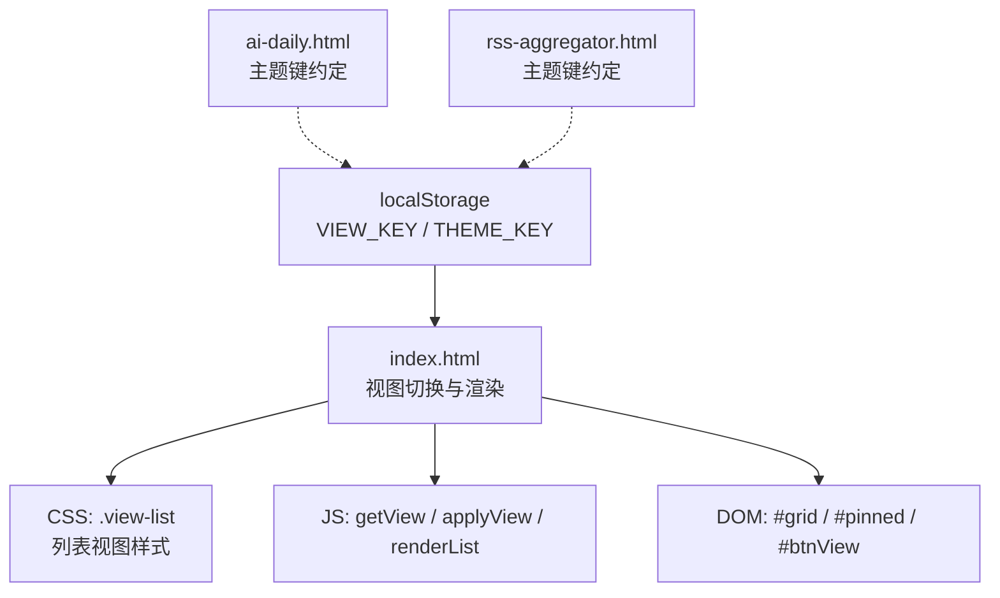
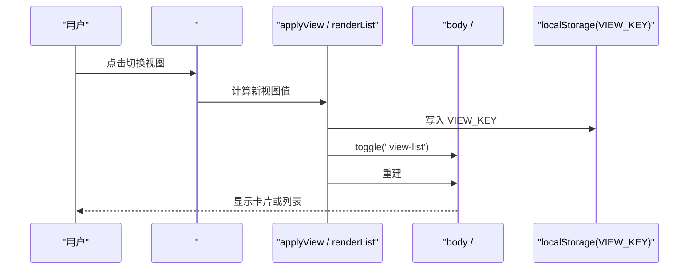
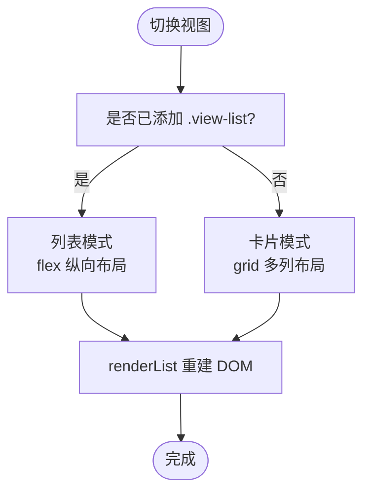
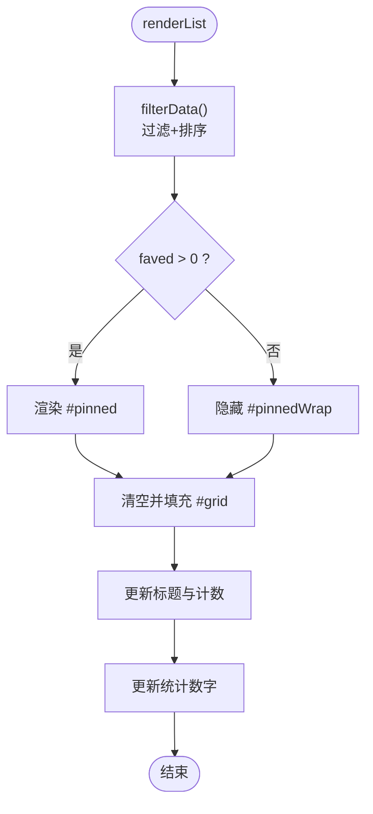
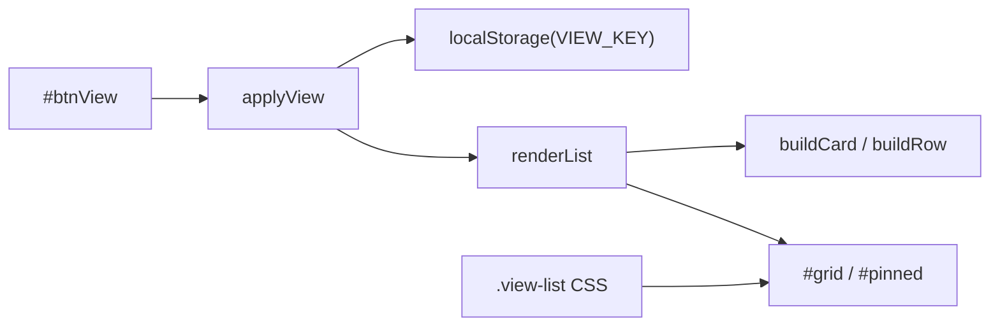

# 视图切换功能

<cite>
**本文引用的文件**
- [index.html](file://index.html)
- [ai-daily.html](file://ai-daily.html)
- [rss-aggregator.html](file://rss-aggregator.html)
</cite>

## 目录
1. [简介](#简介)
2. [项目结构](#项目结构)
3. [核心组件](#核心组件)
4. [架构总览](#架构总览)
5. [详细组件分析](#详细组件分析)
6. [依赖关系分析](#依赖关系分析)
7. [性能考量](#性能考量)
8. [故障排查指南](#故障排查指南)
9. [结论](#结论)
10. [附录](#附录)

## 简介
本文件聚焦“视图切换”能力：在卡片视图与列表视图之间无缝切换，涵盖 DOM 结构转换、样式适配、数据渲染逻辑、状态持久化、动画与用户体验优化、响应式策略以及键盘快捷键和无障碍访问支持。该功能主要实现在 index.html 中，并通过 CSS 类名驱动布局变化，JavaScript 负责状态读取/写入与渲染调度。

## 项目结构
- 入口页面 index.html 包含完整的视图切换实现：CSS 定义、HTML 骨架、JS 逻辑（视图切换、主题切换、收藏、筛选、搜索等）。
- ai-daily.html 与 rss-aggregator.html 为独立页面，不直接参与主站视图切换，但共享主题持久化键 wb_starhub_theme_v1 的约定。

图表来源
- [index.html:1014-1023](file://index.html#L1014-L1023)
- [index.html:1229-1268](file://index.html#L1229-L1268)
- [index.html:1847-1851](file://index.html#L1847-L1851)
- [ai-daily.html:142](file://ai-daily.html#L142)

章节来源
- [index.html:1014-1023](file://index.html#L1014-L1023)
- [index.html:1229-1268](file://index.html#L1229-L1268)
- [index.html:1847-1851](file://index.html#L1847-L1851)
- [ai-daily.html:142](file://ai-daily.html#L142)

## 核心组件
- 视图状态存取
  - 读取：getView() 从 localStorage 获取 VIEW_KEY，默认 'card'
  - 应用：applyView(v) 通过 body.classList.toggle('view-list', v === 'list') 切换视图，并更新按钮图标
- 渲染调度
  - renderList() 根据当前视图选择 buildRow 或 buildCard 构建条目，分别填充置顶区与主列表
- 交互触发
  - #btnView 点击事件：切换视图状态、持久化、重新渲染

章节来源
- [index.html:1014-1023](file://index.html#L1014-L1023)
- [index.html:1229-1268](file://index.html#L1229-L1268)
- [index.html:1847-1851](file://index.html#L1847-L1851)

## 架构总览
视图切换采用“类名驱动 + 函数式渲染”的轻量架构：
- 状态层：localStorage 中的 VIEW_KEY 保存用户偏好
- 表现层：CSS 通过 .view-list 控制网格/行布局、间距、阴影等
- 行为层：JS 在点击时切换状态、更新图标、调用 renderList() 重建 DOM

图表来源
- [index.html:1847-1851](file://index.html#L1847-L1851)
- [index.html:1014-1023](file://index.html#L1014-L1023)
- [index.html:1229-1268](file://index.html#L1229-L1268)

## 详细组件分析

### 1) DOM 结构与样式适配
- 容器与区域
  - #pinnedWrap 包裹置顶收藏项；#pinned 用于放置收藏项节点
  - #grid 为主内容容器，承载卡片或列表行
- 视图切换机制
  - 当 body 拥有 .view-list 类时：
    - #grid 与 #pinned 由 grid 布局切换为 flex 纵向排列
    - 每个项目以 .row 行展示，隐藏封面图，突出名称、描述、元信息
  - 无 .view-list 时：
    - 使用 .card.cover-card 卡片布局，含封面图、正文、底部元数据

图表来源
- [index.html:439-454](file://index.html#L439-L454)
- [index.html:327-436](file://index.html#L327-L436)
- [index.html:1229-1268](file://index.html#L1229-L1268)

章节来源
- [index.html:439-454](file://index.html#L439-L454)
- [index.html:327-436](file://index.html#L327-L436)
- [index.html:1229-1268](file://index.html#L1229-L1268)

### 2) 数据渲染逻辑
- 过滤与排序
  - filterData() 根据关键词、分类、语言、星标区间进行过滤，并按 stars-desc/recent/name 排序
  - 将结果分为 faved（收藏）与 rest（其余），分别渲染到置顶区与主列表
- 构建器
  - buildCard(d, isFav)：生成带封面图的卡片，包含名称、描述、语言、星标、更新时间、分类标签、打开链接
  - buildRow(d, isFav)：生成紧凑的行，包含收藏按钮、名称、描述、元信息与打开链接
- 标题与计数
  - 动态更新 #listTitle 文本与 #listCount 计数，避免覆盖子节点导致丢失

图表来源
- [index.html:1116-1137](file://index.html#L1116-L1137)
- [index.html:1162-1221](file://index.html#L1162-L1221)
- [index.html:1229-1268](file://index.html#L1229-L1268)

章节来源
- [index.html:1116-1137](file://index.html#L1116-L1137)
- [index.html:1162-1221](file://index.html#L1162-L1221)
- [index.html:1229-1268](file://index.html#L1229-L1268)

### 3) 视图状态持久化
- 存储键
  - VIEW_KEY：保存当前视图（'card' | 'list'）
  - THEME_KEY：保存主题（'light' | 'dark'）
- 初始化与恢复
  - 页面加载时 applyTheme(getTheme()) 与 applyView(getView()) 确保初始状态一致
- 跨页面主题一致性
  - ai-daily.html 与 rss-aggregator.html 使用同一主题键 wb_starhub_theme_v1，保证全站主题一致

章节来源
- [index.html:1000-1011](file://index.html#L1000-L1011)
- [index.html:1014-1023](file://index.html#L1014-L1023)
- [index.html:1985-1986](file://index.html#L1985-L1986)
- [ai-daily.html:142](file://ai-daily.html#L142)

### 4) 动画效果与用户体验
- 过渡与动效
  - 卡片悬停提升与阴影增强，封面图缩放（仅精确指针设备）
  - 列表行悬停背景高亮
  - 统计数字首次进入视口时的滚动计数动画
- 无障碍与可访问性
  - 按钮具备 aria-label，便于屏幕阅读器识别
  - 图片 alt 占位与 fallback 处理，降低图片失败影响
  - prefers-reduced-motion 媒体查询禁用非必要动画
- 反馈提示
  - toast 轻提示收藏/取消收藏等操作结果

章节来源
- [index.html:327-436](file://index.html#L327-L436)
- [index.html:439-454](file://index.html#L439-L454)
- [index.html:740-743](file://index.html#L740-L743)
- [index.html:1955-1960](file://index.html#L1955-L1960)
- [index.html:1962-1984](file://index.html#L1962-L1984)

### 5) 响应式设计
- 多断点适配
  - 1100px：侧边栏收起，网格变为两列，封面高度调整
  - 900px：统计网格改为两列，搜索区域堆叠
  - 640px：单列网格，导航折叠，行内元素换行
- 列表视图下的移动端体验
  - .row 在小屏下允许描述换行，保持可读性

章节来源
- [index.html:687-739](file://index.html#L687-L739)

### 6) 键盘快捷键与无障碍
- 全局快捷键
  - “/” 聚焦搜索框（非输入状态下）
  - “Esc” 关闭模态或清空搜索并失焦
- 列表/卡片内部键盘操作
  - 在 RSS 聚合页（rss-aggregator.html）中，卡片支持 Enter/Space 打开（A1 修复）
- 焦点管理与语义
  - 按钮与链接具备合适的 title/aria-label
  - 封面图错误时降级为文字首字母占位，避免空白

章节来源
- [index.html:1894-1907](file://index.html#L1894-L1907)
- [rss-aggregator.html:2301-2307](file://rss-aggregator.html#L2301-L2307)
- [index.html:1992-2002](file://index.html#L1992-L2002)

## 依赖关系分析
- 视图切换对以下模块存在强依赖：
  - 状态存取：getView / applyView
  - 渲染管线：filterData、buildCard/buildRow、renderList
  - UI 控件：#btnView、#grid、#pinned、#listTitle、#listCount
  - 样式：.view-list 及其相关规则
- 潜在耦合点
  - 若修改 #grid 或 #pinned 的结构，需同步更新 renderList 中的选择器与插入逻辑
  - 若新增筛选条件，需在 filterData 中扩展过滤逻辑并在 renderList 中更新空态提示

图表来源
- [index.html:1014-1023](file://index.html#L1014-L1023)
- [index.html:1229-1268](file://index.html#L1229-L1268)
- [index.html:1847-1851](file://index.html#L1847-L1851)

章节来源
- [index.html:1014-1023](file://index.html#L1014-L1023)
- [index.html:1229-1268](file://index.html#L1229-L1268)
- [index.html:1847-1851](file://index.html#L1847-L1851)

## 性能考量
- 渲染效率
  - 使用 innerHTML 批量构建节点，减少多次 DOM 操作开销
  - 置顶区与普通列表分离渲染，避免重复计算
- 图片加载
  - 封面图 lazy loading，失败时回退到首字母占位，避免布局抖动
- 动画性能
  - 仅在 hover 且设备支持时使用 transform/scale，配合 prefers-reduced-motion 限制动画
- 统计数字动画
  - IntersectionObserver 触发一次计数动画，避免重复执行

章节来源
- [index.html:1162-1221](file://index.html#L1162-L1221)
- [index.html:1992-2002](file://index.html#L1992-L2002)
- [index.html:1962-1984](file://index.html#L1962-L1984)
- [index.html:740-743](file://index.html#L740-L743)

## 故障排查指南
- 视图未生效
  - 检查 #btnView 绑定事件是否执行，确认 applyView 被调用
  - 查看 body 是否含有 .view-list 类
- 列表为空
  - 检查 filterData 的筛选条件是否过严
  - 确认 DATA 数据源是否加载成功
- 图片失败
  - 观察 cover-img 是否触发 error 监听，确认 no-img 类是否正确添加
- 快捷键冲突
  - 确认当前不在输入框中，否则“/”不会聚焦搜索框
  - Esc 仅在模态打开或搜索框聚焦时生效

章节来源
- [index.html:1847-1851](file://index.html#L1847-L1851)
- [index.html:1116-1137](file://index.html#L1116-L1137)
- [index.html:1992-2002](file://index.html#L1992-L2002)
- [index.html:1894-1907](file://index.html#L1894-L1907)

## 结论
视图切换功能通过简洁的状态管理、类名驱动的样式切换与函数式渲染，实现了卡片与列表两种呈现方式的高效互转。其设计兼顾了性能、可访问性与响应式体验，并通过本地存储持久化用户偏好。未来可在不破坏现有结构的前提下扩展更多视图类型（如双列卡片、密集列表等），只需新增对应 CSS 与构建器即可。

## 附录
- 关键常量与键名
  - VIEW_KEY：视图状态键
  - THEME_KEY：主题状态键
  - STORE_KEY：收藏数据键
- 参考位置
  - 视图切换逻辑：[index.html:1014-1023](file://index.html#L1014-L1023)、[index.html:1847-1851](file://index.html#L1847-L1851)
  - 渲染逻辑：[index.html:1116-1137](file://index.html#L1116-L1137)、[index.html:1162-1221](file://index.html#L1162-L1221)、[index.html:1229-1268](file://index.html#L1229-L1268)
  - 样式规则：[index.html:327-436](file://index.html#L327-L436)、[index.html:439-454](file://index.html#L439-L454)
  - 响应式：[index.html:687-739](file://index.html#L687-L739)
  - 快捷键与无障碍：[index.html:1894-1907](file://index.html#L1894-L1907)
  - 主题持久化：[index.html:1000-1011](file://index.html#L1000-L1011)、[ai-daily.html:142](file://ai-daily.html#L142)