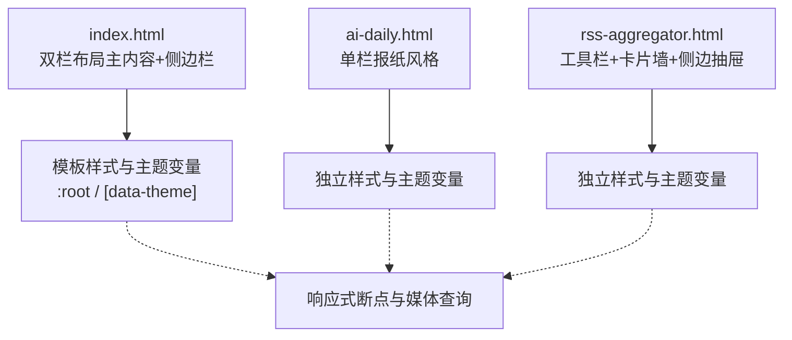
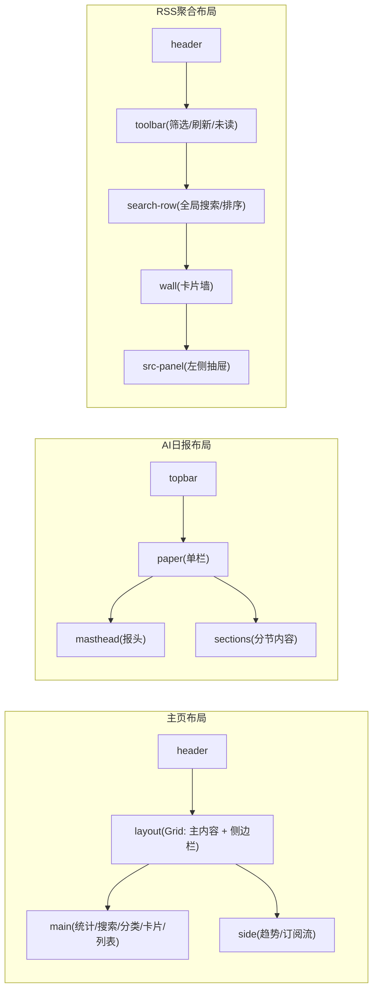
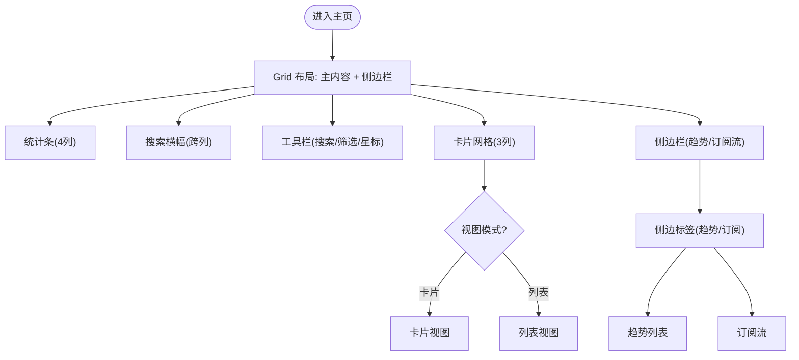
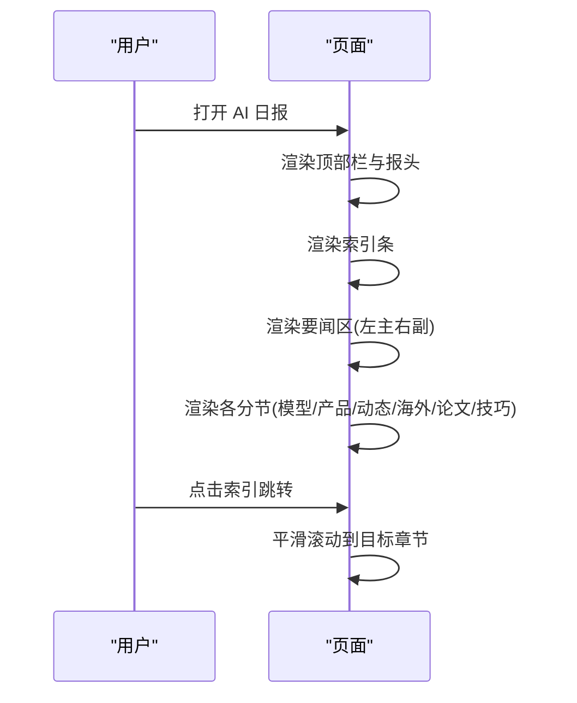
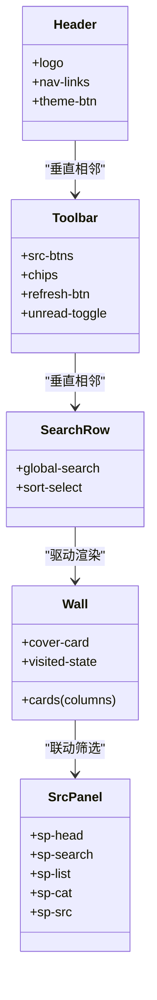
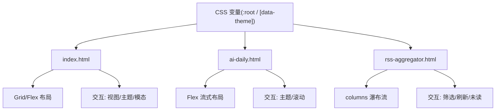

# 页面布局架构

<cite>
**本文引用的文件**
- [index.html](file://index.html)
- [ai-daily.html](file://ai-daily.html)
- [rss-aggregator.html](file://rss-aggregator.html)
- [template.html](file://template.html)
</cite>

## 目录
1. [简介](#简介)
2. [项目结构](#项目结构)
3. [核心组件](#核心组件)
4. [架构总览](#架构总览)
5. [详细组件分析](#详细组件分析)
6. [依赖关系分析](#依赖关系分析)
7. [性能考量](#性能考量)
8. [故障排查指南](#故障排查指南)
9. [结论](#结论)
10. [附录](#附录)

## 简介
本文件聚焦于站点“StarHub”的页面布局架构，系统性说明整体页面结构（头部、侧边栏、主内容区、页脚），并对比主页、AI日报与RSS聚合页面的布局差异与适配策略。文档重点阐述 CSS Grid 与 Flexbox 在复杂布局中的应用，提供响应式网格系统与弹性布局模式的最佳实践，并给出布局调试工具与性能优化技巧，以及多设备适配常见问题解决方案。最后强调布局的可维护性与扩展性设计原则。

## 项目结构
仓库包含三个主要前端页面：
- 主页 index.html：双栏布局（主内容 + 右侧边栏），含统计条、搜索横幅、分类标签、卡片/列表视图、趋势排行与订阅流等。
- AI 日报 ai-daily.html：单栏报纸风格排版，顶部导航、报头、索引、要闻区与分节内容。
- RSS 聚合 rss-aggregator.html：顶部工具栏、全局搜索、瀑布流卡片墙、左侧信源抽屉面板。

图表来源
- [index.html:17-74](file://index.html#L17-L74)
- [ai-daily.html:9-22](file://ai-daily.html#L9-L22)
- [rss-aggregator.html:9-32](file://rss-aggregator.html#L9-L32)

章节来源
- [index.html:17-74](file://index.html#L17-L74)
- [ai-daily.html:9-22](file://ai-daily.html#L9-L22)
- [rss-aggregator.html:9-32](file://rss-aggregator.html#L9-L32)

## 核心组件
- 头部（Header）
  - 主页：粘性定位、毛玻璃背景、品牌标识、导航链接与下拉菜单、操作按钮（切换视图、主题、导出/导入、刷新）。
  - AI 日报：简洁顶部栏（返回、主题切换）、报头区域（日期、标题、摘要信息带分隔线）。
  - RSS 聚合：粘性头部、品牌标识、导航、主题切换；工具栏位于头部下方，用于筛选、刷新、未读显示控制。
- 主内容区（Main）
  - 主页：统计条、搜索横幅、分类标签、卡片网格/列表、固定置顶区、趋势排行、订阅流。
  - AI 日报：分节内容（模型、产品、行业动态、海外热点、论文、技巧观点），每节含条目列表。
  - RSS 聚合：卡片墙（瀑布流 columns）、卡片详情、已读标记、分享与收藏。
- 侧边栏（Sidebar）
  - 主页：右侧固定高度滚动区域，包含“趋势”和“订阅流”两个可切换面板。
  - RSS 聚合：左侧抽屉式信源面板，支持折叠分类、搜索与多选。
- 页脚（Footer）
  - AI 日报：底部版权与数据源信息。
  - 主页/RSS：无显式页脚或仅通过工具提示/状态栏展示辅助信息。

章节来源
- [index.html:90-188](file://index.html#L90-L188)
- [index.html:190-563](file://index.html#L190-L563)
- [ai-daily.html:33-127](file://ai-daily.html#L33-L127)
- [rss-aggregator.html:39-100](file://rss-aggregator.html#L39-L100)
- [rss-aggregator.html:120-167](file://rss-aggregator.html#L120-L167)

## 架构总览
整体采用“页面级布局 + 组件化样式”的方式：
- 使用 CSS 自定义属性（:root 与 [data-theme="dark"]）集中管理颜色、字体、阴影等视觉令牌，便于明暗主题切换与一致性维护。
- 布局以 CSS Grid 为主构建宏观骨架（如双栏、统计条、卡片网格），Flexbox 用于局部对齐与弹性排列（如头部、工具栏、卡片内部）。
- 响应式通过媒体查询在不同断点调整列数、间距与层级顺序，保证移动端体验。

图表来源
- [index.html:172-188](file://index.html#L172-L188)
- [ai-daily.html:33-127](file://ai-daily.html#L33-L127)
- [rss-aggregator.html:39-100](file://rss-aggregator.html#L39-L100)
- [rss-aggregator.html:120-167](file://rss-aggregator.html#L120-L167)

## 详细组件分析

### 主页布局（index.html）
- 网格系统
  - 整体布局：使用 grid-template-columns 定义主内容区与固定宽度侧边栏，确保在大屏下信息密度与可读性平衡。
  - 统计条：四列均分布局，使用 border 分割替代边框容器，降低视觉噪音。
  - 卡片网格：默认三列，响应式降至两列/一列，配合行高与内边距保持节奏。
- 弹性布局
  - 头部：Flex 居中与对齐，导航链接与下拉菜单使用 inline-flex 与绝对定位组合。
  - 工具栏：搜索框、选择器、星标选择器横向排列，支持换行与自适应宽度。
- 交互与状态
  - 视图切换：卡片/列表视图通过类名切换实现不同渲染路径。
  - 主题切换：通过 data-theme 切换 CSS 变量，实现明暗主题一致体验。
  - 模态框：搜索与工作区弹窗，包含工具栏、结果列表与分页/重试状态。

图表来源
- [index.html:172-188](file://index.html#L172-L188)
- [index.html:190-327](file://index.html#L190-L327)
- [index.html:438-563](file://index.html#L438-L563)

章节来源
- [index.html:172-188](file://index.html#L172-L188)
- [index.html:190-327](file://index.html#L190-L327)
- [index.html:438-563](file://index.html#L438-L563)

### AI 日报布局（ai-daily.html）
- 单栏报纸风格
  - 顶部栏：返回按钮与主题切换，简洁不干扰阅读。
  - 报头：分隔线与日期信息，标题使用衬线字体增强质感。
  - 索引：分类索引条，快速跳转至对应章节。
  - 要闻区：左右分栏（主文 + 侧项），在小屏时堆叠为单列。
  - 分节内容：每节包含标题、计数与条目列表，条目支持高亮置顶。
- 响应式
  - 小屏下将左右分栏改为上下堆叠，索引与标题字号自适应缩放。

图表来源
- [ai-daily.html:33-127](file://ai-daily.html#L33-L127)
- [ai-daily.html:129-139](file://ai-daily.html#L129-L139)

章节来源
- [ai-daily.html:33-127](file://ai-daily.html#L33-L127)
- [ai-daily.html:129-139](file://ai-daily.html#L129-L139)

### RSS 聚合布局（rss-aggregator.html）
- 工具栏与搜索
  - 工具栏：信源筛选、分类芯片、刷新按钮、未读显示开关、返回顶部。
  - 搜索行：全局搜索输入框、清空按钮、排序选择器，支持高亮匹配信源。
- 卡片墙（瀑布流）
  - 使用 columns 实现瀑布流效果，卡片包含封面图、标题、摘要、来源与时间戳。
  - 已读标记：访问后添加左边框与标题样式变化，提升浏览效率。
- 左侧抽屉（信源面板）
  - 支持分类折叠、搜索过滤、全选/单选信源，实时影响卡片墙显示。
- 响应式
  - 小屏下封面高度缩减，卡片尺寸与间距自动调整。

图表来源
- [rss-aggregator.html:39-100](file://rss-aggregator.html#L39-L100)
- [rss-aggregator.html:120-167](file://rss-aggregator.html#L120-L167)
- [rss-aggregator.html:170-199](file://rss-aggregator.html#L170-L199)

章节来源
- [rss-aggregator.html:39-100](file://rss-aggregator.html#L39-L100)
- [rss-aggregator.html:120-167](file://rss-aggregator.html#L120-L167)
- [rss-aggregator.html:170-199](file://rss-aggregator.html#L170-L199)

## 依赖关系分析
- 样式依赖
  - 所有页面均通过 CSS 自定义属性定义主题与视觉令牌，避免硬编码颜色，提高可维护性。
  - 字体栈与图标统一使用 SVG 内联，减少外部资源依赖，提升加载性能。
- 布局依赖
  - 主页依赖 Grid 与 Flex 的组合，形成稳定的宏观骨架与灵活的微观排列。
  - AI 日报依赖单栏流式布局与分节结构，强调阅读节奏与信息层次。
  - RSS 聚合依赖 columns 瀑布流与抽屉面板，强调高密度信息与快速筛选。
- 交互依赖
  - 主题切换通过 data-theme 属性控制，所有页面保持一致行为。
  - 视图切换与筛选逻辑通过类名与属性驱动，避免复杂 DOM 操作。

图表来源
- [index.html:17-74](file://index.html#L17-L74)
- [ai-daily.html:9-22](file://ai-daily.html#L9-L22)
- [rss-aggregator.html:9-32](file://rss-aggregator.html#L9-L32)

章节来源
- [index.html:17-74](file://index.html#L17-L74)
- [ai-daily.html:9-22](file://ai-daily.html#L9-L22)
- [rss-aggregator.html:9-32](file://rss-aggregator.html#L9-L32)

## 性能考量
- 渲染性能
  - 使用 content-visibility 与 contain-intrinsic-size 优化大图卡片的可见性计算，减少重排与重绘。
  - 卡片悬停动画仅在精确指针设备启用，避免触控设备不必要的 GPU 开销。
- 网络与资源
  - 字体预连接（preconnect）减少首次渲染延迟。
  - 图标与装饰使用内联 SVG，避免额外请求。
- 可访问性与体验
  - 支持 prefers-reduced-motion，禁用不必要动画。
  - 焦点可见环与语义化标签提升键盘导航体验。

章节来源
- [index.html:369-436](file://index.html#L369-L436)
- [index.html:740-743](file://index.html#L740-L743)
- [rss-aggregator.html:152-167](file://rss-aggregator.html#L152-L167)

## 故障排查指南
- 主题切换无效
  - 检查是否设置了 data-theme 属性，确认 CSS 变量覆盖生效。
  - 验证 localStorage 读取与写入权限，必要时降级为系统偏好。
- 布局错乱
  - 检查 Grid 列定义与媒体查询断点，确保在小屏下正确降级。
  - 确认 Flex 子元素未设置固定宽度导致溢出。
- 卡片墙显示异常
  - 检查 columns 数量与最小列宽，确保在小屏下至少一列。
  - 验证图片加载失败时的降级方案（渐变背景 + 首字母）。
- 抽屉面板遮挡
  - 检查 z-index 层级与 body 类名切换逻辑，确保遮罩层正确显示。

章节来源
- [index.html:50-73](file://index.html#L50-L73)
- [index.html:687-743](file://index.html#L687-L743)
- [rss-aggregator.html:170-199](file://rss-aggregator.html#L170-L199)

## 结论
该站点通过统一的 CSS 变量与清晰的布局分层，实现了主页、AI 日报与 RSS 聚合页面的差异化布局需求。主页采用 Grid 与 Flex 组合的双栏布局，兼顾信息密度与可操作性；AI 日报采用单栏报纸风格，强调阅读体验；RSS 聚合采用卡片墙与抽屉面板，满足高密度信息筛选与浏览。响应式设计在各页面中均有体现，确保多设备适配。通过合理的性能优化与可访问性支持，提升了用户体验与可维护性。

## 附录
- 布局调试建议
  - 使用浏览器开发者工具的“布局”面板查看 Grid 与 Flex 结构。
  - 通过媒体查询断点测试不同屏幕尺寸下的表现。
  - 利用性能面板分析重排与重绘热点，优化动画与大图渲染。
- 最佳实践
  - 优先使用 CSS 变量管理主题与样式令牌。
  - 使用语义化 HTML 与 ARIA 属性提升可访问性。
  - 在小屏下简化布局，优先保证核心内容的可读性。