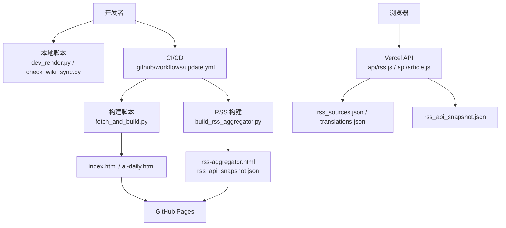
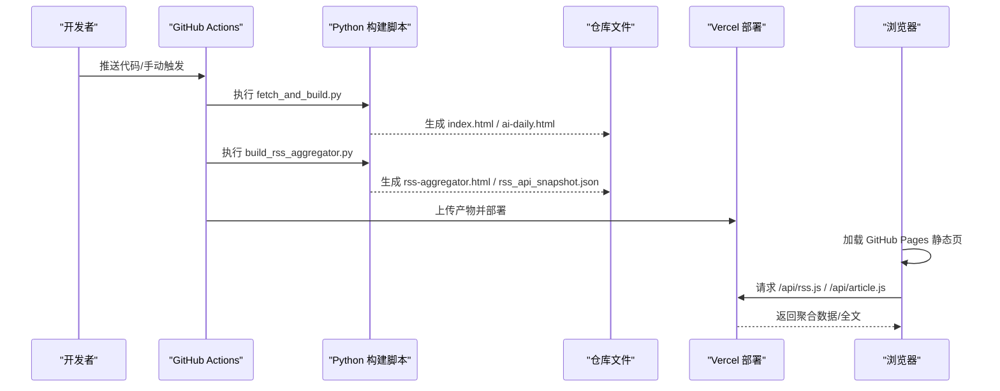
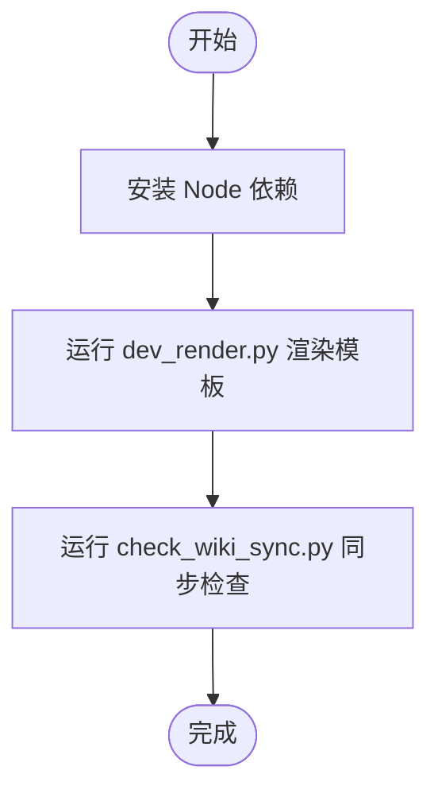
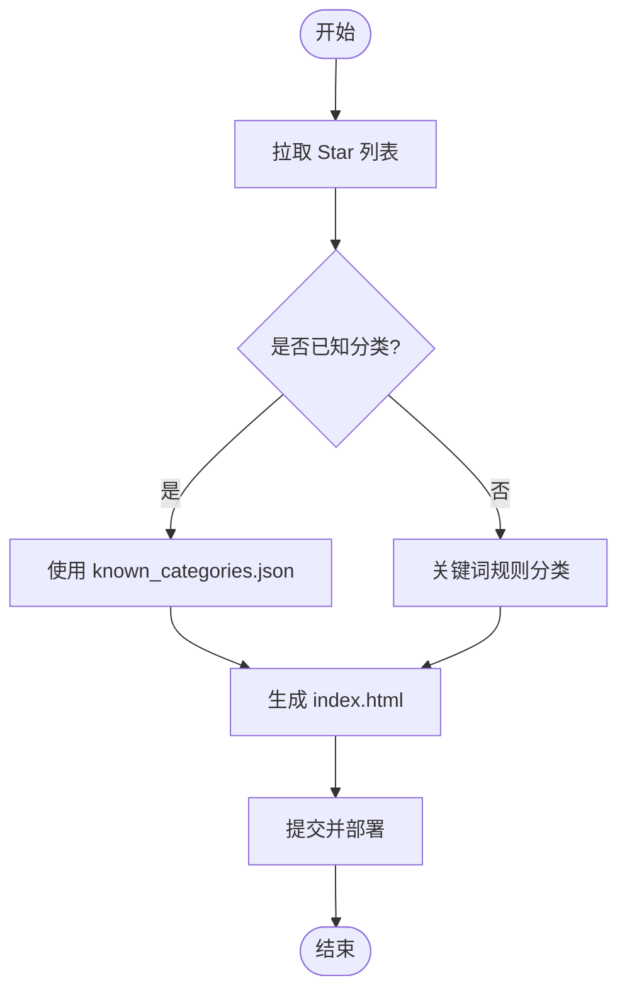
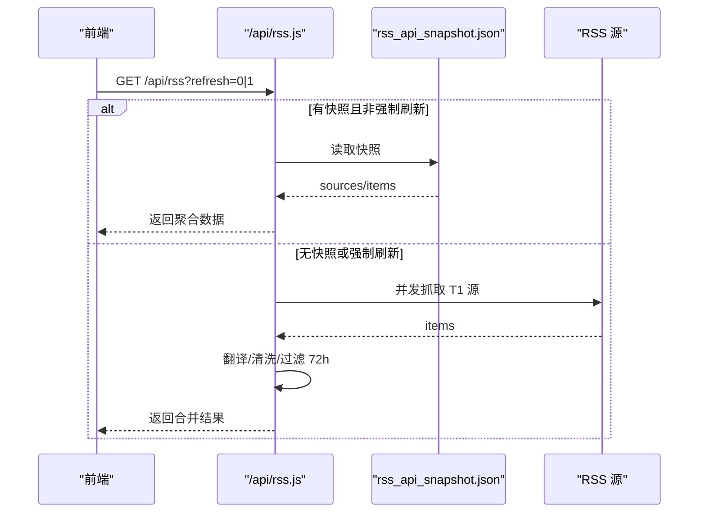
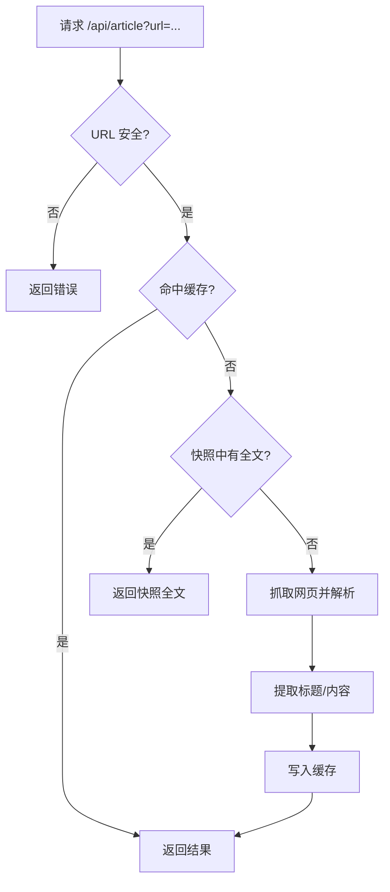
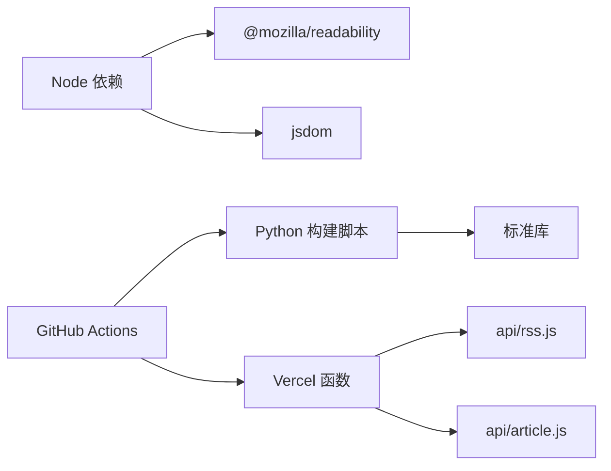

# 开发指南

<cite>
**本文引用的文件**
- [README.md](file://README.md)
- [fetch_and_build.py](file://fetch_and_build.py)
- [build_rss_aggregator.py](file://build_rss_aggregator.py)
- [dev_render.py](file://dev_render.py)
- [check_wiki_sync.py](file://check_wiki_sync.py)
- [.github/workflows/update.yml](file://.github/workflows/update.yml)
- [.github/workflows/build-log-summary.yml](file://.github/workflows/build-log-summary.yml)
- [.github/workflows/sync-agnes-env.yml](file://.github/workflows/sync-agnes-env.yml)
- [vercel.json](file://vercel.json)
- [package.json](file://package.json)
- [api/rss.js](file://api/rss.js)
- [api/article.js](file://api/article.js)
- [known_categories.json](file://known_categories.json)
- [descriptions_zh.json](file://descriptions_zh.json)
</cite>

## 更新摘要
**变更内容**
- 移除了已删除的 check_html.py 引用（该脚本已从项目中移除）
- 更新了辅助工具章节，反映简化后的开发环境
- 修正了依赖分析中的检查工具引用
- 更新了故障排查指南，移除对已删除脚本的引用
- 保持了核心开发工作流的完整性

## 目录
1. [简介](#简介)
2. [项目结构](#项目结构)
3. [核心组件](#核心组件)
4. [架构总览](#架构总览)
5. [详细组件分析](#详细组件分析)
6. [依赖分析](#依赖分析)
7. [性能考虑](#性能考虑)
8. [故障排查指南](#故障排查指南)
9. [结论](#结论)
10. [附录](#附录)

## 简介
本项目是一个"GitHub Star 收藏台"与"RSS 聚合器"的混合站点：
- Star 主线：自动拉取指定用户的 star 列表，智能分类、生成静态页面，托管在 GitHub Pages，并通过 GitHub Actions 定时更新。
- RSS 主线：多路 RSS/Atom 源抓取、翻译、清洗、聚合，提供服务端 API 与构建时快照，支持 72 小时历史累积与增量刷新。

在线地址见仓库说明；默认每日北京时间 09:00（UTC 01:00）全量构建，白天多次增量构建。

**章节来源**
- [README.md:1-22](file://README.md#L1-L22)

## 项目结构
- 入口与模板
  - index.html：由构建脚本生成的最终页面（Pages 入口）
  - template.html：页面模板，包含占位符供本地渲染工具注入数据
- 构建与自动化
  - fetch_and_build.py：Star 主线主构建脚本（仅标准库）
  - build_rss_aggregator.py：RSS 聚合器构建脚本（生成 rss-aggregator.html 与快照）
  - .github/workflows/update.yml：CI/CD 流水线（Python 环境、双调度、并发控制、Vercel 部署）
  - vercel.json：Serverless 函数清单与超时配置
- 辅助脚本
  - dev_render.py：本地从 index.html 提取数据并重新渲染 template.html，用于快速预览模板改动
  - check_wiki_sync.py：校验 Wiki 与源码事实一致性（关键常量、API、部署策略等）
- 数据与配置
  - known_categories.json：已知项目的稳定分类映射
  - descriptions_zh.json：项目中文描述缓存
  - package.json：Node 依赖（全文解析与 DOM 处理）
- API（Vercel Serverless）
  - api/rss.js：实时 RSS 聚合 API（含快照回退、滚动缓存、翻译、HTML 清洗）
  - api/article.js：全文提取 API（YouTube/GitHub/通用），带安全 URL 校验与缓存

**图表来源**
- [.github/workflows/update.yml:1-165](file://.github/workflows/update.yml#L1-L165)
- [fetch_and_build.py:1-811](file://fetch_and_build.py#L1-L811)
- [build_rss_aggregator.py:1-200](file://build_rss_aggregator.py#L1-L200)
- [api/rss.js:1-468](file://api/rss.js#L1-L468)
- [api/article.js:1-203](file://api/article.js#L1-L203)

**章节来源**
- [README.md:7-22](file://README.md#L7-L22)
- [vercel.json:1-15](file://vercel.json#L1-L15)
- [package.json:1-9](file://package.json#L1-L9)

## 核心组件
- Star 主线构建器（fetch_and_build.py）
  - 拉取用户 star 列表，按关键词规则与已知映射进行分类，生成前端所需数据与页面
  - 内置 AI 排行榜池、语言颜色、默认收藏、英文简介翻译回退等
- RSS 聚合构建器（build_rss_aggregator.py）
  - 抓取 RSS/Atom，翻译、清洗、去重，维护 72 小时历史，输出聚合页与快照
  - 支持翻译缓存、RSS 缓存、历史裁剪与信源质量审查
- 本地渲染工具（dev_render.py）
  - 从已构建的 index.html 抽取常量数据，替换到 template.html 占位符，快速验证模板样式/布局
- 检查工具
  - check_wiki_sync.py：确保 Wiki 文档与源码事实一致（调度、函数清单、字段链路、CORS 等）
- Vercel API
  - api/rss.js：聚合返回 JSON，优先使用构建时快照，失败回退滚动缓存；T1 实时抓取 + T2/T3 快照合并
  - api/article.js：全文提取（YouTube/GitHub/通用），安全 URL 校验、内存缓存、快照内容回退

**章节来源**
- [fetch_and_build.py:1-811](file://fetch_and_build.py#L1-L811)
- [build_rss_aggregator.py:1-200](file://build_rss_aggregator.py#L1-L200)
- [dev_render.py:1-51](file://dev_render.py#L1-L51)
- [check_wiki_sync.py:1-183](file://check_wiki_sync.py#L1-L183)
- [api/rss.js:1-468](file://api/rss.js#L1-L468)
- [api/article.js:1-203](file://api/article.js#L1-L203)

## 架构总览
系统分为"构建期"和"运行期"两条路径：
- 构建期（CI）
  - Python 环境执行 fetch_and_build.py 生成 index.html 等静态资源
  - 同时调用 build_rss_aggregator.py 生成 rss-aggregator.html 与 rss_api_snapshot.json
  - 提交变更并触发 Vercel 部署
- 运行期（浏览器/客户端）
  - 访问 GitHub Pages 获取静态页面
  - 通过 Vercel API 获取 RSS 聚合数据与全文内容
  - 页面内可切换主题、筛选排序、搜索、置顶收藏等

**图表来源**
- [.github/workflows/update.yml:27-165](file://.github/workflows/update.yml#L27-L165)
- [fetch_and_build.py:1-811](file://fetch_and_build.py#L1-L811)
- [build_rss_aggregator.py:1-200](file://build_rss_aggregator.py#L1-L200)
- [api/rss.js:289-468](file://api/rss.js#L289-L468)
- [api/article.js:125-203](file://api/article.js#L125-L203)

## 详细组件分析

### 本地开发与调试工作流
- 安装 Node 依赖（用于全文解析与 DOM 处理）
  - 在项目根目录执行包管理器安装命令以安装 package.json 中声明的依赖
- 本地渲染模板
  - 运行 dev_render.py：从现有 index.html 提取常量数据，替换 template.html 占位符，重新生成 index.html，便于快速预览模板改动
- 同步检查
  - 运行 check_wiki_sync.py：校验 Wiki 与源码事实一致性（调度、函数清单、字段链路、CORS、过期引用等）

**章节来源**
- [package.json:1-9](file://package.json#L1-L9)
- [dev_render.py:1-51](file://dev_render.py#L1-L51)
- [check_wiki_sync.py:1-183](file://check_wiki_sync.py#L1-L183)

### Star 主线：自动更新与分类
- 自动更新
  - GitHub Actions 定义双调度：UTC 21:00 全量构建；UTC 2/6/10/14 增量构建
  - 并发控制：cancel-in-progress 保证只运行最新一次
  - 构建入口：python fetch_and_build.py $MODE
  - 提交产物并推送到 main，随后部署到 Vercel
- 分类逻辑
  - 已知项目走 known_categories.json 保持稳定
  - 未知项目通过关键词规则分类（金融、工具、蒸馏、视频、前端、内容、学习、编程、助手、商业、Agent）
  - 英文简介翻译失败时保留原文，避免中断流程

**图表来源**
- [fetch_and_build.py:18-128](file://fetch_and_build.py#L18-L128)
- [fetch_and_build.py:130-811](file://fetch_and_build.py#L130-L811)
- [.github/workflows/update.yml:1-165](file://.github/workflows/update.yml#L1-L165)

**章节来源**
- [fetch_and_build.py:1-811](file://fetch_and_build.py#L1-L811)
- [known_categories.json:1-200](file://known_categories.json#L1-L200)
- [.github/workflows/update.yml:1-165](file://.github/workflows/update.yml#L1-L165)

### RSS 主线：聚合、翻译与快照
- 构建期
  - 抓取 RSS/Atom，翻译标题/摘要，深度清洗 HTML，维护 72 小时历史，输出 rss-aggregator.html 与 rss_api_snapshot.json
  - 缓存策略：translations.json、rss_cache.json、rss_history.json
- 运行期 API
  - /api/rss：优先返回构建时快照（72 小时累积），失败回退滚动缓存；T1 实时抓取 + T2/T3 快照合并；支持 meta 探测与 refresh 参数
  - /api/article：全文提取（YouTube/GitHub/通用），安全 URL 校验，内存缓存，快照内容回退

**图表来源**
- [api/rss.js:289-468](file://api/rss.js#L289-L468)
- [build_rss_aggregator.py:105-200](file://build_rss_aggregator.py#L105-L200)

**章节来源**
- [build_rss_aggregator.py:1-200](file://build_rss_aggregator.py#L1-L200)
- [api/rss.js:1-468](file://api/rss.js#L1-L468)

### 全文提取 API
- 安全校验：拒绝 localhost、内网 IP、非 http(s) 协议
- 提取策略：YouTube 专用、GitHub 专用、通用 Readability 提取
- 缓存：内存缓存 + 快照内容映射（rss_api_snapshot.json）
- CORS：允许跨域，支持 OPTIONS 预检

**图表来源**
- [api/article.js:55-203](file://api/article.js#L55-L203)

**章节来源**
- [api/article.js:1-203](file://api/article.js#L1-L203)

### 辅助脚本详解
- dev_render.py
  - 用途：本地预览模板改动，将 index.html 中的常量数据注入 template.html 占位符后重写 index.html
  - 注意：不参与 GitHub Actions 构建
- check_wiki_sync.py
  - 用途：校验 Wiki 与源码事实一致性，包括调度、函数清单、字段链路、CORS、过期引用、敏感令牌等

**章节来源**
- [dev_render.py:1-51](file://dev_render.py#L1-L51)
- [check_wiki_sync.py:1-183](file://check_wiki_sync.py#L1-L183)

## 依赖分析
- Python 环境
  - 仅标准库即可运行 Star 主线构建脚本
  - RSS 构建脚本同样基于标准库进行 XML 解析与文本处理
- Node.js 依赖
  - @mozilla/readability：通用全文提取
  - jsdom：DOM 解析与操作
- 部署配置
  - vercel.json 定义了 8 个 Serverless 函数及最大时长
  - GitHub Actions 使用 Python 3.11，并发取消旧任务，确保只运行最新一次

**图表来源**
- [package.json:1-9](file://package.json#L1-L9)
- [vercel.json:1-15](file://vercel.json#L1-L15)
- [.github/workflows/update.yml:27-52](file://.github/workflows/update.yml#L27-L52)

**章节来源**
- [package.json:1-9](file://package.json#L1-L9)
- [vercel.json:1-15](file://vercel.json#L1-L15)
- [.github/workflows/update.yml:1-165](file://.github/workflows/update.yml#L1-L165)

## 性能考虑
- 并发与超时
  - RSS 聚合 API 使用批次并发（CONCURRENCY=20），单源超时 5s，失败快速回退
  - 全文提取 API 设置 8s 超时，避免长时间阻塞
- 缓存策略
  - RSS API：完整响应缓存 5 分钟；每个源的滚动缓存；构建时快照（72 小时累积）
  - 全文 API：内存缓存（最多 500 项，TTL 4 小时）；快照内容映射
- 数据裁剪
  - 仅保留最近 72 小时文章，减少体积与传输成本
- 翻译优化
  - 多端点重试（Google/MyMemory/Dict），失败回退不中断流程
  - 翻译缓存降低重复请求

[本节为通用性能建议，无需特定文件引用]

## 故障排查指南
- 常见问题定位
  - Wiki 不一致：运行 check_wiki_sync.py，查看缺失或过时事实（如调度、函数清单、字段链路、CORS）
  - 构建失败：检查 GitHub Actions 日志，确认 Python 版本、环境变量、网络超时与并发冲突
- 调试技巧
  - 本地渲染：dev_render.py 快速验证模板改动
  - API 探测：/api/rss?meta=1 返回快照总条数，便于前端轮询检测新构建
  - 强制刷新：/api/rss?refresh=1 跳过缓存，重新抓取与合并
- 恢复策略
  - RSS 失败回退滚动缓存；无缓存则返回空
  - 全文提取失败返回结构化错误码（timeout/fetch_failed/extraction_failed）

**章节来源**
- [check_wiki_sync.py:1-183](file://check_wiki_sync.py#L1-L183)
- [api/rss.js:289-468](file://api/rss.js#L289-L468)
- [api/article.js:125-203](file://api/article.js#L125-L203)

## 结论
本项目通过"构建期快照 + 运行期 API"的双轨设计，兼顾了稳定性与实时性：
- Star 主线确保分类稳定与页面自动生成
- RSS 主线提供高可用聚合与全文能力
- 完善的辅助脚本与 CI/CD 保障开发效率与质量
建议在新增功能时优先复用现有缓存与快照机制，保持向后兼容与性能平衡。

[本节为总结性内容，无需特定文件引用]

## 附录

### 本地开发环境搭建步骤
- 安装 Python 3.11+（CI 使用 3.11，本地保持一致）
- 安装 Node.js 并执行包管理器安装 package.json 中的依赖
- 准备必要的环境变量（如需）
  - Vercel 部署需要 VERCEL_TOKEN、VERCEL_PROJECT_ID、VERCEL_ORG_ID（已在 CI 中配置）
  - 若需自定义域名，参考仓库说明在 GitHub Pages 设置

**章节来源**
- [.github/workflows/update.yml:27-31](file://.github/workflows/update.yml#L27-L31)
- [README.md:19-22](file://README.md#L19-L22)

### 代码贡献流程、分支管理与代码审查
- 分支策略
  - 主分支 main 由 CI 自动提交与推送；功能分支开发完成后合并至 main
- 代码审查
  - 建议在 PR 中附带：
    - 本地验证：dev_render.py、check_wiki_sync.py 通过
    - 影响范围：涉及 API 变更需测试 /api/rss 与 /api/article
    - 性能影响：关注并发、超时、缓存命中率
- 自动化检查
  - check_wiki_sync.py 确保 Wiki 与源码事实一致，避免过时信息进入文档

[本节为通用流程建议，无需特定文件引用]

### 测试策略与单元测试编写方法
- 测试目标
  - 分类规则：覆盖金融、工具、蒸馏、视频、前端、内容、学习、编程、助手、商业等关键词边界
  - 翻译回退：多端点失败时保留原文
  - 全文提取：YouTube/GitHub/通用三种路径均能正确提取或返回错误码
- 测试方法
  - 单元测试：针对 classify_new、stripHtml、sanitizeHtml、isSafeUrl 等纯函数
  - 集成测试：模拟 RSS 源与外部 API 超时/失败场景，验证回退与缓存行为
  - E2E：前端轮询 /api/rss?meta=1 检测新构建，验证合并与过滤逻辑

[本节为通用测试建议，无需特定文件引用]

### 添加新的分类规则
- 修改位置：fetch_and_build.py 中的分类函数
- 步骤
  - 在关键词集合中添加新规则，注意避免泛词子串误伤
  - 对已知项目可在 known_categories.json 中固定分类，保持稳定
  - 运行 check_wiki_sync.py 确保相关事实未被废弃
- 验证
  - 本地构建后检查分类是否正确
  - 观察 AI 排行榜与 Trending 是否受影响

**章节来源**
- [fetch_and_build.py:89-128](file://fetch_and_build.py#L89-L128)
- [known_categories.json:1-200](file://known_categories.json#L1-L200)
- [check_wiki_sync.py:107-162](file://check_wiki_sync.py#L107-L162)

### 扩展 RSS 源
- 修改位置：rss_sources.json（由构建脚本维护，通常通过上游数据或脚本生成）
- 步骤
  - 新增源时需确保 tier 分级合理（T1 实时抓取，T2/T3 快照）
  - 运行 build_rss_aggregator.py 生成快照并验证 72 小时历史
  - 检查 /api/rss 返回是否包含新源，必要时刷新缓存
- 验证
  - 观察 API 日志与缓存命中率

**章节来源**
- [build_rss_aggregator.py:105-200](file://build_rss_aggregator.py#L105-L200)
- [api/rss.js:348-468](file://api/rss.js#L348-L468)

### 定制界面主题
- 修改位置：template.html 中的 CSS 变量与样式
- 步骤
  - 调整颜色变量（品牌色、卡片背景、边框、文字等）
  - 使用 dev_render.py 快速预览效果
  - 确保在不同屏幕尺寸下的响应式表现
- 验证
  - 检查按钮、导航、卡片墙等组件在新主题下的可读性与交互

**章节来源**
- [dev_render.py:1-51](file://dev_render.py#L1-L51)
- [template.html:148-173](file://template.html#L148-L173)