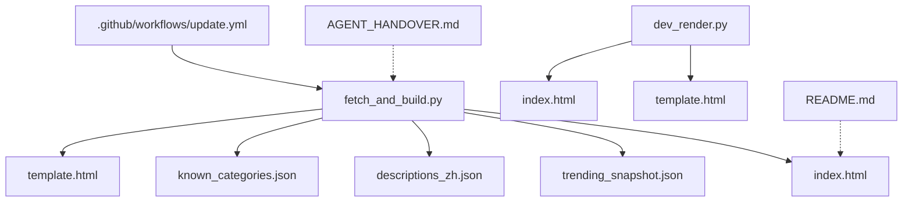
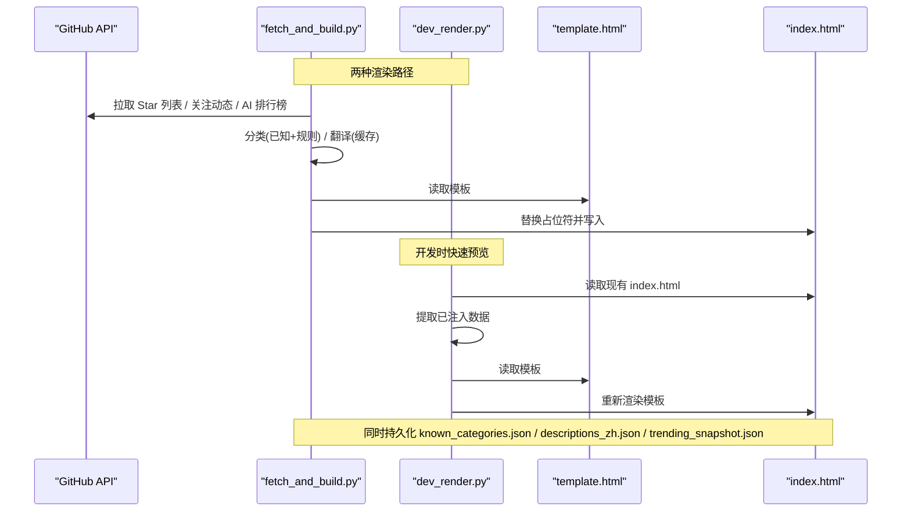
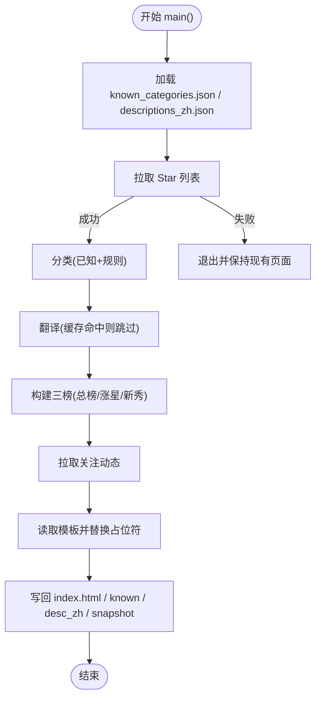
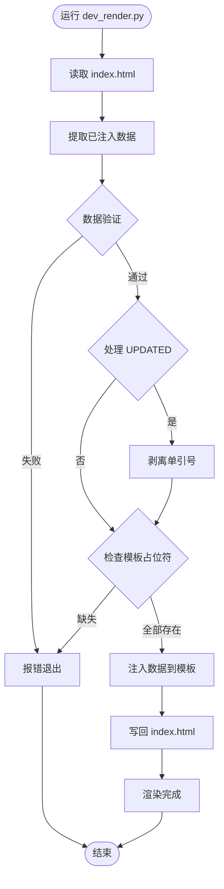
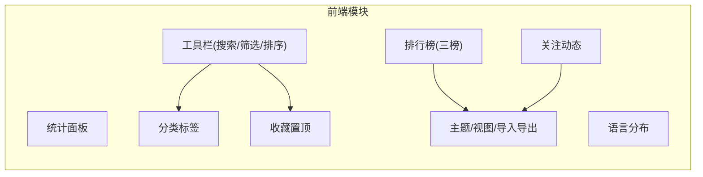
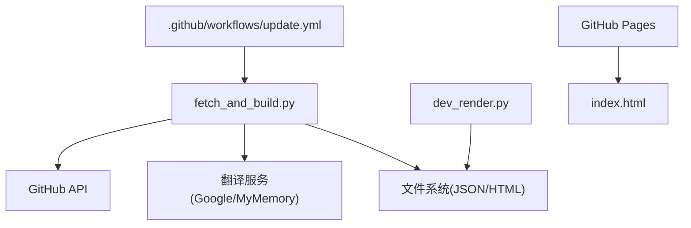

# 开发者指南

<cite>
**本文引用的文件**
- [fetch_and_build.py](file://fetch_and_build.py)
- [template.html](file://template.html)
- [index.html](file://index.html)
- [dev_render.py](file://dev_render.py)
- [known_categories.json](file://known_categories.json)
- [descriptions_zh.json](file://descriptions_zh.json)
- [.github/workflows/update.yml](file://.github/workflows/update.yml)
- [README.md](file://README.md)
- [AGENT_HANDOVER.md](file://AGENT_HANDOVER.md)
</cite>

## 目录
1. [简介](#简介)
2. [项目结构](#项目结构)
3. [核心组件](#核心组件)
4. [架构总览](#架构总览)
5. [详细组件分析](#详细组件分析)
6. [依赖关系分析](#依赖关系分析)
7. [性能与扩展性](#性能与扩展性)
8. [调试与测试](#调试与测试)
9. [代码规范与贡献流程](#代码规范与贡献流程)
10. [版本管理与发布策略](#版本管理与发布策略)
11. [故障排查](#故障排查)
12. [结论](#结论)

## 简介
本项目为 GitHub Star 收藏台，自动拉取指定用户的 Star 列表，进行智能分类、翻译与展示，生成单页静态站点并托管在 GitHub Pages。通过 GitHub Actions 定时任务每日更新，提供"我的收藏""每日 AI 排行榜""今日关注动态"三大模块。

## 项目结构
- fetch_and_build.py：数据抓取、分类、翻译、构建页面逻辑（仅使用 Python 标准库）
- dev_render.py：**新增** 本地开发工具，从现有 index.html 提取已注入数据重新渲染 template.html，实现快速预览模板更改
- template.html：前端模板（CSS/JS 内联），使用占位符注入数据
- index.html：构建产物（由脚本生成，勿手动修改）
- known_categories.json：已知项目的稳定分类映射
- descriptions_zh.json：非中文简介的中文翻译缓存
- trending_snapshot.json：星标快照，用于计算日增量
- .github/workflows/update.yml：GitHub Actions 定时任务与部署流程
- README.md：面向最终用户的使用说明
- AGENT_HANDOVER.md：接手文档，含架构要点与注意事项

**图表来源**
- [fetch_and_build.py:382-459](file://fetch_and_build.py#L382-L459)
- [dev_render.py:28-46](file://dev_render.py#L28-L46)
- [template.html:430-440](file://template.html#L430-L440)
- [.github/workflows/update.yml:16-41](file://.github/workflows/update.yml#L16-L41)

**章节来源**
- [README.md:7-17](file://README.md#L7-L17)
- [AGENT_HANDOVER.md:18-29](file://AGENT_HANDOVER.md#L18-L29)

## 核心组件
- 数据层
  - 拉取 Star 列表：分页获取用户已 Star 仓库
  - 拉取关注动态：聚合关注账号的公开事件（新建仓库、Star、关注人、PR）
  - 拉取 AI 排行榜：基于多 topic 搜索合并项目池，计算总榜、涨星榜、新秀榜
- 业务层
  - 分类：已知映射 + 关键词规则（未知项目）
  - 翻译：英文简介优先翻译为中文，失败保留原文；结果持久化避免重复调用
  - 快照：记录各项目星标数作为次日基线
- 表现层
  - 模板渲染：将数据注入 template.html 占位符，生成 index.html
  - 前端交互：搜索、筛选、排序、收藏置顶、主题切换、视图切换、导出导入
- **开发工具**
  - 快速预览：dev_render.py 支持从现有 index.html 提取数据并重新渲染模板，无需完整构建流程

**章节来源**
- [fetch_and_build.py:126-146](file://fetch_and_build.py#L126-L146)
- [fetch_and_build.py:185-283](file://fetch_and_build.py#L185-L283)
- [fetch_and_build.py:313-379](file://fetch_and_build.py#L313-L379)
- [fetch_and_build.py:382-459](file://fetch_and_build.py#L382-L459)
- [dev_render.py:28-46](file://dev_render.py#L28-L46)
- [template.html:430-440](file://template.html#L430-L440)

## 架构总览
系统采用"后端脚本 + 前端模板"的解耦设计：Python 脚本负责数据获取与处理，HTML 模板负责展示与交互。通过占位符注入实现前后端数据绑定，便于独立演进。新增的 dev_render.py 工具提供了快速预览能力，支持开发时的高效迭代。

**图表来源**
- [fetch_and_build.py:126-146](file://fetch_and_build.py#L126-L146)
- [fetch_and_build.py:185-283](file://fetch_and_build.py#L185-L283)
- [fetch_and_build.py:313-379](file://fetch_and_build.py#L313-L379)
- [fetch_and_build.py:382-459](file://fetch_and_build.py#L382-L459)
- [dev_render.py:28-46](file://dev_render.py#L28-L46)
- [template.html:430-440](file://template.html#L430-L440)

## 详细组件分析

### 主控制器 fetch_and_build.py
- 模块化职责
  - 数据获取：fetch_stars、fetch_following_events、build_trending
  - 分类与翻译：classify_new、translate_to_zh、_desc_zh
  - 时间与时区：_today_cn、_cn_date、_cn_time
  - 构建与输出：main（组装数据、注入模板、写回文件）
- 关键数据结构
  - CATS：分类定义（键、标签、颜色）
  - LANG_COLORS：语言色板
  - DEFAULT_FAVS：默认收藏集合
  - FALLBACK_DESC：空描述项目的中文补充
- 错误处理
  - 网络异常捕获并降级（如翻译失败保留原文、API 限流跳过）
  - 首次运行无快照时涨星榜回退显示"新上榜"
- 性能优化
  - 分页拉取与 sleep 控制速率
  - 翻译结果持久化避免重复请求
  - 去重合并 AI 项目池

**图表来源**
- [fetch_and_build.py:382-459](file://fetch_and_build.py#L382-L459)
- [fetch_and_build.py:126-146](file://fetch_and_build.py#L126-L146)
- [fetch_and_build.py:185-283](file://fetch_and_build.py#L185-L283)
- [fetch_and_build.py:313-379](file://fetch_and_build.py#L313-L379)

**章节来源**
- [fetch_and_build.py:19-47](file://fetch_and_build.py#L19-L47)
- [fetch_and_build.py:50-123](file://fetch_and_build.py#L50-L123)
- [fetch_and_build.py:126-146](file://fetch_and_build.py#L126-L146)
- [fetch_and_build.py:185-283](file://fetch_and_build.py#L185-L283)
- [fetch_and_build.py:313-379](file://fetch_and_build.py#L313-L379)
- [fetch_and_build.py:382-459](file://fetch_and_build.py#L382-L459)

### 本地开发工具 dev_render.py
- **功能特性**
  - 快速预览：从现有 index.html 提取已注入数据，重新渲染 template.html
  - 数据验证：校验 JSON 数据完整性，确保模板占位符存在
  - 特殊处理：处理 UPDATED 时间戳的单引号剥离等边界情况
  - 开发效率：无需完整构建流程即可预览模板更改效果
- **工作原理**
  - 解析 index.html 中的 JavaScript 常量定义
  - 提取 __DATA__、__CATS__、__LANGS__、__FAVS__、__UPDATED__、__TRENDING__、__FEED__ 等占位符数据
  - 将数据注入 template.html 对应位置
  - 生成新的 index.html 供浏览器直接预览
- **使用场景**
  - 前端 UI 调整时的快速验证
  - CSS 样式修改的效果预览
  - 模板布局优化的即时反馈

**图表来源**
- [dev_render.py:28-46](file://dev_render.py#L28-L46)

**章节来源**
- [dev_render.py:1-51](file://dev_render.py#L1-L51)

### 前端模板 template.html
- 架构特点
  - 单文件零外链：CSS/JS 全部内联，便于 GitHub Pages 直接托管
  - 占位符注入：__DATA__、__CATS__、__LANGS__、__FAVS__、__TRENDING__、__FEED__、__UPDATED__
- 功能模块
  - 统计面板：总数、分类数、语言数、收藏数
  - 语言分布：可视化条形图与图例
  - 工具栏：模糊搜索、语言筛选、排序、星标区间筛选
  - 分类标签：按分类过滤并高亮计数
  - 收藏置顶：本地存储 Set 管理，卡片/行视图切换
  - 每日 AI 排行榜：三榜切换（涨星/总榜/新秀），原因文案与增量显示
  - 今日关注动态：事件类型区分与时间排序
  - 主题与视图：明暗主题、卡片/列表视图、导出/导入 JSON
- 交互细节
  - 搜索即全局搜索，输入时自动清空其它筛选
  - 展开/收起简介，防 XSS 转义
  - 收藏状态持久化到 localStorage

**图表来源**
- [template.html:345-428](file://template.html#L345-L428)
- [template.html:430-800](file://template.html#L430-L800)

**章节来源**
- [template.html:1-319](file://template.html#L1-L319)
- [template.html:320-428](file://template.html#L320-L428)
- [template.html:430-800](file://template.html#L430-L800)

### 数据与配置
- known_categories.json：稳定分类映射，避免分类抖动；新项目经 classify_new 命中后追加
- descriptions_zh.json：翻译缓存，避免重复调用翻译接口
- trending_snapshot.json：星标快照，用于计算日增量（首次运行后不可删除）

**章节来源**
- [known_categories.json:1-116](file://known_categories.json#L1-L116)
- [descriptions_zh.json:1-121](file://descriptions_zh.json#L1-L121)
- [fetch_and_build.py:235-283](file://fetch_and_build.py#L235-L283)

## 依赖关系分析
- 运行时依赖
  - Python 标准库：json、os、re、sys、time、urllib.parse、urllib.request、datetime
  - GitHub API：Star 列表、Search API、Events API
  - 翻译服务：Google 翻译非官方端点 + MyMemory 兜底
- 外部资源
  - GitHub Pages：托管 index.html
  - GitHub Actions：定时任务执行构建与提交
- 耦合与内聚
  - 前后端通过占位符解耦，低耦合高内聚
  - 分类与翻译逻辑集中在脚本中，便于维护与扩展
  - dev_render.py 与 fetch_and_build.py 形成互补的开发工作流

**图表来源**
- [fetch_and_build.py:126-146](file://fetch_and_build.py#L126-L146)
- [fetch_and_build.py:185-283](file://fetch_and_build.py#L185-L283)
- [fetch_and_build.py:313-379](file://fetch_and_build.py#L313-L379)
- [dev_render.py:28-46](file://dev_render.py#L28-L46)
- [.github/workflows/update.yml:16-41](file://.github/workflows/update.yml#L16-L41)

**章节来源**
- [fetch_and_build.py:8-15](file://fetch_and_build.py#L8-L15)
- [dev_render.py:1-51](file://dev_render.py#L1-L51)
- [.github/workflows/update.yml:1-41](file://.github/workflows/update.yml#L1-L41)

## 性能与扩展性
- 性能特性
  - 分页与节流：分页拉取与 sleep 控制，避免触发速率限制
  - 缓存与去重：翻译结果与项目池去重，减少重复请求
  - 本地渲染：前端纯 JS 渲染，无额外框架开销
  - **快速预览**：dev_render.py 提供即时模板渲染，提升开发效率
- 扩展点
  - 新增分类：在 CATS 中添加条目，并在 classify_new 增加关键词规则
  - 新增翻译服务：在 translate_to_zh 中增加端点与解析逻辑
  - 新增前端功能：在 template.html 添加 UI 与交互逻辑，必要时在 main 中注入新占位符
  - **扩展开发工具**：可基于 dev_render.py 模式添加更多本地开发辅助工具

## 调试与测试

### 本地开发环境搭建
- 安装 Python 3（无需第三方包）
- 设置环境变量 GITHUB_TOKEN 或 GH_TOKEN（用于 Search/Events API）
- **完整构建**：运行 python fetch_and_build.py 生成 index.html，浏览器打开预览
- **快速预览**：运行 python dev_render.py 从现有 index.html 重新渲染模板，无需完整构建
- 注意：Windows 本地对 GitHub API 可能存在 SSL/TLS 问题，建议优先用 Actions 手动触发验证

**章节来源**
- [AGENT_HANDOVER.md:58-69](file://AGENT_HANDOVER.md#L58-L69)
- [dev_render.py:28-46](file://dev_render.py#L28-L46)

### 单元测试编写建议
- 分类规则测试：构造不同名称/描述/标签组合，断言 classify_new 返回预期分类
- 翻译降级测试：模拟翻译接口失败，断言返回 None 且保留原文
- 时间处理测试：验证 _today_cn/_cn_date/_cn_time 在不同 UTC 时间下的北京时间转换
- 快照与回退：首次运行无快照时，断言涨星榜回退逻辑正确
- **开发工具测试**：验证 dev_render.py 能正确提取和重新注入数据

[本节为通用指导，不直接分析具体文件]

### 集成测试策略
- 端到端验证：在 Actions 手动触发 workflow，检查 index.html 是否更新且内容合理
- 数据一致性：校验 known_categories.json 与 descriptions_zh.json 是否增量增长而非覆盖
- 排行榜合理性：检查总榜/涨星榜/新秀榜的数据是否符合预期阈值与排序
- **开发流程验证**：确认 dev_render.py 能快速预览模板更改而不影响生产数据

[本节为通用指导，不直接分析具体文件]

## 代码规范与贡献流程

### Python 编码标准
- 仅使用标准库，避免引入第三方依赖
- 函数职责单一，命名清晰（如 fetch_*、build_*、_cn_*）
- 错误处理统一 try/except，保证健壮性与可观测性（打印日志到 stderr）
- 常量集中定义（CATS、LANG_COLORS、DEFAULT_FAVS 等）
- **开发工具规范**：dev_render.py 保持简洁，专注于模板渲染任务

**章节来源**
- [fetch_and_build.py:8-15](file://fetch_and_build.py#L8-L15)
- [fetch_and_build.py:19-47](file://fetch_and_build.py#L19-L47)
- [fetch_and_build.py:382-459](file://fetch_and_build.py#L382-L459)
- [dev_render.py:1-51](file://dev_render.py#L1-L51)

### JavaScript 最佳实践
- 无框架、无外链，保持单文件可移植性
- 防 XSS：对用户输入与渲染内容进行转义
- 状态管理：使用局部 state 对象与 localStorage 持久化偏好
- 事件委托：统一监听点击事件，降低 DOM 操作复杂度

**章节来源**
- [template.html:430-800](file://template.html#L430-L800)

### Git 工作流程
- 修改源码（fetch_and_build.py/template.html），不要手改 index.html
- **开发流程**：使用 dev_render.py 快速预览模板更改，确认无误后再进行完整构建
- 提交前确保本地运行或通过 Actions 手动触发验证
- 提交信息遵循约定（如 chore: auto update stars YYYY-MM-DD）

**章节来源**
- [AGENT_HANDOVER.md:72-79](file://AGENT_HANDOVER.md#L72-L79)
- [.github/workflows/update.yml:31-41](file://.github/workflows/update.yml#L31-L41)

## 版本管理与发布策略
- 自动化发布：Actions 每天 UTC 01:00（北京 09:00）运行，生成并提交 index.html 及相关 JSON
- 并发控制：concurrency 组 starhub-update，cancel-in-progress=false，避免中断正在运行的任务
- 权限最小化：仅授予 contents: write，用于提交产物
- 版本回滚：可通过 git revert 恢复历史版本，但需确保 trending_snapshot.json 不被误删
- **开发工具版本**：dev_render.py 作为开发辅助工具，不影响生产构建流程

**章节来源**
- [.github/workflows/update.yml:1-41](file://.github/workflows/update.yml#L1-L41)
- [AGENT_HANDOVER.md:48-55](file://AGENT_HANDOVER.md#L48-L55)

## 故障排查
- 翻译失败
  - 现象：部分项目简介未翻译，保留原文
  - 原因：翻译接口限流或失败
  - 处理：等待重试或更换网络环境；查看 descriptions_zh.json 是否命中缓存
- 排行榜为空
  - 现象：新秀榜/涨星榜无数据
  - 原因：首次运行无快照或网络超时
  - 处理：等待次日快照生成；优先使用 Actions 手动触发
- 关注动态缺失
  - 现象：今日关注动态为空
  - 原因：GitHub Events API 限流或网络问题
  - 处理：检查 GITHUB_TOKEN 权限；确认 sleep 间隔足够；在 Actions 中重试
- 页面未更新
  - 现象：线上 index.html 未变化
  - 原因：代码未 push 或 Actions 未运行
  - 处理：确认提交并推送；在 Actions 页手动触发 workflow
- **开发工具问题**
  - 现象：dev_render.py 报错找不到常量或占位符
  - 原因：index.html 格式变更或模板占位符缺失
  - 处理：检查 PAIRS 配置中的常量名与占位符映射；确保 index.html 是由当前模板生成的

**章节来源**
- [fetch_and_build.py:54-86](file://fetch_and_build.py#L54-L86)
- [fetch_and_build.py:185-283](file://fetch_and_build.py#L185-L283)
- [fetch_and_build.py:313-379](file://fetch_and_build.py#L313-L379)
- [AGENT_HANDOVER.md:72-79](file://AGENT_HANDOVER.md#L72-L79)
- [dev_render.py:28-46](file://dev_render.py#L28-L46)

## 结论
本项目以简洁可靠的架构实现了 GitHub Star 收藏台的自动化构建与展示。通过模块化设计与清晰的职责划分，便于扩展与维护。**新增的 dev_render.py 开发工具显著提升了开发效率**，使模板更改能够快速预览，无需执行完整的构建流程。建议在后续迭代中继续强化错误处理与监控，完善测试覆盖，并持续优化性能与用户体验。