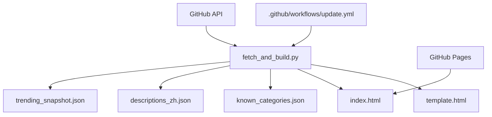
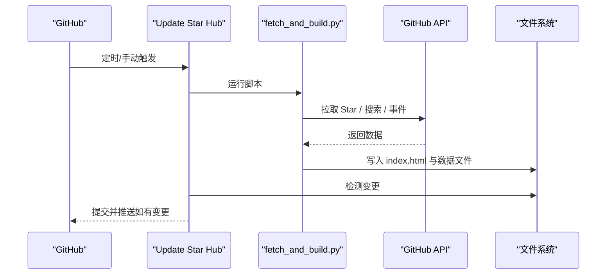
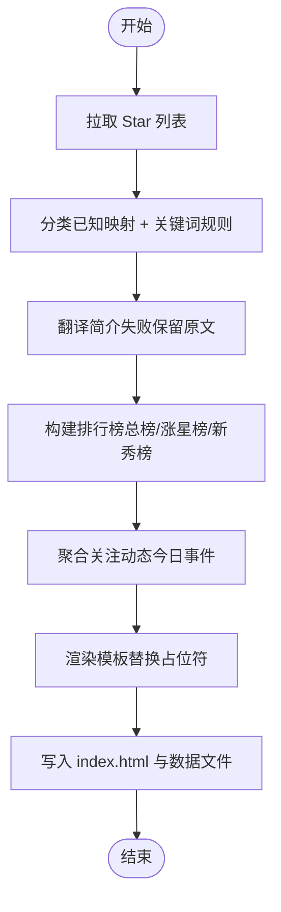

# 快速开始

<cite>
**本文引用的文件**
- [README.md](file://README.md)
- [fetch_and_build.py](file://fetch_and_build.py)
- [.github/workflows/update.yml](file://.github/workflows/update.yml)
- [template.html](file://template.html)
- [known_categories.json](file://known_categories.json)
- [descriptions_zh.json](file://descriptions_zh.json)
- [trending_snapshot.json](file://trending_snapshot.json)
- [AGENT_HANDOVER.md](file://AGENT_HANDOVER.md)
</cite>

## 目录
1. [简介](#简介)
2. [项目结构](#项目结构)
3. [环境要求](#环境要求)
4. [首次设置步骤（30 分钟上手）](#首次设置步骤30-分钟上手)
5. [GitHub Actions 配置与触发机制](#github-actions-配置与触发机制)
6. [核心组件与数据流](#核心组件与数据流)
7. [常见问题与排错](#常见问题与排错)
8. [本地测试与调试技巧](#本地测试与调试技巧)
9. [性能与限流建议](#性能与限流建议)
10. [结论](#结论)

## 简介
本项目是一个“GitHub Star 收藏台”：自动拉取指定用户的 Star 列表，智能分类、翻译简介，生成单页静态站点并托管在 GitHub Pages；同时提供每日 AI 排行榜与“今日关注动态”。通过 GitHub Actions 定时任务每天自动更新。

在线地址见仓库说明中的链接。

**章节来源**
- [README.md:1-22](file://README.md#L1-L22)

## 项目结构
- index.html：构建产物（由脚本自动生成，不要手改）
- template.html：页面模板（含占位符，供脚本注入数据）
- fetch_and_build.py：核心脚本（拉取 Star → 分类 → 翻译 → 生成 index.html）
- known_categories.json：已知项目的稳定分类映射
- descriptions_zh.json：非中文简介的中文翻译缓存
- trending_snapshot.json：AI 排行榜基线快照（用于计算涨星榜）
- .github/workflows/update.yml：GitHub Actions 定时/手动触发流程
- README.md：面向最终用户的说明
- AGENT_HANDOVER.md：开发者接手文档（含架构与注意事项）

**图表来源**
- [fetch_and_build.py:382-459](file://fetch_and_build.py#L382-L459)
- [.github/workflows/update.yml:16-41](file://.github/workflows/update.yml#L16-L41)

**章节来源**
- [README.md:7-21](file://README.md#L7-L21)
- [AGENT_HANDOVER.md:18-29](file://AGENT_HANDOVER.md#L18-L29)

## 环境要求
- Python 3.x（脚本仅依赖标准库，无需 pip install）
- GitHub 账号
- 仓库启用 GitHub Pages（默认分支为 gh-pages 或 main，按仓库设置）
- 可选：自定义域名（在仓库 Settings → Pages 中配置）

说明：
- 脚本使用 Python 标准库进行网络请求与 JSON 处理，无第三方依赖。
- 若需完整功能（搜索 API、事件流等），需在运行环境中提供有效的 GitHub Token。

**章节来源**
- [fetch_and_build.py:1-7](file://fetch_and_build.py#L1-L7)
- [README.md:19-21](file://README.md#L19-L21)
- [AGENT_HANDOVER.md:83-89](file://AGENT_HANDOVER.md#L83-L89)

## 首次设置步骤（30 分钟上手）
1) 准备仓库
- Fork 或克隆本仓库到你的 GitHub 账户下。
- 在仓库 Settings → Pages 中启用 GitHub Pages（选择默认分支）。

2) 创建并配置 GitHub Token
- 进入 GitHub → Settings → Developer settings → Personal access tokens → Tokens (classic)。
- 创建一个具有 repo 权限的 Token（用于读取公开信息、提交变更到仓库）。
- 将 Token 保存为 Secrets：
  - 仓库 Settings → Secrets and variables → Actions → New repository secret
  - 名称：GITHUB_TOKEN
  - 值：你的 Token
- 说明：Actions 会在工作流中自动注入该环境变量，脚本会从环境变量读取。

3) 首次运行（推荐用 Actions 手动触发）
- 进入仓库 Actions 页面，找到 Update Star Hub 工作流，点击 Run workflow 手动触发一次。
- 等待运行完成，确认状态为 success。

4) 验证部署结果
- 打开 Pages 地址（例如 https://yourusername.github.io/starhub/），检查是否显示 Star 列表、分类、排行榜与动态。
- 如未生效，检查 Actions 日志是否有错误。

5) 日常维护
- 如需修改页面样式，编辑 template.html；如需调整数据逻辑，编辑 fetch_and_build.py。
- 提交代码后，Actions 会在北京时间 09:00 自动运行，也可随时手动触发。

提示：
- 首次运行若无 trending_snapshot.json 或为空，排行榜会回退显示“新上榜”，后续会自动建立基线。
- 若本地网络不稳定，优先使用 Actions 手动触发以绕过本地网络问题。

**章节来源**
- [.github/workflows/update.yml:1-41](file://.github/workflows/update.yml#L1-L41)
- [fetch_and_build.py:436-459](file://fetch_and_build.py#L436-L459)
- [AGENT_HANDOVER.md:58-69](file://AGENT_HANDOVER.md#L58-L69)

## GitHub Actions 配置与触发机制
- 触发方式：
  - 定时：cron "0 1 * * *"（UTC 01:00 = 北京时间 09:00）
  - 手动：workflow_dispatch（Actions 页面可一键触发）
- 执行环境：ubuntu-latest，Python 3.11
- 权限：contents: write（用于提交生成的 index.html 与数据文件）
- 并发控制：concurrency 组 starhub-update，不取消正在运行的任务
- 关键步骤：
  - Checkout 代码
  - Setup Python
  - 运行 python fetch_and_build.py
  - 如有变更则 commit 并 push（index.html、known_categories.json、descriptions_zh.json、trending_snapshot.json）

**图表来源**
- [.github/workflows/update.yml:1-41](file://.github/workflows/update.yml#L1-L41)
- [fetch_and_build.py:382-459](file://fetch_and_build.py#L382-L459)

**章节来源**
- [.github/workflows/update.yml:1-41](file://.github/workflows/update.yml#L1-L41)
- [AGENT_HANDOVER.md:48-55](file://AGENT_HANDOVER.md#L48-L55)

## 核心组件与数据流
- 数据源：
  - Star 列表：/users/{USER}/starred
  - 搜索 API：/search/repositories（用于 AI 排行榜）
  - 关注动态：/users/{user}/events/public（聚合关注账号的今日事件）
- 数据处理：
  - 分类：已知映射 + 关键词规则（新项目）
  - 翻译：英文简介尝试翻译为中文，失败保留原文
  - 排行榜：总榜、涨星榜（对比昨日基线）、新秀榜（近 7 天新建）
- 输出：
  - index.html（静态页面，内联 CSS/JS，零外链）
  - known_categories.json（分类映射增量增长）
  - descriptions_zh.json（翻译缓存增量增长）
  - trending_snapshot.json（Star 快照，用于涨星榜）

**图表来源**
- [fetch_and_build.py:126-146](file://fetch_and_build.py#L126-L146)
- [fetch_and_build.py:185-283](file://fetch_and_build.py#L185-L283)
- [fetch_and_build.py:313-379](file://fetch_and_build.py#L313-L379)
- [fetch_and_build.py:382-459](file://fetch_and_build.py#L382-L459)

**章节来源**
- [fetch_and_build.py:126-459](file://fetch_and_build.py#L126-L459)
- [AGENT_HANDOVER.md:33-44](file://AGENT_HANDOVER.md#L33-L44)

## 常见问题与排错
- API 限流（匿名访问限制严格）
  - 现象：搜索 API 或事件接口频繁失败、返回空数据
  - 解决：提供 GITHUB_TOKEN（或 GH_TOKEN），并在 Actions 中配置为 Secret
  - 参考：脚本从环境变量读取 Token，未硬编码
- Token 权限不足
  - 现象：无法提交变更或读取受限资源
  - 解决：确保 Token 具备 repo 权限；Actions 需要 contents: write 权限
- 本地网络不稳定
  - 现象：本地运行部分接口失败（SSL/TLS 超时）
  - 解决：优先使用 Actions 手动触发；或在网络稳定的环境下运行
- 排行榜首次运行显示“新上榜”
  - 原因：缺少 trending_snapshot.json 基线
  - 解决：继续运行，脚本会逐步建立基线
- 翻译失败
  - 现象：简介未翻译，保留原文
  - 原因：翻译接口不可用或被限流
  - 解决：稍后重试；不影响基本功能

**章节来源**
- [fetch_and_build.py:157-169](file://fetch_and_build.py#L157-L169)
- [fetch_and_build.py:313-379](file://fetch_and_build.py#L313-L379)
- [AGENT_HANDOVER.md:60-79](file://AGENT_HANDOVER.md#L60-L79)

## 本地测试与调试技巧
- 本地运行
  - 设置环境变量：export GITHUB_TOKEN=ghp_xxx（或 GH_TOKEN）
  - 运行：python fetch_and_build.py
  - 查看产物：index.html（可直接浏览器打开预览）
- 调试要点
  - 观察控制台输出：拉取失败、翻译失败、事件拉取失败等
  - 检查数据文件：known_categories.json、descriptions_zh.json、trending_snapshot.json
  - 若本地网络差，改用 Actions 手动触发验证
- 页面交互验证
  - 搜索、语言筛选、星标区间、排序、视图切换、主题切换、收藏置顶、导出/导入备份
  - 这些交互由 template.html 中的前端脚本实现，可在浏览器 DevTools 中调试

**章节来源**
- [AGENT_HANDOVER.md:58-69](file://AGENT_HANDOVER.md#L58-L69)
- [template.html:430-800](file://template.html#L430-L800)

## 性能与限流建议
- 合理设置 Token：避免匿名访问导致的严格限流
- 保持请求间隔：脚本已对相邻请求加入 sleep，避免二级速率限制
- 减少不必要调用：尽量复用缓存（descriptions_zh.json、known_categories.json）
- 监控 Actions 日志：关注失败次数与耗时，必要时调整 per_page 或分页策略
- 排行榜优化：排除超大项目（避免巨头霸榜），聚焦活跃与新秀

**章节来源**
- [fetch_and_build.py:185-283](file://fetch_and_build.py#L185-L283)
- [fetch_and_build.py:313-379](file://fetch_and_build.py#L313-L379)
- [AGENT_HANDOVER.md:72-79](file://AGENT_HANDOVER.md#L72-L79)

## 结论
通过以上步骤，你可以在 30 分钟内完成基本部署并看到效果：启用 Pages、配置 Token、手动触发 Actions、验证页面内容。后续可通过 Actions 定时更新或手动触发来维护内容。遇到问题时，优先检查 Token 权限、网络稳定性与 Actions 日志。