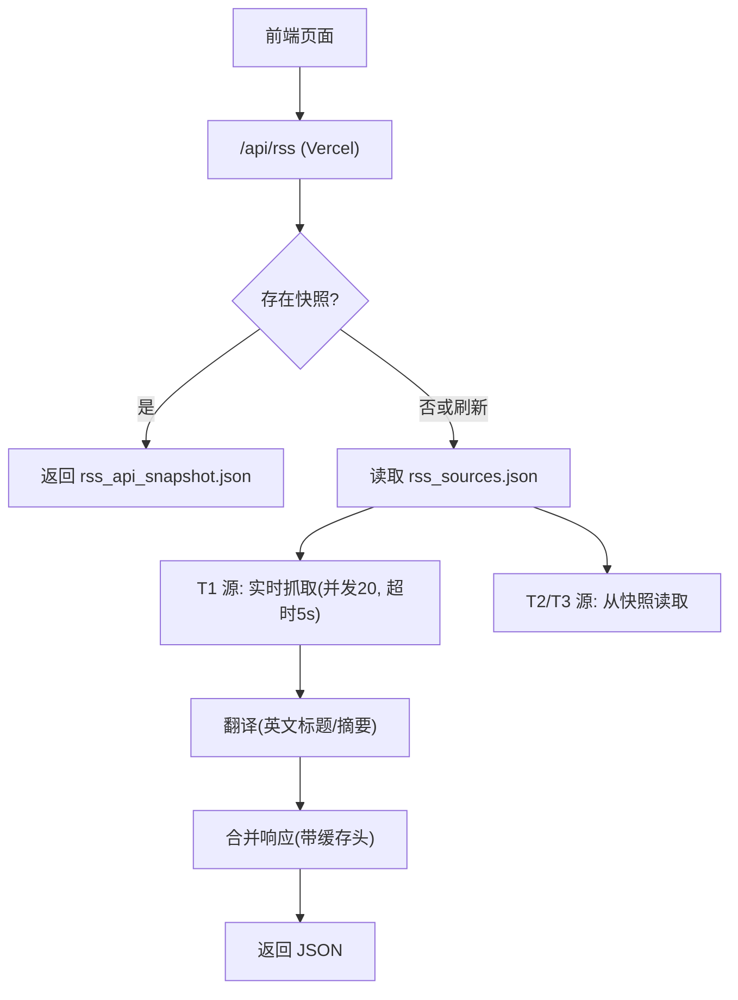
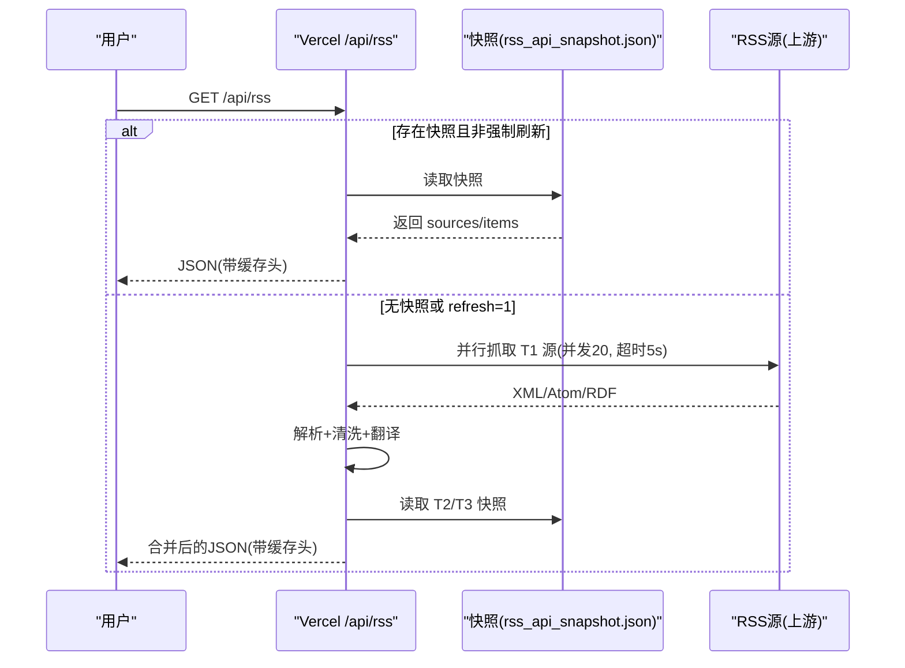
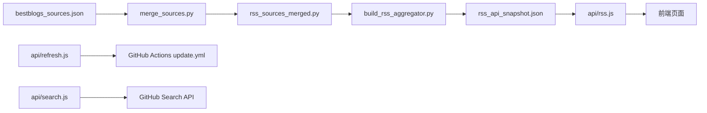

# RSS源配置管理

<cite>
**本文引用的文件**
- [bestblogs_sources.json](file://bestblogs_sources.json)
- [bestblogs_analysis.json](file://bestblogs_analysis.json)
- [build_rss_aggregator.py](file://build_rss_aggregator.py)
- [merge_sources.py](file://merge_sources.py)
- [rss_sources_merged.py](file://rss_sources_merged.py)
- [known_categories.json](file://known_categories.json)
- [api/rss.js](file://api/rss.js)
- [api/refresh.js](file://api/refresh.js)
- [api/search.js](file://api/search.js)
- [.github/workflows/update.yml](file://.github/workflows/update.yml)
- [fetch_and_build.py](file://fetch_and_build.py)
- [.vercelignore](file://.vercelignore)
- [t1_sources.json](file://t1_sources.json)
</cite>

## 更新摘要
**变更内容**
- 移除了三个OpenClaw相关的RSS源：hn_openclaw_9、openclaw_rel_13和openclaw_commits_14
- 这些源的移除可能是由于服务中断或可靠性问题导致的
- 更新了T1优先级源列表，移除了openclaw_commits_14
- 保持了系统的整体架构和数据完整性机制不变

## 目录
1. [简介](#简介)
2. [项目结构](#项目结构)
3. [核心数据模型](#核心数据模型)
4. [架构总览](#架构总览)
5. [详细组件分析](#详细组件分析)
6. [依赖关系分析](#依赖关系分析)
7. [性能与缓存策略](#性能与缓存策略)
8. [故障处理与健康检查](#故障处理与健康检查)
9. [分类管理与搜索](#分类管理与搜索)
10. [RSS源的增删改流程](#rss源的增删改流程)
11. [增量构建历史数据保护机制](#增量构建历史数据保护机制)
12. [结论](#结论)

## 简介
本文件为 RSS 源配置管理系统的数据模型文档，聚焦以下目标：
- 说明 bestblogs_sources.json 的 RSS 源配置结构与字段含义（URL、分类、颜色、来源等）
- 说明 bestblogs_analysis.json 的分析结果存储格式（总量、时间窗口统计、活跃度指标）
- 记录 RSS 源的添加、删除、更新流程（含分层抓取与合并）
- 解释 RSS 内容提取与解析的技术实现（XML/Atom/RSS 2.0、HTML 清洗、翻译）
- 说明健康检查与故障转移机制（滚动缓存、快照回退、超时控制）
- 提供聚合性能优化与缓存策略（并发、CDN、内存缓存、增量抓取）
- 记录分类管理与搜索功能（分类映射、关键词搜索、中英文组合查询）
- **新增**：详细说明增量构建历史数据保护机制，包括预构建索引、回退机制和源跳过策略

**最新更新**：系统已移除三个不稳定的OpenClaw相关源（hn_openclaw_9、openclaw_rel_13、openclaw_commits_14），以增强整体系统的稳定性和可靠性。同时扩展支持多个重要的国际新闻源，并增强了增量构建过程中的历史数据保护机制，确保即使某些源在增量构建中被跳过，也能正确维护72小时滚动窗口中的数据完整性。

## 项目结构
系统由"构建期静态快照 + 运行时 API"的双层架构组成：
- 构建期：Python 脚本抓取并生成 rss_api_snapshot.json（包含 72 小时累积历史），同时维护 rss_cache.json、translations.json、rss_history.json
- 运行期：Vercel Serverless Function 暴露 /api/rss，优先返回快照，失败时实时抓取 T1 源并合并 T2/T3 快照数据；/api/refresh 触发 GitHub Actions 重新构建；/api/search 提供仓库搜索能力



**图表来源**
- [api/rss.js:10-17](file://api/rss.js#L10-L17)
- [api/rss.js:203-273](file://api/rss.js#L203-L273)
- [api/rss.js:326-462](file://api/rss.js#L326-L462)
- [build_rss_aggregator.py:28-43](file://build_rss_aggregator.py#L28-L43)

**章节来源**
- [api/rss.js:1-468](file://api/rss.js#L1-L468)
- [build_rss_aggregator.py:28-43](file://build_rss_aggregator.py#L28-L43)

## 核心数据模型
### RSS 源配置模型（bestblogs_sources.json）
- 数组元素表示一个 RSS 源，关键字段如下：
  - key: 唯一标识（用于缓存键、去重、层级划分）
  - name: 显示名称
  - cat: 分类（如 cn_tech、tech、podcast、youtube 等）
  - url: RSS/Atom 订阅地址
  - color: 展示色值
  - source: 数据来源（如 bestblogs）
- 该文件作为 BestBlogs 公众号/播客/视频等信源集合，供 merge_sources.py 自动分类并入主配置。

**章节来源**
- [bestblogs_sources.json:1-800](file://bestblogs_sources.json#L1-L800)
- [merge_sources.py:27-35](file://merge_sources.py#L27-L35)

### 数据分析结果模型（bestblogs_analysis.json）
- 顶层 results 数组，每项为一个源的统计：
  - key/name/type: 源标识、名称、类型（wechat 等）
  - total/dated: 总条目数、有日期条目数
  - 72h/7d/30d: 各时间窗口内的条目计数
  - daily_avg: 日均发布量（基于统计区间计算）
  - newest: 最新发布日期
  - daily_30d: 近30天日均发布率
- 该文件用于评估源活跃度、决定 T1/T2 分层抓取优先级。

**章节来源**
- [bestblogs_analysis.json:1-800](file://bestblogs_analysis.json#L1-L800)

### 运行时源列表模型（rss_sources.json / rss_sources_merged.py）
- 运行时加载 rss_sources.json（由构建产物生成），每个源可包含 tier 字段（1/2/3）以区分抓取优先级：
  - tier=1: 高频源，实时抓取
  - tier=2: 中频源，增量抓取（构建期跳过阈值内）
  - tier=3: 低频源，默认从快照读取
- 分类依据 URL 模式（cn_tech/podcast/youtube/tech）或手动指定。

**章节来源**
- [merge_sources.py:38-56](file://merge_sources.py#L38-L56)
- [merge_sources.py:104-140](file://merge_sources.py#L104-L140)
- [build_rss_aggregator.py:3715-3747](file://build_rss_aggregator.py#L3715-L3747)

### 国际新闻源配置
系统现已包含多个重要的国际新闻源，显著扩展了全球新闻覆盖范围：

| 源名称 | Key | 分类 | URL | 优先级 | 特点 |
|--------|-----|------|-----|--------|------|
| 半岛电视台 | aljazeera_15 | news | https://www.aljazeera.com/xml/rss/all.xml | T1 | 阿拉伯语国际新闻，中东视角 |
| CNN | cnn_16 | news | https://news.google.com/rss/search?q=site:cnn.com&hl=en-US&gl=US&ceid=US:en | T1 | 英语国际新闻，美国视角 |
| 新华社 | xinhua_17 | news | https://plink.anyfeeder.com/newscn/whxw | T1 | 中文国际新闻，中国官方视角 |
| **德国之声DW** | **german_dw_18** | **news** | **https://rss.dw.com/rdf/rss-en-all** | **T1** | **德语RSS 1.0 RDF格式，欧洲视角** |
| **香港01本地** | **hk01_local_19** | **news** | **https://news.google.com/rss/search?q=site:hk01.com+香港&hl=zh-HK&gl=HK&ceid=HK:zh-Hant** | **T2** | **繁体中文本地新闻，香港视角** |
| **香港01国际** | **hk01_intl_22** | **news** | **https://news.google.com/rss/search?q=site:hk01.com+國際&hl=zh-HK&gl=HK&ceid=HK:zh-Hant** | **T2** | **繁体中文国际新闻，香港视角** |
| **朝日新闻** | **asahi_20** | **news** | **https://news.google.com/rss/search?q=site:asahi.com&hl=ja&gl=JP&ceid=JP:ja** | **T2** | **日语新闻，日本视角** |
| **NHK World** | **nhk_world_21** | **news** | **https://www3.nhk.or.jp/nhkworld/data/en/news/backstory/rss.xml** | **T1** | **英语国际新闻，日本公共广播** |

**章节来源**
- [build_rss_aggregator.py:455-462](file://build_rss_aggregator.py#L455-L462)

## 架构总览
系统采用"三层数据架构"：
- 静态快照层：构建时生成 rss_api_snapshot.json（72 小时累积），作为最可靠回退
- API 实时层：/api/rss 优先返回快照；必要时对 T1 源进行并发抓取并翻译
- 预热层：cron-job.org 定时调用 /api/rss 保持 CDN 缓存新鲜



**图表来源**
- [api/rss.js:326-462](file://api/rss.js#L326-L462)
- [api/rss.js:203-273](file://api/rss.js#L203-L273)
- [build_rss_aggregator.py:28-43](file://build_rss_aggregator.py#L28-L43)

## 详细组件分析
### RSS 内容提取与解析
- 支持 Atom 与 RSS 2.0：
  - Atom: 解析 <entry>/<title>/<link>/<summary>/<published>/<updated>
  - RSS: 解析 <item>/<title>/<link>/<description>/<content:encoded>/<pubDate>/<dc:date>
- HTML 清洗与安全：
  - stripHtml: 去除 CDATA、转义字符、script/style、未闭合标签片段
  - sanitizeHtml: 白名单标签过滤、移除危险属性与 javascript: 链接
  - deepCleanHtml: 移除广告/推广/二维码/关注引导等噪音块
- 摘要截断：按中文句号智能截断，限制长度避免过大负载

**章节来源**
- [api/rss.js:59-151](file://api/rss.js#L59-L151)
- [api/rss.js:153-199](file://api/rss.js#L153-L199)

### 翻译与本地化
- 针对英文源（特定 key 集合）进行标题/摘要翻译：
  - 多端点降级：Google Translate → MyMemory → Google dict-chrome
  - 翻译结果缓存至 translations.json，减少重复请求
- 翻译失败不影响整体聚合，仅保留原文

**章节来源**
- [api/rss.js:366-411](file://api/rss.js#L366-L411)
- [build_rss_aggregator.py:28-43](file://build_rss_aggregator.py#L28-L43)

### 分层抓取与合并
- T1 源：实时抓取（并发20，单源超时5s），结果进入滚动缓存
- T2/T3 源：从构建快照读取，减少网络开销
- 日期过滤：仅保留最近 72 小时的文章（快照可能缺日期则保留）
- 合并输出：统一字段 t/s/d（标题/摘要/日期），fullContent 可选

**章节来源**
- [api/rss.js:275-285](file://api/rss.js#L275-285)
- [api/rss.js:326-462](file://api/rss.js#L326-L462)
- [build_rss_aggregator.py:3715-3747](file://build_rss_aggregator.py#L3715-L3747)

### 国际新闻源处理增强
系统现在专门处理多个国际新闻源的多语言内容和不同RSS格式：

1. **多语言支持**：
   - 德语内容（德国之声DW）
   - 日语内容（朝日新闻、NHK World）
   - 繁体中文内容（香港01本地和国际）
   - 阿拉伯语内容（半岛电视台）
   - 英语内容（CNN、NHK World）
   - 中文内容（新华社）

2. **RSS格式兼容性**：
   - 支持RSS 1.0 RDF格式（德国之声DW）
   - 支持标准RSS 2.0格式
   - 支持Atom格式
   - 支持Google News RSS格式

3. **优先级提升**：
   - 重要国际新闻源设置为T1优先级（DW、NHK World）
   - 区域性新闻源设置为T2优先级（香港01、朝日新闻）
   - 确保实时更新和高可用性

4. **内容适配**：
   - 针对不同语言的RSS格式进行优化
   - 支持多种编码格式和字符集
   - 智能识别和分类不同地区的新闻内容

**章节来源**
- [build_rss_aggregator.py:455-462](file://build_rss_aggregator.py#L455-L462)

### 健康检查与故障转移
- 单源超时控制：AbortController + 定时器，快速失败
- 滚动缓存：成功抓取后写入内存 Map，失败时返回上次成功数据并标记 _stale
- 快照回退：当 API 不可用或无缓存时，返回空 items 并附带错误信息
- 元数据探测：/api/rss?meta=1 返回快照总条数，便于前端检测新构建

**章节来源**
- [api/rss.js:10-17](file://api/rss.js#L10-L17)
- [api/rss.js:203-273](file://api/rss.js#L203-L273)
- [api/rss.js:300-312](file://api/rss.js#L300-L312)

## 依赖关系分析


**图表来源**
- [merge_sources.py:59-156](file://merge_sources.py#L59-L156)
- [build_rss_aggregator.py:28-43](file://build_rss_aggregator.py#L28-L43)
- [api/rss.js:326-462](file://api/rss.js#L326-L462)
- [api/refresh.js:1-65](file://api/refresh.js#L1-L65)
- [api/search.js:1-177](file://api/search.js#L1-L177)

**章节来源**
- [merge_sources.py:59-156](file://merge_sources.py#L59-L156)
- [build_rss_aggregator.py:28-43](file://build_rss_aggregator.py#L28-L43)
- [api/rss.js:326-462](file://api/rss.js#L326-L462)
- [api/refresh.js:1-65](file://api/refresh.js#L1-L65)
- [api/search.js:1-177](file://api/search.js#L1-L177)

## 性能与缓存策略
- 并发抓取：Promise.allSettled 分批执行，CONCURRENCY=20，单源超时 5s
- 服务端缓存：
  - 完整响应缓存 fullCache（TTL=5分钟）
  - 滚动缓存 rollingCache（每源独立，失败回退）
  - 翻译缓存 translations.json（持久化）
- 构建期缓存：
  - rss_cache.json（RSS 抓取缓存，TTL=30分钟）
  - rss_history.json（72小时文章历史，用于快照）
- CDN 缓存：响应头 Cache-Control: public, max-age=300；刷新时 no-store
- 增量抓取：T2/T3 在构建期按阈值跳过（T2: 1h, T3: 2h）

**章节来源**
- [api/rss.js:10-17](file://api/rss.js#L10-L17)
- [api/rss.js:314-323](file://api/rss.js#L314-L323)
- [build_rss_aggregator.py:28-43](file://build_rss_aggregator.py#L28-L43)
- [build_rss_aggregator.py:3715-3747](file://build_rss_aggregator.py#L3715-L3747)
- [.vercelignore:1-2](file://.vercelignore#L1-L2)

## 故障处理与健康检查
- 超时与异常：
  - fetchOne 使用 AbortController 控制超时，捕获 HTTP 状态码与网络异常
  - 失败时返回 _error 字段，便于前端提示
- 回退策略：
  - 优先返回快照；若无快照或 refresh=1，则尝试实时抓取
  - 单源失败不影响其他源，最终合并结果仍可用
- 安全清洗：
  - 深度清洗广告/推广/二维码/跳转链接，防止恶意内容注入
  - 仅允许白名单 HTML 标签，移除危险属性

**章节来源**
- [api/rss.js:203-273](file://api/rss.js#L203-L273)
- [api/rss.js:123-151](file://api/rss.js#L123-L151)

## 分类管理与搜索
- 分类管理：
  - BestBlogs 源按 URL 模式自动分类（cn_tech/podcast/youtube/tech）
  - known_categories.json 提供仓库到分类的映射（辅助工具）
- 搜索功能：
  - /api/search 支持中文→英文翻译，组合查询（中文 OR 英文）
  - 分页 per_page=30，page≤34；排序支持 best-match/stars/updated
  - 结果缓存 10 分钟，翻译缓存 1 小时

**章节来源**
- [merge_sources.py:27-35](file://merge_sources.py#L27-L35)
- [known_categories.json:1-224](file://known_categories.json#L1-L224)
- [api/search.js:30-73](file://api/search.js#L30-L73)
- [api/search.js:75-91](file://api/search.js#L75-L91)
- [api/search.js:129-171](file://api/search.js#L129-L171)

## RSS源的增删改流程
### 添加新源
1. 在 bestblogs_sources.json 中添加新项（key/name/cat/url/color/source）
2. 运行 merge_sources.py 将 BestBlogs 源分类并合并入 rss_sources_merged.py
3. 构建时 build_rss_aggregator.py 抓取并生成 rss_api_snapshot.json
4. 部署后 /api/rss 将优先返回快照，T1 源实时抓取

**章节来源**
- [bestblogs_sources.json:1-800](file://bestblogs_sources.json#L1-L800)
- [merge_sources.py:82-140](file://merge_sources.py#L82-L140)
- [build_rss_aggregator.py:28-43](file://build_rss_aggregator.py#L28-L43)
- [api/rss.js:326-462](file://api/rss.js#L326-L462)

### 删除源
1. 从 bestblogs_sources.json 移除对应项
2. 重新运行 merge_sources.py 更新 rss_sources_merged.py
3. 重新构建生成新的快照

**章节来源**
- [merge_sources.py:97-100](file://merge_sources.py#L97-L100)
- [merge_sources.py:146-147](file://merge_sources.py#L146-L147)

### 更新源（URL/分类/颜色）
1. 修改 bestblogs_sources.json 中对应字段
2. 重新运行 merge_sources.py 和构建流程
3. 通过 /api/refresh 触发 GitHub Actions 重新构建（需认证）

**章节来源**
- [api/refresh.js:1-65](file://api/refresh.js#L1-L65)

### 新增国际新闻源流程
添加国际新闻源的特殊考虑：

1. **源配置**：
   - 设置合适的分类（通常为"news"）
   - 配置正确的RSS URL（支持RSS 1.0 RDF格式）
   - 设置适当的颜色标识
   - 确定优先级（T1/T2/T3）

2. **优先级设置**：
   - 重要国际新闻源通常设置为T1优先级（如DW、NHK World）
   - 区域性新闻源设置为T2优先级（如香港01、朝日新闻）
   - 确保实时更新和高可用性

3. **多语言处理**：
   - 确认源支持UTF-8编码
   - 验证RSS格式兼容性（RSS 1.0 RDF、RSS 2.0、Atom）
   - 测试翻译功能
   - 验证不同语言内容的正确解析

4. **特殊格式支持**：
   - RSS 1.0 RDF格式需要特殊处理
   - Google News RSS格式需要参数解析
   - 多语言内容需要适当的字符集处理

**章节来源**
- [build_rss_aggregator.py:455-462](file://build_rss_aggregator.py#L455-L462)

## 增量构建历史数据保护机制

### 机制概述
系统实现了强大的增量构建历史数据保护机制，确保在增量构建过程中即使某些源被跳过，也能正确维护72小时滚动窗口中的数据完整性。该机制包含预构建索引、回退机制和智能源跳过策略。

### 预构建历史索引
在增量构建模式下，系统会预先构建历史数据索引，以提高性能并确保数据完整性：

```python
# 增量模式：预建历史索引（source_key → items），避免每源遍历全部历史
_hist_by_key = {}
if mode == "incremental":
    for _v in _rss_history.values():
        _sk = _v.get("source_key", "")
        if _sk not in _hist_by_key:
            _hist_by_key[_sk] = []
        _hist_by_key[_sk].append({
            "link": _v["link"], "pub_date": _v.get("pub_date", ""),
            "title": _v.get("title", ""), "title_zh": _v.get("title_zh", ""),
            "summary": _v.get("summary", ""), "summary_zh": _v.get("summary_zh", ""),
            "full_content": _v.get("full_content", ""), "image": _v.get("image", ""),
        })
```

**章节来源**
- [build_rss_aggregator.py:3827-3840](file://build_rss_aggregator.py#L3827-L3840)

### 智能源跳过策略
系统根据源的优先级（tier）实施不同的跳过策略：

| 源级别 | 跳过条件 | 行为 | 数据保护 |
|--------|----------|------|----------|
| T1 | 始终跳过 | 不执行网络请求 | 从历史索引填充数据 |
| T2 | 距上次抓取 < 1小时 | 跳过抓取 | 从历史索引填充数据 |
| T3 | 距上次抓取 < 2小时 | 跳过抓取 | 从历史索引填充数据 |

```python
# 增量模式跳过规则（按 tier 分级阈值）：
# 1. T1 源始终跳过（由 api/rss.js 实时抓取）
# 2. T2 源：距上次抓取 < 1h 跳过
# 3. T3 源：距上次抓取 < 2h 跳过
if mode == "incremental":
    if tier == 1:
        skipped_count += 1
        # 从历史索引填充 T1 源（增量构建不抓取 T1，但不能传空 items 导致历史数据流失）
        sources_with_items.append({
            "key": key, "name": src["name"], "cat": src["cat"],
            "color": src["color"], "items": _hist_by_key.get(key, []),
            "tier": tier,
        })
        continue
```

**章节来源**
- [build_rss_aggregator.py:3847-3860](file://build_rss_aggregator.py#L3847-L3860)

### 回退机制
当源被跳过时，系统会从预构建的历史索引中获取数据，确保不会出现空数据的情况：

```python
prev = last_fetch.get(key)
if prev:
    try:
        prev_time = datetime.datetime.fromisoformat(prev)
        threshold = 1 * 3600 if tier <= 2 else 2 * 3600
        if (now - prev_time).total_seconds() < threshold:
            skipped_count += 1
            # 从历史索引填充跳过的 T2/T3 源（避免空 items 导致历史数据流失）
            sources_with_items.append({
                "key": key, "name": src["name"], "cat": src["cat"],
                "color": src["color"], "items": _hist_by_key.get(key, []),
                "tier": tier,
            })
            continue
    except (ValueError, TypeError):
        pass
```

**章节来源**
- [build_rss_aggregator.py:3861-3876](file://build_rss_aggregator.py#L3861-L3876)

### 72小时滚动窗口维护
系统通过 `_accumulate_history` 函数维护72小时滚动窗口，确保历史数据的时效性和完整性：

```python
def _accumulate_history(sources_with_items):
    """将新抓取的文章合并到 72 小时历史，裁剪过期内容，返回重组后的 sources_with_items"""
    now_bj = _now_bj()
    cutoff = now_bj.replace(tzinfo=None) - datetime.timedelta(hours=RSS_HISTORY_HOURS)
    
    # 合并新文章（按 link 去重，新数据覆盖旧数据）
    # 裁剪超过 72 小时的旧文章
    # 按源重组，更新相对时间
```

**章节来源**
- [build_rss_aggregator.py:105-245](file://build_rss_aggregator.py#L105-L245)

### 快照元数据管理
系统通过 `last_fetch` 元数据跟踪每个源的最后抓取时间，用于增量构建的跳过决策：

```python
# 保存 last_fetch 元数据
meta = {"last_fetch": last_fetch}
_save_api_snapshot(sources_with_items, meta=meta)

# 增量模式时加载 last_fetch
if mode == "incremental":
    last_fetch = _load_snapshot_meta()
```

**章节来源**
- [build_rss_aggregator.py:3913-3914](file://build_rss_aggregator.py#L3913-L3914)
- [build_rss_aggregator.py:3817-3820](file://build_rss_aggregator.py#L3817-L3820)

### 构建调度机制
GitHub Actions 工作流定义了全量和增量构建的调度策略：

| 构建类型 | 调度时间 | 目的 | 效果 |
|----------|----------|------|------|
| 全量构建 | UTC 21:00 (北京 05:00) | 每日完整重建 | 确保数据完整性 |
| 增量构建 | UTC 2/6/10/14 (北京 10/14/18/22) | 白天增量更新 | 提高构建效率 |

**章节来源**
- [.github/workflows/update.yml:4-8](file://.github/workflows/update.yml#L4-L8)

### 增量构建优势
1. **性能优化**：减少不必要的网络请求，提高构建速度
2. **数据完整性**：通过历史索引确保不会丢失任何历史数据
3. **资源节约**：降低服务器负载和网络带宽消耗
4. **容错性**：即使某些源暂时不可用，也能提供完整的历史数据

**章节来源**
- [build_rss_aggregator.py:3827-3876](file://build_rss_aggregator.py#L3827-L3876)

## 结论
本系统通过"快照+实时"的双层架构，实现了高可用、低延迟的 RSS 聚合服务：
- 数据模型清晰：bestblogs_sources.json 定义源配置，bestblogs_analysis.json 提供活跃度分析
- 技术实现稳健：XML/Atom/RDF 解析、HTML 清洗、多端点翻译、并发抓取与超时控制
- 性能优化充分：CDN 缓存、内存缓存、增量抓取、72 小时历史裁剪
- 故障转移完善：滚动缓存、快照回退、错误标记与降级
- 分类与搜索完备：URL 模式分类、中英文组合查询、分页与排序

**最新更新亮点**：
- **稳定性增强**：移除了三个不稳定的OpenClaw相关源（hn_openclaw_9、openclaw_rel_13、openclaw_commits_14），提升了系统整体可靠性
- **国际新闻覆盖扩展**：新增德国之声DW（RSS 1.0 RDF格式）、NHK World、朝日新闻，以及将香港01拆分为本地和国际两个独立信源
- **多语言能力增强**：支持德语、日语、繁体中文、阿拉伯语、英语、中文等多种语言内容的抓取和处理
- **RSS格式兼容性提升**：新增对RSS 1.0 RDF格式的支持，提升了与国际新闻源的兼容性
- **区域化新闻优化**：针对亚洲地区新闻源进行了专门的优先级设置和内容优化
- **全球化视野**：为用户提供来自德国、日本、香港、中东、美国等不同地区和视角的新闻内容
- **增量构建保护增强**：实现了强大的增量构建历史数据保护机制，确保即使在源跳过的情况下也能维护72小时滚动窗口的数据完整性

**建议后续优化方向**：
- 增加源健康监控与告警（基于 _stale/_error 统计）
- 扩展分类体系（引入 more granular tags）
- 增强翻译质量（多模型集成与反馈学习）
- 优化大源抓取策略（按活跃度动态调整并发与超时）
- 增加更多国际新闻源（BBC、Reuters、AP News等）
- 改进多语言内容识别和分类算法
- 增强RSS格式兼容性（支持更多变体格式）
- 优化亚洲地区新闻源的抓取频率和质量
- 进一步完善增量构建的监控和日志记录
- 扩展历史数据保护的适用范围到其他构建场景