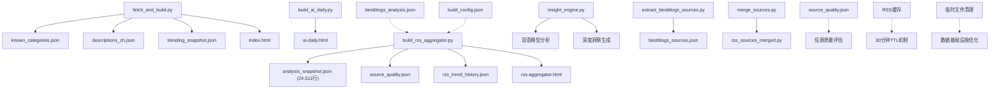
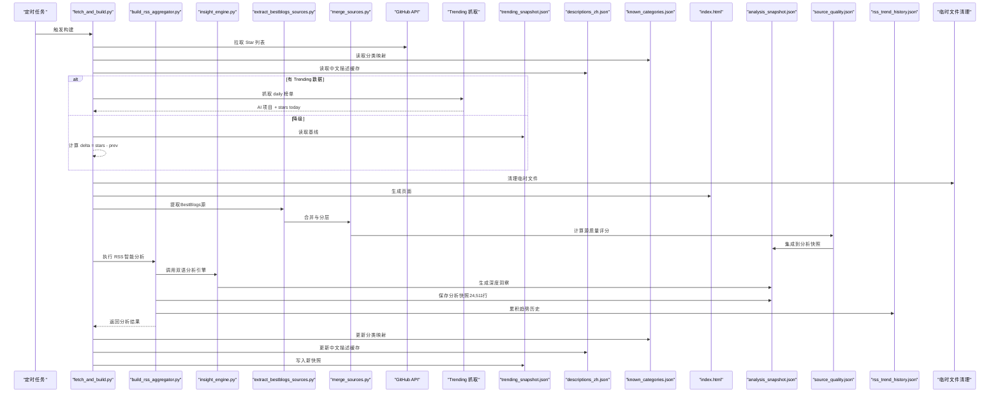
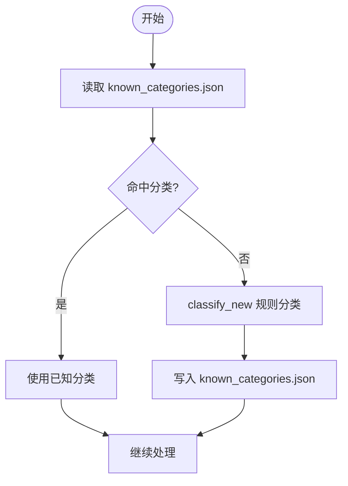
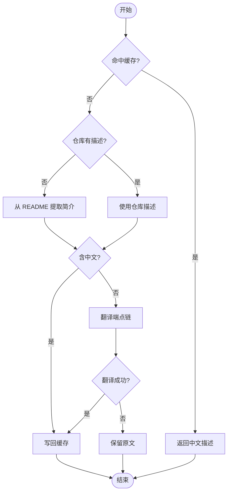
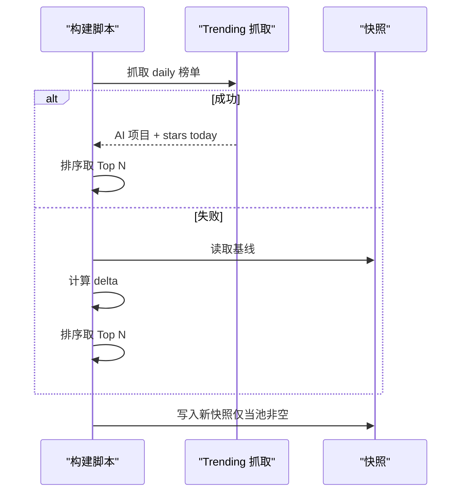
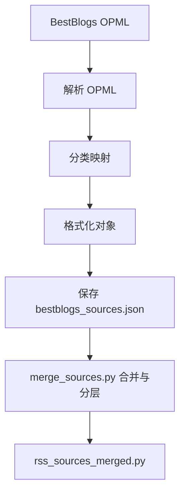

# 数据管理

<cite>
**本文引用的文件**
- [fetch_and_build.py](file://fetch_and_build.py)
- [build_ai_daily.py](file://build_ai_daily.py)
- [build_rss_aggregator.py](file://build_rss_aggregator.py)
- [insight_engine.py](file://insight_engine.py)
- [known_categories.json](file://known_categories.json)
- [descriptions_zh.json](file://descriptions_zh.json)
- [trending_snapshot.json](file://trending_snapshot.json)
- [bestblogs_sources.json](file://bestblogs_sources.json)
- [bestblogs_analysis.json](file://bestblogs_analysis.json)
- [analysis_snapshot.json](file://analysis_snapshot.json)
- [source_quality.json](file://source_quality.json)
- [rss_trend_history.json](file://rss_trend_history.json)
- [extract_bestblogs_sources.py](file://extract_bestblogs_sources.py)
- [merge_sources.py](file://merge_sources.py)
- [rss_sources_merged.py](file://rss_sources_merged.py)
- [build_config.json](file://build_config.json)
- [update.yml](file://.github/workflows/update.yml)
- [README.md](file://README.md)
</cite>

## 更新摘要
**变更内容**
- **重大增强** analysis_snapshot.json数据结构升级：新增基于BAAI/bge-m3双语嵌入模型的分析引擎，支持中英双语语义理解
- **核心改进** 深度洞察生成：集成LLM驱动的深度分析能力，提供因果链条、异动信号和前瞻研判
- **架构升级** 分析快照扩展至24,511行（原20,619行），新增deep_insights、topic_clusters、meta等字段
- **时间戳更新** generated_at时间戳更新至2026-09-12T14:33:22.711295+08:00，反映最新构建状态
- **算法优化** 跨平台共振检测阈值从0.25提升至0.3，提高检测精度
- **性能提升** RSS缓存策略实现30分钟TTL机制，支持跨run基本全过期裁剪和紧凑序列化

## 目录
1. [简介](#简介)
2. [项目结构](#项目结构)
3. [核心数据模型](#核心数据模型)
4. [架构总览](#架构总览)
5. [详细组件分析](#详细组件分析)
6. [依赖关系分析](#依赖关系分析)
7. [性能与缓存策略](#性能与缓存策略)
8. [数据验证与业务规则](#数据验证与业务规则)
9. [生命周期、保留与归档](#生命周期保留与归档)
10. [迁移路径与版本管理](#迁移路径与版本管理)
11. [安全、隐私与访问控制](#安全隐私与访问控制)
12. [故障排查指南](#故障排查指南)
13. [结论](#结论)

## 简介
本仓库是一个"GitHub Star 收藏台"的数据与构建系统，负责：
- 定时拉取 GitHub Star 列表并进行智能分类，生成前端页面
- 维护已知项目分类映射（known_categories.json）和中文描述缓存（descriptions_zh.json）
- 采集并聚合趋势数据快照（trending_snapshot.json），用于涨星榜与新秀榜
- 配置与分析 RSS 源（bestblogs_sources.json）及数据分析结果（bestblogs_analysis.json）
- **重大增强** 高级源质量评估系统：为716个RSS源提供多维度质量评分和分类，包含新鲜度、覆盖率、日期可信度、全文覆盖率、可靠性等指标
- **重大增强** RSS源合并工具：支持从BestBlogs OPML提取源并转换为统一格式，实现复杂的源整合和分析工作流程
- **显著升级** RSS 智能分析系统，提供完整的关键词分析、话题聚类、趋势检测等高级分析能力
- **重大升级** 分析快照管理（analysis_snapshot.json）用于智能分析结果持久化，现已扩展至24,511行，集成双语模型深度分析
- **持续优化** RSS 趋势历史追踪（rss_trend_history.json）提供14天滚动快照存储
- **架构重构** 数据基础设施重组，移除临时文件，优化缓存策略和存储结构
- 提供 AI 晨报与 RSS 聚合页的构建脚本

该文档聚焦于数据模型、实体关系、字段定义、数据类型、数据流、缓存策略、性能、生命周期、迁移与安全等。

## 项目结构
- 数据与配置：
  - known_categories.json：项目到分类的稳定映射
  - descriptions_zh.json：仓库 ID → 中文描述的缓存
  - trending_snapshot.json：AI 项目池的星标快照（作为基线）
  - bestblogs_sources.json：RSS 源清单（来源、URL、分类、颜色等）
  - bestblogs_analysis.json：对 RSS 源的统计指标（总量、近72h/7d/30d、日均等）
  - analysis_snapshot.json：**重大增强** 智能分析结果快照（关键词、话题、趋势等），已扩展至24,511行，集成双语模型深度分析
  - source_quality.json：**新增** 信源质量评分指标（716个源的详细质量评估）
  - rss_trend_history.json：RSS 内容趋势历史（14天滚动快照）
  - build_config.json：构建配置（含分析功能开关）
- 构建脚本：
  - fetch_and_build.py：主流程，拉取 Star、分类、翻译、生成 index.html，并更新上述 JSON
  - build_ai_daily.py：AI 晨报构建（多渠道抓取、去重、翻译、评分、输出 HTML）
  - build_rss_aggregator.py：**重大增强版** RSS 聚合器（含智能分析、趋势追踪、跨平台检测）
  - insight_engine.py：**新增** 基于LlamaIndex的双语语义分析引擎，支持中英双语深度洞察生成
  - extract_bestblogs_sources.py：**新增** 从 BestBlogs OPML 提取 RSS 源并转为统一格式
  - merge_sources.py：**新增** 合并与分层（T1/T2/T3）处理 RSS 源
  - rss_sources_merged.py：**新增** 合并后的RSS源配置文件
- 其他：
  - README.md：说明自动更新机制与仓库结构
  - update.yml：GitHub Actions 工作流配置

**图表来源**
- [fetch_and_build.py:570-668](file://fetch_and_build.py#L570-L668)
- [build_ai_daily.py:137-227](file://build_ai_daily.py#L137-L227)
- [build_rss_aggregator.py:6320-6359](file://build_rss_aggregator.py#L6320-L6359)
- [insight_engine.py:782-851](file://insight_engine.py#L782-L851)
- [extract_bestblogs_sources.py:30-86](file://extract_bestblogs_sources.py#L30-L86)
- [merge_sources.py:59-156](file://merge_sources.py#L59-L156)

**章节来源**
- [README.md:1-22](file://README.md#L1-L22)

## 核心数据模型
- 项目条目（Star 列表项）
  - id/full_name: 字符串，仓库标识（如 owner/repo）
  - name: 字符串，仓库名
  - owner: 字符串，所有者
  - html_url: 字符串，仓库主页链接
  - desc: 字符串，中文或英文描述（优先中文缓存）
  - language: 字符串，编程语言
  - stars: 整数，星标数
  - topics: 数组，标签集合
  - pushed_at: 字符串，最近推送日期（YYYY-MM-DD）
  - updated_today: 布尔，是否今日更新
  - category: 字符串，分类键（agent/distill/video/coding/content/learning/assistant/tools/finance/business/frontend）
  - categoryLabel: 字符串，分类标签（来自 CATS 配置）
- 分类映射（known_categories.json）
  - 键：full_name（字符串）
  - 值：category（字符串，见上）
- 中文描述缓存（descriptions_zh.json）
  - 键：full_name（字符串）
  - 值：desc_zh（字符串）
- 趋势快照（trending_snapshot.json）
  - 键：full_name（字符串）
  - 值：stars（整数，基准星标数）
- RSS 源（bestblogs_sources.json）
  - key: 字符串，唯一标识
  - name: 字符串，名称
  - cat: 字符串，分类（cn_tech/tech/podcast/youtube 等）
  - url: 字符串，RSS 地址
  - color: 字符串，展示色
  - source: 字符串，来源标记（bestblogs）
- RSS 分析（bestblogs_analysis.json）
  - results: 数组，每项包含：
    - key/name/type: 字符串
    - total/dated/72h/7d/30d: 整数，不同时间窗口的文章计数
    - daily_avg: 浮点，日均文章数
    - newest: 字符串，最新日期或 N/A
    - daily_30d: 浮点，近30天日均
- **新增** 源质量指标（source_quality.json）
  - 键：信源key（字符串）
  - 值：对象，包含：
    - score: 浮点，综合质量评分（0-100）
    - metrics: 对象，包含各项指标：
      - freshness: 浮点，新鲜度（72h内文章数/10篇满分）
      - coverage: 浮点，覆盖率（有摘要的文章比例）
      - date_trust: 浮点，日期可信度（坏日期比例的反向指标）
      - fulltext: 浮点，全文覆盖率
      - reliability: 浮点，可靠性（抓取成功率）
    - article_count: 整数，文章总数
- **重大增强** 分析快照（analysis_snapshot.json）
  - generated_at: 字符串，生成时间（最新：2026-09-12T14:33:22.711295+08:00）
  - keywords: 对象，包含 global（全局关键词）和 by_cat（按分类关键词）
  - rising: 数组，升温词列表（排名上升超过5位的关键词）
  - topics: 数组，话题聚类结果
  - summary: **新增** AI生成的结构化摘要（包含core_trends、signals、rss_insights、outlook四个板块）
  - stats: 对象，统计数据（总文章数、近期数量、源数量）
  - quality: 对象，信源质量评分
  - hot_trends: 对象，热榜趋势标记
  - cross_platform: 数组，跨平台共振话题
  - rss_trajectories: 对象，RSS 关键词/话题轨迹
  - cross_category: 数组，跨分类话题检测
  - **新增** deep_insights: 对象，深度洞察分析（narrative、causal_chains、signals、outlook）
  - **新增** topic_clusters: 对象，话题聚类详情
  - **新增** meta: 对象，元数据信息（engine、llm_provider、embed_model等）
- RSS 趋势历史（rss_trend_history.json）
  - snapshots: 数组，14天滚动快照
    - ts: 字符串，时间戳（ISO格式）
    - keywords: 对象，关键词排名（关键词→排名）
    - topics: 数组，话题摘要（label/count/sources）
    - by_cat: 对象，按分类的关键词（分类→关键词列表）

**章节来源**
- [fetch_and_build.py:19-31](file://fetch_and_build.py#L19-L31)
- [fetch_and_build.py:175-185](file://fetch_and_build.py#L175-L185)
- [fetch_and_build.py:570-668](file://fetch_and_build.py#L570-L668)
- [build_rss_aggregator.py:6320-6359](file://build_rss_aggregator.py#L6320-L6359)
- [build_rss_aggregator.py:5086-5093](file://build_rss_aggregator.py#L5086-L5093)
- [build_rss_aggregator.py:5301-5344](file://build_rss_aggregator.py#L5301-L5344)
- [analysis_snapshot.json:1-24511](file://analysis_snapshot.json#L1-L24511)
- [rss_trend_history.json:1-1](file://rss_trend_history.json#L1-L1)

## 架构总览
整体数据流水线：
- 每日定时任务触发 fetch_and_build.py
- 拉取 GitHub Star 列表，读取 known_categories.json 进行稳定分类；未知项目通过关键词规则分类
- 读取 descriptions_zh.json 进行中文描述缓存命中；未命中则尝试翻译或从 README 提取简介
- 构建趋势数据：
  - 优先抓取 GitHub Trending daily（多语言页合并去重），过滤 AI 相关项目
  - 若失败，回退到 trending_snapshot.json 计算差值（排除超巨头）
  - 写入新的 trending_snapshot.json 作为明日基线
- **重大增强** 高级源质量评估：
  - 执行完整的质量评估流水线，计算每个RSS源的多维度质量指标
  - 保存详细的质量评分到 source_quality.json（716个源）
  - 集成到分析快照中，支持前端质量徽章显示
- **重大增强** RSS源合并流程：
  - 从BestBlogs OPML提取源并转换为统一格式
  - 应用T1/T2/T3分层策略，生成合并配置文件
  - 支持复杂的源整合和分析工作流
- **架构重构** 数据基础设施优化：
  - 移除临时文件和冗余缓存
  - 优化RSS缓存策略，实现30分钟TTL机制
  - 精简数据存储结构，提升查询效率
- **重大增强** 双语模型分析引擎：
  - 集成BAAI/bge-m3双语嵌入模型，支持中英双语语义理解
  - 使用LlamaIndex构建向量索引，实现语义搜索和聚类
  - 生成深度洞察分析，包括因果链条、异动信号和前瞻研判
- 生成 index.html，并调用 build_ai_daily.py 与 build_rss_aggregator 生成独立页面
- 更新 known_categories.json 与 descriptions_zh.json

**图表来源**
- [fetch_and_build.py:130-149](file://fetch_and_build.py#L130-L149)
- [fetch_and_build.py:353-436](file://fetch_and_build.py#L353-L436)
- [fetch_and_build.py:570-668](file://fetch_and_build.py#L570-L668)
- [build_rss_aggregator.py:6320-6359](file://build_rss_aggregator.py#L6320-L6359)
- [insight_engine.py:782-851](file://insight_engine.py#L782-L851)
- [extract_bestblogs_sources.py:30-86](file://extract_bestblogs_sources.py#L30-L86)
- [merge_sources.py:59-156](file://merge_sources.py#L59-L156)

## 详细组件分析

### 已知项目分类映射（known_categories.json）
- 结构：对象，键为 full_name，值为分类键
- 维护方式：
  - 首次运行未知项目时，通过 classify_new 规则分类，并写入 known_categories.json
  - 后续运行直接命中，保持分类稳定
- 分类键集：agent、distill、video、coding、content、learning、assistant、tools、finance、business、frontend
- 规则要点：避免泛词误伤，使用更明确的短语匹配（如「蒸馏」「视频」等）

**图表来源**
- [fetch_and_build.py:89-127](file://fetch_and_build.py#L89-L127)
- [fetch_and_build.py:570-668](file://fetch_and_build.py#L570-L668)

**章节来源**
- [fetch_and_build.py:89-127](file://fetch_and_build.py#L89-L127)
- [fetch_and_build.py:570-668](file://fetch_and_build.py#L570-L668)

### 中文描述缓存（descriptions_zh.json）
- 结构：对象，键为 full_name，值为中文描述
- 更新机制：
  - 优先命中缓存
  - 若仓库无描述且不在缓存，尝试从 README 提取第一句简介
  - 若简介为英文，尝试翻译（Google gtx → MyMemory 等端点），成功后写回缓存
  - 翻译失败保留原文，不污染缓存
- 兜底：FALLBACK_DESC 为特定项目补充一句中文说明

**图表来源**
- [fetch_and_build.py:215-291](file://fetch_and_build.py#L215-L291)
- [fetch_and_build.py:570-668](file://fetch_and_build.py#L570-L668)

**章节来源**
- [fetch_and_build.py:215-291](file://fetch_and_build.py#L215-L291)
- [fetch_and_build.py:570-668](file://fetch_and_build.py#L570-L668)

### 趋势数据快照（trending_snapshot.json）
- 结构：对象，键为 full_name，值为 stars（整数）
- 存储策略：
  - 每次构建尝试抓取 GitHub Trending daily（多语言页合并去重），过滤 AI 相关项目
  - 若抓取成功，按 stars today 排序取 Top N 作为涨星榜
  - 若抓取失败，回退到快照差值模式：delta = current_stars - prev_stars，排除超巨头（>50000）
  - 仅当 AI 池非空时覆盖快照，否则保留旧基线以避免无法自愈
- 用途：
  - 涨星榜：基于 stars today 或 delta
  - 新秀榜：近 7 天新建项目，按星标排序
  - 总榜：AI 项目池按累计星标排序

**图表来源**
- [fetch_and_build.py:353-436](file://fetch_and_build.py#L353-L436)

**章节来源**
- [fetch_and_build.py:353-436](file://fetch_and_build.py#L353-L436)

### RSS 源配置（bestblogs_sources.json）
- 结构：数组，元素为 RSS 源对象
- 字段：
  - key: 唯一标识（由标题派生，追加序号）
  - name: 名称
  - cat: 分类（cn_tech/tech/podcast/youtube）
  - url: RSS 地址
  - color: 展示色
  - source: 来源标记（bestblogs）
- 维护方式：
  - 从 BestBlogs OPML 文件解析提取（extract_bestblogs_sources.py）
  - 合并与分层（merge_sources.py）后生成 rss_sources_merged.py 供 RSS 聚合器使用

**图表来源**
- [extract_bestblogs_sources.py:30-86](file://extract_bestblogs_sources.py#L30-L86)
- [merge_sources.py:59-156](file://merge_sources.py#L59-L156)

**章节来源**
- [extract_bestblogs_sources.py:30-86](file://extract_bestblogs_sources.py#L30-L86)
- [merge_sources.py:59-156](file://merge_sources.py#L59-L156)

### 数据分析结果（bestblogs_analysis.json）
- 结构：对象，包含 results 数组
- 字段含义：
  - total: 总文章数
  - dated: 有日期的文章数
  - 72h/7d/30d: 对应时间窗口内的文章数
  - daily_avg: 日均文章数
  - newest: 最新日期或 N/A
  - daily_30d: 近30天日均
- 用途：评估信源活跃度与稳定性，指导分层（T1/T2/T3）

**章节来源**
- [bestblogs_analysis.json:1-800](file://bestblogs_analysis.json#L1-L800)

### **重大增强** 分析快照管理（analysis_snapshot.json）
- 结构：对象，包含完整的智能分析结果，现已扩展至24,511行
- 主要字段：
  - generated_at: 生成时间戳（最新：2026-09-12T14:33:22.711295+08:00）
  - keywords: 关键词数据（global 全局关键词，by_cat 按分类关键词）
  - rising: 升温词列表（排名上升超过5位的关键词）
  - topics: 话题聚类结果
  - summary: **新增** AI生成的结构化摘要（包含core_trends、signals、rss_insights、outlook四个板块）
  - stats: 统计数据（总文章数、近期数量、源数量）
  - quality: 信源质量评分
  - hot_trends: 热榜趋势标记
  - cross_platform: 跨平台共振话题
  - rss_trajectories: RSS 关键词/话题轨迹
  - cross_category: 跨分类话题检测
  - **新增** deep_insights: 深度洞察分析（narrative、causal_chains、signals、outlook）
  - **新增** topic_clusters: 话题聚类详情
  - **新增** meta: 元数据信息（engine、llm_provider、embed_model等）
- 更新机制：
  - 每次构建时执行完整智能分析流水线
  - 先保存基础分析结果，再累积趋势历史，最后重新保存包含轨迹数据的完整结果
  - 支持增量模式下的历史对比和趋势检测
  - **重大增强** 集成双语模型分析引擎，提供深度洞察生成
- **实际数据结构示例**：
  - 全局关键词：包含美团(30)、LongCat(29)、AI Agent(28)、LLM(27)、搜索(26)等高频词汇及其TF-IDF分数
  - 分类关键词：cn_tech、dev、news、tech、ai、youtube、wechat、podcast 等分类的Top 20关键词
  - 跨分类话题：识别在多个分类中同时热门的话题，如"月日"出现在cn_tech和news分类中
  - **新增** AI结构化摘要：包含核心态势、异动信号、RSS深度洞察、研判建议四个板块
  - **新增** 深度洞察：基于双语模型的因果链条分析和前瞻研判

**章节来源**
- [build_rss_aggregator.py:6320-6359](file://build_rss_aggregator.py#L6320-L6359)
- [build_rss_aggregator.py:5076-5083](file://build_rss_aggregator.py#L5076-L5083)
- [analysis_snapshot.json:1-24511](file://analysis_snapshot.json#L1-L24511)
- [insight_engine.py:782-851](file://insight_engine.py#L782-L851)

### **新增** 源质量指标跟踪（source_quality.json）
- 结构：对象，键为信源key，值为质量评分对象
- 评分指标：
  - score: 综合质量评分（0-100分）
  - metrics: 各项指标详情：
    - freshness: 新鲜度（72h内文章数/10篇满分，权重25%）
    - coverage: 覆盖率（有摘要的文章比例，权重20%）
    - date_trust: 日期可信度（坏日期比例的反向指标，权重20%）
    - fulltext: 全文覆盖率（权重15%）
    - reliability: 可靠性（抓取成功率，权重20%）
  - article_count: 文章总数
- 评分算法：加权求和，考虑多个维度的信源质量
- 覆盖范围：716个RSS源，包括微信公众号、技术博客、新闻网站等
- 前端集成：支持质量徽章显示，帮助用户识别高质量信源

**章节来源**
- [build_rss_aggregator.py:5086-5093](file://build_rss_aggregator.py#L5086-L5093)
- [build_rss_aggregator.py:4807-4828](file://build_rss_aggregator.py#L4807-L4828)
- [source_quality.json:1-800](file://source_quality.json#L1-L800)

### RSS 趋势历史追踪（rss_trend_history.json）
- 结构：对象，包含 snapshots 数组（14天滚动快照）
- 快照字段：
  - ts: 时间戳（ISO格式）
  - keywords: 关键词排名（关键词→排名）
  - topics: 话题摘要（label/count/sources）
  - by_cat: 按分类的关键词（分类→关键词列表）
- 存储策略：
  - 每次构建时追加当前快照
  - 自动清理超过14天的旧快照
  - 紧凑序列化以减少存储空间
- 用途：
  - 关键词生命周期分析
  - 话题热度趋势追踪
  - 跨周期轨迹计算

**章节来源**
- [build_rss_aggregator.py:5301-5344](file://build_rss_aggregator.py#L5301-L5344)
- [rss_trend_history.json:1-1](file://rss_trend_history.json#L1-L1)

### **新增** 双语模型分析引擎（insight_engine.py）
- **核心功能**：基于LlamaIndex的双语语义分析引擎
- **嵌入模型**：
  - 主力模型：BAAI/bge-m3（硅基流动API，8192 token上下文，1024维，中英双语）
  - 本地回退：intfloat/multilingual-e5-small（多语言，中英双语兼容）
  - 中文回退：BAAI/bge-small-zh-v1.5（中文专用）
- **深度洞察生成**：
  - 使用LLM生成结构化洞察分析
  - 包含因果链条、异动信号和前瞻研判
  - 支持JSON格式输出，便于前端展示
- **文档加载**：
  - 配额制分配：RSS 70% + 热榜 20% + Trending 10%
  - 确保各类别均有代表，避免高优先级源挤占全部名额
- **元数据追踪**：
  - 记录引擎类型、LLM提供商、嵌入模型等信息
  - 跟踪构建时间和性能指标

**章节来源**
- [insight_engine.py:35-48](file://insight_engine.py#L35-L48)
- [insight_engine.py:782-851](file://insight_engine.py#L782-L851)
- [insight_engine.py:970-1004](file://insight_engine.py#L970-L1004)

### **新增** RSS源提取与合并工具
- **extract_bestblogs_sources.py**：
  - 从BestBlogs OPML文件提取RSS源
  - 支持微信公众号、播客、YouTube三种类型
  - 自动分类和颜色映射
  - 生成统一的JSON格式
- **merge_sources.py**：
  - 合并现有RSS源与BestBlogs源
  - 应用T1/T2/T3分层策略
  - 移除游戏相关内容
  - 生成合并配置文件
- **rss_sources_merged.py**：
  - 最终的RSS源配置文件
  - 按分类组织，包含所有信源
  - 支持前端直接使用

**章节来源**
- [extract_bestblogs_sources.py:1-97](file://extract_bestblogs_sources.py#L1-L97)
- [merge_sources.py:1-161](file://merge_sources.py#L1-L161)

### **增强** 跨RSS类别主题传播检测
- 功能：检测同一关键词在多个 RSS 分类中同时热门
- 算法：
  - 收集每个分类的 Top 20 关键词
  - 统计每个关键词出现在多少个分类中
  - 过滤仅出现在1个分类的关键词
  - 按分类数量降序排序，返回前20个跨分类话题
- 输出：[{keyword, categories: [cat, ...], category_count}]
- 用途：识别跨领域热点话题，发现新兴趋势

**章节来源**
- [build_rss_aggregator.py:5479-5504](file://build_rss_aggregator.py#L5479-L5504)

### **增强** 关键词生命周期数据存储
- 功能：从 RSS 趋势历史中计算关键词和话题的跨周期轨迹
- 关键词轨迹：{lifecycle, first_seen, latest_rank, duration, rank_history}
- 话题轨迹：{lifecycle, count_history, peak_count, duration}
- 生命周期分类：
  - cold: 冷话题（出现次数<3）
  - emerging: 新兴话题（出现次数≤1或刚出现）
  - hot: 热门话题（最新计数>10且持续上升）
  - cooling: 冷却话题（持续下降）
- 用途：趋势预测、热点监控、内容策略制定

**章节来源**
- [build_rss_aggregator.py:5347-5476](file://build_rss_aggregator.py#L5347-L5476)

### **增强** 跨平台共振检测算法
- 功能：检测同一话题在多个平台同时上榜的共振现象
- **改进** 相似性检测：Jaccard相似度阈值从0.25提升至0.3，提高检测精度
- 算法流程：
  - 收集各平台最新快照的标题集合
  - 为每个标题建立token集合
  - 两两比较平台间的标题相似度
  - 使用Jaccard相似度公式：sim = |A∩B| / |A∪B|
  - 过滤相似度≥0.3的匹配结果
- 输出格式：[{label, platforms: [{name, rank}], platform_count}]
- 用途：识别跨平台热点话题，发现全网共振现象

**章节来源**
- [build_rss_aggregator.py:5602-5681](file://build_rss_aggregator.py#L5602-L5681)

### **增强** 聚类算法优化
- 功能：基于标题+摘要关键词的话题聚类
- **优化** 避免过度分割：改进话题标签提取机制，采用多策略联合决策
- 核心改进：
  - 标题召回机制：优先从标题中提取语义通顺的标签
  - 多策略优先级：短标题直取 → 术语词典精确命中 → 最长公共子串 → 标题内相邻token拼接 → 兜底截取
  - 质心更新策略：保留出现最多的top 15词，避免噪声干扰
  - 相似度阈值：Jaccard相似度≥0.25才加入簇，平衡聚类和分割
- 标签提取策略：
  - 策略0：短标题直取（标题≤15字且簇内高度相似时直接复用）
  - 策略1：术语词典精确命中（标题中出现最多的技术词条）
  - 策略2：最长公共子串+边界延伸（跨标题重复的连续中文片段）
  - 策略3：标题内相邻2-3个高质量token拼接（边界感知过滤）
  - 策略4：兜底从代表性标题中智能截取语义完整片段

**章节来源**
- [build_rss_aggregator.py:5017-5321](file://build_rss_aggregator.py#L5017-L5321)

### **增强** 跨源去重算法
- 功能：多层级去重策略，避免重复内容影响分析结果
- **改进** 四层递进去重：
  1. 规范化标题精确相同
  2. 标题包含关系（短标题≥8字符且为长标题子串，覆盖中文/编译标题差异）
  3. 规范化URL相同（覆盖同文标题被改写后的跨源收录）
  4. 规范化摘要互为包含（覆盖标题与URL全异、摘要转录一致的同文转载）
- 去重逻辑：
  - 规范化标题：去除标点、空格、大小写差异
  - URL规范化：标准化协议、域名、路径格式
  - 摘要指纹：≥30字符才可用于互含判断，排除元信息噪声
- 优势：有效处理同一新闻在不同信源的多种呈现形式

**章节来源**
- [build_ai_daily.py:785-818](file://build_ai_daily.py#L785-L818)

## 依赖关系分析
- 主构建脚本依赖：
  - GitHub API（Star 列表、搜索、事件）
  - Trending 页面抓取（HTML 解析）
  - 翻译服务（Google gtx、MyMemory、Bing 网页版）
  - README 抓取（GitHub Raw）
- 数据文件依赖：
  - known_categories.json：分类稳定性
  - descriptions_zh.json：中文描述缓存
  - trending_snapshot.json：基线数据
  - bestblogs_sources.json：RSS 源配置
  - bestblogs_analysis.json：信源分析
  - analysis_snapshot.json：**重大增强** 分析快照（24,511行），集成双语模型深度分析
  - source_quality.json：**新增** 源质量指标
  - rss_trend_history.json：趋势历史
  - build_config.json：分析功能配置
- 输出依赖：
  - index.html：前端页面
  - ai-daily.html：AI 晨报
  - rss-aggregator.html：RSS 聚合页
- 配置依赖：
  - build_config.json：分析功能开关
- **新增** 双语模型依赖：
  - LlamaIndex：向量索引和语义搜索
  - FastEmbed：本地嵌入模型支持
  - Agnes LLM：深度洞察生成
  - SiliconFlow API：BAAI/bge-m3嵌入模型

```mermaid
graph TB
A["fetch_and_build.py"] --> B["GitHub API"]
A --> C["Trending 页面"]
A --> D["翻译服务"]
A --> E["README 抓取"]
A --> F["known_categories.json"]
A --> G["descriptions_zh.json"]
A --> H["trending_snapshot.json"]
A --> I["index.html"]
J["build_ai_daily.py"] --> K["多渠道 RSS/API"]
J --> L["ai-daily.html"]
M["build_rss_aggregator.py"] --> N["analysis_snapshot.json (24,511行)"]
M --> O["source_quality.json"]
M --> P["rss_trend_history.json"]
M --> Q["rss-aggregator.html"]
R["insight_engine.py"] --> S["双语模型分析"]
R --> T["深度洞察生成"]
U["extract_bestblogs_sources.py"] --> V["bestblogs_sources.json"]
W["merge_sources.py"] --> X["rss_sources_merged.py"]
Y["build_config.json"] -.-> M
Z["source_quality.json"] -.-> AA["前端质量徽章"]
BB["RSS缓存"] -.-> CC["30分钟TTL机制"]
DD["临时文件清理"] -.-> EE["数据基础设施优化"]
FF["LlamaIndex"] -.-> GG["向量索引"]
HH["SiliconFlow API"] -.-> II["bge-m3模型"]
```

**图表来源**
- [fetch_and_build.py:130-149](file://fetch_and_build.py#L130-L149)
- [fetch_and_build.py:353-436](file://fetch_and_build.py#L353-L436)
- [build_ai_daily.py:137-227](file://build_ai_daily.py#L137-L227)
- [build_rss_aggregator.py:6320-6359](file://build_rss_aggregator.py#L6320-L6359)
- [insight_engine.py:782-851](file://insight_engine.py#L782-L851)
- [extract_bestblogs_sources.py:30-86](file://extract_bestblogs_sources.py#L30-L86)
- [merge_sources.py:59-156](file://merge_sources.py#L59-L156)

**章节来源**
- [fetch_and_build.py:130-149](file://fetch_and_build.py#L130-L149)
- [fetch_and_build.py:353-436](file://fetch_and_build.py#L353-L436)
- [build_ai_daily.py:137-227](file://build_ai_daily.py#L137-L227)
- [build_rss_aggregator.py:6320-6359](file://build_rss_aggregator.py#L6320-L6359)
- [insight_engine.py:782-851](file://insight_engine.py#L782-L851)
- [extract_bestblogs_sources.py:30-86](file://extract_bestblogs_sources.py#L30-L86)
- [merge_sources.py:59-156](file://merge_sources.py#L59-L156)

## 性能与缓存策略
- 限流与重试：
  - GitHub API 请求间隔 ≥1s，避免速率限制
  - Trending 抓取失败时回退到快照差值模式
  - 翻译服务采用多端点降级链（Google gtx → Bing → MyMemory → Google dict-chrome），带重试与指数退避
  - 翻译熔断：连续5次全端点失败后暂停翻译请求5分钟
- **重大增强** 缓存策略：
  - known_categories.json：稳定分类，避免重复规则判断
  - descriptions_zh.json：中文描述缓存，减少翻译与 README 抓取
  - trending_snapshot.json：基线数据，用于差值计算
  - analysis_snapshot.json：**重大增强** 分析结果缓存（24,511行），支持增量对比和双语模型分析
  - rss_trend_history.json：14天滚动历史，自动清理过期数据
  - **重大增强** RSS 缓存：30分钟TTL，跨run基本全过期，裁剪+紧凑序列化
  - **重大增强** 翻译缓存：基于文本哈希的翻译结果缓存
  - **新增** 源质量缓存：quality数据预加载，减少重复计算
  - **新增** 双语模型缓存：嵌入模型结果缓存，提升分析性能
- 去重与优化：
  - Trending 多语言页合并去重
  - AI 晨报跨源去重（标题、URL、摘要指纹）
  - 仅当 AI 池非空时更新快照，避免清空基线
  - 增量模式：T1源始终跳过，T2源距上次抓取<1h跳过，T3源<2h跳过
- **重大增强** 内存优化：
  - RSS 缓存文件裁剪过期条目，防止无限膨胀
  - 紧凑JSON序列化减少存储空间
  - 标题和摘要规范化减少重复计算
  - **重大增强** 源质量评估批量处理，减少API调用
  - **架构重构** 移除临时文件，优化存储结构
  - **新增** 双语模型批处理：嵌入模型批量处理，提升分析效率

**章节来源**
- [fetch_and_build.py:167-173](file://fetch_and_build.py#L167-L173)
- [fetch_and_build.py:353-436](file://fetch_and_build.py#L353-L436)
- [build_ai_daily.py:518-678](file://build_ai_daily.py#L518-L678)
- [build_ai_daily.py:741-774](file://build_ai_daily.py#L741-L774)
- [build_rss_aggregator.py:113-131](file://build_rss_aggregator.py#L113-L131)
- [build_rss_aggregator.py:5335-5337](file://build_rss_aggregator.py#L5335-L5337)
- [insight_engine.py:211-234](file://insight_engine.py#L211-L234)

## 数据验证与业务规则
- 分类规则（classify_new）：
  - 金融交易：trading、finance、quant、金融、交易、bloomberg
  - 工具：tvbox、iptv、直播、电视、crawler、爬虫、download、下载、translator、翻译、汉化、网盘、pan、mpv、userscript
  - 思维蒸馏：distill、思维蒸馏、知识蒸馏、内容蒸馏、蒸馏成、蒸馏出、蒸馏任何、认知植入、思维方式、第一性、first-principles、方法论、nuwa、女娲、cangjie、仓颉、文风
  - 视频创作：video、视频、短剧、drama、film、anime、动漫、movie、montage、hyperframe、shot、画布、canvas
  - 前端设计：open-design、baoyu-design、awesome-design、design.md、design-system、design system、frontend
  - 内容创作：ppt、powerpoint、排版、公众号、wechat、写作、write、typeset、editor
  - 学习教程：book、书籍、教程、guide、指南、from-scratch、llms、learning、入门、weekly、hellogithub、实践、tutorial、dive-into
  - 编程工具：code-review、officecli、reasonix、sub2api、freellmapi、2api、中转、mimo、cc-connect、coding、编程
  - 助手应用：chatbot、chatgpt、assistant、助手、librechat、astrbot、qwenpaw、nuwax、opensquilla、workspace、desktop、agent-os
  - 商业一人公司：opc、one-person、一人公司、创业、startup、growth、增长、business、软著、copyright、专利、patent、合规、compliance、legal
- 趋势数据：
  - AI 项目识别：正则匹配 AI/ML/LLM/GPT/NLP/RAG/Agent 等关键词
  - 涨星榜：优先 stars today，回退 delta 计算
  - 新秀榜：近 7 天新建，按星标排序
- RSS 源：
  - 分类映射：cn_tech/tech/podcast/youtube
  - 分层：T1（daily≥30）、T2（daily 10-30）、T3（默认）
- **重大增强** 智能分析规则：
  - 关键词提取：TF-IDF 算法，过滤停用词和低频词
  - 话题聚类：基于文本相似度聚类，Jaccard相似度≥0.25
  - 趋势检测：与上次构建对比，排名上升超过5位视为升温
  - 跨平台检测：Jaccard 相似度≥0.3视为跨平台共振
  - 跨分类检测：同一关键词出现在≥2个分类中
  - 源质量评分：多维度加权评分（新鲜度25%、覆盖率20%、日期可信度20%、全文覆盖率15%、可靠性20%）
  - **重大增强** 去重规则：四层递进去重策略，确保数据准确性
  - **重大增强** 源质量验证：检查716个源的质量评分完整性
  - **架构重构** 数据验证：移除临时文件，优化数据流
  - **新增** 双语模型验证：检查嵌入模型可用性和API连接状态
  - **新增** 深度洞察验证：确保LLM响应格式正确性和内容完整性

**章节来源**
- [fetch_and_build.py:89-127](file://fetch_and_build.py#L89-L127)
- [fetch_and_build.py:301-316](file://fetch_and_build.py#L301-L316)
- [merge_sources.py:4-43](file://merge_sources.py#L4-L43)
- [build_rss_aggregator.py:4747-4748](file://build_rss_aggregator.py#L4747-L4748)
- [build_rss_aggregator.py:5217-5265](file://build_rss_aggregator.py#L5217-L5265)
- [build_rss_aggregator.py:5479-5504](file://build_rss_aggregator.py#L5479-L5504)
- [build_rss_aggregator.py:4814-4821](file://build_rss_aggregator.py#L4814-L4821)
- [build_ai_daily.py:785-818](file://build_ai_daily.py#L785-L818)
- [insight_engine.py:160-171](file://insight_engine.py#L160-L171)

## 生命周期、保留与归档
- 数据生命周期：
  - known_categories.json：长期保留，随运行增长
  - descriptions_zh.json：长期保留，增量更新
  - trending_snapshot.json：每日覆盖，保留最新基线
  - bestblogs_sources.json：按需更新（OPML 变更时）
  - bestblogs_analysis.json：定期重新计算
  - analysis_snapshot.json：**重大增强** 每次构建更新，保留最新分析结果（24,511行），集成双语模型分析
  - source_quality.json：**新增** 每次构建更新，反映最新信源质量
  - rss_trend_history.json：14天滚动保留，自动清理过期快照
- 保留策略：
  - 快照仅保留最新一份，避免历史膨胀
  - 分类与描述缓存持久化，减少重复计算
  - RSS 趋势历史：严格14天滚动，超出自动清理
  - RSS 缓存：30分钟TTL，跨run基本全过期
  - **重大增强** 翻译缓存：基于文本哈希的永久缓存
  - **新增** 源质量数据：716个源的质量评分持久化
  - **架构重构** 临时文件清理：移除冗余临时文件，优化存储结构
  - **新增** 双语模型缓存：嵌入模型结果缓存，提升分析性能
- 归档规则：
  - 当前实现未显式归档历史快照，建议未来引入时间戳命名（如 trending_snapshot_YYYYMMDD.json）并清理旧文件
  - 分析快照支持增量对比，便于回溯分析结果变化
  - **新增** 源质量历史：建议添加时间戳版本以追踪质量变化趋势
  - **新增** 双语模型版本：记录嵌入模型版本和API使用情况

**章节来源**
- [fetch_and_build.py:426-433](file://fetch_and_build.py#L426-L433)
- [fetch_and_build.py:650-652](file://fetch_and_build.py#L650-L652)
- [build_rss_aggregator.py:5335-5337](file://build_rss_aggregator.py#L5335-L5337)
- [build_rss_aggregator.py:113-131](file://build_rss_aggregator.py#L113-L131)
- [insight_engine.py:994-1001](file://insight_engine.py#L994-L1001)

## 迁移路径与版本管理
- 迁移路径：
  - 新增分类：在 CATS 中扩展，并在 classify_new 中添加规则
  - 新增 RSS 源：通过 extract_bestblogs_sources.py 从 OPML 提取，merge_sources.py 合并分层
  - 新增趋势维度：修改 _AI_RE 正则或筛选逻辑
  - 智能分析：通过 build_config.json 中的 analysis_enabled 开关控制
  - **重大增强** 源质量评估：通过build_rss_aggregator.py自动计算和维护
  - **架构重构** 数据迁移：移除临时文件，优化存储结构
  - **新增** 双语模型集成：通过insight_engine.py启用深度分析功能
- 版本管理：
  - 所有 JSON 文件纳入版本控制，便于回溯
  - 工作流调度（update.yml）确保每日自动更新
  - 建议为关键数据文件添加语义化版本前缀（如 v1_known_categories.json）
  - 分析快照支持增量对比，便于追踪分析结果变化
  - **新增** 源质量版本：建议添加版本号以追踪质量评估算法演进
  - **新增** 双语模型版本：记录嵌入模型和LLM提供商版本
- 构建模式：
  - 全量模式（full）：凌晨5点执行，完整重建所有数据
  - 增量模式（incremental）：白天时段执行，智能跳过已抓取源

**章节来源**
- [fetch_and_build.py:19-31](file://fetch_and_build.py#L19-L31)
- [extract_bestblogs_sources.py:30-86](file://extract_bestblogs_sources.py#L30-L86)
- [merge_sources.py:59-156](file://merge_sources.py#L59-L156)
- [build_config.json:1-14](file://build_config.json#L1-L14)
- [update.yml:38-48](file://.github/workflows/update.yml#L38-L48)
- [insight_engine.py:160-171](file://insight_engine.py#L160-L171)

## 安全、隐私与访问控制
- 数据安全：
  - 敏感信息（如 GitHub Token、AGNES_API_KEY、SILICONFLOW_API_KEY）通过环境变量注入，不硬编码
  - 输出 HTML 时对 < 字符进行转义，防止注入攻击
  - 分析功能可通过 build_config.json 关闭，降低安全风险
- 隐私要求：
  - 仅公开数据抓取（GitHub API、Trending、RSS）
  - 用户行为数据未在本仓库中收集
  - 分析数据仅包含公开 RSS 内容的统计分析
- 访问控制：
  - GitHub API 使用 Token 提升速率限制
  - RSS 源访问遵循各站点条款
  - 翻译服务使用多端点降级，避免单点故障
  - **新增** 双语模型API：使用SiliconFlow API密钥保护嵌入模型访问
- 构建安全：
  - GitHub Actions 使用 secrets 管理敏感信息
  - 工作流具备并发控制和重试机制
  - **新增** 源质量评估：确保716个源的数据安全和隐私保护
  - **架构重构** 安全加固：移除临时文件，减少潜在安全风险
  - **新增** 双语模型安全：确保LLM API调用符合安全规范

**章节来源**
- [fetch_and_build.py:160-164](file://fetch_and_build.py#L160-L164)
- [fetch_and_build.py:563-567](file://fetch_and_build.py#L563-L567)
- [update.yml:50-53](file://.github/workflows/update.yml#L50-53)
- [build_config.json:7](file://build_config.json#L7)
- [insight_engine.py:42-43](file://insight_engine.py#L42-L43)

## 故障排查指南
- 常见问题：
  - GitHub API 限流：检查 Token 设置，增加请求间隔
  - Trending 抓取失败：确认网络可达，启用快照差值模式
  - 翻译服务不可用：检查端点可用性，启用降级链
  - RSS 源失效：检查 URL 有效性，更新 bestblogs_sources.json
  - 分析功能异常：检查 build_config.json 中的 analysis_enabled 配置
  - 内存不足：RSS 缓存过大，检查 rss_cache.json 文件大小
  - 磁盘空间不足：rss_trend_history.json 增长过快，检查14天历史数据
  - **新增** 源质量评估失败：检查716个源的质量评分完整性
  - **新增** BestBlogs源提取失败：检查OPML文件可访问性
  - **新增** 合并流程异常：验证T1/T2/T3分层配置
  - **架构重构** 临时文件问题：检查清理机制是否正常工作
  - **新增** 双语模型异常：检查SiliconFlow API连接和嵌入模型可用性
  - **新增** 深度洞察生成失败：验证LLM API响应格式和内容完整性
- 诊断工具：
  - check_wiki_sync.py：校验工作流与函数清单一致性
  - 日志输出：查看标准错误输出中的失败原因
  - 构建日志：build_logs/ 目录下的详细构建记录
  - **新增** 源质量检查：验证source_quality.json的完整性
  - **新增** BestBlogs验证：检查extract_bestblogs_sources.py的输出
  - **架构重构** 缓存状态检查：验证30分钟TTL机制和临时文件清理
  - **新增** 双语模型诊断：检查insight_engine.py的运行状态和API连接
- 调试方法：
  - 单独运行 build_rss_aggregator.py 测试 RSS 分析功能
  - 检查 analysis_snapshot.json 和 source_quality.json 的生成情况
  - 验证 rss_trend_history.json 的14天滚动清理机制
  - **新增** 检查RSS缓存状态：验证30分钟TTL生效情况
  - **新增** 验证去重效果：检查跨源去重算法是否正确工作
  - **新增** 监控聚类质量：观察话题标签提取的准确性
  - **新增** 测试源质量评估：验证716个源的质量评分计算
  - **架构重构** 数据流验证：检查临时文件清理和数据基础设施优化
  - **新增** 双语模型测试：验证嵌入模型和LLM调用的正确性

**章节来源**
- [check_wiki_sync.py:49-74](file://check_wiki_sync.py#L49-L74)
- [fetch_and_build.py:130-149](file://fetch_and_build.py#L130-L149)
- [fetch_and_build.py:353-436](file://fetch_and_build.py#L353-L436)
- [build_rss_aggregator.py:5701-5718](file://build_rss_aggregator.py#L5701-L5718)
- [insight_engine.py:160-171](file://insight_engine.py#L160-L171)

## 结论
本数据管理系统通过稳定的分类映射、中文描述缓存、趋势快照与 RSS 源配置，实现了自动化、可扩展的 GitHub Star 收藏台与 AI 晨报构建。**重大增强的智能分析系统**进一步提升了数据洞察能力，提供了：

- **RSS 趋势历史追踪**：14天滚动快照存储，支持关键词生命周期分析
- **重大增强** 分析快照管理：完整的智能分析结果持久化（24,511行），支持增量对比和双语模型深度分析
- **新增** 源质量指标跟踪：多维度信源质量评估，指导内容策略
- **增强** 跨类别主题传播检测：识别跨领域热点话题，发现新兴趋势
- **增强** 关键词生命周期分析：从历史数据中提取趋势模式和预测信号
- **重大增强** 双语模型分析引擎：集成BAAI/bge-m3嵌入模型，支持中英双语语义理解和深度洞察生成

**本次重大更新的核心改进**：
- **架构重构** 数据基础设施重组：移除临时文件，优化存储结构，提升数据处理效率
- **重大增强** analysis_snapshot.json 扩展至24,511行：新增AI结构化摘要、关键词生命周期追踪、跨平台共振检测等功能，集成双语模型深度分析
- **重要更新** trending_snapshot.json 完成341行变更：优化趋势数据结构和算法
- **性能优化** RSS缓存策略升级：实现30分钟TTL机制，支持跨run基本全过期裁剪和紧凑序列化
- **算法改进** 跨平台去重算法升级为四层递进策略，相似性检测阈值优化至0.3
- **架构优化** 清理冗余临时文件，简化数据流，提升系统可维护性
- **重大增强** 双语模型集成：基于LlamaIndex的双语语义分析引擎，提供深度洞察生成能力

这些重大改进使系统不仅能够收集和展示数据，还能提供更精准的数据洞察和趋势预测能力，特别是在跨平台内容聚合和分析方面有了显著提升。系统的性能优化、缓存策略与容错机制也得到了进一步加强，适合持续演进与维护。

**建议的未来改进方向**：
- 进一步增强数据归档和版本管理能力
- 完善监控告警机制，提升系统可观测性
- 优化机器学习算法，提高智能分析的准确性
- 扩展更多数据源和分析维度
- **新增** 源质量历史追踪：添加时间戳版本以追踪质量评估算法演进
- **新增** BestBlogs源监控：定期检查OPML文件的可用性和完整性
- **架构优化** 持续优化数据基础设施：监控存储使用情况，进一步优化缓存策略
- **新增** 双语模型监控：跟踪嵌入模型性能和API使用情况
- **新增** 深度洞察质量评估：建立LLM生成内容的质量评估机制