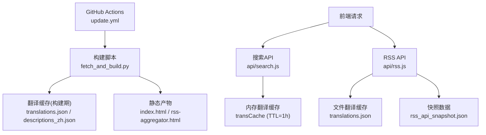
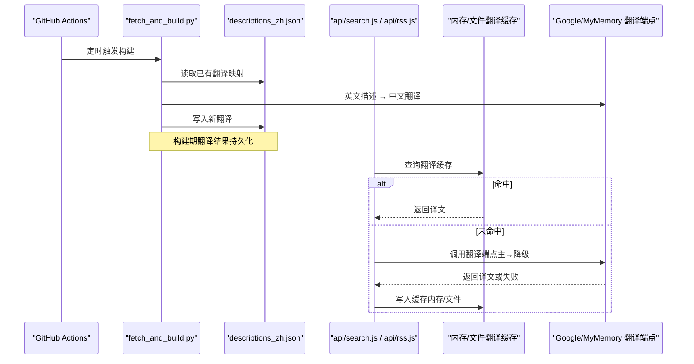
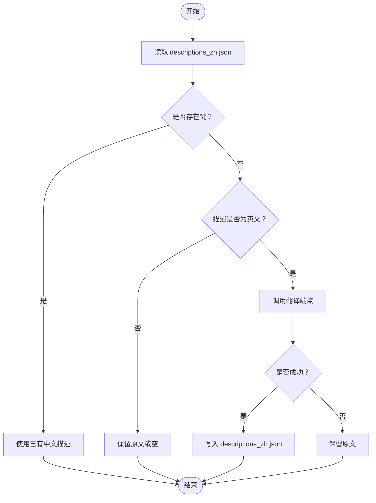
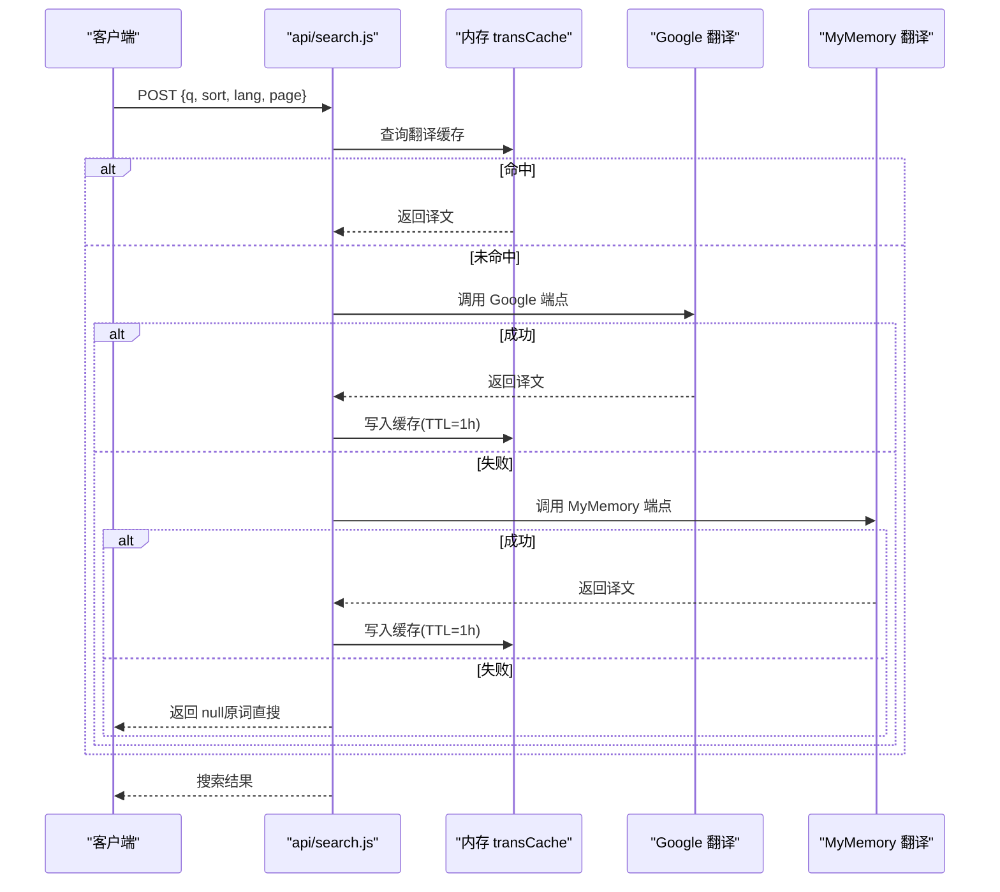
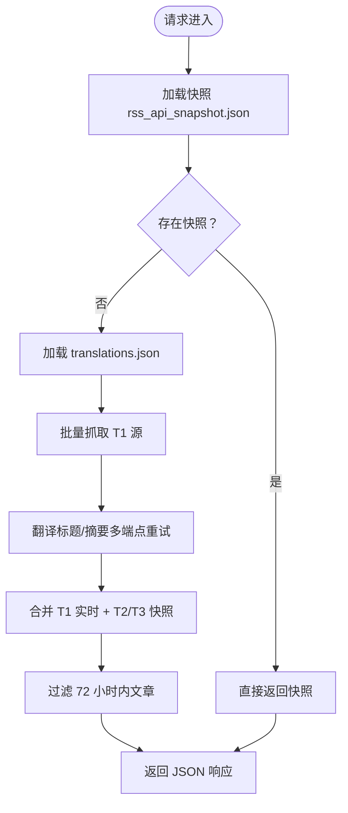
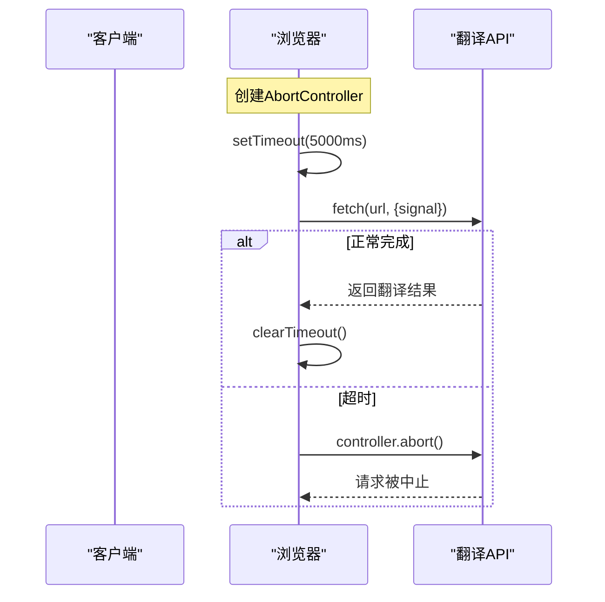
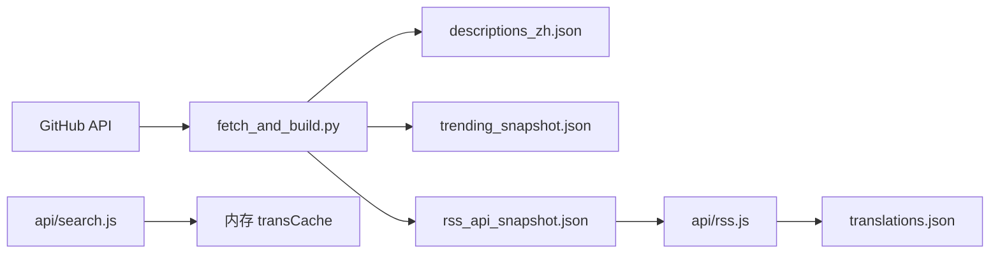

# 翻译缓存管理

<cite>
**本文引用的文件**
- [descriptions_zh.json](file://descriptions_zh.json)
- [fetch_and_build.py](file://fetch_and_build.py)
- [api/search.js](file://api/search.js)
- [api/rss.js](file://api/rss.js)
- [build_rss_aggregator.py](file://build_rss_aggregator.py)
- [rss-aggregator.html](file://rss-aggregator.html)
- [.github/workflows/update.yml](file:.github/workflows/update.yml)
</cite>

## 更新摘要
**变更内容**
- **新增**：修复了 RSS 聚合器中的换行符转义问题，防止 AI 每日新闻聚合页面的翻译失败
- **增强**：改进了文本格式化处理逻辑，确保换行符在不同平台间正确转换
- **优化**：提升了翻译服务的可靠性，特别是在 Great Firewall 环境下的网络稳定性

## 目录
1. [简介](#简介)
2. [项目结构](#项目结构)
3. [核心组件](#核心组件)
4. [架构总览](#架构总览)
5. [详细组件分析](#详细组件分析)
6. [依赖关系分析](#依赖关系分析)
7. [性能考量](#性能考量)
8. [故障排查指南](#故障排查指南)
9. [结论](#结论)
10. [附录](#附录)

## 简介
本文件为"翻译缓存管理系统"的数据模型与运行机制文档，聚焦以下目标：
- 说明 descriptions_zh.json 的数据结构与格式，记录英文描述到中文翻译的映射关系。
- 解释翻译缓存的存储策略、TTL 与更新机制（构建期与运行期）。
- 记录翻译 API 调用频率限制与重试/降级策略。
- 说明缓存失效与更新的触发条件。
- 提供翻译质量验证与人工审核流程建议。
- 给出翻译缓存的性能优化建议与最佳实践。
- 记录多语言支持的扩展方法与国际化考虑。

## 项目结构
仓库围绕"GitHub Star 收藏台"的自动更新与内容聚合展开，翻译能力贯穿构建脚本与运行时 API：
- 构建期：Python 脚本抓取 GitHub star 列表、生成页面，并在过程中对英文描述进行翻译，结果持久化到 descriptions_zh.json。
- 运行期：Vercel Serverless 函数提供搜索与 RSS 聚合接口，内置内存级翻译缓存与文件级翻译缓存，支持多端点降级与并发控制。
- CI/CD：GitHub Actions 定时触发全量/增量构建，提交并部署产物。



**图表来源**
- [.github/workflows/update.yml:1-93](file:.github/workflows/update.yml#L1-L93)
- [fetch_and_build.py:570-674](file://fetch_and_build.py#L570-L674)
- [api/search.js:1-177](file://api/search.js#L1-L177)
- [api/rss.js:1-468](file://api/rss.js#L1-L468)

**章节来源**
- [README.md:1-22](file://README.md#L1-L22)
- [.github/workflows/update.yml:1-93](file:.github/workflows/update.yml#L1-L93)

## 核心组件
- 描述翻译映射文件：descriptions_zh.json
  - 键：仓库 full_name（如 "owner/repo"）
  - 值：该仓库描述的中文翻译文本
  - 用途：构建期优先使用已翻译描述；若无则尝试翻译并回写
- 构建期翻译器：fetch_and_build.py
  - 通过 Google 非官方端点或 MyMemory 免费接口将英文描述翻译为中文
  - 翻译结果写入 descriptions_zh.json，避免重复翻译
- 搜索 API 翻译缓存：api/search.js
  - 内存 Map 缓存 key=原文，value=译文，TTL=1 小时
  - 中文输入先翻译为英文再组合查询，失败时回退原词直搜
- RSS API 翻译缓存：api/rss.js
  - 加载 translations.json 作为持久翻译缓存（key=原文MD5哈希）
  - 对 T1 英文源标题/摘要进行翻译，失败时多端点重试
- 构建期 RSS 聚合：build_rss_aggregator.py
  - 维护 translations.json、rss_cache.json、rss_history.json
  - 生成 rss_api_snapshot.json 供 API 优先返回

**章节来源**
- [descriptions_zh.json:1-360](file://descriptions_zh.json#L1-L360)
- [fetch_and_build.py:54-86](file://fetch_and_build.py#L54-L86)
- [fetch_and_build.py:278-291](file://fetch_and_build.py#L278-L291)
- [fetch_and_build.py:570-674](file://fetch_and_build.py#L570-L674)
- [api/search.js:15-66](file://api/search.js#L15-L66)
- [api/rss.js:34-46](file://api/rss.js#L34-L46)
- [api/rss.js:378-411](file://api/rss.js#L378-L411)
- [build_rss_aggregator.py:28-44](file://build_rss_aggregator.py#L28-L44)
- [build_rss_aggregator.py:46-80](file://build_rss_aggregator.py#L46-L80)

## 架构总览
系统采用"构建期 + 运行期"双轨翻译缓存：
- 构建期：Python 脚本在 GitHub Actions 中定时执行，拉取 star 列表与趋势数据，翻译英文描述并持久化到 descriptions_zh.json；同时生成 RSS 聚合快照与页面。
- 运行期：Serverless 函数处理搜索与 RSS 请求，使用内存缓存（search.js）与文件缓存（rss.js）减少外部翻译调用；当缓存未命中时，按优先级调用多个翻译端点并降级重试。



**图表来源**
- [fetch_and_build.py:570-674](file://fetch_and_build.py#L570-L674)
- [api/search.js:30-66](file://api/search.js#L30-L66)
- [api/rss.js:378-411](file://api/rss.js#L378-L411)

## 详细组件分析

### 描述翻译映射文件：descriptions_zh.json
- 数据结构
  - 类型：JSON 对象
  - 键：仓库 full_name（字符串），例如 "owner/repo"
  - 值：对应仓库描述的中文翻译（字符串）
- 作用
  - 构建期优先使用该文件中的中文描述，避免重复翻译
  - 若键不存在且描述为英文，则尝试翻译并回写
- 更新时机
  - 每次构建完成时由 fetch_and_build.py 写入
  - 仅新增或变更的条目会被覆盖，历史条目保持不变



**图表来源**
- [fetch_and_build.py:278-291](file://fetch_and_build.py#L278-L291)
- [fetch_and_build.py:570-674](file://fetch_and_build.py#L570-L674)

**章节来源**
- [descriptions_zh.json:1-360](file://descriptions_zh.json#L1-L360)
- [fetch_and_build.py:278-291](file://fetch_and_build.py#L278-L291)
- [fetch_and_build.py:570-674](file://fetch_and_build.py#L570-L674)

### 搜索 API 翻译缓存：api/search.js
- 缓存策略
  - 内存 Map 缓存 transCache，key=原文，value=译文
  - TTL=1 小时（TTL_TRANS = 60*60*1000 ms）
  - 过期即删除，下次请求重新翻译
- 翻译流程
  - 中文输入检测后调用 translateZh
  - 优先 Google 非官方端点，失败降级 MyMemory
  - 任一成功即缓存并返回；均失败返回 null
- 查询构建
  - 若翻译成功，构造 "中文 OR 英文" 查询；否则仅用原词
  - 含空格关键词加引号以适配 GitHub 搜索语义



**图表来源**
- [api/search.js:15-66](file://api/search.js#L15-L66)
- [api/search.js:129-171](file://api/search.js#L129-L171)

**章节来源**
- [api/search.js:1-177](file://api/search.js#L1-L177)

### RSS API 翻译缓存：api/rss.js
- 缓存策略
  - 启动时加载 translations.json 作为持久翻译缓存
  - 运行时内存 transCache 用于本次请求内的去重
  - key=原文 MD5 哈希，value=译文
- 翻译流程
  - 针对 T1 英文源（如 Hacker News、ArXiv 等）的标题与摘要进行翻译
  - 多端点重试：Google gtx → MyMemory → Google dict-chrome
  - 超时 3s，失败跳过下一个端点
- 数据合并
  - T1 实时抓取 + T2/T3 从快照读取
  - 仅保留最近 72 小时文章
  - 响应头包含缓存状态标识（X-RSS-Cache、X-RSS-Source）



**图表来源**
- [api/rss.js:21-46](file://api/rss.js#L21-L46)
- [api/rss.js:326-449](file://api/rss.js#L326-L449)

**章节来源**
- [api/rss.js:1-468](file://api/rss.js#L1-L468)

### 构建期 RSS 聚合：build_rss_aggregator.py
- 缓存文件
  - translations.json：翻译缓存（text_hash → translated_text）
  - rss_cache.json：RSS 源级缓存（source_key → items + lastModified）
  - rss_history.json：72 小时文章历史（link → 元数据）
- 工作机制
  - 启动加载缓存，运行中累积历史，结束时保存
  - 生成 rss_api_snapshot.json 供 API 优先返回
  - 统计翻译端点使用情况（google/bing/mymemory/dict/skip/fail/cache_hit）

**章节来源**
- [build_rss_aggregator.py:28-44](file://build_rss_aggregator.py#L28-L44)
- [build_rss_aggregator.py:46-103](file://build_rss_aggregator.py#L46-L103)
- [build_rss_aggregator.py:261-295](file://build_rss_aggregator.py#L261-L295)

### 增强的超时保护机制

**更新** 系统现在实现了全面的超时保护机制，使用 AbortController 和 AbortSignal.timeout 来防止网络相关挂起，特别针对 Great Firewall 环境进行了优化。

- **前端批量翻译超时保护**
  - 使用 AbortController 创建控制器实例
  - 设置 5 秒超时定时器，超时后主动中止请求
  - 适用于 AI 动态流的批量标题翻译
  - 防止在网络不稳定时的长时间等待

- **后端翻译超时保护**
  - 使用 AbortSignal.timeout(3000) 实现 3 秒超时
  - 应用于所有翻译 API 调用
  - 支持多端点快速切换，提高成功率
  - 结合重试机制确保服务稳定性

- **RSS 抓取超时保护**
  - 单源抓取超时 5 秒（从 8 秒降低以提高失败速度）
  - 使用 AbortController 统一管理超时
  - 失败时自动回退到滚动缓存数据
  - 标记旧数据为 _stale 状态



**图表来源**
- [build_rss_aggregator.py:3381-3395](file://build_rss_aggregator.py#L3381-L3395)
- [rss-aggregator.html:1943-1959](file://rss-aggregator.html#L1943-L1959)
- [api/rss.js:378-400](file://api/rss.js#L378-L400)

**章节来源**
- [build_rss_aggregator.py:3375-3395](file://build_rss_aggregator.py#L3375-L3395)
- [rss-aggregator.html:1943-1959](file://rss-aggregator.html#L1943-L1959)
- [api/rss.js:378-400](file://api/rss.js#L378-L400)

### 改进的翻译优先级逻辑

**更新** 系统现在实现了更智能的翻译优先级逻辑，优先显示中文翻译而非原标题。

- **智能中文检测**
  - 使用正则表达式检测标题中是否包含中文字符
  - 计算中日韩字符比例，低于30%视为需要翻译
  - 避免对已经是中文的内容进行重复翻译

- **翻译优先级策略**
  - 优先使用已存在的中文翻译
  - 如果翻译成功且不同于原文，使用翻译结果
  - 翻译失败时回退到原标题
  - 对于混合语言内容，智能判断是否需要翻译

- **用户体验优化**
  - 中文用户优先看到中文内容
  - 减少不必要的翻译请求
  - 提高页面加载速度和用户体验

**章节来源**
- [build_rss_aggregator.py:3373-3375](file://build_rss_aggregator.py#L3373-L3375)
- [build_ai_daily.py:702-715](file://build_ai_daily.py#L702-L715)

### 修复的换行符转义问题

**新增** 修复了 RSS 聚合器中的换行符转义问题，解决了 AI 每日新闻聚合页面的翻译失败问题。

- **问题背景**
  - RSS 内容中包含不同平台的换行符（\r\n、\n、\r）
  - 翻译 API 对特殊字符处理不当导致请求失败
  - AI 每日新闻聚合页面出现翻译中断

- **解决方案**
  - 统一换行符标准化：将所有换行符转换为 \n
  - 改进文本分割逻辑：按句子结束标点分割段落
  - 增强 HTML 清理：移除多余空白和无效标签

- **技术实现**
  ```javascript
  // 标准化换行符
  var normalized = text.replace(/\r\n/g, '\n').replace(/\r/g, '\n');
  
  // 智能段落分割
  if(normalized.indexOf('\n') === -1){
    // 中文标点分割
    normalized = normalized.replace(/([。！？])/g, '$1\n');
    // 英文标点分割（避免误分割小数、版本号等）
    normalized = normalized.replace(/(\.)(\s+[A-Z\u4e00-\u9fff])/g, '$1\n$2')
      .replace(/([!?])(\s+)/g, '$1\n$2');
  }
  ```

- **影响范围**
  - build_rss_aggregator.py：构建期 RSS 聚合
  - rss-aggregator.html：前端渲染逻辑
  - API 响应数据处理

**章节来源**
- [build_rss_aggregator.py:2527-2549](file://build_rss_aggregator.py#L2527-L2549)
- [rss-aggregator.html:1090-1112](file://rss-aggregator.html#L1090-L1112)
- [rss-aggregator.html:950-970](file://rss-aggregator.html#L950-L970)

## 依赖关系分析
- 构建期依赖
  - GitHub API：拉取 star 列表、趋势数据、README 摘要
  - 翻译 API：Google 非官方端点、MyMemory 免费接口
  - 输出文件：descriptions_zh.json、trending_snapshot.json、rss_api_snapshot.json
- 运行期依赖
  - 内存缓存：search.js 的 Map（进程内有效）
  - 文件缓存：rss.js 的 translations.json（跨实例共享）
  - 快照数据：rss_api_snapshot.json（构建期生成）



**图表来源**
- [fetch_and_build.py:570-674](file://fetch_and_build.py#L570-L674)
- [api/search.js:15-66](file://api/search.js#L15-L66)
- [api/rss.js:21-46](file://api/rss.js#L21-L46)

**章节来源**
- [fetch_and_build.py:570-674](file://fetch_and_build.py#L570-L674)
- [api/search.js:15-66](file://api/search.js#L15-L66)
- [api/rss.js:21-46](file://api/rss.js#L21-L46)

## 性能考量
- 缓存命中率优化
  - 搜索 API：1 小时 TTL 的内存缓存，显著降低重复翻译开销
  - RSS API：文件级 translations.json 跨实例共享，结合内存去重
  - 构建期：descriptions_zh.json 持久化，避免重复翻译仓库描述
- 并发与超时
  - RSS 抓取并发度 20，单源超时 5s，失败快速降级
  - 翻译端点超时 3s，失败立即切换下一端点
  - **新增**：前端批量翻译使用 AbortController 实现 5 秒超时保护
- 数据裁剪
  - 仅保留最近 72 小时文章，减少响应体积
  - 摘要截断至 200 字符，提升渲染性能
- **新增**：换行符处理优化
  - 统一换行符格式，减少翻译 API 处理负担
  - 智能段落分割，提升翻译质量和渲染效果
- 建议
  - 监控 translations.json 大小，定期清理无效条目
  - 根据 QPS 调整 search.js 的 TTL 与并发度
  - 为高价值词条建立白名单，优先保证翻译质量

[本节为通用性能讨论，不直接分析具体文件]

## 故障排查指南
- 翻译失败
  - 检查 Google/MyMemory 端点可用性（HTTP 状态码、响应体）
  - 查看日志中的 "[translate]" 错误信息
  - 确认网络连通性与代理设置
- 缓存未命中
  - 搜索 API：确认 transCache 是否过期（TTL=1h）
  - RSS API：检查 translations.json 是否存在及可读
- 构建失败
  - GitHub API 限流：等待后重试或使用 Token 提升配额
  - 翻译端点不可用：回退到原文或跳过
- 数据不一致
  - 对比 descriptions_zh.json 与最新 star 列表
  - 校验 rss_api_snapshot.json 与实时抓取结果
- **新增**：换行符相关问题
  - 检查 RSS 内容中的换行符格式（\r\n vs \n）
  - 确认文本分割逻辑是否正确处理各种换行符
  - 验证翻译 API 对特殊字符的处理
- **新增**：超时相关问题
  - 检查网络连接稳定性，特别是 Great Firewall 环境
  - 确认 AbortController 是否正确释放资源
  - 监控超时事件发生频率，必要时调整超时时间

**章节来源**
- [api/search.js:30-66](file://api/search.js#L30-66)
- [api/rss.js:378-411](file://api/rss.js#L378-411)
- [fetch_and_build.py:54-86](file://fetch_and_build.py#L54-L86)

## 结论
本系统通过"构建期持久化 + 运行期多级缓存"实现高效稳定的翻译能力：
- descriptions_zh.json 作为权威映射源，确保仓库描述翻译一致性
- 搜索 API 与 RSS API 分别采用内存与文件缓存，平衡性能与一致性
- 多端点降级与超时控制保障服务韧性
- 72 小时数据裁剪与并发抓取优化资源使用
- **新增**：全面的超时保护机制显著提升网络稳定性，特别适合 Great Firewall 环境
- **新增**：智能翻译优先级逻辑改善用户体验，优先显示中文内容
- **新增**：修复的换行符转义问题解决了 AI 每日新闻聚合页面的翻译失败问题

未来可引入人工审核队列与质量评分机制，进一步提升翻译准确性与可维护性。

[本节为总结性内容，不直接分析具体文件]

## 附录

### 翻译 API 调用频率限制与重试策略
- 搜索 API（search.js）
  - 主端点：Google 非官方端点（client=gtx）
  - 降级端点：MyMemory 免费接口
  - 超时：8s
  - 失败处理：记录错误日志，返回 null，使用原词直搜
- RSS API（rss.js）
  - 端点顺序：Google gtx → MyMemory → Google dict-chrome
  - 超时：3s
  - 失败处理：跳过当前端点，尝试下一个
- 构建期（fetch_and_build.py）
  - 端点顺序：Google gtx → MyMemory
  - 超时：10s
  - 失败处理：返回 None，保留原文

**章节来源**
- [api/search.js:30-66](file://api/search.js#L30-66)
- [api/rss.js:372-400](file://api/rss.js#L372-L400)
- [fetch_and_build.py:54-86](file://fetch_and_build.py#L54-L86)

### 缓存失效与更新触发条件
- 搜索 API
  - 内存缓存 TTL=1 小时，过期自动失效
  - 冷启动丢失可接受（Serverless 环境）
- RSS API
  - 文件缓存 translations.json 持久化，重启后加载
  - 内存缓存仅本次请求有效
- 构建期
  - descriptions_zh.json 每次构建完成后写入
  - trending_snapshot.json 仅在 AI 池非空时更新
  - rss_api_snapshot.json 构建期生成，API 优先返回

**章节来源**
- [api/search.js:15-28](file://api/search.js#L15-L28)
- [api/rss.js:21-46](file://api/rss.js#L21-L46)
- [fetch_and_build.py:426-436](file://fetch_and_build.py#L426-L436)
- [build_rss_aggregator.py:284-295](file://build_rss_aggregator.py#L284-L295)

### 翻译质量验证与人工审核流程建议
- 自动化验证
  - 检查译文是否包含中文（has_cn）
  - 比对原文与译文是否相同（避免无意义翻译）
  - 统计各端点成功率，异常时告警
- 人工审核
  - 建立待审队列：标记低置信度翻译（如多次失败、短文本）
  - 审核界面：展示原文、译文、来源端点、时间戳
  - 审核操作：采纳、修正、拒绝（回退原文）
  - 审核后更新 descriptions_zh.json 或 translations.json
- 质量指标
  - 翻译成功率、平均耗时、端点分布
  - 用户反馈率（点赞/点踩）
  - 人工修正率

[本节为建议性内容，不直接分析具体文件]

### 多语言支持与国际化考虑
- 当前支持
  - 中文 ↔ 英文翻译为主
  - 构建期与运行期均支持多端点降级
- 扩展方法
  - 增加目标语言配置（如 zh-CN → ja、fr）
  - 抽象翻译接口，支持插件化端点
  - 增加语言检测逻辑，避免不必要翻译
- 国际化考虑
  - 日期/时间本地化（北京时间 UTC+8）
  - 数字格式化（星标数显示"万"）
  - 文本方向与编码（UTF-8）

[本节为扩展性建议，不直接分析具体文件]

### 超时保护机制技术细节

**更新** 详细的超时保护实现机制，特别针对 Great Firewall 环境优化。

- **AbortController 模式**
  ```javascript
  var ctrl = (typeof AbortController === 'function') ? new AbortController() : null;
  var tmr = ctrl ? setTimeout(function(){ ctrl.abort(); }, 5000) : null;
  fetch(url, ctrl ? { signal: ctrl.signal } : {})
  ```

- **AbortSignal.timeout 模式**
  ```javascript
  const res = await fetch(makeUrl(text), { signal: AbortSignal.timeout(3000) });
  ```

- **超时保护优势**
  - 防止网络请求无限期挂起
  - 及时释放系统资源
  - 提高整体响应速度
  - 改善用户体验

- **Great Firewall 优化**
  - 针对网络不稳定的特殊处理
  - 快速失败和重试机制
  - 多端点并行尝试
  - 智能降级策略

**章节来源**
- [build_rss_aggregator.py:3381-3395](file://build_rss_aggregator.py#L3381-L3395)
- [rss-aggregator.html:1943-1959](file://rss-aggregator.html#L1943-L1959)
- [api/rss.js:378-400](file://api/rss.js#L378-L400)

### 换行符处理技术细节

**新增** 详细的换行符处理机制，解决跨平台兼容性问题。

- **换行符标准化**
  ```javascript
  // 统一转换为 \n
  var normalized = text.replace(/\r\n/g, '\n').replace(/\r/g, '\n');
  ```

- **智能段落分割**
  ```javascript
  // 中文标点分割
  normalized = normalized.replace(/([。！？])/g, '$1\n');
  // 英文标点分割（避免误分割）
  normalized = normalized.replace(/(\.)(\s+[A-Z\u4e00-\u9fff])/g, '$1\n$2')
    .replace(/([!?])(\s+)/g, '$1\n$2');
  ```

- **HTML 段落重建**
  ```javascript
  // 按换行符分割并包裹 <p> 标签
  var lines = normalized.split('\n');
  var html = lines.filter(function(line){ return line.trim().length > 0; })
    .map(function(line){ return '<p>' + esc(line.trim()) + '</p>'; })
    .join('');
  ```

- **技术优势**
  - 跨平台兼容性：处理 Windows (\r\n)、Unix (\n)、Mac (\r) 换行符
  - 智能分割：避免误分割小数、版本号、域名等
  - 渲染优化：自动生成结构化 HTML 段落
  - 翻译友好：减少特殊字符导致的翻译失败

**章节来源**
- [build_rss_aggregator.py:2527-2549](file://build_rss_aggregator.py#L2527-L2549)
- [rss-aggregator.html:1090-1112](file://rss-aggregator.html#L1090-L1112)
- [rss-aggregator.html:950-970](file://rss-aggregator.html#L950-L970)