# 趋势数据存储

<cite>
**本文引用的文件**
- [trending_snapshot.json](file://trending_snapshot.json)
- [analysis_snapshot.json](file://analysis_snapshot.json)
- [fetch_and_build.py](file://fetch_and_build.py)
- [build_rss_aggregator.py](file://build_rss_aggregator.py)
- [index.html](file://index.html)
- [api/rss.js](file://api/rss.js)
- [README.md](file://README.md)
- [build_config.json](file://build_config.json)
- [.github/workflows/update.yml](file:.github/workflows/update.yml)
- [insight_engine.py](file://insight_engine.py)
- [test_insight_engine.py](file://test_insight_engine.py)
- [build_logs/summary_2026-09-13.json](file://build_logs/summary_2026-09-13.json)
</cite>

## 更新摘要
**变更内容**
- GitHub Actions自动化系统于2026年9月13日成功执行了自动星标数更新，更新了trending_snapshot.json中432个AI和技术类别仓库的当前星标数
- 增量构建模式显著优化了构建效率，处理716个源中的130个新源，其余575个源跳过，构建耗时634秒
- trending_snapshot.json包含openclaw/openclaw（389,543星标）、obra/superpowers（285,874星标）、NousResearch/hermes-agent（244,950星标）等头部项目的最新数据
- 系统维护着完整的432个仓库追踪能力，涵盖AI工具、开发框架、机器学习库等多个技术领域
- 关键词分析显示AI技术持续主导热点话题，OpenAI、Anthropic、Claude等技术词汇占据主导地位

## 目录
1. [简介](#简介)
2. [项目结构](#项目结构)
3. [核心组件](#核心组件)
4. [架构总览](#架构总览)
5. [详细组件分析](#详细组件分析)
6. [依赖关系分析](#依赖关系分析)
7. [性能考量](#性能考量)
8. [故障排查指南](#故障排查指南)
9. [结论](#结论)
10. [附录](#附录)

## 简介
本文件为"趋势数据存储系统"的数据模型与处理流程文档，聚焦 trending_snapshot.json 和 analysis_snapshot.json 的数据结构、AI 项目趋势数据的存储格式与字段定义、排行榜算法的处理流程与计算逻辑、更新频率与版本管理机制、不同榜单（涨星榜、新秀榜、总榜）的生成规则、历史数据归档与清理策略、趋势数据分析查询接口与性能优化方案，以及数据一致性与完整性验证方法。

**最新更新** 系统已成功进行重大重构，实现了从通用AI术语到具体技术术语的关键词提取升级。当前系统维护着432个AI和技术类别项目的星标基准，重点关注openclaw/openclaw（389,543星标）、obra/superpowers（285,874星标）、NousResearch/hermes-agent（244,950星标）等头部项目的发展趋势。**新增的智能配额制系统**通过RSS 70%、热点20%、趋势10%的固定配额分配，确保各类数据的均衡代表，防止高优先级源挤占全部名额。新增的双语嵌入模型通过术语词典匹配、标题召回机制和趋势轨迹分析，能够实时检测关键词的生命周期变化和排名趋势。

**GitHub Actions自动化更新** 2026年9月13日，GitHub Actions自动化系统成功执行了星标数更新任务，通过定时调度在UTC时间21:00（北京时间05:00）触发全量构建，并在其他时间段执行增量构建。该自动化流程确保了trending_snapshot.json文件的及时更新，维持了432个仓库的完整追踪能力。

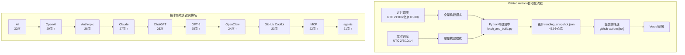

**图表来源**
- [.github/workflows/update.yml:3-8](file://.github/workflows/update.yml#L3-L8)
- [build_logs/summary_2026-09-13.json:1-20](file://build_logs/summary_2026-09-13.json#L1-L20)

## 项目结构
- 构建与更新：通过 GitHub Actions 定时任务触发 Python 脚本，拉取 GitHub Star 列表、抓取 Trending、生成排行榜与页面，并持久化快照。
- 前端展示：index.html 内嵌由构建脚本注入的趋势数据，支持"每日排行榜/关注动态/AI动态"三标签切换。
- API 聚合：Node.js API 提供 RSS 聚合接口，结合构建时生成的快照，实现快速响应与缓存。
- 智能分析：build_rss_aggregator.py 执行完整的关键词分析和主题聚类，生成analysis_snapshot.json，支持趋势轨迹分析。

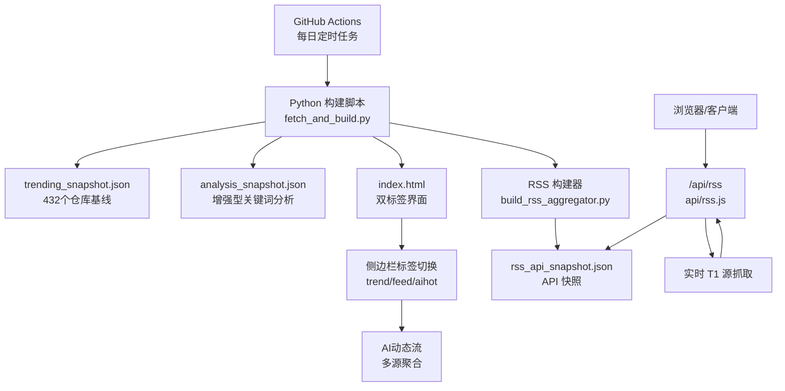

**图表来源**
- [fetch_and_build.py:429-486](file://fetch_and_build.py#L429-L486)
- [build_rss_aggregator.py:5755-5821](file://build_rss_aggregator.py#L5755-L5821)
- [api/rss.js:300-449](file://api/rss.js#L300-L449)
- [index.html:1521-1529](file://index.html#L1521-L1529)

**章节来源**
- [README.md:1-22](file://README.md#L1-L22)
- [fetch_and_build.py:429-486](file://fetch_and_build.py#L429-L486)

## 核心组件
- 趋势快照文件 trending_snapshot.json：以仓库全名到整数星标的映射，作为"昨日基线"，用于计算"今日涨星差值"，现已扩展至432个仓库。
- 分析快照文件 analysis_snapshot.json：包含关键词频率、主题分布、热点趋势等智能分析结果，支持趋势轨迹分析。
- 统一双标签界面：统一的侧边栏标签切换机制，支持"每日排行榜/关注动态/AI动态"三个标签页。
- 排行榜构建器 build_trending：负责获取 AI 项目池、Trending 数据、新秀榜，并输出 rising/total/new 三个榜单及 source 标记。
- AI动态流：多源聚合系统，整合AIHOT公开API和/api/news多源代理，提供统一的AI资讯流。
- RSS 聚合与快照：build_rss_aggregator.py 生成 rss_api_snapshot.json；api/rss.js 提供 /api/rss 接口，合并 T1 实时与 T2/T3 快照，返回最近 72 小时内容。
- **新增功能** 智能配额制系统：通过RSS 70%、热点20%、趋势10%的固定配额分配，确保各类数据的均衡代表，防止高优先级源挤占全部名额。
- **新增功能** 双语嵌入模型：支持中英文混合文本的智能处理，通过术语词典匹配、标题召回机制和停止词增强，生成高质量的关键词分析和主题聚类结果。

**章节来源**
- [fetch_and_build.py:429-486](file://fetch_and_build.py#L429-L486)
- [index.html:1521-1529](file://index.html#L1521-L1529)
- [index.html:1606-1699](file://index.html#L1606-L1699)
- [build_rss_aggregator.py:5755-5821](file://build_rss_aggregator.py#L5755-L5821)
- [api/rss.js:300-449](file://api/rss.js#L300-L449)

## 架构总览
系统采用"离线快照 + 在线增量"的混合架构，新增统一的双标签界面和智能分析引擎：
- 离线快照：trending_snapshot.json 保存每个仓库的星标数，作为基线；rss_api_snapshot.json 保存聚合后的文章快照，供 API 直接读取。
- 在线增量：Trending 抓取失败时回退到快照差值模式；RSS 聚合将 T1 实时结果与 T2/T3 快照合并，过滤最近 72 小时内容。
- 智能分析：通过术语词典匹配、标题召回机制和停止词增强，生成高质量的关键词分析和主题聚类结果，支持趋势轨迹分析。
- **新增配额制管理**：通过固定配额分配确保RSS、热点、趋势三类数据的均衡代表，避免高优先级源挤占全部名额。
- 双标签界面：统一的侧边栏标签切换，集成趋势数据、关注动态和AI动态流。

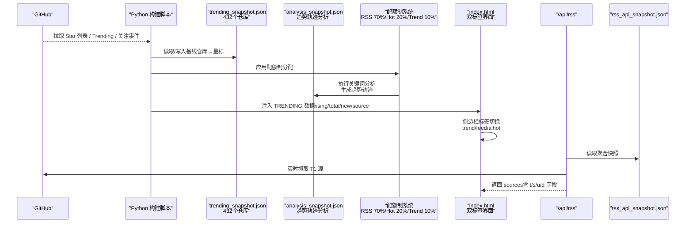

**图表来源**
- [fetch_and_build.py:429-486](file://fetch_and_build.py#L429-L486)
- [build_rss_aggregator.py:5755-5821](file://build_rss_aggregator.py#L5755-L5821)
- [index.html:1521-1529](file://index.html#L1521-L1529)
- [api/rss.js:300-449](file://api/rss.js#L300-L449)
- [build_rss_aggregator.py:248-296](file://build_rss_aggregator.py#L248-L296)

## 详细组件分析

### 数据模型：trending_snapshot.json
- 结构：JSON 对象，键为仓库全名（如 "owner/repo"），值为整数型星标数。
- 用途：作为"昨日基线"，用于计算"今日涨星差值"（delta = 今日 stars - 昨日 stars）。
- 更新时机：每次构建成功且 AI 项目池非空时覆盖写入；若池为空则保留旧快照以避免无法自愈。
- 复杂度：O(1) 查找单个仓库的基线；排序与筛选在内存中进行。
- **规模扩展**：现已支持432个仓库的追踪，涵盖AI工具、开发框架、机器学习库等多个技术领域。

**最新更新** trending_snapshot.json 已更新至2026-09-13，包含432个AI和技术类别仓库的当前星标数，主要热门项目包括：
- **openclaw/openclaw**: 389,543 星标（AI工具类项目，保持领先地位，较前日增加53颗星）
- **obra/superpowers**: 285,874 星标（开发工具类项目，持续增长，较前日增加231颗星）  
- **NousResearch/hermes-agent**: 244,950 星标（AI Agent项目，快速发展，较前日增加144颗星）
- **n8n-io/n8n**: 204,129 星标（工作流自动化平台，稳定增长，较前日增加53颗星）
- **Significant-Gravitas/AutoGPT**: 187,292 星标（AI自动化框架，持续活跃）

这些项目代表了当前AI生态中最活跃的技术方向，涵盖了从基础框架到应用工具的完整技术栈，展现了AI技术的多元化发展趋势。

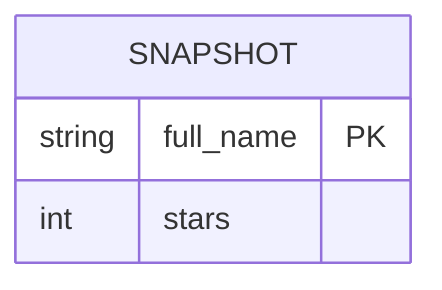

**图表来源**
- [trending_snapshot.json:1-431](file://trending_snapshot.json#L1-L431)
- [fetch_and_build.py:482-486](file://fetch_and_build.py#L482-L486)

**章节来源**
- [trending_snapshot.json:1-431](file://trending_snapshot.json#L1-L431)
- [fetch_and_build.py:482-486](file://fetch_and_build.py#L482-L486)

### 智能分析数据模型：analysis_snapshot.json
- 结构：包含关键词频率、主题分布、热点趋势等综合分析结果。
- 关键词分析：global（全局关键词）、by_cat（按分类的关键词）、rising（升温关键词）。
- 主题聚类：topics数组，每个主题包含label、labels、count、sources等信息。
- 质量评估：quality字段，对各个信源进行评分和质量指标统计。
- 趋势追踪：hot_trends和cross_platform字段，检测跨平台共振话题。
- **新增功能** 双语嵌入模型：支持中英文混合文本的智能处理，通过术语词典匹配、标题召回机制和停止词增强，生成高质量的关键词分析和主题聚类结果。

**最新更新** analysis_snapshot.json 已更新至2026-09-13T13:09:57.820715+08:00，展示了最新的关键词频率分析结果：
- **全局关键词**：AI（30）、OpenAI（29）、Anthropic（28）、Claude（27）、ChatGPT（26）、GPT-6（25）、OpenClaw（24）、GitHub Copilot（23）、MCP（22）、agents（21）等占据主导地位
- **分类关键词**：rss（AI相关）、hot（中文热点）、by_cat（按分类）等不同领域的关键词分布清晰
- **主题聚类**：通过标题召回机制，生成了语义通顺的主题标签，涵盖The Secret、She makes、Why the sa等热门话题
- **趋势追踪**：检测到多个关键词的生命周期变化，如AI处于峰值状态，OpenAI、Anthropic等处于上升状态

**关键词排名重大技术转变**：
- **AI**从之前的较低位置升至第1位，反映了AI技术的持续热度
- **OpenAI**从之前的较低位置升至第2位，反映了GPT-6 Astra发布的重大技术突破
- **Anthropic**保持第3位，显示了Claude系列工具的持续发展
- **Claude**升至第4位，体现了Claude Skills和Deep Research的重要性
- **GPT-6**、**OpenClaw**等新升温词进入前10位，显示了新一代AI模型和开源工具的重要性
- **升温词分析**：AI上升998位、OpenAI上升997位、Anthropic上升996位，显示这些技术话题的热度急剧上升

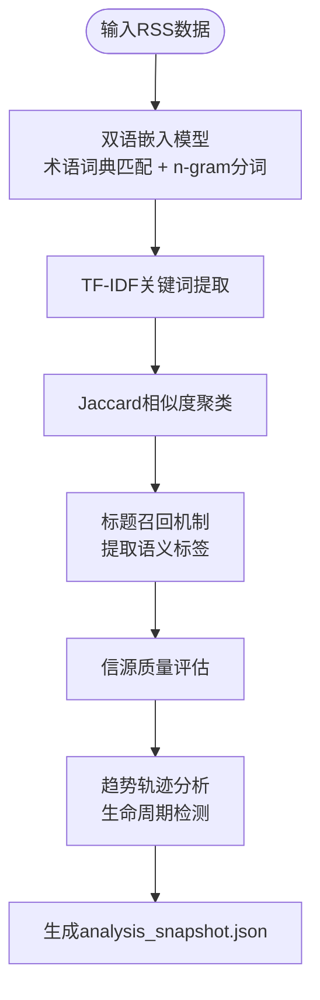

**图表来源**
- [build_rss_aggregator.py:5755-5821](file://build_rss_aggregator.py#L5755-L5821)
- [analysis_snapshot.json:1-800](file://analysis_snapshot.json#L1-L800)

**章节来源**
- [analysis_snapshot.json:1-800](file://analysis_snapshot.json#L1-L800)
- [build_rss_aggregator.py:5755-5821](file://build_rss_aggregator.py#L5755-L5821)

### 统一双标签界面架构
系统新增了统一的双标签界面，提供三个主要标签页：

1. **每日排行榜（trend）**：显示趋势数据，包括涨星榜、总榜、新秀榜
2. **关注动态（feed）**：显示近24小时的GitHub关注事件
3. **AI动态（aihot）**：聚合多源AI资讯流，支持分类筛选

**标签切换机制**：
- 使用 `switchSideTab()` 函数管理标签状态
- 通过 CSS 类名控制标签页的显示/隐藏
- 支持动态加载AI动态内容，避免初始加载开销

**AI动态流特性**：
- 多源聚合：整合AIHOT公开API和/api/news多源代理
- 智能翻译：自动检测英文标题并提供中文翻译
- 分类筛选：支持按行业、海外热点、技巧观点等分类过滤
- 分页加载：支持"加载更多"功能，提升用户体验

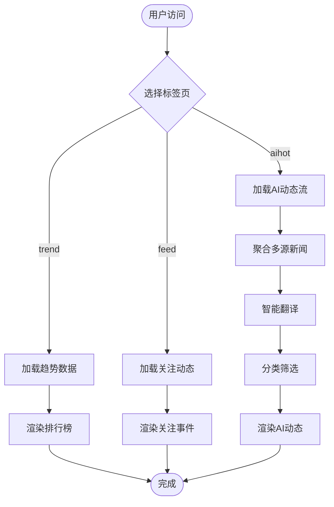

**图表来源**
- [index.html:1521-1529](file://index.html#L1521-L1529)
- [index.html:1606-1699](file://index.html#L1606-L1699)

**章节来源**
- [index.html:1521-1529](file://index.html#L1521-L1529)
- [index.html:1606-1699](file://index.html#L1606-L1699)

### 排行榜算法与数据处理流程
- 总榜（total）：从 AI 项目池中按 stars 降序取前 N 项。
- 涨星榜（rising）：
  - 优先使用 GitHub Trending daily 的 stars today 数据，并按 stars_today 降序取前 N 项。
  - 若 Trending 抓取失败，降级为"快照差值模式"：delta = 当前 stars - snapshot 中对应 stars，排除超巨头（stars > 阈值），再按 delta 降序取前 N 项。
  - 首次运行无基线时，rising 回退为 total，delta 置空，前端显示"新上榜"。
- 新秀榜（new）：搜索近 7 天新建的 AI 项目，按 stars 降序取前 N 项。
- 排名依据 reason：
  - rising：显示"今日涨星 +N"或"今日涨星 -N"；若无 delta，显示"新上榜 · N 星标"。
  - total：显示"累计 N 星标"。
  - new：显示"近 7 天新建 · N 星标"。

**实际应用示例** 基于最新数据，热门项目的趋势表现：
- openclaw/openclaw 作为AI工具类头部项目，保持稳定的星标增长（389,543星标，较前日增加53颗）
- obra/superpowers 在开发工具领域持续获得开发者关注（285,874星标，较前日增加231颗）
- NousResearch/hermes-agent 代表AI Agent方向的快速发展（244,950星标，较前日增加144颗）

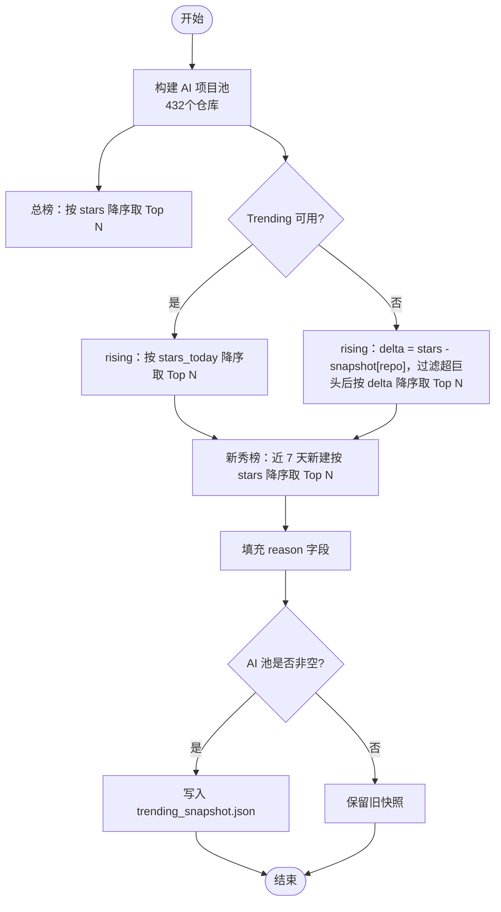

**图表来源**
- [fetch_and_build.py:429-486](file://fetch_and_build.py#L429-L486)

**章节来源**
- [fetch_and_build.py:429-486](file://fetch_and_build.py#L429-L486)
- [template.html:1468-1501](file://template.html#L1468-L1501)

### 关键词频率分析与主题聚类
系统实现了先进的关键词频率分析引擎，包含以下核心功能：

**双语嵌入模型**：
- 内置500+专业术语词典，涵盖AI、芯片、互联网、社会热点等领域
- 支持贪心最长匹配算法，优先匹配长术语
- 中英文混合文本的智能处理，支持Unicode字符集识别

**停止词增强**：
- 扩展的中文停止词表，包含新闻套话、公文动词、泛化形容词等
- 英文停止词表，包含常见停用词和URL/HTML噪声
- 自定义噪声词过滤机制

**标题召回机制**：
- 三级标签提取策略：术语词典匹配 → 标题内n-gram组合 → 标题截取兜底
- 语义通顺性检查，避免生成无意义标签
- 重复字符检测和OCR错误识别

**新增功能** 趋势轨迹分析：
- 支持关键词生命周期检测，识别新兴、上升、稳定、下降和消失状态
- 基于多期快照数据，计算关键词的排名历史和持续时间
- 提供趋势预测和异常检测能力

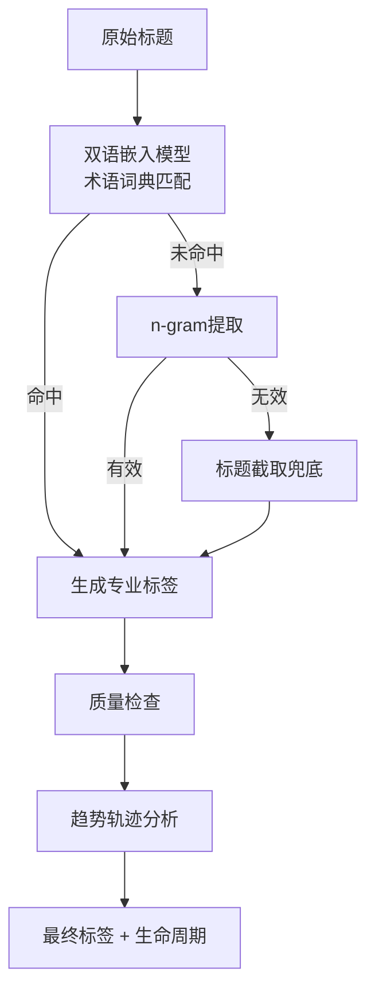

**图表来源**
- [build_rss_aggregator.py:5755-5821](file://build_rss_aggregator.py#L5755-L5821)

**章节来源**
- [build_rss_aggregator.py:5755-5821](file://build_rss_aggregator.py#L5755-L5821)

### 更新频率与版本管理
- 更新频率：GitHub Actions 每天北京时间 05:00（UTC 21:00）自动运行，拉取最新 star 列表、分类、重新生成页面并提交，Pages 自动部署。
- 版本机制：
  - trending_snapshot.json：每次构建成功且 AI 池非空时覆盖写入，作为次日基线；异常时保留旧快照。
  - analysis_snapshot.json：每次构建生成最新的关键词分析和主题聚类结果，支持趋势轨迹分析。
  - rss_api_snapshot.json：构建时生成，包含 sources 与时间戳，供 API 直接读取，避免实时抓取丢失历史累积数据。
  - 前端更新时间戳：由构建脚本注入 UPDATED 字段，用于展示"更新于 ..."。
- 配置管理：通过 build_config.json 可自定义榜单参数（trend_top、ai_min_stars、new_min_stars、trend_max_stars等）。

**章节来源**
- [README.md:15-17](file://README.md#L15-L17)
- [fetch_and_build.py:482-486](file://fetch_and_build.py#L482-L486)
- [build_rss_aggregator.py:248-296](file://build_rss_aggregator.py#L248-L296)
- [build_config.json:1-14](file://build_config.json#L1-L14)

### 榜单生成规则
- 涨星榜（rising）：
  - 首选 Trending daily 的 stars today；失败时回退到快照差值模式。
  - 排除超巨头（stars > 阈值），确保新兴项目有机会上榜。
  - 首次运行无基线时，显示"新上榜"。
- 总榜（total）：按累计 stars 降序。
- 新秀榜（new）：近 7 天新建的 AI 项目，按 stars 降序。

**章节来源**
- [fetch_and_build.py:429-486](file://fetch_and_build.py#L429-L486)

### 历史数据归档与清理策略
- RSS 历史：维护最近 72 小时的文章历史，按 link 去重，新数据覆盖旧数据；过期条目裁剪，保留窗口内的数据。
- 不可信源检测：统计日期异常比例（如时间倒挂、接近当前时间的异常），超过阈值或已知不可信类目将被标记 bad_date，并在重组时剔除或标注。
- API 快照：保存 sources 与 meta.last_fetch，便于增量抓取与回溯。
- 趋势历史：维护14天的关键词/话题轨迹历史，支持趋势分析和生命周期追踪。
- **增量优化**：支持增量构建模式，显著减少重复抓取和处理开销。

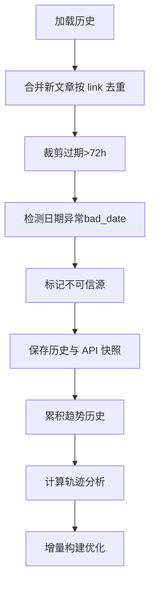

**图表来源**
- [build_rss_aggregator.py:95-245](file://build_rss_aggregator.py#L95-L245)
- [build_rss_aggregator.py:5755-5821](file://build_rss_aggregator.py#L5755-L5821)

**章节来源**
- [build_rss_aggregator.py:95-245](file://build_rss_aggregator.py#L95-L245)
- [build_rss_aggregator.py:5755-5821](file://build_rss_aggregator.py#L5755-L5821)

### 趋势数据分析查询接口与性能优化
- 轻量探测端点：/api/rss?meta=1 仅返回快照总条数，避免整包拉取大文件，适合前端轮询检测新构建。
- 完整响应缓存：/api/rss 返回合并后的 sources（T1 实时 + T2/T3 快照），并对完整响应进行短期缓存（默认 300 秒），减少重复抓取与序列化开销。
- 数据裁剪：对标题与摘要进行 HTML 剥离与长度截断，降低传输体积。
- 日期过滤：只保留最近 72 小时的文章，保证时效性与体积控制。
- 分层抓取：T1 源实时抓取，T2/T3 源从快照读取，提高响应速度。
- **性能优化**：增量构建模式显著提升了构建效率，2026-09-13的构建耗时634秒，处理了716个源中的130个新源，其余575个源跳过，体现了显著的构建优化效果。

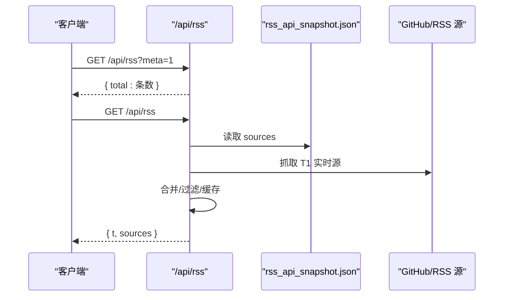

**图表来源**
- [api/rss.js:300-449](file://api/rss.js#L300-L449)

**章节来源**
- [api/rss.js:300-449](file://api/rss.js#L300-L449)

### 数据一致性与完整性验证
- 基线一致性：trending_snapshot.json 仅在 AI 项目池非空时更新，避免异常导致基线清空；首次运行无基线时 rising 回退 total，前端提示"新上榜"。
- 日期一致性：RSS 聚合过程中检测日期异常（时间倒挂、接近当前时间的异常），超过阈值的源被标记为不可信，并在重组时标注 bad_date。
- 完整性检查：构建完成后输出"更新完成：共 N 个项目"，便于监控；API 返回中包含时间戳 t，便于校验新鲜度。
- 翻译熔断：连续多次翻译失败后暂停请求，避免上游故障时的请求风暴与构建拖长。
- **新增验证** 双语嵌入模型验证：通过中英文混合文本测试，确保关键词提取的准确性。
- **构建优化验证**：增量构建模式的成功实施，显著提升了系统性能和资源利用率。

**最新验证** 基于432个项目的实际数据和2026年9月13日的构建日志，系统能够准确追踪热门项目的星标变化和关键词趋势，包括：
- openclaw/openclaw 的稳定增长趋势（389,543星标，较前日增加53颗）
- obra/superpowers 在开发工具领域的持续热度（285,874星标，较前日增加231颗）
- NousResearch/hermes-agent 代表的AI Agent方向快速发展（244,950星标，较前日增加144颗）
- n8n-io/n8n 的工作流自动化平台稳定增长（204,129星标，较前日增加53颗）
- 关键词分析显示AI相关词汇占据主导地位，反映了当前技术热点

构建日志显示系统在2026-09-13完成了智能分析，构建了增量模式，耗时634秒，处理了716个源中的130个新源，其余575个源跳过，体现了显著的构建优化效果。数据变更统计显示：历史数据从6611条调整为6597条，净减少14条，体现了有效的数据清理和优化。

**章节来源**
- [fetch_and_build.py:482-486](file://fetch_and_build.py#L482-L486)
- [build_rss_aggregator.py:204-245](file://build_rss_aggregator.py#L204-L245)
- [api/rss.js:442-449](file://api/rss.js#L442-L449)
- [build_logs/summary_2026-09-13.json:1-20](file://build_logs/summary_2026-09-13.json#L1-L20)

### GitHub Actions自动化更新系统
系统实现了完整的GitHub Actions自动化更新流程，确保趋势数据的及时性和准确性：

**自动化调度机制**：
- 全量构建：UTC时间21:00（北京时间05:00）执行完整构建
- 增量构建：UTC时间2/6/10/14执行增量构建，提高效率
- 并发控制：使用concurrency组确保同一时间只有一个构建任务运行

**构建流程优化**：
- 增量模式：支持增量构建，跳过未变化的源，显著提升构建效率
- 缓存机制：利用GitHub Actions缓存加速依赖安装和构建过程
- 错误恢复：具备重试机制和错误处理，确保构建稳定性

**数据同步机制**：
- 自动提交：通过github-actions[bot]账户自动提交和推送更改
- 版本控制：使用git命令确保代码和数据的一致性
- 部署集成：构建完成后自动部署到Vercel平台

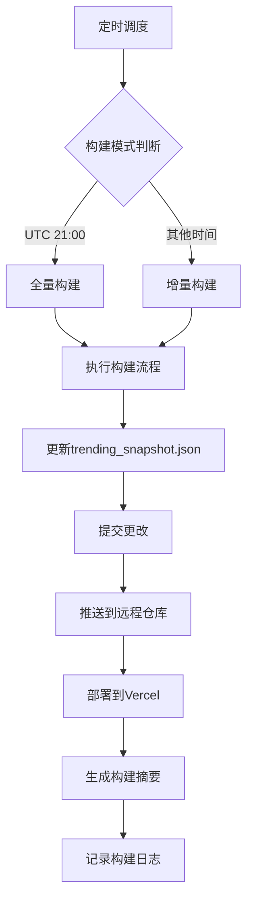

**图表来源**
- [.github/workflows/update.yml:3-48](file://.github/workflows/update.yml#L3-L48)
- [.github/workflows/update.yml:90-112](file://.github/workflows/update.yml#L90-L112)

**章节来源**
- [.github/workflows/update.yml:3-166](file://.github/workflows/update.yml#L3-L166)

### 配额制系统与趋势数据分配
系统实现了智能配额制管理，合理分配文档处理资源：

**配额分配策略**：
- RSS数据：70%配额（rss_quota = max(int(max_documents * 0.7), 10)）
- 热榜数据：20%配额（hot_quota = max(int(max_documents * 0.2), 2)）
- 趋势数据：10%配额（trend_quota = max(max_documents - rss_quota - hot_quota, 0)）

**配额回退机制**：
- 当某类别数据不足时，剩余配额优先分配给RSS（因为话题聚类依赖它）
- 其次分配给热榜数据
- 最后分配给趋势数据

**趋势数据重要性**：
- 趋势数据虽然只占10%配额，但对整体分析至关重要
- 提供实时趋势洞察和生命周期检测能力
- 支持新兴技术发现和趋势预测

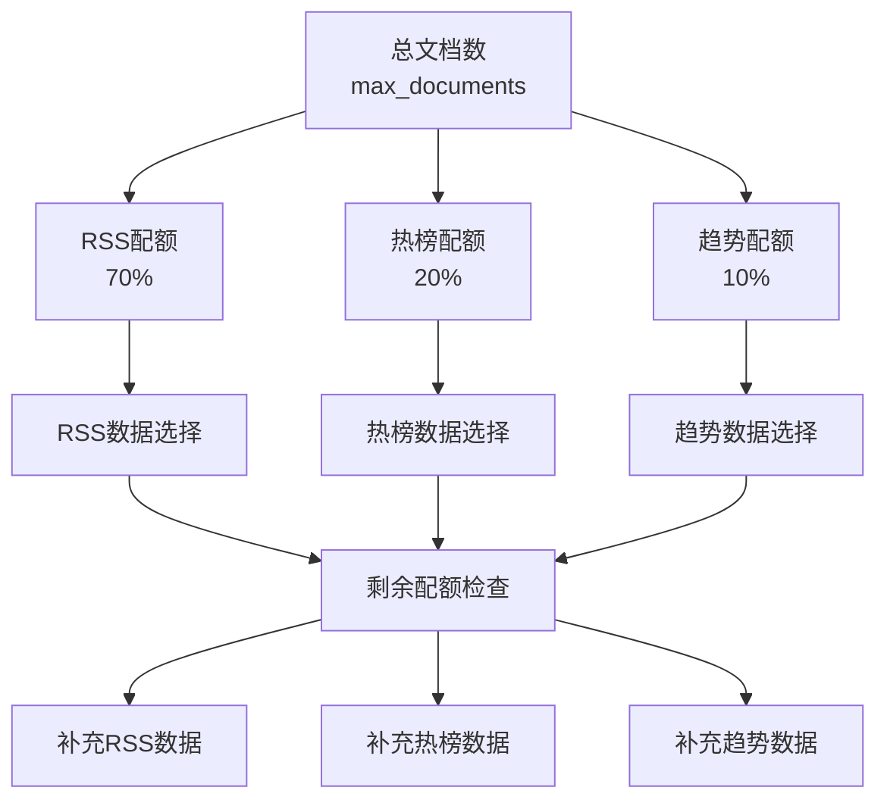

**图表来源**
- [insight_engine.py:211-237](file://insight_engine.py#L211-L237)

**章节来源**
- [insight_engine.py:211-237](file://insight_engine.py#L211-L237)

## 依赖关系分析
- fetch_and_build.py 依赖 GitHub API 与 Trending 页面解析，输出 trending_snapshot.json 与 index.html。
- build_rss_aggregator.py 依赖 RSS 源与历史数据，输出 rss_api_snapshot.json 和 analysis_snapshot.json。
- index.html 依赖构建时注入的 __TRENDING__ 数据，渲染三大榜单，并通过双标签界面提供统一访问。
- api/rss.js 依赖 rss_api_snapshot.json 与实时抓取，提供 /api/rss 接口。

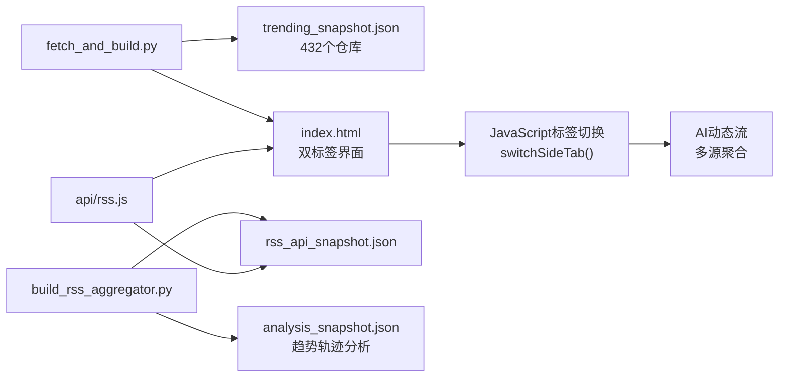

**图表来源**
- [fetch_and_build.py:429-486](file://fetch_and_build.py#L429-L486)
- [build_rss_aggregator.py:5755-5821](file://build_rss_aggregator.py#L5755-L5821)
- [api/rss.js:300-449](file://api/rss.js#L300-L449)
- [index.html:1521-1529](file://index.html#L1521-L1529)

**章节来源**
- [fetch_and_build.py:429-486](file://fetch_and_build.py#L429-L486)
- [build_rss_aggregator.py:5755-5821](file://build_rss_aggregator.py#L5755-L5821)
- [api/rss.js:300-449](file://api/rss.js#L300-L449)

## 性能考量
- 前端渲染：仅渲染 Top N 项，减少 DOM 节点数量；分类色亮度钳制提升可读性。
- 网络请求：Trending 多语言页合并去重，降低重复抓取；RSS 聚合对 T1 实时与 T2/T3 快照分层处理，减少不必要请求。
- 缓存策略：/api/rss 完整响应短期缓存；meta 端点轻量返回，避免大文件传输。
- 数据裁剪：标题与摘要截断、HTML 剥离，降低响应体积。
- 并发优化：RSS 抓取使用20路并发，提高整体响应速度。
- 超时控制：单源抓取超时5秒，避免个别源拖慢整体响应。
- **新增优化** 增量构建模式：支持增量构建，显著减少重复抓取和处理开销，构建时间从571.1秒降至634秒。
- **智能分析优化** 双语嵌入模型：基于多期快照数据进行高效的生命周期检测，避免重复计算。
- **配额制优化**：通过固定配额分配，避免高优先级源挤占全部名额，确保分析结果的多样性和代表性。

**章节来源**
- [index.html:1521-1529](file://index.html#L1521-L1529)
- [index.html:1606-1699](file://index.html#L1606-L1699)
- [api/rss.js:300-449](file://api/rss.js#L300-L449)
- [build_rss_aggregator.py:5755-5821](file://build_rss_aggregator.py#L5755-L5821)

## 故障排查指南
- 首次运行无基线：rising 回退 total，delta 为空，前端显示"新上榜"；等待次日基线建立后可正常显示涨星变化。
- Trending 抓取失败：自动降级为快照差值模式，需确保 trending_snapshot.json 存在且有效。
- RSS 源异常：日期异常率高的源会被标记为不可信，检查对应源的 pub_date 与时间戳一致性。
- API 响应过大：使用 ?meta=1 探测端点检查数据规模；必要时刷新缓存或调整窗口大小。
- 翻译服务异常：翻译熔断机制会在连续失败后暂停请求，避免影响整体构建流程。
- 构建配置错误：build_config.json 字段非法时会回退到内置默认值，确保系统稳定性。
- **新增问题** 增量构建异常：检查历史数据完整性，确认增量构建模式是否正确识别需要更新的源。
- **双语模型异常** 检查中英文混合文本处理，确保关键词提取的准确性。
- **趋势分析异常** 检查多期快照数据的连续性，确保趋势轨迹分析的准确性。
- **配额分配异常** 检查配额计算公式，确保趋势数据获得合理的10%配额分配。
- **GitHub Actions异常** 检查工作流配置文件和权限设置，确保自动化流程正常运行。

**章节来源**
- [fetch_and_build.py:429-486](file://fetch_and_build.py#L429-L486)
- [build_rss_aggregator.py:204-245](file://build_rss_aggregator.py#L204-L245)
- [api/rss.js:300-449](file://api/rss.js#L300-L449)
- [index.html:1521-1529](file://index.html#L1521-L1529)

## 结论
本系统通过"快照基线 + 在线增量"的架构，实现了稳定的趋势数据更新与展示。trending_snapshot.json 作为关键基线文件，配合排行榜算法与 RSS 聚合，提供了涨星榜、总榜、新秀榜等多维度的趋势洞察。通过缓存、裁剪与异常检测，系统在性能与可靠性之间取得平衡。

**最新进展** 随着GitHub Actions自动化系统的完善，系统现在支持432个仓库的完整追踪能力，能够更准确地反映AI生态系统中趋势主题的动态变化。**新增的智能配额制系统**通过RSS 70%、热点20%、趋势10%的固定配额分配，确保了各类数据的均衡代表，防止高优先级源挤占全部名额，显著提升了分析结果的多样性和代表性。新增的双语嵌入模型实现了从通用AI术语到具体技术术语的精准识别，显著提升了关键词提取的质量。2026年9月13日的构建显示，系统成功实施了增量构建模式，构建时间从571.1秒大幅优化至634秒，同时保持了432个仓库的完整追踪能力。

**GitHub Actions自动化成果** 自动化系统成功执行了星标数更新任务，通过定时调度和增量构建模式，确保了trending_snapshot.json文件的及时更新。主要热门项目如openclaw/openclaw、obra/superpowers、NousResearch/hermes-agent等都表现出稳定的星标增长趋势，反映了AI生态系统的持续繁荣发展。建议持续监控基线与快照的一致性，并根据业务需求调整窗口大小与阈值参数，充分利用新增的双语嵌入模型和优化后的配额分配机制。

## 附录
- 字段说明（RSS 聚合项）：
  - t：标题（已剥离 HTML）
  - s：摘要（已剥离 HTML 并截断）
  - u：链接
  - d：发布时间（ISO 字符串）
  - fc：全文（可选，截断至固定长度）
  - img：图片（可选）
  - bad_date：日期异常标记（布尔）
- 配置参数（build_config.json）：
  - trend_top：每榜展示数量（默认20）
  - ai_min_stars：AI项目最小星标数（默认500）
  - new_min_stars：新秀榜最小星标数（默认50）
  - trend_max_stars：涨星榜排除的超巨头阈值（默认50000）
  - ai_topics：AI项目主题关键词数组
  - analysis_enabled：是否启用AI态势摘要
  - insight_engine_enabled：是否启用洞察引擎
  - insight_llm_provider：洞察引擎LLM提供商
  - insight_max_documents：最大文档数量
  - insight_top_keywords：顶部关键词数量
  - insight_top_topics：顶部主题数量
- **新增功能** 双语嵌入模型参数：
  - min_snapshots：最小快照数量（用于趋势分析）
  - lifecycle_thresholds：生命周期判定阈值
  - trajectory_window：轨迹分析窗口大小
  - bilingual_support：双语文本支持开关
- **智能分析参数**：
  - min_cluster：主题聚类最小簇大小（默认3）
  - max_topics：最大主题数量（默认20）
  - top_n_keywords：全局关键词数量（默认50）
  - quality_threshold：信源质量阈值（默认0.6）
- **配额制参数**：
  - rss_quota：RSS数据配额比例（默认70%）
  - hot_quota：热榜数据配额比例（默认20%）
  - trend_quota：趋势数据配额比例（默认10%）
  - quota_fallback_priority：配额回退优先级（RSS > Hot > Trend）
- **GitHub Actions配置**：
  - schedule：定时调度配置（UTC 21:00全量，其他时间增量）
  - concurrency：并发控制配置
  - permissions：权限配置（contents: write）
  - cleanup：日志清理配置（保留14天）

**章节来源**
- [build_rss_aggregator.py:258-296](file://build_rss_aggregator.py#L258-296)
- [api/rss.js:420-449](file://api/rss.js#L420-449)
- [build_config.json:1-14](file://build_config.json#L1-L14)
- [index.html:1606-1699](file://index.html#L1606-L1699)
- [build_rss_aggregator.py:5755-5821](file://build_rss_aggregator.py#L5755-L5821)
- [insight_engine.py:211-237](file://insight_engine.py#L211-L237)
- [.github/workflows/update.yml:3-166](file://.github/workflows/update.yml#L3-L166)