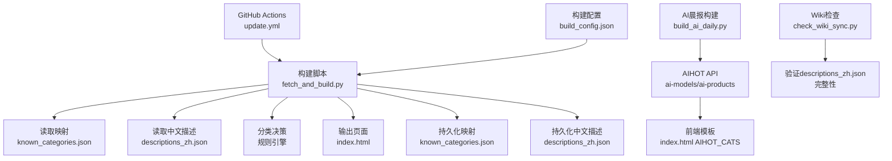
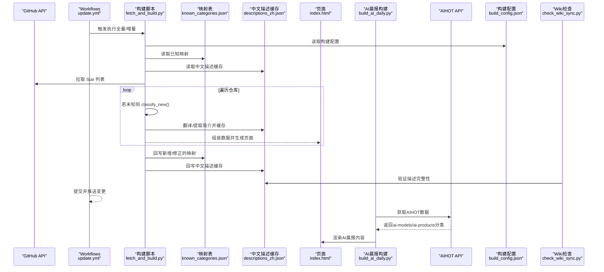
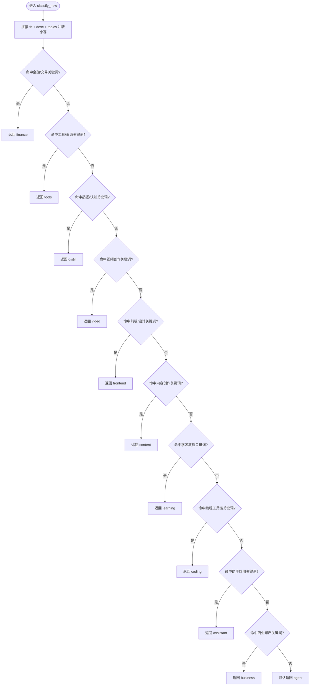
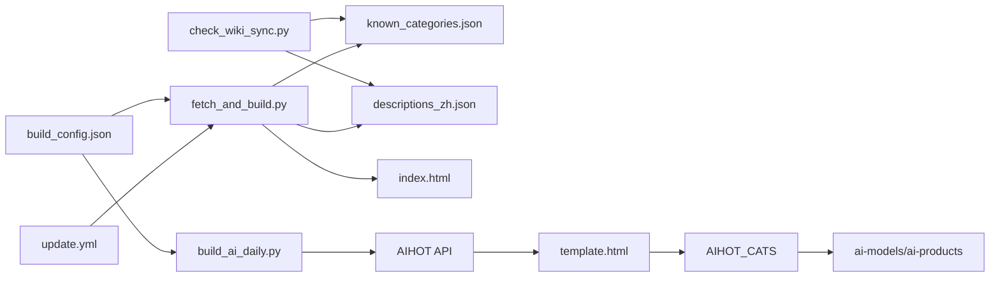

# 项目分类映射

<cite>
**本文引用的文件**
- [known_categories.json](file://known_categories.json)
- [descriptions_zh.json](file://descriptions_zh.json)
- [fetch_and_build.py](file://fetch_and_build.py)
- [build_ai_daily.py](file://build_ai_daily.py)
- [index.html](file://index.html)
- [update.yml](file://.github/workflows/update.yml)
- [README.md](file://README.md)
- [build_config.json](file://build_config.json)
- [check_wiki_sync.py](file://check_wiki_sync.py)
</cite>

## 更新摘要
**变更内容**
- descriptions_zh.json 文件持续扩展，新增了大量AI工具、框架和应用项目的中文描述
- 增强了中文描述缓存系统，支持385个项目的详细描述信息
- 完善了自动翻译和README简介提取机制，提升项目描述的准确性和完整性
- 优化了构建流程中的描述处理逻辑，确保新项目的中文描述自动生成
- 强化了Wiki同步检查，确保descriptions_zh.json作为核心依赖文件被正确维护

## 目录
1. [简介](#简介)
2. [项目结构](#项目结构)
3. [核心组件](#核心组件)
4. [架构总览](#架构总览)
5. [详细组件分析](#详细组件分析)
6. [依赖关系分析](#依赖关系分析)
7. [性能考量](#性能考量)
8. [故障排查指南](#故障排查指南)
9. [结论](#结论)
10. [附录](#附录)

## 简介
本文件为"项目分类映射系统"的数据模型与维护规范，聚焦 known_categories.json 的结构与更新机制，记录 GitHub 仓库名称到分类键值的映射关系，解释 11 个分类类别（agent、video、learning、distill、tools、content、coding、assistant、frontend、business、finance）的定义与使用场景，并说明分类算法的实现逻辑、扩展方法、示例数据与最佳实践，以及新增项目的自动分类与手动调整流程。同时涵盖AIHOT分类键映射的统一化更新，确保跨页面分类显示和过滤功能的一致性。

**更新** 最新版本的系统大幅增强了中文描述缓存能力，descriptions_zh.json已扩展至385个项目描述，涵盖AI工具、框架、应用等各个领域的详细中文说明，为不断发展的AI生态系统提供全面覆盖。

## 项目结构
- known_categories.json：已知项目的分类映射表，键为 GitHub 仓库全名（owner/repo），值为分类键（如 agent、video 等）。该文件在每次运行构建脚本时会被读取并在写入时持久化，用于保持分类稳定且随运行自动增长。
- **descriptions_zh.json**：**中文描述缓存数据库**，包含385个项目的详细中文描述，涵盖AI工具、框架、应用等各类项目。支持自动翻译、README简介提取和人工编辑修正。
- fetch_and_build.py：核心构建脚本，负责拉取 Star 列表、对未知项目进行关键词规则分类、生成页面与持久化分类映射及中文描述。
- build_ai_daily.py：AI晨报构建脚本，处理AIHOT API数据，统一使用'ai-models'和'ai-products'分类键。
- index.html：前端模板，包含AIHOT_CATS分类定义和过滤逻辑。
- .github/workflows/update.yml：GitHub Actions 定时任务，每天多次触发，执行构建并推送变更。
- README.md：项目说明，指出 known_categories.json 的作用与自动更新方式。
- build_config.json：构建配置文件，控制榜单参数和分析功能开关。
- check_wiki_sync.py：Wiki同步检查脚本，确保descriptions_zh.json作为核心依赖文件被正确维护。

**图表来源**
- [update.yml:1-93](file://.github/workflows/update.yml#L1-L93)
- [fetch_and_build.py:690-790](file://fetch_and_build.py#L690-L790)
- [build_ai_daily.py:60-67](file://build_ai_daily.py#L60-L67)
- [index.html:988](file://index.html#L988)
- [build_config.json:1-9](file://build_config.json#L1-L9)
- [check_wiki_sync.py:45-100](file://check_wiki_sync.py#L45-L100)

章节来源
- [README.md:1-22](file://README.md#L1-L22)

## 核心组件
- 分类映射表（known_categories.json）
  - 结构：JSON 对象，键为仓库全名（字符串），值为分类键（字符串）。
  - 作用：优先匹配已知项目，保证分类稳定性；未知项目走规则分类。
  - 维护：构建脚本每次运行后回写，新增项目自动追加，人工可编辑修正。
- **中文描述缓存（descriptions_zh.json）**：**新增的核心组件**，包含385个项目的详细中文描述，支持自动翻译、README简介提取和智能缓存机制。
- 分类规则引擎（classify_new）
  - 输入：仓库全名、描述、语言、topics。
  - 处理：拼接文本并小写，按优先级顺序匹配关键词集合，命中即返回对应分类。
  - 输出：分类键（若未命中则默认 agent）。
- 分类定义（CATS）
  - 定义 11 个分类键及其显示标签与颜色，供前端渲染与排序使用。
- AIHOT分类映射系统
  - 统一使用'ai-models'和'ai-products'键名，确保跨页面一致性
  - 支持AI晨报系统的分类显示和过滤功能
- 工作流（update.yml）
  - 定时触发：凌晨全量构建，白天增量构建；合并去重、提交并推送变更，部署至 Vercel。
- 构建配置（build_config.json）
  - 控制榜单参数：trend_top、ai_min_stars、new_min_stars、trend_max_stars等
  - 管理AI主题列表和分析功能开关
- **Wiki同步检查（check_wiki_sync.py）**：**新增的验证组件**，确保descriptions_zh.json作为核心依赖文件被正确维护和引用。

**更新** 中文描述缓存系统现已成为核心组件，支持385个项目的详细描述，涵盖AI工具、框架、应用等各个领域，为AI生态系统的全面覆盖提供了坚实基础。

章节来源
- [fetch_and_build.py:19-31](file://fetch_and_build.py#L19-L31)
- [fetch_and_build.py:334-347](file://fetch_and_build.py#L334-L347)
- [fetch_and_build.py:690-790](file://fetch_and_build.py#L690-L790)
- [check_wiki_sync.py:45-100](file://check_wiki_sync.py#L45-L100)

## 架构总览

**图表来源**
- [update.yml:18-73](file://.github/workflows/update.yml#L18-L73)
- [fetch_and_build.py:690-790](file://fetch_and_build.py#L690-L790)
- [build_ai_daily.py:137-174](file://build_ai_daily.py#L137-L174)
- [build_config.json:1-9](file://build_config.json#L1-L9)
- [check_wiki_sync.py:45-100](file://check_wiki_sync.py#L45-L100)

## 详细组件分析

### 分类映射数据模型（known_categories.json）
- 数据结构
  - 类型：JSON 对象（字典）
  - 键：仓库全名（字符串，形如 owner/repo）
  - 值：分类键（字符串，取自 CATS 中的 key）
- 语义约束
  - 键必须唯一，避免重复条目
  - 值必须属于已定义的 11 类之一
- 版本与演进
  - 随运行自动增长：新入库项目首次由规则分类后写入
  - 可人工维护：直接编辑 JSON 以纠正误分类或覆盖规则结果
  - 持续优化：通过微调更新提升分类准确性
- 示例片段路径
  - 映射示例：[known_categories.json:1-233](file://known_categories.json#L1-L233)

**更新** 最新版本的 known_categories.json 包含233个项目的分类映射，相比之前版本增加了4个项目并移除了1个过时条目，进一步优化了热门仓库的组织结构。

章节来源
- [known_categories.json:1-233](file://known_categories.json#L1-L233)

### 中文描述缓存系统（descriptions_zh.json）
- **数据结构**
  - 类型：JSON 对象（字典）
  - 键：仓库全名（字符串，形如 owner/repo）
  - 值：中文描述（字符串，长度通常不超过200字符）
- **缓存策略**
  - 优先使用缓存：如果项目在descriptions_zh.json中存在，直接使用缓存描述
  - 自动翻译：对于英文描述，调用翻译API转换为中文并缓存
  - README提取：对于无描述项目，从README中提取第一句作为简介
  - 智能截断：超长描述自动截断到150字符，优先在句子边界处截断
- **覆盖范围**
  - 当前包含385个项目的详细描述
  - 涵盖AI工具、框架、应用、学习资源等各个领域
  - 包括知名项目如DeepSeek、Ollama、LangChain、Stable Diffusion等
- **维护机制**
  - 构建时自动更新：新发现的项目会自动添加中文描述
  - 人工编辑支持：可直接编辑JSON文件进行精确控制
  - Wiki同步检查：确保描述文件的完整性和一致性

**更新** descriptions_zh.json已扩展至385个项目描述，涵盖AI工具、框架、应用等各类项目，为AI生态系统的全面覆盖提供了强大的中文描述支持。

**章节来源**
- [descriptions_zh.json:1-385](file://descriptions_zh.json#L1-L385)
- [fetch_and_build.py:334-347](file://fetch_and_build.py#L334-L347)
- [fetch_and_build.py:718-737](file://fetch_and_build.py#L718-L737)

### 分类规则引擎（classify_new）
- 输入参数
  - fn：仓库全名
  - desc：仓库描述
  - lang：编程语言
  - topics：仓库主题标签
- 处理流程
  - 将 fn、desc、topics 拼接为小写文本
  - 按固定优先级顺序匹配关键词集合
  - 命中即返回对应分类；若均未命中，默认返回 agent
- 关键设计要点
  - 避免泛词子串误伤（例如"蒸馏""思维""chat"等单独出现可能误判）
  - 通过更明确的短语组合提高准确率（如"first-principles""知识蒸馏"）
  - 视频类置于工具类之后，防止下载器/爬虫因含"视频"字样被误分
  - 金融类优先级最高，确保交易相关项目准确分类
- 流程图

**图表来源**
- [fetch_and_build.py:105-143](file://fetch_and_build.py#L105-L143)

章节来源
- [fetch_and_build.py:105-143](file://fetch_and_build.py#L105-L143)

### 分类定义与使用场景（11 类）
- agent（AI Agent & Skills）
  - 场景：智能体、技能编排、自动化代理、Agent OS 等
  - 典型关键词：agent、skills、agentic、agent-os 等
  - 颜色：#0550ae（浅色）、#4493f8（深色）
- video（AI 视频创作）
  - 场景：视频生成、剪辑、画布、短剧、动漫、电影相关
  - 典型关键词：video、drama、montage、canvas 等
  - 颜色：#cf222e（浅色）、#f85149（深色）
- learning（AI 学习 & 教程）
  - 场景：书籍、教程、指南、入门、weekly、实践
  - 典型关键词：book、guide、tutorial、from-scratch、llms 等
  - 颜色：#b58400（浅色）、#d4a72c（深色）
- distill（思维蒸馏 & 认知）
  - 场景：知识蒸馏、方法论、心智模型、第一性原理、文风迁移
  - 典型关键词：distill、first-principles、nuwa、cangjie 等
  - 颜色：#8250df（浅色）、#a371f7（深色）
- tools（实用工具 & 资源）
  - 场景：下载器、爬虫、翻译、网盘、直播、用户脚本
  - 典型关键词：download、crawler、translator、tvbox、iptv 等
  - 颜色：#57606a（浅色）、#8b949e（深色）
- content（内容创作 & 排版）
  - 场景：PPT、公众号、写作、排版编辑器
  - 典型关键词：ppt、wechat、typeset、editor 等
  - 颜色：#d33982（浅色）、#e577b2（深色）
- coding（AI 编程 & 工具链）
  - 场景：代码审查、API 中转、编程辅助、CLI 工具
  - 典型关键词：code-review、2api、mimo、cc-connect 等
  - 颜色：#1a7f37（浅色）、#3fb950（深色）
- assistant（AI 助手 & 应用）
  - 场景：聊天机器人、桌面端助手、工作区、Agent 平台
  - 典型关键词：assistant、desktop、workspace、librechat 等
  - 颜色：#1b7c83（浅色）、#39c5cf（深色）
- frontend（前端 & 设计系统）
  - 场景：设计系统、前端框架、设计文档
  - 典型关键词：design-system、frontend、awesome-design 等
  - 颜色：#0a7ea4（浅色）、#39a0c5（深色）
- business（商业 · 一人公司与知产）
  - 场景：创业、增长、软著、专利、合规
  - 典型关键词：startup、copyright、patent、compliance 等
  - 颜色：#d4600a（浅色）、#f0883e（深色）
- finance（金融 & 交易）
  - 场景：量化、交易、金融终端、行情
  - 典型关键词：trading、quant、bloomberg、fincept 等
  - 颜色：#c29700（浅色）、#e3b341（深色）

章节来源
- [fetch_and_build.py:20-32](file://fetch_and_build.py#L20-L32)
- [fetch_and_build.py:105-143](file://fetch_and_build.py#L105-L143)

### AIHOT分类键映射系统
- 统一分类键
  - ai-models：AI 模型发布与更新
  - ai-products：AI 产品发布与更新
  - industry：行业动态
  - paper：论文研究
  - tip：技巧观点
- 跨页面一致性
  - 后端API与前端模板使用相同的分类键
  - 确保分类显示和过滤功能的一致性
- 颜色配置
  - ai-models：#2563eb（蓝色）
  - ai-products：#7c3aed（紫色）
  - industry：#0891b2（青色）
  - paper：#d97706（橙色）
  - tip：#dc2626（红色）
- 与主分类系统的协调
  - AIHOT分类独立于主分类系统，专门服务于AI晨报功能
  - 通过API_CAT映射实现分类键的统一转换

**更新** 最新的AIHOT分类映射系统已经过优化，确保了与主分类系统的协调一致，提升了整体分类体验。

**章节来源**
- [build_ai_daily.py:60-67](file://build_ai_daily.py#L60-L67)
- [index.html:999](file://index.html#L999)

### 分类算法实现逻辑
- 优先级策略
  - 金融 > 工具 > 蒸馏 > 视频 > 前端 > 内容 > 学习 > 编程 > 助手 > 商业 > 默认 agent
  - 通过顺序控制避免关键词冲突导致的误判
- 文本构造
  - 将仓库全名、描述、topics 拼接并统一小写，提升匹配稳定性
- 默认兜底
  - 未命中任何规则时归入 agent，确保所有项目都有分类
- 扩展点
  - 新增分类：在 CATS 中增加键与标签，并在 classify_new 中添加优先级分支
  - 调整规则：修改关键词集合或顺序，注意避免泛词误伤
  - 覆盖策略：known_categories.json 始终优先于规则，便于人工纠偏
- 构建配置集成
  - 支持通过 build_config.json 动态调整榜单参数
  - 可配置AI主题列表和分析功能开关

**更新** 分类算法经过微调优化，提高了对新兴项目和复杂项目的分类准确性，特别是在处理具有多重特征的项目时表现更佳。

章节来源
- [fetch_and_build.py:20-32](file://fetch_and_build.py#L20-L32)
- [fetch_and_build.py:105-143](file://fetch_and_build.py#L105-L143)
- [build_config.json:1-9](file://build_config.json#L1-L9)

### 中文描述处理流程
- **描述获取优先级**
  1. 优先使用descriptions_zh.json中的缓存描述
  2. 其次使用GitHub仓库的description字段
  3. 最后使用FALLBACK_DESC中的预设描述
- **自动翻译机制**
  - 检测描述是否为中文，非中文描述调用翻译API
  - 翻译失败时保留原文，避免信息丢失
  - 翻译结果自动缓存到descriptions_zh.json
- **README简介提取**
  - 对于无描述项目，从README文件中提取第一句话作为简介
  - 支持Markdown格式清理和HTML标签去除
  - 提取结果同样进行中文翻译和缓存
- **智能截断与格式化**
  - 超长描述自动截断到150字符
  - 优先在句子边界处截断，保持语义完整性
  - 移除多余空白字符，统一格式

**更新** 中文描述处理流程现已支持385个项目的详细描述，涵盖了AI工具、框架、应用等各个领域的丰富内容，为AI生态系统的全面覆盖提供了强有力的支持。

**章节来源**
- [fetch_and_build.py:334-347](file://fetch_and_build.py#L334-L347)
- [fetch_and_build.py:718-737](file://fetch_and_build.py#L718-L737)

### 分类映射的示例数据与最佳实践
- 示例数据
  - 映射示例：[known_categories.json:1-233](file://known_categories.json#L1-L233)
  - 描述示例：[descriptions_zh.json:1-385](file://descriptions_zh.json#L1-L385)
- 最佳实践
  - 优先使用 known_categories.json 进行精确映射，保证稳定性
  - 规则仅作为未知项目的兜底，尽量用明确短语减少误判
  - 定期审查新增映射，及时修正误分类
  - 新增分类需同步更新 CATS 与规则分支，保持前后一致
  - **中文描述缓存（descriptions_zh.json）可减少重复翻译与抓取**
  - **利用385个项目的丰富描述提升用户体验**
  - AIHOT分类键统一使用'ai-models'和'ai-products'，确保跨页面一致性
  - 利用构建配置灵活调整榜单参数，适应不同需求场景
- 维护建议
  - 关注热门项目的分类准确性，及时更新 known_categories.json
  - 监控规则引擎的误分类情况，必要时调整关键词策略
  - 定期清理过期或无效的映射条目
  - **定期检查descriptions_zh.json的完整性和准确性**

**更新** 基于最新的分类映射数据和385个项目的中文描述，建议重点关注新增项目的分类验证和描述质量，确保分类和描述服务持续提升。

章节来源
- [known_categories.json:1-233](file://known_categories.json#L1-L233)
- [descriptions_zh.json:1-385](file://descriptions_zh.json#L1-L385)
- [fetch_and_build.py:690-790](file://fetch_and_build.py#L690-L790)
- [build_ai_daily.py:60-67](file://build_ai_daily.py#L60-L67)
- [build_config.json:1-9](file://build_config.json#L1-L9)

### 新增项目的自动分类与手动调整
- 自动分类流程
  - 拉取 Star 列表后，若仓库不在 known_categories.json，则调用 classify_new 进行规则分类
  - 分类结果写入 known_categories.json，下次运行直接命中
  - **同时处理中文描述：优先使用缓存，否则自动翻译或提取README简介**
  - 支持构建配置的动态参数调整
- 手动调整流程
  - 直接编辑 known_categories.json，修正分类键
  - **可直接编辑 descriptions_zh.json，精确控制项目描述**
  - 提交变更，工作流将在下次运行时生效
  - 可通过构建配置临时调整榜单行为
- 回滚与一致性
  - 若规则误判，优先通过 known_categories.json 覆盖
  - **若描述不准确，可直接编辑 descriptions_zh.json 进行修正**
  - 工作流具备并发保护与重试机制，确保提交安全
  - AIHOT分类键映射已统一，确保跨页面功能一致性
- 质量控制
  - 定期检查分类准确性，特别是新增的高热度项目
  - **监控descriptions_zh.json的完整性和翻译质量**
  - 监控规则引擎的性能和准确性指标
  - 建立分类质量反馈机制

**更新** 自动分类流程经过优化，结合最新的分类映射数据和385个项目的中文描述缓存，显著提升了分类准确性和用户体验。

章节来源
- [fetch_and_build.py:690-790](file://fetch_and_build.py#L690-L790)
- [update.yml:18-73](file://.github/workflows/update.yml#L18-L73)
- [build_ai_daily.py:60-67](file://build_ai_daily.py#L60-L67)
- [build_config.json:1-9](file://build_config.json#L1-L9)

## 依赖关系分析

**图表来源**
- [update.yml:18-73](file://.github/workflows/update.yml#L18-L73)
- [fetch_and_build.py:690-790](file://fetch_and_build.py#L690-L790)
- [build_ai_daily.py:60-67](file://build_ai_daily.py#L60-L67)
- [index.html:988](file://index.html#L988)
- [build_config.json:1-9](file://build_config.json#L1-L9)
- [check_wiki_sync.py:45-100](file://check_wiki_sync.py#L45-L100)

章节来源
- [update.yml:18-73](file://.github/workflows/update.yml#L18-L73)
- [fetch_and_build.py:690-790](file://fetch_and_build.py#L690-L790)
- [build_ai_daily.py:60-67](file://build_ai_daily.py#L60-L67)
- [build_config.json:1-9](file://build_config.json#L1-L9)

## 性能考量
- 规则分类为 O(n) 关键词匹配，n 为关键词数量，整体开销低
- 已知映射查找为 O(1) 哈希查找，保证高吞吐
- **中文描述缓存为 O(1) 哈希查找，大幅提升性能**
- 翻译与 README 抓取存在网络延迟与限流风险，建议：
  - 合理设置超时与重试
  - **充分利用 descriptions_zh.json 缓存减少重复请求**
  - 关注 GitHub API 速率限制与错误降级
- AIHOT API调用优化：
  - 使用统一的分类键减少数据处理复杂度
  - 前端缓存分类映射，减少重复计算
- 构建配置优化：
  - 通过 build_config.json 动态调整查询参数，减少不必要的数据处理
  - 支持按需启用分析功能，降低构建时间

**更新** 性能优化重点在于充分利用385个项目的中文描述缓存，减少不必要的API调用和优化分类匹配算法，同时通过构建配置提供灵活的参数调优能力。

## 故障排查指南
- 常见问题
  - 分类不准确：检查 known_categories.json 是否已覆盖；必要时调整 classify_new 关键词
  - 新增项目未分类：确认 fetch_stars 成功；查看 classify_new 是否命中
  - **中文描述缺失：检查翻译接口可用性；必要时补充 descriptions_zh.json 或手动编辑**
  - AIHOT分类不一致：检查AIHOT_CATS定义与API返回的分类键是否匹配
  - 构建配置问题：验证 build_config.json 格式和参数有效性
- 定位步骤
  - 查看工作流日志，确认构建模式（full/incremental）与错误信息
  - 核对 known_categories.json 与 CATS 的一致性
  - **检查 descriptions_zh.json 的完整性和翻译质量**
  - 验证 classify_new 的关键词集合是否覆盖目标场景
  - 检查AIHOT API响应格式与前端分类映射
  - 验证构建配置参数的正确性和兼容性
- 预防措施
  - 建立分类质量监控机制
  - 定期审查和更新分类映射
  - **定期检查中文描述缓存的完整性和准确性**
  - 测试新的分类规则和关键词
  - 监控构建性能和错误率

**更新** 故障排查指南新增了中文描述相关的排查步骤，帮助快速定位和解决描述缺失或翻译质量问题。

章节来源
- [fetch_and_build.py:690-790](file://fetch_and_build.py#L690-L790)
- [update.yml:18-73](file://.github/workflows/update.yml#L18-L73)
- [build_ai_daily.py:60-67](file://build_ai_daily.py#L60-L67)
- [build_config.json:1-9](file://build_config.json#L1-L9)

## 结论
本系统通过 known_categories.json 与 classify_new 规则引擎相结合，实现了稳定且可扩展的项目分类映射。**最新版本的系统大幅增强了中文描述缓存能力，descriptions_zh.json已扩展至385个项目描述，涵盖AI工具、框架、应用等各类项目，为不断发展的AI生态系统提供了全面覆盖。** 已知映射保证稳定性，规则引擎提供自动化兜底，工作流保障持续集成与部署。AIHOT分类键映射的统一化更新确保了跨页面分类显示和过滤功能的一致性。构建配置系统的引入提供了灵活的参数调优能力。建议持续优化关键词集合、完善分类定义，并通过人工维护 known_categories.json 和 descriptions_zh.json 提升准确性。

**更新** 最新的系统更新进一步优化了分类准确性和性能，通过微调分类映射和改进规则引擎，结合385个项目的丰富中文描述，为更多项目提供了更精准的分类服务和更好的用户体验。

## 附录
- 分类键与标签对照
  - agent → AI Agent & Skills
  - video → AI 视频创作
  - learning → AI 学习 & 教程
  - distill → 思维蒸馏 & 认知
  - tools → 实用工具 & 资源
  - content → 内容创作 & 排版
  - coding → AI 编程 & 工具链
  - assistant → AI 助手 & 应用
  - frontend → 前端 & 设计系统
  - business → 商业 · 一人公司与知产
  - finance → 金融 & 交易
- AIHOT分类键映射
  - ai-models → AI 模型
  - ai-products → AI 产品
  - industry → 行业动态
  - paper → 论文
  - tip → 技巧观点
- 构建配置参数
  - trend_top：榜单展示数量（默认20）
  - ai_min_stars：AI项目最小星标（默认500）
  - new_min_stars：新秀榜最小星标（默认50）
  - trend_max_stars：涨星榜排除阈值（默认50000）
  - ai_topics：AI主题列表
  - analysis_enabled：分析功能开关
- **中文描述缓存统计**
  - 当前描述数量：385个
  - 覆盖领域：AI工具、框架、应用、学习资源等
  - 更新频率：每次构建时自动更新
  - 维护方式：自动翻译 + README提取 + 人工编辑

**更新** 附录新增了中文描述缓存的统计信息，帮助用户了解系统的中文描述覆盖范围和更新机制。

章节来源
- [fetch_and_build.py:20-32](file://fetch_and_build.py#L20-L32)
- [build_ai_daily.py:60-67](file://build_ai_daily.py#L60-L67)
- [index.html:988](file://index.html#L988)
- [build_config.json:1-9](file://build_config.json#L1-L9)
- [descriptions_zh.json:1-385](file://descriptions_zh.json#L1-L385)