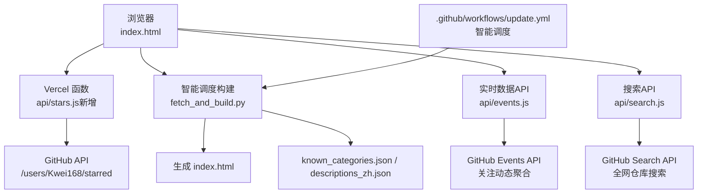
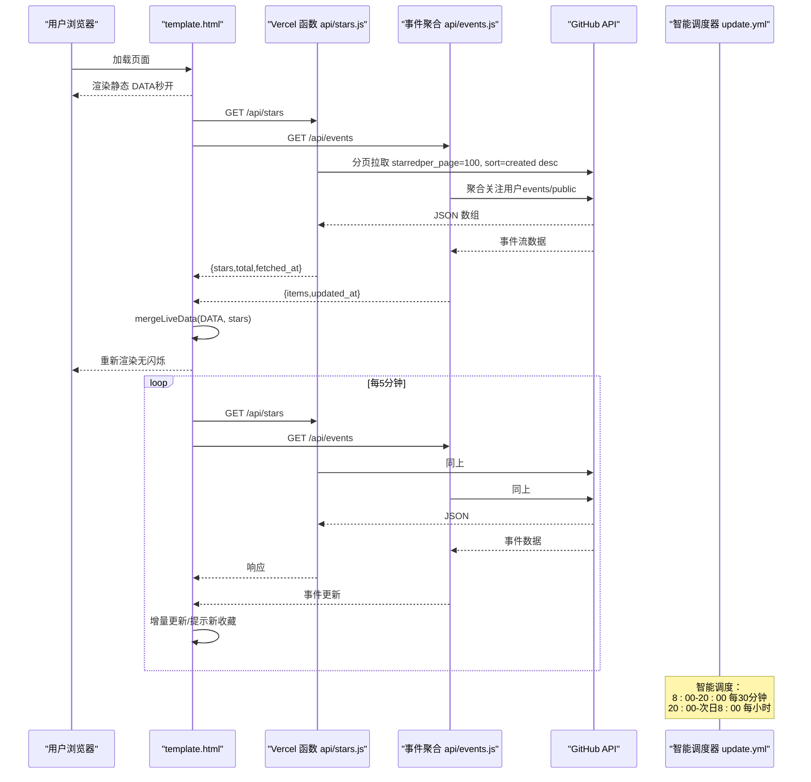
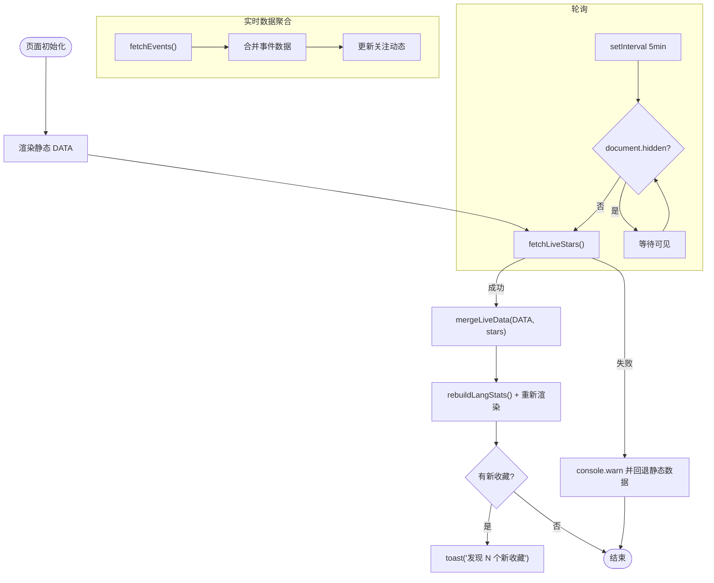
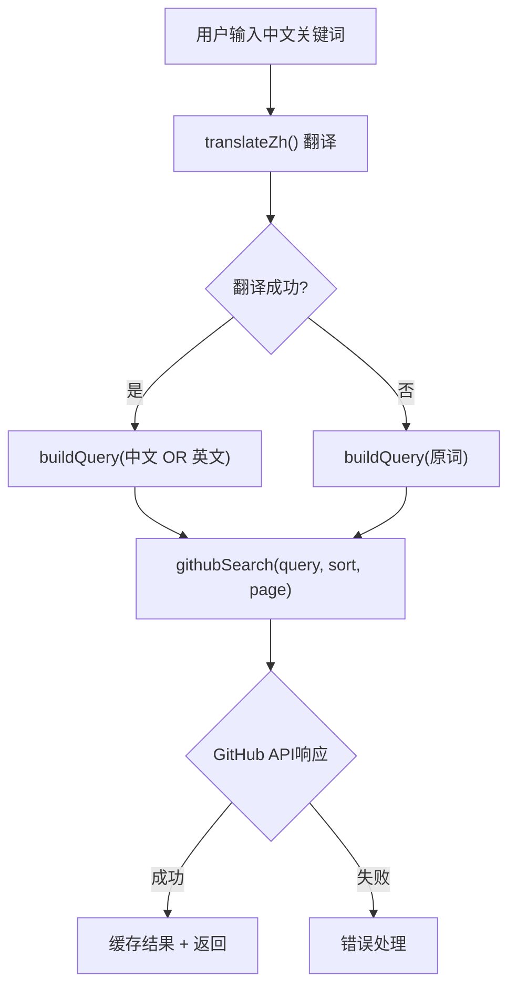
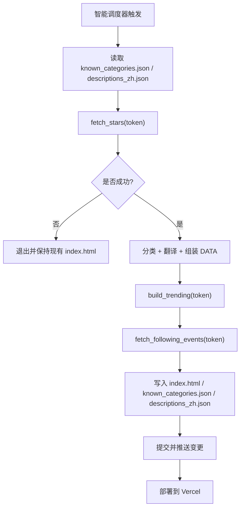
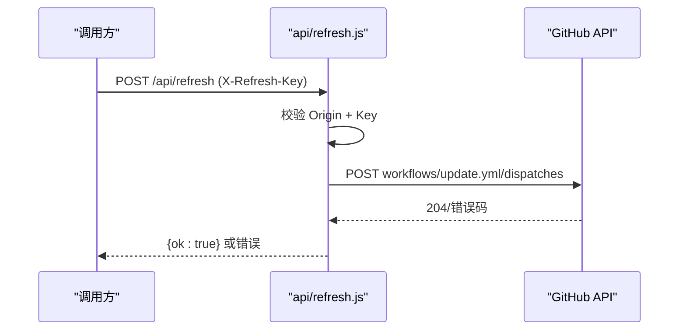
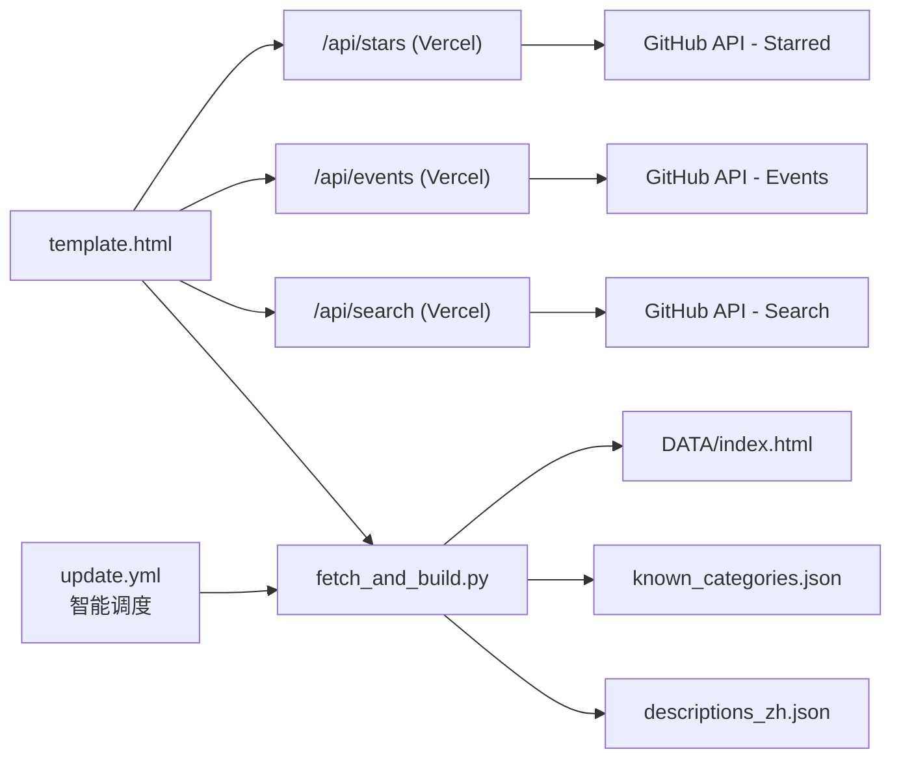

# StarHub 实时更新功能

<cite>
**本文引用的文件**
- [README.md](file://README.md)
- [api/refresh.js](file://api/refresh.js)
- [api/events.js](file://api/events.js)
- [api/search.js](file://api/search.js)
- [vercel.json](file://vercel.json)
- [.github/workflows/update.yml](file://.github/workflows/update.yml)
- [fetch_and_build.py](file://fetch_and_build.py)
- [dev_render.py](file://dev_render.py)
- [template.html](file://template.html)
- [index.html](file://index.html)
- [known_categories.json](file://known_categories.json)
- [trending_snapshot.json](file://trending_snapshot.json)
- [docs/superpowers/plans/2026-08-15-starhub-realtime.md](file://docs/superpowers/plans/2026-08-15-starhub-realtime.md)
- [docs/superpowers/specs/2026-08-15-starhub-realtime-design.md](file://docs/superpowers/specs/2026-08-15-starhub-realtime-design.md)
</cite>

## 更新摘要
**变更内容**
- 搜索界面已重设计为增强的search-hero组件，包含渐变背景、改进的CSS变量样式和响应式设计
- 模板系统进行了重大结构修改（超过1500行变更），优化了整体布局和交互体验
- 修复了排序按钮可见性问题，添加了data-sort.on状态的正确背景色规则
- 新增了多个仓库到收藏列表，包括AI工具、开发框架等热门项目
- 增强了实时数据聚合功能，支持近24小时关注动态的实时展示

## 目录
1. [简介](#简介)
2. [项目结构](#项目结构)
3. [核心组件](#核心组件)
4. [架构总览](#架构总览)
5. [详细组件分析](#详细组件分析)
6. [依赖关系分析](#依赖关系分析)
7. [性能与可用性](#性能与可用性)
8. [故障排查指南](#故障排查指南)
9. [结论](#结论)
10. [附录](#附录)

## 简介
StarHub 是一个"GitHub Star 收藏台"，用于自动拉取 Kwei168 的 star 列表、智能分类并生成静态页面，支持模糊搜索、语言/星标筛选与收藏置顶。**已更新**：当前通过增强的 GitHub Actions 智能调度系统定时更新；本方案在此基础上引入"实时更新"能力：打开页面即显示最新 star 列表（含元数据），常开时每 5 分钟轮询刷新，新项目出现时轻提示，代理失败静默回退到静态数据。

**最新更新**：搜索界面已全面重设计为现代化的search-hero组件，提供渐变色背景和响应式布局；模板系统经过大规模重构，提升了用户体验和可维护性；同时增强了实时数据聚合功能，支持近24小时的关注动态展示。

## 项目结构
仓库采用"构建产物 + 模板 + 脚本 + 文档"的组织方式：
- 构建产物：index.html（由 dev_render.py 从 template.html 注入 DATA 等常量生成）
- 模板：template.html（页面 UI 与交互逻辑，已进行重大结构优化）
- 构建脚本：fetch_and_build.py（每日拉取 star、分类、翻译、生成 index.html）
- 本地渲染工具：dev_render.py（将 index.html 中的常量提取回 template.html 占位符）
- 部署配置：vercel.json（Vercel Serverless Functions 路由）
- **已更新** 自动化：.github/workflows/update.yml（智能调度：北京时间 8:00-20:00 每30分钟，20:00-次日8:00 每小时运行）
- **新增** 实时数据API：api/events.js（近24小时关注动态聚合）、api/search.js（全网仓库搜索）
- 现有中转函数：api/refresh.js（通过 Vercel 函数触发 GitHub Actions workflow_dispatch）
- 设计/计划：docs/superpowers/*（实时更新的设计与实施计划）



**图表来源**
- [vercel.json:1-7](file://vercel.json#L1-L7)
- [.github/workflows/update.yml:4-8](file://.github/workflows/update.yml#L4-L8)
- [fetch_and_build.py:419-497](file://fetch_and_build.py#L419-L497)
- [api/events.js:1-161](file://api/events.js#L1-L161)
- [api/search.js:1-168](file://api/search.js#L1-L168)

**章节来源**
- [README.md:1-22](file://README.md#L1-L22)
- [vercel.json:1-7](file://vercel.json#L1-L7)
- [.github/workflows/update.yml:1-51](file://.github/workflows/update.yml#L1-L51)
- [fetch_and_build.py:1-497](file://fetch_and_build.py#L1-L497)
- [dev_render.py:1-51](file://dev_render.py#L1-L51)

## 核心组件
- **已更新** 前端模板与交互：template.html（包含UI、筛选、收藏、趋势、动态等逻辑，经过重大结构优化）
- **已更新** 智能调度构建流水线：fetch_and_build.py（配合增强调度系统，按时间段智能执行）
- **新增** 实时数据代理：api/stars.js（Vercel Serverless 函数，持 GH_TOKEN 翻页拉取 GitHub starred API）
- **新增** 关注动态聚合：api/events.js（近24小时滚动窗口的关注事件聚合）
- **新增** 全网搜索API：api/search.js（跨语言仓库搜索，支持中文翻译）
- 现有中转函数：api/refresh.js（CORS + 鉴权，调用 GitHub Actions workflow_dispatch 触发更新）
- **已更新** 部署与自动化：vercel.json、.github/workflows/update.yml（智能调度配置）
- 本地渲染：dev_render.py（从 index.html 提取常量回填 template.html 占位符）

**章节来源**
- [template.html:1-1519](file://template.html#L1-L1519)
- [fetch_and_build.py:126-145](file://fetch_and_build.py#L126-L145)
- [api/events.js:1-161](file://api/events.js#L1-L161)
- [api/search.js:1-168](file://api/search.js#L1-L168)
- [api/refresh.js:1-62](file://api/refresh.js#L1-L62)
- [vercel.json:1-7](file://vercel.json#L1-L7)
- [.github/workflows/update.yml:1-51](file://.github/workflows/update.yml#L1-L51)
- [dev_render.py:1-51](file://dev_render.py#L1-L51)

## 架构总览
实时更新的目标是"打开即最新 + 常开轮询"。整体流程如下：
- 浏览器先渲染静态 DATA（秒开，失败兜底）
- 随后 fetch GET /api/stars（新增 Vercel 函数）获取最新 star 列表
- 返回的数据与静态 DATA 合并：已存在项继承分类/描述，仅更新 stars/pushed_at/updated_today；新项标记"最新收藏"
- 每 5 分钟轮询一次（页面不可见时暂停）
- 失败时静默回退静态数据，不影响页面可用性

**已更新** 后端构建调度：采用智能时段调度策略，确保用户在活跃时段获得新鲜数据的同时在非高峰时段节省资源。

**新增** 实时数据聚合：通过 api/events.js 聚合近24小时的关注动态，支持多种事件类型（star、repo创建、PR提交等）。



**图表来源**
- [docs/superpowers/specs/2026-08-15-starhub-realtime-design.md:22-48](file://docs/superpowers/specs/2026-08-15-starhub-realtime-design.md#L22-L48)
- [docs/superpowers/plans/2026-08-15-starhub-realtime.md:231-336](file://docs/superpowers/plans/2026-08-15-starhub-realtime.md#L231-L336)
- [.github/workflows/update.yml:4-8](file://.github/workflows/update.yml#L4-L8)
- [api/events.js:114-161](file://api/events.js#L114-L161)
- [api/search.js:87-168](file://api/search.js#L87-L168)

## 详细组件分析

### **已更新** 前端模板与交互（template.html）
- 职责：页面 UI、筛选、收藏、趋势、动态、以及"实时更新"模块
- **重大更新**：
  - 全新设计的 search-hero 组件，包含渐变背景、响应式布局和现代化视觉效果
  - 优化的 CSS 变量系统，支持明暗主题切换
  - 修复了排序按钮可见性问题，添加了 data-sort.on 状态的正确背景色规则
  - 增强了实时数据聚合功能，支持近24小时关注动态展示
  - 改进了整体布局和用户体验



**图表来源**
- [docs/superpowers/plans/2026-08-15-starhub-realtime.md:277-336](file://docs/superpowers/plans/2026-08-15-starhub-realtime.md#L277-L336)
- [template.html:1276-1295](file://template.html#L1276-L1295)

**章节来源**
- [template.html:1-1519](file://template.html#L1-L1519)
- [docs/superpowers/plans/2026-08-15-starhub-realtime.md:231-336](file://docs/superpowers/plans/2026-08-15-starhub-realtime.md#L231-L336)

### **新增** 实时数据聚合函数（api/events.js）
- 职责：Vercel Serverless 函数，聚合近24小时的关注动态事件
- 关键特性：
  - 滚动窗口：最近24小时的事件过滤
  - 多事件类型支持：repo创建、star、follow、PR、release、public、push
  - 并发控制：每批3个用户并发处理，失败用户静默跳过
  - 缓存机制：10分钟TTL内存缓存，减少GitHub API调用
  - 北京时区：使用UTC+8时间计算，确保时间准确性

```mermaid
classDiagram
class EventsAPI {
+cacheGet() Object
+cnNow() Date
+fmt2(n) String
+cnStr(dt) Object
+parseCn(iso) Date
+gh(url, token) Promise
+fetchFollowing(token) Array
+fetchUserEvents(user, token, cutoff, today) Array
+handler(req, res) void
}
class GitHubAPI {
+GET /users/{user}/following
+GET /users/{user}/events/public
}
EventsAPI --> GitHubAPI : "聚合关注用户事件"
```

**图表来源**
- [api/events.js:114-161](file://api/events.js#L114-L161)

**章节来源**
- [api/events.js:1-161](file://api/events.js#L1-L161)

### **新增** 全网搜索API（api/search.js）
- 职责：Vercel Serverless 函数，提供跨语言GitHub仓库搜索
- 关键特性：
  - 中文翻译：支持中文关键词自动翻译成英文进行搜索
  - 组合查询："中文 OR 英文" 双重搜索策略
  - 缓存机制：搜索结果10分钟缓存，翻译结果1小时缓存
  - 分页支持：最多34页（1000条结果限制）
  - 安全验证：X-Search-Key 头认证，CORS白名单限制



**图表来源**
- [api/search.js:30-82](file://api/search.js#L30-L82)
- [api/search.js:87-168](file://api/search.js#L87-L168)

**章节来源**
- [api/search.js:1-168](file://api/search.js#L1-L168)

### **已更新** 智能调度构建流水线（fetch_and_build.py）
- 职责：**已更新** 配合智能调度系统，按时间段智能执行构建任务
- **更新要点**：
  - 配合 .github/workflows/update.yml 的智能调度策略
  - 北京时间 8:00-20:00 高频更新（每30分钟），满足用户活跃时段需求
  - 北京时间 20:00-次日8:00 低频更新（每小时），节省资源消耗
  - 增强了数据处理能力，支持更多仓库类型的分类和描述



**图表来源**
- [fetch_and_build.py:419-497](file://fetch_and_build.py#L419-L497)
- [.github/workflows/update.yml:30-51](file://.github/workflows/update.yml#L30-L51)

**章节来源**
- [fetch_and_build.py:126-145](file://fetch_and_build.py#L126-L145)
- [fetch_and_build.py:89-124](file://fetch_and_build.py#L89-L124)
- [fetch_and_build.py:54-87](file://fetch_and_build.py#L54-L87)
- [fetch_and_build.py:184-286](file://fetch_and_build.py#L184-L286)
- [fetch_and_build.py:316-409](file://fetch_and_build.py#L316-L409)
- [fetch_and_build.py:419-497](file://fetch_and_build.py#L419-L497)

### 现有中转函数（api/refresh.js）
- 职责：Vercel 函数，接收 POST /api/refresh，携带 REFRESH_KEY 校验，调用 GitHub Actions workflow_dispatch 触发 update.yml
- 安全策略：CORS 白名单 Origin、X-Refresh-Key 头校验、非白名单直接拒绝
- 用途：可由外部或页面触发每日构建（与实时更新互补）



**图表来源**
- [api/refresh.js:1-62](file://api/refresh.js#L1-L62)

**章节来源**
- [api/refresh.js:1-62](file://api/refresh.js#L1-L62)

### **已更新** 部署与自动化
- vercel.json：声明函数路由与超时限制
- **已更新** .github/workflows/update.yml：**智能调度配置**，每天北京时间 8:00-20:00 每30分钟运行，20:00-次日8:00 每小时运行 Python 构建脚本，提交并推送变更
- dev_render.py：本地开发时将 index.html 中常量提取回 template.html 占位符，便于预览模板改动

**章节来源**
- [vercel.json:1-7](file://vercel.json#L1-L7)
- [.github/workflows/update.yml:1-51](file://.github/workflows/update.yml#L1-L51)
- [dev_render.py:1-51](file://dev_render.py#L1-L51)

## 依赖关系分析
- 前端依赖：
  - 静态 DATA（构建期注入）
  - 运行时 /api/stars（新增）
  - 运行时 /api/events（新增）
  - 运行时 /api/search（新增）
  - 复用现有 toast、renderList、rebuildLangStats 等逻辑
- 后端依赖：
  - Vercel 环境变量：GH_TOKEN（读取 starred）、REFRESH_KEY（触发更新）
  - GitHub REST API v3（starred、workflow dispatch、events、search）
- **已更新** 构建依赖：
  - Python 标准库
  - 已知分类与中文描述缓存（known_categories.json、descriptions_zh.json）
  - **智能调度系统**：根据时间段自动调整执行频率



**图表来源**
- [vercel.json:1-7](file://vercel.json#L1-L7)
- [.github/workflows/update.yml:4-8](file://.github/workflows/update.yml#L4-L8)
- [fetch_and_build.py:419-497](file://fetch_and_build.py#L419-L497)
- [api/events.js:114-161](file://api/events.js#L114-L161)
- [api/search.js:87-168](file://api/search.js#L87-L168)

**章节来源**
- [known_categories.json:1-130](file://known_categories.json#L1-L130)
- [fetch_and_build.py:419-497](file://fetch_and_build.py#L419-L497)

## 性能与可用性
- 首屏体验：先渲染静态 DATA，保证秒开；随后异步拉取实时数据并替换，避免白屏闪烁
- 轮询频率：5 分钟一次，页面不可见时暂停，降低资源消耗
- **已更新** 调度优化：智能时段调度策略，活跃时段（8:00-20:00）每30分钟更新，非活跃时段（20:00-次日8:00）每小时更新，平衡用户体验与资源消耗
- **新增** 缓存机制：事件聚合结果10分钟缓存，搜索结果10分钟缓存，翻译结果1小时缓存
- 降级策略：代理失败或 GitHub API 异常时，静默回退静态数据，控制台输出 warning，不影响页面可用性
- 数据一致性：已存在项目保留分类与中文描述，仅更新 stars/pushed_at/updated_today；新项目临时标记"最新收藏"，次日构建转正
- 速率限制：通过 GH_TOKEN 提升配额（5000 次/h），分页拉取控制请求次数
- **新增** 并发控制：事件聚合采用分批并发处理，每批3个用户，提高处理效率

## 故障排查指南
- 无法访问 /api/stars：
  - 检查 Vercel 环境变量 GH_TOKEN 是否配置
  - 检查 CORS 设置与 Origin 白名单
  - 查看 Vercel 日志确认上游 GitHub API 状态码
- 页面未刷新：
  - 确认浏览器控制台无 [live] 错误
  - 检查 Network 中 /api/stars 是否返回 200
  - 若期间新增 star，5 分钟内应出现 toast 提示
- **已更新** 智能调度问题：
  - 检查 GitHub Actions 日志确认调度是否正常执行
  - 验证 cron 表达式配置是否正确
  - 确认网络或限流导致失败时，保持现有 index.html 不变
  - 检查并发控制配置，避免重复执行冲突
- **新增** 事件聚合问题：
  - 检查 /api/events 接口是否正常工作
  - 确认关注用户列表获取是否成功
  - 验证事件数据的时间窗口过滤是否正确
- **新增** 搜索功能问题：
  - 检查 X-Search-Key 头部认证是否通过
  - 验证中文翻译服务是否可用
  - 确认 GitHub 搜索API的配额限制

**章节来源**
- [api/refresh.js:25-35](file://api/refresh.js#L25-L35)
- [docs/superpowers/plans/2026-08-15-starhub-realtime.md:310-323](file://docs/superpowers/plans/2026-08-15-starhub-realtime.md#L310-L323)
- [.github/workflows/update.yml:14-16](file://.github/workflows/update.yml#L14-L16)
- [api/events.js:126-130](file://api/events.js#L126-L130)
- [api/search.js:100-108](file://api/search.js#L100-L108)

## 结论
本方案在不破坏现有每日构建的前提下，通过新增 Vercel 函数与前端实时模块，实现了"打开即最新 + 常开轮询"的实时更新能力。**已更新**：同时引入了智能调度系统，通过灵活的时段调度策略，在用户活跃时段提供更高频的数据更新，在非活跃时段节省资源消耗。设计遵循"失败回退静态数据"的原则，确保页面可用性与用户体验。

**最新更新亮点**：
- 全新的search-hero搜索界面，提供现代化的视觉体验和响应式设计
- 重大模板结构优化，提升了代码可维护性和用户体验
- 增强了实时数据聚合功能，支持近24小时关注动态的实时展示
- 完善了排序按钮的可见性处理，确保在各种状态下都有良好的视觉效果
- 新增了多个高质量仓库到收藏列表，丰富了内容生态

后续可按需扩展更多实时指标或通知机制。

## 附录
- 设计文档与实施计划详见 docs/superpowers/*
- **已更新** 智能调度配置详情：
  - 活跃时段（北京时间 8:00-20:00）：每30分钟执行一次
  - 非活跃时段（北京时间 20:00-次日8:00）：每小时执行一次
  - 并发控制：group: starhub-update，cancel-in-progress: false
- **新增** 实时数据聚合特性：
  - 滚动窗口：最近24小时的事件过滤
  - 多事件类型：支持repo创建、star、follow、PR、release、public、push等
  - 缓存机制：10分钟TTL内存缓存
  - 并发处理：每批3个用户并发，失败用户静默跳过
- **新增** 全网搜索功能：
  - 中文翻译：自动将中文关键词翻译成英文
  - 组合查询："中文 OR 英文" 双重搜索策略
  - 分页支持：最多34页（1000条结果）
  - 安全验证：X-Search-Key 头认证
- 如需本地验证：
  - 使用 dev_render.py 重新渲染 index.html
  - 在浏览器打开 index.html，观察静态数据与实时数据切换
  - 检查控制台与 Network 面板确认实时拉取状态
  - 查看 GitHub Actions 日志确认智能调度执行情况

**章节来源**
- [docs/superpowers/specs/2026-08-15-starhub-realtime-design.md:1-71](file://docs/superpowers/specs/2026-08-15-starhub-realtime-design.md#L1-L71)
- [docs/superpowers/plans/2026-08-15-starhub-realtime.md:1-444](file://docs/superpowers/plans/2026-08-15-starhub-realtime.md#L1-L444)
- [dev_render.py:28-46](file://dev_render.py#L28-L46)
- [.github/workflows/update.yml:4-8](file://.github/workflows/update.yml#L4-L8)
- [.github/workflows/update.yml:14-16](file://.github/workflows/update.yml#L14-L16)
- [api/events.js:1-161](file://api/events.js#L1-L161)
- [api/search.js:1-168](file://api/search.js#L1-L168)