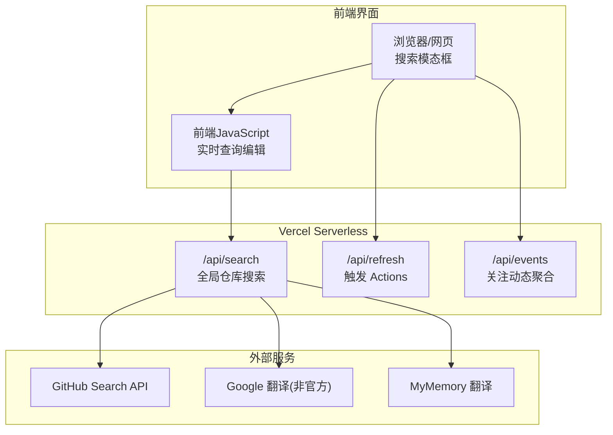
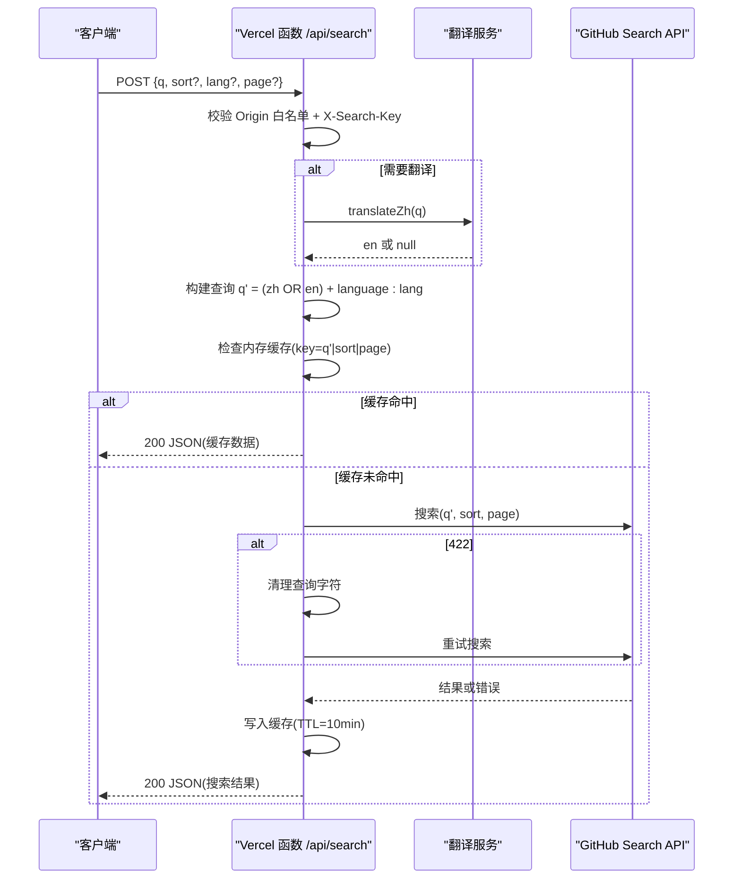
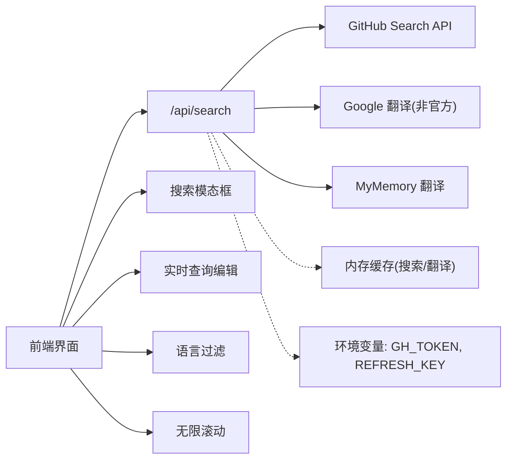

# 全局仓库搜索功能

<cite>
**本文引用的文件**
- [api/search.js](file://api/search.js)
- [vercel.json](file://vercel.json)
- [README.md](file://README.md)
- [descriptions_zh.json](file://descriptions_zh.json)
- [known_categories.json](file://known_categories.json)
- [fetch_and_build.py](file://fetch_and_build.py)
- [api/refresh.js](file://api/refresh.js)
- [api/events.js](file://api/events.js)
- [index.html](file://index.html)
</cite>

## 更新摘要
**所做更改**
- 更新了前端界面章节，添加了完整的搜索模态框组件描述
- 新增了实时查询编辑功能说明
- 增强了语言过滤和多排序选项的文档
- 修复了搜索排序按钮样式问题的说明
- 添加了无限滚动加载更多功能和分页状态显示
- 更新了用户交互流程和功能特性

## 目录
1. [简介](#简介)
2. [项目结构](#项目结构)
3. [核心组件](#核心组件)
4. [架构总览](#架构总览)
5. [详细组件分析](#详细组件分析)
6. [前端界面增强](#前端界面增强)
7. [依赖关系分析](#依赖关系分析)
8. [性能与缓存](#性能与缓存)
9. [故障排查](#故障排查)
10. [结论](#结论)
11. [附录：API 定义与使用示例](#附录api-定义与使用示例)

## 简介
本仓库提供"GitHub Star 收藏台"的在线展示与自动更新能力，并新增"全局仓库搜索"能力：支持跨语言（中文输入）的 GitHub 仓库模糊搜索、按语言筛选、排序与分页。搜索通过 Vercel Serverless Function 暴露为 /api/search，内部完成中文翻译、查询构造、调用 GitHub Search API、结果缓存与返回。

该功能与仓库的自动更新、事件聚合等能力共同构成一个轻量但完整的 GitHub 内容发现与展示平台。**最新更新**：前端界面得到了显著增强，包括完整的搜索模态框组件、实时查询编辑功能、语言过滤和多排序选项；修复了搜索排序按钮的样式问题，确保选中状态有正确的背景色对比度；支持无限滚动加载更多功能和分页状态显示。

**章节来源**
- [README.md:1-22](file://README.md#L1-L22)

## 项目结构
- api/search.js：Vercel Serverless Function，实现全局仓库搜索的核心逻辑（CORS、鉴权、翻译、查询构建、GitHub 搜索、缓存、响应）。
- vercel.json：配置各 Serverless Function 的最大执行时长。
- README.md：项目说明、结构与自动化更新方式。
- descriptions_zh.json、known_categories.json、fetch_and_build.py：用于收藏台的分类与页面生成（与搜索功能解耦，但同属项目生态）。
- api/refresh.js、api/events.js：与搜索并列的其他 Serverless 能力（触发 Actions 工作流、关注动态聚合），体现统一的安全与 CORS 策略。
- index.html：包含完整的全局搜索前端界面，支持模态框、实时编辑、语言过滤、多排序选项和无限滚动。

**图表来源**
- [api/search.js:1-168](file://api/search.js#L1-L168)
- [api/refresh.js:1-63](file://api/refresh.js#L1-L63)
- [api/events.js:1-161](file://api/events.js#L1-L161)
- [index.html:957-1130](file://index.html#L957-L1130)

**章节来源**
- [vercel.json:1-9](file://vercel.json#L1-L9)
- [README.md:1-22](file://README.md#L1-L22)

## 核心组件
- 搜索入口函数：接收 POST 请求，校验来源白名单与密钥，解析参数，执行搜索流程并返回结构化结果。
- 翻译模块：优先尝试 Google 翻译端点，失败降级到 MyMemory；结果缓存 1 小时。
- 查询构建器：将中文与英文关键词组合为 GitHub 可识别的查询语句，支持 language 过滤。
- GitHub 搜索客户端：封装带认证头、超时、排序参数的搜索请求，并对 422 错误进行清洗重试。
- 内存缓存：搜索结果缓存 10 分钟，键包含查询、排序、语言、页码。
- **前端搜索模态框**：完整的搜索界面，支持实时查询编辑、语言过滤、多排序选项和无限滚动。

**章节来源**
- [api/search.js:1-168](file://api/search.js#L1-L168)
- [index.html:957-1130](file://index.html#L957-L1130)

## 架构总览
搜索请求从前端发起，经 Vercel 路由到 /api/search。服务端先做 CORS 与鉴权校验，再根据是否含中文决定是否需要翻译。随后构造查询字符串，命中本地内存缓存则直接返回；否则调用 GitHub Search API，处理可能的 422/403/429 等状态码，并将结果写入缓存后返回。

**前端增强**：用户通过搜索模态框进行交互，支持实时查询编辑、语言过滤选择、排序选项切换，以及无限滚动加载更多结果。

**图表来源**
- [api/search.js:87-166](file://api/search.js#L87-L166)

## 详细组件分析

### 搜索入口与鉴权
- 仅允许指定 Origin 列表（比较时统一小写），OPTIONS 预检直接响应。
- 要求请求头携带 X-Search-Key，值必须等于环境变量 REFRESH_KEY，否则返回 403。
- 方法限制为 POST，其他方法返回 405。

**章节来源**
- [api/search.js:7-10](file://api/search.js#L7-L10)
- [api/search.js:87-108](file://api/search.js#L87-L108)

### 翻译模块
- 优先调用 Google 翻译非官方端点，设置 8 秒超时；失败则降级到 MyMemory。
- 翻译结果以原词为 key 缓存 1 小时，避免重复网络开销。
- 若翻译结果为空或与原文相同，则不拼接英文部分。

**章节来源**
- [api/search.js:30-57](file://api/search.js#L30-L57)

### 查询构建与语言过滤
- 对含空格的关键词加引号，使 GitHub 将其视为短语匹配。
- 当存在有效英文翻译且与中文不同，构造 "中文 OR 英文" 的组合查询。
- 可选附加 language: 过滤条件，提升精准度。

**章节来源**
- [api/search.js:59-64](file://api/search.js#L59-L64)
- [api/search.js:120-126](file://api/search.js#L120-L126)

### GitHub 搜索客户端
- 使用 Bearer Token 认证，设置 Accept 与 Api-Version 头，User-Agent 标识。
- per_page=30，page 上限 34（对应 GitHub 前 1000 条）。
- 对 422 错误进行一次"去引号与多余空白"的清洗重试。
- 对 403/429 限流返回 503；其他非 2xx 返回 502，隐藏上游细节。

**章节来源**
- [api/search.js:66-82](file://api/search.js#L66-L82)
- [api/search.js:127-144](file://api/search.js#L127-L144)

### 缓存机制
- 搜索缓存：key = 查询串|排序|页码，TTL 10 分钟，减少重复请求。
- 翻译缓存：key = 原词，TTL 1 小时，降低翻译成本。
- 内存级 Map 存储，冷启动丢失可接受（Serverless 特性）。

**章节来源**
- [api/search.js:18-28](file://api/search.js#L18-L28)
- [api/search.js:120-162](file://api/search.js#L120-L162)

### 响应数据结构
- 返回字段包括 query、translated、page、total、items。
- items 中每个对象包含 full_name、desc、language、stars、updated_at、html_url、topics（最多 3 个）。

**章节来源**
- [api/search.js:145-160](file://api/search.js#L145-L160)

### 与其他能力的协同
- refresh.js：通过 /api/refresh 触发 GitHub Actions 工作流，保持收藏台数据新鲜。
- events.js：聚合关注账号近 24 小时动态，采用相同的 CORS 白名单策略与内存缓存。
- fetch_and_build.py：在 Actions 中拉取 star 列表、智能分类、生成 index.html，与搜索能力互补。

**章节来源**
- [api/refresh.js:1-63](file://api/refresh.js#L1-L63)
- [api/events.js:1-161](file://api/events.js#L1-L161)
- [fetch_and_build.py:1-200](file://fetch_and_build.py#L1-L200)

## 前端界面增强

### 搜索模态框组件
实现了完整的搜索模态框界面，提供以下功能：
- **标题栏**：显示当前搜索查询词，支持关闭操作
- **工具栏**：显示实际发送给 GitHub 的查询词，支持编辑功能
- **语言过滤**：下拉选择框支持多种编程语言过滤
- **排序选项**：三个排序按钮（相关度、最多星标、最近更新）
- **结果列表**：显示搜索结果的详细信息
- **状态提示**：加载状态、错误提示、空结果提示
- **底部信息**：显示已加载条数和分页状态

### 实时查询编辑功能
- 点击"编辑"按钮进入查询词编辑模式
- 支持 Enter 键确认和 Escape 键取消
- 失焦时自动保存修改
- 修改后立即重新执行搜索

### 语言过滤和多排序选项
- **语言过滤**：支持 JavaScript、TypeScript、Python、Go、Rust、Java、C++、C、C#、Swift、Kotlin、Ruby、PHP、Shell、HTML、CSS、Dart、Lua 等主流编程语言
- **排序选项**：
  - 相关度（best-match）：默认排序，按相关性排列
  - 最多星标（stars）：按星标数量降序排列
  - 最近更新（updated）：按更新时间降序排列

### 搜索排序按钮样式修复
- 修复了选中状态的背景色对比度问题
- 确保在明暗主题下都有良好的视觉效果
- 使用 CSS 变量统一管理颜色方案

### 无限滚动加载更多功能
- 监听滚动事件，接近列表底部时自动加载下一页
- 防止并发请求，确保加载过程稳定
- 显示"正在加载更多..."状态提示
- 支持失败重试机制

### 分页状态显示
- 实时显示已加载条数与总数
- 智能判断是否还有更多结果
- 显示 GitHub 搜索结果限制（最多 1000 条）
- 友好的提示信息告知用户当前状态

**章节来源**
- [index.html:677-702](file://index.html#L677-L702)
- [index.html:957-1130](file://index.html#L957-L1130)
- [index.html:1375-1388](file://index.html#L1375-L1388)

## 依赖关系分析
- 对外部服务的依赖：
  - GitHub Search API：核心数据源，需 GH_TOKEN 环境变量。
  - Google 翻译、MyMemory：可选翻译后端，具备超时与降级。
- 环境依赖：
  - REFRESH_KEY：用于接口鉴权。
  - GH_TOKEN：访问 GitHub API 的令牌。
- 运行时约束：
  - Vercel Serverless 函数最大执行时长由 vercel.json 配置，search 为 30 秒。

**图表来源**
- [api/search.js:18-28](file://api/search.js#L18-L28)
- [api/search.js:72-81](file://api/search.js#L72-L81)
- [vercel.json:1-9](file://vercel.json#L1-L9)
- [index.html:957-1130](file://index.html#L957-L1130)

**章节来源**
- [vercel.json:1-9](file://vercel.json#L1-L9)
- [api/search.js:100-108](file://api/search.js#L100-L108)

## 性能与缓存
- 翻译缓存（1 小时）显著降低重复翻译的网络开销。
- 搜索缓存（10 分钟）在高并发场景下减少 GitHub API 调用次数。
- 查询清洗与重试机制提高鲁棒性，避免 422 导致的失败。
- 分页限制（per_page=30，page≤34）符合 GitHub 搜索上限，避免无效请求。
- **前端优化**：无限滚动减少不必要的请求，防并发机制避免重复加载。

优化建议
- 可在高 QPS 场景考虑引入分布式缓存（如 Redis）替代进程内 Map。
- 对翻译服务增加更多降级策略（如本地词典、备用端点）。
- 对 GitHub 搜索增加指数退避重试，应对 429 限流。
- 前端可增加本地缓存最近搜索历史，提升用户体验。

[本节为通用性能讨论，不直接分析具体文件]

## 故障排查
常见问题与定位要点
- 403 Forbidden：
  - Origin 不在白名单或 X-Search-Key 不匹配。
  - 参考路径：[api/search.js:87-108](file://api/search.js#L87-L108)
- 400 Bad Request：
  - 关键词少于 2 字符或请求体格式错误。
  - 参考路径：[api/search.js:110-116](file://api/search.js#L110-L116)
- 503 Service Unavailable：
  - GitHub 搜索频繁触发限流（403/429）。
  - 参考路径：[api/search.js:136-139](file://api/search.js#L136-L139)
- 502 Bad Gateway：
  - GitHub 搜索服务异常或上游不可用。
  - 参考路径：[api/search.js:140-144](file://api/search.js#L140-L144)
  - 以及捕获异常分支：[api/search.js:164-166](file://api/search.js#L164-L166)
- 422 查询语法错误：
  - 自动清洗查询并重试一次。
  - 参考路径：[api/search.js:84-86](file://api/search.js#L84-L86), [api/search.js:130-135](file://api/search.js#L130-L135)

前端相关问题
- 搜索模态框无法打开：检查网络连接和 API 可用性
- 无限滚动不生效：确认 searchHasMore 状态和滚动监听器
- 查询编辑失效：验证 sEditing 状态和事件绑定

环境变量缺失
- 未配置 GH_TOKEN 会返回 500，提示配置。
- 参考路径：[api/search.js:105-108](file://api/search.js#L105-L108)

**章节来源**
- [api/search.js:87-166](file://api/search.js#L87-L166)
- [index.html:1008-1046](file://index.html#L1008-L1046)

## 结论
全局仓库搜索功能通过简洁的 Serverless 函数实现了跨语言搜索、安全鉴权、缓存优化与健壮的错误处理。**最新的前端界面增强**提供了完整的搜索模态框组件、实时查询编辑功能、语言过滤和多排序选项，以及无限滚动加载更多功能，大幅提升了用户体验。它与仓库的自动更新与事件聚合能力形成完整闭环，既满足日常发现与检索需求，又具备良好的可扩展性与可维护性。建议在后续迭代中引入更健壮的缓存与重试策略，进一步提升稳定性与吞吐能力。

[本节为总结性内容，不直接分析具体文件]

## 附录：API 定义与使用示例
- 端点：POST /api/search
- 请求头：
  - Content-Type: application/json
  - X-Search-Key: 与 REFRESH_KEY 一致
- 请求体：
  - q: string，至少 2 个字符
  - sort?: "best-match" | "stars" | "updated"，默认 "best-match"
  - lang?: string，语言过滤（如 Python）
  - page?: number，1..34，默认 1
- 响应体：
  - query: string
  - translated: boolean
  - page: number
  - total: number
  - items: array of { full_name, desc, language, stars, updated_at, html_url, topics }

前端使用示例
- 打开搜索模态框，输入关键词进行搜索
- 使用语言过滤下拉框筛选特定语言的仓库
- 点击排序按钮切换不同的排序方式
- 滚动到底部自动加载更多结果
- 点击"编辑"按钮修改查询词后重新搜索

期望返回包含匹配仓库的列表，并附带总数与分页信息。

[本节为概念性说明，不直接分析具体文件]