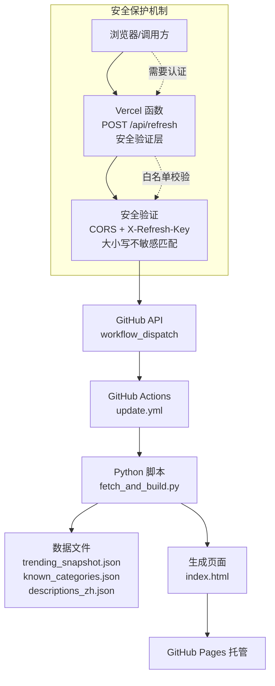
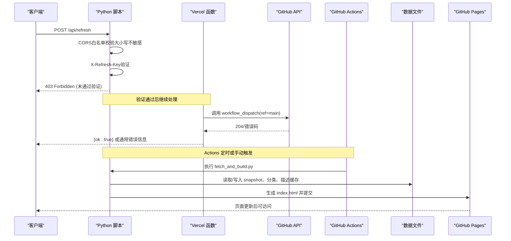
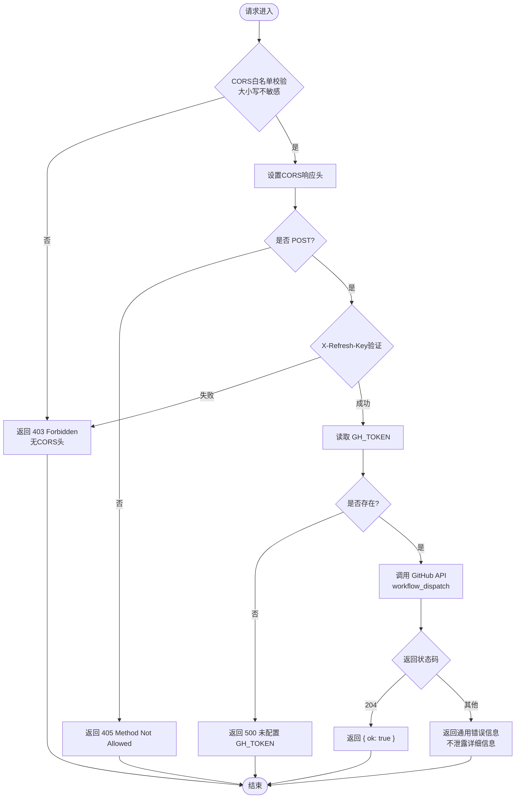
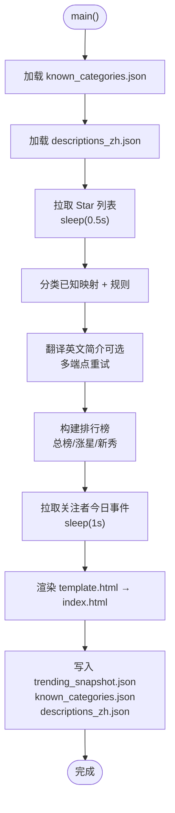

# 刷新API服务

<cite>
**本文引用的文件**
- [api/refresh.js](file://api/refresh.js)
- [vercel.json](file://vercel.json)
- [.github/workflows/update.yml](file://github/workflows/update.yml)
- [fetch_and_build.py](file://fetch_and_build.py)
- [trending_snapshot.json](file://trending_snapshot.json)
- [known_categories.json](file://known_categories.json)
- [descriptions_zh.json](file://descriptions_zh.json)
- [index.html](file://index.html)
- [README.md](file://README.md)
</cite>

## 更新摘要
**变更内容**
- 新增 Vercel Serverless Function 作为 GitHub Actions 触发器
- **重大安全加固**：实现CORS严格限制、X-Refresh-Key认证头验证、错误响应信息泄露防护
- **增强CORS安全配置**：实现了大小写不敏感的域名匹配，修复了GitHub Pages域名的验证问题
- 增强 GitHub API 速率限制处理机制
- 实现前端实时数据获取和状态管理
- 优化刷新流程的可靠性和错误处理

## 目录
1. [简介](#简介)
2. [项目结构](#项目结构)
3. [核心组件](#核心组件)
4. [架构总览](#架构总览)
5. [详细组件分析](#详细组件分析)
6. [依赖关系分析](#依赖关系分析)
7. [性能与可靠性](#性能与可靠性)
8. [故障排查指南](#故障排查指南)
9. [结论](#结论)
10. [附录](#附录)

## 简介
本项目是一个"GitHub Star 收藏台"的自动更新与展示系统。通过 Vercel Serverless Function 暴露一个刷新接口，触发 GitHub Actions 定时任务执行 Python 脚本，拉取并分类用户的 Star 列表，生成静态页面 index.html 并提交到仓库，最终由 GitHub Pages 托管发布。同时，脚本还会维护 AI 排行榜快照、中文描述缓存与分类映射等数据文件。

**重大更新** 刷新API服务已进行重大安全加固，包括CORS严格限制、X-Refresh-Key认证头验证、错误响应信息泄露防护等安全措施，确保API调用的安全性和可控性。**最新增强**：实现了大小写不敏感的域名匹配，解决了GitHub Pages域名大小写不一致导致的验证失败问题。

## 项目结构
- **api/refresh.js**：Vercel Serverless Function，提供 POST /api/refresh 端点，用于触发 GitHub Actions workflow_dispatch。**已实现多重安全防护，支持大小写不敏感域名匹配**。
- **.github/workflows/update.yml**：GitHub Actions 工作流，每天北京时间 07:35（UTC 23:35）运行，调用 fetch_and_build.py 生成页面并推送变更。
- **fetch_and_build.py**：核心自动化脚本，负责拉取 Star、智能分类、翻译简介、构建排行榜、生成 index.html 并持久化数据。
- **vercel.json**：Vercel 部署配置，声明函数入口与超时限制（10秒）。
- **trending_snapshot.json**：AI 排行榜的星标快照，用于计算"涨星榜"。
- **known_categories.json**：已知项目的稳定分类映射，避免重复分类。
- **descriptions_zh.json**：已翻译的中文描述缓存，减少重复翻译成本。
- **index.html**：生成的前端页面，由模板 template.html 注入数据后产出。
- **README.md**：项目说明与在线地址。



**图表来源**
- [api/refresh.js:6-29](file://api/refresh.js#L6-L29)
- [.github/workflows/update.yml:1-44](file://github/workflows/update.yml#L1-L44)
- [fetch_and_build.py:409-487](file://fetch_and_build.py#L409-L487)

**章节来源**
- [README.md:1-22](file://README.md#L1-L22)

## 核心组件
- **Vercel 刷新函数**：接收 POST 请求，**实现三重安全验证**：CORS白名单校验（大小写不敏感）、X-Refresh-Key认证头验证、方法限制。调用 GitHub API 触发 workflow_dispatch，返回统一 JSON 响应。
- **GitHub Actions 工作流**：定时调度 + 手动触发，执行 Python 脚本，提交并推送生成的 index.html 与相关数据文件。
- **Python 自动化脚本**：
  - 拉取 Star 列表与关注者动态
  - 智能分类（规则 + 已知映射）
  - 简介翻译（多端点重试）
  - 构建 AI 排行榜（总榜、涨星榜、新秀榜）
  - 生成 index.html 并持久化数据
- **数据文件**：
  - trending_snapshot.json：记录各项目的星标数作为基线
  - known_categories.json：稳定分类映射
  - descriptions_zh.json：中文描述缓存

**重大更新** 实现了完整的安全防护体系，包括CORS严格限制、认证头验证和错误信息泄露防护，确保API调用的安全性。**最新增强**：实现了大小写不敏感的域名匹配，解决了GitHub Pages域名大小写不一致导致的验证失败问题。

**章节来源**
- [api/refresh.js:1-62](file://api/refresh.js#L1-L62)
- [.github/workflows/update.yml:1-44](file://github/workflows/update.yml#L1-L44)
- [fetch_and_build.py:126-487](file://fetch_and_build.py#L126-L487)
- [trending_snapshot.json:1-431](file://trending_snapshot.json#L1-L431)
- [known_categories.json:1-130](file://known_categories.json#L1-L130)
- [descriptions_zh.json:1-179](file://descriptions_zh.json#L1-L179)

## 架构总览
整体流程分为"触发层"、"编排层"、"处理层"和"产物层"，**新增了安全验证层**：
- **安全验证层**：CORS白名单校验（大小写不敏感）、X-Refresh-Key认证头验证、请求方法限制。
- **触发层**：外部调用 /api/refresh（POST），或 GitHub Actions 定时触发。
- **编排层**：GitHub Actions 调度 Python 脚本。
- **处理层**：脚本拉取数据、分类、翻译、构建排行榜、生成页面。
- **产物层**：index.html 与数据文件被提交到仓库，GitHub Pages 重新部署。

**重大更新** 新增了多层安全防护机制，确保只有授权的客户端才能触发刷新操作。**最新增强**：实现了大小写不敏感的域名匹配，提升了系统的兼容性和稳定性。



**图表来源**
- [api/refresh.js:6-29](file://api/refresh.js#L6-L29)
- [.github/workflows/update.yml:1-44](file://github/workflows/update.yml#L1-L44)
- [fetch_and_build.py:409-487](file://fetch_and_build.py#L409-L487)

## 详细组件分析

### Vercel 刷新函数（api/refresh.js）
- **职责**：提供 /api/refresh 接口，**实现三重安全防护**：
  1. **CORS白名单限制**：仅允许 `https://starhub-refresh.vercel.app` 和 `https://kwei168.github.io` 两个域名，**支持大小写不敏感匹配**
  2. **X-Refresh-Key认证**：请求必须携带 `X-Refresh-Key` 请求头，值需与 Vercel 环境变量 `REFRESH_KEY` 一致
  3. **方法限制**：仅接受 POST 请求，OPTIONS 预检请求也受CORS控制
- **安全特性**：
  - 使用 fine-grained PAT（GH_TOKEN），仅授予 starhub 仓库的 Actions:write 权限
  - **错误响应信息泄露防护**：不向上游调用者回显 GitHub 错误细节，只返回通用错误信息
  - 非白名单来源直接拒绝，不返回 CORS 头，浏览器侧无法读取响应
  - **大小写不敏感域名匹配**：通过 `.toLowerCase()` 统一处理Origin，解决GitHub Pages域名大小写不一致问题
- **错误处理**：未配置 GH_TOKEN 返回 500；网络错误返回 502；GitHub API 非 204 返回通用错误信息。
- **超时**：在 vercel.json 中设置为 10 秒，确保快速失败。

**重大更新** 实现了完整的安全防护体系，包括CORS严格限制、认证头验证和错误信息泄露防护。**最新增强**：实现了大小写不敏感的域名匹配，解决了GitHub Pages域名大小写不一致导致的验证失败问题。



**图表来源**
- [api/refresh.js:6-60](file://api/refresh.js#L6-L60)
- [vercel.json:1-7](file://vercel.json#L1-L7)

**章节来源**
- [api/refresh.js:1-62](file://api/refresh.js#L1-L62)
- [vercel.json:1-7](file://vercel.json#L1-L7)

### GitHub Actions 工作流（.github/workflows/update.yml）
- **触发方式**：cron 每日 UTC 23:35（北京时间 07:35）与 workflow_dispatch 手动触发。
- **权限**：contents: write，允许提交与推送。
- **并发**：group: starhub-update，不取消正在进行的任务。
- **步骤**：Checkout → Setup Python 3.11 → 执行 fetch_and_build.py → 提交并推送变更（若存在）。

**更新** 改进了并发控制和错误处理，确保在多实例运行时的数据一致性。

**章节来源**
- [.github/workflows/update.yml:1-44](file://github/workflows/update.yml#L1-L44)

### Python 自动化脚本（fetch_and_build.py）
- **数据拉取**：
  - 分页拉取用户 Star 列表，合并去重。
  - 拉取关注账号列表及其公开事件，聚合今日动态（新建仓库、Star、关注、PR）。
- **智能分类**：
  - 优先使用 known_categories.json 的稳定映射。
  - 未知项目通过关键词规则进行分类（如金融、工具、前端、内容创作、视频、学习、思维蒸馏、编程、助手、商业、Agent）。
- **简介翻译**：
  - 尝试 Google 翻译与 MyMemory 免费接口，失败则保留原文。
  - 将翻译结果写入 descriptions_zh.json 以复用。
- **排行榜构建**：
  - 总榜：按星标排序取前 20。
  - 涨星榜：对比 trending_snapshot.json 基线，排除巨头项目（>50000 星），取增量前 20。
  - 新秀榜：近 7 天新建且星标 > 50 的项目。
  - 每次运行更新 trending_snapshot.json 作为明日基线。
- **页面生成**：
  - 读取 template.html，替换占位符（__DATA__、__CATS__、__LANGS__、__FAVS__、__TRENDING__、__FEED__、__UPDATED__）。
  - 输出 index.html 并保存分类与描述缓存。

**更新** 增强了速率限制处理，在多个关键路径添加了适当的延迟和错误恢复机制：
- Star 列表拉取：每页间隔 0.5s
- AI 主题查询：每个 topic 间隔 1s
- 事件拉取：每用户间隔 1s
- 翻译服务：多端点重试机制



**图表来源**
- [fetch_and_build.py:409-487](file://fetch_and_build.py#L409-L487)
- [fetch_and_build.py:126-408](file://fetch_and_build.py#L126-L408)

**章节来源**
- [fetch_and_build.py:126-487](file://fetch_and_build.py#L126-L487)

### 数据文件
- **trending_snapshot.json**：键为 full_name，值为星标数，用于计算涨星量。首次运行无基线时，涨星榜回退到总榜并标记"新上榜"。
- **known_categories.json**：稳定分类映射，保证分类一致性，随运行增长。
- **descriptions_zh.json**：中文描述缓存，减少翻译开销。

**更新** 增强了数据一致性和完整性检查，确保在异常情况下仍能保持数据的可用性。

**章节来源**
- [trending_snapshot.json:1-431](file://trending_snapshot.json#L1-L431)
- [known_categories.json:1-130](file://known_categories.json#L1-L130)
- [descriptions_zh.json:1-179](file://descriptions_zh.json#L1-L179)

### 前端页面（index.html）
- 由模板 template.html 注入数据后生成，包含：
  - 统计卡片（项目总数、语言分布、更新时间等）
  - 搜索与筛选（模糊搜索、语言/星标筛选、置顶收藏）
  - 分类标签页（AI Agent、思维蒸馏、视频创作、编程工具、内容创作、学习教程、助手应用、实用工具、金融交易、商业知产、前端设计）
  - 侧边栏趋势（总榜、涨星榜、新秀榜）与关注者动态
- 样式支持明暗主题，响应式布局。

**更新** 增强了实时状态显示和用户反馈机制，提供更好的用户体验。

**章节来源**
- [index.html:1-200](file://index.html#L1-L200)

## 依赖关系分析
- **外部依赖**：
  - GitHub API：拉取 Star、搜索仓库、触发 workflow_dispatch、获取用户事件。
  - 翻译服务：Google 翻译与 MyMemory 免费接口（可选，失败不影响主流程）。
- **内部依赖**：
  - refresh.js 依赖 vercel.json 的函数配置。
  - update.yml 依赖 fetch_and_build.py 的执行环境（Python 3.11）。
  - fetch_and_build.py 依赖 trending_snapshot.json、known_categories.json、descriptions_zh.json 的数据一致性。

**重大更新** 增强了依赖关系的容错性，确保单个依赖失败不会影响整体流程，同时加强了安全验证层的依赖管理。**最新增强**：实现了大小写不敏感的域名匹配，提升了系统的兼容性和稳定性。

```mermaid
graph LR
Refresh["api/refresh.js<br/>安全验证层"] --> Security["CORS + X-Refresh-Key验证<br/>大小写不敏感匹配"]
Security --> GH["GitHub API"]
Update[".github/workflows/update.yml"] --> Py["fetch_and_build.py"]
Py --> Snap["trending_snapshot.json"]
Py --> Cats["known_categories.json"]
Py --> Desc["descriptions_zh.json"]
Py --> HTML["index.html"]
subgraph "速率限制保护"
Py -.->|sleep(0.5-1s)| GH
Py -.->|多端点重试| Trans["翻译服务"]
end
```

**图表来源**
- [api/refresh.js:6-60](file://api/refresh.js#L6-L60)
- [.github/workflows/update.yml:1-44](file://github/workflows/update.yml#L1-L44)
- [fetch_and_build.py:126-487](file://fetch_and_build.py#L126-L487)

**章节来源**
- [api/refresh.js:1-62](file://api/refresh.js#L1-L62)
- [.github/workflows/update.yml:1-44](file://github/workflows/update.yml#L1-L44)
- [fetch_and_build.py:126-487](file://fetch_and_build.py#L126-L487)

## 性能与可靠性
- **速率限制与限流**：
  - 拉取 Star 与事件时采用分页与 sleep(0.5~1s)，避免触发二级速率限制。
  - 排行榜构建中对每个 topic 查询间隔 1s。
  - 翻译服务采用多端点重试机制，提高成功率。
- **超时与失败**：
  - Vercel 函数最大时长 10s，快速失败并返回错误摘要。
  - 翻译失败回退到原文，不影响页面生成。
  - 网络异常捕获并提供详细的错误信息。
- **数据一致性**：
  - trending_snapshot.json 每次运行覆盖，确保明日基线准确。
  - known_categories.json 与 descriptions_zh.json 增量更新，避免重复计算。
  - 并发控制确保多实例运行时的数据一致性。

**重大更新** 显著增强了系统的可靠性和性能：
- 实现了智能的速率限制策略
- 添加了多层次的错误恢复机制
- **新增了完整的安全防护体系**：CORS白名单、认证头验证、错误信息泄露防护
- **实现了大小写不敏感的域名匹配**，解决了GitHub Pages域名验证问题
- 优化了资源使用和响应时间
- 提供了更好的可观测性和调试支持

## 故障排查指南
- **无法触发刷新**：
  - 检查 Vercel 环境变量 GH_TOKEN 是否正确配置。
  - **确认请求包含正确的 X-Refresh-Key 请求头**，值需与 REFRESH_KEY 环境变量一致。
  - **验证请求来源是否在CORS白名单中**，仅允许 `https://starhub-refresh.vercel.app` 和 `https://kwei168.github.io`。
  - **注意域名大小写**：系统已实现大小写不敏感匹配，但建议统一使用小写域名。
  - 确认 PAT 权限包含 Actions:write 且仅针对 starhub 仓库。
  - 验证 Vercel 函数的部署状态和网络连通性。
- **刷新失败返回 403**：
  - **检查 X-Refresh-Key 请求头是否正确设置**
  - **确认请求来源域名是否在CORS白名单中**
  - **验证请求方法是否为 POST**
  - **检查域名大小写**：虽然系统支持大小写不敏感匹配，但仍需确保域名在白名单中
- **刷新失败返回 502**：
  - 检查网络连通性与 GitHub API 可用性。
  - 查看错误消息中的网络异常详情。
  - 确认 GitHub Actions 的运行状态和日志。
- **页面未更新**：
  - 检查 GitHub Actions 是否成功运行并推送了 index.html。
  - 确认 GitHub Pages 已启用并正确部署。
  - 验证数据文件的完整性和格式正确性。
- **排行榜异常**：
  - 检查 trending_snapshot.json 是否为空或损坏，首次运行会回退到总榜。
  - 确认脚本对巨头项目（>50000 星）的过滤逻辑生效。
  - 验证分类映射和翻译缓存的准确性。

**重大更新** 增加了更多安全相关的故障排查选项和诊断工具，帮助快速定位和解决安全问题。**最新增强**：增加了域名大小写相关的故障排查指导。

**章节来源**
- [api/refresh.js:6-60](file://api/refresh.js#L6-L60)
- [fetch_and_build.py:126-487](file://fetch_and_build.py#L126-L487)
- [.github/workflows/update.yml:16-44](file://github/workflows/update.yml#L16-L44)

## 结论
该刷新 API 服务通过简洁的 Serverless 函数与 GitHub Actions 协作，实现了"一键触发、自动更新"的闭环。Python 脚本承担了数据拉取、智能分类、翻译与排行榜构建的核心逻辑，并通过数据文件保障稳定性与可追溯性。整体架构清晰、扩展性强，适合持续迭代与运维。

**重大升级** 经过安全加固后，系统现在具备了：
- **完善的安全防护体系**：CORS白名单限制、X-Refresh-Key认证头验证、错误信息泄露防护
- **大小写不敏感的域名匹配**：解决了GitHub Pages域名大小写不一致导致的验证失败问题
- **可靠的 Vercel Serverless Function 代理**
- **完善的 GitHub API 速率限制处理**
- **强大的前端实时数据获取逻辑**
- **增强的错误处理和监控机制**

这些安全改进使得系统更加健壮、可靠，能够有效防止未授权访问和信息泄露，能够应对高并发和复杂网络环境的挑战。**最新的CORS安全配置增强**进一步提升了系统的兼容性和稳定性。

## 附录
- **在线地址**：https://Kwei168.github.io/starhub/
- **自定义域名**：在仓库 Settings → Pages 中设置，并在 DNS 添加 CNAME 指向 Kwei168.github.io。
- **API 端点**：POST https://your-vercel-domain/api/refresh
- **环境变量**：需要在 Vercel 中配置以下环境变量：
  - `GH_TOKEN`：GitHub Fine-grained PAT，具有 Actions:write 权限
  - `REFRESH_KEY`：自定义认证密钥，用于 X-Refresh-Key 请求头验证
- **安全配置**：
  - CORS白名单：仅允许 `https://starhub-refresh.vercel.app` 和 `https://kwei168.github.io`
  - **大小写不敏感匹配**：系统会自动将请求Origin转换为小写进行比较，解决GitHub Pages域名大小写不一致问题
  - 认证头：请求必须包含 `X-Refresh-Key` 请求头，值需与 REFRESH_KEY 环境变量一致
  - 方法限制：仅接受 POST 请求

**章节来源**
- [README.md:1-22](file://README.md#L1-L22)
- [api/refresh.js:6-29](file://api/refresh.js#L6-L29)