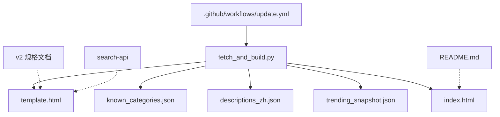
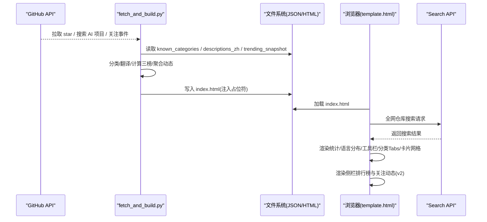
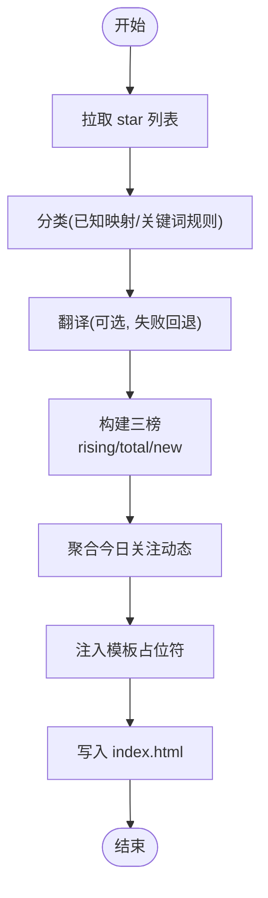
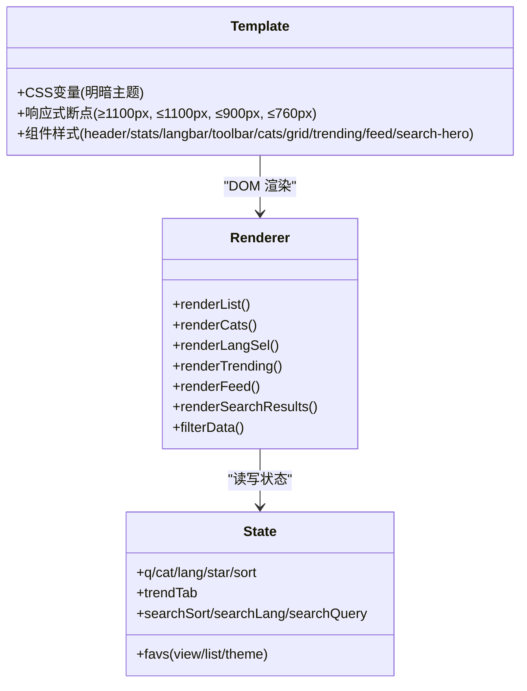
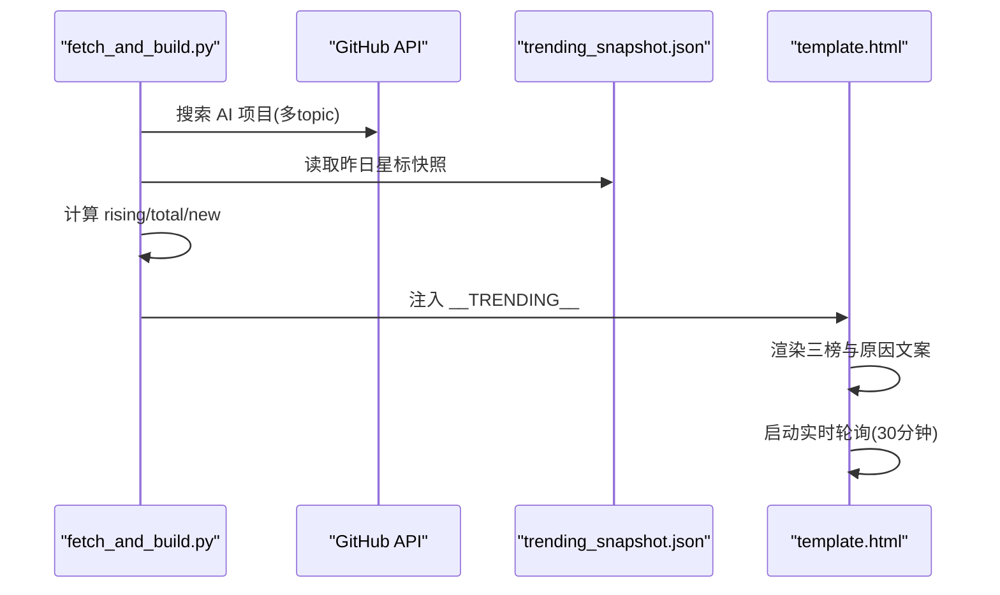
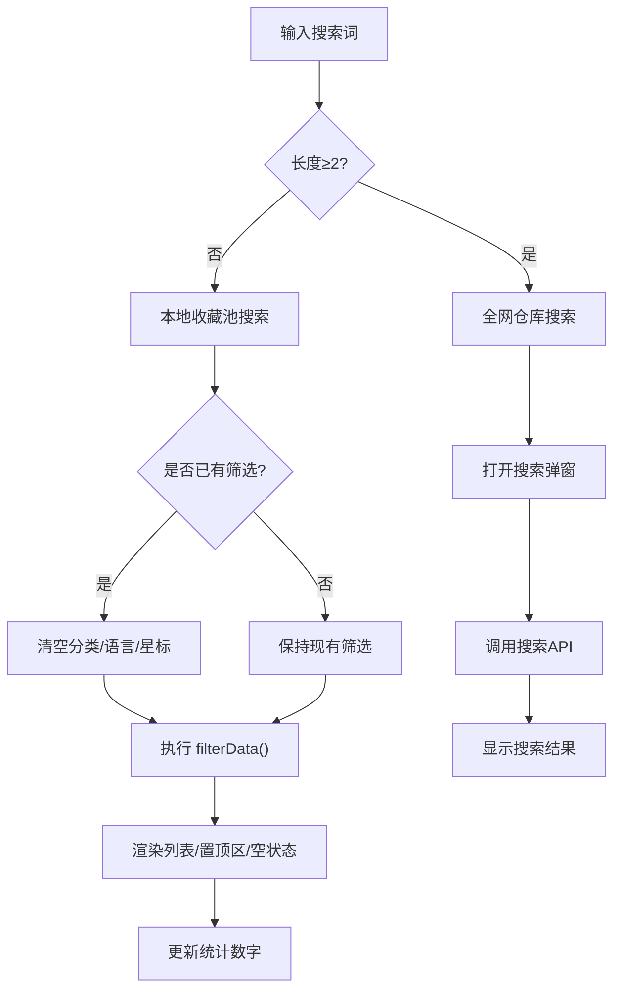
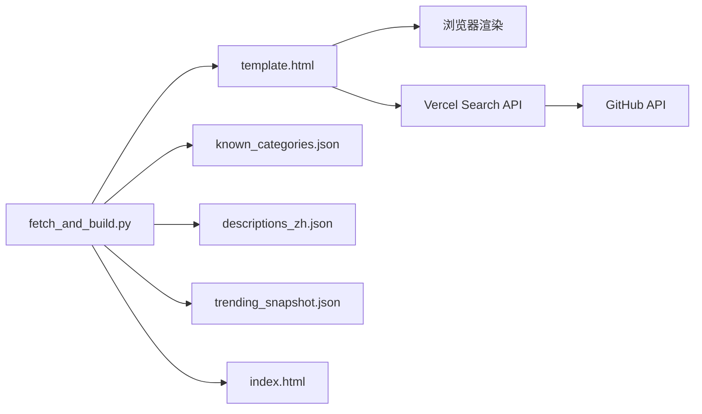

# StarHub v2 UI 重设计规格

<cite>
**本文引用的文件**
- [README.md](file://README.md)
- [fetch_and_build.py](file://fetch_and_build.py)
- [template.html](file://template.html)
- [index.html](file://index.html)
- [known_categories.json](file://known_categories.json)
- [descriptions_zh.json](file://descriptions_zh.json)
- [trending_snapshot.json](file://trending_snapshot.json)
- [.github/workflows/update.yml](file://.github/workflows/update.yml)
- [docs/superpowers/specs/2026-08-14-starhub-v2-ui-design.md](file://docs/superpowers/specs/2026-08-14-starhub-v2-ui-design.md)
</cite>

## 更新摘要
**变更内容**
- **重大主题系统升级**：品牌颜色从 #0ea5e9/#0284c7 更新为 #2563eb/#1d4ed8，提供更专业的蓝色调
- **新增 CSS 变量**：引入 --accent-solid、--t-rising-fg、--t-new-fg、--t-rising-text 等语义化变量
- **增强头部渐变**：使用 linear-gradient(120deg,#0f172a,#1e40af,#2563eb) 深空蓝渐变，提升视觉层次
- **改进对比度**：优化明暗主题下的色彩对比度，提升可访问性
- **统一品牌色调**：全站采用统一的蓝色系品牌色，增强品牌一致性

## 目录
1. [简介](#简介)
2. [项目结构](#项目结构)
3. [核心组件](#核心组件)
4. [架构总览](#架构总览)
5. [详细组件分析](#详细组件分析)
6. [依赖关系分析](#依赖关系分析)
7. [性能与可维护性](#性能与可维护性)
8. [故障排查指南](#故障排查指南)
9. [结论](#结论)
10. [附录：v2 变更对照清单](#附录v2-变更对照清单)

## 简介
本项目为「GitHub Star 收藏台」，面向 GitHub 用户 Kwei168，自动拉取 star 列表、智能分类、生成单页静态站点并托管于 GitHub Pages，通过 GitHub Actions 每日定时更新。当前仓库已包含 v2 UI 重设计的完整规格文档，目标是将"我的收藏"提升为主角，将排行榜与关注动态收纳到桌面端侧边仪表盘，整体视觉升级为青蓝渐变品牌风，同时保持零外部依赖与明暗双主题。**最新更新** 完成了重大主题系统升级，包括品牌颜色从 #0ea5e9/#0284c7 迁移到更专业的 #2563eb/#1d4ed8，新增语义化 CSS 变量，增强头部渐变和对比度优化，为用户提供更加专业和一致的视觉体验。

## 项目结构
- 入口与模板
  - index.html：构建产物（由脚本自动生成，勿手改）
  - template.html：页面模板（CSS + HTML 结构 + JS 渲染逻辑），所有 UI 改动在此进行
- 数据与配置
  - known_categories.json：稳定分类映射（避免分类抖动）
  - descriptions_zh.json：中文描述缓存（避免重复翻译）
  - trending_snapshot.json：每日 AI 项目星标快照（用于涨星榜增量计算）
- 自动化与流水线
  - fetch_and_build.py：核心脚本（拉取 star → 分类 → 翻译 → 生成 index.html；构建排行榜与关注动态）
  - .github/workflows/update.yml：每天 UTC 01:00（北京时间 09:00）运行，提交产物
- 说明文档
  - README.md：面向最终用户的说明
  - docs/superpowers/specs/2026-08-14-starhub-v2-ui-design.md：v2 UI 重设计规格（布局、视觉、交互、约束、验证清单）

**图表来源**
- [fetch_and_build.py:382-459](file://fetch_and_build.py#L382-L459)
- [.github/workflows/update.yml:16-41](file://.github/workflows/update.yml#L16-L41)
- [template.html:1-883](file://template.html#L1-L883)

**章节来源**
- [README.md:1-22](file://README.md#L1-L22)

## 核心组件
- 数据获取与处理
  - 拉取 star 列表、关注账号事件、AI 项目池搜索
  - 智能分类（已知映射优先，未知走关键词规则）
  - 中文翻译（Google/MyMemory 接口，失败回退原文）
- 排行榜与关注动态
  - 三榜：涨星榜（对比昨日基线）、总星标榜、新秀榜（近 7 天新建）
  - 今日关注动态：聚合关注账号的 repo/star/follow/pr 事件
- 页面渲染
  - 统计条、语言分布、工具栏、分类 Tabs、置顶区、项目网格/列表
  - 排行榜与关注动态区域（v2 中改为侧栏固定宽度）
  - **新增** search-hero 组件：独立的全网仓库搜索区域
- 用户交互
  - 搜索（模糊匹配+高亮）、语言/星标筛选、排序、收藏置顶、视图切换、主题切换、导出/导入
  - **新增** 全网仓库搜索：支持跨语言 GitHub 仓库搜索，输入 2 个字符以上即可触发
  - 快捷键：/ 聚焦搜索、Esc 清空或关闭浮层

**章节来源**
- [fetch_and_build.py:126-146](file://fetch_and_build.py#L126-L146)
- [fetch_and_build.py:185-283](file://fetch_and_build.py#L185-L283)
- [fetch_and_build.py:313-379](file://fetch_and_build.py#L313-L379)
- [template.html:430-883](file://template.html#L430-L883)

## 架构总览
系统采用"后端脚本 + 前端单页"的极简架构：Python 脚本负责数据抓取、分类、翻译与页面注入；前端模板仅做展示与交互，无外部依赖。**更新** 新增了全网仓库搜索功能，通过 Vercel API 代理实现跨语言 GitHub 仓库搜索。

**图表来源**
- [fetch_and_build.py:382-459](file://fetch_and_build.py#L382-L459)
- [template.html:430-883](file://template.html#L430-L883)

## 详细组件分析

### 数据管道（fetch_and_build.py）
- 职责
  - 拉取 star 列表（分页，限流 sleep）
  - 智能分类（已知映射优先，未知走 classify_new）
  - 中文翻译（多端点尝试，失败保留原文）
  - 构建三榜（rising/total/new），写回 trending_snapshot
  - 聚合今日关注动态（按北京时间过滤）
  - 注入模板占位符，输出 index.html
- 关键流程
  - 主流程：main() → fetch_stars() → 分类/翻译 → build_trending() → fetch_following_events() → 替换占位符 → 写文件
  - 排行榜：fetch_ai_pool() → 总榜/涨星榜/新秀榜 → 原因文案 → 快照覆盖
  - 关注动态：fetch_following() → 遍历 events → 过滤今日 → 聚合排序

**图表来源**
- [fetch_and_build.py:382-459](file://fetch_and_build.py#L382-L459)
- [fetch_and_build.py:185-283](file://fetch_and_build.py#L185-L283)
- [fetch_and_build.py:313-379](file://fetch_and_build.py#L313-L379)

**章节来源**
- [fetch_and_build.py:126-146](file://fetch_and_build.py#L126-L146)
- [fetch_and_build.py:185-283](file://fetch_and_build.py#L185-L283)
- [fetch_and_build.py:313-379](file://fetch_and_build.py#L313-L379)
- [fetch_and_build.py:382-459](file://fetch_and_build.py#L382-L459)

### 页面模板与渲染（template.html）
- 职责
  - 定义 CSS 变量（明暗主题）、响应式布局、组件样式
  - 提供 HTML 骨架（header、统计、语言分布、工具栏、分类 Tabs、置顶区、网格/列表、排行榜、关注动态）
  - 实现前端状态管理（搜索、筛选、排序、收藏、视图、主题）
  - 渲染函数：filterData、renderList、renderCats、renderLangSel、renderTrending、renderFeed
- v2 变更要点（依据规格文档）
  - 桌面 ≥1100px：双栏布局（左主收藏，右辅侧栏固定 340px sticky）
  - 顶栏品牌化：深青蓝渐变背景、磨砂效果、徽章与操作按钮白底透明风格
  - 排行榜收敛为 Top10 + "查看完整 Top20"全屏浮层（淡入上滑 300ms）
  - 关注动态在宽屏下不再全宽，纳入侧栏时间线
  - 工具栏统一高度 40px，移动端换行
  - 卡片 hover 上浮 + 青蓝描边，分类 tag、今日更新徽章保留
  - 统计卡紧凑化，数字加大，语言分布折叠面板默认展开
  - 排行榜 tab 语义色调整为与品牌协调（涨星=青蓝、总榜=深蓝、新秀=绿）

**重大主题系统升级**
- **品牌颜色更新**：从 #0ea5e9/#0284c7 升级到 #2563eb/#1d4ed8，提供更专业的蓝色调
- **新增语义化 CSS 变量**：
  - `--accent-solid`：纯色强调色，用于主要按钮和强调元素
  - `--t-rising-fg`：涨星榜前景色，确保文本可读性
  - `--t-new-fg`：新秀榜前景色，保持一致的视觉层次
  - `--t-rising-text`：涨星榜文本色，优化对比度
- **增强头部渐变**：使用 `linear-gradient(120deg,#0f172a,#1e40af,#2563eb)` 深空蓝渐变，替代原有的青蓝渐变
- **改进对比度**：优化明暗主题下的色彩对比度，特别是文字与背景的对比，提升可访问性
- **统一品牌色调**：全站采用统一的蓝色系品牌色，从浅蓝 (#2563eb) 到深蓝 (#1d4ed8)，增强品牌一致性

**图表来源**
- [template.html:7-319](file://template.html#L7-L319)
- [template.html:430-883](file://template.html#L430-L883)

**章节来源**
- [template.html:7-319](file://template.html#L7-L319)
- [template.html:430-883](file://template.html#L430-L883)
- [docs/superpowers/specs/2026-08-14-starhub-v2-ui-design.md:28-79](file://docs/superpowers/specs/2026-08-14-starhub-v2-ui-design.md#L28-L79)

### 排行榜与关注动态
- 排行榜
  - 数据源：GitHub Search API 合并多个 topic（ai/machine-learning/deep-learning/llm/gpt/agent）
  - 三榜逻辑：总榜按 stars 降序；涨星榜对比 trending_snapshot 基线（排除巨头 star>50000）；新秀榜近 7 天新建且 stars>50
  - 文案：reason 字段根据榜单类型生成（如"累计 X 万星标"、"今日涨星 +X"、"新上榜 · X 星标"）
- 今日关注动态
  - 数据源：关注账号 public events，按北京时间过滤"今日"，聚合 repo/star/follow/pr 四类事件
  - 展示：紧凑时间线列表，颜色区分事件类型

**更新** 滚动行为优化与实时数据更新
- 改进了 feed-list 的滚动容器，使用 `overflow-y:auto` 确保平滑滚动
- 优化了滚动条样式，提供更一致的跨平台滚动体验
- 增强了移动端触摸滚动的响应性
- 新增实时关注动态轮询机制，每 30 分钟自动刷新

**图表来源**
- [fetch_and_build.py:185-283](file://fetch_and_build.py#L185-L283)
- [template.html:676-713](file://template.html#L676-L713)

**章节来源**
- [fetch_and_build.py:185-283](file://fetch_and_build.py#L185-L283)
- [fetch_and_build.py:313-379](file://fetch_and_build.py#L313-L379)
- [template.html:676-743](file://template.html#L676-L743)

### 用户交互与状态管理
- 搜索与筛选
  - 模糊搜索：支持项目名/描述/语言/分类/标签，输入时自动清空其他筛选以避免结果被遮挡
  - 语言/星标/排序：下拉与分段按钮组合，实时刷新列表
  - **新增** 全网仓库搜索：支持跨语言 GitHub 仓库搜索，输入 2 个字符以上即可触发
- 收藏与置顶
  - localStorage 持久化收藏集合，置顶区优先显示
- 视图与主题
  - 卡片/列表视图切换，明暗主题切换，localStorage 记忆
- 快捷键
  - / 聚焦搜索，Esc 清空或关闭浮层

**更新** 搜索功能增强
- 新增 search-hero 组件，提供独立的搜索入口
- 支持跨语言搜索整个 GitHub，中英文仓库均可能出现
- 搜索结果支持语言过滤、排序和分页加载
- 搜索提示实时更新，显示收藏池匹配数量
- 增强的错误处理和重试机制

**图表来源**
- [template.html:746-773](file://template.html#L746-L773)
- [template.html:555-576](file://template.html#L555-L576)

**章节来源**
- [template.html:746-773](file://template.html#L746-L773)
- [template.html:555-576](file://template.html#L555-L576)

### 新增 search-hero 组件
- 功能特性
  - 独立的全网仓库搜索区域，位于页面顶部显著位置
  - 支持跨语言 GitHub 仓库搜索，中英文仓库均可搜索
  - 输入 2 个字符以上即可触发全网搜索
  - 实时显示收藏池匹配数量和搜索提示
  - 支持语言过滤、排序和分页加载
- 视觉设计
  - 品牌化设计，使用新的蓝色渐变背景和阴影效果
  - 大尺寸搜索框，高度 52px，圆角 14px
  - 搜索图标和按钮采用新的品牌主色 #2563eb
  - 响应式设计，移动端自动换行布局
- 交互体验
  - 搜索框聚焦时显示品牌色边框和光晕效果
  - 搜索提示实时更新，引导用户操作
  - 搜索结果弹窗支持编辑查询词和语言过滤
  - 完善的错误处理和重试机制

**更新** 响应式断点优化
- 将移动端适配断点从 640px 更新到 760px
- 优化了 search-hero 在小屏幕上的显示效果
- 改进了触摸交互和滚动体验

**章节来源**
- [template.html:163-204](file://template.html#L163-L204)
- [template.html:557-579](file://template.html#L557-L579)
- [template.html:975-1147](file://template.html#L975-L1147)

## 依赖关系分析
- 内部依赖
  - fetch_and_build.py 依赖 template.html（占位符注入）
  - fetch_and_build.py 依赖 known_categories.json、descriptions_zh.json、trending_snapshot.json（分类稳定性、翻译缓存、基线）
  - template.html 依赖运行时注入的 DATA/CATS/LANGS/FAVS/TRENDING/FEED/UPDATED
- 外部依赖
  - GitHub API（star 列表、search/repositories、users/{user}/events/public）
  - 翻译接口（Google/MyMemory，失败回退）
  - **新增** Vercel Search API（跨语言仓库搜索）
- 耦合与内聚
  - 数据层与展示层解耦：脚本只负责数据与注入，模板只负责渲染与交互
  - 分类与翻译缓存独立文件，便于增量增长与稳定化
  - **新增** 搜索功能与主收藏功能解耦，通过独立 API 提供服务
- 潜在风险
  - 网络不稳定导致 API 调用失败（本地 Windows 环境尤为明显）
  - 翻译接口限流或不可用，需回退原文
  - trending_snapshot.json 缺失会破坏涨星榜基线
  - **新增** 搜索 API 限流或不可用，需要降级处理

**图表来源**
- [fetch_and_build.py:382-459](file://fetch_and_build.py#L382-L459)
- [template.html:430-440](file://template.html#L430-L440)

**章节来源**
- [AGENT_HANDOVER.md:33-45](file://AGENT_HANDOVER.md#L33-L45)
- [AGENT_HANDOVER.md:72-79](file://AGENT_HANDOVER.md#L72-L79)

## 性能与可维护性
- 性能
  - 单页零外链，首屏加载快；CSS/JS 内联减少请求数
  - 排行榜与关注动态数据在构建期预计算，前端仅渲染
  - 搜索与筛选使用内存过滤，适合当前规模的数据集
  - **更新** 优化的滚动性能，减少重绘重排，提升长列表滚动流畅度
  - **新增** 搜索功能采用异步加载和分页机制，避免一次性加载大量数据
- 可维护性
  - 模板与脚本职责清晰，改动范围可控
  - 分类与翻译缓存独立文件，避免抖动与重复翻译
  - 自动化流水线保证每日更新，减少人工干预
  - **更新** 改进的响应式断点管理，便于后续维护和扩展
  - **新增** 搜索功能模块化设计，便于独立维护和升级
  - **主题系统优化**：语义化 CSS 变量使主题维护更加简单，新增的 --accent-solid 等变量提高了代码可读性

## 故障排查指南
- 常见问题
  - 本地网络对 api.github.com SSL EOF/TLS 超时：优先使用 Actions 手动触发（海外 runner 更稳定）
  - 翻译接口限流或失败：回退保留原文，检查网络与配额
  - trending_snapshot.json 缺失：首次运行后勿删除，否则涨星榜 fallback 显示"新上榜"
  - 分类抖动：确保 known_categories.json 不被整体重写，让脚本增量增长
  - **新增** 搜索 API 限流或失败：检查网络连接，重试机制会自动处理
- 定位步骤
  - 检查 Actions 最近一次 run 是否 success
  - 本地运行 python fetch_and_build.py，观察控制台错误与输出
  - 确认 index.html 是否被正确生成（不要手改）
  - 核对模板占位符是否正确替换（DATA/CATS/LANGS/FAVS/TRENDING/FEED/UPDATED）
  - **新增** 检查搜索功能是否正常：打开搜索弹窗，测试搜索和分页功能
  - **主题检查**：验证明暗主题切换正常，新品牌色显示正确

**章节来源**
- [AGENT_HANDOVER.md:58-79](file://AGENT_HANDOVER.md#L58-L79)
- [fetch_and_build.py:382-459](file://fetch_and_build.py#L382-L459)

## 结论
StarHub v2 UI 重设计以"收藏为主、排行与动态为辅"的信息架构为核心，通过品牌化顶栏、双栏布局、紧凑组件与流畅动效，显著提升信息密度与可读性。技术层面坚持零依赖、明暗双主题与数据层零改动，确保可维护性与稳定性。**最新更新** 完成了重大主题系统升级，成功将品牌颜色从 #0ea5e9/#0284c7 迁移到更专业的 #2563eb/#1d4ed8，新增语义化 CSS 变量（--accent-solid、--t-rising-fg、--t-new-fg、--t-rising-text），增强头部渐变效果和对比度优化，为用户提供了更加专业、一致和可访问的视觉体验。新增的 search-hero 组件不仅提升了搜索能力，还改善了整体的用户体验。建议严格遵循规格文档的验证清单逐项回归，确保桌面/移动端断点、侧栏 sticky、排行榜浮层、主题切换、搜索功能和全部既有功能正常。

## 附录：v2 变更对照清单
- 布局
  - 桌面 ≥1100px：双栏（左主收藏，右辅侧栏固定 340px sticky）
  - <1100px：单列堆叠（收藏→排行榜→动态）
  - **更新** 新增 1100px 断点，优化中等屏幕尺寸的布局过渡
  - **新增** search-hero 组件占据顶部显著位置，独立于主收藏区域
- 视觉
  - 顶栏：深青蓝渐变背景、磨砂效果、徽章与操作按钮白底透明风格
  - **重大更新** 品牌主色：从 #0ea5e9/#0284c7 升级到 #2563eb/#1d4ed8，提供更专业的蓝色调
  - **重大更新** 头部渐变：使用 `linear-gradient(120deg,#0f172a,#1e40af,#2563eb)` 深空蓝渐变，替代原有青蓝渐变
  - **新增** 语义化 CSS 变量：
    - `--accent-solid`：纯色强调色，用于主要按钮和强调元素
    - `--t-rising-fg`：涨星榜前景色，确保文本可读性
    - `--t-new-fg`：新秀榜前景色，保持一致的视觉层次
    - `--t-rising-text`：涨星榜文本色，优化对比度
  - 排行榜 tab 语义色：涨星=青蓝、总榜=深蓝、新秀=绿（暗色提亮）
  - 星标金色 #e3a008 保留（互补色）
  - **新增** search-hero 组件：品牌化设计，蓝色渐变背景，大尺寸搜索框
  - **更新** 统计卡片色彩编码：蓝/紫/绿三色强调色，暗色主题下自动适配
- 组件
  - 统计卡：带图标、数字加大、高度紧凑，采用色彩编码强调
  - 语言分布：彩条+图例，折叠面板默认展开
  - 工具栏：单行布局，控件高度统一 40px，移动端换行
  - 分类 Tabs：胶囊样式与交互不变
  - 项目卡片：圆角 14px、hover 上浮 2px + 蓝色描边；分类 tag、今日更新徽章保留
  - 排行榜条目：收敛为排名徽章+名称+语言圆点+理由/星星；删除重复强调
  - 完整榜浮层：全屏遮罩+居中面板，淡入上滑 300ms，Esc/遮罩关闭
  - 关注动态：紧凑时间线列表，宽屏不再全宽
  - **新增** search-hero 组件：独立搜索区域，支持全网仓库搜索
  - **更新** 导航系统：新增 .nav-links 类支持外部站点链接展示
- 交互与动效
  - 统计数字 count-up（页面加载与主题切换时触发）
  - 排行榜浮层动画 300ms
  - 卡片 hover 微调
  - 搜索防遮挡逻辑保留（输入关键词自动清空其他筛选）
  - 快捷键保留（/ 聚焦搜索、Esc 清空/关闭浮层）
  - **更新** 改进的滚动行为，提供更流畅的触摸和鼠标滚动体验
  - **新增** 全网搜索交互：输入 2 个字符以上触发搜索，支持分页加载和语言过滤
  - **更新** 排序按钮状态可见性修复，确保不同状态下视觉反馈清晰
- 技术约束
  - 数据层零改动（占位符格式不变）
  - 改动范围：template.html（CSS + 结构 + JS 渲染逻辑中涉及 DOM 结构的部分）
  - 零依赖：不引入外部库/CSS 框架/字体 CDN
  - 明暗双主题完整支持，localStorage 主题记忆与防 FOUC 内联脚本保留
  - 收藏（localStorage）、视图切换（localStorage）逻辑不变
  - **更新** 增强的响应式断点管理，支持更好的移动端适配
  - **新增** 搜索功能依赖 Vercel API，具备完整的错误处理和重试机制
  - **主题系统优化**：语义化 CSS 变量提高代码可维护性，新增变量使主题定制更加灵活

**章节来源**
- [docs/superpowers/specs/2026-08-14-starhub-v2-ui-design.md:18-99](file://docs/superpowers/specs/2026-08-14-starhub-v2-ui-design.md#L18-L99)
- [template.html:386-416](file://template.html#L386-L416)
- [template.html:317-338](file://template.html#L317-L338)
- [template.html:163-204](file://template.html#L163-L204)
- [template.html:975-1147](file://template.html#L975-L1147)
- [index.html:11-11](file://index.html#L11-L11)
- [index.html:65-68](file://index.html#L65-L68)
- [index.html:143-148](file://index.html#L143-L148)
- [index.html:487-496](file://index.html#L487-L496)