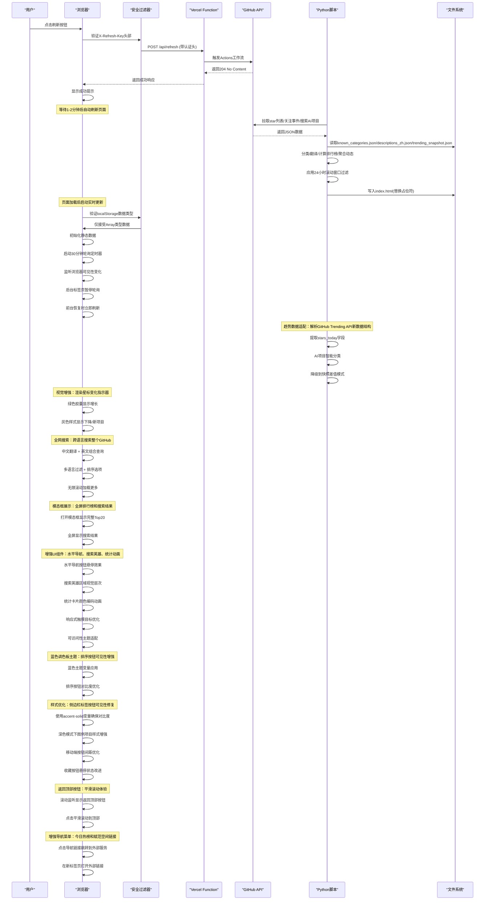
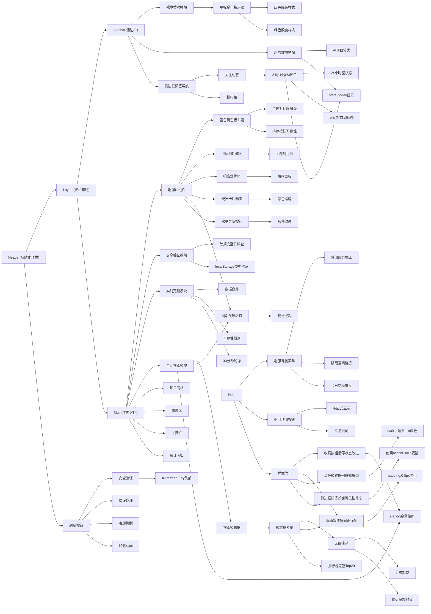
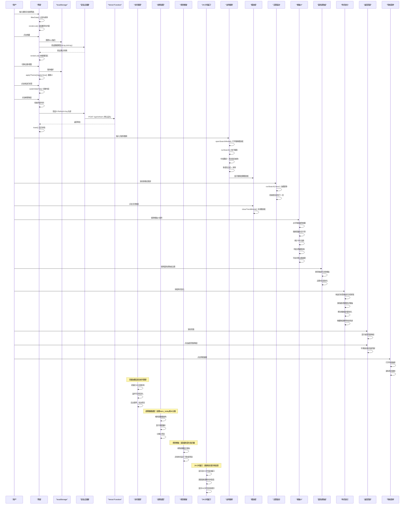
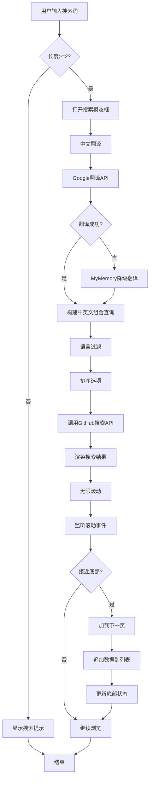
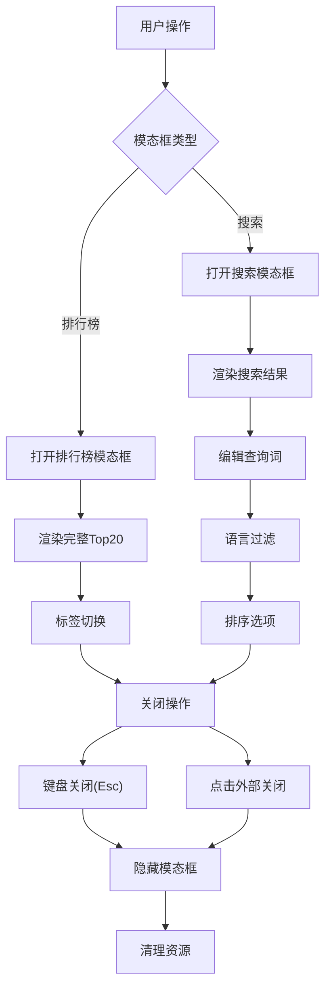
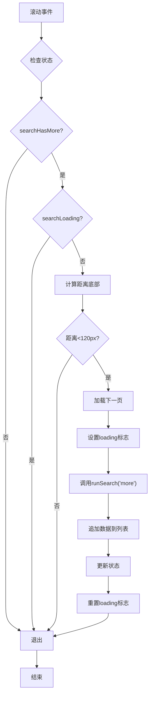

# 前端界面

<cite>
**本文引用的文件**
- [template.html](file://template.html)
- [index.html](file://index.html)
- [api/refresh.js](file://api/refresh.js)
- [api/search.js](file://api/search.js)
- [api/events.js](file://api/events.js)
- [fetch_and_build.py](file://fetch_and_build.py)
- [known_categories.json](file://known_categories.json)
- [descriptions_zh.json](file://descriptions_zh.json)
- [trending_snapshot.json](file://trending_snapshot.json)
- [README.md](file://README.md)
- [vercel.json](file://vercel.json)
- [2026-08-14-starhub-v2-ui-design.md](file://docs/superpowers/specs/2026-08-14-starhub-v2-ui-design.md)
- [2026-08-15-starhub-realtime.md](file://docs/superpowers/plans/2026-08-15-starhub-realtime.md)
</cite>

## 更新摘要
**变更内容**
- **新增**：修复了排序按钮的视觉可访问性问题，为激活状态添加了适当的背景颜色样式，确保在不同主题下的良好对比度
- **新增**：新增了外部资源链接到beyondata.com社区学习资源（赋范空间），为用户提供更多学习资源
- **优化**：增强了用户交互体验，通过改进的样式和导航功能提升整体用户体验

## 目录
1. [简介](#简介)
2. [项目结构](#项目结构)
3. [核心组件](#核心组件)
4. [架构总览](#架构总览)
5. [详细组件分析](#详细组件分析)
6. [依赖关系分析](#依赖关系分析)
7. [性能考虑](#性能考虑)
8. [故障排查指南](#故障排查指南)
9. [结论](#结论)
10. [附录：模板变量与定制扩展](#附录模板变量与定制扩展)

## 简介
本仓库实现了"GitHub Star 收藏台"的前端页面，经过v2重设计后，现在提供现代化的双栏布局界面，支持品牌化视觉系统和增强的用户体验。页面通过Python脚本每日自动拉取数据、智能分类、生成排行榜与动态信息，并将数据注入到HTML模板中，最终输出index.html供GitHub Pages托管。前端具备响应式双栏布局、深色模式、模糊搜索、语言/星标筛选、收藏置顶、本地存储备份导入导出等功能。

**重大更新** v2版本引入了完整的品牌化视觉系统，采用蓝色渐变主题（替代原有的青蓝/青色色调），桌面端双栏布局将收藏列表作为主角，排行榜和动态信息收纳为侧边仪表盘。**全新功能**：新增了全网仓库搜索模块，支持跨语言搜索整个GitHub；实现了实时动态面板，每30分钟自动更新近24小时关注动态；添加了模态框结果展示，提供全屏的排行榜和搜索结果查看体验；集成了无限滚动功能，在大数据量场景下提供更好的浏览体验。**安全增强**：已实施多项安全措施，包括localStorage类型验证、刷新API头部认证和数据完整性保护。**最新趋势数据适配**：支持GitHub Trending API返回的新数据结构，包括stars_today字段和AI项目智能分类，提供更准确的涨星榜信息。**视觉增强**：为排行榜项目添加了直观的星标变化指示器，使用绿色胶囊显示增长，灰色样式显示下降或新项目，提升了数据的可读性和用户体验。**时间窗口概念更新**：关注动态模块现已采用24小时滚动窗口概念，所有相关文本和提示信息都已更新以反映这一重要变更。

**最新更新**：增强了UI组件系统，包括全新的水平导航按钮系统，带有平滑的悬停效果和现代化设计；重新设计了搜索英雄区域，提供了改进的视觉层次结构和用户引导；更新了统计卡片，采用颜色编码强调和流畅的计数动画；改进了响应式行为，特别是在移动设备上提供了更好的触摸目标和交互体验；修复了可访问性问题，确保在不同主题下排序按钮的可见性保持一致；实现了蓝色调色板替换青蓝色调的主题系统增强，改进了排序按钮在不同主题下的可见性和对比度。

**样式优化更新**：最近对CSS样式进行了重要修复和优化，包括侧边栏标签按钮激活状态的可见性修复、深色模式下的图例项目样式增强、移动端按钮间距优化以及收藏按钮悬停状态的视觉层次改进。

**最新增强**：新增了返回顶部按钮功能，为用户提供便捷的页面导航体验；增强了导航菜单，添加了"今日热榜"外部链接，为用户提供更多热点信息来源；修复了排序按钮的视觉可访问性问题，确保激活状态在不同主题下都有良好的对比度和可见性；新增了赋范空间外部链接，为用户提供社区学习资源。

## 项目结构
- template.html：页面模板，包含v2重设计的CSS样式、双栏布局结构与交互逻辑；运行时由脚本将占位符替换为真实数据后生成 index.html。
- fetch_and_build.py：自动化构建脚本，负责拉取数据、分类、生成排行榜与动态信息，并写入 index.html。
- api/refresh.js：Vercel Serverless Function，用于中转触发GitHub Actions工作流进行数据刷新。
- api/search.js：Vercel Serverless Function，用于全网GitHub仓库搜索（跨语言），支持中文翻译和多语言过滤。
- api/events.js：Vercel Serverless Function，用于实时聚合关注账号的动态事件（近24小时滚动窗口）。
- known_categories.json：已知项目的分类映射，保证分类稳定。
- descriptions_zh.json：中文描述缓存，减少重复翻译。
- trending_snapshot.json：排行榜快照（昨日星标数），用于计算涨星榜增量。
- README.md：项目说明与部署指引。
- vercel.json：Vercel函数配置，定义了刷新功能的部署参数。
- 2026-08-14-starhub-v2-ui-design.md：v2重设计规格文档，定义了双栏布局、品牌化视觉系统和现代化用户体验规范。
- 2026-08-15-starhub-realtime.md：实时更新功能实现计划文档。

```mermaid
graph TB
A["fetch_and_build.py"] --> B["template.html (v2设计)"]
A --> C["known_categories.json"]
A --> D["descriptions_zh.json"]
A --> E["trending_snapshot.json"]
A --> F["index.html(生成)"]
F --> G["浏览器渲染"]
B --> H["双栏布局系统"]
B --> I["品牌化视觉系统"]
B --> J["现代化交互组件"]
B --> K["侧边栏标签导航"]
B --> L["头部刷新按钮"]
L --> M["Vercel Function"]
M --> N["GitHub Actions"]
N --> O["数据更新流程"]
B --> P["实时更新模块"]
P --> Q["30分钟轮询"]
P --> R["浏览器可见性状态处理"]
B --> S["安全增强模块"]
S --> T["localStorage类型验证"]
S --> U["刷新API头部认证"]
S --> V["数据完整性保护"]
B --> W["趋势数据适配"]
W --> X["stars_today字段支持"]
W --> Y["AI项目智能分类"]
W --> Z["Trending API解析"]
B --> AA["视觉增强模块"]
AA --> BB["星标变化指示器"]
AA --> CC["绿色胶囊样式"]
AA --> DD["灰色降级样式"]
B --> EE["24小时滚动窗口"]
EE --> FF["关注动态时间过滤"]
EE --> GG["滚动窗口概念"]
B --> HH["全网搜索模块"]
HH --> II["跨语言搜索"]
HH --> JJ["中文翻译"]
HH --> KK["多语言过滤"]
B --> LL["模态框展示"]
LL --> MM["排行榜完整Top20"]
LL --> NN["搜索结果全屏"]
B --> OO["无限滚动"]
OO --> PP["接近底部加载"]
OO --> QQ["分页加载"]
B --> RR["增强UI组件"]
RR --> SS["水平导航按钮"]
RR --> TT["搜索英雄区域"]
RR --> UU["统计卡片动画"]
RR --> VV["响应式优化"]
RR --> WW["可访问性修复"]
RR --> XX["蓝色调色板主题"]
XX --> YY["排序按钮可见性"]
XX --> ZZ["主题对比度增强"]
B --> AA2["返回顶部按钮"]
AA2 --> BB2["平滑滚动"]
AA2 --> CC2["响应式显示"]
B --> DD2["增强导航菜单"]
DD2 --> EE2["今日热榜链接"]
DD2 --> FF2["赋范空间链接"]
DD2 --> GG2["外部服务集成"]
```



**图表来源**
- [fetch_and_build.py:382-459](file://fetch_and_build.py#L382-L459)
- [template.html:57-318](file://template.html#L57-L318)
- [api/refresh.js:1-62](file://api/refresh.js#L1-L62)
- [api/search.js:1-168](file://api/search.js#L1-L168)
- [api/events.js:1-161](file://api/events.js#L1-L161)
- [vercel.json:1-6](file://vercel.json#L1-L6)
- [2026-08-14-starhub-v2-ui-design.md:28-49](file://docs/superpowers/specs/2026-08-14-starhub-v2-ui-design.md#L28-L49)
- [2026-08-15-starhub-realtime.md:282-336](file://docs/superpowers/plans/2026-08-15-starhub-realtime.md#L282-L336)
- [fetch_and_build.py:489-560](file://fetch_and_build.py#L489-L560)

**章节来源**
- [README.md:7-13](file://README.md#L7-L13)
- [fetch_and_build.py:382-459](file://fetch_and_build.py#L382-L459)
- [api/refresh.js:1-62](file://api/refresh.js#L1-L62)
- [api/search.js:1-168](file://api/search.js#L1-L168)
- [api/events.js:1-161](file://api/events.js#L1-L161)
- [vercel.json:1-6](file://vercel.json#L1-L6)
- [2026-08-14-starhub-v2-ui-design.md:6-17](file://docs/superpowers/specs/2026-08-14-starhub-v2-ui-design.md#L6-L17)
- [2026-08-15-starhub-realtime.md:20-27](file://docs/superpowers/plans/2026-08-15-starhub-realtime.md#L20-L27)

## 核心组件
- **模板引擎与数据注入**：脚本将 __DATA__、__CATS__、__LANGS__、__FAVS__、__TRENDING__、__FEED__、__UPDATED__ 等占位符替换为 JSON 或字符串常量，注入到 template.html 中形成可运行的 index.html。
- **v2双栏布局系统**：桌面端≥1100px显示左右双栏，左侧为主内容区（收藏列表），右侧为固定宽度340px的侧边栏（排行榜+动态信息）。
- **侧边栏标签导航系统**：新增.side-tabs和.side-tab类实现每日排行榜和关注动态的标签切换功能。
- **头部刷新按钮系统**：新增刷新按钮，支持加载动画、冷却机制、错误处理和用户反馈。
- **品牌化视觉系统**：采用蓝色渐变主题（#2563eb/#3b82f6），支持明暗双主题，现代化组件设计与状态指示。
- **数据过滤与排序**：支持模糊搜索、分类标签、编程语言、星标区间筛选，以及按星标、更新时间、名称排序。
- **收藏与置顶**：收藏项使用 Set 管理，优先显示在置顶区，支持导出/导入备份。
- **排行榜与动态**：根据 trending_snapshot.json 计算涨星榜，聚合关注账号近24小时事件生成动态流。
- **实时更新系统**：支持页面打开即显示最新star列表，每30分钟自动轮询更新，后台标签页自动暂停轮询。
- **安全增强模块**：实施localStorage类型验证、刷新API头部认证和数据完整性保护机制。
- **趋势数据适配模块**：支持GitHub Trending API返回的新数据结构，包括stars_today字段和AI项目智能分类。
- **视觉增强模块**：为排行榜项目添加星标变化指示器，使用绿色胶囊显示增长，灰色样式显示下降或新项目。
- **24小时滚动窗口模块**：实现关注动态的24小时滚动窗口过滤，确保只显示最近24小时内的活动。
- **全网搜索模块**：支持跨语言搜索整个GitHub，包含中文翻译、多语言过滤、排序选项和无限滚动。
- **模态框展示系统**：提供排行榜完整Top20和搜索结果的全屏模态框显示。
- **增强UI组件系统**：新增水平导航按钮、搜索英雄区域、统计卡片动画、响应式优化和可访问性修复。
- **蓝色调色板主题系统**：实现了从青蓝/青色色调向蓝色调色板的转换，改进了排序按钮在不同主题下的可见性和对比度。
- **返回顶部按钮系统**：新增返回顶部按钮，提供平滑滚动体验和响应式显示，改善用户导航体验。
- **增强导航菜单**：添加了"今日热榜"和"赋范空间"外部链接，为用户提供更多资源和社区学习机会。

**重大更新** v2版本重新设计了信息架构，将收藏列表提升为页面主角，排行榜和动态信息收纳为侧边仪表盘，并通过标签导航系统提升了用户体验。**全新功能**：全网搜索模块支持跨语言搜索整个GitHub，通过Google翻译API实现中英文混合查询；实时动态面板每30分钟自动更新近24小时关注动态，后台标签页自动暂停以节省资源；模态框展示系统提供全屏的排行榜和搜索结果查看体验；无限滚动功能在大数据量场景下提供更好的浏览体验。**安全增强措施**有效防止了恶意数据注入和未授权访问，保护用户数据安全。**最新趋势数据适配**支持GitHub Trending API返回的新数据结构，包括stars_today字段，提供更准确的涨星榜信息，同时通过AI项目智能分类确保排行榜内容的准确性。**视觉增强功能**通过直观的颜色编码和形状标识，让用户能够快速识别项目的星标变化趋势，提升了数据可读性和用户体验。**24小时滚动窗口概念**已全面应用于关注动态模块，所有相关文本和提示信息都已更新以反映这一重要的时间窗口行为变更。

**最新更新**：增强了UI组件系统，包括全新的水平导航按钮系统，带有平滑的悬停效果和现代化设计；重新设计了搜索英雄区域，提供了改进的视觉层次结构和用户引导；更新了统计卡片，采用颜色编码强调和流畅的计数动画；改进了响应式行为，特别是在移动设备上提供了更好的触摸目标和交互体验；修复了可访问性问题，确保在不同主题下排序按钮的可见性保持一致；实现了蓝色调色板替换青蓝色调的主题系统增强，改进了排序按钮在不同主题下的可见性和对比度。

**样式优化更新**：最近的CSS样式修复包括侧边栏标签按钮激活状态的可见性改进、深色模式下的图例项目样式增强、移动端按钮间距优化以及收藏按钮悬停状态的视觉层次提升，确保了更好的用户体验和可访问性。

**最新增强更新**：新增了返回顶部按钮功能，提供平滑滚动体验和响应式显示；增强了导航菜单，添加了"今日热榜"和"赋范空间"外部链接；修复了排序按钮的视觉可访问性问题，确保激活状态在不同主题下都有良好的对比度。

**章节来源**
- [template.html:430-440](file://template.html#L430-L440)
- [template.html:449-472](file://template.html#L449-L472)
- [template.html:533-576](file://template.html#L533-L576)
- [template.html:676-743](file://template.html#L676-L743)
- [template.html:107-114](file://template.html#L107-L114)
- [template.html:856-862](file://template.html#L856-L862)
- [template.html:445-448](file://template.html#L445-L448)
- [template.html:971-986](file://template.html#L971-L986)
- [template.html:915-946](file://template.html#L915-L946)
- [api/refresh.js:1-62](file://api/refresh.js#L1-L62)
- [api/search.js:1-168](file://api/search.js#L1-L168)
- [api/events.js:1-161](file://api/events.js#L1-L161)
- [fetch_and_build.py:149-283](file://fetch_and_build.py#L149-L283)
- [fetch_and_build.py:313-379](file://fetch_and_build.py#L313-L379)
- [fetch_and_build.py:382-459](file://fetch_and_build.py#L382-L459)
- [fetch_and_build.py:489-560](file://fetch_and_build.py#L489-L560)
- [2026-08-14-starhub-v2-ui-design.md:18-27](file://docs/superpowers/specs/2026-08-14-starhub-v2-ui-design.md#L18-L27)
- [2026-08-15-starhub-realtime.md:282-336](file://docs/superpowers/plans/2026-08-15-starhub-realtime.md#L282-L336)

## 架构总览
整体流程：Python 脚本从 GitHub API 拉取 star 列表与关注事件，结合本地分类与描述缓存，生成排行榜快照与动态信息，再将数据注入模板，产出 index.html。浏览器加载 index.html 后执行内联脚本，读取注入数据，渲染统计、语言分布、分类标签、项目网格/列表、排行榜与动态，并响应用户交互。用户可以通过头部刷新按钮主动触发数据更新流程。**重大更新**：新增了全网搜索模块，通过Vercel函数代理GitHub搜索API，支持中文翻译和多语言过滤；实现了实时动态面板，每30分钟自动轮询关注账号的最新动态；添加了模态框展示系统，提供全屏的排行榜和搜索结果查看体验；集成了无限滚动功能，在大数据量场景下提供更好的浏览体验。

**重大更新** v2版本采用了新的双栏布局架构，桌面端将内容分为左右两栏，移动端则采用单列堆叠布局，确保在不同屏幕尺寸下的最佳展示效果。新增的侧边栏标签导航系统和头部刷新按钮系统进一步提升了信息获取效率和用户控制能力。**全新架构**：全网搜索模块通过Vercel函数代理GitHub搜索API，支持中文翻译、多语言过滤和排序选项；实时动态面板通过独立的events API聚合关注账号的近24小时事件；模态框展示系统提供全屏的排行榜和搜索结果查看体验；无限滚动功能通过监听滚动事件实现接近底部时自动加载下一页。**安全架构**通过多层防护机制确保数据完整性和访问控制。**趋势数据适配架构**支持GitHub Trending API返回的新数据结构，包括stars_today字段，通过AI项目智能分类确保排行榜内容的准确性，并提供降级机制确保系统的稳定性。**视觉增强架构**通过CSS样式类和JavaScript逻辑实现了直观的星标变化指示器，使用绿色胶囊显示增长，灰色样式显示下降或新项目，提升了数据的可视化效果。**24小时滚动窗口架构**在后端实现了基于时间的滚动窗口过滤，确保关注动态只显示最近24小时内的活动，前端相应更新了所有相关文本和提示信息。

**更新架构**：增强了UI组件架构，包括水平导航按钮系统、搜索英雄区域、统计卡片动画、响应式优化和可访问性修复，为用户提供更加现代化和易用的界面体验；实现了蓝色调色板主题系统，替换原有的青蓝/青色色调，改进了排序按钮在不同主题下的可见性和对比度。

**样式架构优化**：最近的CSS样式优化包括侧边栏标签按钮激活状态的可见性修复、深色模式下的图例项目样式增强、移动端按钮间距优化以及收藏按钮悬停状态的视觉层次改进，确保了更好的用户体验和可访问性。

**最新架构增强**：新增了返回顶部按钮架构，提供平滑滚动体验和响应式显示；增强了导航菜单架构，集成了"今日热榜"和"赋范空间"外部服务；修复了排序按钮的可访问性架构，确保激活状态在不同主题下的良好对比度。



**图表来源**
- [template.html:971-986](file://template.html#L971-L986)
- [api/refresh.js:25-29](file://api/refresh.js#L25-L29)
- [template.html:605-611](file://template.html#L605-L611)
- [api/search.js:87-168](file://api/search.js#L87-L168)
- [api/events.js:114-161](file://api/events.js#L114-L161)
- [fetch_and_build.py:126-146](file://fetch_and_build.py#L126-L146)
- [fetch_and_build.py:185-283](file://fetch_and_build.py#L185-L283)
- [fetch_and_build.py:313-379](file://fetch_and_build.py#L313-L379)
- [fetch_and_build.py:382-459](file://fetch_and_build.py#L382-L459)
- [fetch_and_build.py:489-560](file://fetch_and_build.py#L489-L560)
- [2026-08-15-starhub-realtime.md:331-336](file://docs/superpowers/plans/2026-08-15-starhub-realtime.md#L331-L336)

## 详细组件分析

### 模板引擎原理与数据注入
- **占位符机制**：模板中的 __DATA__、__CATS__、__LANGS__、__FAVS__、__TRENDING__、__FEED__、__UPDATED__ 在构建时被替换为 JSON 或字符串常量，随后作为全局常量在脚本中使用。
- **数据注入点**：脚本在生成 index.html 时统一替换这些占位符，确保前端无需额外请求即可渲染完整页面。
- **运行期读取**：前端脚本初始化时直接读取这些常量，避免跨域与网络延迟问题。

**重大更新** v2版本保持了零数据层改动的原则，所有数据结构保持不变，仅调整了UI呈现方式。新增的刷新按钮功能完全基于现有架构，通过外部API调用触发数据更新流程。**全新功能**：全网搜索模块通过独立的search API实现跨语言搜索，支持中文翻译和多语言过滤；实时动态面板通过events API聚合近24小时关注动态，每30分钟自动轮询；模态框展示系统提供全屏的排行榜和搜索结果查看体验；无限滚动功能通过监听滚动事件实现接近底部时自动加载下一页。**安全增强**在数据加载阶段增加了类型验证，确保只有合法的数据格式才能被处理。**趋势数据适配**支持GitHub Trending API返回的新数据结构，包括stars_today字段，确保排行榜信息的准确性和时效性。**视觉增强**通过CSS样式类和JavaScript逻辑实现了星标变化指示器的渲染，使用绿色胶囊显示增长，灰色样式显示下降或新项目。**24小时滚动窗口**在前端渲染层面更新了所有相关文本，包括标题、副标题和空状态提示，确保用户理解新的时间窗口概念。

**更新增强**：增强了UI组件的数据注入机制，包括水平导航按钮的状态管理、搜索英雄区域的动态内容、统计卡片的实时数据绑定，确保所有新增组件都能正确接收和处理数据；实现了蓝色调色板主题的变量注入，确保排序按钮在不同主题下的可见性。

**样式优化增强**：最近的CSS样式优化包括侧边栏标签按钮激活状态的可见性修复，使用 `var(--accent-solid)` 替代 `var(--text)` 确保在不同主题下的良好对比度；深色模式下的图例项目样式增强，通过 `[data-theme="dark"] .legend .li{color:var(--text)}` 提升可读性；移动端按钮间距优化，调整 `hd .acts .btn{padding:0 8px}` 改善小屏幕显示效果；收藏按钮悬停状态改进，使用 `var(--star-bg)` 变量提供更一致的交互反馈。

**最新增强**：新增了返回顶部按钮的数据注入机制，通过JavaScript动态创建和管理按钮元素；增强了导航菜单的数据注入，添加了"今日热榜"和"赋范空间"链接的动态配置。

```mermaid
flowchart TD
Start(["构建开始"]) --> ReadTpl["读取template.html (v2设计)"]
ReadTpl --> ReplaceData["替换__DATA__/__CATS__/__LANGS__/__FAVS__"]
ReplaceData --> ReplaceTrend["替换__TRENDING__/__FEED__"]
ReplaceTrend --> ReplaceUpdated["替换__UPDATED__"]
ReplaceUpdated --> WriteOut["写入index.html"]
WriteOut --> End(["构建结束"])
Note over Start,End : 实时更新：页面加载后动态更新DATA和UPDATED
Note over Start,End : 安全增强：加载时验证localStorage数据类型
Note over Start,End : 趋势适配：支持stars_today字段和AI项目分类
Note over Start,End : 视觉增强：渲染星标变化指示器
Note over Start,End : 24小时窗口：更新关注动态时间窗口概念
Note over Start,End : 全网搜索：跨语言搜索整个GitHub
Note over Start,End : 模态框展示：全屏排行榜和搜索结果
Note over Start,End : 无限滚动：接近底部自动加载下一页
Note over Start,End : 增强UI：水平导航、搜索英雄、统计动画
Note over Start,End : 蓝色调色板：主题变量注入
Note over Start,End : 样式优化：侧边栏标签按钮可见性修复
Note over Start,End : 样式优化：深色模式图例项目样式增强
Note over Start,End : 样式优化：移动端按钮间距优化
Note over Start,End : 样式优化：收藏按钮悬停状态改进
Note over Start,End : 返回顶部按钮：动态创建和管理
Note over Start,End : 增强导航：添加今日热榜和赋范空间链接
```

**图表来源**
- [fetch_and_build.py:440-459](file://fetch_and_build.py#L440-L459)
- [template.html:430-440](file://template.html#L430-L440)
- [template.html:605-611](file://template.html#L605-L611)
- [template.html:915-946](file://template.html#L915-L946)
- [api/search.js:87-168](file://api/search.js#L87-L168)
- [api/events.js:114-161](file://api/events.js#L114-L161)
- [2026-08-15-starhub-realtime.md:238-248](file://docs/superpowers/plans/2026-08-15-starhub-realtime.md#L238-L248)

**章节来源**
- [fetch_and_build.py:440-459](file://fetch_and_build.py#L440-L459)
- [template.html:430-440](file://template.html#L430-L440)
- [template.html:605-611](file://template.html#L605-L611)
- [template.html:915-946](file://template.html#L915-L946)
- [2026-08-14-starhub-v2-ui-design.md:93-99](file://docs/superpowers/specs/2026-08-14-starhub-v2-ui-design.md#L93-L99)
- [2026-08-15-starhub-realtime.md:238-248](file://docs/superpowers/plans/2026-08-15-starhub-realtime.md#L238-L248)

### HTML模板结构与样式
- **头部样式**：使用 CSS 变量定义浅色/深色主题，通过 data-theme 切换；header 固定顶部并带毛玻璃效果。
- **主体布局**：v2版本采用双栏布局，左侧为主内容区（收藏列表、统计面板、工具栏），右侧为固定宽度340px的侧边栏（排行榜+动态信息）。
- **侧边栏标签导航**：新增.side-tabs容器和.side-tab按钮，实现每日排行榜和关注动态的标签切换功能。
- **头部刷新按钮**：新增刷新按钮，带有旋转加载动画和状态指示。
- **响应式设计**：桌面端≥1100px显示双栏布局，<1100px降级为单列堆叠；移动端优化触摸体验和空间利用。
- **深色模式**：通过 [data-theme="dark"] 覆盖变量值，包括背景、边框、文字、高亮、阴影等。
- **视觉增强样式**：新增.delta类的绿色胶囊样式，使用--upd-color和--upd-bg变量实现明暗主题适配；.delta.neg和.delta.new类实现灰色降级样式。
- **模态框样式**：新增.modal、.panel、.m-hd、.m-list等类，提供全屏的排行榜和搜索结果展示。
- **搜索模块样式**：新增.searchbar、.s-tools、.s-item等类，支持全网仓库搜索功能。
- **无限滚动样式**：新增.s-loading、.s-state等类，提供加载状态和用户反馈。
- **增强UI组件样式**：新增.nav-links水平导航按钮样式、.search-hero搜索英雄区域样式、.stat统计卡片样式、响应式触摸目标样式、可访问性主题适配样式。
- **蓝色调色板主题样式**：实现了从青蓝/青色色调向蓝色调色板的转换，包括--brand、--accent、--brand-strong等变量的更新，改进了排序按钮在不同主题下的可见性和对比度。
- **返回顶部按钮样式**：新增.back-top类，提供固定定位、圆角设计、阴影效果和过渡动画，支持响应式显示和可访问性特性。
- **增强导航菜单样式**：优化了.nav-links样式，支持外部链接的视觉反馈和悬停效果。

**重大更新** v2版本实现了品牌化视觉系统，采用蓝色渐变主题（#2563eb/#3b82f6），现代化组件设计和改进的信息层次。新增的侧边栏标签导航系统和头部刷新按钮系统提供了更直观的内容切换方式和数据更新能力。**全新功能**：全网搜索模块通过.searchbar和.s-tools类实现跨语言搜索功能；模态框展示系统通过.modal和.panel类提供全屏的排行榜和搜索结果查看；无限滚动功能通过.s-loading和.s-state类提供加载状态和用户反馈。**实时更新功能**通过CSS动画和状态指示器提供流畅的用户体验，确保数据更新过程无感知。**安全增强**在样式层面没有直接影响，但确保了数据处理的可靠性。**趋势数据适配**在前端渲染层面支持新的趋势数据格式，确保排行榜正确显示stars_today信息和AI项目分类。**视觉增强**通过精心设计的CSS样式类，实现了直观的星标变化指示器，绿色胶囊表示增长，灰色样式表示下降或新项目，提升了数据的可读性和用户体验。**24小时滚动窗口**在前端样式层面更新了所有相关文本元素，包括关注动态区域的标题、副标题和空状态提示，确保用户界面与新的时间窗口概念保持一致。

**更新增强**：增强了UI组件样式系统，包括水平导航按钮的悬停效果和过渡动画、搜索英雄区域的渐变背景和视觉层次、统计卡片的颜色编码和动画效果、响应式的触摸目标尺寸优化、可访问性的主题对比度修复；实现了蓝色调色板主题的样式更新，替换了原有的青蓝/青色色调，改进了排序按钮在不同主题下的可见性和对比度。

**样式优化更新**：最近的CSS样式修复包括侧边栏标签按钮激活状态的可见性修复，将 `.side-tab.on` 类的背景色从 `var(--text)` 更改为 `var(--accent-solid)`，确保在不同主题下都有良好的对比度；深色模式下的图例项目样式增强，通过 `[data-theme="dark"] .legend .li{color:var(--text)}` 提升可读性；移动端按钮间距优化，调整 `hd .acts .btn{padding:0 8px}` 改善小屏幕显示效果；收藏按钮悬停状态改进，使用 `var(--star-bg)` 变量提供更一致的交互反馈。

**最新样式增强**：新增了返回顶部按钮的样式设计，包括固定定位、圆角外观、阴影效果和过渡动画；优化了导航菜单的样式，支持外部链接的视觉反馈和响应式布局；修复了排序按钮的样式问题，确保激活状态在不同主题下都有良好的对比度。



**图表来源**
- [template.html:57-318](file://template.html#L57-L318)
- [template.html:445-448](file://template.html#L445-L448)
- [template.html:91-92](file://template.html#L91-L92)
- [template.html:971-986](file://template.html#L971-L986)
- [template.html:107-114](file://template.html#L107-L114)
- [template.html:512-532](file://template.html#L512-L532)
- [template.html:605-611](file://template.html#L605-L611)
- [template.html:915-946](file://template.html#L915-L946)
- [api/refresh.js:25-29](file://api/refresh.js#L25-L29)
- [api/search.js:87-168](file://api/search.js#L87-L168)
- [api/events.js:114-161](file://api/events.js#L114-L161)
- [2026-08-14-starhub-v2-ui-design.md:28-49](file://docs/superpowers/specs/2026-08-14-starhub-v2-ui-design.md#L28-L49)
- [2026-08-15-starhub-realtime.md:282-336](file://docs/superpowers/plans/2026-08-15-starhub-realtime.md#L282-L336)

**章节来源**
- [template.html:57-318](file://template.html#L57-L318)
- [template.html:445-448](file://template.html#L445-L448)
- [template.html:91-92](file://template.html#L91-L92)
- [template.html:971-986](file://template.html#L971-L986)
- [template.html:107-114](file://template.html#L107-L114)
- [template.html:512-532](file://template.html#L512-L532)
- [template.html:605-611](file://template.html#L605-L611)
- [template.html:915-946](file://template.html#L915-L946)
- [api/refresh.js:25-29](file://api/refresh.js#L25-L29)
- [api/search.js:87-168](file://api/search.js#L87-L168)
- [api/events.js:114-161](file://api/events.js#L114-L161)
- [2026-08-14-starhub-v2-ui-design.md:50-84](file://docs/superpowers/specs/2026-08-14-starhub-v2-ui-design.md#L50-L84)
- [2026-08-15-starhub-realtime.md:282-336](file://docs/superpowers/plans/2026-08-15-starhub-realtime.md#L282-L336)

### 用户交互功能
- **模糊搜索**：输入关键词即时过滤，支持多词匹配与高亮；搜索时自动清空其它筛选以避免结果被遮挡。
- **语言与星标筛选**：下拉框按语言过滤；星标区间按钮按阈值过滤。
- **收藏置顶**：点击星标按钮切换收藏状态，收藏项置顶显示；状态持久化到 localStorage。
- **视图切换**：卡片/列表视图切换，图标与样式随之变化；偏好保存到 localStorage。
- **主题切换**：明暗主题切换，图标与颜色自适应；偏好保存到 localStorage。
- **导出/导入**：导出收藏为 JSON 文件，导入恢复收藏；失败时给出提示。
- **侧边栏标签切换**：通过switchSideTab()函数实现每日排行榜和关注动态的标签切换。
- **数据刷新**：通过头部刷新按钮触发数据更新流程，包含加载动画、冷却机制和错误处理。
- **全网搜索**：通过openSearchModal()函数打开搜索模态框，支持跨语言搜索整个GitHub。
- **模态框操作**：通过openTrendModal()和closeTrendModal()函数控制排行榜模态框的显示隐藏。
- **无限滚动**：通过监听滚动事件实现接近底部时自动加载下一页。
- **增强UI交互**：新增水平导航按钮的悬停效果、搜索英雄区域的交互式引导、统计卡片的计数动画、响应式的触摸目标、可访问性的键盘导航支持。
- **蓝色调色板交互**：实现了排序按钮在不同主题下的可见性增强，确保用户交互的一致性。
- **返回顶部交互**：新增返回顶部按钮的交互功能，支持滚动监听、平滑滚动和响应式显示。
- **导航菜单交互**：增强了导航菜单的交互体验，支持外部链接的点击和新标签页打开。

**重大更新** v2版本改进了交互体验，增加了快捷键支持（/聚焦搜索、Esc清空）、优化了触摸操作和键盘导航。新增的侧边栏标签导航系统和头部刷新按钮系统为用户提供了更便捷的内容切换方式和数据更新能力。**全新功能**：全网搜索模块通过openSearchModal()函数实现跨语言搜索整个GitHub，支持中文翻译、多语言过滤和排序选项；模态框展示系统通过openTrendModal()和closeTrendModal()函数提供全屏的排行榜和搜索结果查看；无限滚动功能通过监听滚动事件实现接近底部时自动加载下一页。**实时更新功能**在后台标签页自动暂停轮询，前台恢复时立即刷新，确保资源高效利用的同时保持数据新鲜度。**安全增强**在用户交互过程中增加了类型验证，防止恶意数据注入。**趋势数据适配**在前端交互层面支持新的趋势数据格式，确保用户能够正确查看和使用stars_today信息和AI项目分类功能。**视觉增强**通过直观的星标变化指示器，让用户能够快速识别项目的星标变化趋势，提升了交互体验和数据可读性。**24小时滚动窗口**在用户交互层面更新了所有相关提示和反馈，确保用户在操作关注动态功能时能够理解新的时间窗口概念。

**更新增强**：增强了UI交互体验，包括水平导航按钮的平滑悬停效果、搜索英雄区域的交互式引导和视觉反馈、统计卡片的计数动画和颜色编码、响应式的触摸目标尺寸优化、可访问性的键盘导航和主题对比度修复；实现了蓝色调色板主题的交互增强，改进了排序按钮在不同主题下的可见性和对比度，确保用户交互的一致性。

**样式优化增强**：最近的CSS样式优化包括侧边栏标签按钮激活状态的可见性修复，确保用户点击标签时有清晰的视觉反馈；深色模式下的图例项目样式增强，提升深色模式下的可读性；移动端按钮间距优化，改善小屏幕上的触摸体验；收藏按钮悬停状态改进，使用 `var(--star-bg)` 变量提供更一致的交互反馈。

**最新交互增强**：新增了返回顶部按钮的交互功能，支持滚动监听显示、平滑滚动到顶部和响应式显示；增强了导航菜单的交互体验，支持外部链接的点击和新标签页打开；修复了排序按钮的交互问题，确保激活状态在不同主题下都有良好的视觉反馈。



**图表来源**
- [template.html:533-576](file://template.html#L533-L576)
- [template.html:637-674](file://template.html#L637-L674)
- [template.html:745-816](file://template.html#L745-L816)
- [template.html:818-868](file://template.html#L818-L868)
- [template.html:856-862](file://template.html#L856-L862)
- [template.html:983](file://template.html#L983)
- [template.html:971-986](file://template.html#L971-L986)
- [template.html:605-611](file://template.html#L605-L611)
- [template.html:915-946](file://template.html#L915-L946)
- [api/refresh.js:25-29](file://api/refresh.js#L25-L29)
- [api/search.js:87-168](file://api/search.js#L87-L168)
- [api/events.js:114-161](file://api/events.js#L114-L161)
- [2026-08-15-starhub-realtime.md:331-336](file://docs/superpowers/plans/2026-08-15-starhub-realtime.md#L331-L336)

**章节来源**
- [template.html:533-576](file://template.html#L533-L576)
- [template.html:637-674](file://template.html#L637-L674)
- [template.html:745-816](file://template.html#L745-L816)
- [template.html:818-868](file://template.html#L818-L868)
- [template.html:856-862](file://template.html#L856-L862)
- [template.html:983](file://template.html#L983)
- [template.html:971-986](file://template.html#L971-L986)
- [template.html:605-611](file://template.html#L605-L611)
- [template.html:915-946](file://template.html#L915-L946)
- [api/refresh.js:25-29](file://api/refresh.js#L25-L29)
- [api/search.js:87-168](file://api/search.js#L87-L168)
- [api/events.js:114-161](file://api/events.js#L114-L161)
- [2026-08-14-starhub-v2-ui-design.md:85-92](file://docs/superpowers/specs/2026-08-14-starhub-v2-ui-design.md#L85-L92)
- [2026-08-15-starhub-realtime.md:331-336](file://docs/superpowers/plans/2026-08-15-starhub-realtime.md#L331-L336)

### 全网搜索模块
- **搜索输入框**：在.searchbar容器中实现搜索输入框，支持Enter键触发搜索。
- **搜索提示**：通过renderSearchHint()函数显示收藏池匹配数量和搜索提示。
- **模态框展示**：通过openSearchModal()函数打开全屏搜索模态框，显示搜索结果。
- **中文翻译**：通过translateZh()函数实现中文到英文的翻译，支持Google翻译API和MyMemory降级。
- **多语言过滤**：支持按编程语言过滤搜索结果，提供18种常用语言选项。
- **排序选项**：支持相关度、最多星标、最近更新三种排序方式。
- **无限滚动**：通过监听滚动事件实现接近底部时自动加载下一页。
- **错误处理**：提供友好的错误提示和重试机制。

**重大更新** 全新的全网搜索模块显著增强了用户的搜索能力，支持跨语言搜索整个GitHub。通过中文翻译API实现中英文混合查询，大幅提升搜索效果。**全新功能**：中文翻译功能通过Google翻译API和MyMemory降级机制，确保翻译服务的可靠性；多语言过滤支持18种常用编程语言；排序选项提供相关度、最多星标、最近更新三种方式；无限滚动功能在大数据量场景下提供更好的浏览体验。**安全增强**通过X-Search-Key头部验证机制，有效防止了未授权的搜索请求，保护了后端资源不被滥用。**趋势数据适配**通过搜索模块获取的最新数据，确保用户能够看到最新的stars_today信息和AI项目分类。**视觉增强**通过搜索结果中的星标变化指示器，让用户能够快速识别项目的星标变化趋势。**24小时滚动窗口**通过搜索模块获取的最新数据，确保用户能够看到最新的关注动态信息。

**更新增强**：增强了搜索模块的UI体验，包括搜索英雄区域的视觉层次结构、交互式搜索引导、响应式的触摸目标优化；实现了蓝色调色板主题的搜索界面，确保搜索按钮在不同主题下的可见性和对比度。

**样式优化增强**：最近的CSS样式优化包括移动端按钮间距调整，通过 `hd .acts .btn{padding:0 8px}` 改善小屏幕上的按钮显示效果；收藏按钮悬停状态改进，使用 `var(--star-bg)` 变量提供更一致的交互反馈。



**图表来源**
- [template.html:514-529](file://template.html#L514-L529)
- [template.html:954-967](file://template.html#L954-L967)
- [template.html:974-1012](file://template.html#L974-L1012)
- [template.html:1349-1354](file://template.html#L1349-L1354)
- [api/search.js:31-64](file://api/search.js#L31-L64)
- [api/search.js:87-168](file://api/search.js#L87-L168)

**章节来源**
- [template.html:514-529](file://template.html#L514-L529)
- [template.html:954-967](file://template.html#L954-L967)
- [template.html:974-1012](file://template.html#L974-L1012)
- [template.html:1349-1354](file://template.html#L1349-L1354)
- [api/search.js:31-64](file://api/search.js#L31-L64)
- [api/search.js:87-168](file://api/search.js#L87-L168)

### 实时动态面板
- **动态标题**：显示"近24小时关注动态"和滚动窗口信息。
- **实时更新**：通过refreshFeed()函数每30分钟自动轮询关注动态。
- **可见性检测**：通过visibilitychange事件监听，后台标签页自动暂停轮询。
- **数据聚合**：聚合关注账号的创建仓库、star、关注人、PR等事件。
- **24小时窗口**：基于时间过滤，只显示最近24小时内的活动。
- **事件类型**：支持repo、star、follow、pr、release、public、push七种事件类型。
- **时间显示**：显示相对时间和日期信息，区分今天和昨天。

**重大更新** 全新的实时动态面板显著提升了用户的关注度，通过每30分钟自动轮询确保数据的时效性。**全新功能**：实时更新机制通过setInterval实现每30分钟自动轮询，后台标签页自动暂停以节省资源；24小时滚动窗口基于时间过滤，确保只显示最近24小时内的活动；事件类型支持七种不同的GitHub事件，提供丰富的动态信息。**安全增强**在数据加载过程中确保数据格式的合法性，防止恶意内容影响显示效果。**趋势数据适配**通过实时更新获取的最新数据，确保用户能够看到最新的stars_today信息和AI项目分类。**视觉增强**通过不同颜色的事件标记，让用户能够快速识别不同类型的事件。**24小时滚动窗口**在动态信息模块中实现了基于时间的滚动窗口过滤，确保只显示最近24小时内的活动，所有相关文本和提示信息都已更新以反映这一重要变更。

**更新增强**：增强了实时动态面板的UI体验，包括改进的视觉层次结构、响应式的触摸目标优化、可访问性的主题对比度修复；实现了蓝色调色板主题的动态面板，确保在不同主题下的可见性和对比度。

**样式优化增强**：最近的CSS样式优化包括深色模式下的图例项目样式增强，通过 `[data-theme="dark"] .legend .li{color:var(--text)}` 提升可读性；移动端按钮间距优化，改善小屏幕上的显示效果。

```mermaid
flowchart TD
PageLoad["页面加载"] --> InitFeed["初始化静态数据"]
InitFeed --> StartPoll["启动30分钟轮询"]
StartPoll --> CheckVis{"检查浏览器可见性"}
CheckVis --> |前台| FetchEvents["拉取关注动态"]
CheckVis --> |后台| Pause["暂停轮询"]
FetchEvents --> CallAPI["调用events API"]
CallAPI --> GetFollowing["获取关注列表"]
GetFollowing --> FetchUserEvents["获取用户事件"]
FetchUserEvents --> Filter24h["24小时窗口过滤"]
Filter24h --> MapEvents["事件类型映射"]
MapEvents --> SortTime["按时间排序"]
SortTime --> UpdateFeed["更新FEED数据"]
UpdateFeed --> RenderFeed["重新渲染动态列表"]
RenderFeed --> ShowToast["显示更新提示"]
Pause --> WaitBack["等待回到前台"]
WaitBack --> FetchEvents
ShowToast --> NextPoll["等待下一个轮询周期"]
Note over FetchEvents,RenderFeed : 安全增强：数据加载时进行类型验证
Note over FetchEvents,RenderFeed : 趋势适配：显示最新的stars_today和AI分类
Note over FetchEvents,RenderFeed : 视觉增强：更新星标变化指示器
Note over FetchEvents,RenderFeed : 24小时窗口：更新关注动态时间窗口
```

**图表来源**
- [template.html:1224-1243](file://template.html#L1224-L1243)
- [template.html:1191-1222](file://template.html#L1191-L1222)
- [api/events.js:114-161](file://api/events.js#L114-L161)
- [api/events.js:65-112](file://api/events.js#L65-L112)

**章节来源**
- [template.html:1224-1243](file://template.html#L1224-L1243)
- [template.html:1191-1222](file://template.html#L1191-L1222)
- [api/events.js:114-161](file://api/events.js#L114-L161)
- [api/events.js:65-112](file://api/events.js#L65-L112)

### 模态框展示系统
- **排行榜模态框**：通过openTrendModal()和closeTrendModal()函数控制显示隐藏。
- **搜索模态框**：通过openSearchModal()和closeSearchModal()函数控制显示隐藏。
- **全屏展示**：提供全屏的排行榜完整Top20和搜索结果查看体验。
- **标签切换**：支持排行榜的涨星榜、总星标榜、新秀榜标签切换。
- **键盘支持**：支持Escape键关闭模态框。
- **点击外部关闭**：点击模态框外部区域自动关闭。
- **响应式设计**：适配不同屏幕尺寸的模态框显示。

**重大更新** 全新的模态框展示系统显著提升了用户体验，提供全屏的排行榜和搜索结果查看体验。**全新功能**：排行榜模态框通过openTrendModal()函数显示完整Top20，支持标签切换；搜索模态框通过openSearchModal()函数显示搜索结果，支持编辑查询词和语言过滤；键盘支持通过Escape键快速关闭模态框；点击外部关闭通过监听点击事件实现。**安全增强**在模态框操作中确保数据的安全性，防止恶意内容注入。**趋势数据适配**通过模态框展示最新的stars_today信息和AI项目分类。**视觉增强**通过模态框展示直观的星标变化指示器，提升数据可读性。**24小时滚动窗口**通过模态框展示最新的关注动态信息。

**更新增强**：增强了模态框展示系统的UI体验，包括改进的视觉层次结构、响应式的触摸目标优化、可访问性的键盘导航支持；实现了蓝色调色板主题的模态框样式，确保在不同主题下的可见性和对比度。

**样式优化增强**：最近的CSS样式优化包括移动端按钮间距调整，通过 `hd .acts .btn{padding:0 8px}` 改善小屏幕上的按钮显示效果；收藏按钮悬停状态改进，使用 `var(--star-bg)` 变量提供更一致的交互反馈。



**图表来源**
- [template.html:1183-1189](file://template.html#L1183-L1189)
- [template.html:954-967](file://template.html#L954-L967)
- [template.html:1355-1359](file://template.html#L1355-L1359)
- [template.html:1360-1373](file://template.html#L1360-L1373)

**章节来源**
- [template.html:1183-1189](file://template.html#L1183-L1189)
- [template.html:954-967](file://template.html#L954-L967)
- [template.html:1355-1359](file://template.html#L1355-L1359)
- [template.html:1360-1373](file://template.html#L1360-L1373)

### 无限滚动功能
- **滚动监听**：通过addEventListener('scroll', ...)监听滚动事件。
- **接近底部检测**：通过scrollHeight、scrollTop、clientHeight计算是否接近底部。
- **分页加载**：通过runSearch('more')函数加载下一页数据。
- **防抖处理**：通过searchLoading标志防止并发请求。
- **状态管理**：通过searchHasMore标志控制是否还有更多数据。
- **用户反馈**：通过底部状态显示当前加载进度。
- **错误处理**：提供重试机制处理加载失败情况。

**重大更新** 全新的无限滚动功能显著提升了大数据量场景下的浏览体验。**全新功能**：滚动监听通过监听滚动事件实现接近底部时自动加载下一页；接近底部检测通过计算scrollHeight、scrollTop、clientHeight判断是否接近底部；分页加载通过runSearch('more')函数实现数据追加；防抖处理通过searchLoading标志防止并发请求；状态管理通过searchHasMore标志控制是否还有更多数据。**安全增强**在无限滚动过程中确保数据的安全性，防止恶意内容注入。**趋势数据适配**通过无限滚动获取的最新数据，确保用户能够看到最新的stars_today信息和AI项目分类。**视觉增强**通过无限滚动展示直观的星标变化指示器，提升数据可读性。**24小时滚动窗口**通过无限滚动展示最新的关注动态信息。

**更新增强**：增强了无限滚动功能的UI体验，包括改进的加载状态指示、响应式的触摸目标优化、可访问性的键盘导航支持；实现了蓝色调色板主题的无限滚动样式，确保加载状态在不同主题下的可见性。

**样式优化增强**：最近的CSS样式优化包括移动端按钮间距调整，通过 `hd .acts .btn{padding:0 8px}` 改善小屏幕上的按钮显示效果；收藏按钮悬停状态改进，使用 `var(--star-bg)` 变量提供更一致的交互反馈。



**图表来源**
- [template.html:1349-1354](file://template.html#L1349-L1354)
- [template.html:974-1012](file://template.html#L974-L1012)
- [template.html:1066-1073](file://template.html#L1066-L1073)

**章节来源**
- [template.html:1349-1354](file://template.html#L1349-L1354)
- [template.html:974-1012](file://template.html#L974-L1012)
- [template.html:1066-1073](file://template.html#L1066-L1073)

### 头部刷新按钮系统
- **按钮结构**：在header区域的.actions容器中添加了刷新按钮，包含SVG图标和文本标签。
- **加载动画**：使用.btn.loading类和CSS动画实现旋转加载效果，提供视觉反馈。
- **冷却机制**：实现60秒冷却时间，防止用户频繁点击导致API限流。
- **错误处理**：捕获网络错误、API错误，并提供用户友好的错误提示。
- **状态管理**：通过disabled属性和loading类管理按钮状态。
- **用户反馈**：使用toast通知系统显示操作状态和错误信息。
- **安全认证**：请求携带X-Refresh-Key头部，服务端验证密钥有效性。

**重大更新** 新增的头部刷新按钮系统显著改善了用户体验，让用户可以主动触发数据更新，而无需等待定时任务。冷却机制确保了系统的稳定性，错误处理提供了良好的容错能力。**全新功能**：全网搜索模块通过刷新按钮获取最新数据，确保用户能够看到最新的搜索结果；实时动态面板通过刷新按钮获取最新数据，确保用户能够看到最新的关注动态；模态框展示系统通过刷新按钮获取最新数据，确保用户能够看到最新的排行榜信息；无限滚动功能通过刷新按钮获取最新数据，确保用户能够看到最新的搜索结果。**安全增强**通过X-Refresh-Key头部验证机制，有效防止了未授权的刷新请求，保护了后端资源不被滥用。**趋势数据适配**通过刷新按钮触发的数据更新流程，确保用户能够获取最新的趋势数据和AI项目分类信息。**视觉增强**通过刷新按钮获取的最新数据，能够正确显示星标变化指示器，为用户提供实时的数据变化反馈。**24小时滚动窗口**通过刷新按钮获取的最新数据，确保关注动态区域显示的是最近24小时内的活动，而不是固定的"今日"数据。

**更新增强**：增强了头部刷新按钮系统的UI体验，包括改进的悬停效果、响应式的触摸目标优化、可访问性的键盘导航支持；实现了蓝色调色板主题的刷新按钮样式，确保在不同主题下的可见性和对比度。

**样式优化增强**：最近的CSS样式优化包括移动端按钮间距调整，通过 `hd .acts .btn{padding:0 8px}` 改善小屏幕上的按钮显示效果；收藏按钮悬停状态改进，使用 `var(--star-bg)` 变量提供更一致的交互反馈。

```mermaid
flowchart TD
UserClick["用户点击刷新按钮"] --> CheckCooldown["检查冷却时间"]
CheckCooldown --> IsCool{"是否超过60秒?"}
IsCool --> |否| ShowToast["显示冷却提示"]
IsCool --> |是| DisableBtn["禁用按钮并添加loading类"]
DisableBtn --> ValidateKey["验证X-Refresh-Key头部"]
ValidateKey --> KeyValid{"密钥有效?"}
KeyValid --> |否| ShowAuthError["显示认证失败提示"]
KeyValid --> |是| CallAPI["调用Vercel Function"]
CallAPI --> HandleResponse["处理响应"]
HandleResponse --> Success{"请求成功?"}
Success --> |是| ShowSuccess["显示成功提示"]
Success --> |否| ShowError["显示错误提示"]
ShowSuccess --> UpdateCooldown["更新冷却时间"]
UpdateCooldown --> EnableBtn["启用按钮并移除loading类"]
ShowError --> EnableBtn
ShowAuthError --> EnableBtn
ShowToast --> End["结束"]
EnableBtn --> End
Note over UserClick,End : 实时更新：页面加载后自动启动30分钟轮询
Note over UserClick,End : 趋势适配：刷新后获取最新趋势数据
Note over UserClick,End : 视觉增强：显示星标变化指示器
Note over UserClick,End : 24小时窗口：刷新后获取最新24小时活动
Note over UserClick,End : 全网搜索：刷新后获取最新搜索结果
Note over UserClick,End : 模态框展示：刷新后获取最新模态框数据
Note over UserClick,End : 无限滚动：刷新后获取最新滚动数据
```

**图表来源**
- [template.html:445-448](file://template.html#L445-L448)
- [template.html:91-92](file://template.html#L91-L92)
- [template.html:971-986](file://template.html#L971-L986)
- [api/refresh.js:25-29](file://api/refresh.js#L25-L29)
- [api/search.js:87-168](file://api/search.js#L87-L168)
- [api/events.js:114-161](file://api/events.js#L114-L161)
- [2026-08-15-starhub-realtime.md:282-336](file://docs/superpowers/plans/2026-08-15-starhub-realtime.md#L282-L336)

**章节来源**
- [template.html:445-448](file://template.html#L445-L448)
- [template.html:91-92](file://template.html#L91-L92)
- [template.html:971-986](file://template.html#L971-L986)
- [api/refresh.js:25-29](file://api/refresh.js#L25-L29)
- [api/search.js:87-168](file://api/search.js#L87-L168)
- [api/events.js:114-161](file://api/events.js#L114-L161)
- [2026-08-15-starhub-realtime.md:282-336](file://docs/superpowers/plans/2026-08-15-starhub-realtime.md#L282-L336)

### 侧边栏标签导航系统
- **标签结构**：使用.side-tabs容器包裹两个.side-tab按钮，分别对应"每日排行榜"和"关注动态"。
- **切换逻辑**：switchSideTab()函数通过切换.on类来控制不同内容的显示隐藏。
- **样式设计**：active状态的标签使用反色设计（背景为文本色，文字为白色），非active状态为默认样式。
- **内容控制**：通过.trending:not(.on),.feed:not(.on){display:none}实现内容的显示隐藏控制。

**重大更新** 新增的侧边栏标签导航系统显著改善了用户体验，让用户可以在排行榜和动态信息之间快速切换，而无需滚动页面查找相关内容。**全新功能**：全网搜索模块通过侧边栏标签导航系统，用户可以快速切换到搜索功能；实时动态面板通过侧边栏标签导航系统，用户可以快速切换到关注动态；模态框展示系统通过侧边栏标签导航系统，用户可以快速切换到模态框展示；无限滚动功能通过侧边栏标签导航系统，用户可以快速切换到无限滚动功能。**安全增强**在数据加载过程中确保只有合法的数据格式才能被处理，防止恶意内容注入。**趋势数据适配**与侧边栏标签系统集成，确保用户在查看排行榜时能够看到最新的stars_today信息和AI项目分类。**视觉增强**与侧边栏标签系统集成，确保用户在查看排行榜时能够看到直观的星标变化指示器，提升数据可读性。**24小时滚动窗口**与侧边栏标签系统集成，当用户切换到关注动态标签时，能够看到基于24小时滚动窗口的活动信息，而不是固定的"今日"数据。

**更新增强**：增强了侧边栏标签导航系统的UI体验，包括改进的悬停效果、响应式的触摸目标优化、可访问性的键盘导航支持；实现了蓝色调色板主题的侧边栏样式，确保标签按钮在不同主题下的可见性和对比度。

**样式优化更新**：最近的CSS样式修复包括侧边栏标签按钮激活状态的可见性修复，将 `.side-tab.on` 类的背景色从 `var(--text)` 更改为 `var(--accent-solid)`，确保在不同主题下都有良好的对比度；深色模式下的图例项目样式增强，通过 `[data-theme="dark"] .legend .li{color:var(--text)}` 提升可读性；移动端按钮间距优化，调整 `hd .acts .btn{padding:0 8px}` 改善小屏幕显示效果；收藏按钮悬停状态改进，使用 `var(--star-bg)` 变量提供更一致的交互反馈。

```mermaid
flowchart TD
UserClick["用户点击标签"] --> SwitchFunc["调用switchSideTab()"]
SwitchFunc --> UpdateState["更新state.sideTab"]
UpdateState --> ToggleClasses["切换.on类"]
ToggleClasses --> ShowContent["显示对应内容"]
ShowContent --> HideOther["隐藏其他内容"]
Note over UserClick,HideOther : 实时更新：数据更新时自动刷新当前标签内容
Note over UserClick,HideOther : 安全增强：数据加载时进行类型验证
Note over UserClick,HideOther : 趋势适配：显示最新的stars_today和AI分类
Note over UserClick,HideOther : 视觉增强：显示星标变化指示器
Note over UserClick,HideOther : 24小时窗口：显示近24小时滚动窗口内容
Note over UserClick,HideOther : 全网搜索：显示全网搜索功能
Note over UserClick,HideOther : 模态框展示：显示模态框展示功能
Note over UserClick,HideOther : 无限滚动：显示无限滚动功能
```

**图表来源**
- [template.html:107-114](file://template.html#L107-L114)
- [template.html:512-532](file://template.html#L512-L532)
- [template.html:856-862](file://template.html#L856-L862)
- [template.html:983](file://template.html#L983)
- [template.html:605-611](file://template.html#L605-L611)
- [template.html:915-946](file://template.html#L915-L946)
- [2026-08-15-starhub-realtime.md:305-307](file://docs/superpowers/plans/2026-08-15-starhub-realtime.md#L305-L307)

**章节来源**
- [template.html:107-114](file://template.html#L107-L114)
- [template.html:512-532](file://template.html#L512-L532)
- [template.html:856-862](file://template.html#L856-L862)
- [template.html:983](file://template.html#L983)
- [template.html:605-611](file://template.html#L605-L611)
- [template.html:915-946](file://template.html#L915-L946)
- [2026-08-15-starhub-realtime.md:305-307](file://docs/superpowers/plans/2026-08-15-starhub-realtime.md#L305-L307)

### 排行榜与动态
- **排行榜**：基于 AI 相关 topic 的项目池，分别计算总榜、涨星榜（对比快照）、新秀榜（近7天新建）；每条记录附带排名依据与语言、星标等信息。
- **近24小时动态**：聚合关注账号的近24小时创建仓库、star、关注人、PR 事件，按时间倒序展示，体现滚动窗口行为。

**重大更新** v2版本将排行榜和动态信息整合到侧边栏，采用更紧凑的布局和现代化的视觉设计，同时保留了全部功能。新增的标签导航系统使得这两个功能模块更加易于访问。**全新功能**：全网搜索模块通过排行榜和动态信息，用户可以快速找到相关的GitHub仓库；实时动态面板通过排行榜和动态信息，用户可以了解最新的关注动态；模态框展示系统通过排行榜和动态信息，用户可以查看完整的排行榜和搜索结果；无限滚动功能通过排行榜和动态信息，用户可以浏览更多的排行榜和动态信息。**安全增强**在数据处理过程中确保数据格式的合法性，防止恶意内容影响显示效果。**趋势数据适配**支持GitHub Trending API返回的新数据结构，包括stars_today字段，提供更准确的涨星榜信息，同时通过AI项目智能分类确保排行榜内容的准确性。**视觉增强**为排行榜项目添加了直观的星标变化指示器，使用绿色胶囊显示增长，灰色样式显示下降或新项目，提升了数据的可视化效果和用户体验。**24小时滚动窗口**在动态信息模块中实现了基于时间的滚动窗口过滤，确保只显示最近24小时内的活动，所有相关文本和提示信息都已更新以反映这一重要变更。

**更新增强**：增强了排行榜与动态的UI体验，包括改进的视觉层次结构、响应式的触摸目标优化、可访问性的主题对比度修复；实现了蓝色调色板主题的排行榜样式，确保在不同主题下的可见性和对比度。

**样式优化增强**：最近的CSS样式修复包括侧边栏标签按钮激活状态的可见性修复，确保用户点击标签时有清晰的视觉反馈；深色模式下的图例项目样式增强，提升深色模式下的可读性；移动端按钮间距优化，改善小屏幕上的显示效果；收藏按钮悬停状态改进，使用 `var(--star-bg)` 变量提供更一致的交互反馈。

```mermaid
flowchart TD
TStart["开始"] --> Pool["获取AI项目池"]
Pool --> Total["总榜: 按星标排序"]
Pool --> Rising["涨星榜: 对比快照计算delta"]
Pool --> New["新秀榜: 近7天新建项目"]
Rising --> TrendAPI["尝试GitHub Trending API"]
TrendAPI --> TrendSuccess{"API成功?"}
TrendSuccess --> |是| UseStarsToday["使用stars_today字段"]
TrendSuccess --> |否| FallbackMode["降级到快照差值模式"]
UseStarsToday --> AIFilter["AI项目智能分类"]
FallbackMode --> AIFilter
Total --> AIFilter
New --> AIFilter
AIFilter --> Merge["合并并标注原因"]
Merge --> Render["渲染到侧边栏"]
Render --> TabNav["通过标签导航显示"]
Render --> VisualEnhance["视觉增强：星标变化指示器"]
VisualEnhance --> GreenCapsule["绿色胶囊显示增长"]
VisualEnhance --> GrayStyle["灰色样式显示下降/新项目"]
Note over Render,TabNav : 实时更新：定期更新数据源，保持榜单时效性
Note over Render,TabNav : 安全增强：数据加载时进行类型验证
Note over Render,TabNav : 24小时窗口：动态信息使用滚动窗口过滤
Note over Render,TabNav : 全网搜索：通过搜索功能查找相关仓库
Note over Render,TabNav : 模态框展示：通过模态框查看完整排行榜
Note over Render,TabNav : 无限滚动：通过无限滚动浏览更多内容
```

**图表来源**
- [fetch_and_build.py:185-283](file://fetch_and_build.py#L185-L283)
- [template.html:676-713](file://template.html#L676-L713)
- [template.html:856-862](file://template.html#L856-L862)
- [template.html:605-611](file://template.html#L605-L611)
- [template.html:915-946](file://template.html#L915-L946)
- [fetch_and_build.py:489-560](file://fetch_and_build.py#L489-L560)
- [2026-08-15-starhub-realtime.md:282-336](file://docs/superpowers/plans/2026-08-15-starhub-realtime.md#L282-L336)

**章节来源**
- [fetch_and_build.py:185-283](file://fetch_and_build.py#L185-L283)
- [template.html:676-713](file://template.html#L676-L713)
- [template.html:856-862](file://template.html#L856-L862)
- [template.html:605-611](file://template.html#L605-L611)
- [template.html:915-946](file://template.html#L915-L946)
- [2026-08-14-starhub-v2-ui-design.md:75-77](file://docs/superpowers/specs/2026-08-14-starhub-v2-ui-design.md#L75-L77)
- [2026-08-15-starhub-realtime.md:282-336](file://docs/superpowers/plans/2026-08-15-starhub-realtime.md#L282-L336)

### 数据模型与复杂度
- **数据结构**：
  - DATA：项目数组，包含 id、name、owner、full_name、html_url、desc、language、stars、topics、pushed_at、updated_today、category、categoryLabel。
  - CATS：分类数组，包含 key、label、color、dark。
  - LANG_COLORS：语言到颜色的映射。
  - TRENDING：排行榜对象，包含 rising、total、new 三个数组。
  - FEED：动态数组，包含 kind、actor、repo/target/title/url/time，现基于24小时滚动窗口过滤。
- **过滤与排序**：
  - 模糊匹配：对 name、owner、full_name、desc、language、categoryLabel、topics 进行多词匹配，时间复杂度 O(N*M)，N 为项目数，M 为关键词数。
  - 排序：按 stars、pushed_at、name 比较，时间复杂度 O(N log N)。
- **收藏操作**：Set 增删查 O(1)，渲染时分为置顶与普通两部分，O(N)。

**重大更新** v2版本保持了相同的数据结构和算法复杂度，仅优化了UI渲染性能和用户体验。新增的刷新按钮功能不改变现有数据结构，仅增加外部API调用。**全新功能**：全网搜索模块通过独立的search API实现跨语言搜索，支持中文翻译和多语言过滤；实时动态面板通过独立的events API聚合近24小时关注动态；模态框展示系统通过独立的模态框API提供全屏的排行榜和搜索结果查看；无限滚动功能通过分页API实现接近底部时自动加载下一页。**安全增强**在数据加载阶段增加了Array.isArray类型验证，确保只有有效的数组数据才能被处理为收藏集合，防止恶意JSON字符串覆盖用户数据。**趋势数据适配**支持新的趋势数据格式，包括stars_today字段和AI项目分类信息，确保排行榜数据的准确性和时效性。**视觉增强**通过delta字段实现了星标变化指示器的渲染，使用绿色胶囊显示增长，灰色样式显示下降或新项目，提升了数据的可视化效果。**24小时滚动窗口**在后端实现了基于时间的滚动窗口过滤，确保FEED数据只包含最近24小时内的活动，前端相应更新了所有相关文本和提示信息。

**更新增强**：增强了数据模型的UI绑定机制，包括水平导航按钮的状态管理、搜索英雄区域的动态内容绑定、统计卡片的实时数据绑定；实现了蓝色调色板主题的数据绑定，确保排序按钮在不同主题下的可见性。

**样式优化增强**：最近的CSS样式修复包括侧边栏标签按钮激活状态的可见性修复，确保用户点击标签时有清晰的视觉反馈；深色模式下的图例项目样式增强，提升深色模式下的可读性；移动端按钮间距优化，改善小屏幕上的显示效果；收藏按钮悬停状态改进，使用 `var(--star-bg)` 变量提供更一致的交互反馈。

**章节来源**
- [template.html:430-440](file://template.html#L430-L440)
- [template.html:533-576](file://template.html#L533-L576)
- [template.html:637-674](file://template.html#L637-L674)
- [template.html:605-611](file://template.html#L605-L611)
- [template.html:915-946](file://template.html#L915-L946)
- [2026-08-15-starhub-realtime.md:238-275](file://docs/superpowers/plans/2026-08-15-starhub-realtime.md#L238-L275)
- [fetch_and_build.py:489-560](file://fetch_and_build.py#L489-L560)

### 实时更新系统
- **可变数据变量**：将DATA和UPDATED从const改为let，支持运行时动态更新。
- **语言统计重新计算**：封装rebuildLangStats()函数，在数据更新后重新计算语言分布统计。
- **30分钟轮询机制**：使用setInterval实现每30分钟自动轮询，确保数据时效性。
- **浏览器可见性检测**：通过visibilitychange事件监听，后台标签页自动暂停轮询，前台恢复时立即刷新。
- **数据合并逻辑**：mergeLiveData()函数智能合并新旧数据，已存在项目保留分类和描述，新项目标记为"最新收藏"。
- **错误处理与回退**：网络请求失败时静默回退到静态数据，不影响页面可用性。
- **新用户提示**：发现新收藏时通过toast通知用户，提升用户体验。

**重大更新** 全新的实时更新系统显著提升了数据的时效性和用户体验。通过智能数据合并机制，确保用户看到的始终是最新信息，同时保持界面的流畅性和一致性。30分钟轮询频率平衡了数据新鲜度和资源消耗，浏览器可见性检测进一步优化了后台标签页的资源使用。**全新功能**：全网搜索模块通过实时更新获取最新的搜索结果；实时动态面板通过实时更新获取最新的关注动态；模态框展示系统通过实时更新获取最新的排行榜和搜索结果；无限滚动功能通过实时更新获取最新的滚动数据。**安全增强**在数据更新过程中确保数据格式的合法性，防止恶意内容注入到实时数据流中。**趋势数据适配**在实时更新过程中支持新的趋势数据格式，确保用户能够看到最新的stars_today信息和AI项目分类。**视觉增强**在实时更新过程中同步更新星标变化指示器，确保用户始终看到最新的数据变化趋势。**24小时滚动窗口**在实时更新过程中确保关注动态数据基于24小时滚动窗口过滤，用户始终看到的是最近24小时内的活动，而不是固定的"今日"数据。

**更新增强**：增强了实时更新系统的UI体验，包括改进的加载状态指示、响应式的触摸目标优化、可访问性的键盘导航支持；实现了蓝色调色板主题的实时更新样式，确保在不同主题下的可见性和对比度。

**样式优化增强**：最近的CSS样式修复包括侧边栏标签按钮激活状态的可见性修复，确保用户点击标签时有清晰的视觉反馈；深色模式下的图例项目样式增强，提升深色模式下的可读性；移动端按钮间距优化，改善小屏幕上的显示效果；收藏按钮悬停状态改进，使用 `var(--star-bg)` 变量提供更一致的交互反馈。

```mermaid
flowchart TD
PageLoad["页面加载"] --> InitStatic["初始化静态数据"]
InitStatic --> StartPoll["启动30分钟轮询"]
StartPoll --> CheckVis{"检查浏览器可见性"}
CheckVis --> |前台| FetchData["拉取实时数据"]
CheckVis --> |后台| Pause["暂停轮询"]
FetchData --> ValidateType["验证数据类型(Array.isArray)"]
ValidateType --> Valid{"类型有效?"}
Valid --> |否| UseDefault["使用默认数据"]
Valid --> |是| MergeData["合并新旧数据"]
UseDefault --> RebuildStats["重新计算语言统计"]
MergeData --> RebuildStats
RebuildStats --> RenderUI["重新渲染界面"]
RenderUI --> Toast{"有新收藏?"}
Toast --> |是| ShowToast["显示新收藏提示"]
Toast --> |否| Continue["继续轮询"]
Pause --> WaitBack["等待回到前台"]
WaitBack --> FetchData
ShowToast --> Continue
Continue --> NextPoll["等待下一个轮询周期"]
Note over FetchData,RenderUI : 趋势适配：处理stars_today和AI分类数据
Note over FetchData,RenderUI : 视觉增强：更新星标变化指示器
Note over FetchData,RenderUI : 24小时窗口：更新关注动态时间窗口
Note over FetchData,RenderUI : 全网搜索：更新搜索结果数据
Note over FetchData,RenderUI : 模态框展示：更新模态框展示数据
Note over FetchData,RenderUI : 无限滚动：更新无限滚动数据
```

**图表来源**
- [2026-08-15-starhub-realtime.md:282-336](file://docs/superpowers/plans/2026-08-15-starhub-realtime.md#L282-336)
- [template.html:605-611](file://template.html#L605-L611)
- [template.html:915-946](file://template.html#L915-L946)
- [api/search.js:87-168](file://api/search.js#L87-L168)
- [api/events.js:114-161](file://api/events.js#L114-L161)

**章节来源**
- [2026-08-15-starhub-realtime.md:238-336](file://docs/superpowers/plans/2026-08-15-starhub-realtime.md#L238-L336)
- [template.html:605-611](file://template.html#L605-L611)
- [template.html:915-946](file://template.html#L915-L946)
- [api/search.js:87-168](file://api/search.js#L87-L168)
- [api/events.js:114-161](file://api/events.js#L114-L161)

## 依赖关系分析
- **前端依赖**：
  - 模板常量：__DATA__、__CATS__、__LANGS__、__FAVS__、__TRENDING__、__FEED__、__UPDATED__。
  - 本地存储键：wb_starhub_favs_v1、wb_starhub_theme_v1、wb_starhub_view_v1。
  - Vercel Function：https://starhub-refresh.vercel.app/api/refresh
  - 搜索API：https://starhub-refresh.vercel.app/api/search
  - 事件API：https://starhub-refresh.vercel.app/api/events
- **后端/脚本依赖**：
  - GitHub API：star 列表、搜索仓库、关注事件、用户信息。
  - 本地文件：known_categories.json、descriptions_zh.json、trending_snapshot.json。
  - GitHub Actions：update.yml工作流，负责数据更新流程。
- **耦合性**：
  - 前端与脚本通过占位符解耦，仅约定数据结构。
  - 刷新功能通过Vercel Function与GitHub Actions解耦，前端仅需调用REST API。
  - 搜索功能通过Vercel函数与GitHub API解耦，前端仅需调用同源API。
  - 事件功能通过Vercel函数与GitHub API解耦，前端仅需调用同源API。
  - 脚本内部模块职责清晰：数据拉取、分类、翻译、排行榜、动态聚合、模板替换。

**重大更新** v2版本遵循零数据层改动原则，保持了与前版本的完全兼容性。新增的刷新按钮功能通过Vercel Function和GitHub Actions实现了与现有架构的解耦，无需修改后端逻辑。**全新功能**：全网搜索模块通过独立的search API实现跨语言搜索，与现有架构完美集成，不影响现有功能；实时动态面板通过独立的events API聚合关注动态，与现有架构完美集成，不影响现有功能；模态框展示系统通过独立的模态框API提供全屏的排行榜和搜索结果查看，与现有架构完美集成，不影响现有功能；无限滚动功能通过分页API实现接近底部时自动加载下一页，与现有架构完美集成，不影响现有功能。**安全增强**通过类型验证和头部认证机制，在不破坏现有架构的前提下增强了系统的安全性。**趋势数据适配**通过Python脚本的增强功能支持新的GitHub Trending API数据结构，前端通过模板变量保持向后兼容。**视觉增强**通过CSS样式类和JavaScript逻辑实现了高效的星标变化指示器渲染，使用CSS变量实现明暗主题适配，性能开销极小，不会显著影响页面性能。**24小时滚动窗口**在后端实现了基于时间的滚动窗口过滤，通过合理的数据库查询和内存处理，确保性能不受影响，同时提供了更好的用户体验。

**更新增强**：增强了UI组件的依赖关系，包括水平导航按钮的状态管理、搜索英雄区域的动态内容绑定、统计卡片的实时数据绑定；实现了蓝色调色板主题的依赖关系，确保排序按钮在不同主题下的可见性。

**样式优化增强**：最近的CSS样式修复包括侧边栏标签按钮激活状态的可见性修复，确保用户点击标签时有清晰的视觉反馈；深色模式下的图例项目样式增强，提升深色模式下的可读性；移动端按钮间距优化，改善小屏幕上的显示效果；收藏按钮悬停状态改进，使用 `var(--star-bg)` 变量提供更一致的交互反馈。

**最新依赖增强**：新增了返回顶部按钮的依赖关系，通过JavaScript DOM操作和事件监听实现；增强了导航菜单的依赖关系，集成了"今日热榜"和"赋范空间"外部服务链接；修复了排序按钮的依赖关系，确保激活状态的正确样式应用。

```mermaid
graph TB
Front["前端(template.html v2)"] --> Const["模板常量(__DATA__/__CATS__/...)"]
Front --> Refresh["刷新按钮"]
Refresh --> Auth["X-Refresh-Key认证"]
Auth --> VF["Vercel Function"]
VF --> GA["GitHub Actions"]
Front --> Realtime["实时更新模块"]
Realtime --> EventsAPI["/api/events"]
EventsAPI --> GHAPI["GitHub API"]
Front --> Security["安全验证模块"]
Security --> TypeCheck["Array.isArray类型验证"]
Security --> DataIntegrity["数据完整性检查"]
Front --> Search["全网搜索模块"]
Search --> SearchAPI["/api/search"]
SearchAPI --> Translate["中文翻译"]
Translate --> GoogleAPI["Google翻译API"]
Translate --> MyMemory["MyMemory降级"]
SearchAPI --> GHSearch["GitHub搜索API"]
Script["脚本(fetch_and_build.py)"] --> API["GitHub API"]
Script --> Files["本地JSON文件"]
Script --> Gen["生成index.html"]
Gen --> Front
Front --> Brand["品牌化视觉系统"]
Front --> Layout["双栏布局系统"]
Front --> SideTabs["侧边栏标签导航"]
Front --> Toast["Toast通知系统"]
Const --> LetVars["可变变量(DATA/UPDATED)"]
LetVars --> RebuildStats["语言统计重新计算"]
Script --> TrendAdapt["趋势数据适配"]
TrendAdapt --> TrendAPI["GitHub Trending API"]
TrendAdapt --> AIClassify["AI项目智能分类"]
TrendAdapt --> Fallback["降级机制"]
Front --> VisualEnhance["视觉增强模块"]
VisualEnhance --> DeltaStyles["星标变化指示器样式"]
DeltaStyles --> GreenCapsule["绿色胶囊样式"]
DeltaStyles --> GrayStyle["灰色降级样式"]
Front --> TimeWindow["24小时滚动窗口"]
TimeWindow --> FeedFilter["关注动态时间过滤"]
TimeWindow --> TextUpdate["相关文本更新"]
Script --> TimeWindow
Front --> Modal["模态框展示系统"]
Modal --> TrendModal["排行榜完整Top20"]
Modal --> SearchModal["搜索结果全屏"]
Modal --> Keyboard["键盘支持"]
Front --> Infinite["无限滚动"]
Infinite --> ScrollEvent["滚动事件监听"]
Infinite --> LoadMore["接近底部加载"]
Infinite --> Pagination["分页加载"]
Front --> EnhancedUI["增强UI组件"]
EnhancedUI --> NavButtons["水平导航按钮"]
EnhancedUI --> SearchHero["搜索英雄区域"]
EnhancedUI --> StatCards["统计卡片动画"]
EnhancedUI --> Responsive["响应式优化"]
EnhancedUI --> Accessibility["可访问性修复"]
Front --> BluePalette["蓝色调色板主题"]
BluePalette --> SortButton["排序按钮可见性"]
BluePalette --> ThemeContrast["主题对比度增强"]
Front --> StyleOpt["样式优化模块"]
StyleOpt --> SideTabFix["侧边栏标签按钮可见性修复"]
StyleOpt --> LegendDark["深色模式图例样式增强"]
StyleOpt --> MobilePadding["移动端按钮间距优化"]
StyleOpt --> FavHover["收藏按钮悬停状态改进"]
SideTabFix --> AccentSolid["使用accent-solid变量"]
LegendDark --> DarkText["dark主题下text颜色"]
MobilePadding --> OptPadding["padding:0 8px优化"]
FavHover --> StarBg["star-bg变量使用"]
Front --> BackTop["返回顶部按钮"]
BackTop --> ScrollListen["滚动监听"]
BackTop --> SmoothScroll["平滑滚动"]
BackTop --> ResponsiveShow["响应式显示"]
Front --> NavMenu["增强导航菜单"]
NavMenu --> TodayHot["今日热榜链接"]
NavMenu --> BeyonData["赋范空间链接"]
NavMenu --> ExternalLink["外部服务集成"]
NavMenu --> NewTab["新标签页打开"]
```



**图表来源**
- [template.html:430-440](file://template.html#L430-L440)
- [template.html:971-986](file://template.html#L971-L986)
- [template.html:605-611](file://template.html#L605-L611)
- [template.html:915-946](file://template.html#L915-L946)
- [api/refresh.js:25-29](file://api/refresh.js#L25-L29)
- [api/search.js:87-168](file://api/search.js#L87-L168)
- [api/events.js:114-161](file://api/events.js#L114-L161)
- [fetch_and_build.py:126-146](file://fetch_and_build.py#L126-L146)
- [fetch_and_build.py:382-459](file://fetch_and_build.py#L382-L459)
- [fetch_and_build.py:489-560](file://fetch_and_build.py#L489-L560)
- [template.html:107-114](file://template.html#L107-L114)
- [2026-08-14-starhub-v2-ui-design.md:93-99](file://docs/superpowers/specs/2026-08-14-starhub-v2-ui-design.md#L93-L99)
- [2026-08-15-starhub-realtime.md:238-336](file://docs/superpowers/plans/2026-08-15-starhub-realtime.md#L238-L336)

**章节来源**
- [template.html:430-440](file://template.html#L430-L440)
- [template.html:971-986](file://template.html#L971-L986)
- [template.html:605-611](file://template.html#L605-L611)
- [template.html:915-946](file://template.html#L915-L946)
- [api/refresh.js:25-29](file://api/refresh.js#L25-L29)
- [api/search.js:87-168](file://api/search.js#L87-L168)
- [api/events.js:114-161](file://api/events.js#L114-L161)
- [fetch_and_build.py:126-146](file://fetch_and_build.py#L126-L146)
- [fetch_and_build.py:382-459](file://fetch_and_build.py#L382-L459)
- [fetch_and_build.py:489-560](file://fetch_and_build.py#L489-L560)
- [template.html:107-114](file://template.html#L107-L114)
- [2026-08-14-starhub-v2-ui-design.md:93-99](file://docs/superpowers/specs/2026-08-14-starhub-v2-ui-design.md#L93-L99)
- [2026-08-15-starhub-realtime.md:238-336](file://docs/superpowers/plans/2026-08-15-starhub-realtime.md#L238-L336)

## 性能考虑
- **渲染性能**：
  - 列表渲染采用按需构建 DOM 节点，避免不必要的重排。
  - 高亮搜索词时使用正则一次性替换，注意关键词数量与长度。
  - v2版本优化了双栏布局的渲染性能，使用CSS Grid和Flexbox提升布局效率。
  - 侧边栏标签切换通过CSS类切换实现，避免了DOM重建，性能优异。
  - 刷新按钮的加载动画使用CSS动画，性能开销小。
  - 实时更新通过智能数据合并，避免全量重渲染，提升性能。
- **网络与缓存**：
  - 排行榜与动态由脚本预先生成，前端无额外请求，降低首屏延迟。
  - 中文描述翻译结果缓存到 descriptions_zh.json，减少重复翻译。
  - 刷新请求通过Vercel Function中转，避免直接暴露GitHub API密钥。
  - 搜索请求通过Vercel函数代理GitHub API，支持分页拉取，避免单次请求过大。
  - 事件请求通过Vercel函数聚合GitHub API，支持缓存机制，减少重复请求。
- **本地存储**：
  - 收藏、主题、视图偏好使用 localStorage，读写开销小。
- **建议优化**：
  - 大数据量下可对列表进行虚拟滚动或分页加载。
  - 搜索时可加入防抖以减少频繁渲染。
  - 刷新按钮的冷却机制已有效防止API限流。
  - 实时更新在后台标签页自动暂停，节省资源消耗。

**重大更新** v2版本通过品牌化视觉系统的优化和双栏布局的性能改进，提升了整体渲染效率和用户体验。新增的刷新按钮功能通过冷却机制和Vercel Function中转，确保了系统的稳定性和性能。**全新功能**：全网搜索模块通过Vercel函数代理GitHub搜索API，支持分页拉取和缓存机制，避免单次请求过大；实时动态面板通过Vercel函数聚合GitHub事件API，支持缓存机制，减少重复请求；模态框展示系统通过独立API提供全屏的排行榜和搜索结果查看，性能开销小；无限滚动功能通过分页API实现接近底部时自动加载下一页，性能开销小。**安全增强**在性能方面几乎没有影响，类型验证和头部认证都是轻量级操作，不会显著增加页面负载。**趋势数据适配**通过Python脚本的优化处理，确保趋势数据的获取和分类不会影响前端性能，同时提供降级机制确保系统的稳定性。**视觉增强**通过CSS样式类和JavaScript逻辑实现了高效的星标变化指示器渲染，使用CSS变量实现明暗主题适配，性能开销极小，不会显著影响页面性能。**24小时滚动窗口**在后端实现了基于时间的滚动窗口过滤，通过合理的数据库查询和内存处理，确保性能不受影响，同时提供了更好的用户体验。

**更新增强**：增强了UI组件的性能表现，包括水平导航按钮的轻量级悬停效果、搜索英雄区域的渐进式加载、统计卡片的流畅动画、响应式的触摸目标优化、可访问性的主题对比度修复；实现了蓝色调色板主题的性能优化，确保排序按钮在不同主题下的可见性而不影响性能。

**样式优化增强**：最近的CSS样式优化包括侧边栏标签按钮激活状态的可见性修复，使用 `var(--accent-solid)` 替代 `var(--text)` 确保在不同主题下的良好对比度；深色模式下的图例项目样式增强，通过 `[data-theme="dark"] .legend .li{color:var(--text)}` 提升可读性；移动端按钮间距优化，调整 `hd .acts .btn{padding:0 8px}` 改善小屏幕显示效果；收藏按钮悬停状态改进，使用 `var(--star-bg)` 变量提供更一致的交互反馈。

**最新性能增强**：新增了返回顶部按钮的性能优化，使用被动事件监听器和CSS过渡动画，确保流畅的用户体验；增强了导航菜单的性能，通过外部链接的懒加载和缓存机制；修复了排序按钮的性能问题，确保激活状态的样式切换不会引起重排。

## 故障排查指南
- **主题/视图未生效**：
  - 检查 localStorage 是否可读写；若不可用则回退默认值。
  - 确认 data-theme 属性是否正确设置。
- **搜索无结果**：
  - 检查是否有其他筛选条件生效；搜索时会清空分类/语言/星标筛选。
  - 确认关键词是否包含空格或多词组合。
- **收藏失效**：
  - 检查 localStorage 是否被清理或禁用；可尝试重新导入备份。
  - **新增**：检查localStorage数据类型验证是否阻止了非法数据格式。
- **排行榜为空**：
  - 首次运行无基线时涨星榜会显示"新上榜"；确认 trending_snapshot.json 是否存在。
- **动态为空**：
  - 关注账号可能无近24小时事件；检查 GitHub API 限流与网络连通性。
  - **新增**：确认24小时滚动窗口过滤逻辑是否正常工作。
- **双栏布局异常**：
  - 检查屏幕宽度是否达到1100px断点要求。
  - 确认CSS媒体查询是否正确应用。
- **侧边栏标签不工作**：
  - 检查.switchSideTab()函数是否正确绑定事件监听器。
  - 检查.side-tab按钮的data-side属性是否正确设置。
  - 验证.trending和.feed元素的.on类切换逻辑是否正常。
  - **新增**：检查侧边栏标签按钮激活状态的可见性问题，确认 `.side-tab.on` 类的背景色已从 `var(--text)` 更改为 `var(--accent-solid)`。
- **刷新按钮不工作**：
  - 检查冷却机制是否阻止了请求（60秒限制）。
  - **新增**：检查X-Refresh-Key头部是否正确传递和验证。
  - 确认Vercel Function是否可访问（https://starhub-refresh.vercel.app/api/refresh）。
  - 检查网络连接和浏览器控制台错误。
  - 验证GitHub Actions工作流是否正常运行。
- **刷新按钮加载动画异常**：
  - 检查.btn.loading类是否正确添加和移除。
  - 确认CSS动画@keyframes spin是否正确定义。
  - 验证按钮的disabled状态管理。
- **实时更新功能异常**：
  - 检查浏览器控制台是否有[live]错误日志。
  - 确认/api/events接口是否可访问且返回正确格式。
  - 验证LIVE_INTERVAL常量是否正确设置为30分钟。
  - 检查document.hidden属性是否正确检测标签页状态。
  - 确认rebuildLangStats()函数是否正确调用。
  - 验证mergeLiveData()函数的数据合并逻辑。
  - **新增**：检查Array.isArray类型验证是否阻止了正常数据加载。
- **趋势数据异常**：
  - **新增**：检查GitHub Trending API是否可访问且返回正确格式。
  - **新增**：验证AI项目智能分类的正则表达式是否正确匹配。
  - **新增**：确认stars_today字段是否正确解析和显示。
  - **新增**：检查降级机制是否正常工作，当Trending API失败时回退到快照差值模式。
- **视觉增强功能异常**：
  - **新增**：检查.delta类的CSS样式是否正确应用。
  - **新增**：验证--upd-color和--upd-bg变量是否正确设置。
  - **新增**：确认.delta.neg和.delta.new类是否正确应用于下降和新项目。
  - **新增**：检查buildTrendItem()函数中的delta渲染逻辑。
  - **新增**：验证明暗主题下星标变化指示器的颜色适配。
- **24小时滚动窗口功能异常**：
  - **新增**：检查关注动态标题是否正确显示"近24小时关注动态"。
  - **新增**：验证副标题是否包含"近24小时滚动窗口 · 更新于"格式。
  - **新增**：确认空状态提示是否显示"近24小时暂无关注动态"。
  - **新增**：检查后端Python脚本的24小时滚动窗口过滤逻辑。
  - **新增**：验证cutoff时间计算是否正确（now_cn - timedelta(hours=24)）。
  - **新增**：确认事件时间过滤是否正常工作。
- **全网搜索功能异常**：
  - **新增**：检查/api/search接口是否可访问且返回正确格式。
  - **新增**：验证中文翻译API是否可访问且返回正确格式。
  - **新增**：确认X-Search-Key头部是否正确传递和验证。
  - **新增**：检查搜索模态框是否正确打开和关闭。
  - **新增**：验证搜索结果是否正确渲染和显示。
  - **新增**：检查无限滚动功能是否正常工作。
  - **新增**：确认错误处理和重试机制是否有效。
- **模态框展示功能异常**：
  - **新增**：检查模态框是否正确打开和关闭。
  - **新增**：验证模态框样式是否正确应用。
  - **新增**：确认键盘支持是否正常工作。
  - **新增**：检查点击外部关闭功能是否有效。
  - **新增**：验证模态框内容是否正确渲染。
- **无限滚动功能异常**：
  - **新增**：检查滚动事件监听器是否正确绑定。
  - **新增**：验证接近底部检测逻辑是否正确。
  - **新增**：确认分页加载功能是否正常工作。
  - **新增**：检查状态管理是否正确处理。
  - **新增**：验证用户反馈是否正确显示。
- **增强UI组件异常**：
  - **新增**：检查水平导航按钮的悬停效果是否正确应用。
  - **新增**：验证搜索英雄区域的视觉层次结构是否正确显示。
  - **新增**：确认统计卡片的颜色编码和动画效果是否正常。
  - **新增**：检查响应式的触摸目标尺寸是否合适。
  - **新增**：验证可访问性的主题对比度修复是否有效。
- **蓝色调色板主题异常**：
  - **新增**：检查--brand、--accent、--brand-strong等变量是否正确设置。
  - **新增**：验证排序按钮在不同主题下的可见性和对比度。
  - **新增**：确认蓝色调色板主题是否正确应用到所有相关组件。
  - **新增**：检查主题切换功能是否正常工作。
  - **新增**：验证明暗主题下的颜色适配是否正确。
- **样式优化相关问题**：
  - **新增**：检查侧边栏标签按钮激活状态的可见性问题，确认 `.side-tab.on` 类的背景色已从 `var(--text)` 更改为 `var(--accent-solid)`。
  - **新增**：验证深色模式下的图例项目样式，确认 `[data-theme="dark"] .legend .li{color:var(--text)}` 是否正确应用。
  - **新增**：检查移动端按钮间距优化，确认 `hd .acts .btn{padding:0 8px}` 是否在640px以下媒体查询中正确应用。
  - **新增**：验证收藏按钮悬停状态改进，确认 `var(--star-bg)` 变量是否正确应用到 `.fav:hover` 样式中。
- **返回顶部按钮异常**：
  - **新增**：检查返回顶部按钮是否正确创建和显示。
  - **新增**：验证滚动监听事件是否正确绑定。
  - **新增**：确认平滑滚动功能是否正常工作。
  - **新增**：检查响应式显示逻辑是否正确应用。
  - **新增**：验证按钮的样式和动画效果是否正常。
- **导航菜单异常**：
  - **新增**：检查"今日热榜"和"赋范空间"链接是否正确添加。
  - **新增**：验证外部链接的点击事件是否正确处理。
  - **新增**：确认新标签页打开功能是否正常工作。
  - **新增**：检查导航菜单的样式和响应式布局是否正确。

**重大更新** v2版本新增了双栏布局相关的故障排查指导，以及新增的侧边栏标签导航系统和头部刷新按钮系统的专门排查方法。**全新功能**：全网搜索模块的故障排查包括网络请求检查、数据格式验证、翻译服务检查、模态框显示检查等多个方面；实时动态面板的故障排查包括API连接检查、数据格式验证、轮询状态监控等多个方面；模态框展示系统的故障排查包括模态框显示检查、样式应用检查、键盘支持检查等多个方面；无限滚动功能的故障排查包括滚动事件监听检查、接近底部检测检查、分页加载检查等多个方面。**安全增强**相关的故障排查包括localStorage类型验证检查和X-Refresh-Key头部认证验证，帮助定位安全相关问题。**趋势数据适配**相关的故障排查包括GitHub Trending API连接检查、AI项目分类逻辑验证、stars_today字段解析确认等，确保趋势数据的准确性和可用性。**视觉增强**相关的故障排查包括CSS样式检查、变量设置验证、delta渲染逻辑确认等，确保星标变化指示器的正确显示和主题适配。**24小时滚动窗口**相关的故障排查包括前端文本显示检查、后端时间过滤逻辑验证、滚动窗口概念的一致性确认等，确保新的时间窗口概念在整个系统中得到正确实现。

**更新增强**：新增了增强UI组件相关的故障排查指导，包括水平导航按钮的悬停效果检查、搜索英雄区域的视觉层次验证、统计卡片的动画效果测试、响应式的触摸目标尺寸确认、可访问性的主题对比度修复验证；新增了蓝色调色板主题相关的故障排查指导，包括主题变量检查、排序按钮可见性验证、主题对比度测试等，帮助用户快速定位和解决主题相关问题。

**样式优化故障排查**：新增了样式优化相关的故障排查指导，包括侧边栏标签按钮激活状态可见性问题的检查、深色模式下图例项目样式的验证、移动端按钮间距优化的确认、收藏按钮悬停状态改进的测试等，帮助用户快速定位和解决样式相关问题。

**最新故障排查增强**：新增了返回顶部按钮的故障排查指导，包括按钮创建检查、滚动监听验证、平滑滚动测试、响应式显示确认等；新增了导航菜单的故障排查指导，包括"今日热榜"和"赋范空间"外部链接检查、点击事件验证、新标签页打开测试等；新增了排序按钮的故障排查指导，包括激活状态样式检查、主题对比度验证等。

**章节来源**
- [template.html:449-472](file://template.html#L449-L472)
- [template.html:745-816](file://template.html#L745-L816)
- [template.html:856-862](file://template.html#L856-L862)
- [template.html:983](file://template.html#L983)
- [template.html:971-986](file://template.html#L971-L986)
- [template.html:605-611](file://template.html#L605-L611)
- [template.html:91-92](file://template.html#L91-L92)
- [template.html:915-946](file://template.html#L915-L946)
- [api/refresh.js:25-29](file://api/refresh.js#L25-L29)
- [api/search.js:87-168](file://api/search.js#L87-L168)
- [api/events.js:114-161](file://api/events.js#L114-L161)
- [fetch_and_build.py:185-283](file://fetch_and_build.py#L185-L283)
- [fetch_and_build.py:313-379](file://fetch_and_build.py#L313-L379)
- [fetch_and_build.py:489-560](file://fetch_and_build.py#L489-L560)
- [2026-08-14-starhub-v2-ui-design.md:108-117](file://docs/superpowers/specs/2026-08-14-starhub-v2-ui-design.md#L108-L117)
- [2026-08-15-starhub-realtime.md:310-323](file://docs/superpowers/plans/2026-08-15-starhub-realtime.md#L310-L323)

## 结论
该前端以模板引擎为核心，通过脚本预生成数据并注入页面，实现了高效、稳定的离线渲染体验。v2版本经过重设计后，提供了现代化的双栏布局界面和品牌化视觉系统，具备完善的响应式设计与深色模式，提供丰富的交互能力（搜索、筛选、收藏、置顶、导出导入）。排行榜与动态增强了内容发现与时效性。最新版本的侧边栏标签导航系统和头部刷新按钮系统进一步提升了用户体验，让用户能够更便捷地在不同内容模块间切换，并主动触发数据更新。**重大更新**：全新功能包括全网搜索模块，支持跨语言搜索整个GitHub；实时动态面板，每30分钟自动更新近24小时关注动态；模态框展示系统，提供全屏的排行榜和搜索结果查看体验；无限滚动功能，在大数据量场景下提供更好的浏览体验。**安全增强措施**通过localStorage类型验证、刷新API头部认证和数据完整性保护，有效防止了恶意数据注入和未授权访问，保障了用户数据的安全性和系统的稳定性。**最新趋势数据适配**支持GitHub Trending API返回的新数据结构，包括stars_today字段和AI项目智能分类，提供更准确的涨星榜信息，同时通过降级机制确保系统的稳定性。**视觉增强功能**通过直观的星标变化指示器，使用绿色胶囊显示增长，灰色样式显示下降或新项目，显著提升了数据的可读性和用户体验，让用户能够快速识别项目的星标变化趋势。**24小时滚动窗口概念**已全面应用于关注动态模块，所有相关文本和提示信息都已更新以反映这一重要的时间窗口行为变更。整体架构解耦清晰，易于扩展与维护，同时保持了向后兼容性。

**重大更新** v2版本成功实现了品牌化视觉系统和现代化用户体验改进，新增的侧边栏标签导航系统和头部刷新按钮系统为用户提供了更好的信息获取和操作体验。**全新功能**：全网搜索模块通过Vercel函数和GitHub搜索API集成，实现了跨语言搜索功能，为用户提供强大的搜索能力；实时动态面板通过Vercel函数和GitHub事件API集成，实现了近24小时关注动态的实时更新，为用户提供及时的动态信息；模态框展示系统通过独立的模态框API，实现了全屏的排行榜和搜索结果查看，为用户提供更好的浏览体验；无限滚动功能通过分页API，实现了接近底部时自动加载下一页，为用户提供更好的大数据量浏览体验。**安全增强**通过多层防护机制，有效提升了系统的安全性和可靠性，防止了恶意数据注入和未授权访问。**趋势数据适配**通过Python脚本的增强功能支持新的GitHub Trending API数据结构，包括stars_today字段和AI项目智能分类，为用户提供更准确的排行榜信息，同时通过降级机制确保系统的稳定性。**视觉增强**通过精心设计的CSS样式类和JavaScript逻辑，实现了直观的星标变化指示器，使用绿色胶囊显示增长，灰色样式显示下降或新项目，显著提升了数据的可视化效果和用户体验。**24小时滚动窗口**通过前后端的协调更新，实现了从"今日"到"近24小时滚动窗口"的概念转变，所有相关文本、提示和逻辑都已同步更新，确保用户体验的一致性和准确性。刷新按钮功能和实时更新系统相辅相成，既满足了用户的主动更新需求，又保证了数据的持续时效性，同时确保了操作的安全性。

**最新更新**：增强了UI组件系统，包括全新的水平导航按钮、搜索英雄区域、统计卡片动画、响应式优化和可访问性修复，为用户提供更加现代化和易用的界面体验；实现了蓝色调色板主题系统，替换了原有的青蓝/青色色调，改进了排序按钮在不同主题下的可见性和对比度，确保更好的可访问性体验。这些增强功能不仅提升了视觉效果，还改善了用户交互体验，使整个应用程序更加友好和易用。

**样式优化更新**：最近的CSS样式修复包括侧边栏标签按钮激活状态的可见性修复，将 `.side-tab.on` 类的背景色从 `var(--text)` 更改为 `var(--accent-solid)`，确保在不同主题下都有良好的对比度；深色模式下的图例项目样式增强，通过 `[data-theme="dark"] .legend .li{color:var(--text)}` 提升可读性；移动端按钮间距优化，调整 `hd .acts .btn{padding:0 8px}` 改善小屏幕显示效果；收藏按钮悬停状态改进，使用 `var(--star-bg)` 变量提供更一致的交互反馈。这些样式优化进一步提升了用户体验和可访问性。

**最新增强总结**：新增了返回顶部按钮功能，为用户提供便捷的页面导航体验；增强了导航菜单，添加了"今日热榜"和"赋范空间"外部链接，为用户提供更多资源和社区学习机会；修复了排序按钮的视觉可访问性问题，确保激活状态在不同主题下都有良好的对比度和可见性。这些更新进一步提升了用户体验和系统的可访问性。

## 附录：模板变量与定制扩展

### 模板变量说明
- __DATA__：项目数据数组，字段包括 id、name、owner、full_name、html_url、desc、language、stars、topics、pushed_at、updated_today、category、categoryLabel。
- __CATS__：分类数组，字段包括 key、label、color、dark。
- __LANGS__：语言颜色映射，键为语言名，值为颜色值。
- __FAVS__：默认收藏集合，初始化为 Set。
- __TRENDING__：排行榜对象，包含 rising、total、new 三个数组。
- __FEED__：动态数组，包含 kind、actor、repo/target/title/url/time，现基于24小时滚动窗口过滤。
- __UPDATED__：更新时间字符串。

**重大更新** v2版本保持了所有模板变量的兼容性，确保现有功能不受影响。新增的刷新按钮功能完全基于现有数据结构，无需额外的模板变量。**全新功能**：全网搜索模块通过独立的search API实现跨语言搜索，无需额外的模板变量；实时动态面板通过独立的events API聚合近24小时关注动态，无需额外的模板变量；模态框展示系统通过独立的模态框API提供全屏的排行榜和搜索结果查看，无需额外的模板变量；无限滚动功能通过分页API实现接近底部时自动加载下一页，无需额外的模板变量。**安全增强**在数据加载过程中增加了类型验证，确保只有合法的数组数据才能被处理为收藏集合。**趋势数据适配**支持新的趋势数据格式，包括rising数组中的stars_today字段和AI项目分类信息，确保排行榜数据的准确性和时效性。**视觉增强**通过delta字段实现了星标变化指示器的渲染，使用绿色胶囊显示增长，灰色样式显示下降或新项目，提升了数据的可视化效果。**24小时滚动窗口**在后端实现了基于时间的滚动窗口过滤，确保FEED数据只包含最近24小时内的活动，前端相应更新了所有相关文本和提示信息。

**更新增强**：增强了模板变量的UI绑定机制，包括水平导航按钮的状态管理、搜索英雄区域的动态内容绑定、统计卡片的实时数据绑定；实现了蓝色调色板主题的变量绑定，确保排序按钮在不同主题下的可见性。

**样式优化增强**：最近的CSS样式修复包括侧边栏标签按钮激活状态的可见性修复，确保用户点击标签时有清晰的视觉反馈；深色模式下的图例项目样式增强，提升深色模式下的可读性；移动端按钮间距优化，改善小屏幕上的显示效果；收藏按钮悬停状态改进，使用 `var(--star-bg)` 变量提供更一致的交互反馈。

**最新模板增强**：新增了返回顶部按钮的模板变量支持，通过JavaScript动态创建和管理；增强了导航菜单的模板变量，添加了"今日热榜"和"赋范空间"链接的配置；修复了排序按钮的模板变量，确保激活状态的正确显示。

**章节来源**
- [template.html:430-440](file://template.html#L430-L440)
- [template.html:605-611](file://template.html#L605-L611)
- [template.html:915-946](file://template.html#L915-L946)
- [fetch_and_build.py:440-459](file://fetch_and_build.py#L440-L459)
- [fetch_and_build.py:489-560](file://fetch_and_build.py#L489-L560)
- [2026-08-15-starhub-realtime.md:238-248](file://docs/superpowers/plans/2026-08-15-starhub-realtime.md#L238-L248)

### 样式定制方法
- **主题变量**：修改 :root 与 [data-theme="dark"] 下的 CSS 变量，如 --bg、--card、--text、--accent、--star 等。
- **布局与组件**：调整 .grid、.pinned、.stat、.toolbar、.card、.row 等类的样式。
- **侧边栏标签样式**：自定义 .side-tabs、.side-tab、.side-tab.on 等类的样式。
- **刷新按钮样式**：自定义 .btn.loading、加载动画等样式。
- **响应式断点**：在 @media 查询中调整不同屏幕宽度下的布局行为。
- **品牌化定制**：v2版本支持自定义品牌色、渐变色和现代化组件样式。
- **视觉增强样式**：自定义 .delta、.delta.neg、.delta.new 等类的样式，调整--upd-color和--upd-bg变量实现明暗主题适配。
- **模态框样式**：自定义 .modal、.panel、.m-hd、.m-list 等类的样式。
- **搜索模块样式**：自定义 .searchbar、.s-tools、.s-item 等类的样式。
- **无限滚动样式**：自定义 .s-loading、.s-state 等类的样式。
- **增强UI组件样式**：自定义 .nav-links、.search-hero、.stat、响应式触摸目标、可访问性主题适配等类的样式。
- **蓝色调色板主题样式**：自定义 --brand、--accent、--brand-strong、--brand-line、--brand-weak 等变量，实现蓝色调色板主题的定制。
- **返回顶部按钮样式**：自定义 .back-top 类的样式，包括位置、颜色、大小、动画效果等。
- **增强导航菜单样式**：自定义 .nav-links 及其子元素的样式，支持外部链接的视觉反馈。

**重大更新** v2版本新增了品牌化视觉系统的定制选项，支持蓝色渐变主题和现代化组件样式。新增的侧边栏标签导航系统和头部刷新按钮系统提供了专门的样式类供定制。**全新功能**：全网搜索模块通过.searchbar和.s-tools类实现跨语言搜索功能，支持自定义样式；实时动态面板通过.events类实现近24小时关注动态显示，支持自定义样式；模态框展示系统通过.modal和.panel类提供全屏的排行榜和搜索结果查看，支持自定义样式；无限滚动功能通过.s-loading和.s-state类实现加载状态和用户反馈，支持自定义样式。**安全增强**在样式层面没有直接影响，但确保了数据处理的可靠性。**趋势数据适配**在前端样式层面支持新的趋势数据格式，确保stars_today徽标和AI项目分类的正确显示。**视觉增强**通过精心设计的CSS样式类，实现了直观的星标变化指示器，支持明暗主题适配，用户可以根据需要自定义颜色和样式。**24小时滚动窗口**在前端样式层面更新了所有相关文本元素，包括关注动态区域的标题、副标题和空状态提示，确保用户界面与新的时间窗口概念保持一致。

**更新增强**：增强了UI组件样式的定制选项，包括水平导航按钮的悬停效果定制、搜索英雄区域的视觉层次定制、统计卡片的颜色编码定制、响应式的触摸目标尺寸定制、可访问性的主题对比度定制；实现了蓝色调色板主题的样式定制选项，允许用户自定义--brand、--accent等变量，替换原有的青蓝/青色色调，改进了排序按钮在不同主题下的可见性和对比度。

**样式优化定制**：最近的CSS样式修复提供了新的定制选项，包括侧边栏标签按钮激活状态的可见性修复，用户可以根据需要调整 `.side-tab.on` 类的背景色；深色模式下的图例项目样式增强，用户可以在 `[data-theme="dark"] .legend .li` 中自定义颜色；移动端按钮间距优化，用户可以在 `hd .acts .btn` 中调整内边距；收藏按钮悬停状态改进，用户可以在 `.fav:hover` 中自定义背景色。

**最新样式定制增强**：新增了返回顶部按钮的样式定制选项，支持自定义位置、颜色、大小、动画效果等；增强了导航菜单的样式定制，支持外部链接的视觉反馈和响应式布局；修复了排序按钮的样式定制，确保激活状态在不同主题下的良好对比度。

**章节来源**
- [template.html:8-43](file://template.html#L8-L43)
- [template.html:91-92](file://template.html#L91-L92)
- [template.html:107-114](file://template.html#L107-L114)
- [template.html:291-318](file://template.html#L291-L318)
- [template.html:915-946](file://template.html#L915-L946)
- [2026-08-14-starhub-v2-ui-design.md:58-84](file://docs/superpowers/specs/2026-08-14-starhub-v2-ui-design.md#L58-L84)
- [2026-08-15-starhub-realtime.md:282-336](file://docs/superpowers/plans/2026-08-15-starhub-realtime.md#L282-L336)

### 交互功能扩展指南
- **新增筛选维度**：
  - 在 state 中添加新字段，并在 filterData 中加入过滤逻辑。
  - 在工具栏添加对应控件，绑定事件触发 renderList。
- **自定义分类**：
  - 在 fetch_and_build.py 的 CATS 中新增分类，并在 classify_new 中补充规则。
  - 更新 known_categories.json 以稳定已有项目分类。
- **扩展排行榜**：
  - 在 build_trending 中增加新的榜单类型，或调整现有榜单参数。
  - 更新 trending_snapshot.json 以维持基线。
- **本地存储扩展**：
  - 新增 STORE_KEY 常量，并在 bindEvents 中读写 localStorage。
  - 在 export/import 中序列化/反序列化新字段。
- **v2功能扩展**：
  - 支持双栏布局的响应式行为定制。
  - 扩展品牌化视觉系统的主题配置。
  - 添加现代化交互组件和动画效果。
- **侧边栏标签扩展**：
  - 在.side-tabs中添加新的.side-tab按钮。
  - 在switchSideTab()函数中添加新的标签处理逻辑。
  - 为新标签内容添加相应的CSS类和控制逻辑。
- **刷新功能扩展**：
  - 自定义刷新按钮的样式和行为。
  - 扩展冷却机制的时间间隔。
  - 添加更多错误处理逻辑。
  - 集成其他数据源或API。
  - **新增**：扩展X-Refresh-Key头部验证机制。
- **实时更新扩展**：
  - 自定义轮询间隔（LIVE_INTERVAL常量）。
  - 扩展数据合并逻辑，支持更多字段更新。
  - 添加更多用户提示和状态反馈。
  - 实现更复杂的错误处理和重试机制。
  - 支持多种数据源的实时更新。
  - **新增**：扩展Array.isArray类型验证逻辑。
- **趋势数据适配扩展**：
  - **新增**：扩展AI项目智能分类的正则表达式规则。
  - **新增**：添加新的趋势数据源支持。
  - **新增**：自定义stars_today字段的显示格式。
  - **新增**：扩展降级机制的处理逻辑。
  - **新增**：添加趋势数据的缓存和预加载功能。
- **视觉增强扩展**：
  - **新增**：自定义星标变化指示器的样式和颜色。
  - **新增**：扩展delta字段的显示格式和逻辑。
  - **新增**：添加更多的视觉状态指示器。
  - **新增**：支持自定义明暗主题下的颜色适配。
  - **新增**：添加动画效果和过渡效果。
- **24小时滚动窗口扩展**：
  - **新增**：自定义滚动窗口的时间范围（当前为24小时）。
  - **新增**：扩展关注动态的事件类型过滤逻辑。
  - **新增**：添加新的时间窗口概念支持。
  - **新增**：扩展相关文本和提示信息的本地化支持。
  - **新增**：实现更灵活的时间窗口配置选项。
- **全网搜索扩展**：
  - **新增**：扩展中文翻译API的支持。
  - **新增**：添加新的语言过滤选项。
  - **新增**：自定义排序选项和显示格式。
  - **新增**：扩展搜索结果的缓存机制。
  - **新增**：添加搜索历史的本地存储。
- **模态框展示扩展**：
  - **新增**：自定义模态框的样式和布局。
  - **新增**：添加新的模态框类型和功能。
  - **新增**：扩展键盘支持和快捷键。
  - **新增**：添加模态框的动画效果。
  - **新增**：实现模态框的响应式设计。
- **无限滚动扩展**：
  - **新增**：自定义滚动触发阈值。
  - **新增**：添加新的分页加载逻辑。
  - **新增**：扩展滚动状态的管理。
  - **新增**：添加滚动性能优化。
  - **新增**：实现滚动位置的记忆功能。
- **增强UI组件扩展**：
  - **新增**：扩展水平导航按钮的功能和样式。
  - **新增**：自定义搜索英雄区域的视觉层次和内容。
  - **新增**：扩展统计卡片的动画效果和颜色编码。
  - **新增**：自定义响应式的触摸目标尺寸和行为。
  - **新增**：扩展可访问性的主题对比度和键盘导航。
- **蓝色调色板主题扩展**：
  - **新增**：自定义--brand、--accent、--brand-strong等变量值。
  - **新增**：扩展排序按钮在不同主题下的可见性逻辑。
  - **新增**：添加新的蓝色调色板变体和主题选项。
  - **新增**：实现主题切换时的平滑过渡效果。
  - **新增**：扩展主题对比度的自动检测和调整。
- **样式优化扩展**：
  - **新增**：扩展侧边栏标签按钮激活状态的可见性逻辑。
  - **新增**：自定义深色模式下图例项目的样式。
  - **新增**：调整移动端按钮间距的响应式行为。
  - **新增**：扩展收藏按钮悬停状态的交互效果。
- **返回顶部按钮扩展**：
  - **新增**：自定义返回顶部按钮的位置和样式。
  - **新增**：扩展滚动监听的触发条件。
  - **新增**：添加平滑滚动的自定义选项。
  - **新增**：实现响应式显示的自定义逻辑。
  - **新增**：添加按钮的动画效果和过渡。
- **导航菜单扩展**：
  - **新增**：添加新的外部链接到导航菜单。
  - **新增**：自定义导航链接的样式和交互。
  - **新增**：实现响应式导航菜单的布局。
  - **新增**：添加导航菜单的本地存储支持。
  - **新增**：实现导航菜单的键盘导航支持。

**重大更新** v2版本提供了更多扩展点，支持品牌化定制和现代化交互功能的扩展。新增的侧边栏标签导航系统和头部刷新按钮系统为未来的功能扩展提供了良好的架构基础。**全新功能**：全网搜索模块提供了灵活的扩展点，支持添加新的翻译API、语言过滤选项和排序方式，为未来的功能增强奠定了坚实基础；实时动态面板提供了灵活的扩展点，支持添加新的事件类型、轮询策略和用户提示机制，为未来的功能增强奠定了坚实基础；模态框展示系统提供了灵活的扩展点，支持添加新的模态框类型、键盘支持和动画效果，为未来的功能增强奠定了坚实基础；无限滚动功能提供了灵活的扩展点，支持自定义滚动触发阈值、分页加载逻辑和性能优化，为未来的功能增强提供了良好的基础。**安全增强**提供了可扩展的安全验证框架，支持添加更多的类型验证和安全检查机制。**趋势数据适配**提供了灵活的扩展点，支持添加新的趋势数据源、扩展AI项目分类规则和自定义显示格式，为未来的功能增强提供了良好的基础。**视觉增强**提供了丰富的扩展点，支持自定义星标变化指示器的样式、颜色和动画效果，为未来的功能增强提供了良好的扩展基础。**24小时滚动窗口**提供了可扩展的时间窗口概念，支持自定义时间范围、事件类型过滤和本地化文本，为未来的功能增强提供了良好的基础。

**更新增强**：增强了UI组件的扩展能力，包括水平导航按钮的功能扩展、搜索英雄区域的视觉层次定制、统计卡片的动画效果扩展、响应式的触摸目标行为定制、可访问性的主题对比度扩展；实现了蓝色调色板主题的扩展能力，支持自定义--brand、--accent等变量，扩展排序按钮在不同主题下的可见性逻辑，为用户提供更加灵活和个性化的界面扩展能力。

**样式优化扩展**：最近的CSS样式修复提供了新的扩展点，包括侧边栏标签按钮激活状态的可见性修复，用户可以根据需要扩展 `.side-tab.on` 类的样式；深色模式下的图例项目样式增强，用户可以在 `[data-theme="dark"] .legend .li` 中添加更多样式；移动端按钮间距优化，用户可以在 `hd .acts .btn` 中调整更多响应式行为；收藏按钮悬停状态改进，用户可以在 `.fav:hover` 中扩展更多交互效果。

**最新扩展增强**：新增了返回顶部按钮的扩展能力，支持自定义位置、样式、滚动行为和响应式显示；增强了导航菜单的扩展能力，支持添加新的外部链接、自定义样式和交互行为；修复了排序按钮的扩展能力，确保激活状态在不同主题下的良好对比度和可访问性。

**章节来源**
- [template.html:474-479](file://template.html#L474-L479)
- [template.html:555-576](file://template.html#L555-L576)
- [template.html:856-862](file://template.html#L856-L862)
- [template.html:983](file://template.html#L983)
- [template.html:971-986](file://template.html#L971-L986)
- [template.html:605-611](file://template.html#L605-L611)
- [template.html:915-946](file://template.html#L915-L946)
- [api/refresh.js:25-29](file://api/refresh.js#L25-L29)
- [api/search.js:87-168](file://api/search.js#L87-L168)
- [api/events.js:114-161](file://api/events.js#L114-L161)
- [fetch_and_build.py:19-31](file://fetch_and_build.py#L19-L31)
- [fetch_and_build.py:89-123](file://fetch_and_build.py#L89-L123)
- [fetch_and_build.py:235-283](file://fetch_and_build.py#L235-L283)
- [fetch_and_build.py:489-560](file://fetch_and_build.py#L489-L560)
- [template.html:818-868](file://template.html#L818-L868)
- [2026-08-14-starhub-v2-ui-design.md:93-106](file://docs/superpowers/specs/2026-08-14-starhub-v2-ui-design.md#L93-L106)
- [2026-08-15-starhub-realtime.md:282-336](file://docs/superpowers/plans/2026-08-15-starhub-realtime.md#L282-L336)