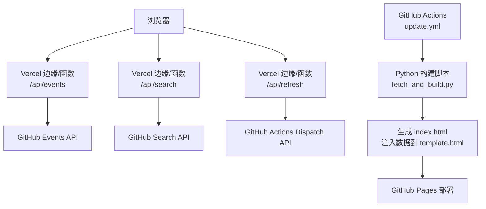
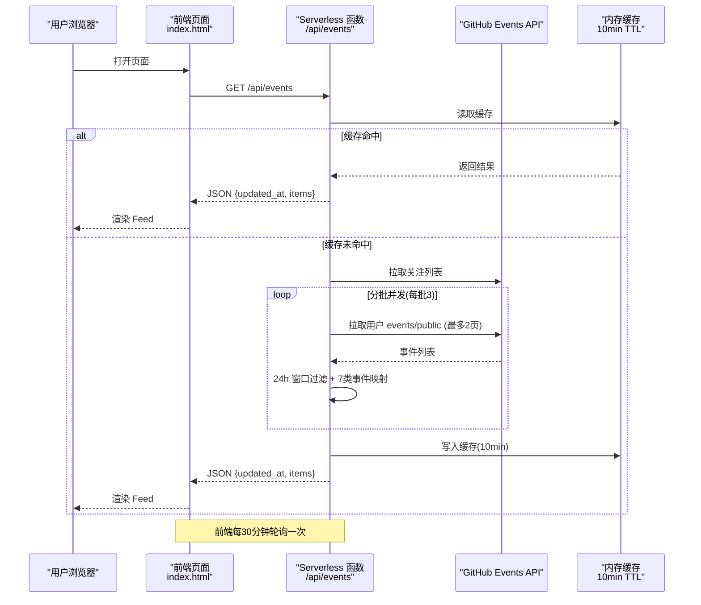
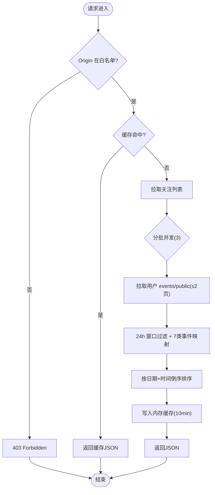
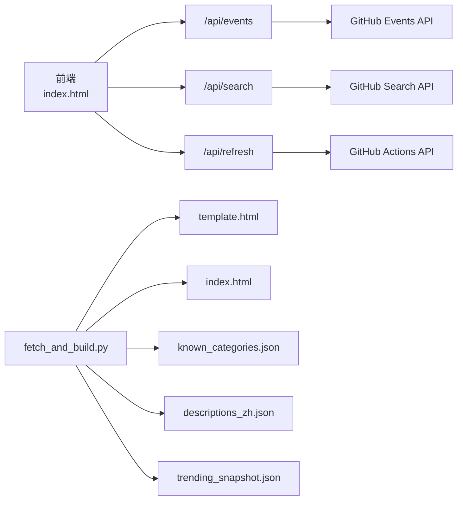

# 实时活动动态

<cite>
**本文引用的文件**
- [README.md](file://README.md)
- [index.html](file://index.html)
- [template.html](file://template.html)
- [fetch_and_build.py](file://fetch_and_build.py)
- [dev_render.py](file://dev_render.py)
- [api/events.js](file://api/events.js)
- [api/refresh.js](file://api/refresh.js)
- [api/search.js](file://api/search.js)
- [trending_snapshot.json](file://trending_snapshot.json)
- [descriptions_zh.json](file://descriptions_zh.json)
- [known_categories.json](file://known_categories.json)
- [vercel.json](file://vercel.json)
- [.github/workflows/update.yml](file://.github/workflows/update.yml)
</cite>

## 目录
1. [简介](#简介)
2. [项目结构](#项目结构)
3. [核心组件](#核心组件)
4. [架构总览](#架构总览)
5. [详细组件分析](#详细组件分析)
6. [依赖关系分析](#依赖关系分析)
7. [性能与缓存](#性能与缓存)
8. [故障排查指南](#故障排查指南)
9. [结论](#结论)
10. [附录](#附录)

## 简介
本项目是一个“GitHub Star 收藏台”，提供自动拉取、智能分类、搜索与展示，并内置“近 24 小时关注动态”的实时聚合能力。前端页面由模板生成，后端通过 Vercel Serverless Functions 暴露三个接口：
- /api/events：聚合关注账号的动态（近 24 小时滚动窗口）
- /api/search：全网仓库搜索（支持中文关键词翻译 + 多语言过滤）
- /api/refresh：触发 GitHub Actions workflow_dispatch 以重新构建站点

“实时活动动态”主要由 events 接口与前端 feed 模块协作实现，数据来源于 GitHub Events API，按用户并发拉取、时间窗口过滤、统一映射为 7 类事件，并以 10 分钟内存缓存降低上游压力。

## 项目结构
- 前端入口与模板：index.html、template.html
- 构建脚本：fetch_and_build.py（每日定时任务执行）、dev_render.py（本地开发渲染）
- 服务端函数：api/events.js、api/search.js、api/refresh.js
- 数据与配置：trending_snapshot.json、descriptions_zh.json、known_categories.json、vercel.json
- CI/CD：.github/workflows/update.yml

图表来源
- [api/events.js:1-161](file://api/events.js#L1-L161)
- [api/search.js:1-168](file://api/search.js#L1-L168)
- [api/refresh.js:1-63](file://api/refresh.js#L1-L63)
- [.github/workflows/update.yml:1-50](file://.github/workflows/update.yml#L1-L50)
- [fetch_and_build.py:570-659](file://fetch_and_build.py#L570-L659)

章节来源
- [README.md:1-22](file://README.md#L1-L22)
- [vercel.json:1-9](file://vercel.json#L1-L9)
- [.github/workflows/update.yml:1-50](file://.github/workflows/update.yml#L1-L50)

## 核心组件
- 实时动态聚合服务（events.js）
  - 功能：获取关注列表 → 并发拉取各用户 events/public（最多 2 页）→ 24 小时窗口过滤 → 映射为 7 类事件 → 排序输出
  - 防护：CORS 白名单、GET 无敏感参数、无需密钥
  - 缓存：10 分钟 TTL（实例内存），前端每 30 分钟轮询时命中则零 GitHub 开销
  - 限流：每批并发 3 个用户；单个用户失败静默跳过
- 前端 Feed 模块（index.html/template.html）
  - 打开页面即拉取 /api/events，显示“近 24 小时关注动态”
  - 每 30 分钟轮询更新，支持展开/收起、时间显示（今天/昨天）
- 构建与数据源
  - fetch_and_build.py：每日拉取 star、智能分类、生成 trending 与 feed 数据，写入 index.html
  - descriptions_zh.json、known_categories.json：描述与分类映射，保持分类稳定
  - trending_snapshot.json：用于涨星榜基线对比

章节来源
- [api/events.js:1-161](file://api/events.js#L1-L161)
- [template.html:338-607](file://template.html#L338-L607)
- [fetch_and_build.py:466-560](file://fetch_and_build.py#L466-L560)
- [fetch_and_build.py:570-659](file://fetch_and_build.py#L570-L659)

## 架构总览

图表来源
- [api/events.js:1-161](file://api/events.js#L1-L161)
- [template.html:654-676](file://template.html#L654-L676)

## 详细组件分析

### 实时动态聚合服务（/api/events）
- 输入：无查询参数（GET），仅校验 Origin 白名单
- 处理流程：
  - 获取关注用户列表（分页至 5 页）
  - 对每个用户拉取 events/public（最多 2 页），失败静默跳过
  - 将 UTC 时间转换为北京时间，计算 cutoff（当前时间 - 24h）
  - 过滤出窗口内事件，映射为 7 类：repo/star/follow/pr/release/public/push
  - 按日期+时间倒序排序，封装为 {updated_at, window: "24h", items}
  - 写入内存缓存（TTL=10 分钟）
- 错误处理：
  - 上游不可用返回 502
  - 未配置 GH_TOKEN 返回 500
  - 非白名单 Origin 返回 403
- 安全与限流：
  - CORS 白名单限制来源域名
  - 并发度 3，避免瞬时高负载
  - 单用户失败不中断整体流程

图表来源
- [api/events.js:8-17](file://api/events.js#L8-L17)
- [api/events.js:55-112](file://api/events.js#L55-L112)
- [api/events.js:114-161](file://api/events.js#L114-L161)

章节来源
- [api/events.js:1-161](file://api/events.js#L1-L161)

### 前端 Feed 模块（index.html/template.html）
- 初始化：从常量 __FEED__ 加载初始数据，设置 EVENTS_API 地址
- 交互：
  - 打开页面立即调用 /api/events，渲染“近 24 小时关注动态”
  - 每 30 分钟轮询一次，更新 feedUpdated 时间戳
  - 支持切换侧边栏“每日排行榜/关注动态”
- 展示：
  - 每条动态包含：类型标识点、actor、目标（repo/target/title）、时间（今天/昨天 + HH:mm）
  - 点击链接跳转至对应 GitHub 资源
- 容错：
  - 网络异常或接口不可用时，保留上次成功渲染内容
  - 若缓存命中，减少上游请求

章节来源
- [template.html:338-607](file://template.html#L338-L607)
- [template.html:654-676](file://template.html#L654-L676)

### 构建与数据源（fetch_and_build.py）
- 作用：每日定时任务执行，拉取 star 列表、智能分类、生成 trending 与 feed 数据，并注入 template.html 生成 index.html
- 关键逻辑：
  - 拉取关注列表与事件（与 events.js 保持一致的 24h 窗口与 7 类事件映射）
  - 生成 trending 三榜：涨星榜（优先 Trending daily，否则快照差值）、总星标榜、新秀榜
  - 持久化 known_categories.json、descriptions_zh.json、trending_snapshot.json
- 输出：index.html（含 DATA、CATS、LANG_COLORS、DEFAULT_FAVS、TRENDING、FEED、UPDATED）

章节来源
- [fetch_and_build.py:17-47](file://fetch_and_build.py#L17-L47)
- [fetch_and_build.py:152-437](file://fetch_and_build.py#L152-L437)
- [fetch_and_build.py:466-560](file://fetch_and_build.py#L466-L560)
- [fetch_and_build.py:570-659](file://fetch_and_build.py#L570-L659)

### 搜索与刷新接口（/api/search、/api/refresh）
- /api/search：
  - 中文关键词翻译（Google → MyMemory 降级），组合“中文 OR 英文”查询
  - 支持 sort（best-match/stars/updated）、lang、page（上限 34）
  - 搜索结果与翻译结果分别缓存（10 分钟/1 小时）
  - 防护：CORS 白名单 + X-Search-Key 头校验
- /api/refresh：
  - POST 触发 GitHub Actions workflow_dispatch（ref=main）
  - 防护：CORS 白名单 + X-Refresh-Key 头校验
  - 使用 GH_TOKEN 调用 GitHub Actions API

章节来源
- [api/search.js:1-168](file://api/search.js#L1-L168)
- [api/refresh.js:1-63](file://api/refresh.js#L1-L63)

## 依赖关系分析
- 外部依赖：
  - GitHub API（Events、Search、Actions Dispatch）
  - Google Translate（可选，用于搜索翻译）
  - MyMemory Translate（降级方案）
- 内部依赖：
  - 前端依赖 events.js 提供的 feed 数据
  - 构建脚本依赖 descriptions_zh.json、known_categories.json、trending_snapshot.json
  - CI/CD 依赖 update.yml 触发 fetch_and_build.py

图表来源
- [api/events.js:1-161](file://api/events.js#L1-L161)
- [api/search.js:1-168](file://api/search.js#L1-L168)
- [api/refresh.js:1-63](file://api/refresh.js#L1-L63)
- [fetch_and_build.py:570-659](file://fetch_and_build.py#L570-L659)

章节来源
- [vercel.json:1-9](file://vercel.json#L1-L9)
- [.github/workflows/update.yml:1-50](file://.github/workflows/update.yml#L1-L50)

## 性能与缓存
- 内存缓存：
  - events.js：结果缓存 10 分钟，显著降低 GitHub API 调用频率
  - search.js：搜索结果缓存 10 分钟，翻译结果缓存 1 小时
- 并发控制：
  - events.js：每批并发 3 个用户，避免瞬时高负载
- 超时与重试：
  - GitHub API 请求设置超时（12s/15s/8s）
  - 搜索接口在 422 时清洗查询词后重试一次
- 前端轮询：
  - 每 30 分钟轮询一次 events，平衡实时性与资源消耗

章节来源
- [api/events.js:14-16](file://api/events.js#L14-L16)
- [api/search.js:12-20](file://api/search.js#L12-L20)
- [api/search.js:127-162](file://api/search.js#L127-L162)

## 故障排查指南
- 常见问题：
  - GH_TOKEN 未配置：events/search/refresh 均会返回 500，需在 Vercel 环境变量中配置
  - 上游服务不可用：返回 502，检查 GitHub API 状态或网络连通性
  - 搜索太频繁：返回 503，稍后再试或降低请求频率
  - 查询语法错误：search 接口在 422 时自动清洗并重试
- 调试建议：
  - 查看 Vercel 日志定位具体错误
  - 检查 CORS 白名单是否包含当前域名
  - 确认 REFRESH_KEY/X-Search-Key 是否与服务器端一致

章节来源
- [api/events.js:126-159](file://api/events.js#L126-L159)
- [api/search.js:100-166](file://api/search.js#L100-L166)
- [api/refresh.js:26-61](file://api/refresh.js#L26-L61)

## 结论
“实时活动动态”通过 events 接口与前端 Feed 模块协同，实现了近 24 小时关注账号的动态聚合与展示。系统采用内存缓存、并发控制、超时重试等机制，在保证实时性的同时有效控制上游压力。配合构建脚本与 CI/CD，项目实现了自动化更新与部署，形成完整的“采集-处理-展示”闭环。

## 附录
- 环境变量：
  - GH_TOKEN：GitHub API 访问令牌
  - REFRESH_KEY：刷新与搜索接口的弱防护密钥
- 部署说明：
  - 前端托管于 GitHub Pages
  - 服务端函数部署于 Vercel
  - 定时任务通过 GitHub Actions 每日执行

章节来源
- [README.md:1-22](file://README.md#L1-L22)
- [vercel.json:1-9](file://vercel.json#L1-L9)
- [.github/workflows/update.yml:1-50](file://.github/workflows/update.yml#L1-L50)