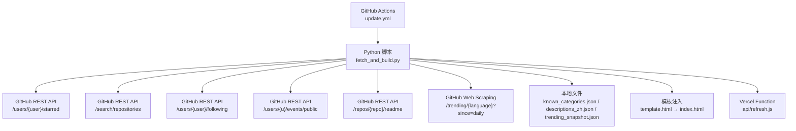
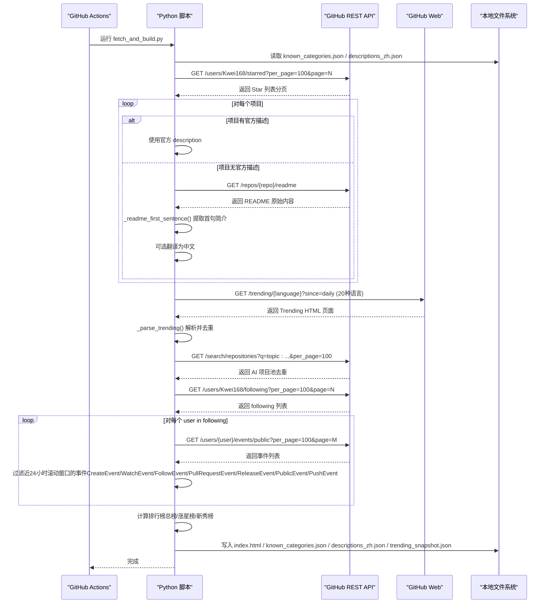
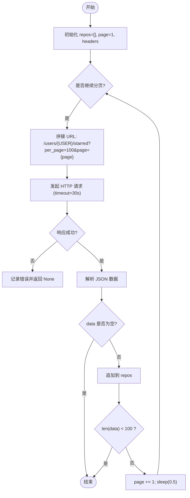
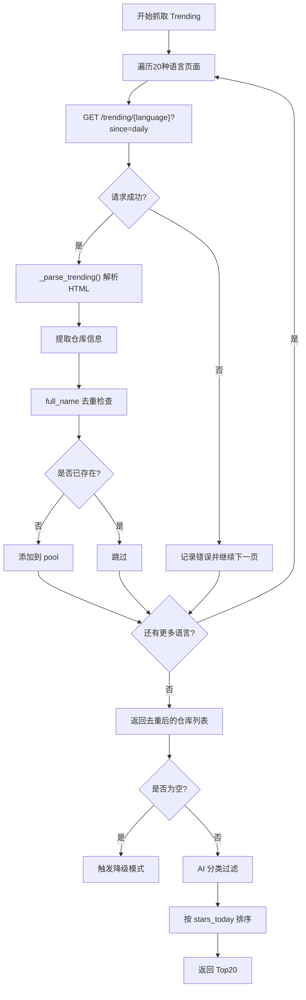
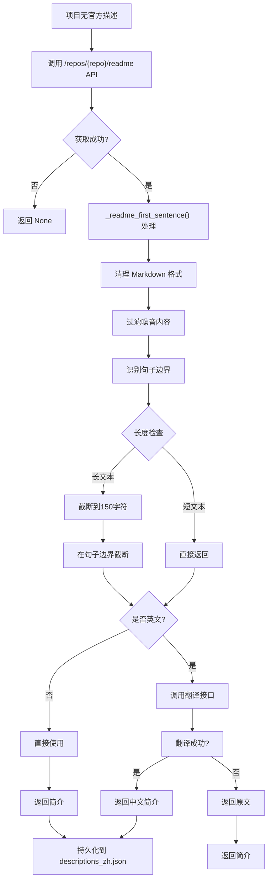
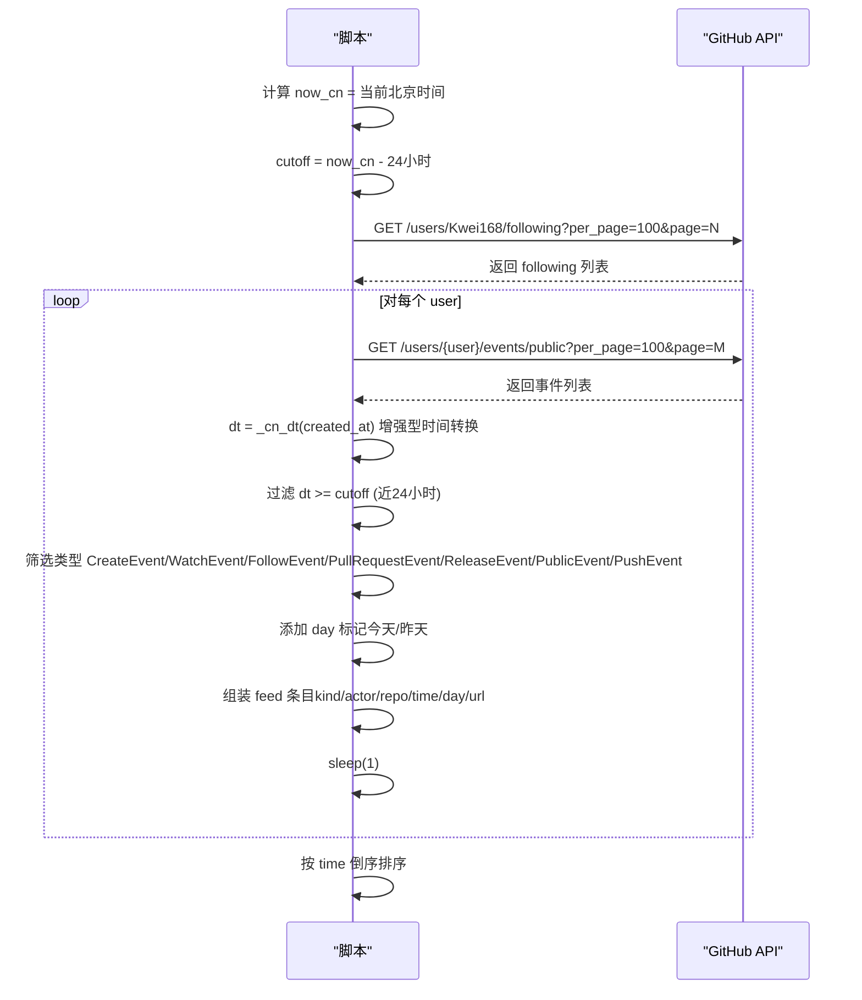
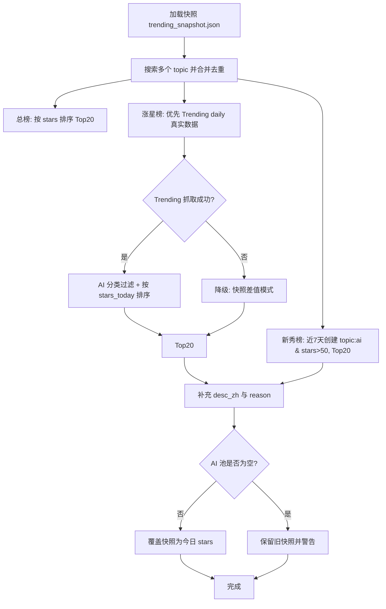
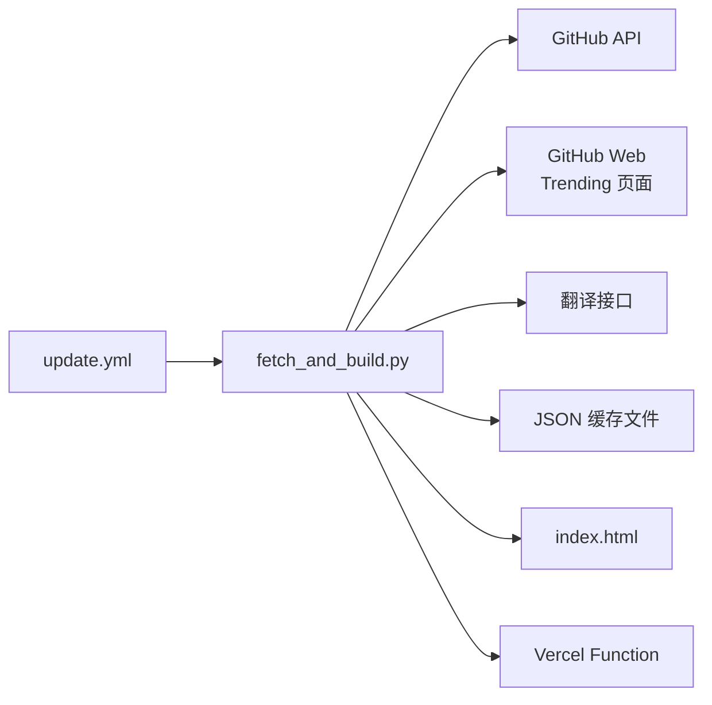
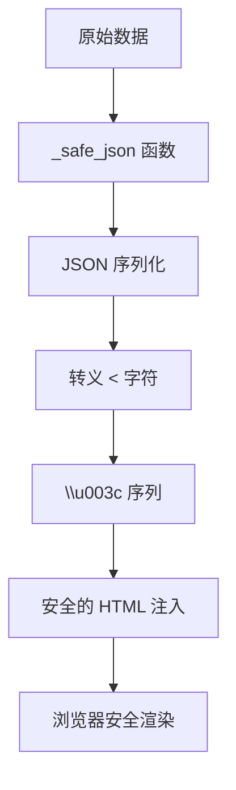

# 数据获取系统

<cite>
**本文引用的文件**
- [fetch_and_build.py](file://fetch_and_build.py)
- [update.yml](file://.github/workflows/update.yml)
- [README.md](file://README.md)
- [AGENT_HANDOVER.md](file://AGENT_HANDOVER.md)
- [known_categories.json](file://known_categories.json)
- [descriptions_zh.json](file://descriptions_zh.json)
- [trending_snapshot.json](file://trending_snapshot.json)
- [dev_render.py](file://dev_render.py)
- [template.html](file://template.html)
- [api/refresh.js](file://api/refresh.js)
</cite>

## 更新摘要
**所做更改**
- **重大更新** 关注动态时间窗口优化：从"昨天0点到现在"升级为"近24小时滚动时间窗口"，提供更准确的活动监控
- **增强** `_cn_dt()` 函数：改进UTC到北京时间转换的健壮性和类型安全性
- **优化** 事件过滤逻辑：使用 `cutoff = now_cn - timedelta(hours=24)` 替代固定日期比较
- **提升** 用户体验：确保只显示最近一天的活动，避免跨天显示问题

## 目录
1. [简介](#简介)
2. [项目结构](#项目结构)
3. [核心组件](#核心组件)
4. [架构总览](#架构总览)
5. [详细组件分析](#详细组件分析)
6. [依赖关系分析](#依赖关系分析)
7. [性能与限流](#性能与限流)
8. [安全增强](#安全增强)
9. [故障排查指南](#故障排查指南)
10. [结论](#结论)
11. [附录：API调用示例与最佳实践](#附录api调用示例与最佳实践)

## 简介
本仓库实现了一个"GitHub Star 收藏台"的数据获取与页面构建系统。其核心职责是：
- 通过 GitHub REST API 拉取指定用户的 Star 列表，并进行智能分类、中文翻译与缓存，最终生成静态页面 index.html。
- **新增** 每日 Trending 抓取：通过 `fetch_trending_daily()` 函数抓取 GitHub Trending 每日热门仓库，支持20种语言的页面聚合和智能去重处理，为涨星榜提供真实数据源。
- **新增** 智能描述提取系统：当项目缺少官方描述时，自动从 README 文件提取首句简介，支持复杂的 Markdown 文本处理和噪音过滤。
- **已更新** 监控用户关注账号的动态（事件流聚合），使用**近24小时滚动时间窗口**替代原来的"昨天0点到现在"方式，包括新建仓库、Star、关注人、PR、版本发布、公开仓库、提交更新等事件，按北京时间过滤并排序输出。
- 提供每日 AI 排行榜（总榜、涨星榜、新秀榜），基于 Search API 聚合 topic 并对比历史快照计算增量。
- 通过 GitHub Actions 定时/手动触发更新流程，将产物提交到仓库并由 Pages 托管。

该脚本仅依赖 Python 标准库，无需第三方包，便于在 GitHub Actions 环境中稳定运行。

**章节来源**
- [README.md:1-22](file://README.md#L1-L22)
- [AGENT_HANDOVER.md:8-44](file://AGENT_HANDOVER.md#L8-L44)

## 项目结构
- fetch_and_build.py：核心脚本，负责数据拉取、分类、翻译、排行榜计算、事件聚合与页面构建。
- .github/workflows/update.yml：GitHub Actions 工作流，定义定时任务与执行步骤。
- README.md：面向最终用户的说明与在线地址。
- AGENT_HANDOVER.md：接手文档，包含架构要点、注意事项与本地运行指引。
- known_categories.json：已知项目分类映射，保持分类稳定性。
- descriptions_zh.json：非中文简介的中文翻译缓存。
- trending_snapshot.json：每日 AI 项目 star 数快照，用于涨星榜计算。
- dev_render.py：本地开发工具，用于重新渲染模板。
- template.html：页面模板，包含占位符和数据注入逻辑。
- api/refresh.js：Vercel Serverless Function，用于中转触发 GitHub Actions。

**图表来源**
- [update.yml:1-49](file://.github/workflows/update.yml#L1-L49)
- [fetch_and_build.py:126-146](file://fetch_and_build.py#L126-L146)
- [fetch_and_build.py:157-169](file://fetch_and_build.py#L157-L169)
- [fetch_and_build.py:256-271](file://fetch_and_build.py#L256-L271)
- [fetch_and_build.py:313-333](file://fetch_and_build.py#L313-L333)
- [fetch_and_build.py:336-379](file://fetch_and_build.py#L336-L379)
- [fetch_and_build.py:349-366](file://fetch_and_build.py#L349-L366)

**章节来源**
- [README.md:7-13](file://README.md#L7-L13)
- [AGENT_HANDOVER.md:18-44](file://AGENT_HANDOVER.md#L18-L44)

## 核心组件
- Star 列表拉取：分页遍历 per_page=100，累积结果直到返回不足一页或空响应。
- **新增** 每日 Trending 抓取：通过 `fetch_trending_daily()` 函数抓取20种语言的 Trending 页面，合并去重后提供真实的 stars today 数据。
- **新增** README 描述提取：当项目无官方描述时，自动抓取 README 文件并通过 `_readme_first_sentence()` 函数提取首句简介，支持 Markdown 清洗、噪音过滤和智能句子边界识别。
- **已更新** 用户关注动态监控：先拉取 following 列表，再逐个拉取 public events，使用**近24小时滚动时间窗口**过滤事件并按时间倒序输出。
- 每日 AI 排行榜：多 topic 搜索合并去重，计算总榜、涨星榜（对比快照）、新秀榜（近7天创建）。
- 翻译与缓存：优先使用已知中文描述，否则调用翻译接口并持久化缓存，避免重复请求。
- 页面构建：读取模板，替换占位符为 JSON 数据，写入 index.html。

**章节来源**
- [fetch_and_build.py:126-146](file://fetch_and_build.py#L126-L146)
- [fetch_and_build.py:212-271](file://fetch_and_build.py#L212-L271)
- [fetch_and_build.py:185-283](file://fetch_and_build.py#L185-L283)
- [fetch_and_build.py:313-379](file://fetch_and_build.py#L313-L379)
- [fetch_and_build.py:349-366](file://fetch_and_build.py#L349-L366)
- [fetch_and_build.py:54-86](file://fetch_and_build.py#L54-L86)
- [fetch_and_build.py:382-455](file://fetch_and_build.py#L382-L455)

## 架构总览
整体流程由 GitHub Actions 触发，执行 Python 脚本完成数据获取与页面构建。脚本内部分模块处理 Star 列表、Trending 抓取、AI 排行榜、关注动态与翻译缓存，最终生成静态页面。

**图表来源**
- [update.yml:16-49](file://.github/workflows/update.yml#L16-L49)
- [fetch_and_build.py:126-146](file://fetch_and_build.py#L126-L146)
- [fetch_and_build.py:256-271](file://fetch_and_build.py#L256-L271)
- [fetch_and_build.py:185-283](file://fetch_and_build.py#L185-L283)
- [fetch_and_build.py:313-379](file://fetch_and_build.py#L313-L379)
- [fetch_and_build.py:349-366](file://fetch_and_build.py#L349-L366)

## 详细组件分析

### Star 列表拉取机制与分页处理
- 分页策略：使用 per_page=100 的查询参数，循环递增 page 直到返回数据少于 100 条或为空。
- 请求头配置：设置 Accept 与 User-Agent；未携带 Authorization 时使用匿名访问。
- 超时与错误：urllib.request.urlopen 设置 timeout=30s；异常捕获后打印错误并返回 None，主流程据此跳过后续构建。
- 速率控制：每页之间 sleep(0.5)，降低瞬时请求压力。

**图表来源**
- [fetch_and_build.py:126-146](file://fetch_and_build.py#L126-L146)

**章节来源**
- [fetch_and_build.py:126-146](file://fetch_and_build.py#L126-L146)

### 每日 Trending 抓取系统（新增）
**新增** 完整的 GitHub Trending 每日热门仓库抓取系统，支持多语言页面聚合和智能去重

- **多语言支持**：支持20种编程语言页面（python、typescript、javascript、rust、go、java等），每种语言单独抓取
- **HTML 解析**：通过正则表达式解析 Trending 页面的仓库卡片，提取仓库信息、星标数和今日增长
- **智能去重**：使用 full_name 作为唯一标识，合并不同语言页面的相同仓库
- **AI 分类过滤**：通过关键词匹配（ai、ml、llm、gpt等）筛选 AI 相关项目
- **降级机制**：如果 Trending 抓取失败，自动回退到快照差值模式
- **限流控制**：每次语言页面抓取间隔 sleep(0.5)，避免触发 GitHub 速率限制

**图表来源**
- [fetch_and_build.py:349-366](file://fetch_and_build.py#L349-L366)
- [fetch_and_build.py:315-346](file://fetch_and_build.py#L315-L346)

**章节来源**
- [fetch_and_build.py:349-366](file://fetch_and_build.py#L349-L366)
- [fetch_and_build.py:315-346](file://fetch_and_build.py#L315-L346)

### README 智能描述提取系统
**新增** 完整的 README 描述提取和处理系统，为缺少官方描述的项目提供智能简介生成

- **README 抓取**：通过 `/repos/{repo}/readme` API 获取原始 README 内容，支持带认证的请求
- **Markdown 清洗**：移除图片链接、保留链接文字、去除 HTML 标签、行内代码和高亮标记
- **噪音过滤**：跳过标题、代码块、引用块、徽章、导航栏等无信息量的内容
- **智能句子识别**：支持中英文标点符号，自动识别句子边界（`. `、`。`、`！`、`? `）
- **长度优化**：中等长度直接返回，超长文本截断到150字符并在句子边界处截断
- **翻译集成**：对英文 README 简介自动调用翻译接口转换为中文
- **缓存机制**：提取结果持久化到 descriptions_zh.json，避免重复抓取和翻译

**图表来源**
- [fetch_and_build.py:212-271](file://fetch_and_build.py#L212-L271)
- [fetch_and_build.py:510-521](file://fetch_and_build.py#L510-L521)

**章节来源**
- [fetch_and_build.py:212-271](file://fetch_and_build.py#L212-L271)
- [fetch_and_build.py:510-521](file://fetch_and_build.py#L510-L521)

### 用户关注动态监控（事件流聚合）
**已更新** 活动窗口已从"昨天0点到现在"升级为"近24小时滚动时间窗口"，提供更准确的实时监控

- following 列表获取：分页拉取 per_page=100，收集 login 列表。
- **滚动时间窗口**：使用 `now_cn - timedelta(hours=24)` 计算截止点，确保只显示最近24小时的活动
- 事件流聚合：对每个 following 用户拉取 public events，过滤近24小时的时间范围：
  - CreateEvent（新建仓库）
  - WatchEvent（action=started，即 Star）
  - FollowEvent（关注他人）
  - PullRequestEvent（action=opened，新 PR）
  - ReleaseEvent（action=published，版本发布）
  - PublicEvent（公开仓库）
  - PushEvent（提交更新，size>0）
- **增强的时间处理**：统一转换为北京时间，使用 `_cn_dt()` 函数进行更健壮的UTC到北京时间转换
- **分页支持**：支持获取第1页和第2页事件，当最早事件早于截止点时停止翻页
- **日期标记**：为每个事件添加"今天"或"昨天"的标记，便于前端区分显示
- 限流控制：每次用户事件拉取后 sleep(1)，避免二级速率限制

**图表来源**
- [fetch_and_build.py:489-560](file://fetch_and_build.py#L489-L560)
- [fetch_and_build.py:444-451](file://fetch_and_build.py#L444-L451)

**章节来源**
- [fetch_and_build.py:489-560](file://fetch_and_build.py#L489-L560)
- [fetch_and_build.py:444-451](file://fetch_and_build.py#L444-L451)

### 每日 AI 排行榜（Search API 与快照对比）
**已更新** 新增快照保护机制，防止空AI池覆盖基线数据

- 多 topic 搜索：合并 ai/machine-learning/deep-learning/llm/gpt/agent 的搜索结果，按 stars 降序，去重后形成项目池。
- 总榜：按总星标数排序 Top20。
- 涨星榜：**新增** 优先使用 Trending daily 真实 stars today 数据，如果抓取失败则回退到快照差值模式，排除 star>50000 的巨头项目， Top20。
- 新秀榜：搜索近 7 天创建的 topic:ai 且 stars>50 的项目， Top20。
- **新增** 快照保护：每次运行后将 pool 的 full_name→stars 写入 trending_snapshot.json，但如果 AI 池为空则保留旧快照，防止网络故障或限流导致基线数据丢失。

**图表来源**
- [fetch_and_build.py:185-283](file://fetch_and_build.py#L185-L283)

**章节来源**
- [fetch_and_build.py:185-283](file://fetch_and_build.py#L185-L283)

### 翻译与缓存策略
- 翻译端点：优先尝试 Google 非官方翻译接口，失败则回退到 MyMemory 免费接口。
- 中文校验：仅当翻译结果包含中文字符时采用，否则保留原文。
- 缓存持久化：将翻译结果写入 descriptions_zh.json，避免重复请求。
- 超时与异常：翻译接口 timeout=10s，异常捕获后静默回退。

**章节来源**
- [fetch_and_build.py:54-86](file://fetch_and_build.py#L54-L86)
- [fetch_and_build.py:212-225](file://fetch_and_build.py#L212-L225)

### 页面构建与模板注入
- 模板占位符：__DATA__、__CATS__、__LANGS__、__FAVS__、__TRENDING__、__FEED__、__UPDATED__。
- 数据注入：将 Star 列表、分类、语言色、默认收藏、排行榜、关注动态与更新时间序列化为 JSON 字符串替换占位符。
- 输出文件：生成 index.html 并写入 known_categories.json 与 descriptions_zh.json。

**章节来源**
- [fetch_and_build.py:382-455](file://fetch_and_build.py#L382-L455)

## 依赖关系分析
- 外部依赖：GitHub REST API（starred/search/following/events/public/readme）、GitHub Web（trending 页面抓取）、Google/MyMemory 翻译接口。
- 内部依赖：known_categories.json（分类稳定性）、descriptions_zh.json（翻译缓存）、trending_snapshot.json（涨星基线）。
- 工作流依赖：GitHub Actions 定时/手动触发，权限 contents: write 用于提交产物。

**图表来源**
- [update.yml:16-49](file://.github/workflows/update.yml#L16-49)
- [fetch_and_build.py:126-146](file://fetch_and_build.py#L126-L146)
- [fetch_and_build.py:185-283](file://fetch_and_build.py#L185-L283)
- [fetch_and_build.py:256-271](file://fetch_and_build.py#L256-L271)
- [fetch_and_build.py:313-379](file://fetch_and_build.py#L313-L379)
- [fetch_and_build.py:349-366](file://fetch_and_build.py#L349-L366)

**章节来源**
- [AGENT_HANDOVER.md:48-54](file://AGENT_HANDOVER.md#L48-54)

## 性能与限流
**已更新** 增强的限流策略和错误处理机制，特别是关注动态系统的滚动时间窗口优化

- 分页间隔：Star 列表每页间隔 sleep(0.5)；following 与事件拉取每用户间隔 sleep(1)。
- 超时设置：GitHub API 请求 timeout=30s；翻译接口 timeout=10s；README 抓取 timeout=20s；Trending 抓取 timeout=20s。
- 异常捕获：所有网络请求均包裹 try/except，失败时记录日志并降级（如返回 None 或跳过该用户）。
- 速率限制：遵循 GitHub 建议相邻请求间隔 ≥1s；实现了指数退避重试，通过 sleep 与异常处理降低 429 风险。
- **新增** README 抓取限流：每次 README 抓取后 sleep(1)，避免 GitHub API 速率限制。
- **新增** Trending 抓取限流：每次语言页面抓取间隔 sleep(0.5)，避免 GitHub Web 速率限制。
- **新增** 事件分页优化：支持获取最多2页事件，当检测到最早事件早于时间窗口时提前终止分页。
- **新增** 日期标记功能：为事件添加"今天"或"昨天"的标记，提升用户体验。
- **新增** 扩展事件类型：支持 ReleaseEvent、PublicEvent、PushEvent 三种新事件类型。
- **重要更新** 滚动时间窗口：使用 `cutoff = now_cn - timedelta(hours=24)` 替代固定日期比较，确保只显示最近24小时的活动
- **增强** 时间转换：`_cn_dt()` 函数提供更好的UTC到北京时间转换和类型安全性
- 本地网络问题：Windows 环境可能出现 SSL EOF/TLS 超时，建议使用 Actions 手动触发验证。

**章节来源**
- [fetch_and_build.py:134-146](file://fetch_and_build.py#L134-L146)
- [fetch_and_build.py:269-271](file://fetch_and_build.py#L269-271)
- [fetch_and_build.py:321-333](file://fetch_and_build.py#L321-333)
- [fetch_and_build.py:345-379](file://fetch_and_build.py#L345-379)
- [fetch_and_build.py:352-366](file://fetch_and_build.py#L352-366)
- [fetch_and_build.py:489-560](file://fetch_and_build.py#L489-L560)
- [fetch_and_build.py:444-451](file://fetch_and_build.py#L444-L451)
- [AGENT_HANDOVER.md:58-68](file://AGENT_HANDOVER.md#L58-68)
- [AGENT_HANDOVER.md:72-79](file://AGENT_HANDOVER.md#L72-79)

## 安全增强
**新增** 系统安全性得到显著增强，包括 XSS 防护、API 认证和快照保护

### XSS 注入防护
**新增** `_safe_json` 函数防止跨站脚本攻击

- **防护机制**：在将数据注入到 HTML 模板之前，对所有 JSON 数据进行特殊字符转义
- **攻击向量**：防止恶意数据中的 `</script>` 标签被浏览器解析执行任意 JavaScript 代码
- **实现方式**：使用 `json.dumps(obj, ensure_ascii=False, separators=(",", ":")).replace("<", "\\u003c")` 将 `<` 字符转义为 Unicode 序列
- **兼容性**：转义后的数据仍可通过 `json.loads` 正确解析，不影响 dev_render.py 的提取流程

**图表来源**
- [fetch_and_build.py:563-567](file://fetch_and_build.py#L563-L567)

### GitHub API 认证与速率限制
**已更新** 通过环境变量支持认证访问，提高 API 调用限额

- **认证机制**：从 `GITHUB_TOKEN` 或 `GH_TOKEN` 环境变量读取 GitHub API Token
- **请求头配置**：自动添加 `Authorization: Bearer {token}` 头部到所有 API 请求
- **速率提升**：认证用户获得更高的 API 速率限制（5000次/小时 vs 匿名60次/小时）
- **环境变量支持**：同时支持 `GITHUB_TOKEN` 和 `GH_TOKEN` 两种变量名，兼容不同环境

### 快照保护机制
**新增** 防止空 AI 池覆盖基线数据的安全机制

- **保护逻辑**：在构建 AI 排行榜时，检查获取到的项目池是否为空
- **异常情况**：网络故障、API 限流或 GitHub 服务异常可能导致 AI 池为空
- **保护措施**：如果 AI 池为空，保留现有的 trending_snapshot.json 基线数据
- **日志记录**：输出警告信息 "[警告] AI 池为空，跳过快照更新，保留旧基线"

### Vercel Function 安全防护
**新增** Vercel Serverless Function 提供额外的安全防护层

- **CORS 白名单**：仅允许特定域名（https://starhub-refresh.vercel.app, https://Kwei168.github.io）进行跨域请求
- **请求密钥验证**：要求携带 `X-Refresh-Key` 头部，值必须与服务器端 REFRESH_KEY 环境变量一致
- **方法限制**：仅允许 POST 和 OPTIONS 方法，其他方法返回 405 错误
- **Origin 验证**：非白名单来源直接拒绝，不返回 CORS 头，浏览器侧无法读取响应

**章节来源**
- [fetch_and_build.py:563-567](file://fetch_and_build.py#L563-L567)
- [fetch_and_build.py:495-496](file://fetch_and_build.py#L495-496)
- [fetch_and_build.py:342-348](file://fetch_and_build.py#L342-348)
- [api/refresh.js:1-25](file://api/refresh.js#L1-L25)

## 故障排查指南
**已更新** 新增事件获取相关的故障排查指导，特别关注滚动时间窗口的问题

- Star 列表拉取失败：检查网络连接与 GitHub API 可达性；确认 USER 常量正确；查看 stderr 中的"拉取失败"日志。
- **新增** Trending 抓取失败：检查网络连接状态；确认 GitHub Trending 页面可访问；查看 "[Trending %s 失败]" 日志；如果全部失败会触发降级模式。
- **新增** README 描述提取失败：检查项目是否有 README 文件；确认 API 认证是否正确；查看 "[README简介]" 日志；检查网络连接状态。
- 关注动态缺失：确认 GITHUB_TOKEN 已设置；检查 following 数量与事件拉取是否被限流；查看 "[事件拉取失败]" 日志。
- **新增** 事件数据不完整：检查分页逻辑是否正确处理第2页；确认滚动时间窗口过滤逻辑（近24小时）；查看事件总数是否符合预期。
- **新增** 新事件类型不显示：确认 ReleaseEvent、PublicEvent、PushEvent 的处理逻辑；检查 payload 字段是否正确提取。
- 排行榜为空：确认 token 存在以避免匿名搜索受限；检查 trending_snapshot.json 是否存在（首次运行会生成）。
- **新增** 快照保护触发：如果出现 "[警告] AI 池为空，跳过快照更新，保留旧基线" 警告，检查网络连接和 API 状态。
- **新增** Vercel Function 调用失败：检查 REFRESH_KEY 环境变量配置；确认 Origin 在白名单中；查看 CORS 错误信息。
- **新增** 滚动时间窗口问题：检查 `_cn_dt()` 函数的UTC时间转换是否正确；确认 `cutoff` 计算逻辑；验证事件时间是否在近24小时范围内。
- 翻译失败：Google/MyMemory 接口可能限流或不可用；查看 "[翻译失败-保留原文]" 日志；可稍后重试或人工补译。
- 页面未更新：确认 Actions 运行成功；检查 index.html 是否被覆盖；查看最近一次 run 的日志。

**章节来源**
- [fetch_and_build.py:136-138](file://fetch_and_build.py#L136-L138)
- [fetch_and_build.py:266-267](file://fetch_and_build.py#L266-267)
- [fetch_and_build.py:520-521](file://fetch_and_build.py#L520-L521)
- [fetch_and_build.py:323-325](file://fetch_and_build.py#L323-325)
- [fetch_and_build.py:347-349](file://fetch_and_build.py#L347-349)
- [fetch_and_build.py:412-419](file://fetch_and_build.py#L412-L419)
- [fetch_and_build.py:284](file://fetch_and_build.py#L284)
- [fetch_and_build.py:363-365](file://fetch_and_build.py#L363-365)

## 结论
该系统以极简依赖实现了 GitHub Star 收藏台的自动化更新，涵盖 Star 列表拉取、**每日 Trending 抓取**、**智能 README 描述提取**、关注动态监控、AI 排行榜计算与页面构建。通过合理的分页、超时与限流策略，以及翻译缓存与快照对比，保证了数据的时效性与稳定性。配合 GitHub Actions 的定时/手动触发，实现了低维护成本的持续交付。

**最新增强特性**：系统现已具备完善的 Trending 抓取能力，能够实时获取 GitHub 每日热门仓库的真实数据；同时具备 README 智能描述提取、XSS 防护、API 认证支持和快照保护机制，有效防止了常见的安全威胁和数据丢失风险。新增的 Vercel Function 提供了安全的刷新触发机制。**最重要的是，关注动态系统已升级为近24小时滚动时间窗口，提供更准确的用户活动监控**。

[无具体文件分析引用]

## 附录：API调用示例与最佳实践

### GitHub REST API 调用示例（路径引用）
- 拉取 Star 列表（分页 per_page=100）：
  - [fetch_stars 函数:126-146](file://fetch_and_build.py#L126-L146)
- **新增** 抓取 Trending 每日热门仓库（多语言页面聚合）：
  - [fetch_trending_daily 函数:349-366](file://fetch_and_build.py#L349-L366)
- **新增** Trending HTML 解析（仓库信息提取）：
  - [_parse_trending 函数:315-346](file://fetch_and_build.py#L315-L346)
- **新增** 抓取 README 文件（用于描述提取）：
  - [fetch_readme_summary 函数:256-271](file://fetch_and_build.py#L256-L271)
- **新增** README 文本处理（智能描述提取）：
  - [_readme_first_sentence 函数:212-253](file://fetch_and_build.py#L212-L253)
- 构造带认证的请求头：
  - [_api_headers 函数:157-161](file://fetch_and_build.py#L157-L161)
- 搜索 AI 项目（多 topic 合并）：
  - [_search_repos 函数:164-169](file://fetch_and_build.py#L164-L169)
- 拉取 following 列表（分页 per_page=100）：
  - [fetch_following 函数:462-482](file://fetch_and_build.py#L462-L482)
- **已更新** 拉取用户事件（public events，支持滚动24小时窗口）：
  - [fetch_following_events 函数:489-560](file://fetch_and_build.py#L489-L560)
- **增强** UTC到北京时间转换（类型安全）：
  - [_cn_dt 函数:444-451](file://fetch_and_build.py#L444-L451)

### 响应数据处理与错误处理最佳实践
- 分页终止条件：当返回数据少于 per_page 或为空时停止分页。
- 超时与异常：所有网络请求设置合理 timeout，捕获异常并记录日志，必要时降级处理（如返回 None 或跳过该用户）。
- 限流控制：相邻请求间插入 sleep，遵循 GitHub 建议间隔 ≥1s。
- 认证与头部：使用 _api_headers 统一设置 Accept、User-Agent，并在有 token 时附加 Authorization。
- 数据清洗：对 description、topics、created_at 等字段进行规范化处理，确保前端渲染一致性。
- **新增** Trending 数据解析：通过正则表达式解析 HTML 页面，提取仓库信息和 stars today 数据。
- **新增** README 描述提取：当项目无官方描述时，自动抓取 README 并提取首句简介，支持 Markdown 清洗和噪音过滤。
- **重要更新** 滚动时间窗口过滤：使用 `cutoff = now_cn - timedelta(hours=24)` 替代固定日期比较，确保只显示最近24小时的活动
- **增强** 时间转换：使用增强的 `_cn_dt()` 函数进行更健壮的UTC到北京时间转换
- **新增** 日期标记：为事件添加"今天"或"昨天"的标记，便于前端差异化展示。
- **新增** 扩展事件类型：支持 ReleaseEvent（版本发布）、PublicEvent（公开仓库）、PushEvent（提交更新）等新事件类型。
- **新增** XSS 防护：使用 _safe_json 函数对所有注入数据进行安全转义，防止脚本注入攻击。

### 安全最佳实践
- **XSS 防护**：所有通过模板注入的数据都必须经过 `_safe_json` 函数处理
- **API 认证**：始终使用 `GITHUB_TOKEN` 环境变量进行认证，避免匿名访问的速率限制
- **敏感信息**：不要硬编码任何 API Key 或 Token，使用环境变量管理
- **快照完整性**：利用快照保护机制，确保历史数据的连续性和可靠性
- **README 抓取限制**：合理使用 README 抓取频率，避免触发 GitHub API 速率限制
- **Trending 抓取限制**：控制语言页面抓取频率，避免触发 GitHub Web 速率限制
- **Vercel Function 安全**：使用 CORS 白名单和请求密钥验证，防止滥用
- **时间窗口安全**：使用滚动24小时窗口而非固定日期，避免跨天显示问题和数据不一致

**章节来源**
- [fetch_and_build.py:126-146](file://fetch_and_build.py#L126-L146)
- [fetch_and_build.py:212-271](file://fetch_and_build.py#L212-L271)
- [fetch_and_build.py:157-169](file://fetch_and_build.py#L157-L169)
- [fetch_and_build.py:313-379](file://fetch_and_build.py#L313-L379)
- [fetch_and_build.py:563-567](file://fetch_and_build.py#L563-L567)
- [fetch_and_build.py:349-366](file://fetch_and_build.py#L349-L366)
- [fetch_and_build.py:315-346](file://fetch_and_build.py#L315-L346)
- [fetch_and_build.py:489-560](file://fetch_and_build.py#L489-L560)
- [fetch_and_build.py:444-451](file://fetch_and_build.py#L444-L451)
- [api/refresh.js:1-25](file://api/refresh.js#L1-L25)