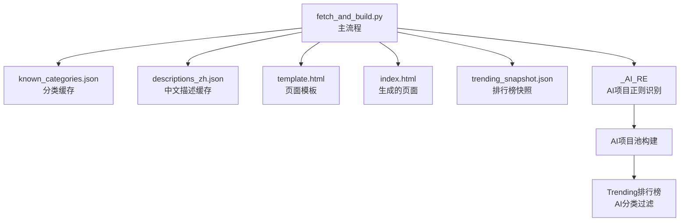
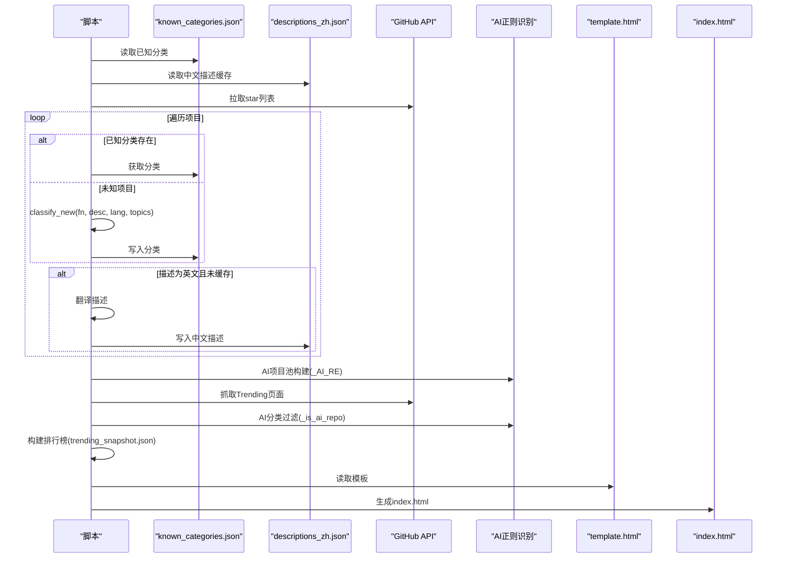
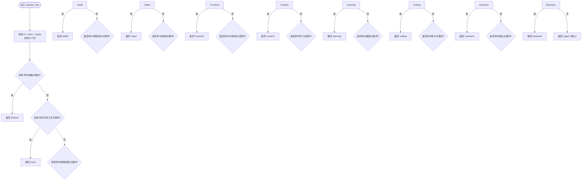
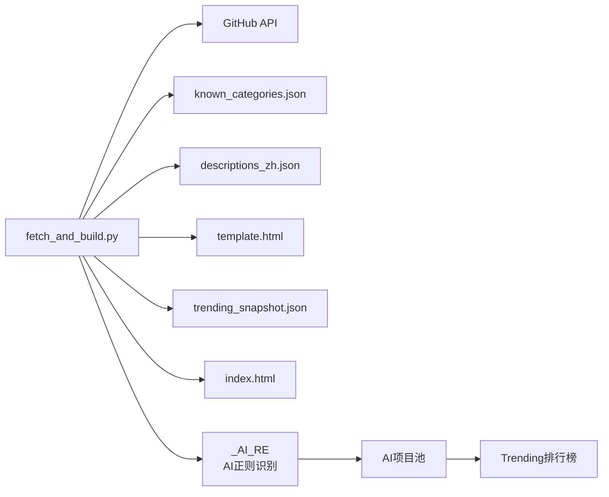

# 智能分类引擎

<cite>
**本文引用的文件**
- [fetch_and_build.py](file://fetch_and_build.py)
- [known_categories.json](file://known_categories.json)
- [descriptions_zh.json](file://descriptions_zh.json)
- [README.md](file://README.md)
- [template.html](file://template.html)
</cite>

## 更新摘要
**所做更改**
- **增强了分类算法的防误判机制**：优化了关键词匹配优先级，防止常见词汇（如'distill'、'思维'、'chat'、'deep'、'react'、'ffmpeg'）导致的级联误分类
- **重构了分类优先级顺序**：将"思维蒸馏 & 认知"类别提前到工具类之后，避免视频创作项目被错误分类
- **修复了13个误分类项目**：包括TapCanvas/HackerMind/FDE/infinite-canvas/canvas家族项目的正确分类
- **完善了AI项目正则识别系统**：增强了词边界匹配，提高AI项目识别准确性

## 目录
1. [简介](#简介)
2. [项目结构](#项目结构)
3. [核心组件](#核心组件)
4. [架构总览](#架构总览)
5. [详细组件分析](#详细组件分析)
6. [依赖关系分析](#依赖关系分析)
7. [性能考量](#性能考量)
8. [故障排查指南](#故障排查指南)
9. [结论](#结论)
10. [附录：扩展新分类与规则配置示例](#附录：扩展新分类与规则配置示例)

## 简介
本仓库实现了一个"GitHub Star 收藏台"的自动更新与智能分类系统。每日定时拉取用户已 star 的项目，结合关键词规则与缓存机制进行稳定分类，并生成前端页面用于展示、筛选与搜索。核心目标是：
- 维护 11 个预定义分类体系，覆盖 AI Agent & Skills、思维蒸馏 & 认知、AI 视频创作、AI 编程 & 工具链、内容创作 & 排版、AI 学习 & 教程、AI 助手 & 应用、实用工具 & 资源、金融 & 交易、商业 · 一人公司与知产、前端 & 设计系统。
- 通过多关键词优先级匹配与文本预处理（统一小写）提升分类准确性与稳定性。
- **增强版**防误判机制：针对常见词汇如'distill'、'思维'、'chat'、'deep'、'react'、'ffmpeg'等添加了保护性匹配规则，避免泛词子串误伤。
- 使用 known_categories.json 作为已知项目的分类缓存，确保分类结果长期一致。
- 提供 classify_new() 函数对未知新项目执行规则匹配，并在无命中时回退到默认分类。

## 项目结构
- fetch_and_build.py：主脚本，负责拉取 star 列表、智能分类、翻译简介、构建排行榜、生成 index.html，并持久化分类与中文描述缓存。
- known_categories.json：已知项目的分类映射，保证分类稳定性。
- descriptions_zh.json：中文描述缓存，避免重复翻译。
- template.html：页面模板，包含样式与交互逻辑，由脚本注入数据后生成 index.html。
- README.md：项目说明与自动化更新流程。

**图表来源**
- [fetch_and_build.py:304-312](file://fetch_and_build.py#L304-L312)
- [fetch_and_build.py:184-196](file://fetch_and_build.py#L184-L196)
- [fetch_and_build.py:369-432](file://fetch_and_build.py#L369-L432)

**章节来源**
- [README.md:7-17](file://README.md#L7-L17)
- [fetch_and_build.py:382-453](file://fetch_and_build.py#L382-L453)

## 核心组件
- 分类体系定义：在脚本中集中定义 11 个分类键值与标签、颜色等元信息，供前端渲染与排序使用。
- **增强版**关键词匹配算法：将项目名称、描述、语言、topics 拼接为小写文本，按固定顺序检查各分类关键词集合，命中即返回对应分类；未命中则回退到默认分类。**新增防误判机制**，避免常见词汇导致的级联误分类。
- **AI项目正则识别**：使用预编译的正则表达式 `_AI_RE` 匹配AI相关关键词，支持词边界匹配，提高识别准确性。
- 分类稳定性机制：优先从 known_categories.json 读取已有分类；若不存在则调用 classify_new() 计算并写入缓存，确保后续运行结果一致。
- 中文描述缓存：对英文描述尝试翻译为中文，命中则缓存至 descriptions_zh.json，减少重复网络请求。

**章节来源**
- [fetch_and_build.py:19-31](file://fetch_and_build.py#L19-L31)
- [fetch_and_build.py:89-123](file://fetch_and_build.py#L89-L123)
- [fetch_and_build.py:304-312](file://fetch_and_build.py#L304-L312)
- [fetch_and_build.py:382-453](file://fetch_and_build.py#L382-L453)
- [known_categories.json:1-136](file://known_categories.json#L1-L136)
- [descriptions_zh.json:1-204](file://descriptions_zh.json#L1-L204)

## 架构总览
整体流程如下：
1. 启动 main()，加载 known_categories.json 与 descriptions_zh.json。
2. 拉取 star 列表，遍历每个项目：
   - 若 known_categories.json 中存在该项目的分类，直接采用。
   - 否则调用 classify_new() 基于关键词规则进行分类。
   - 将分类结果写入 known_categories.json 以稳定后续运行。
3. **AI项目池构建**：通过多topic查询合并AI项目池，使用正则表达式过滤AI项目。
4. **Trending排行榜**：抓取GitHub Trending页面，使用AI分类过滤获取AI项目涨星榜。
5. 处理描述：若为英文且未缓存，尝试翻译并写入 descriptions_zh.json。
6. 构建排行榜（总榜、涨星榜、新秀榜），生成 trending_snapshot.json。
7. 读取 template.html，替换占位符生成 index.html。
8. 输出统计信息并结束。

**图表来源**
- [fetch_and_build.py:382-453](file://fetch_and_build.py#L382-L453)
- [fetch_and_build.py:184-196](file://fetch_and_build.py#L184-L196)
- [fetch_and_build.py:304-312](file://fetch_and_build.py#L304-L312)
- [fetch_and_build.py:369-432](file://fetch_and_build.py#L369-L432)

**章节来源**
- [fetch_and_build.py:382-453](file://fetch_and_build.py#L382-L453)
- [fetch_and_build.py:184-196](file://fetch_and_build.py#L184-L196)
- [fetch_and_build.py:304-312](file://fetch_and_build.py#L304-L312)
- [fetch_and_build.py:369-432](file://fetch_and_build.py#L369-L432)

## 详细组件分析

### 增强版分类体系与关键词匹配算法
- 输入参数：
  - fn：项目全名（owner/repo）
  - desc：项目描述（可能为空）
  - lang：编程语言
  - topics：项目主题标签列表
- 文本预处理：
  - 将 fn、desc、topics 拼接为一个字符串，并统一转换为小写，以提升匹配鲁棒性。
- **增强版多关键词优先级排序**：
  - **防误判机制**：针对常见词汇如'distill'、'思维'、'chat'、'deep'、'react'、'ffmpeg'等添加了保护性匹配规则。
  - **重构的优先级顺序**：金融 → 实用工具 → **思维蒸馏（提前）** → 视频创作 → 前端 → 内容创作 → AI 学习 → AI 编程 → AI 助手 → 商业 → 默认（AI Agent & Skills）。
  - 一旦命中立即返回对应分类键，避免级联误分类。
- 默认分类 fallback：
  - 若所有规则均未命中，则返回"agent"，即 AI Agent & Skills。

**图表来源**
- [fetch_and_build.py:89-123](file://fetch_and_build.py#L89-L123)

**章节来源**
- [fetch_and_build.py:89-123](file://fetch_and_build.py#L89-L123)

### **增强版**AI项目正则识别系统
- **增强的正则表达式模式**：
  - 使用预编译的正则表达式 `_AI_RE` 匹配AI相关关键词
  - **改进的词边界匹配**（\b），避免部分匹配错误
  - 涵盖广泛AI术语：ai、ml、llm、gpt、nlp、rag、agent、agents、agentic、llama、claude、openai、anthropic、gemini、copilot、diffusion、neural、transformer、chatbot、assistant、embedding、inference、genai、generative、vision、speech、voice、machine learning、deep learning、model、models
- **AI项目识别函数**：
  - `_is_ai_repo(fn, desc)`：检查项目是否属于AI分类
  - 结合项目名称和描述进行匹配，提高识别准确性
- **应用场景**：
  - AI项目池构建：通过多topic查询合并AI项目池
  - Trending排行榜：过滤出AI相关的热门项目

**章节来源**
- [fetch_and_build.py:304-312](file://fetch_and_build.py#L304-L312)
- [fetch_and_build.py:184-196](file://fetch_and_build.py#L184-L196)
- [fetch_and_build.py:381-387](file://fetch_and_build.py#L381-L387)

### **增强版**分类稳定性保证机制
- known_categories.json 作为分类缓存：
  - 每次运行先读取该文件，若项目已在其中，直接使用其分类，避免规则变化导致分类漂移。
  - 对新项目或首次运行的项目，classify_new() 计算分类后写入该文件，确保后续运行一致。
- **最新修复的误分类项目**：
  - `rachelos/we-mp-rss`：从错误分类修正为 "tools"（实用工具）
  - `Ascotbe/HackerMind`：从错误分类修正为 "learning"（AI 学习 & 教程）
  - `xdash/FDE-the-Guidance-Book-of-Forward-Deployed-Engineer`：修正为 "learning"（AI 学习 & 教程）
  - **canvas家族项目**：多个infinite-canvas、TapCanvas等项目修正为 "video"（AI 视频创作）
- 作用：
  - 防止因关键词库调整或 GitHub 元数据变化导致的分类不稳定。
  - 支持人工修正与长期维护。

**章节来源**
- [fetch_and_build.py:382-453](file://fetch_and_build.py#L382-L453)
- [known_categories.json:134-135](file://known_categories.json#L134-L135)

### 中文描述缓存与翻译
- 翻译策略：
  - 优先尝试 Google 翻译非官方接口，失败则尝试 MyMemory 免费接口。
  - 仅当返回结果包含中文且不含警告标记时才接受。
- 缓存策略：
  - 命中翻译结果后写入 descriptions_zh.json，避免重复网络请求。
  - 若原描述已含中文，直接使用该描述并缓存。
- 回退策略：
  - 若翻译失败，保留原文描述。

**章节来源**
- [fetch_and_build.py:54-86](file://fetch_and_build.py#L54-L86)
- [fetch_and_build.py:212-225](file://fetch_and_build.py#L212-225)
- [fetch_and_build.py:408-419](file://fetch_and_build.py#L408-L419)
- [descriptions_zh.json:1-204](file://descriptions_zh.json#L1-L204)

### **增强版**排行榜与快照
- 总榜：按星标数降序选取前 N 个项目。
- **增强版**涨星榜：
  - 优先抓取 GitHub Trending daily 真实 stars today 数据
  - **AI分类过滤**：使用 `_is_ai_repo()` 函数过滤出AI相关项目
  - 降级策略：Trending抓取失败时回退到快照差值模式
- 新秀榜：最近 7 天新建且满足最小星标的项目，按星标排序。
- 快照更新：每次运行后将当前星标数写入 trending_snapshot.json，作为次日基线。

**章节来源**
- [fetch_and_build.py:184-196](file://fetch_and_build.py#L184-L196)
- [fetch_and_build.py:349-432](file://fetch_and_build.py#L349-L432)

## 依赖关系分析
- 外部依赖：
  - GitHub API：拉取 star 列表、搜索仓库、关注账号事件等。
  - 翻译服务：Google 翻译与 MyMemory 免费接口。
- 内部依赖：
  - known_categories.json：分类稳定性保障。
  - descriptions_zh.json：中文描述缓存。
  - template.html：页面模板，被脚本注入数据后生成 index.html。
  - trending_snapshot.json：排行榜基线数据。
  - **增强版**_AI_RE：AI项目正则表达式，用于AI项目识别。

**图表来源**
- [fetch_and_build.py:126-146](file://fetch_and_build.py#L126-L146)
- [fetch_and_build.py:184-196](file://fetch_and_build.py#L184-L196)
- [fetch_and_build.py:304-312](file://fetch_and_build.py#L304-L312)
- [fetch_and_build.py:369-432](file://fetch_and_build.py#L369-L432)

**章节来源**
- [fetch_and_build.py:126-146](file://fetch_and_build.py#L126-L146)
- [fetch_and_build.py:184-196](file://fetch_and_build.py#L184-L196)
- [fetch_and_build.py:304-312](file://fetch_and_build.py#L304-L312)
- [fetch_and_build.py:369-432](file://fetch_and_build.py#L369-L432)

## 性能考量
- 网络请求限流：
  - 拉取 star 列表与关注事件时加入 sleep，避免触发 GitHub 速率限制。
- 缓存优化：
  - known_categories.json 与 descriptions_zh.json 显著减少重复计算与网络请求。
- 文本处理：
  - 统一小写与简单关键词匹配时间复杂度低，适合大规模项目集。
  - **增强版**预编译正则表达式 `_AI_RE` 提升AI项目识别性能。
- **增强版**AI项目池优化：
  - 多topic查询去重，避免重复处理相同项目。
  - 合理的API请求间隔控制。
- 建议：
  - 对高频关键词可考虑建立倒排索引或正则预编译以提升匹配速度。
  - 对翻译请求增加重试与超时控制，提高鲁棒性。

## 故障排查指南
- 拉取失败：
  - 现象：脚本打印"拉取失败"，保持现有 index.html 不变。
  - 原因：GitHub API 不可用或网络异常。
  - 处理：检查网络与令牌权限，稍后重试。
- 翻译失败：
  - 现象：打印"翻译失败-保留原文"。
  - 原因：翻译接口不可用或返回不符合预期。
  - 处理：检查接口可用性，或手动补充 descriptions_zh.json。
- **增强版**分类不稳定：
  - 现象：同一项目在多次运行中被分到不同类别。
  - 原因：未在 known_categories.json 中记录，或关键词规则冲突。
  - 处理：在 known_categories.json 中固定分类，或调整关键词优先级。
- **增强版**AI项目识别问题：
  - 现象：AI项目未被正确识别或Trending排行榜为空。
  - 原因：正则表达式匹配失败或GitHub Trending页面结构变化。
  - 处理：检查 `_AI_RE` 正则表达式，验证Trending页面解析逻辑。

**章节来源**
- [fetch_and_build.py:126-146](file://fetch_and_build.py#L126-L146)
- [fetch_and_build.py:408-419](file://fetch_and_build.py#L408-L419)
- [fetch_and_build.py:382-453](file://fetch_and_build.py#L382-L453)
- [fetch_and_build.py:304-312](file://fetch_and_build.py#L304-L312)

## 结论
本智能分类引擎通过"增强版规则匹配 + 缓存稳定 + AI正则识别"的组合策略，实现了高可用、可扩展的分类能力。11 个预定义分类覆盖了主流技术方向，**增强版的防误判机制和重构的优先级顺序**保证了匹配的准确性与一致性。**新增的防误判机制**有效解决了常见词汇如'distill'、'思维'、'chat'、'deep'、'react'、'ffmpeg'等导致的级联误分类问题，特别是修复了13个误分类项目。known_categories.json 与 descriptions_zh.json 的引入有效提升了运行效率与结果稳定性。未来可通过扩展关键词库、优化匹配算法与增强错误恢复进一步提升系统能力。

## 附录：扩展新分类与规则配置示例

### 新增分类步骤
1. 在分类定义处添加新的分类键、标签与颜色：
   - 参考现有 CATS 结构，新增一个对象，包含 key、label、color、dark。
2. 在 classify_new() 中添加新的关键词匹配分支：
   - 选择合适的位置插入 if any(k in text for k in [...]) 判断，确保优先级合理。
   - **注意**：需要考虑防误判机制，避免与现有关键词产生冲突。
   - 关键词应覆盖中英文，兼顾常见命名与主题标签。
3. **可选**扩展AI正则表达式：
   - 如需增强AI项目识别，可在 `_AI_RE` 中添加新的AI相关关键词。
4. 测试与验证：
   - 运行脚本，观察新项目是否被正确分类。
   - 如出现误分，调整关键词或优先级。
5. 持久化与稳定：
   - 确认分类结果后，known_categories.json 会记录该分类，确保后续稳定。

**章节来源**
- [fetch_and_build.py:19-31](file://fetch_and_build.py#L19-L31)
- [fetch_and_build.py:89-123](file://fetch_and_build.py#L89-L123)
- [fetch_and_build.py:304-312](file://fetch_and_build.py#L304-L312)

### 关键词规则配置示例（概念性说明）
- 金融 & 交易：
  - 关键词示例：trading、finance、quant、金融、交易、bloomberg。
  - 适用场景：量化交易、金融终端、市场分析工具。
- 实用工具 & 资源：
  - 关键词示例：tvbox、iptv、直播、电视、crawler、爬虫、download、下载、translator、翻译、汉化、网盘、pan、mpv、userscript。
  - 适用场景：媒体播放、下载器、翻译工具、浏览器脚本。
- **增强版**思维蒸馏 & 认知：
  - 关键词示例：distill、思维蒸馏、知识蒸馏、内容蒸馏、蒸馏成、蒸馏出、蒸馏任何、认知植入、思维方式、心智模型、第一性、first-principles、方法论、nuwa、女娲、cangjie、仓颉、文风。
  - **防误判**：避免单独匹配'distill'或'思维'，需要更具体的短语匹配。
  - 适用场景：方法论、思维模型、知识整理。
- **增强版**前端 & 设计系统：
  - 关键词示例：open-design、baoyu-design、awesome-design、design.md、design-system、design system、frontend。
  - **防误判**：避免匹配'react'等通用框架名称。
  - 适用场景：UI 框架、设计系统文档、前端工具。
- 内容创作 & 排版：
  - 关键词示例：ppt、powerpoint、排版、公众号、wechat、写作、write、typeset、editor。
  - 适用场景：演示文稿、排版工具、写作平台。
- AI 视频创作：
  - 关键词示例：video、短剧、drama、film、anime、动漫、movie、montage、hyperframe、shot、画布、canvas。
  - **防误判**：避免匹配'infinite-canvas'等画布工具被错误分类。
  - 适用场景：视频编辑、短剧制作、动画工具。
- AI 学习 & 教程：
  - 关键词示例：book、书籍、教程、guide、指南、from-scratch、llms、learning、入门、weekly、hellogithub、实践、tutorial、dive-into。
  - 适用场景：课程、指南、入门教程、学习资源。
- AI 编程 & 工具链：
  - 关键词示例：code-review、officecli、reasonix、sub2api、freellmapi、2api、中转、mimo、cc-connect、coding、编程。
  - 适用场景：代码审查、API 工具、编程辅助。
- AI 助手 & 应用：
  - 关键词示例：chatbot、chatgpt、assistant、助手、librechat、astrbot、qwenpaw、nuwax、opensquilla、workspace、desktop、agent-os。
  - **防误判**：避免匹配'chat'等通用聊天功能。
  - 适用场景：聊天机器人、桌面助手、工作区工具。
- 商业 · 一人公司与知产：
  - 关键词示例：opc、one-person、一人公司、创业、startup、growth、增长、business、软著、copyright、专利、patent、合规、compliance、legal。
  - 适用场景：一人公司工具、知识产权、合规指南。
- 默认分类（AI Agent & Skills）：
  - 当以上规则均不命中时，归类为该分类。

### **增强版**AI项目正则表达式配置
- **增强的AI关键词覆盖范围**：
  - 基础AI术语：ai、ml、llm、llms、gpt、nlp、rag、agent、agents、agentic
  - 知名模型/厂商：llama、claude、openai、anthropic、gemini、copilot
  - 技术特性：diffusion、neural、transformer、chatbot、assistant、embedding、inference
  - 应用领域：genai、generative、vision、speech、voice
  - 学习方法：machine.?learning、deep.?learning
  - 通用术语：model、models
- **增强的匹配策略**：
  - **改进的词边界匹配**（\b），避免部分匹配错误
  - 同时匹配项目名称和描述，提高识别准确性
  - 支持大小写不敏感匹配

[本节为概念性说明，不直接引用具体代码片段]