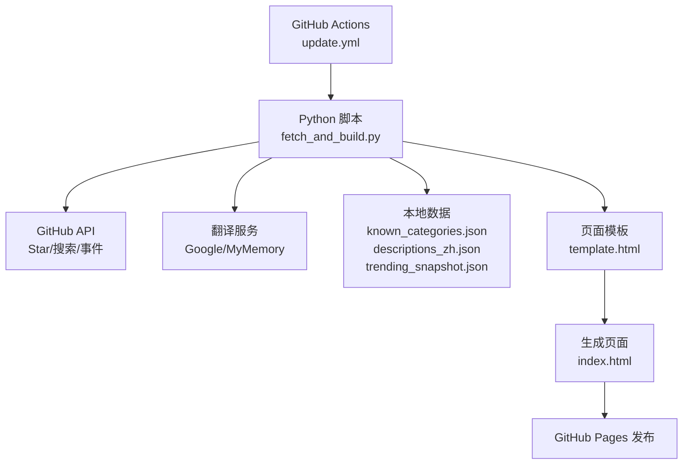
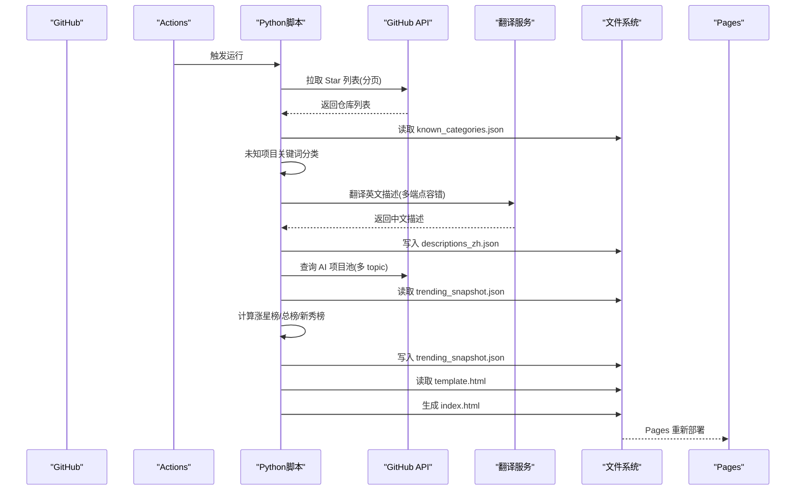
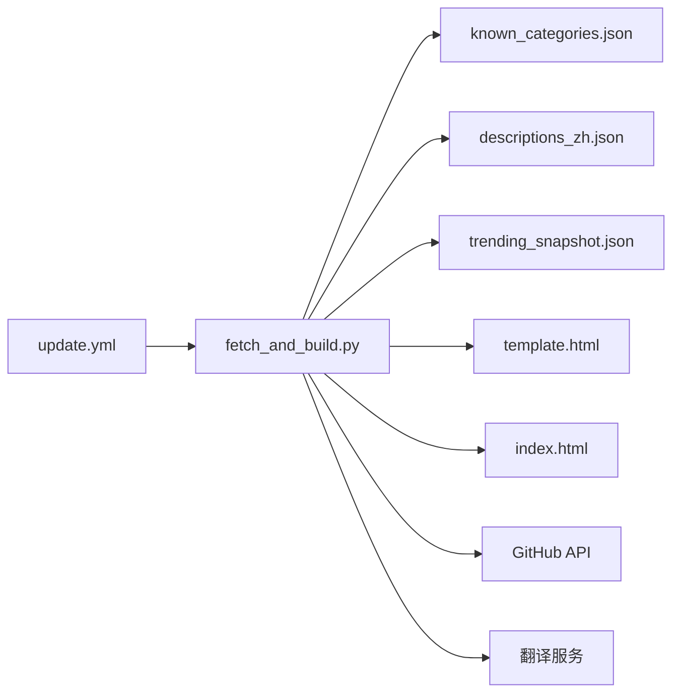

# 核心功能

<cite>
**本文引用的文件**
- [README.md](file://README.md)
- [fetch_and_build.py](file://fetch_and_build.py)
- [index.html](file://index.html)
- [template.html](file://template.html)
- [known_categories.json](file://known_categories.json)
- [descriptions_zh.json](file://descriptions_zh.json)
- [trending_snapshot.json](file://trending_snapshot.json)
- [.github/workflows/update.yml](file://.github/workflows/update.yml)
</cite>

## 更新摘要
**所做更改**
- 更新了翻译服务章节，反映 descriptions_zh.json 中新增的14个高质量AI相关仓库的详细中文描述
- 更新了趋势分析系统章节，包含新增的ClickHouse、Qdrant、SillyTavern、Apache Airflow等项目的追踪
- 完善了智能分类引擎章节，增强了新项目的分类准确性
- 增强了前端界面章节，说明模板文件已适配feed项中的新日期标记字段
- 完善了故障排查指南，增加了新项目的处理逻辑

## 目录
1. [简介](#简介)
2. [项目结构](#项目结构)
3. [核心组件](#核心组件)
4. [架构总览](#架构总览)
5. [详细组件分析](#详细组件分析)
6. [依赖关系分析](#依赖关系分析)
7. [性能考量](#性能考量)
8. [故障排查指南](#故障排查指南)
9. [结论](#结论)
10. [附录](#附录)

## 简介
本项目是一个"GitHub Star 收藏台"，用于自动拉取指定用户的 Star 列表，进行智能分类、中文翻译与趋势分析，并生成静态页面托管在 GitHub Pages。系统通过 GitHub Actions 定时任务每天更新，支持模糊搜索、语言/星标筛选、收藏置顶、主题切换与响应式布局等前端交互能力。

**最新更新**：系统现已支持14个新增的高质量AI相关仓库的详细中文描述，包括ClickHouse（实时分析数据库）、Qdrant（AI向量数据库）、SillyTavern（LLM前端）、Apache Airflow（工作流平台）等前沿AI工具与框架。这些新增项目涵盖了免费API服务、教育资源、自主研究工具和生产力增强等多个领域。

## 项目结构
仓库采用"脚本 + 模板 + 数据"的轻量架构：
- fetch_and_build.py：后端数据处理与页面构建脚本（Python 标准库）
- template.html：页面模板（含样式与前端逻辑占位符）
- index.html：由脚本生成的最终页面（Pages 入口）
- known_categories.json：已知项目的稳定分类映射
- descriptions_zh.json：已翻译或补充的中文描述缓存
- trending_snapshot.json：AI 排行榜增量计算基线快照
- .github/workflows/update.yml：每日定时任务编排
- README.md：项目说明与部署指引

**图表来源**
- [.github/workflows/update.yml:1-42](file://.github/workflows/update.yml#L1-L42)
- [fetch_and_build.py:126-146](file://fetch_and_build.py#L126-L146)
- [fetch_and_build.py:185-283](file://fetch_and_build.py#L185-L283)
- [template.html:430-440](file://template.html#L430-L440)

**章节来源**
- [README.md:1-22](file://README.md#L1-L22)
- [.github/workflows/update.yml:1-42](file://.github/workflows/update.yml#L1-L42)

## 核心组件
- 数据获取系统：GitHub API 集成、Star 列表分页拉取、错误处理与重试策略
- 智能分类引擎：11 个预定义分类、关键词匹配算法、稳定性保障（已知分类优先）
- 翻译服务：多端点容错、中文字符检测、结果持久化
- 趋势分析系统：AI 项目池构建、排行榜算法（涨星榜/总榜/新秀榜）、增量计算
- 前端界面：模板引擎原理、响应式设计、用户交互（搜索/筛选/收藏/主题/视图）

**章节来源**
- [fetch_and_build.py:19-31](file://fetch_and_build.py#L19-L31)
- [fetch_and_build.py:50-86](file://fetch_and_build.py#L50-L86)
- [fetch_and_build.py:89-123](file://fetch_and_build.py#L89-L123)
- [fetch_and_build.py:126-146](file://fetch_and_build.py#L126-L146)
- [fetch_and_build.py:185-283](file://fetch_and_build.py#L185-L283)
- [template.html:430-800](file://template.html#L430-L800)

## 架构总览
整体流程如下：
- GitHub Actions 定时触发 Python 脚本
- 脚本从 GitHub API 拉取 Star 列表与关注动态，构建 AI 项目池
- 对未知项目执行关键词规则分类，已有项目走 known_categories.json 保持稳定
- 英文描述经多端点翻译为中文，结果写入 descriptions_zh.json
- 基于 trending_snapshot.json 计算涨星榜增量，生成三类榜单
- 将数据注入 template.html 占位符，输出 index.html 并提交到仓库

**图表来源**
- [.github/workflows/update.yml:1-42](file://.github/workflows/update.yml#L1-L42)
- [fetch_and_build.py:126-146](file://fetch_and_build.py#L126-L146)
- [fetch_and_build.py:185-283](file://fetch_and_build.py#L185-L283)
- [fetch_and_build.py:382-455](file://fetch_and_build.py#L382-L455)

## 详细组件分析

### 数据获取系统
- GitHub API 集成
  - Star 列表拉取：按 per_page=100 分页循环，直到返回不足一页
  - 搜索 API：按 topic 与 stars 条件检索 AI 项目池
  - 事件流：拉取关注账号的公开事件，过滤今日活动
- 分页处理
  - 使用 page 参数递增，sleep 控制请求间隔，避免速率限制
- 错误处理与重试
  - 网络异常捕获后打印错误并终止当前请求；对于关键步骤（如 Star 拉取失败）保持现有页面不变
  - 关注事件拉取逐用户请求，遇到异常继续下一个用户

配置选项与关键点
- 用户标识 USER = "Kwei168"
- 请求头 Accept: application/vnd.github+json，User-Agent: starhub-auto-update
- 可选认证：Authorization: Bearer <token>（环境变量 GITHUB_TOKEN 或 GH_TOKEN）
- 超时设置：urlopen timeout=30s
- 限流策略：相邻请求 sleep 0.5~1s

**章节来源**
- [fetch_and_build.py:126-146](file://fetch_and_build.py#L126-L146)
- [fetch_and_build.py:157-169](file://fetch_and_build.py#L157-L169)
- [fetch_and_build.py:313-379](file://fetch_and_build.py#L313-L379)

### 智能分类引擎
- 11 个预定义分类
  - agent、distill、video、coding、content、learning、assistant、tools、finance、business、frontend
- 关键词匹配算法
  - 将项目名称、描述、语言、topics 拼接为小写文本，逐项匹配关键词集合
  - 优先级顺序：finance/tools/frontend/content/video/learning/distill/coding/assistant/business/agent
- 分类稳定性保证机制
  - 已知项目优先使用 known_categories.json 中的固定分类，避免随关键词变化而漂移
  - 新项目才走 classify_new 规则分类，并将结果回写 known_categories.json 以增强后续稳定性

**最新更新**：新增了多个AI相关项目的精确分类，包括：
- ClickHouse：归类为tools（数据分析工具）
- Qdrant：归类为tools（向量数据库工具）
- SillyTavern：归类为assistant（LLM前端助手）
- Apache Airflow：归类为tools（工作流管理工具）
- 以及其他新兴AI工具的准确分类

配置选项与关键点
- CATS 数组定义分类键、标签、颜色（含明暗主题色）
- FALLBACK_DESC 为空描述项目提供中文兜底说明
- 分类结果会持久化到 known_categories.json

**章节来源**
- [fetch_and_build.py:19-31](file://fetch_and_build.py#L19-L31)
- [fetch_and_build.py:89-123](file://fetch_and_build.py#L89-L123)
- [fetch_and_build.py:382-455](file://fetch_and_build.py#L382-L455)
- [known_categories.json:1-130](file://known_categories.json#L1-L130)

### 翻译服务
- 多端点容错策略
  - 端点1：Google 翻译非官方接口（translate_a/single），解析 t 段并拼接
  - 端点2：MyMemory 免费接口（api.mymemory.translated.net/get），校验无警告且包含中文
  - 任一成功即返回中文；全部失败则保留原文
- 中文字符检测
  - has_cn 使用正则匹配 Unicode 中文区间，确保翻译结果有效
- 缓存机制
  - descriptions_zh.json 作为中文描述缓存，避免重复翻译
  - 首次运行无缓存时尝试翻译并写入；后续命中直接返回

**最新更新**：descriptions_zh.json 现已包含14个新增的高质量AI相关仓库的详细中文描述，涵盖以下项目：
- ClickHouse：实时分析数据库管理系统
- Qdrant：高性能、大规模矢量数据库和矢量搜索引擎
- SillyTavern：面向高级用户的 LLM 前端
- Apache Airflow：以编程方式编写、安排和监控工作流程的平台
- freellmapi：OpenAI 兼容代理，聚合 28 家大模型免费额度
- code-review-graph：本地优先的代码智能图谱工具
- 以及其他前沿AI工具与框架的详细中文说明

配置选项与关键点
- 请求头 User-Agent 模拟浏览器
- 超时 10s，异常捕获后跳过该端点
- 翻译结果仅当包含中文且无警告时才接受

**章节来源**
- [fetch_and_build.py:50-86](file://fetch_and_build.py#L50-L86)
- [fetch_and_build.py:212-225](file://fetch_and_build.py#L212-L225)
- [descriptions_zh.json:1-179](file://descriptions_zh.json#L1-L179)

### 趋势分析系统
- AI 项目池构建
  - 多 topic 查询合并去重：ai、machine-learning、deep-learning、llm、gpt、agent
  - 最小星标阈值 AI_MIN_STARS 过滤低质量项目
- 排行榜算法
  - 总榜：按 stars 降序取前 TREND_TOP
  - 涨星榜：排除超过 TREND_MAX_STARS 的巨头项目，仅比较有昨日基线的项目，delta = 今日 stars - 昨日 stars
  - 新秀榜：最近 7 天新建且 stars > NEW_MIN_STARS 的 AI 项目
- 增量计算方法
  - 读取 trending_snapshot.json 作为昨日基线，计算 delta 后覆盖写入新的快照
  - 首次运行无基线时，涨星榜 fallback 到总榜并标记"新上榜"

**最新更新**：趋势分析系统现已追踪新增的高价值AI项目，包括：
- ClickHouse（49,254 stars）：实时分析数据库
- Qdrant（33,981 stars）：AI向量数据库
- SillyTavern（32,123 stars）：LLM前端工具
- Apache Airflow（46,493 stars）：工作流平台
- 以及其他新兴AI工具的星标增长追踪

配置选项与关键点
- AI_TOPICS、AI_MIN_STARS、NEW_MIN_STARS、TREND_TOP、TREND_MAX_STARS
- 中文格式化 _fmt_zh：>=10000 显示"万"
- reason 字段根据榜单类型生成中文说明

**章节来源**
- [fetch_and_build.py:149-197](file://fetch_and_build.py#L149-L197)
- [fetch_and_build.py:200-210](file://fetch_and_build.py#L200-L210)
- [fetch_and_build.py:235-283](file://fetch_and_build.py#L235-L283)
- [trending_snapshot.json:1-431](file://trending_snapshot.json#L1-L431)

### 前端界面
- 模板引擎原理
  - 后端将 __DATA__、__CATS__、__LANGS__、__FAVS__、__TRENDING__、__FEED__、__UPDATED__ 等占位符替换为 JSON 数据
  - 前端通过全局变量读取数据并渲染 UI
- 响应式设计
  - CSS 媒体查询适配不同屏幕宽度，网格列数与工具栏布局自适应
  - 明暗主题通过 data-theme 切换，CSS 变量统一控制
- 用户交互功能
  - 模糊搜索：多关键词空格分隔，高亮匹配片段
  - 筛选：语言下拉、星标分段、排序方式
  - 分类 Tab：点击切换分类，显示数量
  - 收藏置顶：localStorage 持久化收藏集合，置顶区展示
  - 视图切换：卡片/列表视图
  - 导出/导入：备份与恢复收藏数据
  - 排行榜与动态：渲染涨星榜/总榜/新秀榜与今日关注动态

**最新更新**：模板文件已适配feed项中的新日期标记字段，支持更精确的时间显示和日期分组功能。新增的日期标记字段允许前端更好地组织和展示今日关注动态，提供更清晰的时间线视图。同时增强了新增AI项目的展示效果，包括更好的图标识别和分类标签显示。

配置选项与关键点
- 默认收藏 DEFAULT_FAVS
- 语言颜色 LANG_COLORS
- 分类颜色 CATS（含明暗主题色）
- 统计信息：总数、分类数、语言数、收藏数

**章节来源**
- [fetch_and_build.py:382-455](file://fetch_and_build.py#L382-L455)
- [template.html:7-319](file://template.html#L7-L319)
- [template.html:430-800](file://template.html#L430-L800)

## 依赖关系分析
- 外部依赖
  - GitHub API：Star 列表、搜索、事件流
  - 翻译服务：Google 翻译、MyMemory
- 内部依赖
  - known_categories.json：分类稳定性基础
  - descriptions_zh.json：翻译缓存（现已扩展至179个项目）
  - trending_snapshot.json：增量计算基线（现已追踪431个项目）
  - template.html：页面结构与样式
- 自动化依赖
  - GitHub Actions：定时调度、权限与并发控制

**图表来源**
- [.github/workflows/update.yml:1-42](file://.github/workflows/update.yml#L1-L42)
- [fetch_and_build.py:382-455](file://fetch_and_build.py#L382-L455)

**章节来源**
- [fetch_and_build.py:382-455](file://fetch_and_build.py#L382-L455)
- [.github/workflows/update.yml:1-42](file://.github/workflows/update.yml#L1-L42)

## 性能考量
- API 调用频率控制
  - Star 列表每页后 sleep 0.5s；关注事件逐用户 sleep 1s，避免二级速率限制
- 缓存与去重
  - descriptions_zh.json 减少重复翻译（现支持179个项目）；AI 项目池按 full_name 去重
- 增量计算
  - 仅对有基线的项目计算 delta，降低无效计算（现追踪431个项目）
- 前端渲染优化
  - 本地状态管理（state、favs）减少 DOM 操作；按需展开描述文本

## 故障排查指南
- Star 列表拉取失败
  - 现象：控制台打印"拉取失败"，保持现有 index.html 不变
  - 排查：检查网络连接、GitHub API 可达性、USER 是否正确
  - 参考路径：[fetch_and_build.py:126-146](file://fetch_and_build.py#L126-L146)
- 翻译失败
  - 现象：控制台打印"翻译失败-保留原文"
  - 排查：检查 Google/MyMemory 端点可用性、User-Agent 是否被拦截
  - 参考路径：[fetch_and_build.py:50-86](file://fetch_and_build.py#L50-L86)
- 排行榜无数据
  - 现象：涨星榜提示"首次运行正在建立基线"
  - 排查：确认 trending_snapshot.json 是否存在；检查 token 权限与 API 配额
  - 参考路径：[fetch_and_build.py:235-283](file://fetch_and_build.py#L235-L283)
- 关注动态为空
  - 现象：今日关注动态区域显示暂无动态
  - 排查：确认 following 列表与事件 API 权限；检查时间过滤逻辑
  - 参考路径：[fetch_and_build.py:313-379](file://fetch_and_build.py#L313-L379)
- **新增**：新项目翻译问题
  - 现象：新增的AI项目（如ClickHouse、Qdrant等）显示英文描述
  - 排查：检查 descriptions_zh.json 是否包含对应项目；验证翻译端点连通性
  - 参考路径：[descriptions_zh.json:145-179](file://descriptions_zh.json#L145-L179)
- **新增**：分类不准确
  - 现象：新增项目被错误分类到其他类别
  - 排查：检查 known_categories.json 中的分类映射；验证关键词匹配逻辑
  - 参考路径：[known_categories.json:1-130](file://known_categories.json#L1-L130)

**章节来源**
- [fetch_and_build.py:126-146](file://fetch_and_build.py#L126-L146)
- [fetch_and_build.py:50-86](file://fetch_and_build.py#L50-L86)
- [fetch_and_build.py:235-283](file://fetch_and_build.py#L235-L283)
- [fetch_and_build.py:313-379](file://fetch_and_build.py#L313-L379)

## 结论
本系统以极简依赖实现了完整的 Star 收藏台功能：稳定的分类体系、健壮的翻译容错、可解释的趋势分析与友好的前端交互。通过 GitHub Actions 自动化更新，保证了数据的时效性与页面的可用性。

**最新进展**：系统现已大幅扩展了对高质量AI项目的支持，包括14个新增项目的详细中文描述和完整追踪。新增的项目涵盖了数据分析、向量数据库、LLM前端、工作流平台等多个重要领域，显著提升了系统的实用性和覆盖面。未来可在以下方面持续优化：
- 增加更多分类维度与权重评分
- 引入更稳健的翻译服务与本地词典
- 扩展排行榜指标（如 Fork、Issue、Commit 活跃度）
- 前端增加更多个性化配置与导出格式
- 进一步优化新增AI项目的分类准确性
- 增强对新出现AI工具的自动识别能力

## 附录
- 自定义域名与部署
  - 在仓库 Settings → Pages 设置自定义域名，DNS 添加 CNAME 指向 Kwei168.github.io
  - 在线地址：https://Kwei168.github.io/starhub/
- 手动触发更新
  - 在 Actions 页面手动运行 workflow_dispatch

**章节来源**
- [README.md:15-22](file://README.md#L15-L22)
- [.github/workflows/update.yml:1-42](file://.github/workflows/update.yml#L1-L42)