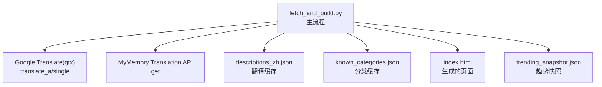
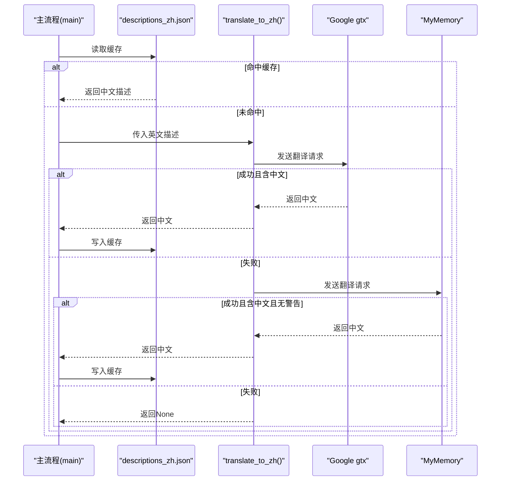
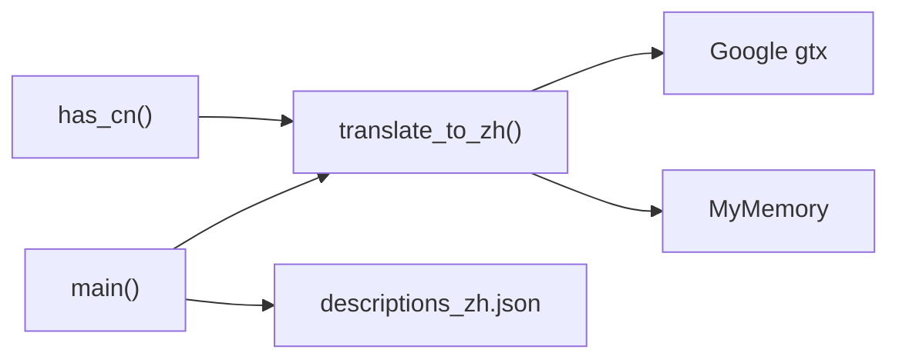

# 翻译服务

<cite>
**本文引用的文件**
- [fetch_and_build.py](file://fetch_and_build.py)
- [descriptions_zh.json](file://descriptions_zh.json)
- [known_categories.json](file://known_categories.json)
- [README.md](file://README.md)
- [trending_snapshot.json](file://trending_snapshot.json)
</cite>

## 更新摘要
**变更内容**
- 更新了 descriptions_zh.json 中的中文描述，新增了多个热门项目的翻译
- 新增了 RAG 评估工具、AI 情感可视化、macOS LLM 训练环境等项目
- 增强了代码知识图谱转换器、数据库客户端、Claude Code 技能等工具的中文描述
- 更新了浏览器自动化代理和代码生成工具的翻译内容

## 目录
1. [简介](#简介)
2. [项目结构](#项目结构)
3. [核心组件](#核心组件)
4. [架构总览](#架构总览)
5. [详细组件分析](#详细组件分析)
6. [依赖关系分析](#依赖关系分析)
7. [性能考虑](#性能考虑)
8. [故障排查指南](#故障排查指南)
9. [结论](#结论)
10. [附录](#附录)

## 简介
本翻译服务用于在 GitHub Star 收藏台自动更新流程中，将英文仓库描述翻译为中文，并持久化缓存以避免重复调用翻译 API。服务采用双端点容错策略：优先使用 Google Translate 非官方接口（gtx），失败时回退到 MyMemory Translation API；同时通过本地 JSON 缓存与"已含中文"的快速路径，显著降低对外部服务的依赖与延迟。

## 项目结构
- fetch_and_build.py：主脚本，负责拉取星标、分类、翻译与页面生成。其中包含翻译函数 translate_to_zh()、中文检测 has_cn()、以及翻译结果写入 descriptions_zh.json 的流程。
- descriptions_zh.json：翻译结果缓存文件，键为仓库 full_name，值为中文描述。
- known_categories.json：已知项目的分类映射，保证分类稳定。
- README.md：项目说明与自动化更新说明。
- trending_snapshot.json：趋势数据快照，用于涨星榜计算。

图表来源
- [fetch_and_build.py:54-86](file://fetch_and_build.py#L54-L86)
- [fetch_and_build.py:382-453](file://fetch_and_build.py#L382-L453)

章节来源
- [README.md:1-22](file://README.md#L1-L22)
- [fetch_and_build.py:1-16](file://fetch_and_build.py#L1-L16)

## 核心组件
- 多端点容错翻译：translate_to_zh() 实现双端点请求与结果校验，任一成功即返回中文文本，全部失败返回 None。
- 中文识别：has_cn() 使用正则匹配 Unicode 中文范围，快速判断是否已含中文，避免不必要的翻译调用。
- 缓存机制：descriptions_zh.json 作为翻译结果持久化存储，读取后若命中则跳过翻译；未命中且原文不含中文时才发起翻译，成功后写回缓存。
- 流程集成：main() 在构建数据时对每个仓库进行"是否已有中文/是否需要翻译"的判断，并在必要时调用 translate_to_zh() 并将结果落盘。

章节来源
- [fetch_and_build.py:50-86](file://fetch_and_build.py#L50-L86)
- [fetch_and_build.py:382-453](file://fetch_and_build.py#L382-L453)
- [descriptions_zh.json:1-230](file://descriptions_zh.json#L1-L230)

## 架构总览
翻译服务在主流程中的位置如下：
- 拉取星标列表后，对每个仓库执行分类与描述处理。
- 若描述为空或不含中文，且未在缓存中，则调用 translate_to_zh()。
- translate_to_zh() 先尝试 Google gtx 接口，失败再尝试 MyMemory 接口。
- 翻译成功后写入 descriptions_zh.json，后续运行直接命中缓存。

图表来源
- [fetch_and_build.py:54-86](file://fetch_and_build.py#L54-L86)
- [fetch_and_build.py:382-453](file://fetch_and_build.py#L382-L453)

## 详细组件分析

### 多端点容错策略（Google gtx 与 MyMemory）
- 端点 1：Google Translate 非官方接口（gtx）
  - 参数：client=gtx, sl=auto, tl=zh-CN, dt=t, q=原文
  - 响应解析：从 data[0] 中提取片段并拼接，去除空白后验证是否包含中文
  - 超时：10 秒
- 端点 2：MyMemory Translation API
  - 参数：q=原文, langpair=en|zh-CN
  - 响应解析：从 responseData.translatedText 获取文本，去除空白后验证是否包含中文且不含警告标记
  - 超时：10 秒
- 容错：任一端点成功即返回；全部失败返回 None，由上层保留原文或走其他回退逻辑

章节来源
- [fetch_and_build.py:54-86](file://fetch_and_build.py#L54-L86)

### 英文描述检测与中文字符识别
- 英文检测：通过判断描述是否为空或不含中文来决定是否需要翻译
- 中文识别：has_cn() 使用正则匹配 [\u4e00-\u9fff]，快速判定是否已含中文，避免重复翻译
- 结果验证：翻译结果需满足"非空、含中文、无警告"等条件才视为有效

章节来源
- [fetch_and_build.py:50-51](file://fetch_and_build.py#L50-L51)
- [fetch_and_build.py:54-86](file://fetch_and_build.py#L54-L86)

### 翻译流程与回退机制
- 主流程 main() 中，对每个仓库：
  - 若描述为空，使用 FALLBACK_DESC 补充
  - 若描述已含中文，直接使用
  - 若描述不含中文且不在缓存中，调用 translate_to_zh()
  - 翻译成功后写入缓存并输出日志
- _desc_zh() 用于排行榜场景的中文描述处理，同样遵循"缓存优先、已含中文优先、翻译回写"的策略

章节来源
- [fetch_and_build.py:212-225](file://fetch_and_build.py#L212-L225)
- [fetch_and_build.py:382-453](file://fetch_and_build.py#L382-L453)

### 缓存机制设计（descriptions_zh.json）
- 文件结构：键为仓库 full_name（如 owner/repo），值为对应的中文描述字符串
- 生命周期：
  - 启动时加载到内存
  - 翻译成功后写回磁盘
  - 每次运行结束后统一保存，确保增量更新
- 优化策略：
  - 命中缓存直接跳过翻译
  - 已含中文的描述不再触发翻译
  - 仅对首次出现的英文描述进行翻译，减少外部调用

**更新** 新增了多个热门项目的中文描述，包括 RAG 评估工具、AI 情感可视化、macOS LLM 训练环境等

章节来源
- [fetch_and_build.py:382-453](file://fetch_and_build.py#L382-L453)
- [descriptions_zh.json:1-230](file://descriptions_zh.json#L1-L230)

### translate_to_zh() 实现要点
- 请求构建：
  - Google gtx：构造 URL 参数 client=gtx, sl=auto, tl=zh-CN, dt=t, q=原文
  - MyMemory：构造 URL 参数 q=原文, langpair=en|zh-CN
- 响应解析：
  - Google：拼接 data[0] 片段并去空白
  - MyMemory：读取 responseData.translatedText 并去空白
- 错误处理：
  - 网络异常、JSON 解析异常、字段缺失均捕获并忽略
  - 结果需满足"非空、含中文、无警告"等条件
- 回退机制：
  - 优先 Google，失败则尝试 MyMemory
  - 全部失败返回 None，由上层决定保留原文或其他回退

章节来源
- [fetch_and_build.py:54-86](file://fetch_and_build.py#L54-L86)

### 具体 API 调用示例（路径引用）
- Google Translate gtx 接口调用：
  - 参考路径：[fetch_and_build.py:59-71](file://fetch_and_build.py#L59-L71)
- MyMemory Translation API 调用：
  - 参考路径：[fetch_and_build.py:72-85](file://fetch_and_build.py#L72-L85)

### 缓存文件格式说明（路径引用）
- 文件：descriptions_zh.json
- 结构：对象，键为 full_name，值为中文描述
- 参考路径：[descriptions_zh.json:1-230](file://descriptions_zh.json#L1-L230)

### 新增热门项目翻译内容
**更新** 以下项目已添加详细的中文描述：

- **RAG 评估工具**：vibrantlabsai/ragas - 增强您的 LLM 申请评估🚀
- **AI 情感可视化**：sam70361/emotion-ball - Grok bot 风格的 AI 表情小球:32 种 SVG 表情,一个 emotionId 即可接入 AI
- **macOS LLM 训练环境**：Greninja9257/LabLLM - 一个原生 macOS 实验室，用于教授微型语言模型思考 — 构建架构、训练权重，并观看小型 LLM 从头开始，在 Apple Silicon 上本地使用自定义数据、分词器、检查点和 MLX 加速
- **代码知识图谱转换器**：Graphify-Labs/graphify - 将任何代码库及其文档、SQL 架构、配置和 PDF 转换为可查询的知识图
- **数据库客户端**：t8y2/dbx - 轻量级跨平台数据库管理工具，支持 MySQL、PostgreSQL、SQLite、Redis、MongoDB、达梦等 80+ 数据库
- **Claude Code 技能**：JuliusBrussee/caveman - 克劳德代码技能，通过像穴居人一样说话来减少 65% 的令牌
- **浏览器自动化代理**：browser-use/browser-use - 让 AI 代理可以访问网站。轻松在线自动化任务
- **代码生成工具**：colbymchenry/codegraph - 预索引代码知识图，代码更改自动同步，适用于多种 AI 编程助手

章节来源
- [descriptions_zh.json:218-230](file://descriptions_zh.json#L218-L230)

### 性能优化建议
- 缓存命中率：随着运行次数增加，descriptions_zh.json 命中率提升，显著减少外部调用
- 中文快速路径：has_cn() 提前判断，减少不必要的外部调用
- 超时控制：两端点均设置 10 秒超时，防止阻塞
- 批量写入：运行结束时统一保存缓存，减少 I/O 次数
- 限流与重试：当前实现未显式重试，可在外层增加指数退避重试以提升鲁棒性

章节来源
- [fetch_and_build.py:50-86](file://fetch_and_build.py#L50-L86)
- [fetch_and_build.py:382-453](file://fetch_and_build.py#L382-L453)

## 依赖关系分析
- 模块内依赖：
  - translate_to_zh() 依赖 has_cn() 进行结果验证
  - main() 依赖 translate_to_zh() 与缓存文件读写
- 外部依赖：
  - Google Translate gtx 接口
  - MyMemory Translation API
  - GitHub API（用于拉取星标与趋势数据，非翻译核心）
- 耦合度：
  - 翻译逻辑与主流程解耦，便于替换端点或扩展新源
  - 缓存文件与主流程强耦合，但通过统一读写入口降低风险

图表来源
- [fetch_and_build.py:50-86](file://fetch_and_build.py#L50-L86)
- [fetch_and_build.py:382-453](file://fetch_and_build.py#L382-L453)

章节来源
- [fetch_and_build.py:50-86](file://fetch_and_build.py#L50-L86)
- [fetch_and_build.py:382-453](file://fetch_and_build.py#L382-L453)

## 性能考虑
- 缓存命中率：随着运行次数增加，descriptions_zh.json 命中率提升，显著减少外部调用
- 正则匹配开销：has_cn() 的正则匹配轻量高效，适合高频调用
- 网络超时：10 秒超时避免长时间阻塞，保障整体流程时效
- I/O 频率：统一在运行结束时保存缓存，降低频繁写入带来的性能损耗

## 故障排查指南
- 翻译结果为空：
  - 检查网络连通性与超时设置
  - 确认响应结构与字段是否存在
  - 查看是否有警告标记（如 MyMemory WARNING）
- 缓存未命中：
  - 确认 descriptions_zh.json 是否正确加载与写入
  - 检查 full_name 键是否与仓库一致
- 中文识别误判：
  - 调整 has_cn() 的正则范围以适配特殊字符
  - 对边界情况增加额外校验

章节来源
- [fetch_and_build.py:54-86](file://fetch_and_build.py#L54-L86)
- [fetch_and_build.py:382-453](file://fetch_and_build.py#L382-L453)

## 结论
该翻译服务通过双端点容错、中文快速识别与本地缓存机制，实现了高可用、低延迟的英文到中文翻译能力。结合主流程的分类与页面生成，形成了完整的自动化更新链路。建议在后续迭代中引入重试与监控，进一步提升鲁棒性与可观测性。

## 附录
- 已知分类映射：known_categories.json 提供稳定的分类键值，避免分类漂移
- 自动化更新：GitHub Actions 每日定时运行，保持数据新鲜
- 趋势数据：trending_snapshot.json 用于涨星榜计算和历史对比

章节来源
- [known_categories.json:1-156](file://known_categories.json#L1-L156)
- [README.md:15-17](file://README.md#L15-L17)
- [trending_snapshot.json:1-433](file://trending_snapshot.json#L1-L433)