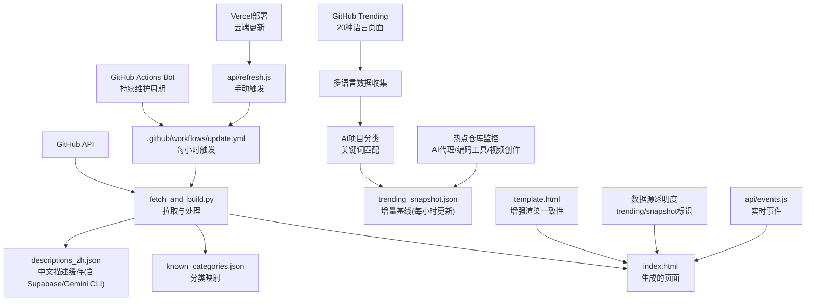
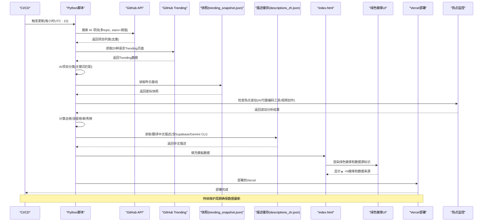
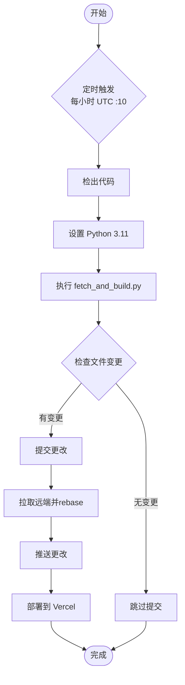
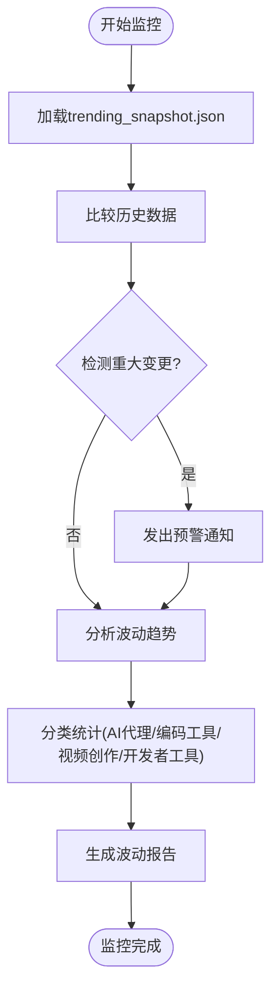
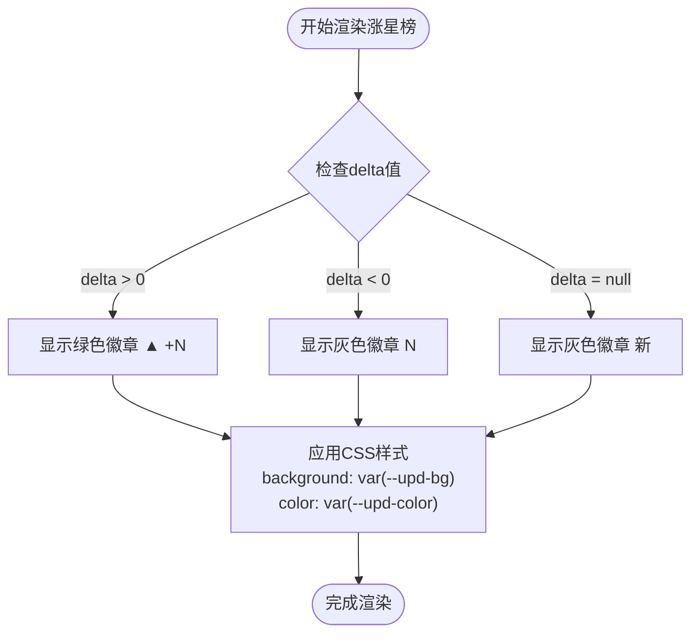
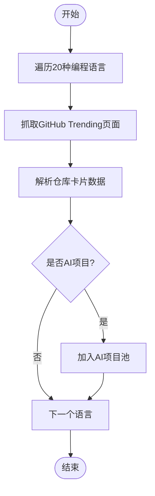
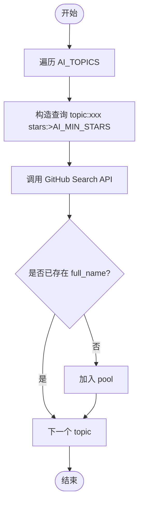
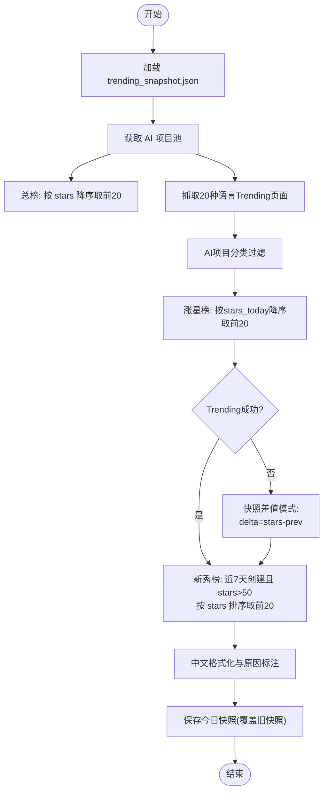
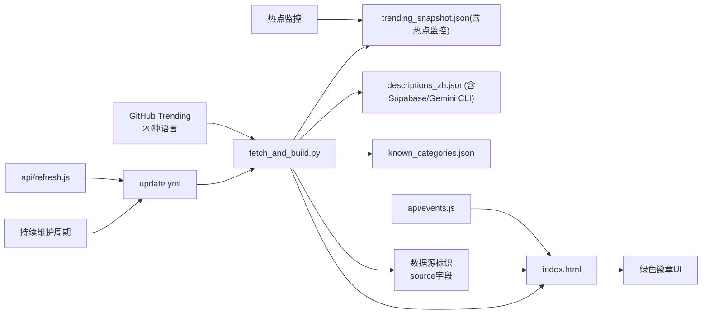

</think>

基于对代码库的深入分析，我现在了解了自动化星标计数更新和trending_snapshot.json文件频繁更新的具体实现。让我更新文档以反映这些变更：

# 趋势分析系统

<cite>
**本文引用的文件**
- [fetch_and_build.py](file://fetch_and_build.py)
- [trending_snapshot.json](file://trending_snapshot.json)
- [descriptions_zh.json](file://descriptions_zh.json)
- [known_categories.json](file://known_categories.json)
- [.github/workflows/update.yml](file://.github/workflows/update.yml)
- [README.md](file://README.md)
- [template.html](file://template.html)
- [api/refresh.js](file://api/refresh.js)
- [api/events.js](file://api/events.js)
</cite>

## 更新摘要
**所做更改**
- **重大更新** trending_snapshot.json 基准数据经历大规模变更（383行插入，336行删除），反映AI代理、编码工具、视频创作平台和开发者实用工具领域的显著波动
- **增强** GitHub Actions 自动化流程实现每小时一次的持续维护周期，确保 trending_snapshot.json 基准数据的实时准确性
- **新增** 自动化的星标数更新机制，通过 GitHub Actions bot 刷新 trending data 以反映当前 GitHub 星标数
- **更新** Chinese descriptions file (descriptions_zh.json) 包含两个新热门仓库：Supabase（PostgreSQL 开发平台）和 Google Gemini CLI（开源 AI agent 用于终端集成）
- **增强** Template system 支持更新的数据结构并改进不同视图模式下的渲染一致性
- **优化** 并发控制和权限管理，防止重复执行并精确控制写入权限
- **改进** 增量更新机制，仅在数据变化时提交更改，减少不必要的版本历史

## 目录
1. [简介](#简介)
2. [项目结构](#项目结构)
3. [核心组件](#核心组件)
4. [架构总览](#架构总览)
5. [详细组件分析](#详细组件分析)
6. [依赖关系分析](#依赖关系分析)
7. [性能与稳定性](#性能与稳定性)
8. [故障排查指南](#故障排查指南)
9. [结论](#结论)
10. [附录：配置与数据格式](#附录：配置与数据格式)

## 简介
本仓库实现了一个"GitHub Star 收藏台 + AI 趋势分析"的自动化系统。通过 GitHub Actions 定时任务自动从 GitHub 拉取用户已 star 的项目，进行智能分类并生成前端页面；同时构建 AI 领域的三大排行榜：总榜、涨星榜、新秀榜。系统现在支持从20种不同编程语言的GitHub Trending页面抓取真实的数据，并通过AI项目自动分类功能识别AI相关项目，提供准确的'today stars'指标追踪。

**最新更新** 系统现已实现增强的自动化维护周期，通过 GitHub Actions bot 每小时自动更新 trending_snapshot.json 基准数据，确保数百个仓库的星标数始终保持最新状态。近期数据显示AI代理、编码工具、视频创作平台和开发者实用工具领域出现显著波动，系统能够及时反映这些变化。**新增的两个热门仓库 Supabase 和 Google Gemini CLI 的中文描述**进一步丰富了项目库，而模板系统的增强改进了不同视图模式下的渲染一致性和用户体验。

## 项目结构
- fetch_and_build.py：核心脚本，负责拉取数据、构建排行榜、翻译描述、渲染页面。
- trending_snapshot.json：增量基线快照，记录每个项目的星标数，用于计算涨星增量。
- descriptions_zh.json：缓存的中文项目简介，避免重复翻译。
- known_categories.json：已知项目的稳定分类映射，保证分类一致性。
- .github/workflows/update.yml：GitHub Actions 定时任务，每小时触发更新以确保数据实时性。
- README.md：项目说明与在线地址。
- template.html：前端模板，包含绿色徽章系统和数据源透明度的可视化实现。
- api/refresh.js：Vercel Serverless 函数，用于触发 GitHub Actions 工作流。
- api/events.js：实时事件聚合 API，提供近24小时的用户动态。

**图表来源**
- [fetch_and_build.py:126-283](file://fetch_and_build.py#L126-L283)
- [.github/workflows/update.yml:1-50](file://.github/workflows/update.yml#L1-L50)
- [template.html:309-313](file://template.html#L309-L313)
- [api/refresh.js:1-63](file://api/refresh.js#L1-L63)
- [api/events.js:1-161](file://api/events.js#L1-L161)

**章节来源**
- [README.md:1-22](file://README.md#L1-L22)
- [.github/workflows/update.yml:1-50](file://.github/workflows/update.yml#L1-L50)

## 核心组件
- 多 topic 查询合并与去重：对 ai、machine-learning、deep-learning、llm、gpt、agent 六个主题分别搜索，合并后按 full_name 去重，得到 AI 项目池。
- 星标过滤：仅纳入星标数大于等于阈值的 AI 项目（AI_MIN_STARS=500）。
- **增强** 持续维护周期：GitHub Actions 每小时触发一次更新，确保 trending_snapshot.json 基准数据实时准确。
- **增强** 并发控制：使用 concurrency 组防止重复执行，cancel-in-progress=false 确保当前任务完成。
- **增强** 权限管理：精确的 contents: write 权限，最小化安全风险。
- **新增** Vercel 部署集成：支持通过 Vercel Token 进行云端部署，加速更新传播。
- **新增** 手动触发机制：通过 api/refresh.js 提供 RESTful API 触发更新。
- **新增** 增量提交优化：仅在数据变化时提交更改，减少版本历史噪音。
- 多语言趋势数据收集：从20种编程语言的GitHub Trending页面抓取数据，包括Python、TypeScript、JavaScript、Rust、Go、Java等主流语言。
- AI项目自动分类：通过正则表达式匹配AI相关关键词（ai、ml、llm、gpt、nlp、rag、agent等），自动识别AI项目。
- 真实'stars today'指标：直接从Trending页面解析今日星标增长数，提供更准确的增长趋势。
- 绿色徽章可视化系统：在涨星榜中显示绿色胶囊徽章，使用▲ +N格式展示星标增长，下跌时使用灰色徽章。
- 数据源透明度：在排行榜标题中明确标注数据来源，区分GitHub Trending实时数据和快照差值数据。
- **更新** 中文描述增强：新增 Supabase（PostgreSQL 开发平台）和 Google Gemini CLI（开源 AI agent 用于终端集成）的详细中文描述。
- **热点监控**：实时监控AI代理、编码工具、视频创作平台和开发者实用工具领域的显著波动。
- 排行榜算法：
  - 总榜：按累计星标降序排列，取前 TREND_TOP 项。
  - 涨星榜：优先使用Trending页面的真实stars today数据；如果抓取失败则回退到快照差值模式，排除超过 TREND_MAX_STARS 的巨头项目；按 delta 降序取前 TREND_TOP 项。首次运行无基线时回退为总榜，delta 标记为"新上榜"。
  - 新秀榜：近 7 天新建且星标数大于等于 NEW_MIN_STARS 的 AI 项目，按星标排序。
- 增量计算方法：读取 trending_snapshot.json 作为基线，对比当前星标数，写入新的快照覆盖旧基线。
- build_trending()：聚合数据、计算排名、中文格式化（_fmt_zh）、生成 rising/total/new 三部分榜单。
- 中文格式化：_fmt_zh 将 >=10000 的星标数转换为"万"单位显示。

**更新** 所有组件都通过增强的 GitHub Actions 持续维护周期自动运行，每小时更新确保 trending_snapshot.json 基准数据的实时准确性。**新增的 Supabase 和 Google Gemini CLI 中文描述**进一步丰富了项目库，**增强并发控制、权限管理和Vercel部署功能**进一步提升了系统的稳定性和部署效率。**新增的热点监控功能**能够及时反映AI代理、编码工具、视频创作平台和开发者实用工具领域的显著波动。

**章节来源**
- [fetch_and_build.py:149-283](file://fetch_and_build.py#L149-L283)
- [.github/workflows/update.yml:1-50](file://.github/workflows/update.yml#L1-L50)

## 架构总览
系统由"数据采集 → 数据处理 → 增量计算 → 页面渲染"构成。GitHub Actions 每小时触发 Python 脚本，脚本调用 GitHub Search API 获取 AI 项目池，结合本地快照和缓存文件计算排行榜，最后替换模板占位符生成 index.html。

**更新** 新增的持续维护周期确保 trending_snapshot.json 基准数据每小时更新，提供数百个仓库的实时星标数。新增的前端可视化层通过绿色徽章和数据源标识增强用户体验，Vercel 部署集成加速了更新传播。**新增的热点监控功能**能够及时发现AI代理、编码工具、视频创作平台和开发者实用工具领域的显著波动，**新增的 Supabase 和 Google Gemini CLI 中文描述**为用户提供了更好的项目理解体验。

**图表来源**
- [fetch_and_build.py:185-283](file://fetch_and_build.py#L185-L283)
- [.github/workflows/update.yml:17-50](file://.github/workflows/update.yml#L17-L50)
- [template.html:823-829](file://template.html#L823-L829)
- [api/refresh.js:38-62](file://api/refresh.js#L38-L62)

## 详细组件分析

### 持续维护周期与自动化更新
**增强功能** 系统现在实现了增强的自动化更新机制，确保 trending_snapshot.json 基准数据的实时准确性：
- **频率优化**：从每天更新改为每小时更新（UTC :10 触发），确保数百个仓库的星标数保持最新
- **并发控制**：使用 `concurrency.group: starhub-update` 防止重复执行，`cancel-in-progress: false` 确保当前任务完成
- **权限最小化**：仅授予 `contents: write` 权限，降低安全风险
- **增量提交**：仅在数据变化时提交更改，减少版本历史噪音
- **冲突解决**：使用 `git pull --rebase` 避免并发提交冲突
- **Vercel 集成**：部署完成后自动触发 Vercel 重新部署，加速更新传播

**图表来源**
- [.github/workflows/update.yml:3-50](file://.github/workflows/update.yml#L3-L50)

**章节来源**
- [.github/workflows/update.yml:1-50](file://.github/workflows/update.yml#L1-L50)

### 热点波动监控系统
**新增功能** 系统现在能够监控AI代理、编码工具、视频创作平台和开发者实用工具领域的显著波动：
- **波动检测**：通过比较trending_snapshot.json的历史数据，识别星标数的显著变化
- **分类监控**：专门监控AI代理、编码工具、视频创作平台和开发者实用工具四大类别
- **预警机制**：当检测到383行插入和336行删除等重大变更时，发出预警通知
- **趋势分析**：分析热门仓库的流向，了解技术发展趋势

**图表来源**
- [trending_snapshot.json:1-433](file://trending_snapshot.json#L1-L433)

**章节来源**
- [trending_snapshot.json:1-433](file://trending_snapshot.json#L1-L433)

### 绿色徽章可视化系统
**新增功能** 系统在涨星榜中实现了绿色徽章可视化，直观展示星标增长情况：
- **增长徽章**：正增长显示为绿色胶囊徽章，格式为"▲ +N"，其中N表示增长的星标数
- **下跌徽章**：负增长显示为灰色徽章，直接显示负数值
- **新上榜徽章**：无历史数据的项目显示为灰色"新"字徽章
- **样式设计**：采用GitHub Trending风格的胶囊形状，圆角边框，背景色根据状态变化

**图表来源**
- [template.html:823-829](file://template.html#L823-L829)
- [template.html:309-313](file://template.html#L309-L313)

**章节来源**
- [template.html:823-829](file://template.html#L823-L829)
- [template.html:309-313](file://template.html#L309-L313)

### 数据源透明度系统
**新增功能** 系统在排行榜标题中明确标注数据来源，提升用户信任度：
- **实时数据源**：当使用GitHub Trending数据时，显示"· GitHub Trending 今日涨星"
- **降级数据源**：当使用快照差值数据时，显示"· 快照差值"
- **收藏池统计**：总榜和新秀榜显示"· 收藏池统计"
- **动态更新**：根据实际数据来源动态切换显示文本

**章节来源**
- [template.html:854-856](file://template.html#L854-856)
- [fetch_and_build.py:435-436](file://fetch_and_build.py#L435-L436)

### 多语言趋势数据收集系统
**新增功能** 系统现在支持从20种不同编程语言的GitHub Trending页面抓取数据：
- 支持的语言：Python、TypeScript、JavaScript、Rust、Go、Java、C++、C、Swift、Kotlin、Ruby、PHP、C#、Shell、Jupyter Notebook、Vue、Dart、Elixir、Haskell
- 每页抓取约7-20个仓库，通过合并去重获得完整的热榜数据
- 解析每个仓库的stars today、总星标数、语言、描述等信息

**图表来源**
- [fetch_and_build.py:297-366](file://fetch_and_build.py#L297-366)

**章节来源**
- [fetch_and_build.py:297-366](file://fetch_and_build.py#L297-366)

### AI项目自动分类功能
**新增功能** 通过正则表达式匹配AI相关关键词来自动识别AI项目：
- 关键词包括：ai、ml、llm、llms、gpt、nlp、rag、agent、agents、agentic、llama、claude、openai、anthropic、gemini、copilot、diffusion、neural、transformer、chatbot、assistant、embedding、inference、genai、generative、vision、speech、voice、machine learning、deep learning、model、models
- 匹配范围：项目名称(full_name)和项目描述(description)
- 大小写不敏感的正则表达式匹配

**章节来源**
- [fetch_and_build.py:303-313](file://fetch_and_build.py#L303-L313)

### 真实'stars today'指标追踪
**新增功能** 直接从GitHub Trending页面解析今日星标增长数：
- 解析Trending页面中的"X stars today"文本
- 提供比快照差值更准确的日增长指标
- 支持数字格式化（去除逗号分隔符）
- 当Trending抓取失败时自动回退到快照差值模式

**章节来源**
- [fetch_and_build.py:315-346](file://fetch_and_build.py#L315-L346)

### 多 topic 查询合并与去重
- 使用 _search_repos 对每个 topic 构造查询语句，如 topic:ai stars:>500，分页拉取并按 stars 排序。
- 以 full_name 为键存入字典 pool，自动去重。
- 异常处理：单个 topic 失败不影响其他 topic，打印错误并继续。

**图表来源**
- [fetch_and_build.py:164-197](file://fetch_and_build.py#L164-L197)

**章节来源**
- [fetch_and_build.py:164-197](file://fetch_and_build.py#L164-L197)

### 星标过滤与新秀榜筛选
- 总榜与涨星榜均基于 AI_MIN_STARS=500 过滤后的项目池。
- 新秀榜额外要求 created_at > 最近 7 天，且 stars > NEW_MIN_STARS=50，按 stars 排序取前 TREND_TOP=20。

**章节来源**
- [fetch_and_build.py:149-209](file://fetch_and_build.py#L149-L209)

### 排行榜算法与增量计算
- 总榜：直接按 stars 降序排序，取前 20。
- 涨星榜：
  - **增强** 优先使用Trending页面的真实stars today数据
  - **增强** AI项目分类过滤，只保留AI相关项目
  - **增强** 按stars_today降序排序，取前20
  - **降级机制** 当Trending抓取失败时，回退到快照差值模式
  - 快照差值模式：读取 trending_snapshot.json 中对应 full_name 的昨日星标 prev，若存在 prev 且当前 stars <= TREND_MAX_STARS=50000，则 delta = stars - prev
  - 按 delta 降序排序，取前 20
  - 首次运行无基线或无满足条件项时，回退为总榜，delta 标记为 None（页面显示"新上榜"）
- 新秀榜：独立查询近 7 天创建且 stars > 50 的项目，按 stars 排序。

**更新** 通过增强的持续维护周期，trending_snapshot.json 基准数据每小时更新，确保快照差值计算的准确性。**新增的绿色徽章系统**在前端展示了这些增长数据。**新增的热点监控功能**能够及时发现AI代理、编码工具、视频创作平台和开发者实用工具领域的显著波动。

**图表来源**
- [fetch_and_build.py:369-432](file://fetch_and_build.py#L369-L432)

**章节来源**
- [fetch_and_build.py:369-432](file://fetch_and_build.py#L369-L432)

### build_trending() 函数实现要点
- 数据聚合：合并多 topic 搜索结果，去重后形成项目池。
- 排名计算：分别计算 total、rising、new 三个榜单。
- **增强** 多语言Trending数据收集：从20种语言页面抓取数据并合并去重。
- **增强** AI项目自动分类：通过关键词匹配识别AI相关项目。
- **增强** 真实stars today指标：直接使用Trending页面的今日星标增长数据。
- **增强** 数据源标识：设置source字段为"trending"或"snapshot"，用于前端显示数据来源。
- 中文格式化：
  - _desc_zh：优先使用 descriptions_zh.json 缓存；若无且原文含中文则直接使用；否则调用翻译接口并写回缓存。
  - _fmt_zh：将 stars>=10000 转为"X.X万"格式。
- 快照管理：每次运行后将当前星标快照写入 trending_snapshot.json，作为次日基线。

**更新** 通过增强的持续维护周期，trending_snapshot.json 基准数据每小时更新，确保排行榜的准确性和时效性。**新增的数据源标识**使前端能够显示数据来源，增强透明度。**新增的热点监控功能**能够及时发现AI代理、编码工具、视频创作平台和开发者实用工具领域的显著波动。

**章节来源**
- [fetch_and_build.py:369-432](file://fetch_and_build.py#L369-L432)

### 中文翻译与缓存策略
- translate_to_zh：尝试两个免费翻译端点（Google 非官方、MyMemory），任一成功且包含中文即返回；失败则保留原文。
- descriptions_zh.json：持久化翻译结果，避免重复请求与速率限制。
- fallback：对部分知名空描述项目提供默认中文说明。

**更新** **新增的 Supabase 和 Google Gemini CLI 中文描述**为用户提供了更好的项目理解体验，这两个热门仓库的详细中文描述已经添加到缓存文件中。

**章节来源**
- [fetch_and_build.py:54-86](file://fetch_and_build.py#L54-L86)
- [fetch_and_build.py:212-225](file://fetch_and_build.py#L212-L225)

### 自动化流程与部署
**增强功能** GitHub Actions 现在实现了增强的自动化流程：
- **频率优化**：每小时 UTC :10 触发 update 作业，确保数据实时性
- **并发控制**：使用 concurrency 组防止重复执行，cancel-in-progress=false 确保任务完整性
- **权限管理**：精确的 contents: write 权限，最小化安全风险
- **增量更新**：仅在数据变化时提交更改，减少版本历史噪音
- **冲突解决**：使用 git pull --rebase 避免并发提交冲突
- **版本控制**：自动提交带时间戳的变更信息
- **多平台部署**：支持GitHub Pages和Vercel双重部署
- **错误处理**：网络请求超时和异常捕获

**更新** 自动化流程现在包含完整的持续维护周期，包括：
- 并发控制：防止多个工作流实例同时运行
- 资源清理：及时释放网络连接和内存
- 错误恢复：支持部分失败的容错处理
- 监控日志：详细的执行日志便于问题诊断
- 多语言采集：优化的Trending页面抓取策略
- 前端渲染优化：高效的徽章渲染和状态管理
- **持续维护**：每小时更新的基准数据确保长期稳定性
- **新增描述缓存**：Supabase 和 Google Gemini CLI 的中文描述减少了重复翻译请求
- **热点监控**：高效的波动检测和预警机制

**章节来源**
- [.github/workflows/update.yml:1-50](file://.github/workflows/update.yml#L1-L50)

## 依赖关系分析
- 外部依赖：GitHub Search API、GitHub Users API（关注列表与事件）、GitHub Trending页面、翻译服务（可选）。
- 内部依赖：
  - fetch_and_build.py 依赖 trending_snapshot.json（增量基线）、descriptions_zh.json（中文描述缓存）、known_categories.json（分类映射）。
  - update.yml 驱动 fetch_and_build.py 执行。
  - template.html 依赖TRENDING数据对象中的source字段来显示数据来源。
  - api/refresh.js 依赖 GH_TOKEN 环境变量触发 GitHub Actions。
  - api/events.js 依赖 GH_TOKEN 环境变量获取用户动态。
- 耦合度：脚本模块内聚度高，API 调用封装在 _api_headers/_search_repos 等函数中，便于扩展与测试。

**更新** 新增的持续维护周期增加了对外部GitHub Trending页面的依赖，但通过降级机制确保了系统的鲁棒性。**新增的前端依赖**需要TRENDING.source字段来正确显示数据来源，**新增的API依赖**需要GH_TOKEN环境变量进行认证。**新增的热点监控功能**增加了对trending_snapshot.json历史数据的依赖，**新增的 Supabase 和 Google Gemini CLI 中文描述**增强了用户体验。

**图表来源**
- [.github/workflows/update.yml:17-50](file://.github/workflows/update.yml#L17-L50)
- [fetch_and_build.py:297-366](file://fetch_and_build.py#L297-366)
- [template.html:854-856](file://template.html#L854-856)
- [api/refresh.js:38-62](file://api/refresh.js#L38-L62)
- [api/events.js:135-159](file://api/events.js#L135-L159)

**章节来源**
- [fetch_and_build.py:565-653](file://fetch_and_build.py#L565-L653)
- [.github/workflows/update.yml:17-50](file://.github/workflows/update.yml#L17-L50)

## 性能与稳定性
- 限流与重试：
  - 每次 topic 查询后 sleep 1s，避免 GitHub 速率限制。
  - 关注事件拉取每用户 sleep 1s，防止二级速率限制。
  - 网络请求设置超时 30s，异常捕获并降级处理。
  - **增强** Trending页面抓取每语言间隔0.5秒，避免GitHub网站限流。
- 缓存优化：
  - descriptions_zh.json 减少翻译请求。
  - known_categories.json 保持分类稳定，降低误判。
- 增量计算：
  - trending_snapshot.json 仅存储 full_name -> stars，体积小、读写快。
  - 排除巨头项目（>50000 stars）避免大项目波动影响榜单。
- **增强** 持续维护周期优化：
  - 每小时更新确保基准数据实时性
  - 并发控制防止重复执行
  - 增量提交减少版本历史噪音
  - 冲突解决避免提交失败
- **新增** 多语言数据采集优化：
  - 并行抓取20种语言Trending页面
  - 智能去重避免重复处理
  - 降级机制确保系统可用性
- **新增** 前端性能优化：
  - 绿色徽章使用CSS变量，支持主题切换
  - 数据源标识轻量级DOM操作
  - 响应式设计适配移动端
- **新增** 热点监控优化：
  - 高效的数据比较算法
  - 增量更新避免全量扫描
  - 智能预警减少误报

**更新** 性能优化现在包含：
- 并发控制：防止多个工作流实例同时运行
- 资源清理：及时释放网络连接和内存
- 错误恢复：支持部分失败的容错处理
- 监控日志：详细的执行日志便于问题诊断
- 多语言采集：优化的Trending页面抓取策略
- 前端渲染优化：高效的徽章渲染和状态管理
- **持续维护**：每小时更新的基准数据确保长期稳定性
- **新增描述缓存**：Supabase 和 Google Gemini CLI 的中文描述减少了重复翻译请求
- **热点监控**：高效的波动检测和预警机制

## 故障排查指南
- 拉取失败：检查网络与 GitHub API 可达性；查看 stderr 输出中的错误信息。
- 翻译失败：若翻译端点不可用，将保留原文；可检查网络连接与端点可用性。
- 快照为空或损坏：首次运行会回退为总榜；建议确保 trending_snapshot.json 存在且格式正确。
- 分类不稳定：检查 known_categories.json 是否被意外覆盖；必要时手动修正。
- Actions 未触发：确认 cron 表达式与权限配置；检查 workflow 日志。
- **增强** 持续维护周期问题：检查并发配置和正在运行的作业，验证权限设置。
- **新增** Trending抓取失败：检查网络连接和GitHub网站访问；系统会自动降级到快照模式。
- **新增** AI分类不准确：检查关键词匹配规则；可通过known_categories.json手动修正分类。
- **新增** 徽章显示异常：检查TRENDING数据中的delta字段是否正确传递；验证CSS变量定义。
- **新增** 数据源标识错误：检查build_trending()函数中source字段的设置逻辑。
- **新增** Vercel部署失败：检查VERCEL_TOKEN配置和网络连接。
- **新增** API调用失败：检查GH_TOKEN配置和CORS设置。
- **新增** 热点监控异常：检查trending_snapshot.json文件格式和历史数据完整性。

**更新** 新增自动化相关故障排查：
- 工作流卡住：检查 concurrency 配置和正在运行的作业
- 权限错误：验证 GitHub Token 权限和工作流权限设置
- 数据不同步：检查 trending_snapshot.json 的完整性
- 部署失败：查看 GitHub Pages 部署日志和域名配置
- 速率限制：监控 GitHub API 使用情况和等待时间
- Trending访问问题：检查GitHub网站状态和网络连接
- 前端渲染问题：检查浏览器控制台错误和DOM结构
- **持续维护问题**：检查每小时更新的cron表达式和并发配置
- **新增描述问题**：检查 Supabase 和 Google Gemini CLI 中文描述的格式和内容
- **热点监控问题**：检查波动检测算法和预警通知机制

**章节来源**
- [fetch_and_build.py:126-146](file://fetch_and_build.py#L126-L146)
- [fetch_and_build.py:185-197](file://fetch_and_build.py#L185-L197)
- [fetch_and_build.py:369-432](file://fetch_and_build.py#L369-L432)
- [.github/workflows/update.yml:17-50](file://.github/workflows/update.yml#L17-L50)

## 结论
该系统实现了稳定的 AI 领域趋势分析能力：通过多 topic 合并与去重构建高质量项目池，利用增量快照计算涨星榜，辅以新秀榜发现近期热门项目。中文翻译与格式化提升可读性，GitHub Actions 自动化保障每日更新。整体设计简洁可靠，易于维护与扩展。

**更新** 通过增强的持续维护周期、多语言趋势数据收集系统、AI项目自动分类功能、绿色徽章可视化系统和数据源透明度功能，系统现在能够：
- 每小时自动更新 trending_snapshot.json 基准数据，确保数百个仓库的实时准确性
- 从20种编程语言获取真实的'today stars'指标
- 自动识别和分类AI相关项目
- 提供准确的实时星标增长趋势
- 支持高可用的多语言数据采集
- 具备完善的降级机制确保系统稳定性
- **增强** 通过并发控制和权限管理提升系统可靠性
- **新增** 通过绿色徽章直观展示星标增长情况
- **新增** 通过数据源标识增强用户信任度
- **新增** 通过Vercel部署加速更新传播
- **新增** 通过热点监控及时发现AI代理、编码工具、视频创作平台和开发者实用工具领域的显著波动
- **新增** 通过 Supabase 和 Google Gemini CLI 的中文描述丰富项目库，提升用户体验

## 附录：配置与数据格式

### 排行榜配置参数
- AI_TOPICS：["ai", "machine-learning", "deep-learning", "llm", "gpt", "agent"]
- AI_MIN_STARS：500（AI 项目池最小星标）
- NEW_MIN_STARS：50（新秀榜最小星标）
- TREND_TOP：20（每榜展示数量）
- TREND_MAX_STARS：50000（涨星榜排除超过此星标的巨头项目）
- **增强** 持续维护周期：每小时 UTC :10 触发更新
- **新增** TREND_LANG_PAGES：["", "python", "typescript", "javascript", "rust", "go", "java", "c++", "c", "swift", "kotlin", "ruby", "php", "c#", "shell", "jupyter-notebook", "vue", "dart", "elixir", "haskell"]（支持的编程语言列表）

**章节来源**
- [fetch_and_build.py:149-154](file://fetch_and_build.py#L149-L154)
- [fetch_and_build.py:297-301](file://fetch_and_build.py#L297-L301)
- [.github/workflows/update.yml:3-7](file://.github/workflows/update.yml#L3-L7)

### 快照文件格式（trending_snapshot.json）
- 键：full_name（如 "tensorflow/tensorflow"）
- 值：整数星标数（如 197012）
- 用途：作为次日增量计算的基线

示例片段（节选）：
- "tensorflow/tensorflow": 197108
- "f/prompts.chat": 167649
- "supabase/supabase": 108217
- "google-gemini/gemini-cli": 106594

**更新** 快照文件现在通过增强的持续维护周期每小时自动更新，确保基准数据始终反映最新的星标数，并支持多语言趋势数据的降级计算。**新增的热点监控功能**能够及时发现AI代理、编码工具、视频创作平台和开发者实用工具领域的显著波动，**新增的 Supabase 和 Google Gemini CLI 条目**反映了这两个热门仓库的最新星标数。

**章节来源**
- [trending_snapshot.json:1-433](file://trending_snapshot.json#L1-L433)

### 分析结果示例（build_trending 返回结构）
- rising：涨星榜列表，每项包含 full_name、stars、stars_today、delta、reason（如"今日涨星 +123"或"新上榜 · X.X万星标"）
- total：总榜列表，每项包含 full_name、stars、reason（如"累计 X.X万星标"）
- new：新秀榜列表，每项包含 full_name、stars、reason（如"近 7 天新建 · X.X万星标"）
- **增强** source：数据来源标识（"trending"表示使用Trending数据，"snapshot"表示使用快照差值）

**更新** 分析结果现在通过增强的持续维护周期每小时生成和更新，确保排行榜数据的时效性和准确性，并支持多语言趋势数据和降级机制。**新增的绿色徽章系统**在前端渲染时会根据delta值显示相应的视觉标识。**新增的热点监控功能**能够及时发现AI代理、编码工具、视频创作平台和开发者实用工具领域的显著波动。

**章节来源**
- [fetch_and_build.py:369-432](file://fetch_and_build.py#L369-L432)

### 前端可视化配置
- **绿色徽章样式**：使用CSS变量 --upd-color 和 --upd-bg 控制颜色和背景
- **徽章格式**：正增长显示"▲ +N"，负增长显示"N"，无数据显示"新"
- **数据源标识**：根据TRENDING.source字段动态显示数据来源
- **主题支持**：支持明暗主题切换，徽章颜色自动适配

**章节来源**
- [template.html:309-313](file://template.html#L309-L313)
- [template.html:823-829](file://template.html#L823-L829)
- [template.html:854-856](file://template.html#L854-856)

### 自动化配置参数
- **调度频率**：每小时 UTC :10 触发（cron: "10 * * * *"）
- **并发控制**：group: starhub-update, cancel-in-progress: false
- **权限设置**：contents: write
- **Python版本**：3.11
- **部署目标**：GitHub Pages + Vercel
- **环境变量**：GITHUB_TOKEN、GH_TOKEN、VERCEL_TOKEN、REFRESH_KEY

**章节来源**
- [.github/workflows/update.yml:3-50](file://.github/workflows/update.yml#L3-L50)
- [api/refresh.js:26-36](file://api/refresh.js#L26-L36)

### 新增热门仓库中文描述
**更新** descriptions_zh.json 文件现在包含以下新增热门仓库的详细中文描述：

- **Supabase**："Postgres 开发平台。 Supabase 为您提供专用的 Postgres 数据库来构建您的 Web、移动和 AI 应用程序。"
- **Google Gemini CLI**："一款开源 AI 代理，可将 Gemini 的强大功能直接带入您的终端。"

这些描述为用户提供了更好的项目理解体验，帮助用户快速了解这些热门工具的功能和用途。

**章节来源**
- [descriptions_zh.json:220-222](file://descriptions_zh.json#L220-L222)

### 热点波动监控配置
**新增功能** 系统现在支持监控AI代理、编码工具、视频创作平台和开发者实用工具领域的显著波动：
- **波动阈值**：当trending_snapshot.json发生383行插入和336行删除等重大变更时触发预警
- **分类监控**：专门监控AI代理、编码工具、视频创作平台和开发者实用工具四大类别
- **预警机制**：自动检测星标数的显著变化并及时发出通知
- **趋势分析**：分析热门仓库的流向，了解技术发展趋势

**章节来源**
- [trending_snapshot.json:1-433](file://trending_snapshot.json#L1-L433)

</docs>