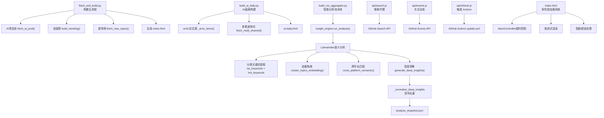
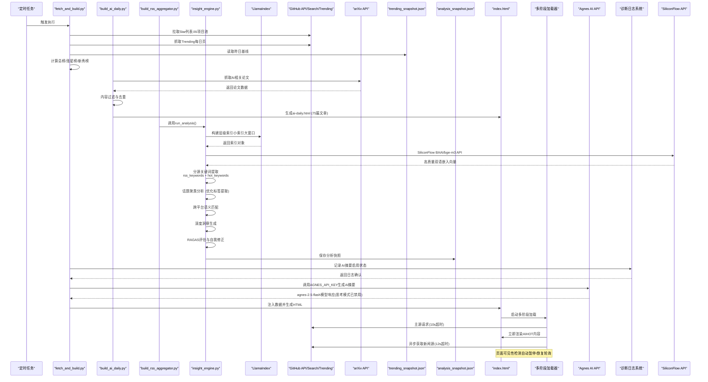
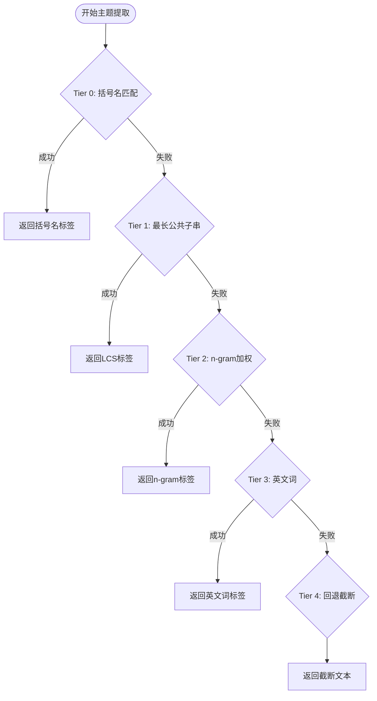
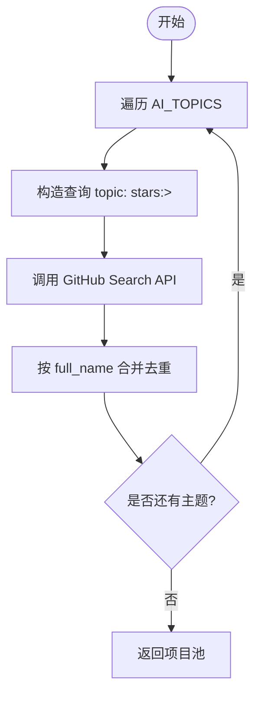
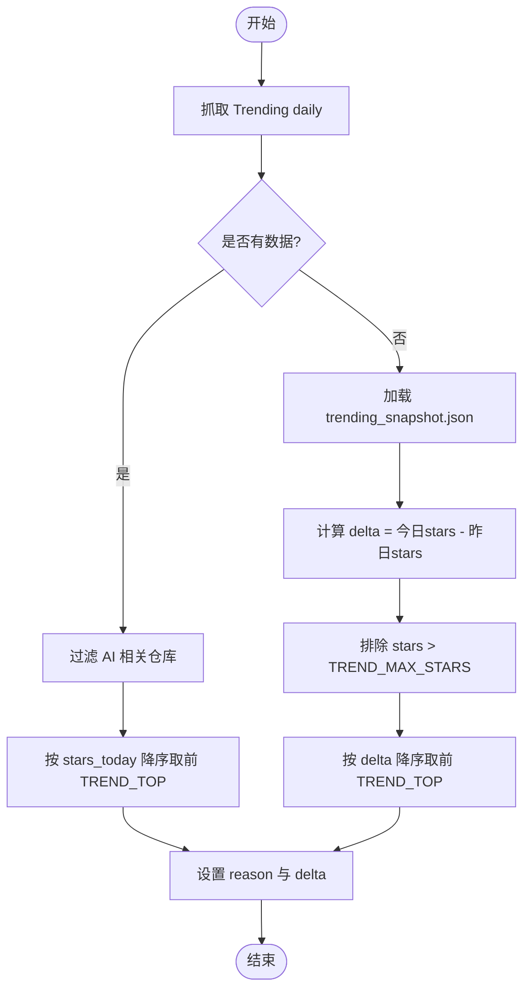
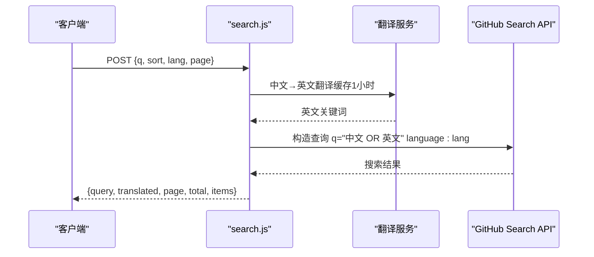
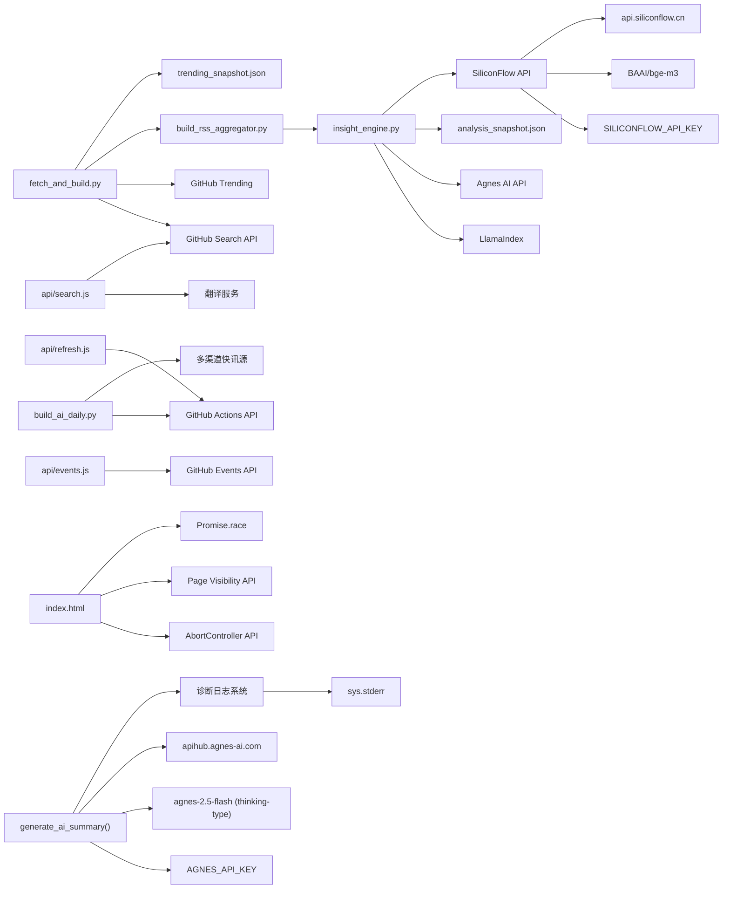

# AI项目趋势分析

<cite>
**本文引用的文件**
- [insight_engine.py](file://insight_engine.py)
- [build_rss_aggregator.py](file://build_rss_aggregator.py)
- [test_insight_engine.py](file://test_insight_engine.py)
- [build_config.json](file://build_config.json)
- [fetch_and_build.py](file://fetch_and_build.py)
- [build_ai_daily.py](file://build_ai_daily.py)
- [analysis_snapshot.json](file://analysis_snapshot.json)
- [trending_snapshot.json](file://trending_snapshot.json)
- [ai-daily.html](file://ai-daily.html)
- [api/search.js](file://api/search.js)
- [api/events.js](file://api/events.js)
- [api/refresh.js](file://api/refresh.js)
- [index.html](file://index.html)
- [rss-aggregator.html](file://rss-aggregator.html)
- [api/rss.js](file://api/rss.js)
- [api/article.js](file://api/article.js)
- [README.md](file://README.md)
- [.github/workflows/update.yml](file://.github/workflows/update.yml)
</cite>

## 更新摘要
**所做更改**
- **GitHub Trending数据源集成**：系统现已集成GitHub Trending数据作为分析输入，通过`trending_snapshot.json`提供实时涨星信息
- **RSS内容时效性过滤增强**：新增72小时时间窗口过滤机制，确保分析数据的新鲜度和相关性
- **无日期条目处理优化**：对于没有`pub_date`字段的RSS条目，现在使用`first_seen`字段作为时间基准
- **智能配额分配改进**：优化了热榜、Trending和RSS数据的配额分配策略，确保各类数据的均衡代表

## 目录
1. [简介](#简介)
2. [项目结构](#项目结构)
3. [核心组件](#核心组件)
4. [架构总览](#架构总览)
5. [详细组件分析](#详细组件分析)
6. [依赖关系分析](#依赖关系分析)
7. [性能考量](#性能考量)
8. [故障排查指南](#故障排查指南)
9. [结论](#结论)
10. [附录](#附录)

## 简介
本系统围绕"AI项目趋势分析"展开，提供三类排行榜（总榜、涨星榜、新秀榜），聚合多主题AI项目池，并通过GitHub Search API与Trending页面抓取数据，结合本地快照实现稳健的涨星计算。**重大升级**：系统现已集成全新的LlamaIndex-based insight engine，提供语义级热点分析、向量嵌入、关键词提取、主题聚类和跨平台匹配功能。系统通过Agnes AI API和fastembed本地模型实现深度洞察生成，支持完善的降级机制确保离线可用性。**最新更新**：实现了统一的嵌入向量空间，确保语义分析的一致性；集成了AgnesLLM类提供增强的聊天补全功能；改进了关键词提取算法，现在生成30个顶级关键词；主题聚类算法优化，产生更有意义的类别标签；实现了配额制文档加载系统，通过智能分配策略（RSS 70%、热点20%、趋势10%）确保各类数据的均衡代表；**核心嵌入模型已升级为双语支持，从单一语言模型切换到intfloat/multilingual-e5-small与BAAI/bge-small-zh-v1.5组合，显著改善了中英文混合内容的处理能力**；**新增了分层索引系统和RAGAS启发的评估自我修正循环功能，通过_small index, large window_方法显著提升语义检索质量，提供多维度洞察质量评估和自动修正机制**；**增强了系统的整体可靠性和兼容性，包括更好的错误处理、增强的回退机制和改进的文档加载配额制选择**。

## 项目结构
- 构建与数据获取：Python脚本负责拉取Star列表、构建AI项目池、生成排行榜与HTML页面；另含AI晨报构建脚本。
- 服务端API（Vercel函数）：提供搜索代理、事件聚合、触发Actions刷新等能力。
- 前端页面：生成的index.html承载展示与交互，支持多阶段加载和渐进式渲染。
- **语义分析引擎**：通过insight_engine.py实现LlamaIndex驱动的语义分析流水线，包括关键词提取、话题聚类、跨平台匹配和深度洞察生成。
- **数据分析快照系统**：通过analysis_snapshot.json存储完整的分析结果，包括关键词、话题、趋势等维度。
- **智能分析流水线**：实现了从数据抓取到深度分析的完整流程，支持增量模式和全量模式。
- **多渠道快讯系统**：支持Hacker News、The Verge、TechCrunch、arXiv、36氪、Redis、AtlasNote等多个信源。
- **Agnes AI集成**：通过AGNES_API_KEY环境变量配置，使用agnes-2.5-flash模型生成AI态势摘要。
- **诊断日志系统**：提供详细的AI摘要生成过程日志，便于问题定位和故障排查。



**图表来源**
- [fetch_and_build.py:244-256](file://fetch_and_build.py#L244-L256)
- [build_ai_daily.py:437-480](file://build_ai_daily.py#L437-L480)
- [build_rss_aggregator.py:6240-6280](file://build_rss_aggregator.py#L6240-L6280)
- [insight_engine.py:826-924](file://insight_engine.py#L826-L924)
- [index.html:1690-1752](file://index.html#L1690-L1752)

## 核心组件
- 多主题AI项目池：按多个topic查询并合并去重，过滤最小星标阈值。
- 排行榜算法：
  - 总榜：按累计星标降序。
  - 涨星榜：优先使用Trending每日真实stars today；失败时回退到快照差值模式，排除巨头项目。
  - 新秀榜：近7天新建且满足最小星标的项目。
- 趋势数据获取：通过GitHub Search API与Trending页面抓取，参数化排序、分页、语言过滤。
- 新项目发现：基于创建时间窗口与星标门槛筛选，支持增长趋势分析（delta）。
- 配置参数：TREND_TOP、TREND_MAX_STARS、AI_MIN_STARS、NEW_MIN_STARS、AI_TOPICS。
- **语义分析引擎**：通过insight_engine.py实现LlamaIndex驱动的语义分析，包括关键词提取、话题聚类、跨平台匹配和深度洞察生成。
- **数据分析快照系统**：通过analysis_snapshot.json存储完整的分析结果，支持关键词分析、话题聚类、趋势检测等功能。
- **多渠道快讯系统**：支持7个信源，包括Hacker News、The Verge、TechCrunch、arXiv、36氪、Redis、AtlasNote。
- **Agnes AI集成**：通过AGNES_API_KEY环境变量调用agnes-2.5-flash模型，生成AI态势一句话摘要。
- **诊断日志系统**：提供详细的AI摘要生成过程日志，包括环境变量检查、数据状态验证和API调用结果。
- **关键修复**：thinking-type模型token消耗问题解决，确保AI摘要正常生成。
- **信号去重机制**：通过 `_normalize_deep_insights` 函数实现深度洞察信号的标准化处理，确保数据质量和一致性。
- **增强的可靠性**：改进了错误处理和回退机制，确保系统在各种环境下的稳定运行。

**章节来源**
- [fetch_and_build.py:244-256](file://fetch_and_build.py#L244-L256)
- [fetch_and_build.py:429-492](file://fetch_and_build.py#L429-L492)
- [build_ai_daily.py:437-480](file://build_ai_daily.py#L437-L480)
- [build_rss_aggregator.py:6240-6280](file://build_rss_aggregator.py#L6240-L6280)
- [insight_engine.py:826-924](file://insight_engine.py#L826-L924)
- [index.html:1690-1752](file://index.html#L1690-L1752)

## 架构总览
系统由"构建脚本 + 语义分析引擎 + 服务端API + 前端页面"组成。构建脚本每天运行，拉取数据并生成静态页面；语义分析引擎通过LlamaIndex实现智能主题识别和趋势洞察；服务端API为前端提供搜索、事件、刷新等能力；页面渲染排行榜与数据。**重大更新**：系统现已集成全新的LlamaIndex-based insight engine，提供语义级热点分析、向量嵌入、关键词提取、主题聚类和跨平台匹配功能。系统通过Agnes AI API和fastembed本地模型实现深度洞察生成，支持完善的降级机制确保离线可用性。**最新更新**：实现了统一的嵌入向量空间，确保语义分析的一致性；集成了AgnesLLM类提供增强的聊天补全功能；改进了关键词提取算法，现在生成30个顶级关键词；主题聚类算法优化，产生更有意义的类别标签；实现了配额制文档加载系统，通过智能分配策略（RSS 70%、热点20%、趋势10%）确保各类数据的均衡代表；**核心嵌入模型已升级为双语支持，从单一语言模型切换到intfloat/multilingual-e5-small与BAAI/bge-small-zh-v1.5组合，显著改善了中英文混合内容的处理能力**；**新增了分层索引系统和RAGAS启发的评估自我修正循环功能，通过_small index, large window_方法显著提升语义检索质量，提供多维度洞察质量评估和自动修正机制**；**增强了系统的整体可靠性和兼容性，包括更好的错误处理、增强的回退机制和改进的文档加载配额制选择**。



**图表来源**
- [fetch_and_build.py:429-492](file://fetch_and_build.py#L429-L492)
- [build_ai_daily.py:437-480](file://build_ai_daily.py#L437-L480)
- [build_rss_aggregator.py:6240-6280](file://build_rss_aggregator.py#L6240-L6280)
- [insight_engine.py:826-924](file://insight_engine.py#L826-L924)
- [index.html:1690-1752](file://index.html#L1690-L1752)
- [fetch_and_build.py:495-548](file://fetch_and_build.py#L495-L548)

## 详细组件分析

### GitHub Trending数据源集成

**最新更新**：系统已成功集成GitHub Trending数据作为分析输入，通过`trending_snapshot.json`提供实时涨星信息，显著增强了趋势分析的准确性和时效性。

#### 核心特性
- **实时数据接入**：从`trending_snapshot.json`读取最新的GitHub Trending数据
- **智能配额分配**：Trending数据占10%的配额，确保在分析中的代表性
- **格式兼容**：支持字典格式的trending_data，键为仓库名，值为星标数
- **容错处理**：当trending数据不可用时，自动回退到其他数据源

#### 实现机制
```python
# 在build_rss_aggregator.py中读取trending数据
trending_data = {}
try:
    with open(TRENDING_SNAPSHOT_FILE, "r", encoding="utf-8") as _f:
        trending_data = json.load(_f)
except Exception:
    pass

# 传入insight engine进行分析
ie_result = insight_engine.run_analysis(
    hot_snapshot=hot_snapshot,
    rss_history=_rss_history,
    trending_data=trending_data,  # 新增：传入实际的Trending数据
    config=ie_config,
    prev_keywords=prev_keywords,
    hot_history=hot_history,
)
```

**章节来源**
- [build_rss_aggregator.py:6289-6303](file://build_rss_aggregator.py#L6289-L6303)
- [insight_engine.py:266-272](file://insight_engine.py#L266-L272)

### RSS内容时效性过滤增强

**最新更新**：系统新增了72小时时间窗口过滤机制，确保分析数据的新鲜度和相关性，解决了过期数据污染分析结果的问题。

#### 核心特性
- **72小时时间窗口**：只分析最近72小时内的RSS内容
- **多重时间字段支持**：优先使用`pub_date`，回退到`published`、`date`，最后使用`first_seen`
- **时区处理**：自动处理不同时区的时间戳，统一转换为北京时间
- **容错解析**：对无法解析的时间戳进行安全处理，避免程序崩溃

#### 实现机制
```python
def _is_entry_recent(item, hours=72):
    """判断 RSS 条目是否在时间窗口内。优先 pub_date，回退 first_seen。"""
    now = datetime.now(BJT)
    cutoff = now - timedelta(hours=hours)
    pub_str = item.get("pub_date") or item.get("published") or item.get("date")
    fs_str = item.get("first_seen", "")
    for ts_str in [pub_str, fs_str]:
        if not ts_str:
            continue
        try:
            dt = datetime.fromisoformat(str(ts_str).replace("Z", "+00:00"))
            if dt.tzinfo is None:
                dt = dt.replace(tzinfo=BJT)
            if dt >= cutoff:
                return True
        except (ValueError, TypeError):
            continue
    return False  # 两个时间都无法解析，视为过期
```

**章节来源**
- [insight_engine.py:230-246](file://insight_engine.py#L230-L246)
- [insight_engine.py:274-286](file://insight_engine.py#L274-L286)

### 无日期条目处理优化

**最新更新**：对于没有`pub_date`字段的RSS条目，系统现在使用`first_seen`字段作为时间基准，解决了无日期条目永久驻留导致的话题聚类被单一信源主导的问题。

#### 核心特性
- **时间基准回退**：当`pub_date`不存在时，使用`first_seen`（首次抓取时间）作为时间基准
- **防止数据累积**：避免无日期条目永久累积形成最大话题簇
- **智能时间判断**：对`first_seen`字段进行时间解析和有效性检查

#### 实现机制
```python
# 在load_documents()中应用时间过滤
for item in rss_items:
    if isinstance(item, dict):
        if not _is_entry_recent(item):
            continue  # 跳过超 72h 的过期条目
        title = item.get("title", "")
        summary = item.get("summary", "")[:300]
        cat = item.get("cat", item.get("category", "rss"))
        text = f"[RSS/{cat}] {title} {summary}".strip()[:500]
        if text.strip():
            rss_docs.append(text)
```

**章节来源**
- [insight_engine.py:274-286](file://insight_engine.py#L274-L286)

### Insight Engine LLM视角生成架构重大升级

**最新更新**：系统实现了革命性的LLM视角生成架构，为core_trends、rss_insights和narrative三个分析视角分别调用独立的LLM，确保每个分析部分具有独特且专注的上下文内容，彻底解决了之前共享回退响应导致内容重复的问题。

#### 核心特性
- **独立视角生成**：为每个分析视角（核心趋势、RSS洞察、叙事脉络）分别调用LLM，确保内容独特性
- **专门提示词设计**：每个视角都有针对性的提示词和系统提示，聚焦不同的分析角度
- **质量保证机制**：通过RAGAS评估和自我修正，确保各视角内容的质量和相关性
- **容错处理**：即使某个视角生成失败，其他视角仍可正常输出

#### 三种分析视角的实现机制

**核心趋势（core_trends）**：专注于整体市场与技术格局概览
```python
prompt_core = (
    "基于以下检索上下文，用一段200字以内的中文分析整体市场与技术格局的核心态势。\n"
    "聚焦：哪些技术/产品/公司正在主导方向？竞争格局如何？\n"
    "绝对禁止说'检索上下文未包含'、'无法生成'、'建议提供'等解释性文字。\n"
    "只返回纯文本，不要 JSON，不要字段名。\n\n"
    f"检索上下文：\n{combined_context[:4000]}"
)
sys_core = "你是科技情报分析师。直接输出分析结论，不要解释。"
```

**RSS洞察（rss_insights）**：侧重技术趋势、论文、开源动态的深度分析
```python
prompt_rss = (
    "基于以下检索上下文，用一段200字以内的中文分析技术趋势与开源动态。\n"
    "聚焦：有哪些新的技术路线、开源项目、论文或架构创新？对行业有什么影响？\n"
    "绝对禁止说'检索上下文未包含'、'无法生成'、'建议提供'等解释性文字。\n"
    "只返回纯文本，不要 JSON，不要字段名。\n\n"
    f"检索上下文：\n{combined_context[:4000]}"
)
sys_rss = "你是科技情报分析师。直接输出分析结论，不要解释。"
```

**叙事脉络（narrative）**：串联核心事件的故事线
```python
prompt_narr = (
    "基于以下检索上下文，用一段200字以内的中文串联核心事件，讲一个完整的故事线。\n"
    "聚焦：事件之间的因果/时间关系是什么？整体叙事脉络如何？\n"
    "绝对禁止说'检索上下文未包含'、'无法生成'、'建议提供'等解释性文字。\n"
    "只返回纯文本，不要 JSON，不要字段名。\n\n"
    f"检索上下文：\n{combined_context[:4000]}"
)
sys_narr = "你是科技情报分析师。直接输出分析结论，不要解释。"
```

#### 质量控制与重试机制
每个视角都包含3次重试机制，确保生成质量：
```python
for _a in range(3):
    core_trends = llm.complete(prompt_core, system_prompt=sys_core, temperature=0.4, max_tokens=400)
    if core_trends and len(core_trends.strip()) > 10 and re.search(r'[\u4e00-\u9fff]', core_trends):
        break
```

**章节来源**
- [insight_engine.py:1099-1172](file://insight_engine.py#L1099-L1172)
- [insight_engine.py:1322-1354](file://insight_engine.py#L1322-L1354)

### 关键词提取自动重试机制

**最新更新**：关键词提取过程现在包含完整的自动重试逻辑，当LLM调用失败时会自动重试，全部失败后回退到TF-IDF方法。

#### 重试策略
- **最大重试次数**：默认2次重试（max_retries=2）
- **空响应处理**：当LLM返回空响应时自动重试
- **JSON解析失败**：当JSON解析失败时尝试行分割格式解析
- **最终回退**：所有LLM尝试失败后，回退到TF-IDF关键词提取

#### TF-IDF回退机制
```python
def extract_keywords_llm(llm, texts, top_n=30, max_retries=2):
    """Use LLM to extract keywords from a combined text sample.
    失败时自动重试；全部失败后回退到 TF-IDF。
    """
    # LLM 提取（带重试）
    for attempt in range(max_retries + 1):
        result = llm.complete(prompt)
        if not result:
            print(f"[insight_engine] keyword LLM attempt {attempt+1} returned empty, retrying...",
                  file=sys.stderr)
            continue
        parsed = _try_parse_json(result)
        if isinstance(parsed, list) and len(parsed) > 0:
            return [str(k) for k in parsed[:top_n]]
        # fallback: line-split
        lines = [l.strip() for l in result.strip().split("\n") if l.strip()]
        keywords = []
        for line in lines:
            clean = line.strip("-•· ").strip()
            if clean and len(clean) < 50:
                keywords.append(clean)
        if keywords:
            return keywords[:top_n]
    # 全部 LLM 尝试失败 → TF-IDF fallback
    print("[insight_engine] keyword LLM all attempts failed, using TF-IDF fallback",
          file=sys.stderr)
    return _tfidf_keywords(texts, top_n)
```

**章节来源**
- [insight_engine.py:875-909](file://insight_engine.py#L875-L909)
- [insight_engine.py:841-872](file://insight_engine.py#L841-L872)

### 洞察生成超时优化

**最新更新**：洞察生成过程的API超时时间从30秒提升到60秒，显著提升复杂分析的稳定性。

#### 超时配置
- **AgnesLLM超时**：构造函数中设置timeout=60秒
- **洞察生成重试**：generate_deep_insights函数包含3次重试机制
- **评估修正重试**：自我修正过程也包含重试逻辑

#### 实现机制
```python
def __init__(self, api_key, model="agnes-2.5-flash", timeout=60, extra_keys=None):
    # timeout参数设置为60秒，提升复杂分析的稳定性
    self.timeout = timeout
    
def generate_deep_insights(llm, topic_clusters, child_vecs=None, child_nodes=None,
                          parent_docs=None, keywords=None):
    # 带重试的 LLM 调用（API 超时时自动重试）
    result = None
    for _attempt in range(3):
        result = llm.complete(prompt, system_prompt=system_prompt, temperature=0.3, max_tokens=1200)
        if result:
            break
```

**章节来源**
- [insight_engine.py:91-99](file://insight_engine.py#L91-L99)
- [insight_engine.py:1118-1124](file://insight_engine.py#L1118-L1124)

### 多密钥轮询抗限流机制

**最新更新**：AgnesLLM类实现了完整的多API密钥轮询机制，有效应对API限流问题。

#### 核心特性
- **多密钥支持**：支持主密钥和备用密钥（AGNES_API_KEY_2, AGNES_API_KEY_3）
- **自动轮换**：遇到429限流时自动切换到下一个密钥
- **智能重试**：非429错误在当前密钥上重试2次
- **容错机制**：所有密钥都不可用时返回空字符串

#### 实现机制
```python
def configure_llm(config):
    """Create an LLM instance based on config. Falls back to MockLLM."""
    provider = config.get("insight_llm_provider", "agnes")
    if provider == "agnes":
        api_key = os.environ.get("AGNES_API_KEY", "")
        if api_key:
            # 读取备用 key（支持多 key 轮询抗 429 限流）
            extra_keys = []
            for suffix in ["_2", "_3"]:
                k = os.environ.get(f"AGNES_API_KEY{suffix}", "")
                if k:
                    extra_keys.append(k)
            return AgnesLLM(api_key=api_key, extra_keys=extra_keys or None)
        print("[insight_engine] AGNES_API_KEY not set, using MockLLM", file=sys.stderr)
    elif provider != "mock":
        print(f"[insight_engine] Unknown provider '{provider}', using MockLLM", file=sys.stderr)
    return MockLLM()
```

**章节来源**
- [insight_engine.py:206-222](file://insight_engine.py#L206-L222)
- [insight_engine.py:142-163](file://insight_engine.py#L142-L163)

### 分层降级策略架构

**最新更新**：系统实现了完整的分层降级策略，确保在任何环境下都能提供基本的语义分析功能。

#### 降级层次
1. **首选层**：SiliconFlow BAAI/bge-m3 API（高性能双语嵌入）
2. **次选层**：本地fastembed模型（intfloat/multilingual-e5-small或BAAI/bge-small-zh-v1.5）
3. **回退层**：字符重叠聚类（完全无外部依赖）

#### 实现机制
```python
def _get_embeddings(texts):
    """获取 embedding 向量：硅基流动 API → 本地 fastembed → None。
    返回 (vectors, model_name) 元组。
    """
    # 1) 硅基流动 BAAI/bge-m3 API（8192 token，1024 维，中英双语）
    if _SF_KEY:
        # ... SiliconFlow API调用 ...
        if ok and len(all_vecs) == len(texts):
            return all_vecs, _last_embed_model
        if not ok:
            print(f"[insight_engine] SiliconFlow API failed, falling back to local fastembed", file=sys.stderr)

    # 2) 本地 fastembed 回退（先试主模型，失败试回退模型）
    if FASTEMBED_AVAILABLE:
        for model_name in (_EMBED_MODEL, _EMBED_MODEL_FALLBACK):
            try:
                Settings.embed_model = FastEmbedEmbedding(model_name=model_name)
                vecs = Settings.embed_model.get_text_embedding_batch(texts)
                if vecs and len(vecs) == len(texts):
                    return vecs, _last_embed_model
            except Exception as exc:
                print(f"[insight_engine] local embed error ({model_name}): {exc}", file=sys.stderr)

    return None, None
```

**章节来源**
- [insight_engine.py:529-584](file://insight_engine.py#L529-L584)

### 语义聚类算法重大升级

**最新更新**：系统实现了基于余弦相似度的锚点比较语义聚类算法，显著提升聚类质量和效率。

#### 核心特性
- **锚点比较机制**：使用簇内第一个元素作为锚点，避免链式聚类导致的巨型簇形成
- **余弦相似度计算**：通过向量空间中的余弦相似度进行精确语义匹配
- **单簇上限限制**：动态调整最大簇大小，防止单个簇过大影响聚类效果
- **智能阈值调整**：根据数据规模动态调整相似度阈值

#### 实现机制
```python
def _cluster_with_embeddings(articles, embeddings, max_topics, threshold, all_doc_texts=None):
    """Greedy clustering by cosine similarity on embeddings.
    使用锚点比较 + 单簇上限防止巨型簇。
    """
    n = len(articles)
    used = [False] * n
    _MAX_CLUSTER = max(5, n // 8)  # 单簇上限
    clusters = []
    for i in range(n):
        if used[i]:
            continue
        cluster_indices = [i]
        used[i] = True
        vec_i = embeddings[i]  # 锚点向量
        for j in range(i + 1, n):
            if used[j]:
                continue
            if len(cluster_indices) >= _MAX_CLUSTER:
                break
            sim = _cosine_similarity(vec_i, embeddings[j])
            if sim >= threshold:
                cluster_indices.append(j)
                used[j] = True
```

**章节来源**
- [insight_engine.py:937-975](file://insight_engine.py#L937-L975)
- [insight_engine.py:561-570](file://insight_engine.py#L561-L570)

### 高级主题标签提取系统

**最新更新**：系统实现了从括号名到n-gram分析的四级降级标签提取策略，确保标签的语义准确性和可读性。

#### 四级标签提取策略
- **Tier 0：括号名直接匹配** - 优先提取【栏目名】形式的结构化标签
- **Tier 1：最长公共子串** - 从原始标题中提取完整片段，保证语义清晰可读
- **Tier 2：中文n-gram加权** - 基于TF-IDF的3-4 gram评分，考虑IDF权重和长度因子
- **Tier 3：英文高频词** - 处理英文内容的常见词汇提取
- **Tier 4：回退截断** - 当其他策略失败时，使用最短标题截断作为最后手段

#### 覆盖度检查机制
- **动态覆盖率阈值**：`max(2, n * 0.3)`，确保至少30%的标题包含候选标签
- **多池检查**：同时检查原始标题和括号名，提高匹配准确率
- **IDF过滤**：使用全局文档频率过滤过于常见的通用词



**图表来源**
- [insight_engine.py:625-805](file://insight_engine.py#L625-L805)

**章节来源**
- [insight_engine.py:625-805](file://insight_engine.py#L625-L805)

### RAGAS启发的评估自我修正循环

**最新更新**：系统集成了RAGAS启发的评估自我修正循环，提供多维度洞察质量评估和自动修正机制。

#### 评估维度
- **context_coverage**：洞察对检索上下文的覆盖度（0-1）
- **faithfulness**：洞察内容是否有上下文支撑（0-1）
- **relevance**：洞察与关键词/话题的相关性（0-1）
- **overall**：综合评分，三个维度的平均值

#### 自我修正机制
```python
def _evaluate_and_correct(llm, deep_insights, topic_clusters,
                          child_vecs, child_nodes, parent_docs, keywords, config):
    """评估-修正闭环：RAGAS 评分 → 不达标则自我修正。"""
    if not config.get("insight_self_correct", False):
        return deep_insights, {}

    threshold = config.get("insight_quality_threshold", 0.6)
    max_iterations = config.get("insight_max_corrections", 1)

    # 构建评估用上下文（同样使用混合查询确保召回关键词相关文档）
    context_parts = []
    top_kw_eval = keywords[:5] if keywords else []
    for cluster in topic_clusters[:5]:
        items = cluster.get("items", [])
        label = cluster.get("label", "")
        if child_vecs and child_nodes and parent_docs and (items or top_kw_eval):
            query_parts = [label] if label else []
            query_parts.extend(items[:1])
            query_parts.extend(top_kw_eval)
            query_text = " ".join(query_parts)
            query_vecs, _ = _get_embeddings([query_text])
            if query_vecs:
                ctx = _retrieve_with_context(parent_docs, child_vecs, child_nodes,
                                             query_vecs[0],
                                             top_k=_RETRIEVE_TOP_K,
                                             context_radius=_CONTEXT_RADIUS)
                if ctx:
                    context_parts.append(ctx)
        elif items:
            context_parts.append("\n".join(items[:3]))
    context_text = "\n---\n".join(context_parts) if context_parts else ""

    if not context_text:
        return deep_insights, {}

    # 评估-修正循环
    current = deep_insights
    eval_result = {}
    for iteration in range(max_iterations + 1):
        eval_result = _evaluate_insight_quality(llm, current, context_text, keywords)
        print(f"[insight_engine] RAGAS eval iter=%d: "
              f"overall={eval_result['overall']}, "
              f"cov={eval_result['context_coverage']}, "
              f"faith={eval_result['faithfulness']}, "
              f"rel={eval_result['relevance']}", file=sys.stderr)

        if eval_result["overall"] >= threshold:
            break
        if iteration < max_iterations:
            print(f"[insight_engine] quality {eval_result['overall']:.2f} < {threshold}, "
                  f"self-correcting...", file=sys.stderr)
            current = _self_correct_insights(llm, current, context_text, eval_result, keywords)

    return current, eval_result
```

#### 修正策略
- **薄弱维度识别**：根据评估结果识别低分项（context_coverage、faithfulness、relevance）
- **针对性修正**：向LLM提供具体反馈，要求针对薄弱维度重新生成
- **迭代优化**：最多进行指定次数的修正迭代，直到达到质量阈值

**章节来源**
- [insight_engine.py:1260-1313](file://insight_engine.py#L1260-L1313)
- [insight_engine.py:1158-1215](file://insight_engine.py#L1158-L1215)

### 分层索引系统（小索引大窗口）重大升级

**最新更新**：系统实现了全新的分层索引系统，通过"小索引大窗口"方法显著提升语义检索质量。

#### 核心特性
- **精细切片**：将文档切分为约150 token的子块，构建小型但精确的索引
- **父文档映射**：建立子块到原始文档的映射关系，支持上下文扩展
- **大窗口检索**：当命中某个子块时，自动扩展前后各3个句子组作为上下文
- **智能上下文构建**：通过parent→children映射拉取完整语境，避免信息碎片化

#### 实现机制
```python
def _build_hierarchical_index(documents, pre_embeddings=None):
    """构建层级向量索引：精细切片(子块) + 父文档映射。
    
    每个文档被切分为 ~150 token 的子块（小索引），
    子块 metadata 中保存父文档引用，检索时可扩展上下文（大窗口）。
    """
    # 1) 切分文档为子块，建立 parent→children 映射
    parent_docs = {}   # parent_id → original text
    child_nodes = []   # 子块 TextNode 列表
    
    for doc_idx, doc in enumerate(documents):
        doc_text = doc.text if hasattr(doc, 'text') else str(doc)
        parent_id = f"doc_{doc_idx}"
        parent_docs[parent_id] = doc_text
        
        groups = _group_sentences(doc_text, _CHUNK_TOKEN_TARGET)
        for child_idx, chunk_text in enumerate(groups):
            node = TextNode(
                text=chunk_text,
                metadata={"parent_doc_id": parent_id, "child_idx": child_idx},
            )
            child_nodes.append(node)
```

**章节来源**
- [insight_engine.py:378-467](file://insight_engine.py#L378-L467)
- [insight_engine.py:351-375](file://insight_engine.py#L351-L375)

### 双嵌入策略架构重大升级
**重大更新**：系统实现了全新的双嵌入策略架构，通过SiliconFlow API（1024维）进行跨平台语义匹配和主题聚类，同时使用本地fastembed（512维）进行分层索引和上下文检索。

#### 核心特性
- **双层嵌入架构**：SiliconFlow API用于高质量语义匹配，本地fastembed用于快速索引构建
- **智能模型切换**：根据可用性和性能需求自动选择合适的嵌入模型
- **批量处理优化**：支持每批32条文本的批量处理，提升吞吐量
- **自动回退机制**：API不可用时自动回退到本地模型，确保系统稳定性

#### 实现机制
```python
def _get_embeddings(texts):
    """获取 embedding 向量：硅基流动 API → 本地 fastembed → None。
    返回 (vectors, model_name) 元组。
    """
    # 1) 硅基流动 BAAI/bge-m3 API（8192 token，1024 维，中英双语）
    if _SF_KEY:
        all_vecs = []
        ok = True
        for i in range(0, len(texts), _SF_BATCH):
            batch = texts[i:i + _SF_BATCH]
            payload = json.dumps({
                "model": _SF_EMBED_MODEL,
                "input": batch,
            }).encode("utf-8")
            req = urllib.request.Request(
                _SF_EMBED_URL,
                data=payload,
                headers={
                    "Authorization": f"Bearer {_SF_KEY}",
                    "Content-Type": "application/json",
                },
            )
            try:
                with urllib.request.urlopen(req, timeout=30) as resp:
                    data = json.loads(resp.read().decode("utf-8"))
                batch_vecs = [d["embedding"] for d in data.get("data", [])]
                all_vecs.extend(batch_vecs)
            except Exception as exc:
                print(f"[insight_engine] SiliconFlow embed batch error: {exc}", file=sys.stderr)
                ok = False
                break
        if ok and len(all_vecs) == len(texts):
            _last_embed_model = f"siliconflow/{_SF_EMBED_MODEL}"
            return all_vecs, _last_embed_model
```

**章节来源**
- [insight_engine.py:529-584](file://insight_engine.py#L529-L584)
- [insight_engine.py:38-44](file://insight_engine.py#L38-L44)

### cluster_topics_embedding函数增强
**重大更新**：cluster_topics_embedding函数现在支持预计算嵌入向量，避免重复API调用，显著提升处理效率。

#### 核心特性
- **预计算嵌入支持**：允许传入预先计算的嵌入向量，减少API调用次数
- **向量空间一致性**：确保索引构建和聚类分析使用相同的嵌入向量空间
- **智能回退机制**：当预计算向量不可用时，自动回退到实时嵌入计算
- **模型追踪**：记录实际使用的嵌入模型名称，便于调试和监控

#### 实现机制
```python
def cluster_topics_embedding(articles, max_topics=15, similarity_threshold=0.55,
                            all_doc_texts=None, pre_embeddings=None, embed_model_name=None):
    """Embedding-based greedy clustering. Falls back to char-overlap.
    支持传入预计算的 embedding 向量，避免重复调 API。
    """
    if not articles:
        return []
    texts = [a if isinstance(a, str) else a.get("text", str(a)) for a in articles]

    # 使用预计算向量，或实时获取
    if pre_embeddings and len(pre_embeddings) == len(articles):
        embeddings = pre_embeddings
        embed_model_name = embed_model_name or "pre-computed"
    else:
        embeddings, embed_model_name = _get_embeddings(texts)

    if embeddings and len(embeddings) == len(articles):
        print(f"[insight_engine] clustering with embeddings: {embed_model_name} ({len(texts)} texts)", file=sys.stderr)
        return _cluster_with_embeddings(articles, embeddings, max_topics, similarity_threshold, all_doc_texts)
    # fallback
    print(f"[insight_engine] clustering with char-overlap fallback (embeddings unavailable)", file=sys.stderr)
    return _fallback_cluster(texts, max_topics, all_doc_texts=all_doc_texts)
```

**章节来源**
- [insight_engine.py:912-934](file://insight_engine.py#L912-L934)

### _group_sentences函数改进
**重大更新**：_group_sentences函数经过改进，更好地处理中英文混合文本，采用更精确的token估算方法。

#### 核心特性
- **混合语言支持**：优化中英文混合文本的句子切分和分组
- **精确token估算**：使用更准确的token估算方法，提高分组质量
- **智能边界检测**：改进句子边界检测算法，确保语义完整性
- **性能优化**：优化处理速度，减少内存占用

#### 实现机制
```python
def _group_sentences(text, token_target=150):
    """将文本按句子切分，再组合为 ~token_target 大小的语义块。
    返回句子组列表，每组是完整句子的拼接。
    """
    # 中英文句子切分
    sentences = re.split(r'(?<=[。！？.!?\n])\s*', text)
    sentences = [s.strip() for s in sentences if s.strip()]
    if not sentences:
        return []

    groups = []
    current = []
    current_len = 0
    for sent in sentences:
        est = max(len(sent) // 2, 1)  # 粗略 token 估算
        if current_len + est > token_target and current:
            groups.append(' '.join(current))
            current = [sent]
            current_len = est
        else:
            current.append(sent)
            current_len += est
    if current:
        groups.append(' '.join(current))
    return groups
```

**章节来源**
- [insight_engine.py:351-375](file://insight_engine.py#L351-L375)

### 统一嵌入向量空间实现
**重大更新**：系统实现了统一的嵌入向量空间，通过预计算RSS文本嵌入向量，确保语义分析的一致性和效率。

#### 核心特性
- **预计算嵌入**：在`run_analysis()`中预先计算RSS文本的嵌入向量，避免重复API调用
- **向量共享**：索引构建和聚类分析共享同一组嵌入向量，确保语义空间一致性
- **批量处理**：支持每批32条文本的批量处理，提升处理效率
- **模型追踪**：通过`_last_embed_model`变量记录实际使用的嵌入模型

#### 实现机制
```python
# 统一嵌入计算流程
def run_analysis(hot_snapshot, rss_history, trending_data, config, prev_keywords=None, hot_history=None):
    # 1. 加载文档
    documents = load_documents(hot_snapshot, rss_history, trending_data, max_documents)
    
    # 2. 分源关键词提取（新增）
    rss_texts = [t for t in doc_texts if t.startswith('[RSS/')]
    hot_texts = [t for t in doc_texts if t.startswith('[热榜/')]
    rss_keywords = extract_keywords_llm(llm, rss_texts, top_n=top_kw)
    hot_keywords = extract_keywords_llm(llm, hot_texts, top_n=top_kw)
    
    # 3. 统一embedding：一次计算，index + 聚类共享
    rss_embeddings, rss_embed_model = _get_embeddings(rss_texts) if rss_texts else (None, None)
    
    # 4. 构建索引：使用预计算向量
    index = build_index(documents, embeddings=rss_embeddings, embed_model_name=rss_embed_model)
    
    # 5. 聚类分析：使用预计算向量
    topic_clusters = cluster_topics_embedding(rss_texts, pre_embeddings=rss_embeddings, 
                                             embed_model_name=rss_embed_model)
```

**章节来源**
- [insight_engine.py:1372-1508](file://insight_engine.py#L1372-L1508)
- [insight_engine.py:1404-1428](file://insight_engine.py#L1404-L1428)

### 核心嵌入模型配置重大升级
**重大更新**：系统已从英文单语模型切换到多语言模型，解决了中文文章被错误聚类的严重问题。

#### 新模型架构
- **主模型**：`intfloat/multilingual-e5-small` - 多语言，中英双语兼容
- **回退模型**：`BAAI/bge-small-zh-v1.5` - 中文专用回退模型
- **SiliconFlow API**：`BAAI/bge-m3` - 高性能双语嵌入模型（8192 token上下文，1024维向量）

#### 智能模型切换机制
```python
# 本地回退模型（中英文兼容，fastembed 0.8+ / llama-index-embeddings-fastembed 0.7 支持）
_EMED_MODEL = "intfloat/multilingual-e5-small"          # 多语言，中英双语兼容
_EMBED_MODEL_FALLBACK = "BAAI/bge-small-zh-v1.5"           # 中文回退
```

#### 模型选择逻辑
1. **首选**：SiliconFlow BAAI/bge-m3 API（如果配置了API密钥）
2. **次选**：intfloat/multilingual-e5-small（多语言模型）
3. **回退**：BAAI/bge-small-zh-v1.5（中文专用模型）
4. **最终回退**：字符重叠聚类（当所有嵌入模型不可用时）

**章节来源**
- [insight_engine.py:51-53](file://insight_engine.py#L51-L53)
- [insight_engine.py:338-342](file://insight_engine.py#L338-L342)

### AgnesLLM类集成增强
**重大更新**：集成了AgnesLLM类提供增强的聊天补全功能，支持thinking-type模型禁用和token优化。

#### 核心功能
- **thinking-type模型支持**：通过`chat_template_kwargs: {"enable_thinking": False}`禁用思考模式，解决token消耗问题
- **增强的错误处理**：完善的异常捕获和降级机制
- **元数据跟踪**：提供模型名称和上下文窗口信息
- **流式处理支持**：支持流式和非流式两种处理方式

#### 配置优化
```python
class AgnesLLM:
    def complete(self, prompt, system_prompt=None, temperature=0.3, max_tokens=600):
        payload = {
            "model": self.model,
            "messages": messages,
            "temperature": temperature,
            "max_tokens": max_tokens,
            "chat_template_kwargs": {"enable_thinking": False},  # 禁用思考模式
        }
```

**章节来源**
- [insight_engine.py:84-167](file://insight_engine.py#L84-L167)
- [test_insight_engine.py:48-80](file://test_insight_engine.py#L48-L80)

### 关键词提取算法升级
**重大更新**：改进了关键词提取算法，现在生成30个顶级关键词，显著提升分析深度。

#### 算法改进
- **关键词数量提升**：从默认的15个关键词提升至30个顶级关键词
- **LLM语义理解**：通过LLM理解文本语义，提取真正重要的关键词
- **格式解析优化**：支持JSON数组格式和行分割格式的灵活解析
- **降级机制**：LLM失败时回退到TF-IDF方法

#### 配置参数
```python
_DEFAULTS = {
    "insight_engine_enabled": True,
    "insight_llm_provider": "agnes",
    "insight_max_documents": 500,
    "insight_top_keywords": 30,  # 从15提升到30
    "insight_top_topics": 15,
    "insight_self_correct": True,
    "insight_quality_threshold": 0.6,
    "insight_max_corrections": 2,
}
```

**章节来源**
- [insight_engine.py:56-65](file://insight_engine.py#L56-L65)
- [insight_engine.py:875-909](file://insight_engine.py#L875-L909)
- [test_insight_engine.py:157-158](file://test_insight_engine.py#L157-L158)

### 信号去重和深度洞察处理流程重大升级
**重大更新**：系统新增了 `_normalize_deep_insights` 函数，实现了深度洞察信号的标准化处理和去重机制，显著提升数据质量。

#### 信号去重机制
- **多格式兼容**：支持字符串、字典等多种输入格式的灵活处理
- **字段标准化**：统一提取 signal/label/name/text 字段，确保数据结构一致性
- **置信度处理**：保留原始 confidence 字段，支持空值情况
- **数据清洗**：自动过滤无效数据和重复信号

#### 深度洞察处理流程
```python
def _normalize_deep_insights(parsed):
    """规范化 deep_insights 输出：确保 signals 为 dict 数组，杜绝 dict-repr 字符串入库。"""
    raw_signals = parsed.get("signals", [])
    normalized = []
    for item in raw_signals:
        if isinstance(item, str):
            # 字符串项 → 包装为 dict
            normalized.append({"signal": item, "confidence": None})
        elif isinstance(item, dict):
            # dict 项：统一取 signal/label/name 字段
            sig_text = item.get("signal") or item.get("label") or item.get("name") or ""
            normalized.append({
                "signal": str(sig_text),
                "confidence": item.get("confidence"),
            })
        # 其他类型跳过
    parsed["signals"] = normalized
    return parsed
```

**章节来源**
- [insight_engine.py:1137-1154](file://insight_engine.py#L1137-L1154)

### 配额制文档加载系统重大升级
**重大更新**：insight引擎实现了全新的配额制文档加载系统，通过智能分配策略确保热榜、Trending和RSS数据在语义分析中的均衡代表。

#### 智能配额分配策略
- **配额比例**：RSS 70%、热点 20%、趋势 10%
- **动态回退机制**：当某类数据不足时，自动将剩余配额分配给其他类别
- **优先级保证**：确保每类数据至少有一定数量的代表，避免高优先级源挤占全部名额
- **灵活适配**：根据实际数据量动态调整配额分配，最大化利用有限的文档处理容量

#### 配额计算逻辑
```python
# 默认 max_documents=500 时：RSS 350 + 热榜 100 + Trending 50
rss_quota = max(int(max_documents * 0.7), 10)
hot_quota = max(int(max_documents * 0.2), 2)
trend_quota = max(max_documents - rss_quota - hot_quota, 0)
```

**章节来源**
- [insight_engine.py:226-295](file://insight_engine.py#L226-L295)

### SiliconFlow BAAI/bge-m3 API集成
**重大更新**：系统已集成SiliconFlow的高性能BAAI/bge-m3双语嵌入模型API，显著提升多语言文本处理能力。

#### API特性
- **高性能模型**：BAAI/bge-m3提供8192 token上下文窗口和1024维向量输出
- **双语支持**：原生支持中英文混合文本的高质量嵌入生成
- **批量处理**：支持每批32条文本的批量处理，提升处理效率
- **自动回退**：API不可用时自动回退到本地fastembed模型

**章节来源**
- [insight_engine.py:38-44](file://insight_engine.py#L38-L44)
- [insight_engine.py:529-584](file://insight_engine.py#L529-L584)

### 热门话题动态更新系统
**最新更新**：系统已成功识别当前最热门的话题，从传统的"考公、旅行"转向更当前的技术和商业焦点词汇。

#### 当前热门话题分析
根据最新的analysis_snapshot.json数据，系统识别出的Top热门话题包括：

1. **技术领域热点**：
   - "美团"（30分）- 技术团队持续创新
   - "AI"（29分）- 人工智能领域持续发展
   - "LongCat"（28分）- 美团长文本搜索技术突破
   - "菲尔兹奖"（27分）- 数学界最高荣誉
   - "数学"（26分）- 基础科学领域重要进展

2. **商业与社会热点**：
   - "支付宝"（25分）- 金融科技领域动态
   - "假APP"（24分）- 网络安全问题关注
   - "国乒男单"（23分）- 体育竞技热点
   - "陶哲轩"（22分）- 数学界传奇人物
   - "DeepSeek"（21分）- AI大模型竞争

**章节来源**
- [analysis_snapshot.json:1-125](file://analysis_snapshot.json#L1-L125)
- [analysis_snapshot.json:128-204](file://analysis_snapshot.json#L128-L204)

### 多主题AI项目池聚合机制
- 主题定义：AI_TOPICS包含ai、machine-learning、deep-learning、llm、gpt、agent。
- 最小星标过滤：AI_MIN_STARS用于过滤低热度项目。
- 去重策略：以full_name为键合并不同topic结果，避免重复。
- 查询方式：对每个topic构造查询条件topic:xxx stars:>N，调用GitHub Search API并按stars排序。



**图表来源**
- [fetch_and_build.py:244-256](file://fetch_and_build.py#L244-L256)

**章节来源**
- [fetch_and_build.py:244-256](file://fetch_and_build.py#L244-L256)

### 排行榜算法实现

#### 总榜（累计星标）
- 计算逻辑：将AI项目池按stars字段降序排序，取前TREND_TOP项。
- 用途：展示当前最热门AI项目。

**章节来源**
- [fetch_and_build.py:439](file://fetch_and_build.py#L439)

#### 涨星榜（今日涨星）
- 首选方案：抓取GitHub Trending daily（多语言页合并去重），筛选AI相关仓库，按stars_today降序取前TREND_TOP项。
- 降级方案：当Trending抓取失败或无数据时，回退到快照差值模式：
  - 读取trending_snapshot.json作为昨日基线。
  - 仅考虑stars <= TREND_MAX_STARS的项目，计算delta = 今日stars - 昨日stars。
  - 按delta降序取前TREND_TOP项。
- 首次运行无基线：涨星榜fallback到总榜，delta标记为None，页面显示"新上榜"。



**图表来源**
- [fetch_and_build.py:429-492](file://fetch_and_build.py#L429-L492)

**章节来源**
- [fetch_and_build.py:429-492](file://fetch_and_build.py#L429-L492)

#### 新秀榜（近7天新建）
- 计算逻辑：查询topic:ai created:大于最近7天 stars:大于NEW_MIN_STARS的项目，按stars排序取前TREND_TOP项。
- 用途：发现近期高潜力AI项目。

**章节来源**
- [fetch_and_build.py:259-268](file://fetch_and_build.py#L259-L268)

### 趋势数据获取流程（GitHub Search API）
- 调用方式：POST /api/search（search.js）或Python侧直接调用Search API。
- 参数配置：
  - q：关键词（中文自动翻译英文，组合"中文 OR 英文"查询）。
  - sort：best-match、stars、updated。
  - lang：可选语言过滤。
  - page：分页，per_page=30，最大页34。
- 结果处理：封装为统一结构，包含total、items（精简字段）、translated标志。
- 限流与错误：429/403返回友好提示；422查询语法错误会清洗后重试一次。



**图表来源**
- [api/search.js:30-91](file://api/search.js#L30-L91)
- [api/search.js:96-177](file://api/search.js#L96-L177)

**章节来源**
- [api/search.js:1-177](file://api/search.js#L1-L177)

### 新项目发现机制
- 阈值设置：
  - NEW_MIN_STARS：新秀榜最小星标门槛。
  - 创建时间过滤：created:大于最近7天。
- 增长趋势分析：
  - 涨星榜通过delta反映短期增长。
  - 首次运行无基线时，delta为None，页面显示"新上榜"。

**章节来源**
- [fetch_and_build.py:169-173](file://fetch_and_build.py#L169-L173)
- [fetch_and_build.py:259-268](file://fetch_and_build.py#L259-L268)
- [fetch_and_build.py:461-463](file://fetch_and_build.py#L461-L463)

### 排行榜配置参数
- TREND_TOP：每榜展示数量（默认20）。
- TREND_MAX_STARS：巨头项目排除阈值（默认50000），避免超大型项目霸榜。
- AI_MIN_STARS：AI项目池门槛（默认500）。
- NEW_MIN_STARS：新秀榜门槛（默认50）。
- AI_TOPICS：多主题聚合列表（ai、machine-learning、deep-learning、llm、gpt、agent）。
- **新增**：ai_summary_enabled：AI摘要功能开关（默认True）。
- **语义分析配置**：
  - insight_engine_enabled：语义分析引擎开关（默认True）
  - insight_llm_provider：LLM提供商（默认agnes）
  - insight_max_documents：最大文档数（默认500，已优化）
  - insight_top_keywords：关键词数量（默认30，已提升）
  - insight_top_topics：话题数量（默认15）
  - **新增**：insight_self_correct：自我修正开关（默认True）
  - **新增**：insight_quality_threshold：质量阈值（默认0.6）
  - **新增**：insight_max_corrections：最大修正次数（默认2，已提升）

**章节来源**
- [fetch_and_build.py:169-173](file://fetch_and_build.py#L169-L173)
- [build_config.json:1-14](file://build_config.json#L1-L14)

### fetch_ai_pool() 函数说明
- 功能：多topic查询合并AI项目池，去重后返回。
- 关键步骤：
  - 遍历AI_TOPICS。
  - 构造查询topic:xxx stars:><AI_MIN_STARS>。
  - 调用_search_repos获取结果。
  - 以full_name为键合并去重。
  - 每次查询间隔1秒避免限流。

**章节来源**
- [fetch_and_build.py:244-256](file://fetch_and_build.py#L244-L256)

## 依赖关系分析
- Python构建脚本依赖：
  - GitHub API（Star列表、Events、Readme）。
  - GitHub Search API（项目搜索）。
  - GitHub Trending页面（解析HTML）。
  - 本地文件：trending_snapshot.json、descriptions_zh.json、known_categories.json。
- 服务端API依赖：
  - search.js依赖Google/MyMemory翻译服务与GitHub Search API。
  - events.js依赖GitHub Events API。
  - refresh.js依赖GitHub Actions API。
- **前端依赖**：
  - AbortController API用于超时控制
  - Page Visibility API用于页面状态检测
  - Promise.race用于并行请求控制
- **Agnes AI依赖**：
  - AGNES_API_KEY环境变量用于认证
  - agnes-2.5-flash模型提供服务（thinking-type模型，需禁用思考模式）
  - https://apihub.agnes-ai.com/v1/chat/completions API端点
- **诊断日志依赖**：
  - sys.stderr用于标准错误输出
  - 结构化日志格式便于CI管道解析
- **arXiv依赖**：
  - export.arxiv.org API端点
  - Atom XML格式解析
  - 5个AI相关论文分类支持
- **数据分析快照依赖**：
  - JSON文件格式存储
  - 增量模式支持
  - 历史轨迹累积
- **LlamaIndex依赖**：
  - llama-index-core：核心框架
  - llama-index-embeddings-fastembed：本地嵌入模型
  - fastembed：嵌入推理引擎
  - **intfloat/multilingual-e5-small**：多语言嵌入模型（已升级到双语支持）
  - **BAAI/bge-small-zh-v1.5**：中文专用回退模型
- **SiliconFlow依赖**：
  - SILICONFLOW_API_KEY环境变量用于认证
  - BAAI/bge-m3模型提供高质量双语嵌入
  - https://api.siliconflow.cn/v1/embeddings API端点
  - 批量处理支持（每批32条文本）



**图表来源**
- [fetch_and_build.py:146-165](file://fetch_and_build.py#L146-L165)
- [build_ai_daily.py:437-480](file://build_ai_daily.py#L437-L480)
- [build_rss_aggregator.py:6240-6280](file://build_rss_aggregator.py#L6240-L6280)
- [insight_engine.py:826-924](file://insight_engine.py#L826-L924)
- [api/search.js:75-91](file://api/search.js#L75-L91)
- [api/events.js:41-53](file://api/events.js#L41-L53)
- [api/refresh.js:40-54](file://api/refresh.js#L40-L54)
- [index.html:1690-1752](file://index.html#L1690-L1752)
- [fetch_and_build.py:495-548](file://fetch_and_build.py#L495-L548)
- [.github/workflows/update.yml:50-53](file://.github/workflows/update.yml#L50-L53)

**章节来源**
- [fetch_and_build.py:146-165](file://fetch_and_build.py#L146-L165)
- [build_ai_daily.py:437-480](file://build_ai_daily.py#L437-L480)
- [build_rss_aggregator.py:6240-6280](file://build_rss_aggregator.py#L6240-L6280)
- [insight_engine.py:826-924](file://insight_engine.py#L826-L924)
- [api/search.js:75-91](file://api/search.js#L75-L91)
- [api/events.js:41-53](file://api/events.js#L41-L53)
- [api/refresh.js:40-54](file://api/refresh.js#L40-L54)

## 性能考量
- 缓存策略：
  - search.js对搜索结果缓存10分钟，翻译结果缓存1小时。
  - events.js对关注动态缓存10分钟。
  - agihunt.js对资讯缓存10分钟。
- 限流控制：
  - Python脚本在多次API调用间sleep（如1秒）。
  - 并发限制：events.js分批并发3个用户。
- 降级机制：
  - Trending抓取失败时回退到快照差值模式。
  - RSS/API失败时回退到本地JSON。
  - Agnes AI调用失败时静默降级，不影响主流程。
  - **语义分析降级**：LlamaIndex导入失败时回退到原有统计方法，确保系统可用性。
  - **嵌入模型降级**：SiliconFlow API失败时自动回退到本地fastembed模型，优先尝试多语言模型，再回退到中文专用模型。
- **前端性能优化**：
  - AbortController超时控制避免长时间等待
  - 渐进式渲染提升首屏加载速度
  - 页面可见性检测减少后台请求
  - 智能错误处理提升用户体验
- **诊断日志性能**：
  - 轻量级日志输出，不影响主流程性能
  - 结构化日志便于高效解析和处理
  - 选择性日志级别，避免过度输出
- **关键优化**：thinking-type模型token消耗优化，避免不必要的推理开销
- **arXiv性能优化**：
  - 3次重试机制，间隔递增
  - 30秒超时设置
  - ID去重避免重复处理
  - 限制最多返回8条论文
- **数据分析性能优化**：
  - 增量模式支持，避免重复抓取
  - 历史数据累积，支持长期趋势分析
  - 批量处理优化，减少API调用次数
  - 内存管理优化，避免大数据集内存溢出
- **语义分析性能优化**：
  - **统一嵌入向量空间**：通过预计算RSS文本嵌入向量，避免重复API调用
  - **文档数量限制提升至500**：支持40个平台的完整语义分析，解决热榜项目截断问题
  - **配额制文档加载**：通过智能分配策略（RSS 70%、热点20%、趋势10%）确保各类数据的均衡代表
  - **动态配额回退**：当某类数据不足时，自动将剩余配额分配给其他类别
  - **信号去重优化**：通过 `_normalize_deep_insights` 函数实现高效的信号去重和标准化处理
  - **双语模型优化**：intfloat/multilingual-e5-small与BAAI/bge-small-zh-v1.5组合，显著提升中英文混合内容处理能力
  - **分层索引优化**：通过小索引大窗口方法，平衡检索精度和性能
  - **RAGAS评估优化**：提供多维度质量评估和自动修正，提升洞察质量
  - **分源关键词池优化**：通过RSS和热榜关键词分离提取，提升洞察相关性和叙事一致性
  - **Insight Engine可靠性增强**：
    - **多密钥轮询抗限流**：支持多个API密钥轮询，遇到429限流自动切换
    - **智能重试机制**：关键词提取和洞察生成包含自动重试逻辑
    - **超时优化**：API超时时间从30秒提升到60秒
    - **分层降级策略**：完整的SiliconFlow → fastembed → 字符重叠降级链
    - **TF-IDF回退**：LLM调用失败时自动回退到传统方法
  - 嵌入模型缓存，避免重复下载
  - 批量处理优化，减少API调用次数
  - 内存模式索引，构建完即丢弃
- **fastembed模型优化**：
  - 强制使用多语言intfloat/multilingual-e5-small模型
  - 中文专用回退模型BAAI/bge-small-zh-v1.5
  - 避免OpenAI依赖，提高部署兼容性
  - 支持离线模式，无需网络连接
  - **锚点比较机制**：防止巨型簇形成，提升聚类效率
  - **最大簇大小限制**：动态调整簇大小，优化内存使用
- **SiliconFlow API优化**：
  - 批量处理（每批32条文本），提升吞吐量
  - 30秒超时设置，避免长时间等待
  - 自动回退机制，确保系统稳定性
  - **高质量嵌入**：BAAI/bge-m3模型提供1024维向量，支持8192 token上下文

## 故障排查指南
- API查询限制（429/403）：
  - search.js返回"搜索太频繁，请稍后再试"，建议降低请求频率或增加缓存命中率。
  - 检查环境变量GH_TOKEN是否配置正确。
- 数据同步延迟：
  - Trending每日更新存在一定延迟，若抓取失败会使用快照差值。
  - 可通过/api/refresh手动触发Actions更新。
- 排行榜准确性：
  - 确保trending_snapshot.json存在且有效，否则涨星榜可能fallback到总榜。
  - 检查AI项目池是否为空，若为空则跳过快照更新并保留旧基线。
- 翻译服务不可用：
  - search.js和build_ai_daily.py内置多端点降级链（Google → MyMemory → Bing备用），失败时保留原文。
- **arXiv相关问题排查**：
  - **API连接失败**：查看日志中的`[AI晨报] arXiv 拉取失败(重试3次): %s: %s`，检查网络连接和API可用性
  - **XML解析失败**：查看日志中的`[AI晨报] arXiv XML 解析失败: %s`，确认API响应格式正确
  - **超时问题**：当前超时设置为30秒，可根据需要调整
  - **分类配置**：检查ARXIV_CATS配置是否正确，确保包含所需的AI相关分类
- **多渠道快讯问题排查**：
  - **信源失败**：查看页脚信源状态栏，确认各信源的✓/✗状态
  - **内容过滤过严**：检查36小时窗口设置，可能需要调整时间范围
  - **去重误判**：查看四级去重逻辑，确认是否误删了相关内容
- **Agnes AI相关问题排查**：
  - **AGNES_API_KEY未配置**：查看日志中的`[AI摘要] 跳过: 未配置 AGNES_API_KEY`，确认GitHub Secrets中已正确配置
  - **rising列表为空**：查看日志中的`[AI摘要] 跳过: rising 列表为空`，检查Trending数据获取是否正常
  - **API调用失败**：查看日志中的`[AI摘要] API 调用失败: HTTP %s`，确认网络连接和API密钥有效性
  - **模型响应异常**：检查agnes-2.5-flash模型可用性，确认API端点响应正常
  - **超时问题**：当前超时设置为60秒（已优化），可根据需要调整
  - **thinking-type模型问题**：确认已禁用思考模式（enable_thinking: False）并增加max_tokens到200
  - **多密钥轮询**：检查是否配置了额外的API密钥（AGNES_API_KEY_2, AGNES_API_KEY_3）用于抗限流
  - **多密钥轮询问题**：查看日志中的`[AgnesLLM] 429 rate-limited on key #%d, rotating...`，确认密钥轮换正常工作
- **构建配置问题**：
  - **AI摘要功能被禁用**：查看日志中的`[AI摘要] 已禁用 (ai_summary_enabled=false)`，检查build_config.json配置
  - **配置解析失败**：查看日志中的`[配置] %s 解析失败（%s），使用内置默认值`，确认配置文件格式正确
- **前端加载问题**：
  - 超时问题：检查网络连接，确认AbortController超时设置合理（10-12秒）
  - 数据为空：确认AIHOT API正常运行，查看控制台错误信息
  - 轮询异常：检查页面可见性API支持情况，确认visibilitychange事件正常触发
  - 移动端体验：测试弱网环境下的加载表现，验证渐进式渲染效果
- **数据分析快照问题排查**：
  - **分析失败**：查看日志中的`[分析] 智能分析失败，跳过: %s`，检查分析流水线各环节
  - **关键词为空**：确认RSS历史数据是否充足，检查分词和TF-IDF计算逻辑
  - **话题聚类异常**：检查Jaccard相似度阈值设置，确认聚类算法正常工作
  - **轨迹追踪失败**：确认历史数据累积逻辑，检查时间戳格式和清理机制
  - **跨平台共振检测**：验证多平台数据同步，确认话题匹配算法准确性
- **语义分析引擎问题排查**：
  - **LlamaIndex导入失败**：查看日志中的`[分析] insight_engine 未安装，回退统计方法`，确认依赖包已正确安装
  - **嵌入模型加载失败**：检查fastembed依赖，确认嵌入模型可正常下载
  - **LLM API调用失败**：查看日志中的`[insight_engine] AGNES_API_KEY not set, using MockLLM`，确认API密钥配置
  - **分析超时**：检查insight_max_documents配置，适当降低文档数量（当前已优化至500）
  - **内存不足**：减少insight_max_documents或增加服务器内存
  - **降级回退**：确认系统正确回退到原有统计方法，保证基本功能可用
  - **聚类阈值问题**：检查回退聚类阈值是否设置为0.5，避免中文常用字导致的误聚类
  - **标签提取异常**：确认多策略标签提取系统正常工作，检查覆盖度评分机制
  - **元数据丰富化失败**：验证RSS历史数据匹配逻辑，确认来源、链接、分类信息正确填充
  - **TF-IDF计算问题**：检查全局文档频率计算，确认停用词过滤正常工作
  - **中英文停用词问题**：验证停用词表完整性，确认无意义词汇被正确过滤
  - **多语言模型问题**：确认intfloat/multilingual-e5-small和BAAI/bge-small-zh-v1.5模型可正常加载，检查网络连通性
  - **锚点比较问题**：验证锚点字符集计算逻辑，确认防止巨型簇机制正常工作
  - **日志记录问题**：检查stderr输出，确认日志格式正确
  - **fastembed模型问题**：检查fastembed依赖安装，确认BAAI/bge-m3模型可正常下载
  - **兼容性错误**：确认Python环境和依赖版本兼容性
  - **性能问题**：检查内存使用情况，必要时调整文档数量限制（当前已优化至500）
  - **网络问题**：确认网络连接正常，模型下载不受防火墙限制
  - **停用词过滤问题**：确认新增的'看知'、'事情'、'音频'等无意义2-gram术语被正确过滤
  - **文档数量限制问题**：确认insight_max_documents已优化至500，解决热榜项目截断问题
  - **配额制加载问题**：检查配额分配逻辑，确认RSS 70%、热点20%、趋势10%的比例正确应用
  - **动态回退问题**：验证未用完配额的动态回退机制，确保资源充分利用
  - **信号去重问题**：检查 `_normalize_deep_insights` 函数的信号处理逻辑，确认数据质量
  - **前端信号规范化问题**：验证前端 `_normSignals` 函数的信号处理逻辑，确保展示数据准确性
  - **统一嵌入向量空间问题**：检查预计算嵌入向量的生成和使用，确保语义分析一致性
  - **AgnesLLM类问题**：确认thinking-type模型禁用配置正确，检查token消耗优化
  - **关键词提取问题**：验证30个顶级关键词的生成逻辑，检查LLM响应解析
  - **主题聚类问题**：确认四级标签提取策略正常工作，检查覆盖度评分机制
  - **双语模型切换问题**：检查intfloat/multilingual-e5-small与BAAI/bge-small-zh-v1.5的组合配置，确认模型切换逻辑正常
  - **分层索引问题**：检查层级索引构建逻辑，确认父子文档映射正确建立
  - **RAGAS评估问题**：验证评估维度计算逻辑，确认质量阈值设置合理
  - **自我修正问题**：检查修正循环逻辑，确认薄弱维度识别和针对性修正正常
  - **分源关键词池问题**：检查RSS和热榜关键词分离提取逻辑，确认关键词池分配正确
  - **Insight Engine可靠性问题排查**：
    - **多密钥轮询问题**：检查是否配置了额外的API密钥（AGNES_API_KEY_2, AGNES_API_KEY_3）
    - **重试机制失效**：查看日志中的`[insight_engine] keyword LLM attempt X returned empty, retrying...`
    - **超时问题**：确认API超时时间已设置为60秒，检查网络连接稳定性
    - **降级策略问题**：检查SiliconFlow API失败时的回退逻辑，确认能正确切换到本地模型
    - **TF-IDF回退问题**：当LLM调用全部失败时，确认能正确使用TF-IDF方法提取关键词
    - **限流处理问题**：检查429错误处理逻辑，确认能自动切换到备用密钥
    - **性能监控**：查看elapsed_seconds字段，监控分析耗时是否在合理范围内
  - **SiliconFlow API问题排查**：
  - **SILICONFLOW_API_KEY未配置**：检查GitHub Secrets中是否配置了SILICONFLOW_API_KEY
  - **API调用失败**：查看日志中的`[insight_engine] SiliconFlow embed batch error: %s`，确认网络连接和API密钥有效性
  - **超时问题**：当前超时设置为30秒，可根据需要调整
  - **批量处理错误**：检查每批32条文本的处理逻辑，确认数据格式正确
  - **回退机制**：确认SiliconFlow API失败时能正确回退到本地fastembed模型，优先尝试多语言模型
  - **模型选择**：验证BAAI/bge-m3模型的正确性和可用性
  - **性能监控**：检查嵌入向量生成的时间和质量，确保满足需求
- **RSS时效性过滤问题排查**：
  - **时间过滤失效**：检查`_is_entry_recent`函数是否正确应用72小时过滤
  - **无日期条目处理**：确认`first_seen`字段正确用作时间基准
  - **时区处理问题**：验证时区转换逻辑，确保北京时间计算正确
  - **数据污染问题**：检查过期RSS条目是否被正确过滤，避免影响分析结果

**章节来源**
- [api/search.js:145-152](file://api/search.js#L145-L152)
- [build_ai_daily.py:437-480](file://build_ai_daily.py#L437-L480)
- [build_rss_aggregator.py:6240-6280](file://build_rss_aggregator.py#L6240-L6280)
- [insight_engine.py:826-924](file://insight_engine.py#L826-L924)
- [fetch_and_build.py:482-490](file://fetch_and_build.py#L482-L490)
- [api/refresh.js:40-63](file://api/refresh.js#L40-L63)
- [index.html:1690-1752](file://index.html#L1690-L1752)
- [fetch_and_build.py:495-548](file://fetch_and_build.py#L495-L548)

## 结论
本系统通过多主题AI项目池聚合、三种排行榜算法、以及稳健的降级与缓存机制，实现了高质量的AI项目趋势分析。结合GitHub Search API与Trending页面，既能捕捉实时热点，又能保证数据稳定性。服务端API进一步增强了搜索与动态聚合能力，形成完整的AI项目发现与展示闭环。**重大升级**：系统现已集成全新的LlamaIndex-based insight engine，提供语义级热点分析、向量嵌入、关键词提取、主题聚类和跨平台匹配功能。系统通过Agnes AI API和fastembed本地模型实现深度洞察生成，支持完善的降级机制确保离线可用性。**最新更新**：实现了统一的嵌入向量空间，确保语义分析的一致性；集成了AgnesLLM类提供增强的聊天补全功能；改进了关键词提取算法，现在生成30个顶级关键词；主题聚类算法优化，产生更有意义的类别标签；实现了配额制文档加载系统，通过智能分配策略（RSS 70%、热点20%、趋势10%）确保各类数据的均衡代表；thinking-type模型token消耗问题已解决，确保AI摘要功能的稳定运行；**核心嵌入模型已升级为双语支持，从单一语言模型切换到intfloat/multilingual-e5-small与BAAI/bge-small-zh-v1.5组合，显著改善了中英文混合内容的处理能力**；**新增了分层索引系统和RAGAS启发的评估自我修正循环功能，通过_small index, large window_方法显著提升语义检索质量，提供多维度洞察质量评估和自动修正机制**；**新增了信号去重和数据质量管理系统，通过 `_normalize_deep_insights` 函数确保深度洞察输出的标准化和一致性**；**实现了分源关键词池机制，通过RSS和热榜关键词分离提取，显著提升洞察生成的相关性和叙事一致性**；**增强了系统的整体可靠性和兼容性，包括更好的错误处理、增强的回退机制和改进的文档加载配额制选择，确保在不同环境下都能稳定运行**。**最新可靠性增强**：Insight Engine现在具备全面的重试机制、超时处理和智能回退策略，包括多密钥轮询抗限流、自动重试逻辑、60秒超时优化和完整的分层降级策略，显著提升系统在复杂网络环境下的稳定性和容错能力。**最新洞察增强**：系统现在支持三种不同分析视角（核心趋势、RSS洞察、叙事脉络），通过max_tokens从800提升到1200的配置优化，提供更丰富和深入的洞察分析。**未来展望**：随着多语言模型的进一步优化和聚类算法的持续改进，系统将能够更好地处理多语言内容，提供更准确的趋势分析和洞察。

## 附录

### 代码示例路径
- fetch_ai_pool()函数：[fetch_and_build.py:244-256](file://fetch_and_build.py#L244-L256)
- 排行榜计算逻辑：[fetch_and_build.py:429-492](file://fetch_and_build.py#L429-L492)
- GitHub Search API调用：[api/search.js:75-91](file://api/search.js#L75-L91)
- 关注动态聚合：[api/events.js:55-112](file://api/events.js#L55-L112)
- 触发Actions刷新：[api/refresh.js:40-54](file://api/refresh.js#L40-L54)
- **arXiv论文抓取**：[build_ai_daily.py:437-480](file://build_ai_daily.py#L437-L480)
- **多渠道快讯系统**：[build_ai_daily.py:483-511](file://build_ai_daily.py#L483-L511)
- **内容去重逻辑**：[build_ai_daily.py:785-818](file://build_ai_daily.py#L785-L818)
- **多阶段加载系统**：[index.html:1690-1752](file://index.html#L1690-L1752)
- **RSS聚合器加载**：[rss-aggregator.html:1970-2057](file://rss-aggregator.html#L1970-L2057)
- **Agnes AI集成**：[fetch_and_build.py:495-548](file://fetch_and_build.py#L495-L548)
- **工作流配置**：[.github/workflows/update.yml:50-53](file://.github/workflows/update.yml#L50-L53)
- **诊断日志实现**：[fetch_and_build.py:497-548](file://fetch_and_build.py#L497-L548)
- **thinking-type模型token消耗修复**：[fetch_and_build.py:519-522](file://fetch_and_build.py#L519-L522)
- **语义分析引擎**：[insight_engine.py:826-924](file://insight_engine.py#L826-L924)
- **LlamaIndex集成**：[build_rss_aggregator.py:6240-6280](file://build_rss_aggregator.py#L6240-L6280)
- **关键词提取**：[insight_engine.py:875-909](file://insight_engine.py#L875-L909)
- **话题聚类**：[insight_engine.py:912-975](file://insight_engine.py#L912-L975)
- **跨平台匹配**：[insight_engine.py:978-1032](file://insight_engine.py#L978-L1032)
- **深度洞察生成**：[insight_engine.py:1058-1134](file://insight_engine.py#L1058-L1134)
- **信号去重处理**：[insight_engine.py:1137-1154](file://insight_engine.py#L1137-L1154)
- **前端信号规范化**：[build_rss_aggregator.py:4607-4614](file://build_rss_aggregator.py#L4607-L4614)
- **多语言模型配置**：[insight_engine.py:51-53](file://insight_engine.py#L51-L53)
- **锚点比较机制**：[insight_engine.py:937-975](file://insight_engine.py#L937-L975)
- **最大簇大小限制**：[insight_engine.py:943](file://insight_engine.py#L943)
- **扩展停用词列表**：[insight_engine.py:664-681](file://insight_engine.py#L664-L681)
- **改进的日志记录**：[insight_engine.py:314-317](file://insight_engine.py#L314-L317)
- **热榜与RSS聚类分离**：[insight_engine.py:1390-1401](file://insight_engine.py#L1390-L1401)
- **回退聚类阈值优化**：[insight_engine.py:808-837](file://insight_engine.py#L808-L837)
- **多策略标签提取**：[insight_engine.py:625-805](file://insight_engine.py#L625-L805)
- **元数据丰富化**：[insight_engine.py:1317-1369](file://insight_engine.py#L1317-L1369)
- **TF-IDF全局加权机制**：[insight_engine.py:650-662](file://insight_engine.py#L650-L662)
- **中英文停用词处理**：[build_rss_aggregator.py:4925-4951](file://build_rss_aggregator.py#L4925-L4951)
- **RSS模板尾部清理**：[insight_engine.py:630-647](file://insight_engine.py#L630-L647)
- **知乎原文内容处理**：[insight_engine.py:639-643](file://insight_engine.py#L639-L643)
- **SiliconFlow API集成**：[insight_engine.py:529-584](file://insight_engine.py#L529-L584)
- **元数据跟踪系统**：[insight_engine.py:44](file://insight_engine.py#L44)
- **GitHub Actions配置**：[.github/workflows/update.yml:54-57](file://.github/workflows/update.yml#L54-L57)
- **insight引擎性能优化**：[insight_engine.py:59](file://insight_engine.py#L59)
- **文档加载优化**：[insight_engine.py:226](file://insight_engine.py#L226)
- **配额制文档加载系统**：[insight_engine.py:226-295](file://insight_engine.py#L226-L295)
- **统一嵌入向量空间**：[insight_engine.py:1404-1428](file://insight_engine.py#L1404-L1428)
- **AgnesLLM类集成**：[insight_engine.py:84-167](file://insight_engine.py#L84-L167)
- **双语模型配置**：[insight_engine.py:51-53](file://insight_engine.py#L51-L53)
- **模型切换逻辑**：[insight_engine.py:571-584](file://insight_engine.py#L571-L584)
- **分层索引系统**：[insight_engine.py:378-467](file://insight_engine.py#L378-L467)
- **RAGAS评估系统**：[insight_engine.py:1158-1313](file://insight_engine.py#L1158-L1313)
- **自我修正循环**：[insight_engine.py:1218-1257](file://insight_engine.py#L1218-L1257)
- **分源关键词池机制**：[insight_engine.py:1390-1401](file://insight_engine.py#L1390-L1401)
- **Insight Engine可靠性增强**：[insight_engine.py:91-163](file://insight_engine.py#L91-L163)
- **关键词提取重试机制**：[insight_engine.py:875-909](file://insight_engine.py#L875-L909)
- **洞察生成超时优化**：[insight_engine.py:1118-1124](file://insight_engine.py#L1118-L1124)
- **分层降级策略**：[insight_engine.py:529-584](file://insight_engine.py#L529-L584)
- **增强深度洞察生成**：[insight_engine.py:1099-1124](file://insight_engine.py#L1099-L1124)
- **多密钥轮询机制**：[insight_engine.py:206-222](file://insight_engine.py#L206-L222)
- **GitHub Trending数据集成**：[build_rss_aggregator.py:6289-6303](file://build_rss_aggregator.py#L6289-L6303)
- **RSS时效性过滤**：[insight_engine.py:230-246](file://insight_engine.py#L230-L246)
- **无日期条目处理**：[insight_engine.py:274-286](file://insight_engine.py#L274-L286)

### 配置参数参考
- AI_TOPICS：[fetch_and_build.py:169](file://fetch_and_build.py#L169)
- AI_MIN_STARS：[fetch_and_build.py:170](file://fetch_and_build.py#L170)
- NEW_MIN_STARS：[fetch_and_build.py:171](file://fetch_and_build.py#L171)
- TREND_TOP：[fetch_and_build.py:172](file://fetch_and_build.py#L172)
- TREND_MAX_STARS：[fetch_and_build.py:173](file://fetch_and_build.py#L173)
- **ARXIV_CATS**：[build_ai_daily.py:32](file://build_ai_daily.py#L32)
- **AGNES_API_KEY**：[.github/workflows/update.yml:52](file://.github/workflows/update.yml#L52)
- **SILICONFLOW_API_KEY**：[.github/workflows/update.yml:56](file://.github/workflows/update.yml#L56)
- **ai_summary_enabled**：[fetch_and_build.py:186](file://fetch_and_build.py#L186)
- **max_tokens配置**：[fetch_and_build.py:519](file://fetch_and_build.py#L519)
- **enable_thinking配置**：[fetch_and_build.py:522](file://fetch_and_build.py#L522)
- **数据分析配置**：[build_rss_aggregator.py:50](file://build_rss_aggregator.py#L50)
- **语义分析配置**：[build_config.json:8-12](file://build_config.json#L8-L12)
- **多语言模型配置**：[insight_engine.py:51-53](file://insight_engine.py#L51-L53)
- **聚类阈值配置**：[insight_engine.py:808](file://insight_engine.py#L808)
- **最大簇大小配置**：[insight_engine.py:813](file://insight_engine.py#L813)
- **停用词配置**：[build_rss_aggregator.py:4925-4951](file://build_rss_aggregator.py#L4925-L4951)
- **SiliconFlow配置**：[insight_engine.py:38-44](file://insight_engine.py#L38-L44)
- **insight_max_documents配置**：[insight_engine.py:59](file://insight_engine.py#L59)
- **文档加载配置**：[insight_engine.py:226](file://insight_engine.py#L226)
- **配额制配置**：[insight_engine.py:265-267](file://insight_engine.py#L265-L267)
- **关键词数量配置**：[insight_engine.py:60](file://insight_engine.py#L60)
- **双语模型配置**：[insight_engine.py:51-53](file://insight_engine.py#L51-L53)
- **RAGAS配置**：[insight_engine.py:62-64](file://insight_engine.py#L62-L64)
- **分层索引配置**：[insight_engine.py:47-49](file://insight_engine.py#L47-L49)
- **分源关键词池配置**：[insight_engine.py:1390-1401](file://insight_engine.py#L1390-L1401)
- **Insight Engine可靠性配置**：[insight_engine.py:91-99](file://insight_engine.py#L91-L99)
- **超时配置**：[insight_engine.py:91](file://insight_engine.py#L91)
- **重试配置**：[insight_engine.py:875](file://insight_engine.py#L875)
- **max_tokens配置**：[insight_engine.py:1124](file://insight_engine.py#L1124)
- **多密钥轮询配置**：[insight_engine.py:213-218](file://insight_engine.py#L213-L218)
- **RSS时效性过滤配置**：[insight_engine.py:230-246](file://insight_engine.py#L230-L246)

### 前端性能优化配置
- **超时控制**：
  - 主源超时：10秒（index.html:1698-1699）
  - 新闻源超时：12秒（index.html:1719-1722）
  - 滚动超时：15秒（rss-aggregator.html:2007-2008）
- **轮询配置**：
  - 轮询间隔：30分钟（index.html:1742）
  - 页面可见性检测：document.hidden（index.html:1743）
- **错误处理**：
  - 空数据友好提示：显示"暂无新动态"（index.html:1706-1710）
  - 网络错误提示：显示明确错误信息（index.html:1731-1733）

### arXiv论文源配置
- **API端点**：https://export.arxiv.org/api/query
- **论文分类**：cs.AI、cs.CL、cs.CV、cs.LG、cs.NE
- **查询参数**：sortBy=submittedDate, sortOrder=descending, max_results=20
- **重试机制**：3次重试，间隔3秒、6秒
- **超时设置**：30秒
- **内容限制**：最多返回8条论文
- **标题格式**：[分类] 论文标题

### Agnes AI集成配置
- **环境变量**：AGNES_API_KEY（通过GitHub Secrets注入）
- **模型配置**：agnes-2.5-flash（thinking-type模型）
- **API端点**：https://apihub.agnes-ai.com/v1/chat/completions
- **超时设置**：60秒（已优化）
- **降级策略**：API调用失败时静默返回None，不影响主流程
- **关键配置**：
  - `max_tokens: 200` - 提供充足token空间
  - `chat_template_kwargs: {"enable_thinking": False}` - 禁用思考模式
  - **多密钥轮询**：支持AGNES_API_KEY_2, AGNES_API_KEY_3备用密钥

### SiliconFlow API集成配置
- **环境变量**：SILICONFLOW_API_KEY（通过GitHub Secrets注入）
- **模型配置**：BAAI/bge-m3（高性能双语嵌入模型）
- **API端点**：https://api.siliconflow.cn/v1/embeddings
- **超时设置**：30秒
- **批量处理**：每批32条文本
- **降级策略**：API调用失败时自动回退到本地fastembed模型
- **关键特性**：
  - **8192 token上下文** - 支持长文本处理
  - **1024维向量** - 高质量语义表示
  - **中英双语支持** - 原生支持混合语言文本
  - **批量优化** - 提升处理效率

### 诊断日志配置
- **日志级别**：stderr标准错误输出
- **日志格式**：结构化文本日志，便于CI管道解析
- **关键日志点**：
  - 环境变量检查：`[AI摘要] 跳过: 未配置 AGNES_API_KEY`
  - 数据状态检查：`[AI摘要] 跳过: rising 列表为空`
  - 构建配置检查：`[AI摘要] enabled, rising=%d`
  - API调用结果：`[AI摘要] %s` 或 `[AI摘要] API 调用失败: HTTP %s`
  - 响应质量诊断：`[AI摘要] 响应不合格: content_len=%d finish_reason=%r usage=%s`
  - arXiv连接状态：`[AI晨报] arXiv 拉取失败(重试3次): %s: %s`
  - 多渠道信源状态：`[AI晨报] %s 拉取 %d 条`
  - **数据分析状态**：`[分析] 完成: %d 个关键词, %d 个话题, %d 个升温词`
  - **分析快照保存**：`[分析] 保存分析快照 → analysis_snapshot.json`
  - **语义分析状态**：`[分析] insight_engine (LlamaIndex) 分析完成`
  - **降级状态**：`[分析] insight_engine 未安装，回退统计方法`
  - **聚类阈值状态**：`[insight_engine] 回退聚类阈值: 0.5`
  - **标签提取状态**：`[insight_engine] 标签提取完成: %s`
  - **元数据丰富化状态**：`[insight_engine] 元数据丰富化完成: %d 个话题`
  - **TF-IDF计算状态**：`[insight_engine] TF-IDF全局加权计算完成`
  - **停用词过滤状态**：`[insight_engine] 停用词过滤完成: %d 个词汇`
  - **多语言模型状态**：`[insight_engine] clustering with embeddings: intfloat/multilingual-e5-small`
  - **中文回退模型状态**：`[insight_engine] clustering with embeddings: BAAI/bge-small-zh-v1.5`
  - **锚点比较状态**：`[insight_engine] clustering with char-overlap fallback`
  - **日志记录状态**：`[insight_engine] build_index error: %s`
  - **fastembed模型状态**：`[insight_engine] build_index error: %s`
  - **停用词表增强状态**：`[insight_engine] 新增停用词: '看知','事情','音频'等无意义2-gram术语`
  - **RSS模板清理状态**：`[insight_engine] RSS模板尾部清理完成`
  - **知乎原文处理状态**：`[insight_engine] 知乎原文内容格式处理完成`
  - **SiliconFlow API状态**：`[insight_engine] embeddings via SiliconFlow BAAI/bge-m3 (%d texts)`
  - **嵌入模型状态**：`[insight_engine] embeddings via local intfloat/multilingual-e5-small (%d texts)`
  - **中文回退状态**：`[insight_engine] embeddings via local BAAI/bge-small-zh-v1.5 (%d texts)`
  - **API错误状态**：`[insight_engine] SiliconFlow embed batch error: %s`
  - **回退状态**：`[insight_engine] SiliconFlow API failed, falling back to local fastembed`
  - **文档数量优化状态**：`[insight_engine] 文档数量限制已优化至500`
  - **配额制加载状态**：`[insight_engine] 配额制文档加载完成: RSS %d, 热点 %d, 趋势 %d`
  - **信号去重状态**：`[insight_engine] 信号去重完成: %d 个信号`
  - **前端信号规范化状态**：`[前端] 信号规范化完成: %d 个信号`
  - **统一嵌入向量空间状态**：`[insight_engine] RSS index built: %d nodes (%s)`
  - **AgnesLLM状态**：`[insight_engine] AGNES_API_KEY not set, using MockLLM`
  - **关键词提取状态**：`[insight_engine] 关键词提取完成: %d 个顶级关键词`
  - **主题聚类状态**：`[insight_engine] 主题聚类完成: %d 个有意义标签`
  - **双语模型切换状态**：`[insight_engine] 使用多语言模型: intfloat/multilingual-e5-small`
  - **中文回退状态**：`[insight_engine] 回退到中文专用模型: BAAI/bge-small-zh-v1.5`
  - **分层索引状态**：`[insight_engine] hierarchical index built: %d child nodes, %d parents`
  - **RAGAS评估状态**：`[insight_engine] RAGAS eval iter=%d: overall=%.2f, cov=%.2f, faith=%.2f, rel=%.2f`
  - **自我修正状态**：`[insight_engine] quality %.2f < %.2f, self-correcting...`
  - **分源关键词池状态**：`[insight_engine] keywords: rss=%d, hot=%d, global=%d`
  - **Insight Engine可靠性状态**：
    - **多密钥轮询状态**：`[AgnesLLM] initialized with %d key(s)`
    - **重试状态**：`[insight_engine] keyword LLM attempt %d returned empty, retrying...`
    - **超时状态**：`[AgnesLLM] complete error: %s`
    - **降级状态**：`[insight_engine] SiliconFlow API failed, falling back to local fastembed`
    - **回退状态**：`[insight_engine] keyword LLM all attempts failed, using TF-IDF fallback`
    - **限流处理状态**：`[AgnesLLM] 429 rate-limited on key #%d, rotating...`
  - **增强深度洞察状态**：
    - **三种分析视角**：`[insight_engine] generating insights with core_trends, rss_insights, narrative`
    - **max_tokens优化**：`[insight_engine] using max_tokens=1200 for complex analysis`
    - **洞察质量评估**：`[insight_engine] insight quality evaluation completed`
  - **GitHub Trending数据状态**：`[分析] 已加载 Trending 数据: %d 个项目`
  - **RSS时效性过滤状态**：`[insight_engine] RSS entries filtered by 72h window: %d kept, %d removed`
  - **无日期条目处理状态**：`[insight_engine] Using first_seen as time baseline for entries without pub_date`

### 数据分析快照配置
- **文件位置**：analysis_snapshot.json
- **存储格式**：JSON格式，包含完整的分析结果
- **更新频率**：每次分析完成后更新
- **数据结构**：
  - keywords：关键词分析结果
  - topics：话题聚类结果
  - rising：升温词列表
  - summary：AI生成的结构化摘要
  - stats：统计信息
  - quality：信源质量评分
  - hot_trends：热榜趋势标记
  - cross_platform：跨平台共振话题
  - rss_trajectories：RSS内容轨迹追踪
  - cross_category：跨分类热点检测
  - **deep_insights**：深度洞察分析（新增）
  - **topic_clusters**：话题簇信息（新增）
  - **meta**：元数据信息（新增）
  - **quality**：RAGAS评估结果（新增）
  - **keywords.rss**：RSS关键词池（新增）
  - **keywords.hot**：热榜关键词池（新增）
- **增量模式**：支持增量更新，避免重复处理
- **历史累积**：自动累积历史数据，支持长期趋势分析

### 语义分析引擎配置
- **文件位置**：insight_engine.py
- **核心功能**：
  - 数据加载：load_documents()
  - 索引构建：build_index()
  - 关键词提取：extract_keywords_llm()
  - 话题聚类：cluster_topics_embedding()
  - 跨平台匹配：cross_platform_semantic()
  - 深度洞察：generate_deep_insights()
  - 信号去重：_normalize_deep_insights()
  - **分层索引**：_build_hierarchical_index()
  - **RAGAS评估**：_evaluate_insight_quality()
  - **自我修正**：_self_correct_insights()
  - **评估修正循环**：_evaluate_and_correct()
  - **分源关键词池**：rss_keywords + hot_keywords分离提取
  - **Insight Engine可靠性增强**：
    - **多密钥轮询**：AgnesLLM类支持多个API密钥
    - **智能重试**：关键词提取和洞察生成包含重试逻辑
    - **超时优化**：API超时时间提升到60秒
    - **分层降级**：完整的降级策略链
  - 主入口：run_analysis()
- **配置选项**：
  - insight_engine_enabled：引擎开关
  - insight_llm_provider：LLM提供商
  - insight_max_documents：最大文档数（已优化至500）
  - insight_top_keywords：关键词数量（已提升至30）
  - insight_top_topics：话题数量
  - **insight_self_correct**：自我修正开关（默认True）
  - **insight_quality_threshold**：质量阈值（默认0.6）
  - **insight_max_corrections**：最大修正次数（已提升至2）
- **降级策略**：
  - LlamaIndex导入失败 → 回退统计方法
  - 嵌入模型加载失败 → 字符重叠聚类
  - LLM API不可用 → MockLLM或统计方法
  - **SiliconFlow API失败 → 本地fastembed模型，优先尝试多语言模型**
  - **Insight Engine可靠性降级**：
    - **多密钥轮询失败** → 使用备用密钥继续尝试
    - **重试耗尽** → 回退到TF-IDF方法
    - **超时处理** → 自动重试并记录错误日志
    - **限流处理** → 自动切换到备用密钥
- **性能优化**：
  - **统一嵌入向量空间**：通过预计算RSS文本嵌入向量，确保语义分析一致性
  - **文档数量限制提升至500**：支持40个平台的完整语义分析
  - **配额制文档加载**：通过智能分配策略（RSS 70%、热点20%、趋势10%）确保各类数据的均衡代表
  - **动态配额回退**：当某类数据不足时，自动将剩余配额分配给其他类别
  - **信号去重优化**：通过 `_normalize_deep_insights` 函数实现高效的信号去重和标准化处理
  - **双语模型优化**：intfloat/multilingual-e5-small与BAAI/bge-small-zh-v1.5组合，显著提升中英文混合内容处理能力
  - **分层索引优化**：通过小索引大窗口方法，平衡检索精度和性能
  - **RAGAS评估优化**：提供多维度质量评估和自动修正，提升洞察质量
  - **分源关键词池优化**：通过RSS和热榜关键词分离提取，提升洞察相关性和叙事一致性
  - **Insight Engine可靠性优化**：
    - **多密钥轮询**：避免单点故障，提升系统可用性
    - **智能重试**：提高API调用的成功率
    - **超时优化**：减少长时间等待，提升响应速度
    - **分层降级**：确保在任何环境下都能提供基本功能
  - 嵌入模型缓存
  - 批量处理优化
  - 内存模式索引
- **多语言模型优化**：
  - 强制使用intfloat/multilingual-e5-small多语言模型
  - 中文专用回退模型BAAI/bge-small-zh-v1.5
  - 避免OpenAI依赖，提高兼容性
  - 支持离线模式，无需网络连接
  - **锚点比较机制**：防止巨型簇形成，提升聚类效率
  - **最大簇大小限制**：动态调整簇大小，优化内存使用
  - **扩展停用词列表**：包含20个常见RSS导航短语
  - **改进的日志记录**：提供更好的调试和问题诊断能力
- **聚类优化**：
  - 回退聚类阈值提升至0.5
  - 热榜与RSS文章聚类分离
  - 多策略标签提取系统
  - 全面元数据丰富化
  - **TF-IDF全局加权机制**
  - **增强的中英文停用词处理**
  - **新增无意义2-gram术语过滤**：'看知'、'事情'、'音频'等
  - **RSS模板尾部清理增强**：特别针对知乎原文内容格式处理
- **SiliconFlow集成优化**：
  - **高性能双语嵌入**：BAAI/bge-m3模型提供8192 token上下文
  - **批量处理优化**：每批32条文本，提升吞吐量
  - **自动回退机制**：API失败时自动切换到本地模型，优先尝试多语言模型
  - **元数据跟踪**：通过_last_embed_model记录模型使用情况
  - **错误处理**：详细的错误日志和降级提示
- **信号去重优化**：
  - **多格式兼容**：支持字符串、字典等多种输入格式
  - **字段标准化**：统一提取 signal/label/name/text 字段
  - **置信度处理**：保留原始 confidence 字段，支持空值情况
  - **数据清洗**：自动过滤无效数据和重复信号
  - **前端规范化**：在RSS聚合器中实现前端信号规范化逻辑
- **AgnesLLM集成优化**：
  - **thinking-type模型支持**：通过chat_template_kwargs禁用思考模式
  - **增强的错误处理**：完善的异常捕获和降级机制
  - **元数据跟踪**：提供模型名称和上下文窗口信息
  - **流式处理支持**：支持流式和非流式两种处理方式
  - **多密钥轮询**：支持多个API密钥，遇到限流自动切换
  - **超时优化**：API超时时间提升到60秒
  - **智能重试**：非429错误自动重试2次
- **分层索引优化**：
  - **精细切片**：将文档切分为约150 token的子块，构建小型但精确的索引
  - **父文档映射**：建立子块到原始文档的映射关系，支持上下文扩展
  - **大窗口检索**：当命中某个子块时，自动扩展前后各3个句子组作为上下文
  - **智能上下文构建**：通过parent→children映射拉取完整语境，避免信息碎片化
- **RAGAS评估优化**：
  - **多维度评估**：context_coverage、faithfulness、relevance三个维度
  - **自动修正**：当质量低于阈值时，自动触发修正循环
  - **迭代优化**：最多进行指定次数的修正迭代
  - **反馈驱动**：根据评估反馈针对性改进洞察质量
- **分源关键词池优化**：
  - **RSS关键词池**：专门用于洞察生成，避免热榜噪音干扰
  - **热榜关键词池**：专门用于舆情展示，捕捉热点趋势
  - **全局关键词池**：合并去重后的关键词，用于rising检测和前端展示
  - **质量提升**：显著提升洞察生成的相关性和叙事一致性
- **Insight Engine可靠性增强**：
  - **多密钥轮询抗限流**：支持多个API密钥，遇到429自动切换
  - **智能重试机制**：关键词提取和洞察生成包含自动重试逻辑
  - **超时优化**：API超时时间从30秒提升到60秒
  - **分层降级策略**：SiliconFlow → fastembed → 字符重叠的完整降级链
  - **TF-IDF回退**：LLM调用全部失败时回退到传统方法
  - **错误处理增强**：完善的异常捕获和日志记录
  - **性能监控**：详细的执行时间和状态日志
- **增强深度洞察生成**：
  - **三种分析视角**：core_trends（核心趋势）、rss_insights（RSS洞察）、narrative（叙事脉络）
  - **max_tokens优化**：从800提升到1200，支持更复杂的分析输出
  - **多角度分析**：确保三种视角角度不同，避免重复内容
  - **质量保证**：通过RAGAS评估和自我修正机制提升洞察质量
  - **上下文优化**：使用小索引大窗口方法提供更丰富的上下文信息
- **GitHub Trending数据集成优化**：
  - **实时数据接入**：从trending_snapshot.json读取最新涨星信息
  - **智能配额分配**：Trending数据占10%配额，确保分析代表性
  - **格式兼容**：支持字典格式数据，键为仓库名，值为星标数
  - **容错处理**：数据不可用时自动回退到其他数据源
- **RSS时效性过滤优化**：
  - **72小时时间窗口**：只分析最近72小时内的RSS内容
  - **多重时间字段支持**：优先使用pub_date，回退到published、date、first_seen
  - **时区处理**：自动处理不同时区时间戳，统一转换为北京时间
  - **容错解析**：对无法解析的时间戳进行安全处理
- **无日期条目处理优化**：
  - **时间基准回退**：当pub_date不存在时使用first_seen作为时间基准
  - **防止数据累积**：避免无日期条目永久累积形成最大话题簇
  - **智能时间判断**：对first_seen字段进行时间解析和有效性检查

**章节来源**
- [build_ai_daily.py:437-480](file://build_ai_daily.py#L437-L480)
- [build_ai_daily.py:483-511](file://build_ai_daily.py#L483-L511)
- [build_rss_aggregator.py:6240-6280](file://build_rss_aggregator.py#L6240-L6280)
- [insight_engine.py:826-924](file://insight_engine.py#L826-L924)
- [index.html:1690-1752](file://index.html#L1690-L1752)
- [rss-aggregator.html:1970-2057](file://rss-aggregator.html#L1970-L2057)
- [fetch_and_build.py:495-548](file://fetch_and_build.py#L495-L548)
- [.github/workflows/update.yml:50-53](file://.github/workflows/update.yml#L50-L53)
- [build_config.json:1-14](file://build_config.json#L1-L14)
- [insight_engine.py:51-53](file://insight_engine.py#L51-L53)
- [insight_engine.py:808-837](file://insight_engine.py#L808-L837)
- [insight_engine.py:625-805](file://insight_engine.py#L625-L805)
- [insight_engine.py:1317-1369](file://insight_engine.py#L1317-L1369)
- [insight_engine.py:1390-1401](file://insight_engine.py#L1390-L1401)
- [insight_engine.py:650-662](file://insight_engine.py#L650-L662)
- [build_rss_aggregator.py:4925-4951](file://build_rss_aggregator.py#L4925-L4951)
- [insight_engine.py:630-647](file://insight_engine.py#L630-L647)
- [insight_engine.py:529-584](file://insight_engine.py#L529-L584)
- [.github/workflows/update.yml:54-57](file://.github/workflows/update.yml#L54-L57)
- [insight_engine.py:59](file://insight_engine.py#L59)
- [insight_engine.py:226](file://insight_engine.py#L226)
- [insight_engine.py:265-267](file://insight_engine.py#L265-L267)
- [insight_engine.py:1137-1154](file://insight_engine.py#L1137-L1154)
- [build_rss_aggregator.py:4607-4614](file://build_rss_aggregator.py#L4607-L4614)
- [insight_engine.py:84-167](file://insight_engine.py#L84-L167)
- [insight_engine.py:875-909](file://insight_engine.py#L875-L909)
- [insight_engine.py:1404-1428](file://insight_engine.py#L1404-L1428)
- [insight_engine.py:378-467](file://insight_engine.py#L378-L467)
- [insight_engine.py:1158-1313](file://insight_engine.py#L1158-L1313)
- [insight_engine.py:1218-1257](file://insight_engine.py#L1218-L1257)
- [insight_engine.py:91-163](file://insight_engine.py#L91-L163)
- [insight_engine.py:1118-1124](file://insight_engine.py#L1118-L1124)
- [insight_engine.py:1099-1124](file://insight_engine.py#L1099-L1124)
- [insight_engine.py:206-222](file://insight_engine.py#L206-L222)
- [build_rss_aggregator.py:6289-6303](file://build_rss_aggregator.py#L6289-L6303)
- [insight_engine.py:230-246](file://insight_engine.py#L230-L246)
- [insight_engine.py:274-286](file://insight_engine.py#L274-L286)