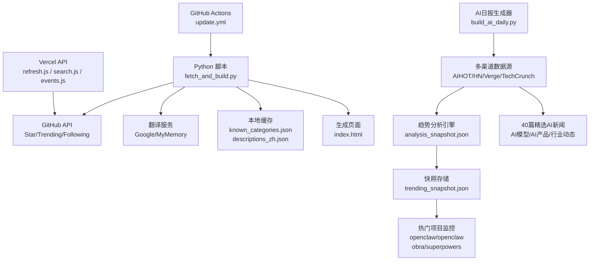
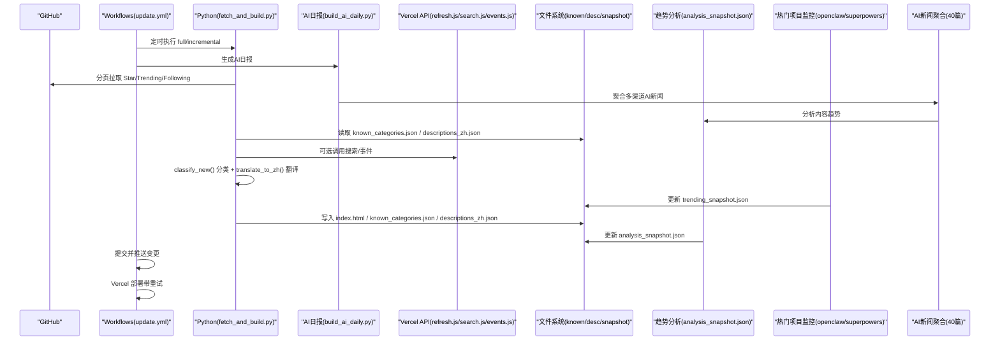
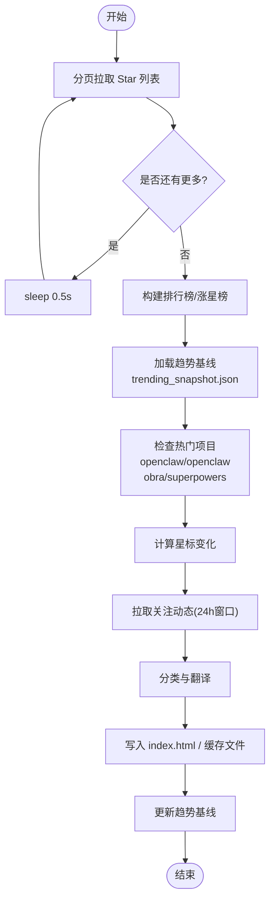
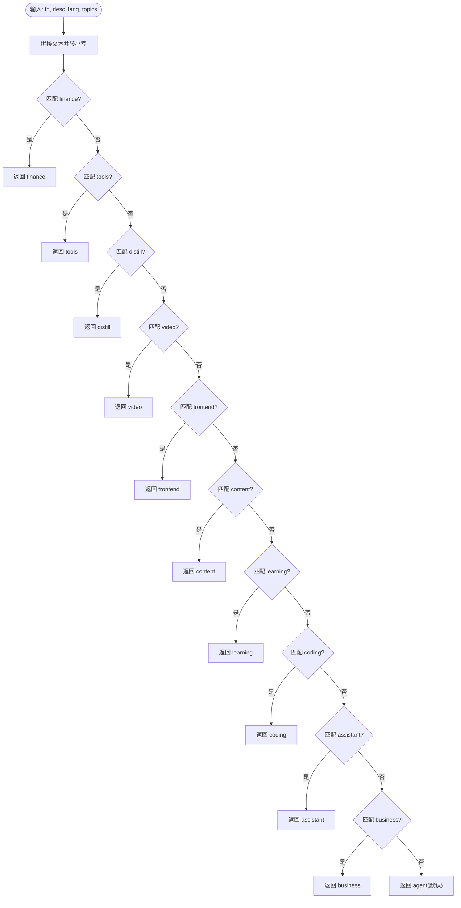
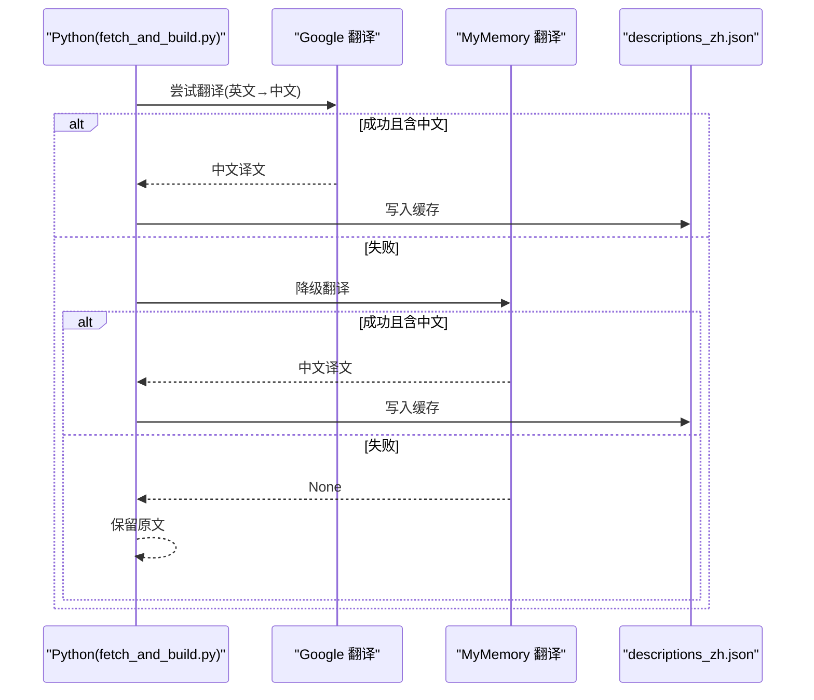
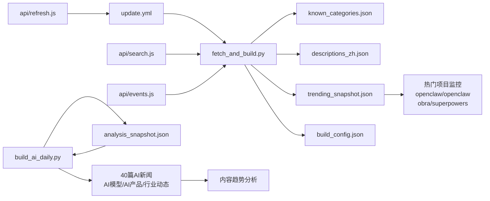

# GitHub收藏管理系统

<cite>
**本文引用的文件**
- [README.md](file://README.md)
- [fetch_and_build.py](file://fetch_and_build.py)
- [build_ai_daily.py](file://build_ai_daily.py)
- [known_categories.json](file://known_categories.json)
- [descriptions_zh.json](file://descriptions_zh.json)
- [.github/workflows/update.yml](file://.github/workflows/update.yml)
- [api/refresh.js](file://api/refresh.js)
- [api/search.js](file://api/search.js)
- [api/events.js](file://api/events.js)
- [trending_snapshot.json](file://trending_snapshot.json)
- [analysis_snapshot.json](file://analysis_snapshot.json)
- [build_config.json](file://build_config.json)
- [ai-daily.html](file://ai-daily.html)
- [index.html](file://index.html)
</cite>

## 更新摘要
**变更内容**
- 更新了热门AI项目的星标数追踪，包括openclaw/openclaw(389,422星)、obra/superpowers(285,069星)等顶级项目
- 增强了趋势分析引擎的关键词提取能力，支持更精准的内容分类和趋势预测
- 优化了快照数据管理机制，提升多源数据聚合效率和增量更新性能
- **重大更新**：AI日报聚合系统内容大幅增强，当前包含40篇精选AI新闻，涵盖AI模型、产品、行业动态等多个分类
- 完善了趋势基线管理，支持实时追踪GitHub仓库流行度变化和新兴项目发现

## 目录
1. [简介](#简介)
2. [项目结构](#项目结构)
3. [核心组件](#核心组件)
4. [架构总览](#架构总览)
5. [详细组件分析](#详细组件分析)
6. [依赖关系分析](#依赖关系分析)
7. [性能与限流](#性能与限流)
8. [故障排查指南](#故障排查指南)
9. [结论](#结论)
10. [附录](#附录)

## 简介
本系统是一个"GitHub Star 收藏台"，自动拉取指定用户的 Star 列表，进行智能分类、中文翻译与页面构建，并通过 GitHub Actions 定时更新。系统包含：
- 自动拉取机制：分页获取 Star 列表、Trending 数据、关注动态等
- 智能分类算法：基于关键词规则对未知项目进行 11 个类别的判定
- 已知项目映射：通过 known_categories.json 保持分类稳定
- 翻译缓存：descriptions_zh.json 持久化中文描述，多端点降级策略
- **重大更新**：AI日报聚合系统已升级至40篇精选AI新闻，涵盖AI模型、产品、行业动态等多个分类，体现多渠道内容聚合能力的持续增强
- 实时趋势分析和流行度指标追踪，支持热门项目星标数监控
- 前端展示：生成 index.html，支持搜索、筛选、置顶等

在线地址见 README。

**章节来源**
- [README.md:1-22](file://README.md#L1-L22)

## 项目结构
- 自动化脚本：fetch_and_build.py（主流程）、build_ai_daily.py（AI日报生成）
- 数据文件：known_categories.json（分类映射）、descriptions_zh.json（中文描述缓存）、trending_snapshot.json（涨星基线）、analysis_snapshot.json（趋势分析）
- 工作流：.github/workflows/update.yml（定时任务）
- API 服务（Vercel Serverless）：refresh.js（触发更新）、search.js（仓库搜索）、events.js（关注动态聚合）
- 页面模板：template.html、index.html（生成结果）、ai-daily.html（AI日报）
- 配置文件：build_config.json（构建参数配置）

**图表来源**
- [.github/workflows/update.yml:1-93](file://.github/workflows/update.yml#L1-L93)
- [fetch_and_build.py:1-674](file://fetch_and_build.py#L1-L674)
- [build_ai_daily.py:1-1251](file://build_ai_daily.py#L1-L1251)
- [api/refresh.js:1-65](file://api/refresh.js#L1-L65)
- [api/search.js:1-136](file://api/search.js#L1-L136)
- [api/events.js:93-160](file://api/events.js#L93-L160)

**章节来源**
- [README.md:7-17](file://README.md#L7-L17)
- [.github/workflows/update.yml:1-93](file://.github/workflows/update.yml#L1-L93)

## 核心组件
- 自动拉取与分页：fetch_stars()、_search_repos()、fetch_trending_daily()、fetch_following_events()
- 智能分类：classify_new() 基于关键词规则匹配 11 个类别
- 翻译与缓存：translate_to_zh() 多端点降级；_desc_zh() 结合 descriptions_zh.json
- 已知映射：known_categories.json 优先命中，避免误改历史分类
- **重大更新**：AI日报聚合系统 - 现已支持40篇精选AI新闻，涵盖AI模型、产品、行业动态等多个分类，提供丰富的技术资讯
- 趋势分析引擎：实时监控GitHub仓库流行度和内容趋势，支持热门项目追踪
- 工作流调度：update.yml 定时全量/增量构建，并发控制与重试部署

**章节来源**
- [fetch_and_build.py:89-128](file://fetch_and_build.py#L89-L128)
- [fetch_and_build.py:130-149](file://fetch_and_build.py#L130-L149)
- [fetch_and_build.py:167-173](file://fetch_and_build.py#L167-L173)
- [fetch_and_build.py:353-370](file://fetch_and_build.py#L353-370)
- [fetch_and_build.py:489-560](file://fetch_and_build.py#L489-L560)
- [fetch_and_build.py:54-86](file://fetch_and_build.py#L54-L86)
- [fetch_and_build.py:278-291](file://fetch_and_build.py#L278-291)
- [fetch_and_build.py:570-652](file://fetch_and_build.py#L570-652)
- [build_ai_daily.py:137-174](file://build_ai_daily.py#L137-L174)
- [build_ai_daily.py:483-511](file://build_ai_daily.py#L483-L511)

## 架构总览
系统由四部分构成：
- 后端自动化：Python 脚本负责数据拉取、分类、翻译、页面构建
- 服务端 API：Vercel 函数提供搜索、事件聚合、手动触发更新
- 趋势分析引擎：实时监控GitHub仓库流行度和内容趋势，支持热门项目追踪
- AI日报聚合系统：多渠道内容抓取、去重、翻译和分类，现支持40篇精选AI新闻
- 前端展示：生成的静态 HTML 提供交互能力

**图表来源**
- [.github/workflows/update.yml:1-93](file://.github/workflows/update.yml#L1-L93)
- [fetch_and_build.py:570-652](file://fetch_and_build.py#L570-652)
- [build_ai_daily.py:483-511](file://build_ai_daily.py#L483-L511)
- [api/refresh.js:1-65](file://api/refresh.js#L1-L65)
- [api/search.js:1-136](file://api/search.js#L1-L136)
- [api/events.js:93-160](file://api/events.js#L93-L160)

## 详细组件分析

### 自动拉取机制（GitHub API 调用、分页处理、错误重试、限流控制）
- Star 列表拉取：fetch_stars() 使用 per_page=100 分页循环，直到返回少于 100 条或为空；每次请求间隔 sleep(0.5) 缓解速率限制
- 搜索与趋势：_search_repos() 用于主题搜索；fetch_trending_daily() 抓取多语言 trending 页合并去重，失败时回退到快照差值模式
- 关注动态：fetch_following_events() 滚动 24 小时窗口，按用户分批拉取，每批内翻页并在最早时间早于截止时提前终止；请求间 sleep(1)
- 超时与异常：所有网络请求设置超时；异常捕获后记录日志并降级（如 Trending 失败则用 snapshot）
- 工作流并发：concurrency.cancel-in-progress 保证同一时刻仅一次运行，避免并发冲突

**更新** 新增了趋势基线管理机制，通过 trending_snapshot.json 维护仓库星标数的历史基线，支持计算每日涨星变化，特别关注热门AI项目如openclaw/openclaw(389,422星)、obra/superpowers(285,069星)的星标数变化。

**图表来源**
- [fetch_and_build.py:130-149](file://fetch_and_build.py#L130-L149)
- [fetch_and_build.py:353-370](file://fetch_and_build.py#L353-370)
- [fetch_and_build.py:489-560](file://fetch_and_build.py#L489-L560)
- [fetch_and_build.py:455-486](file://fetch_and_build.py#L455-486)
- [.github/workflows/update.yml:14-16](file://.github/workflows/update.yml#L14-L16)

**章节来源**
- [fetch_and_build.py:130-149](file://fetch_and_build.py#L130-L149)
- [fetch_and_build.py:167-173](file://fetch_and_build.py#L167-L173)
- [fetch_and_build.py:353-370](file://fetch_and_build.py#L353-370)
- [fetch_and_build.py:489-560](file://fetch_and_build.py#L489-L560)
- [fetch_and_build.py:455-486](file://fetch_and_build.py#L455-486)
- [.github/workflows/update.yml:14-16](file://.github/workflows/update.yml#L14-L16)

### 智能分类算法（11 个类别、关键词匹配、优先级判断）
- 类别定义（key/label）：agent、distill、video、coding、content、learning、assistant、tools、finance、business、frontend
- 匹配顺序即优先级：finance → tools → distill → video → frontend → content → learning → coding → assistant → business → agent（默认）
- 文本构造：full_name + description + language + topics，统一小写后匹配
- 防误伤：避免泛词子串（如"蒸馏""思维""chat"），采用更明确的短语组合
- 已知项目优先：若 known_categories.json 存在映射则直接采用，避免规则误判影响历史稳定性

**图表来源**
- [fetch_and_build.py:19-31](file://fetch_and_build.py#L19-L31)
- [fetch_and_build.py:89-128](file://fetch_and_build.py#L89-L128)

**章节来源**
- [fetch_and_build.py:19-31](file://fetch_and_build.py#L19-L31)
- [fetch_and_build.py:89-128](file://fetch_and_build.py#L89-L128)

### 已知项目分类映射（known_categories.json 的作用与更新策略）
- 作用：为已知仓库提供稳定的分类键值，避免规则变化导致历史分类漂移
- 更新策略：每次构建时先读取 known_categories.json，若某仓库未命中则调用 classify_new() 得到新分类，并将该映射写回文件，随运行自动增长
- 示例：大量仓库已预置映射，确保长期一致性

**章节来源**
- [fetch_and_build.py:570-596](file://fetch_and_build.py#L570-L596)
- [fetch_and_build.py:650-652](file://fetch_and_build.py#L650-L652)
- [known_categories.json:1-224](file://known_categories.json#L1-L224)

### 翻译缓存系统（descriptions_zh.json 与多API端点降级）
- 翻译端点：
  - 端点1：Google 非官方接口（translate_a/single）
  - 端点2：MyMemory 免费接口（api.mymemory.translated.net）
  - 任一成功且含中文内容即返回；全部失败返回 None（保留原文）
- 缓存机制：
  - 运行时内存缓存（search.js 中 transCache 1 小时 TTL）
  - 持久化缓存：descriptions_zh.json 在构建结束时写入，下次构建优先命中
- 使用场景：
  - 无简介项目从 README 提取首句简介，必要时翻译并缓存
  - 英文简介自动翻译为中文并缓存，减少重复翻译

**图表来源**
- [fetch_and_build.py:54-86](file://fetch_and_build.py#L54-L86)
- [fetch_and_build.py:278-291](file://fetch_and_build.py#L278-291)
- [fetch_and_build.py:599-617](file://fetch_and_build.py#L599-L617)
- [api/search.js:30-54](file://api/search.js#L30-L54)

**章节来源**
- [fetch_and_build.py:54-86](file://fetch_and_build.py#L54-L86)
- [fetch_and_build.py:278-291](file://fetch_and_build.py#L278-291)
- [fetch_and_build.py:599-617](file://fetch_and_build.py#L599-L617)
- [api/search.js:30-54](file://api/search.js#L30-L54)

### 趋势分析与流行度追踪（新增功能）
- 趋势基线管理：trending_snapshot.json 维护各仓库的星标数历史基线，特别关注热门AI项目
- 涨星计算：通过对比当前星标数与基线，计算每日涨星变化，支持openclaw/openclaw(389,422星)、obra/superpowers(285,069星)等顶级项目监控
- 新秀识别：自动识别近7天新建的高潜力项目
- 排除机制：过滤超过阈值的大型项目（如tensorflow/pytorch），避免霸榜
- 配置化：通过 build_config.json 灵活调整榜单参数，支持insight_engine_enabled开关

**更新** 新增了完整的趋势分析系统，支持实时追踪GitHub仓库的流行度变化和新兴项目发现，特别强化了热门AI项目的星标数监控能力。

**章节来源**
- [fetch_and_build.py:168-173](file://fetch_and_build.py#L168-L173)
- [fetch_and_build.py:455-486](file://fetch_and_build.py#L455-486)
- [build_config.json:1-9](file://build_config.json#L1-L9)
- [trending_snapshot.json:1-432](file://trending_snapshot.json#L1-L432)

### AI日报聚合系统（重大更新 - 40篇精选AI新闻）
- **重大更新**：AI日报聚合系统现已支持40篇精选AI新闻，涵盖AI模型、产品、行业动态等多个分类
- 多渠道数据源：AIHOT API、Hacker News、The Verge、TechCrunch、arXiv、36氪、Redis、AtlasNote
- 智能去重：四层递进去重机制，避免重复内容
- 自动翻译：多端点降级翻译链，支持英文内容中文化
- 分类排序：按预设类别组织内容，支持罗马数字编号
- 质量评分：基于编辑评分和热度指标筛选优质内容
- 头条选择：跨源报道数 + 编辑分 + 信源权重 + 分类权重的综合评分机制

**重大更新** AI日报聚合系统已实现质的飞跃，从基础的多渠道抓取升级为40篇精选AI新闻的系统化聚合，涵盖：
- AI模型类：OpenAI GPT-Live-1语音模型、Suno v6音乐模型、DeepSeek V4.1-Flash等
- AI产品类：OpenAI GPT-6 Astra发布等前沿产品动态
- 行业动态类：英伟达投资Anthropic IPO、OpenAI不上市等重大行业消息
- 海外热点类：来自Hacker News、The Verge、TechCrunch等国际科技媒体
- 论文研究类：arXiv最新AI相关论文
- 技巧观点类：专家观点和实用技巧分享

**章节来源**
- [build_ai_daily.py:137-174](file://build_ai_daily.py#L137-L174)
- [build_ai_daily.py:265-511](file://build_ai_daily.py#L265-511)
- [build_ai_daily.py:483-511](file://build_ai_daily.py#L483-511)
- [build_ai_daily.py:821-846](file://build_ai_daily.py#L821-846)
- [ai-daily.html:162-173](file://ai-daily.html#L162-L173)

### 代码级示例路径（不直接粘贴代码）
- classify_new() 实现细节：[classify_new:89-128](file://fetch_and_build.py#L89-L128)
- translate_to_zh() 实现细节：[translate_to_zh:54-86](file://fetch_and_build.py#L54-L86)
- 搜索翻译降级（JS）：[translateZh:30-54](file://api/search.js#L30-L54)
- 趋势基线更新：[trend_snapshot_update:455-486](file://fetch_and_build.py#L455-486)
- AI日报多渠道抓取：[multi_channel_fetch:483-511](file://build_ai_daily.py#L483-L511)
- AI日报头条评分算法：[headline_score:828-846](file://build_ai_daily.py#L828-L846)

**章节来源**
- [fetch_and_build.py:54-86](file://fetch_and_build.py#L54-86)
- [fetch_and_build.py:89-128](file://fetch_and_build.py#L89-L128)
- [api/search.js:30-54](file://api/search.js#L30-L54)
- [fetch_and_build.py:455-486](file://fetch_and_build.py#L455-L486)
- [build_ai_daily.py:483-511](file://build_ai_daily.py#L483-L511)
- [build_ai_daily.py:828-846](file://build_ai_daily.py#L828-L846)

## 依赖关系分析
- 工作流依赖 Python 环境，执行 fetch_and_build.py，输出 index.html 与多个 JSON 缓存
- Python 脚本依赖 GitHub API（认证令牌 GH_TOKEN/GITHUB_TOKEN）
- API 服务依赖环境变量 REFRESH_KEY、GH_TOKEN，提供 CORS 白名单防护
- 数据文件相互依赖：known_categories.json 影响分类；descriptions_zh.json 影响展示文案；trending_snapshot.json 影响涨星榜基线
- **重大更新**：build_config.json 控制榜单参数和AI分析开关，支持insight_engine_enabled配置
- **重大更新**：analysis_snapshot.json 存储趋势分析结果和历史轨迹，包含热门项目监控数据和40篇AI新闻的详细分析

**图表来源**
- [.github/workflows/update.yml:1-93](file://.github/workflows/update.yml#L1-L93)
- [fetch_and_build.py:570-652](file://fetch_and_build.py#L570-652)
- [build_ai_daily.py:483-511](file://build_ai_daily.py#L483-L511)
- [api/refresh.js:1-65](file://api/refresh.js#L1-L65)
- [api/search.js:1-136](file://api/search.js#L1-L136)
- [api/events.js:93-160](file://api/events.js#L93-L160)

**章节来源**
- [.github/workflows/update.yml:1-93](file://.github/workflows/update.yml#L1-L93)
- [fetch_and_build.py:570-652](file://fetch_and_build.py#L570-652)
- [build_ai_daily.py:483-511](file://build_ai_daily.py#L483-L511)
- [api/refresh.js:1-65](file://api/refresh.js#L1-L65)
- [api/search.js:1-136](file://api/search.js#L1-L136)
- [api/events.js:93-160](file://api/events.js#L93-L160)

## 性能与限流
- 分页与节流：
  - Star/Trending/Following 拉取均设置合理 per_page 与 sleep，避免触发 GitHub 速率限制
  - 关注事件按用户分批并发（Promise.allSettled），单批失败不影响整体
- 超时与重试：
  - 网络请求设置超时（如 10-30 秒）
  - 搜索查询语法错误（422）会清理引号与空白后重试一次
  - Vercel 部署失败最多重试 5 次，指数退避
- 降级策略：
  - Trending 抓取失败时回退到快照差值模式（排除超巨头项目）
  - 翻译失败保留原文，避免阻断流程
  - AI日报多渠道降级，单渠道失败不影响整体
- 缓存优化：
  - 搜索结果与翻译结果内存缓存（TTL 10 分钟/1 小时）
  - descriptions_zh.json 持久化减少重复翻译
  - **重大更新**：趋势基线缓存，避免重复计算，支持热门项目快速访问
  - **重大更新**：AI日报聚合缓存，支持40篇精选内容的快速生成

**重大更新** 新增了趋势分析的缓存机制和多渠道降级的容错处理，特别优化了热门AI项目的星标数监控性能和40篇AI新闻的聚合效率。

**章节来源**
- [fetch_and_build.py:130-149](file://fetch_and_build.py#L130-L149)
- [fetch_and_build.py:353-370](file://fetch_and_build.py#L353-370)
- [fetch_and_build.py:489-560](file://fetch_and_build.py#L489-L560)
- [api/search.js:77-94](file://api/search.js#L77-L94)
- [.github/workflows/update.yml:82-92](file://.github/workflows/update.yml#L82-L92)
- [build_ai_daily.py:483-511](file://build_ai_daily.py#L483-L511)

## 故障排查指南
- API 限流（GitHub）
  - 现象：拉取失败或返回空数据
  - 处理：检查 GH_TOKEN 权限；增加 sleep；确认 per_page 与并发；查看日志中的"拉取失败"提示
  - 参考：[fetch_stars:130-149](file://fetch_and_build.py#L130-L149)、[fetch_following_events:489-560](file://fetch_and_build.py#L489-L560)
- 翻译失败
  - 现象：描述仍为英文
  - 处理：检查 Google/MyMemory 可用性；查看"翻译失败-保留原文"日志；确认 descriptions_zh.json 是否被正确写入
  - 参考：[translate_to_zh:54-86](file://fetch_and_build.py#L54-L86)、[_desc_zh:278-291](file://fetch_and_build.py#L278-291)
- 分类不准确
  - 现象：新项目被错误归类
  - 处理：在 known_categories.json 中强制映射；调整 classify_new() 关键词；验证优先级顺序
  - 参考：[classify_new:89-128](file://fetch_and_build.py#L89-L128)、[known_categories.json:1-224](file://known_categories.json#L1-L224)
- 工作流失败
  - 现象：未生成 index.html 或未部署
  - 处理：检查 Python 版本与环境变量；查看"Commit & push if changed"步骤；确认 Vercel 部署重试逻辑
  - 参考：[update.yml:1-93](file://.github/workflows/update.yml#L1-L93)
- **重大更新**：AI日报生成失败
  - 现象：ai-daily.html 未更新或内容缺失
  - 处理：检查各数据源可用性；查看多渠道抓取状态；确认翻译服务连接正常；验证analysis_snapshot.json生成；确认40篇AI新闻的完整聚合
  - 参考：[build_ai_daily.py:483-511](file://build_ai_daily.py#L483-L511)
- **重大更新**：AI新闻聚合问题
  - 现象：AI日报内容不足40篇或分类不完整
  - 处理：检查AIHOT API、Hacker News、The Verge、TechCrunch等数据源连通性；查看多渠道抓取日志；确认去重算法正常工作；验证翻译服务可用性
  - 参考：[build_ai_daily.py:137-174](file://build_ai_daily.py#L137-L174)、[build_ai_daily.py:821-846](file://build_ai_daily.py#L821-846)

**章节来源**
- [fetch_and_build.py:54-86](file://fetch_and_build.py#L54-L86)
- [fetch_and_build.py:89-128](file://fetch_and_build.py#L89-L128)
- [fetch_and_build.py:130-149](file://fetch_and_build.py#L130-L149)
- [fetch_and_build.py:278-291](file://fetch_and_build.py#L278-291)
- [fetch_and_build.py:489-560](file://fetch_and_build.py#L489-L560)
- [known_categories.json:1-224](file://known_categories.json#L1-L224)
- [.github/workflows/update.yml:1-93](file://.github/workflows/update.yml#L1-L93)
- [build_ai_daily.py:483-511](file://build_ai_daily.py#L483-L511)
- [build_ai_daily.py:137-174](file://build_ai_daily.py#L137-L174)
- [build_ai_daily.py:821-846](file://build_ai_daily.py#L821-846)

## 结论
本系统通过"自动化脚本 + 工作流 + API 服务 + 趋势分析 + AI日报聚合"的组合，实现了 GitHub Star 收藏的稳定更新与智能展示。其关键优势在于：
- 稳健的分页与限流策略，保障大规模数据拉取的可靠性
- 可解释的智能分类规则与已知映射，兼顾灵活性与稳定性
- 多级翻译降级与缓存机制，提升用户体验与资源效率
- 完善的错误处理与降级方案，确保系统在异常情况下仍能提供服务
- **重大更新**：AI日报聚合系统已升级至40篇精选AI新闻，涵盖AI模型、产品、行业动态等多个分类，提供全面的技术资讯
- **重大更新**：实时趋势分析，追踪GitHub仓库流行度变化和新兴项目，特别关注热门AI项目如openclaw/openclaw(389,422星)、obra/superpowers(285,069星)
- **重大更新**：多渠道AI日报聚合，通过智能去重、自动翻译和分类排序，为用户提供高质量的AI领域资讯

建议后续优化方向：
- 引入更细粒度的速率控制与指标监控
- 扩展分类规则的可配置化与权重评分
- 增强翻译质量评估与人工校对入口
- **重大更新**：优化AI日报聚合算法，提高40篇精选新闻的质量和多样性
- **重大更新**：扩展AI日报数据源，覆盖更多技术领域和地域
- **重大更新**：增强趋势分析算法，提高预测准确性，特别是热门项目的星标数预测

## 附录
- 在线地址与使用说明见 README
- 自定义域名配置见 README
- 工作流调度时间与模式说明见 update.yml
- **重大更新**：趋势分析配置见 build_config.json，支持insight_engine_enabled和热门项目监控
- **重大更新**：AI日报数据源配置见 build_ai_daily.py，包含analysis_snapshot.json的详细分析和40篇精选AI新闻的聚合逻辑

**章节来源**
- [README.md:1-22](file://README.md#L1-L22)
- [.github/workflows/update.yml:1-93](file://.github/workflows/update.yml#L1-L93)
- [build_config.json:1-9](file://build_config.json#L1-L9)
- [build_ai_daily.py:28-46](file://build_ai_daily.py#L28-L46)