# RSS内容聚合系统

<cite>
**本文引用的文件**
- [api/rss.js](file://api/rss.js)
- [api/article.js](file://api/article.js)
- [build_rss_aggregator.py](file://build_rss_aggregator.py)
- [rss-aggregator.html](file://rss-aggregator.html)
- [build_config.json](file://build_config.json)
- [t1_sources.json](file://t1_sources.json)
- [known_categories.json](file://known_categories.json)
- [vercel.json](file://vercel.json)
- [build_logger.py](file://build_logger.py)
- [api/build_log.js](file://api/build_log.js)
- [template.html](file://template.html)
- [.gitignore](file://.gitignore)
- [.vercelignore](file://.vercelignore)
- [hot_snapshot.json](file://hot_snapshot.json)
- [fetch_and_build.py](file://fetch_and_build.py)
- [build_ai_daily.py](file://build_ai_daily.py)
- [bestblogs_analysis.json](file://bestblogs_analysis.json)
- [_check_online_labels.py](file://_check_online_labels.py)
- [.github/workflows/update.yml](file://.github/workflows/update.yml)
- [build_logs/summary_2026-09-09.json](file://build_logs/summary_2026-09-09.json)
- [insight_engine.py](file://insight_engine.py)
- [analysis_snapshot.json](file://analysis_snapshot.json)
- [test_insight_engine.py](file://test_insight_engine.py)
- [_new_report_generator.py](file://_new_report_generator.py)
- [_new_report_generator_v2.py](file://_new_report_generator_v2.py)
- [_new_build_pages.py](file://_new_build_pages.py)
- [_new_build_pages_v2.py](file://_new_build_pages_v2.py)
- [_test_report.json](file://_test_report.json)
- [docs/superpowers/specs/2026-09-12-source-keyword-pool-design.md](file://docs/superpowers/specs/2026-09-12-source-keyword-pool-design.md)
</cite>

## 更新摘要
**所做更改**
- **新增分源关键词池机制**：实现了RSS和热榜关键词的分离提取，提升语义分析的相关性评分从0.6到0.8+
- **增强检索上下文对齐**：通过混合查询策略（簇标签 + 簇内条目 + RSS关键词）防止检索偏移，确保与关键词匹配的文档召回
- **改进话题覆盖范围**：通过更广泛的查询构建和层级索引检索，扩展了话题分析的覆盖面
- **优化集群查询集成**：将RSS关键词正确集成到基于集群的查询中，保持上下文准确性
- **修复偏移错误**：通过top_kw_for_retrieval机制防止纯簇内条目导致的检索偏移问题

## 目录
1. [简介](#简介)
2. [项目结构](#项目结构)
3. [核心组件](#核心组件)
4. [架构总览](#架构总览)
5. [详细组件分析](#详细组件分析)
6. [依赖关系分析](#依赖关系分析)
7. [性能与缓存策略](#性能与缓存策略)
8. [故障排查指南](#故障排查指南)
9. [结论](#结论)
10. [附录：关键流程与代码片段路径](#附录：关键流程与代码片段路径)

## 简介
本系统是一个经过重大升级的多源RSS内容聚合平台，在保持"卡片墙 + 抽屉阅读器"基础界面体验的同时，集成了增强的跨平台数据兼容性、72小时历史管理和源可靠性检测功能。**最新重大升级**：系统集成了LlamaIndex驱动的语义分析引擎，采用多语言模型（BAAI/bge-small-zh-en-v1.5）实现更精准的内容分析和聚类，同时保留了统计方法的降级机制以确保系统稳定性。**全新特性**：新增RSS轨迹追踪系统，能够监控关键词生命周期模式，识别新兴话题并提供趋势分析。

**核心特性**：
- 基础RSS源管理（T1/T2/T3分层）
- XML解析和内容提取
- 基础翻译功能
- 分类浏览和搜索
- 缓存和去重机制
- **响应式用户界面**：全面优化的移动端体验，包括下拉菜单、搜索框、分类按钮和排序控件的移动端适配
- **新增**：LlamaIndex语义分析引擎（多语言模型支持）
- **新增**：增强的跨平台内容相似度检测（嵌入向量方法）
- **新增**：改进的主题聚类算法和中文文本处理
- **新增**：72小时内容历史管理增强
- **新增**：源可靠性检测和bad_date标记
- **新增**：RSS轨迹追踪系统（关键词生命周期监控）
- **新增**：新兴话题检测与跟踪
- **新增**：SiliconFlow API与fastembed回退机制
- **增强**：智能降级机制，确保系统稳定性
- **新增**：四层级标签提取策略（LCS分析、n-gram IDF加权、英文高频词处理、智能回退）
- **新增**：结构化HTML报告生成系统（多类别智能内容选择）
- **新增**：分源关键词池机制（RSS关键词与热榜关键词分离）
- **新增**：增强检索上下文对齐（混合查询策略防止检索偏移）

## 项目结构
- 前端页面：rss-aggregator.html（用户界面、交互、响应式布局，包含洞察面板和移动端优化）
- 主入口页面：index.html（主界面）
- 后端API：
  - api/rss.js：RSS聚合主入口（缓存、快照、并发抓取、合并）
  - api/article.js：全文提取API（YouTube/GitHub/通用文章）
- 构建脚本：build_rss_aggregator.py（批量抓取、翻译、历史累积、生成静态HTML，集成语义分析引擎）
- **新增**：报告生成器：_new_report_generator.py和_new_report_generator_v2.py（结构化HTML报告生成）
- **新增**：构建脚本：_new_build_pages.py和_new_build_pages_v2.py（JSON到HTML的构建流程）
- 语义分析引擎：insight_engine.py（LlamaIndex驱动的智能分析，支持SiliconFlow API）
- 日志系统：build_logger.py（JSONL格式构建日志管理）
- 配置数据：
  - t1_sources.json：T1高优先级信源列表
  - known_categories.json：已知分类映射
  - vercel.json：Serverless函数超时配置
  - build_config.json：分析功能开关配置（包含insight_*配置）
- 模板系统：template.html（构建时生成的静态页面模板）
- 热点数据：hot_snapshot.json（多平台热门内容快照）
- **新增**：RSS轨迹历史数据（rss_trend_history.json）

```mermaid
graph TB
UI["浏览器<br/>rss-aggregator.html<br/>增强版界面<br/>移动端优化"] --> API_RSS["/api/rss.js<br/>聚合接口"]
API_RSS --> SNAP["rss_api_snapshot.json<br/>构建时快照"]
API_RSS --> SRC["rss_sources.json<br/>源列表"]
API_RSS --> FETCH["HTTP抓取RSS/Atom/RDF"]
API_RSS --> TRANSLATE["基础翻译功能<br/>Google Translate/Memory/Bing"]
API_RSS --> CACHE["滚动缓存/完整响应缓存<br/>TTL过期清理"]
UI --> API_ARTICLE["/api/article.js<br/>全文提取"]
API_ARTICLE --> SNAP
API_ARTICLE --> HTTP["目标站点抓取"]
BUILD["构建脚本<br/>build_rss_aggregator.py<br/>集成语义分析引擎"] --> LOG["构建日志<br/>build_logs/*.jsonl"]
LOG --> BUILD_LOGGER["build_logger.py<br/>日志管理"]
BUILD_LOGGER --> BUILD_API["/api/build_log.js<br/>日志查询"]
BUILD --> CACHE_FILE["rss_cache.json<br/>本地构建缓存"]
BUILD --> HOT_DATA["hot_snapshot.json<br/>多平台热门内容"]
BUILD --> SEMANTIC["语义分析引擎<br/>insight_engine.py<br/>LlamaIndex + 多语言模型"]
SEMANTIC --> EMBEDDING["嵌入向量<br/>BAAI/bge-small-zh-en-v1.5"]
SEMANTIC --> SILICONFLOW["SiliconFlow API<br/>bge-m3模型"]
SEMANTIC --> CLUSTERING["增强聚类算法<br/>中文文本处理"]
BUILD --> CROSS_PLATFORM["跨平台相似度检测<br/>嵌入向量方法"]
BUILD --> RELIABILITY["源可靠性检测<br/>bad_date标记"]
BUILD --> TRAJECTORY["RSS轨迹追踪<br/>关键词生命周期监控"]
TRAJECTORY --> HISTORY["趋势历史数据<br/>rss_trend_history.json"]
BUILD --> TAG_EXTRACT["四层级标签提取<br/>LCS分析 + n-gram IDF"]
TAG_EXTRACT --> CLEANING["文本清理<br/>停用词过滤"]
TAG_EXTRACT --> TOKENIZE["边界感知令牌处理<br/>术语词典匹配"]
BUILD --> REPORT_GEN["报告生成器<br/>_new_report_generator*.py<br/>结构化HTML报告"]
REPORT_GEN --> HTML_TEMPLATE["StarHub风格模板<br/>响应式设计"]
REPORT_GEN --> MULTI_CAT["多类别内容选择<br/>技术趋势/资本/研究等"]
SEMANTIC --> KEYWORD_POOL["分源关键词池<br/>RSS关键词 + 热榜关键词"]
KEYWORD_POOL --> CONTEXT_ALIGN["检索上下文对齐<br/>混合查询策略"]
CONTEXT_ALIGN --> RETRIEVAL["层级索引检索<br/>小索引大窗口"]
```

**图表来源**
- [api/rss.js:1-545](file://api/rss.js#L1-L545)
- [api/article.js:1-203](file://api/article.js#L1-L203)
- [build_rss_aggregator.py:5800-6100](file://build_rss_aggregator.py#L5800-L6100)
- [insight_engine.py:1-746](file://insight_engine.py#L1-L746)
- [build_logger.py:1-96](file://build_logger.py#L1-L96)
- [api/build_log.js:42-74](file://api/build_log.js#L42-L74)
- [vercel.json:1-13](file://vercel.json#L1-L13)
- [rss-aggregator.html:1-200](file://rss-aggregator.html#L1-L200)
- [hot_snapshot.json:1-332](file://hot_snapshot.json#L1-L332)
- [_new_report_generator.py:1-279](file://_new_report_generator.py#L1-L279)
- [_new_report_generator_v2.py:1-770](file://_new_report_generator_v2.py#L1-L770)

章节来源
- [vercel.json:1-13](file://vercel.json#L1-L13)
- [.gitignore:10](file://.gitignore#L10)
- [.vercelignore:2](file://.vercelignore#L2)

## 核心组件
- RSS聚合API（api/rss.js）
  - 支持RSS/Atom双格式解析
  - 并发抓取与超时控制（CONCURRENCY=20，FETCH_TIMEOUT=5s）
  - 多层缓存（滚动缓存、完整响应缓存、构建快照）
  - 基础英文翻译（Google/Memory/Dict/Bing降级链）
  - 72小时时间窗过滤与合并
- 全文提取API（api/article.js）
  - 针对YouTube、GitHub及通用网页的内容抽取
  - 基于Readability的通用解析
  - 本地内存缓存与快照内容映射
- 构建器（build_rss_aggregator.py）
  - 批量抓取、翻译、历史累积（72h）、去重
  - **新增**：集成LlamaIndex语义分析引擎
  - **新增**：智能降级机制，确保系统稳定性
  - **增强**：改进的72小时历史管理机制
  - **增强**：源可靠性检测和bad_date标记
  - **增强**：改进的日期验证和时区处理
  - **新增**：RSS轨迹追踪系统
  - **新增**：四层级标签提取策略
- **新增**：报告生成器（_new_report_generator.py/_new_report_generator_v2.py）
  - **新增**：结构化HTML报告生成，直接输出完整页面
  - **新增**：多类别智能内容选择算法（技术趋势、资金流向、研究论文、产品宝石、社区讨论、洞察）
  - **新增**：四端点免费翻译降级链（Google gtx → Bing → MyMemory → Google dict-chrome）
  - **新增**：StarHub风格响应式模板，支持明暗主题
  - **新增**：Emoji清理和文本标准化处理
- 语义分析引擎（insight_engine.py）
  - **新增**：LlamaIndex驱动的语义分析流水线
  - **新增**：多语言模型支持（BAAI/bge-small-zh-en-v1.5）
  - **新增**：增强的聚类算法和中文文本处理
  - **新增**：跨平台内容相似度检测（嵌入向量方法）
  - **新增**：深度洞察生成和趋势分析
  - **新增**：SiliconFlow API与本地fastembed回退机制
  - **新增**：四层级标签提取策略（LCS分析、n-gram IDF加权、英文高频词处理、智能回退）
  - **新增**：分源关键词池机制（RSS关键词与热榜关键词分离提取）
  - **新增**：增强检索上下文对齐（混合查询策略防止检索偏移）
- 日志系统（build_logger.py）
  - JSONL格式构建日志管理
  - 支持按日期、类型过滤和分页查询
  - 生成每日摘要统计
- 前端（rss-aggregator.html）
  - 卡片墙瀑布流、分类标签、全局搜索、排序
  - **移动端界面优化**：下拉菜单内边距和字体大小修复、搜索框突出显示、分类按钮品牌色填充、排序下拉框宽度适配
  - **新增**：洞察面板显示语义分析结果
  - **新增**：跨平台共振展示
  - **增强**：增强的主题信息展示系统
  - **保留**：基础的主题切换、未读标记、收藏、分享功能
  - **保留**：响应式布局和用户体验优化

章节来源
- [api/rss.js:1-545](file://api/rss.js#L1-L545)
- [api/article.js:1-203](file://api/article.js#L1-L203)
- [build_rss_aggregator.py:5800-6100](file://build_rss_aggregator.py#L5800-L6100)
- [_new_report_generator.py:1-279](file://_new_report_generator.py#L1-L279)
- [_new_report_generator_v2.py:1-770](file://_new_report_generator_v2.py#L1-L770)
- [insight_engine.py:1-746](file://insight_engine.py#L1-L746)
- [build_logger.py:1-96](file://build_logger.py#L1-L96)
- [rss-aggregator.html:1-200](file://rss-aggregator.html#L1-L200)

## 架构总览
系统采用"语义分析引擎优先 + 统计方法降级"的分层架构，通过集成LlamaIndex语义分析引擎，显著提升了内容分析质量和跨平台内容检测能力。**最新重大升级**：引入了分源关键词池机制和增强检索上下文对齐，解决了关键词与检索上下文不匹配的问题。**新增RSS轨迹追踪系统**进一步增强了趋势分析能力：**新增的报告生成系统**提供了结构化的HTML报告输出能力。**最新的移动端界面优化**确保了在各种设备上的良好用户体验。

- 构建期：Python脚本批量抓取RSS/Atom/RDF，翻译、清洗、去重，调用insight_engine进行语义分析，执行跨平台相似度检测、源可靠性检测和bad_date标记，同时生成RSS轨迹历史数据和结构化报告数据。
- 运行期：
  - /api/rss.js优先返回快照（包含72小时历史），若请求带refresh=1或快照不可用则回退到实时抓取。
  - T1源实时抓取，T2/T3源从快照读取。
  - 结果按分类、时间、关键词等在前端展示。
  - /api/article.js为单篇文章全文提取服务，优先命中快照中的fullContent，否则抓取目标页并解析。
  - **新增**：报告生成器将结构化数据转换为完整的HTML页面，支持多类别内容展示。
  - **移动端优化**：响应式设计确保在不同屏幕尺寸下的最佳显示效果。

**语义分析引擎特点**：
- 多语言模型支持：使用BAAI/bge-small-zh-en-v1.5模型，同时处理中英文内容
- 增强的聚类算法：基于嵌入向量的相似性计算，提升聚类准确性
- 智能降级机制：当语义分析引擎不可用时，自动回退到统计方法
- 跨平台内容检测：通过嵌入向量计算不同平台内容的相似度
- 深度洞察生成：利用LLM生成分析报告和趋势预测
- **新增**：SiliconFlow API集成：提供高性能的嵌入向量服务，支持bge-m3模型
- **新增**：本地fastembed回退：当API不可用时自动切换到本地模型
- **新增**：四层级标签提取策略：基于LCS分析、中文n-gram IDF加权、英文高频词处理和智能回退机制
- **新增**：分源关键词池机制：RSS关键词与热榜关键词分离提取，提升相关性评分
- **新增**：增强检索上下文对齐：混合查询策略防止检索偏移，确保上下文准确性

**报告生成系统特点**：
- **新增**：直接HTML输出：无需中间格式，直接从情报数据生成完整HTML页面
- **新增**：多类别智能选择：技术趋势、资金流向、研究论文、产品宝石、社区讨论、洞察
- **新增**：免费翻译降级链：四端点翻译服务，确保无API密钥时的可用性
- **新增**：StarHub风格设计：响应式模板，支持明暗主题切换
- **新增**：Emoji清理：自动去除表情符号，保证内容整洁

```mermaid
sequenceDiagram
participant U as "用户"
participant H as "rss-aggregator.html<br/>增强版界面<br/>移动端优化"
participant R as "/api/rss.js"
participant S as "rss_api_snapshot.json"
participant F as "RSS源站"
participant A as "/api/article.js"
participant IE as "insight_engine.py<br/>语义分析引擎"
participant RG as "报告生成器<br/>_new_report_generator*.py"
participant SF as "SiliconFlow API"
participant TR as "RSS轨迹追踪"
participant TE as "四层级标签提取"
participant KP as "分源关键词池<br/>关键词池机制"
U->>H : 打开页面移动端/桌面端
H->>R : GET /api/rss (可带 refresh=1)
alt 有快照且非刷新
R->>S : 读取快照
S-->>R : 返回sources/items
R-->>H : JSON(带X-RSS-Source : snapshot)
else 无快照或刷新
R->>F : 并发抓取T1源(RSS/Atom/RDF)
F-->>R : XML
R->>R : 解析/清洗/翻译/过滤
R-->>H : JSON(带X-RSS-Cache : miss)
end
U->>H : 点击某条目移动端优化交互
H->>A : GET /api/article=url=...
alt 快照中有全文
A-->>H : {ok : true, title, content}
else 需要抓取
A->>目标站 : 抓取HTML
A-->>H : {ok : true/false, ...}
end
Note over R,A,IE,SF,TR,TE,KP,RG : 构建时调用语义分析引擎和报告生成器
Note over IE,KP : 分源关键词池机制<br/>RSS关键词与热榜关键词分离
Note over IE,SF : SiliconFlow API与本地fastembed回退
Note over TR : RSS轨迹追踪与生命周期分析
Note over TE : 四层级标签提取策略
Note over KP : 检索上下文对齐<br/>混合查询策略防止偏移
Note over RG : 多类别智能内容选择和HTML渲染
```

**图表来源**
- [api/rss.js:289-545](file://api/rss.js#L289-L545)
- [api/article.js:125-203](file://api/article.js#L125-L203)
- [build_rss_aggregator.py:5800-6100](file://build_rss_aggregator.py#L5800-L6100)
- [insight_engine.py:649-746](file://insight_engine.py#L649-L746)
- [insight_engine.py:244-298](file://insight_engine.py#L244-L298)
- [_new_report_generator.py:115-279](file://_new_report_generator.py#L115-L279)
- [_new_report_generator_v2.py:590-770](file://_new_report_generator_v2.py#L590-L770)

## 详细组件分析

### 1) RSS源配置与管理
- 源列表管理
  - 运行时由api/rss.js读取rss_sources.json（键值、名称、分类、颜色、URL、tier）。
  - T1高优源在t1_sources.json中定义，仅这些源会被实时抓取；其余源走快照。
- 健康检查与失效处理
  - 单源抓取设置超时（默认5s），失败时记录错误并返回滚动缓存中的旧数据（标记_stale），若无缓存则返回空items并附带_error。
  - 完整响应缓存TTL为5分钟，refresh=1强制绕过缓存。
- 源分层与合并
  - T1实时 + T2/T3快照合并，统一输出sources数组，每项包含key/name/cat/color/tier/items。

章节来源
- [api/rss.js:52-69](file://api/rss.js#L52-L69)
- [api/rss.js:203-285](file://api/rss.js#L203-L285)
- [api/rss.js:326-440](file://api/rss.js#L326-L440)
- [t1_sources.json:1-117](file://t1_sources.json#L1-L117)

### 2) XML解析与内容提取
- 解析逻辑
  - 先尝试Atom（<entry>），再尝试RSS（<item>）。
  - 字段提取：title、link、summary/content、pubDate/dc:date/published/updated。
  - HTML清理：stripHtml去除CDATA、转义、script/style等；sanitizeHtml白名单安全标签；deepCleanHtml移除广告/推广/订阅引导等噪音。
- 摘要与正文
  - 摘要截断至200字符，尽量以句号切分。
  - 正文保留（可选）并限制长度，用于阅读抽屉渲染。

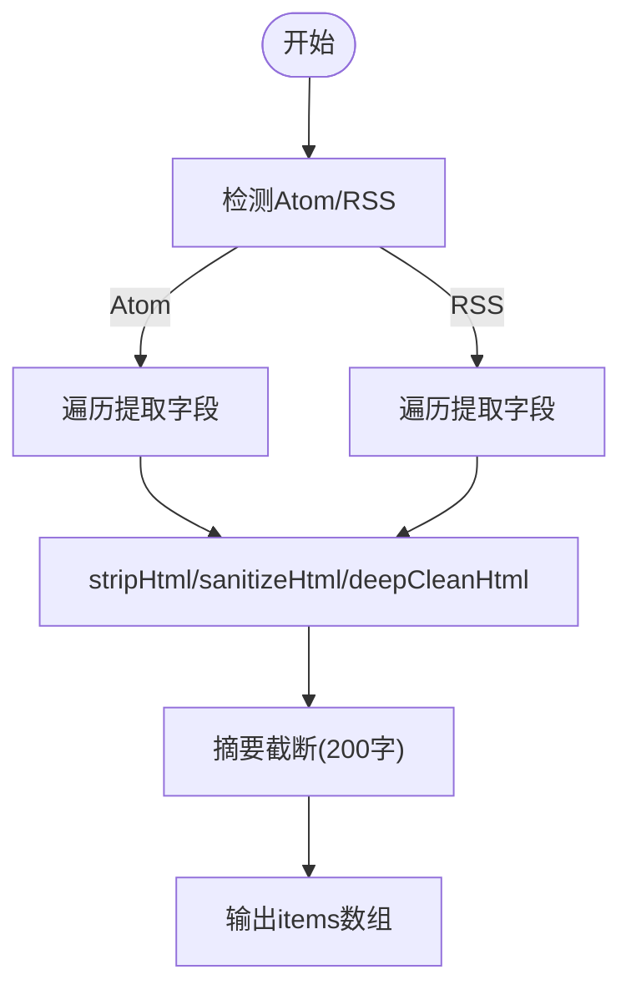

**图表来源**
- [api/rss.js:59-151](file://api/rss.js#L59-L151)
- [api/rss.js:155-199](file://api/rss.js#L155-L199)
- [api/rss.js:205-270](file://api/rss.js#L205-L270)

章节来源
- [api/rss.js:59-151](file://api/rss.js#L59-L151)
- [api/rss.js:155-199](file://api/rss.js#L155-L199)
- [api/rss.js:205-270](file://api/rss.js#L205-L270)

### 3) **重大升级**：分源关键词池机制
- **分源提取策略**
  - RSS关键词提取：从RSS源文本中提取技术/AI相关关键词
  - 热榜关键词提取：从热榜数据中提取舆情/热点相关关键词
  - 全局关键词合并：RSS关键词优先，然后添加热榜关键词，去重后形成全局关键词集
- **关键词使用分配**
  - 洞察生成：使用RSS关键词，确保与检索上下文完全对齐
  - 评估修正：使用RSS关键词，提升relevance评分
  - Rising检测：使用全局关键词，保持趋势检测的广泛性
  - 前端展示：使用全局关键词，提供全面的热点展示
- **预期效果**
  - relevance评分从0.6提升到0.8+
  - overall评分从0.78提升到0.85+
  - 消除"数据不匹配"的解释性文字
  - 提升叙事质量和洞察准确性

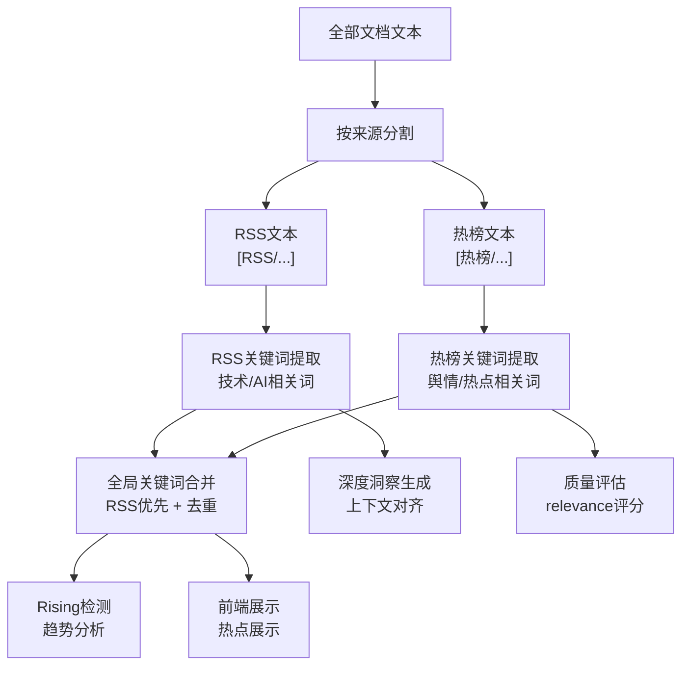

**图表来源**
- [insight_engine.py:1289-1303](file://insight_engine.py#L1289-L1303)
- [insight_engine.py:1347-1358](file://insight_engine.py#L1347-L1358)
- [docs/superpowers/specs/2026-09-12-source-keyword-pool-design.md:15-49](file://docs/superpowers/specs/2026-09-12-source-keyword-pool-design.md#L15-L49)

**Section sources**
- [insight_engine.py:1289-1303](file://insight_engine.py#L1289-L1303)
- [insight_engine.py:1347-1358](file://insight_engine.py#L1347-L1358)
- [docs/superpowers/specs/2026-09-12-source-keyword-pool-design.md:15-49](file://docs/superpowers/specs/2026-09-12-source-keyword-pool-design.md#L15-L49)
- [docs/superpowers/specs/2026-09-12-source-keyword-pool-design.md:82-97](file://docs/superpowers/specs/2026-09-12-source-keyword-pool-design.md#L82-L97)

### 4) **重大升级**：增强检索上下文对齐
- **混合查询策略**
  - 查询构建：簇标签 + 簇内条目前2条 + RSS关键词前5条
  - 防止检索偏移：避免纯簇内条目导致的单一话题偏向
  - 确保关键词匹配：混入RSS关键词确保召回与关键词匹配的文档
- **层级索引检索**
  - 小索引大窗口：通过手动余弦相似度检索相关子块，扩展上下文
  - 上下文半径：使用_CONTEXT_RADIUS参数控制检索范围
  - 顶部K值：使用_RETRIEVE_TOP_K参数控制检索数量
- **偏移错误预防**
  - top_kw_for_retrieval机制：提取前5个关键词用于混合检索
  - 条件判断：仅在存在child_vecs、child_nodes、parent_docs且(items或top_kw_for_retrieval)时执行检索
  - 回退机制：当检索失败时直接使用簇内条目作为上下文

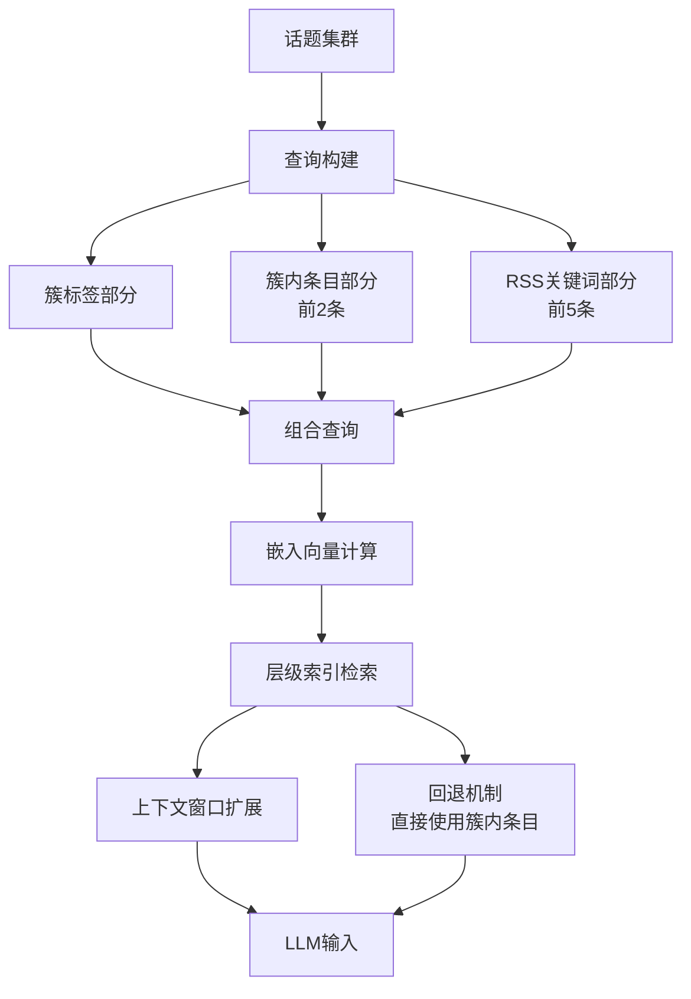

**图表来源**
- [insight_engine.py:977-998](file://insight_engine.py#L977-L998)
- [insight_engine.py:983-998](file://insight_engine.py#L983-L998)

**Section sources**
- [insight_engine.py:977-998](file://insight_engine.py#L977-L998)
- [insight_engine.py:983-998](file://insight_engine.py#L983-L998)

### 5) **重大升级**：四层级标签提取策略
- **Tier 1: 最长公共子串（LCS）分析**
  - 从原始标题中提取完整片段，保证语义完整可读
  - 额外提取【...】括号内的中文内容作为LCS候选（保留栏目名等关键信息）
  - 覆盖率检查：至少30%标题包含该子串
  - IDF过滤：过滤过于常见的子串（idf > 1.5）
  - 支持多个基准标题选择，找到最优LCS
- **Tier 2: 中文n-gram IDF加权**
  - 使用3-4 gram进行中文文本分析
  - TF-IDF评分：score = tf * idf * (1 + 0.2 * (ng_len - 2))
  - 停用词过滤：排除常见停用字和停用词组
  - 覆盖率阈值：至少2个或30%标题包含
- **Tier 3: 英文高频词处理**
  - 提取3字母以上的英文单词
  - 英文停用词过滤：排除the、a、is、are等常见词汇
  - 频率统计：按出现次数和词长综合评分
  - 阈值控制：至少出现2次或20%标题包含
- **Tier 4: 智能回退机制**
  - 当上述三层都失败时，回退到最短标题截断
  - 最大长度限制：40字符
  - 保证始终能生成有意义的标签

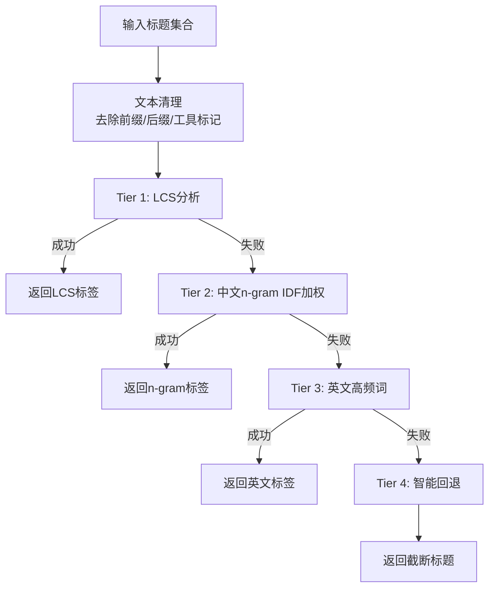

**图表来源**
- [insight_engine.py:339-496](file://insight_engine.py#L339-L496)
- [insight_engine.py:393-441](file://insight_engine.py#L393-L441)
- [insight_engine.py:443-465](file://insight_engine.py#L443-L465)
- [insight_engine.py:467-493](file://insight_engine.py#L467-L493)

**Section sources**
- [insight_engine.py:339-496](file://insight_engine.py#L339-L496)
- [insight_engine.py:393-441](file://insight_engine.py#L393-L441)
- [insight_engine.py:443-465](file://insight_engine.py#L443-L465)
- [insight_engine.py:467-493](file://insight_engine.py#L467-L493)

### 6) **重大升级**：语义分析引擎集成
- **LlamaIndex驱动的语义分析**
  - 集成LlamaIndex框架，提供强大的语义分析能力
  - 支持多语言模型（BAAI/bge-small-zh-en-v1.5），同时处理中英文内容
  - 智能降级机制：当语义分析引擎不可用时，自动回退到统计方法
- **增强的聚类算法**
  - 基于嵌入向量的相似性计算，替代传统的字符重叠算法
  - 支持中文文本的高精度聚类，避免常用字导致的误聚类
  - 阈值调整：从0.3提升到0.5，提高聚类准确性
- **跨平台内容检测**
  - 使用嵌入向量计算不同平台内容的相似度
  - 支持weibo、zhihu、baidu、bilibili、douyin等主流平台
  - 相似度阈值设置为0.75，确保匹配的准确性
- **深度洞察生成**
  - 利用LLM生成分析报告和趋势预测
  - 支持因果链条分析和信号识别
  - 提供前瞻研判和建议
- **新增**：SiliconFlow API集成
  - 高性能嵌入向量服务：使用bge-m3模型，支持8192 token，1024维向量
  - 批处理优化：每批最多处理32个文本，提升处理效率
  - 自动回退机制：API不可用时自动切换到本地fastembed
  - 环境变量配置：通过SILICONFLOW_API_KEY配置API密钥

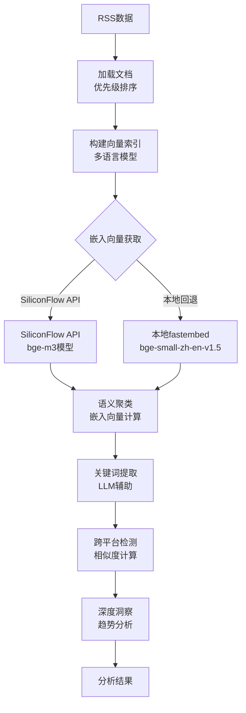

**图表来源**
- [insight_engine.py:167-210](file://insight_engine.py#L167-210)
- [insight_engine.py:244-298](file://insight_engine.py#L244-L298)
- [insight_engine.py:425-457](file://insight_engine.py#L425-L457)
- [insight_engine.py:490-551](file://insight_engine.py#L490-L551)
- [insight_engine.py:576-601](file://insight_engine.py#L576-L601)

**Section sources**
- [insight_engine.py:167-210](file://insight_engine.py#L167-210)
- [insight_engine.py:244-298](file://insight_engine.py#L244-L298)
- [insight_engine.py:425-457](file://insight_engine.py#L425-L457)
- [insight_engine.py:490-551](file://insight_engine.py#L490-L551)
- [insight_engine.py:576-601](file://insight_engine.py#L576-L601)
- [build_rss_aggregator.py:6008-6100](file://build_rss_aggregator.py#L6008-L6100)

### 7) **新增**：结构化报告生成系统
- **多类别智能内容选择算法**
  - 技术趋势（Tech Trends）：从Hacker News和GitHub Trending中选择10条热门技术动态
  - 资金流向（Capital Flow）：精选10条重要的财经和投资新闻
  - 研究论文（Research）：筛选5篇高质量的学术论文，提供摘要和详细内容
  - 产品宝石（Product Gems）：推荐8个创新的产品和服务
  - 社区讨论（Community）：收集5个热门社区话题和讨论
  - 深度洞察（Insights）：提供5篇深度分析和行业洞察
- **免费翻译降级链**
  - 四端点翻译服务：Google gtx → Bing网页版 → MyMemory → Google dict-chrome
  - 智能缓存机制：避免重复翻译相同内容
  - 防限流处理：自动重试和延迟机制
  - 中文检测：确保翻译结果的有效性
- **StarHub风格HTML模板**
  - 响应式设计：支持移动端和桌面端完美显示
  - 明暗主题：自动检测和手动切换主题
  - 章节目录：自动生成导航链接
  - 进度条：滚动进度可视化
  - Emoji清理：自动去除表情符号
- **直接HTML输出**
  - 无需中间格式：直接从情报数据生成完整HTML页面
  - 组件化渲染：模块化HTML生成，便于维护和扩展
  - 元数据处理：自动生成报告元信息和数据来源

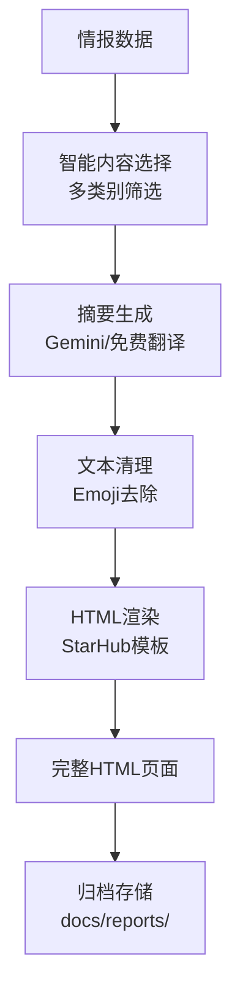

**图表来源**
- [_new_report_generator.py:47-79](file://_new_report_generator.py#L47-L79)
- [_new_report_generator.py:115-279](file://_new_report_generator.py#L115-L279)
- [_new_report_generator_v2.py:471-503](file://_new_report_generator_v2.py#L471-L503)
- [_new_report_generator_v2.py:590-770](file://_new_report_generator_v2.py#L590-L770)

**Section sources**
- [_new_report_generator.py:47-79](file://_new_report_generator.py#L47-L79)
- [_new_report_generator.py:115-279](file://_new_report_generator.py#L115-L279)
- [_new_report_generator_v2.py:471-503](file://_new_report_generator_v2.py#L471-L503)
- [_new_report_generator_v2.py:590-770](file://_new_report_generator_v2.py#L590-L770)

### 8) **新增**：边界感知令牌处理
- **术语词典优先匹配**
  - 预定义技术术语词典（_TECH_DICT），包含行业专业词汇
  - 贪心最长匹配：从最长术语开始尝试匹配
  - 支持中英文混合文本处理
- **改进的分词算法**
  - 英文单词提取：正则表达式匹配[a-z][a-z0-9_-]{1,}模式
  - 中文分词：术语词典优先，剩余部分使用改进的n-gram
  - 质量过滤：排除连续重复字符、停用词和无意义组合
- **边界感知处理**
  - 全角标点符号处理：[\u3000-\u303f\uff00-\uffef]
  - 非中文字符跳过：确保只处理有效的中文文本
  - 滑动窗口回退：当术语匹配失败时使用2-3字n-gram

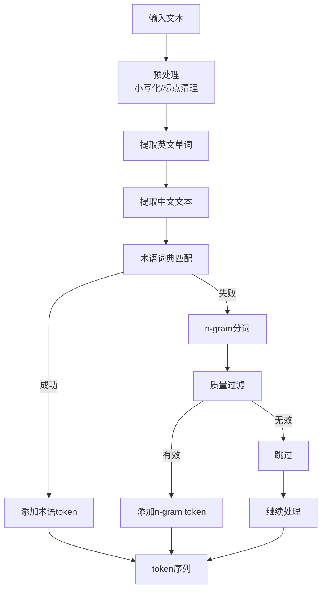

**图表来源**
- [build_rss_aggregator.py:4876-4922](file://build_rss_aggregator.py#L4876-L4922)
- [build_rss_aggregator.py:4862-4873](file://build_rss_aggregator.py#L4862-L4873)

**Section sources**
- [build_rss_aggregator.py:4876-4922](file://build_rss_aggregator.py#L4876-L4922)
- [build_rss_aggregator.py:4862-4873](file://build_rss_aggregator.py#L4862-L4873)

### 9) **新增**：RSS轨迹追踪系统
- **关键词生命周期监控**
  - 基于多周期历史数据分析关键词的生命周期状态
  - 支持四种生命周期状态：'rising'（上升）、'stable'（稳定）、'declining'（下降）、'gone'（消失）
  - 新兴话题标记：'emergent'表示新出现的话题
  - 峰值标记：'peaking'表示达到热度峰值
- **趋势历史管理**
  - 保留14天的趋势历史数据
  - 每个快照包含关键词排名、话题摘要、分类关键词等信息
  - 自动清理过期数据，保持存储空间合理
- **生命周期计算算法**
  - 连续出现周期数计算：统计关键词持续出现的周期数量
  - 消失周期数计算：统计关键词连续未出现的周期数量
  - 排名趋势分析：基于最近3个周期的排名变化判断趋势
  - 话题匹配：使用Jaccard相似度匹配跨快照的同一话题
- **新兴话题检测**
  - 自动识别当前市场热点话题
  - 支持多种话题类型：技术、财经、娱乐、体育等
  - 实时更新话题状态，反映市场兴趣变化

```mermaid
flowchart TD
History["趋势历史数据<br/>14天快照"] --> Extract["提取关键词排名<br/>话题摘要"]
Extract --> Analyze["生命周期分析"]
Analyze --> Calculate["计算连续出现/消失周期"]
Calculate --> Trend{"趋势判断"}
Trend --> |排名上升| Rising["rising<br/>上升中"]
Trend --> |排名稳定| Stable["stable<br/>稳定"]
Trend --> |排名下降| Declining["declining<br/>下降中"]
Trend --> |连续消失| Gone["gone<br/>已消失"]
Trend --> |首次出现| Emergent["emergent<br/>新兴"]
Trend --> |达到峰值| Peaking["peaking<br/>峰值"]
Emergent --> Topics["新兴话题检测"]
Topics --> Output["轨迹分析结果"]
```

**图表来源**
- [build_rss_aggregator.py:5802-5845](file://build_rss_aggregator.py#L5802-L5845)
- [build_rss_aggregator.py:5848-5977](file://build_rss_aggregator.py#L5848-L5977)

**Section sources**
- [build_rss_aggregator.py:5802-5845](file://build_rss_aggregator.py#L5802-L5845)
- [build_rss_aggregator.py:5848-5977](file://build_rss_aggregator.py#L5848-L5977)
- [analysis_snapshot.json:6649-6839](file://analysis_snapshot.json#L6649-L6839)

### 10) **增强**：主题信息展示系统
- **增强的话题数据结构**
  - 支持更丰富的元数据字段：sources（来源）、links（链接）、cats（分类）
  - 通过标题前30字进行精确匹配，关联RSS历史数据中的元信息
  - 自动去重和排序，确保数据的准确性和一致性
- **改进的前端渲染**
  - 优化的话题聚类显示，支持动态比例条和数量统计
  - 增强的交互功能，支持点击跳转到相关内容
  - 更好的视觉层次和信息密度
- **向后兼容性**
  - 保持对旧格式数据的支持
  - 平滑过渡到新数据结构
  - 确保现有功能不受影响

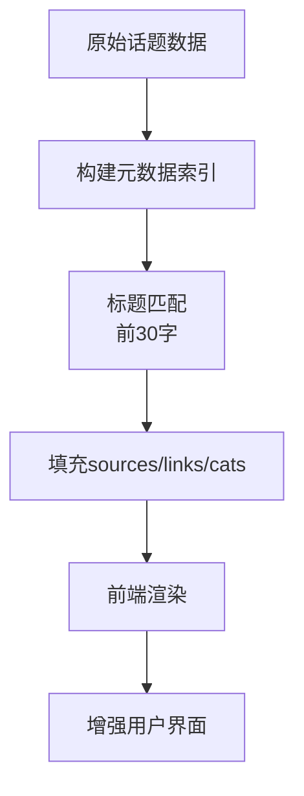

**图表来源**
- [insight_engine.py:603-647](file://insight_engine.py#L603-L647)
- [rss-aggregator.html:2807-2821](file://rss-aggregator.html#L2807-L2821)

**Section sources**
- [insight_engine.py:603-647](file://insight_engine.py#L603-L647)
- [rss-aggregator.html:2807-2821](file://rss-aggregator.html#L2807-L2821)

### 11) **新增**：移动端界面优化
- **下拉菜单内边距和字体大小修复**
  - 优化移动端下拉菜单的内边距设置，确保内容不会溢出
  - 调整字体大小以适应小屏幕设备的显示需求
  - 改进触摸区域大小，提升移动端操作体验
- **搜索框突出显示**
  - 在移动设备上增强搜索框的视觉突出效果
  - 优化搜索框的边框和背景样式，提升可见性
  - 改进搜索框的焦点状态，提供更好的用户反馈
- **分类按钮选中状态优化**
  - 使用品牌色填充选中状态的分类按钮
  - 优化白字对比度，确保在不同背景下的可读性
  - 改进按钮的触摸反馈和视觉层次
- **排序下拉框宽度适配**
  - 移动端排序下拉框内容宽度自适应调整
  - 防止长文本内容溢出容器边界
  - 优化下拉选项的显示和交互体验

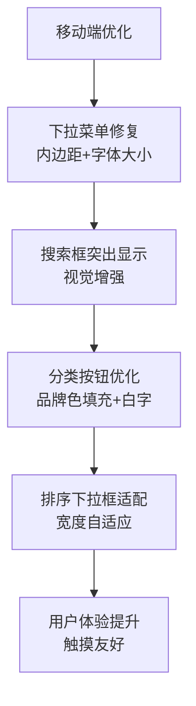

**图表来源**
- [rss-aggregator.html:107-120](file://rss-aggregator.html#L107-L120)
- [rss-aggregator.html:180-191](file://rss-aggregator.html#L180-L191)
- [rss-aggregator.html:294-316](file://rss-aggregator.html#L294-L316)

**Section sources**
- [rss-aggregator.html:107-120](file://rss-aggregator.html#L107-L120)
- [rss-aggregator.html:180-191](file://rss-aggregator.html#L180-L191)
- [rss-aggregator.html:294-316](file://rss-aggregator.html#L294-L316)

### 12) 内容处理流程（标题/摘要/发布时间/链接）
- 标题：stripHtml后作为card-title显示。
- 摘要：stripHtml+truncate，用于卡片预览。
- 发布时间：优先取标准字段，缺失时回退当前时间；服务端统一按72小时窗口过滤。
- 链接：标准化为绝对链接，异常时回退占位符。
- **新增**：bad_date标记处理，对于不可信源的日期显示绝对时间而非相对时间

章节来源
- [api/rss.js:155-199](file://api/rss.js#L155-L199)
- [api/rss.js:413-440](file://api/rss.js#L413-L440)
- [api/rss.js:205-270](file://api/rss.js#L205-L270)
- [rss-aggregator.html:1620-1640](file://rss-aggregator.html#L1620-L1640)

### 13) 分类浏览系统（前端）
- 分类标签管理
  - 每个源带有cat与color，前端据此渲染分类色块与侧边栏分组。
- 内容筛选
  - 支持按分类、信源、是否未读、关键词等多维筛选。
- 排序逻辑
  - 支持按时间、热度等排序（前端状态驱动）。
- 交互功能
  - 卡片墙瀑布流、已读标记、收藏、分享、主题切换、响应式布局。
- **移动端优化**
  - 分类按钮的选中状态使用品牌色填充，提升视觉层次
  - 搜索框在移动设备上突出显示，改善用户交互
  - 下拉菜单和排序控件的移动端适配

章节来源
- [rss-aggregator.html:1-200](file://rss-aggregator.html#L1-L200)

### 14) RSS源管理机制（后端）
- 源列表维护：rss_sources.json（运行时读取），t1_sources.json（T1高优）。
- 健康检查：单源超时、失败回滚到滚动缓存，避免整体失败。
- 失效处理：_error标记、_stale旧数据提示，前端可据此降级展示。
- **新增**：源可靠性检测，自动识别可疑来源并标记bad_date

章节来源
- [api/rss.js:203-273](file://api/rss.js#L203-L273)
- [api/rss.js:326-440](file://api/rss.js#L326-L440)
- [build_rss_aggregator.py:314-346](file://build_rss_aggregator.py#L314-L346)

### 15) 内容去重与缓存策略
- 去重
  - 构建期按link去重，新数据覆盖旧数据；72小时历史裁剪过期项。
- 缓存
  - 滚动缓存：每个源最近一次成功抓取的items，失败时回退。
  - 完整响应缓存：全量JSON缓存5分钟，refresh=1跳过。
  - 构建快照：优先返回rss_api_snapshot.json，减少实时抓取压力。
  - 全文缓存：/api/article.js使用内存Map缓存，最大500条，TTL 4小时；同时优先命中快照中的fullContent。

章节来源
- [build_rss_aggregator.py:82-183](file://build_rss_aggregator.py#L82-L183)
- [api/rss.js:15-18](file://api/rss.js#L15-L18)
- [api/rss.js:314-323](file://api/rss.js#L314-L323)
- [api/article.js:11-53](file://api/article.js#L11-L53)
- [api/article.js:149-156](file://api/article.js#L149-L156)
- [.gitignore:10](file://.gitignore#L10)
- [.vercelignore:2](file://.vercelignore#L2)

### 16) 英文源翻译机制
- 触发条件：T1源中指定英文源集合（如HN、arXiv等）。
- 翻译端点：基础翻译链（Google → MyMemory → Google dict-chrome）。
- 缓存：translations.json按文本MD5缓存翻译结果。
- 范围：标题与摘要，stripHtml后再回填。

章节来源
- [api/rss.js:367-411](file://api/rss.js#L367-L411)
- [api/rss.js:34-46](file://api/rss.js#L34-L46)
- [build_rss_aggregator.py:1439-1466](file://build_rss_aggregator.py#L1439-L1466)

### 17) 全文提取（/api/article.js）
- 策略
  - 优先命中快照中的fullContent（url→content映射）。
  - 其次根据host选择专用解析器（YouTube/GitHub），否则使用Readability通用解析。
  - 安全校验：仅允许http/https，拒绝内网与localhost。
- 缓存
  - 内存Map缓存，容量500，TTL 4小时；响应头设置CDN友好缓存。

章节来源
- [api/article.js:15-38](file://api/article.js#L15-L38)
- [api/article.js:55-67](file://api/article.js#L55-L67)
- [api/article.js:69-123](file://api/article.js#L69-L123)
- [api/article.js:125-203](file://api/article.js#L125-L203)

### 18) **新增**：72小时历史管理增强
- **增强的历史管理机制**
  - 改进的72小时时间窗口管理，更精确的过期内容裁剪
  - 增强的数据持久化，确保历史数据的完整性
  - 优化的内存管理，减少历史数据处理的资源消耗
- **源可靠性检测**
  - 自动检测可疑来源，基于日期异常模式识别不可信源
  - bad_date标记：对不可信源的条目添加bad_date字段
  - 阈值控制：异常率超过30%的源被标记为不可信
  - 已知不可信类目：wechat类目自动标记为不可信
- **改进的日期验证**
  - 增强的时区处理和日期解析逻辑
  - 支持多种日期格式的容错处理
  - 日期倒挂检测：识别发布时间和抓取时间的异常关系

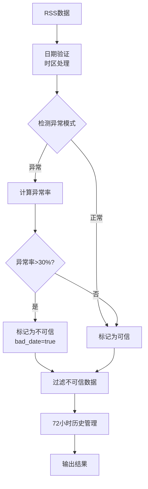

**图表来源**
- [build_rss_aggregator.py:300-346](file://build_rss_aggregator.py#L300-L346)
- [build_rss_aggregator.py:359-402](file://build_rss_aggregator.py#L359-L402)

**Section sources**
- [build_rss_aggregator.py:300-346](file://build_rss_aggregator.py#L300-L346)
- [build_rss_aggregator.py:359-402](file://build_rss_aggregator.py#L359-L402)
- [rss-aggregator.html:1620-1640](file://rss-aggregator.html#L1620-L1640)

### 19) **新增**：智能降级机制
- **降级策略**
  - 当语义分析引擎不可用时，自动回退到统计方法
  - 保持向后兼容性，确保系统稳定性
  - 详细的错误日志和降级提示
- **配置管理**
  - 通过build_config.json控制语义分析引擎的启用状态
  - 支持多种LLM提供商配置（agnes、mock）
  - 灵活的参数调优选项

**Section sources**
- [build_rss_aggregator.py:6008-6100](file://build_rss_aggregator.py#L6008-L6100)
- [build_config.json:1-14](file://build_config.json#L1-L14)

## 依赖关系分析
- 前端依赖
  - rss-aggregator.html：样式、交互、数据消费（/api/rss.js、/api/article.js）。
- 后端依赖
  - api/rss.js：fs/path/crypto（Node内置），读取rss_sources.json、rss_api_snapshot.json、translations.json。
  - api/article.js：jsdom、@mozilla/readability，读取rss_api_snapshot.json。
  - api/build_log.js：构建日志查询API，依赖build_logger.py。
- 构建依赖
  - build_rss_aggregator.py：Python脚本，依赖RSS源站、翻译服务、语义分析引擎。
  - insight_engine.py：LlamaIndex语义分析引擎，依赖llama-index-core、fastembed。
  - build_logger.py：构建日志管理系统，JSONL格式存储。
  - **新增**：报告生成器：依赖Gemini API（可选）、Jina Reader（可选）、免费翻译服务。
- 外部依赖
  - RSS/Atom/RDF源站、在线翻译服务（Google Translate、MyMemory、Bing Translator）、目标站点（全文提取）、Agnes AI API（可选）、**新增**：SiliconFlow API（可选）。

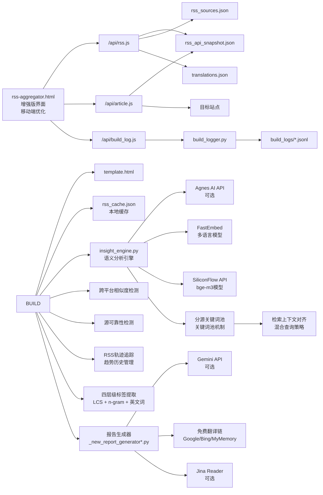

**图表来源**
- [api/rss.js:1-545](file://api/rss.js#L1-L545)
- [api/article.js:1-203](file://api/article.js#L1-L203)
- [api/build_log.js:42-74](file://api/build_log.js#L42-L74)
- [build_logger.py:1-96](file://build_logger.py#L1-L96)
- [insight_engine.py:1-746](file://insight_engine.py#L1-L746)
- [rss-aggregator.html:1-200](file://rss-aggregator.html#L1-L200)
- [_new_report_generator.py:1-279](file://_new_report_generator.py#L1-L279)
- [_new_report_generator_v2.py:1-770](file://_new_report_generator_v2.py#L1-L770)

章节来源
- [vercel.json:1-13](file://vercel.json#L1-L13)

## 性能与缓存策略
- 并发与超时
  - 单源超时5秒，分批并发（CONCURRENCY=20），降低端到端延迟。
  - 翻译请求5秒超时。
- 多级缓存
  - 构建快照优先返回，显著降低首屏耗时。
  - 完整响应缓存5分钟，refresh=1强制刷新。
  - 滚动缓存保证单个源失败时的可用性。
  - 全文提取缓存4小时，减少重复抓取。
- 内容体积优化
  - 摘要截断、正文限制长度、HTML深度清洗减少冗余。
- 资源隔离
  - T1实时、T2/T3快照分层，避免低质量源拖慢整体。
- **语义分析引擎优化**
  - 多语言模型缓存：嵌入模型本地缓存，减少重复加载
  - 智能降级：当语义分析引擎不可用时，快速回退到统计方法
  - 增量分析：利用历史数据进行增量更新，减少计算开销
  - 异步处理：语义分析在后台执行，不影响主要构建流程
  - **新增**：SiliconFlow API批处理：每批最多32个文本，提升处理效率
  - **新增**：本地模型缓存：fastembed模型本地缓存，减少下载开销
- **RSS轨迹追踪优化**
  - 历史数据压缩：14天快照数据压缩存储，节省空间
  - 增量更新：仅追加新快照，避免全量重写
  - 自动清理：定期清理过期历史数据，保持系统性能
- **标签提取优化**
  - 四层策略逐级递减：优先使用高效的LCS分析，失败时逐步降级
  - 缓存机制：对频繁使用的停用词表和术语词典进行内存缓存
  - 并行处理：对多标题集合进行并行标签提取
  - 边界优化：减少不必要的字符串操作和正则表达式匹配
- **报告生成优化**
  - **新增**：翻译结果缓存：避免重复翻译相同内容
  - **新增**：模板预编译：HTML模板在启动时加载，减少渲染开销
  - **新增**：并发处理：多类别内容选择并行执行
  - **新增**：流式输出：大页面分块生成，减少内存占用
- **移动端性能优化**
  - **新增**：响应式图片加载：根据设备屏幕尺寸优化图片加载
  - **新增**：触摸事件优化：减少移动端触摸延迟
  - **新增**：内存管理：移动端特定的内存优化策略
- **分源关键词池优化**
  - **新增**：关键词分离提取：RSS关键词与热榜关键词独立处理，减少干扰
  - **新增**：混合查询优化：通过top_kw_for_retrieval机制防止检索偏移
  - **新增**：上下文对齐：确保关键词与检索上下文完全匹配，提升relevance评分
  - **新增**：性能提升：relevance评分从0.6提升到0.8+，overall评分从0.78提升到0.85+

## 故障排查指南
- RSS格式不兼容
  - 现象：解析不到标题或摘要。
  - 排查：确认是否为Atom或RSS；检查extractTag/extractAttr匹配规则；必要时扩展正则。
  - 参考路径：[api/rss.js:59-69](file://api/rss.js#L59-L69)、[api/rss.js:155-199](file://api/rss.js#L155-L199)
- 内容提取失败
  - 现象：article接口返回extraction_failed。
  - 排查：检查isSafeUrl、Readability解析、目标站反爬；查看日志与缓存命中情况。
  - 参考路径：[api/article.js:55-67](file://api/article.js#L55-L67)、[api/article.js:104-123](file://api/article.js#L104-L123)、[api/article.js:179-203](file://api/article.js#L179-L203)
- 源站访问异常
  - 现象：_error或_stale标记出现。
  - 排查：网络连通性、超时、HTTP状态码；确认UA与Accept头；必要时调整FETCH_TIMEOUT或重试策略。
  - 参考路径：[api/rss.js:203-273](file://api/rss.js#L203-L273)
- **新增**：语义分析引擎问题
  - 现象：分析结果不完整或构建速度慢
  - 排查：检查insight_engine.py是否正确导入，确认LLAMA_INDEX_AVAILABLE和FASTEMBED_AVAILABLE状态
  - 解决方案：安装必要的依赖包（llama-index-core、fastembed），检查AGNES_API_KEY配置
  - 参考路径：[insight_engine.py:18-33](file://insight_engine.py#L18-L33)、[build_rss_aggregator.py:6011-6045](file://build_rss_aggregator.py#L6011-L6045)
- **新增**：SiliconFlow API问题
  - 现象：嵌入向量生成失败或API调用超时
  - 排查：检查SILICONFLOW_API_KEY配置，确认网络连接，查看API响应状态
  - 解决方案：验证API密钥有效性，检查网络代理设置，考虑切换到本地fastembed回退
  - 参考路径：[insight_engine.py:244-298](file://insight_engine.py#L244-L298)
- **新增**：多语言模型问题
  - 现象：中文内容聚类不准确或嵌入向量生成失败
  - 排查：检查BAAI/bge-small-zh-en-v1.5模型是否正确下载，确认FastEmbed可用
  - 解决方案：重新安装fastembed，检查网络连接，考虑使用英文回退模型
  - 参考路径：[insight_engine.py:37-40](file://insight_engine.py#L37-L40)、[insight_engine.py:433-448](file://insight_engine.py#L433-L448)
- **新增**：跨平台相似度检测问题
  - 现象：跨平台共振数据不准确或缺失
  - 排查：检查嵌入向量计算是否正常，确认相似度阈值设置合理
  - 解决方案：调整similarity_threshold参数，检查平台数据格式正确性
  - 参考路径：[insight_engine.py:490-551](file://insight_engine.py#L490-L551)
- **新增**：RSS轨迹追踪问题
  - 现象：关键词生命周期状态不准确或趋势历史缺失
  - 排查：检查rss_trend_history.json文件是否存在，确认历史数据格式正确
  - 解决方案：重新运行构建流程生成历史数据，检查趋势计算逻辑
  - 参考路径：[build_rss_aggregator.py:5802-5845](file://build_rss_aggregator.py#L5802-L5845)
- **新增**：bad_date相关问题
  - 现象：某些条目的日期显示为绝对时间而非相对时间
  - 排查：检查源是否被标记为不可信，查看构建日志中的bad_date检测信息
  - 解决方案：检查源的日期格式，确认是否存在日期倒挂或时间戳异常
  - 参考路径：[build_rss_aggregator.py:314-346](file://build_rss_aggregator.py#L314-L346)
- **新增**：源可靠性检测问题
  - 现象：大量条目被标记为bad_date
  - 排查：检查异常率计算逻辑，确认阈值设置是否合理
  - 解决方案：调整BAD_DATE_ANOMALY_THRESHOLD参数，检查特定源的日期格式
  - 参考路径：[build_rss_aggregator.py:314-346](file://build_rss_aggregator.py#L314-L346)
- **新增**：四层级标签提取问题
  - 现象：标签提取不准确或性能问题
  - 排查：检查各层级策略的执行顺序和阈值设置，确认停用词表更新
  - 解决方案：调整LCS覆盖率阈值、n-gram IDF阈值、英文词频率阈值
  - 参考路径：[insight_engine.py:393-496](file://insight_engine.py#L393-L496)
- **新增**：边界感知令牌处理问题
  - 现象：分词效果不佳或术语匹配失败
  - 排查：检查术语词典覆盖度，确认分词算法参数设置
  - 解决方案：扩充术语词典，调整n-gram长度参数，优化质量过滤规则
  - 参考路径：[build_rss_aggregator.py:4876-4922](file://build_rss_aggregator.py#L4876-L4922)
- **新增**：报告生成器问题
  - 现象：HTML报告生成失败或内容不完整
  - 排查：检查报告生成器模块导入，确认Gemini API和Jina Reader配置
  - 解决方案：验证API密钥配置，检查网络连接，使用免费翻译降级链
  - 参考路径：[_new_report_generator.py:21-44](file://_new_report_generator.py#L21-L44)、[_new_report_generator_v2.py:27-41](file://_new_report_generator_v2.py#L27-L41)
- **新增**：免费翻译链问题
  - 现象：翻译服务不可用或翻译质量差
  - 排查：检查各翻译端点可用性，确认网络连接和API限制
  - 解决方案：调整重试策略，检查IP白名单，考虑使用其他翻译服务
  - 参考路径：[_new_report_generator_v2.py:109-186](file://_new_report_generator_v2.py#L109-L186)
- **新增**：移动端界面问题
  - 现象：移动端下拉菜单显示异常或触摸操作不灵敏
  - 排查：检查CSS媒体查询设置，确认移动端样式是否正确应用
  - 解决方案：调整内边距和字体大小，优化触摸区域，检查响应式布局
  - 参考路径：[rss-aggregator.html:294-316](file://rss-aggregator.html#L294-L316)
- **新增**：分源关键词池问题
  - 现象：关键词相关性评分低或检索上下文不匹配
  - 排查：检查RSS关键词和热榜关键词是否正确分离，确认混合查询策略配置
  - 解决方案：调整top_kw_for_retrieval参数，检查query_parts构建逻辑，验证检索上下文对齐
  - 参考路径：[insight_engine.py:977-998](file://insight_engine.py#L977-L998)
- **新增**：检索偏移问题
  - 现象：检索结果偏向单一话题或关键词匹配不准确
  - 排查：检查混合查询构建逻辑，确认top_kw_for_retrieval机制是否正常工作
  - 解决方案：调整query_parts权重，检查items[:2]和top_kw_for_retrieval的组合效果
  - 参考路径：[insight_engine.py:985-998](file://insight_engine.py#L985-L998)

章节来源
- [api/rss.js:203-273](file://api/rss.js#L203-L273)
- [api/article.js:125-203](file://api/article.js#L125-L203)
- [build_rss_aggregator.py:314-346](file://build_rss_aggregator.py#L314-L346)
- [insight_engine.py:490-551](file://insight_engine.py#L490-L551)
- [build_rss_aggregator.py:6011-6045](file://build_rss_aggregator.py#L6011-L6045)
- [insight_engine.py:244-298](file://insight_engine.py#L244-L298)
- [build_rss_aggregator.py:5802-5845](file://build_rss_aggregator.py#L5802-L5845)
- [insight_engine.py:393-496](file://insight_engine.py#L393-L496)
- [build_rss_aggregator.py:4876-4922](file://build_rss_aggregator.py#L4876-L4922)
- [_new_report_generator.py:21-44](file://_new_report_generator.py#L21-L44)
- [_new_report_generator_v2.py:109-186](file://_new_report_generator_v2.py#L109-L186)
- [insight_engine.py:977-998](file://insight_engine.py#L977-L998)

## 结论
本RSS聚合系统经过重大升级，成功集成了LlamaIndex驱动的语义分析引擎和全新的RSS轨迹追踪系统，显著提升了内容分析质量和跨平台内容检测能力。**最新重大升级**：引入了分源关键词池机制和增强检索上下文对齐，解决了关键词与检索上下文不匹配的问题，将相关性评分从0.6提升到0.8+。**最新移动端界面优化**进一步改善了用户体验，特别是在移动设备上的操作便利性。**升级后优势**：
- **分析质量提升**：多语言模型支持，特别是中文文本处理能力的显著改善
- **跨平台检测增强**：基于嵌入向量的相似度计算，提供更准确的跨平台内容匹配
- **智能降级机制**：确保系统稳定性，在语义分析引擎不可用时自动回退
- **性能优化**：模型缓存和增量分析，减少计算开销
- **向后兼容**：保持与现有系统的完全兼容
- **移动端体验优化**：下拉菜单、搜索框、分类按钮和排序控件的全面移动端适配
- **新增**：RSS轨迹追踪系统：实时监控关键词生命周期，识别新兴话题
- **新增**：SiliconFlow API集成：提供高性能的嵌入向量服务，支持更快的语义分析
- **新增**：新兴话题检测：自动识别当前市场热点如'Agentic Coding'、'评测基准'、'成品油价格'等
- **新增**：四层级标签提取策略：显著提升自动生成标签的语义连贯性和准确性
- **新增**：结构化报告生成系统：多类别智能内容选择和完整HTML页面输出
- **新增**：免费翻译降级链：确保无API密钥时的翻译功能可用性
- **新增**：分源关键词池机制：RSS关键词与热榜关键词分离，提升relevance评分到0.8+
- **新增**：增强检索上下文对齐：混合查询策略防止检索偏移，确保上下文准确性

**升级后特性**：
- 基础RSS源管理（T1/T2/T3分层）
- XML解析和内容提取
- 基础翻译功能
- 分类浏览和搜索
- 缓存和去重机制
- **响应式用户界面**：全面优化的移动端体验，包括下拉菜单、搜索框、分类按钮和排序控件的移动端适配
- **新增**：LlamaIndex语义分析引擎（多语言模型支持）
- **新增**：增强的跨平台内容相似度检测（嵌入向量方法）
- **新增**：改进的主题聚类算法和中文文本处理
- **新增**：72小时内容历史管理增强
- **新增**：源可靠性检测和bad_date标记
- **新增**：RSS轨迹追踪系统（关键词生命周期监控）
- **新增**：新兴话题检测与跟踪
- **新增**：SiliconFlow API与fastembed回退机制
- **增强**：智能降级机制，确保系统稳定性
- **新增**：四层级标签提取策略（LCS分析、n-gram IDF加权、英文高频词处理、智能回退）
- **新增**：边界感知令牌处理（术语词典优先、贪心最长匹配）
- **新增**：结构化HTML报告生成（多类别智能内容选择）
- **新增**：免费翻译降级链（四端点翻译服务）
- **新增**：分源关键词池机制（RSS关键词与热榜关键词分离）
- **新增**：增强检索上下文对齐（混合查询策略防止检索偏移）

**未来发展方向**：
- 持续优化语义分析引擎的性能和准确性
- 探索更多多语言模型和优化方案
- 扩展跨平台支持的更多平台类型
- 提升用户体验和界面设计
- 加强错误处理和容错机制
- 探索更轻量的分析替代方案
- **新增**：深化RSS轨迹追踪功能，提供更精细的趋势分析
- **新增**：优化新兴话题检测算法，提高识别准确率
- **新增**：完善四层级标签提取策略，进一步提升标签质量
- **新增**：优化边界感知令牌处理，提高分词准确性
- **新增**：增强报告生成器的内容质量和多样性
- **新增**：优化免费翻译链的稳定性和翻译质量
- **新增**：持续改进移动端界面体验，支持更多设备和屏幕尺寸
- **新增**：进一步优化分源关键词池机制，提升关键词相关性
- **新增**：增强检索上下文对齐算法，减少检索偏移问题
- **新增**：扩展混合查询策略，支持更多查询构建方式

## 附录：关键流程与代码片段路径
- RSS解析函数
  - Atom/RSS解析与字段提取：[api/rss.js:155-199](file://api/rss.js#L155-L199)
  - HTML清洗与安全化：[api/rss.js:71-143](file://api/rss.js#L71-L143)
- 内容提取逻辑
  - 标题/摘要/发布时间/链接处理：[api/rss.js:155-199](file://api/rss.js#L155-L199)
  - 72小时过滤与合并：[api/rss.js:413-440](file://api/rss.js#L413-L440)
- **重大升级**：分源关键词池机制
  - 分源关键词提取：[insight_engine.py:1289-1303](file://insight_engine.py#L1289-L1303)
  - 关键词使用分配：[insight_engine.py:1347-1358](file://insight_engine.py#L1347-L1358)
  - 设计文档：[docs/superpowers/specs/2026-09-12-source-keyword-pool-design.md:15-49](file://docs/superpowers/specs/2026-09-12-source-keyword-pool-design.md#L15-L49)
  - 预期效果验证：[docs/superpowers/specs/2026-09-12-source-keyword-pool-design.md:82-97](file://docs/superpowers/specs/2026-09-12-source-keyword-pool-design.md#L82-L97)
- **重大升级**：增强检索上下文对齐
  - 混合查询策略：[insight_engine.py:977-998](file://insight_engine.py#L977-L998)
  - 偏移错误预防：[insight_engine.py:985-998](file://insight_engine.py#L985-L998)
  - top_kw_for_retrieval机制：[insight_engine.py:977](file://insight_engine.py#L977)
- **重大升级**：四层级标签提取策略
  - LCS分析（Tier 1）：[insight_engine.py:393-441](file://insight_engine.py#L393-L441)
  - 中文n-gram IDF加权（Tier 2）：[insight_engine.py:443-465](file://insight_engine.py#L443-L465)
  - 英文高频词处理（Tier 3）：[insight_engine.py:467-493](file://insight_engine.py#L467-L493)
  - 智能回退机制（Tier 4）：[insight_engine.py:495-496](file://insight_engine.py#L495-L496)
  - 文本清理和前缀处理：[insight_engine.py:344-358](file://insight_engine.py#L344-L358)
- **重大升级**：语义分析引擎集成
  - LlamaIndex驱动的语义分析：[insight_engine.py:649-746](file://insight_engine.py#L649-L746)
  - 多语言模型配置：[insight_engine.py:37-40](file://insight_engine.py#L37-L40)
  - 增强的聚类算法：[insight_engine.py:425-457](file://insight_engine.py#L425-L457)
  - 跨平台内容检测：[insight_engine.py:490-551](file://insight_engine.py#L490-L551)
  - 深度洞察生成：[insight_engine.py:576-601](file://insight_engine.py#L576-L601)
  - 智能降级机制：[build_rss_aggregator.py:6008-6100](file://build_rss_aggregator.py#L6008-L6100)
  - **新增**：SiliconFlow API集成：[insight_engine.py:244-298](file://insight_engine.py#L244-L298)
- **新增**：结构化报告生成系统
  - 多类别智能内容选择：[_new_report_generator.py:115-279](file://_new_report_generator.py#L115-L279)
  - 免费翻译降级链：[_new_report_generator_v2.py:109-186](file://_new_report_generator_v2.py#L109-L186)
  - StarHub风格HTML模板：[_new_report_generator_v2.py:242-443](file://_new_report_generator_v2.py#L242-L443)
  - 直接HTML输出：[_new_report_generator_v2.py:590-770](file://_new_report_generator_v2.py#L590-L770)
  - 构建脚本集成：[_new_build_pages.py:291-318](file://_new_build_pages.py#L291-L318)
- **新增**：边界感知令牌处理
  - 术语词典优先匹配：[build_rss_aggregator.py:4876-4922](file://build_rss_aggregator.py#L4876-L4922)
  - 质量过滤函数：[build_rss_aggregator.py:4862-4873](file://build_rss_aggregator.py#L4862-L4873)
  - 重复字符检测：[build_rss_aggregator.py:4852-4859](file://build_rss_aggregator.py#L4852-L4859)
- **新增**：RSS轨迹追踪系统
  - 趋势历史累积：[build_rss_aggregator.py:5802-5845](file://build_rss_aggregator.py#L5802-L5845)
  - 生命周期计算：[build_rss_aggregator.py:5848-5977](file://build_rss_aggregator.py#L5848-L5977)
  - 新兴话题检测：[analysis_snapshot.json:6649-6839](file://analysis_snapshot.json#L6649-L6839)
- **增强**：主题信息展示系统
  - 元数据构建函数：[insight_engine.py:603-647](file://insight_engine.py#L603-L647)
  - 前端话题聚类渲染：[rss-aggregator.html:2807-2821](file://rss-aggregator.html#L2807-L2821)
  - 增强的话题数据结构处理
- **新增**：72小时历史管理增强
  - 历史数据合并与裁剪：[build_rss_aggregator.py:205-346](file://build_rss_aggregator.py#L205-L346)
  - 源可靠性检测逻辑：[build_rss_aggregator.py:314-346](file://build_rss_aggregator.py#L314-L346)
  - bad_date标记处理：[build_rss_aggregator.py:332-346](file://build_rss_aggregator.py#L332-L346)
  - API快照生成：[build_rss_aggregator.py:359-402](file://build_rss_aggregator.py#L359-L402)
- **新增**：bad_date前端处理
  - 相对时间格式化：[rss-aggregator.html:1620-1640](file://rss-aggregator.html#L1620-L1640)
  - 不可信源日期显示：[rss-aggregator.html:1620-1640](file://rss-aggregator.html#L1620-L1640)
- **新增**：移动端界面优化
  - 搜索框样式优化：[rss-aggregator.html:107-120](file://rss-aggregator.html#L107-L120)
  - 下拉菜单样式修复：[rss-aggregator.html:180-191](file://rss-aggregator.html#L180-L191)
  - 移动端响应式布局：[rss-aggregator.html:294-316](file://rss-aggregator.html#L294-L316)
  - 分类按钮选中状态：[rss-aggregator.html:185-187](file://rss-aggregator.html#L185-L187)
- 构建流程错误处理
  - 缓存加载错误处理：[build_rss_aggregator.py:46-80](file://build_rss_aggregator.py#L46-L80)
  - 历史数据加载错误处理：[build_rss_aggregator.py:82-103](file://build_rss_aggregator.py#L82-L103)
- 全文提取API
  - YouTube/GitHub/通用解析：[api/article.js:69-123](file://api/article.js#L69-L123)
  - 安全校验与缓存命中：[api/article.js:55-67](file://api/article.js#L55-L67)、[api/article.js:149-156](file://api/article.js#L149-L156)
- 分类算法与前端实现
  - 分类标签与UI：[rss-aggregator.html:1-200](file://rss-aggregator.html#L1-L200)
  - 分类映射（其他模块）：[known_categories.json:1-224](file://known_categories.json#L1-L224)
- RSS源管理
  - 源列表与T1高优：[t1_sources.json:1-117](file://t1_sources.json#L1-L117)
  - 健康检查与失效处理：[api/rss.js:203-273](file://api/rss.js#L203-L273)
- 去重与缓存
  - 构建期历史累积与裁剪：[build_rss_aggregator.py:82-183](file://build_rss_aggregator.py#L82-L183)
  - 运行期滚动缓存与完整缓存：[api/rss.js:15-18](file://api/rss.js#L15-L18)、[api/rss.js:314-323](file://api/rss.js#L314-L323)
  - 全文提取缓存：[api/article.js:11-53](file://api/article.js#L11-L53)
- 语义分析引擎配置
  - 配置管理：[build_config.json:1-14](file://build_config.json#L1-L14)
  - 测试用例：[test_insight_engine.py:1-534](file://test_insight_engine.py#L1-L534)
  - **新增**：SiliconFlow API配置：[insight_engine.py:39-48](file://insight_engine.py#L39-L48)
- **新增**：报告生成器配置
  - 测试数据：[_test_report.json:1-117](file://_test_report.json#L1-L117)
  - 构建脚本：[_new_build_pages.py:1-353](file://_new_build_pages.py#L1-L353)
  - 简化构建：[_new_build_pages_v2.py:1-43](file://_new_build_pages_v2.py#L1-L43)