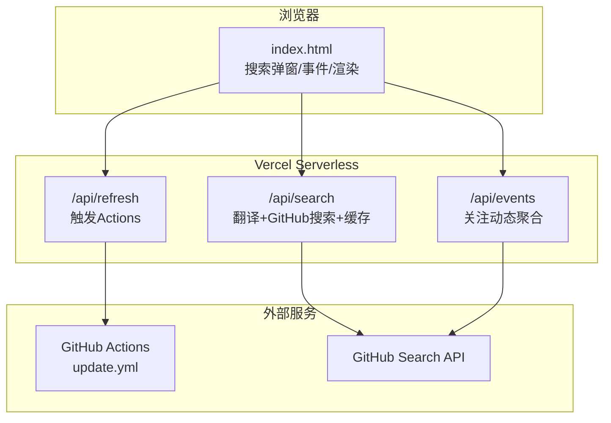
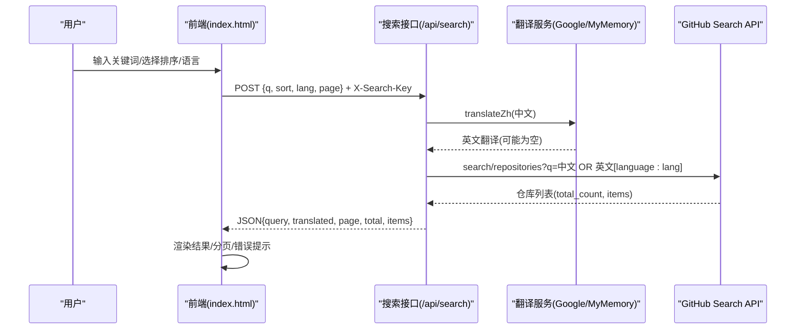
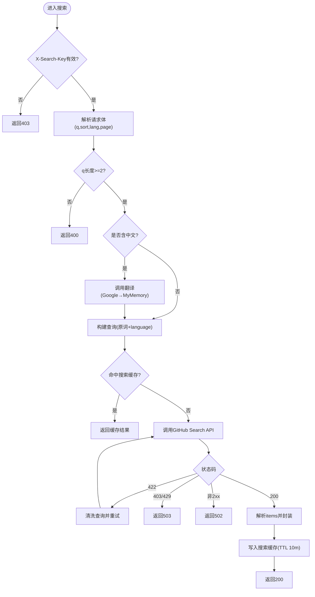
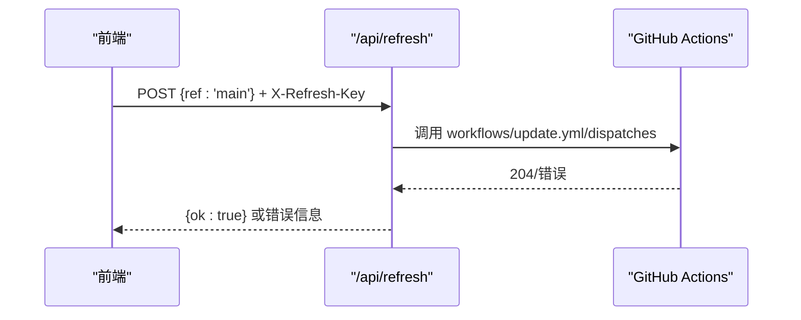
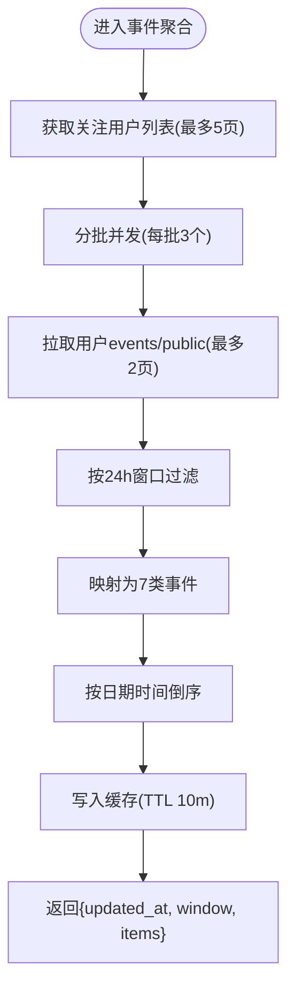
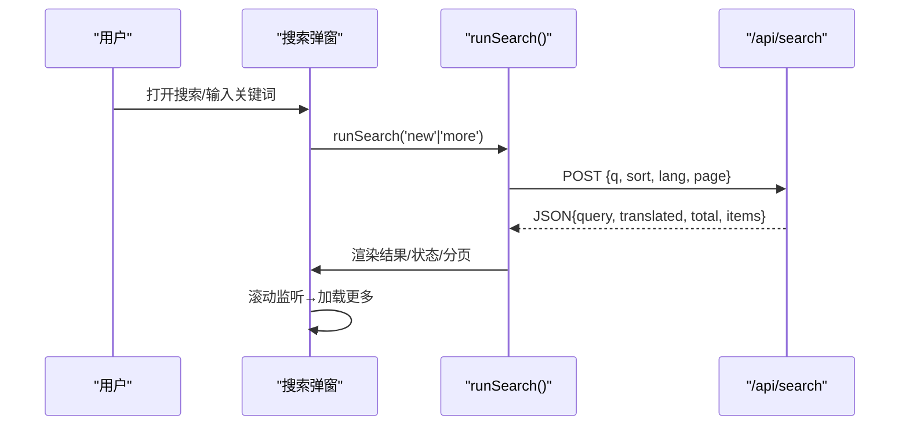
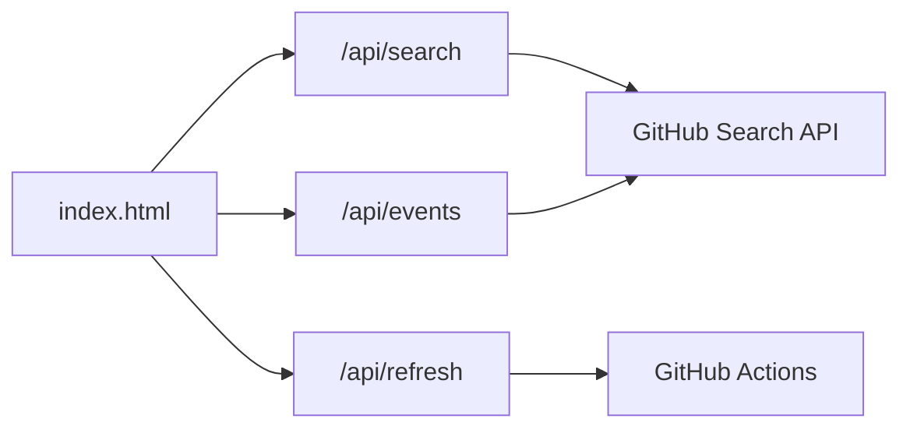

# 实时搜索系统

<cite>
**本文引用的文件**
- [api/search.js](file://api/search.js)
- [api/refresh.js](file://api/refresh.js)
- [api/events.js](file://api/events.js)
- [index.html](file://index.html)
- [README.md](file://README.md)
- [package.json](file://package.json)
</cite>

## 目录
1. [简介](#简介)
2. [项目结构](#项目结构)
3. [核心组件](#核心组件)
4. [架构总览](#架构总览)
5. [详细组件分析](#详细组件分析)
6. [依赖关系分析](#依赖关系分析)
7. [性能考量](#性能考量)
8. [故障排查指南](#故障排查指南)
9. [结论](#结论)
10. [附录](#附录)

## 简介
本系统提供“跨语言实时搜索”能力：用户输入中文关键词，后端自动翻译为英文并与原词组合查询 GitHub Search API，返回仓库列表；同时支持按排序、语言、分页等条件筛选。系统还包含“刷新机制”，通过触发 GitHub Actions 工作流更新数据源，前端可轮询或手动刷新以获取最新内容。文档将深入解释翻译策略、缓存设计、排序过滤逻辑、实时刷新与前后端集成方式，并给出常见问题解决方案。

## 项目结构
- 服务端（Vercel Serverless Functions）
  - /api/search：跨语言搜索入口，负责翻译、构建查询、调用 GitHub Search API、结果缓存与错误处理
  - /api/refresh：中转触发 GitHub Actions workflow_dispatch，用于后台增量更新
  - /api/events：聚合关注账号近 24 小时动态，供前端展示“实时关注”信息流
- 前端（静态页面）
  - index.html：主界面，包含搜索弹窗、事件监听、状态管理、渲染与交互逻辑
- 其他
  - README.md：项目说明与自动更新流程
  - package.json：Node 依赖（RSS 聚合相关）

图表来源
- [index.html:976-987](file://index.html#L976-L987)
- [api/search.js:1-177](file://api/search.js#L1-L177)
- [api/refresh.js:1-65](file://api/refresh.js#L1-L65)
- [api/events.js:1-161](file://api/events.js#L1-L161)

章节来源
- [README.md:1-22](file://README.md#L1-L22)
- [package.json:1-9](file://package.json#L1-L9)

## 核心组件
- 跨语言搜索（search.js）
  - 中文→英文翻译：Google 非官方端点优先，失败降级到 MyMemory，均失败则仅用原词
  - 查询构建：中文与英文组合为“OR”查询，含空格时加引号；可选 language 过滤
  - GitHub Search 调用：带认证头、版本头、超时控制；422 时清洗查询重试一次
  - 缓存：搜索结果内存缓存 10 分钟（key=查询|排序|语言|页码），翻译结果缓存 1 小时
  - 安全：CORS 白名单 + X-Search-Key 弱鉴权；限频返回 503
- 刷新机制（refresh.js）
  - 通过 GitHub API 触发 update.yml 工作流（ref=main）
  - CORS 白名单 + X-Refresh-Key 鉴权；失败不泄露上游细节
- 实时关注（events.js）
  - 拉取关注用户列表，并发抓取 events/public（每用户最多 2 页）
  - 24 小时滚动窗口过滤，映射为 7 类事件，结果按时间倒序
  - 内存缓存 10 分钟，降低 GitHub API 压力
- 前端集成（index.html）
  - 搜索弹窗：打开即发起搜索，支持编辑查询、语言筛选、排序切换、无限滚动加载更多
  - 状态管理：loading、empty、error、more 状态渲染；AbortController 取消重复请求
  - 事件监听：滚动到底部触发加载更多；键盘快捷键（/ 聚焦搜索框，Esc 关闭弹窗）

章节来源
- [api/search.js:1-177](file://api/search.js#L1-L177)
- [api/refresh.js:1-65](file://api/refresh.js#L1-L65)
- [api/events.js:1-161](file://api/events.js#L1-L161)
- [index.html:976-987](file://index.html#L976-L987)
- [index.html:1300-1500](file://index.html#L1300-L1500)

## 架构总览

图表来源
- [api/search.js:30-91](file://api/search.js#L30-L91)
- [index.html:1321-1359](file://index.html#L1321-L1359)

## 详细组件分析

### 跨语言搜索（search.js）
- 翻译机制
  - 首选 Google 非官方端点（免 key），超时 8s；解析响应片段拼接英文
  - 失败降级 MyMemory，同样超时 8s；记录警告日志
  - 两者均失败返回 null，前端会显示“翻译不可用”的提示
- 查询构建
  - 若翻译成功且与原词不同，构造“中文 OR 英文”；否则仅使用原词
  - 含空格的词加引号以避免默认 AND 行为
  - 附加 language 过滤参数
- GitHub 搜索
  - 设置 Authorization、Accept、X-GitHub-Api-Version、User-Agent
  - 超时 15s；422 时去除引号与多余空白后重试一次
  - 403/429 返回 503（频繁访问）；其他非 2xx 返回 502（上游不可用）
- 缓存策略
  - 搜索结果缓存 key = query|sort|page，TTL 10 分钟
  - 翻译结果缓存 key = 原词，TTL 1 小时
  - 内存 Map 实现，冷启动丢失可接受
- 安全与防护
  - CORS 白名单 Origin（统一小写比较）
  - X-Search-Key 必须匹配 REFRESH_KEY
  - 请求体大小限制与格式校验

图表来源
- [api/search.js:96-177](file://api/search.js#L96-L177)

章节来源
- [api/search.js:1-177](file://api/search.js#L1-L177)

### 刷新机制（refresh.js）
- 功能：POST /api/refresh → 触发 starhub 仓库的 update.yml 工作流（ref=main）
- 安全：CORS 白名单；X-Refresh-Key 需匹配 REFRESH_KEY；未配置 GH_TOKEN 返回 500
- 错误处理：上游失败不泄露细节，返回对应状态码；异常捕获返回 502
- 用途：配合前端按钮或定时任务，实现数据源的增量更新

图表来源
- [api/refresh.js:12-65](file://api/refresh.js#L12-L65)

章节来源
- [api/refresh.js:1-65](file://api/refresh.js#L1-L65)

### 实时关注（events.js）
- 数据源：GitHub Events API（public），对每个关注用户最多拉取 2 页
- 过滤：24 小时滚动窗口（北京时间），只保留近期事件
- 事件类型映射：repo/star/follow/pr/release/public/push
- 并发控制：每批 3 个用户并发，失败静默跳过
- 缓存：结果内存缓存 10 分钟，减少上游压力

图表来源
- [api/events.js:55-161](file://api/events.js#L55-L161)

章节来源
- [api/events.js:1-161](file://api/events.js#L1-L161)

### 前端集成（index.html）
- 搜索弹窗
  - 打开时初始化语言选项、当前查询词、排序标签
  - 立即执行 runSearch('new')，显示 loading 状态
- 搜索请求
  - 使用 AbortController 避免重复请求
  - 携带 X-Search-Key 与 body {q, sort, lang, page}
  - 根据 HTTP 状态码区分错误类型（503 频繁访问，其他错误提示）
- 结果渲染
  - 显示实际查询词（可能为原词或翻译后的组合）
  - 当 translated=false 时提示“翻译不可用”
  - 渲染条目：名称、描述、语言、星标数、更新时间、话题标签
  - 分页：已加载条数与 total 对比，滚动到底部加载更多
- 事件监听
  - 滚动监听：接近底部时触发 runSearch('more')
  - 键盘快捷键：/ 聚焦搜索框，Esc 关闭弹窗
  - 编辑查询：点击编辑后回车确认，变更时重新搜索

图表来源
- [index.html:1300-1500](file://index.html#L1300-L1500)
- [index.html:1875-1902](file://index.html#L1875-L1902)

章节来源
- [index.html:976-987](file://index.html#L976-L987)
- [index.html:1300-1500](file://index.html#L1300-L1500)
- [index.html:1875-1902](file://index.html#L1875-L1902)

## 依赖关系分析
- 模块耦合
  - search.js 依赖环境变量 GH_TOKEN、REFRESH_KEY；对外暴露 CORS 白名单与鉴权头
  - refresh.js 依赖 GH_TOKEN；通过 GitHub API 触发 Actions
  - events.js 依赖 GH_TOKEN；聚合关注用户事件
  - index.html 依赖 /api/search、/api/events、/api/refresh；使用 AbortController 管理请求生命周期
- 外部依赖
  - GitHub Search API、GitHub Events API、GitHub Actions API
  - 翻译服务：Google 非官方端点、MyMemory
- 潜在循环依赖
  - 无直接循环依赖；各函数独立处理请求并返回 JSON

图表来源
- [index.html:976-987](file://index.html#L976-L987)
- [api/search.js:75-91](file://api/search.js#L75-L91)
- [api/events.js:41-53](file://api/events.js#L41-L53)
- [api/refresh.js:40-54](file://api/refresh.js#L40-L54)

章节来源
- [api/search.js:1-177](file://api/search.js#L1-L177)
- [api/refresh.js:1-65](file://api/refresh.js#L1-L65)
- [api/events.js:1-161](file://api/events.js#L1-L161)
- [index.html:976-987](file://index.html#L976-L987)

## 性能考量
- 翻译优化
  - 翻译结果缓存 1 小时，减少重复翻译开销
  - 超时 8s 防止阻塞
- 搜索缓存
  - 搜索结果缓存 10 分钟，key 包含查询、排序、语言、页码
  - 422 清洗后重试，提高成功率
- 并发与限流
  - events 聚合每批 3 个用户并发，失败静默跳过
  - 搜索接口对 403/429 返回 503，提示稍后再试
- 前端体验
  - AbortController 取消重复请求，避免竞态
  - 滚动加载更多，减少首屏负载
  - 错误状态友好提示，支持重试

## 故障排查指南
- 翻译失败
  - 现象：translated=false，提示“翻译服务暂不可用”
  - 原因：Google/MyMemory 均失败或超时
  - 解决：检查网络；等待服务恢复；必要时调整超时或更换翻译端点
- 搜索超时或频繁访问
  - 现象：HTTP 503 “搜索太频繁”
  - 原因：GitHub 限频或网络抖动
  - 解决：稍后重试；降低请求频率；检查 REFRESH_KEY 配置
- 上游服务不可用
  - 现象：HTTP 502 “上游服务不可用”
  - 原因：GitHub API 异常或网络问题
  - 解决：查看 Vercel 日志；检查 GH_TOKEN 权限；重试
- 缓存不一致
  - 现象：搜索结果未更新
  - 原因：内存缓存 TTL 未到
  - 解决：等待过期；或刷新数据源后再次搜索
- 刷新失败
  - 现象：/api/refresh 返回错误
  - 原因：GH_TOKEN 未配置或 Actions 触发失败
  - 解决：检查环境变量；验证 Actions 权限；查看 GitHub 日志

章节来源
- [api/search.js:109-177](file://api/search.js#L109-L177)
- [api/refresh.js:29-65](file://api/refresh.js#L29-L65)
- [api/events.js:126-161](file://api/events.js#L126-L161)
- [index.html:1341-1359](file://index.html#L1341-L1359)

## 结论
本系统通过“翻译+组合查询”实现跨语言搜索，结合内存缓存与超时控制提升稳定性与性能；通过 /api/refresh 触发 Actions 实现数据源增量更新；前端提供友好的搜索交互与状态管理。整体架构清晰、扩展性强，适合在 Vercel 环境下部署与维护。

## 附录
- 环境变量
  - GH_TOKEN：GitHub API 访问令牌（搜索、事件、Actions 触发）
  - REFRESH_KEY：搜索与刷新接口的弱鉴权密钥
  - AGIHUNT_API_KEY：AGI Hunt 资讯代理密钥（未在本文重点展开）
- 关键路径参考
  - 搜索逻辑：[api/search.js:96-177](file://api/search.js#L96-L177)
  - 刷新逻辑：[api/refresh.js:12-65](file://api/refresh.js#L12-L65)
  - 事件聚合：[api/events.js:55-161](file://api/events.js#L55-L161)
  - 前端搜索：[index.html:1300-1500](file://index.html#L1300-L1500)