# 核心功能模块

<cite>
**本文引用的文件**
- [README.md](file://README.md)
- [package.json](file://package.json)
- [fetch_and_build.py](file://fetch_and_build.py)
- [known_categories.json](file://known_categories.json)
- [build_ai_daily.py](file://build_ai_daily.py)
- [trending_snapshot.json](file://trending_snapshot.json)
- [index.html](file://index.html)
- [rss-aggregator.html](file://rss-aggregator.html)
- [insight_engine.py](file://insight_engine.py)
- [test_insight_engine.py](file://test_insight_engine.py)
- [build_rss_aggregator.py](file://build_rss_aggregator.py)
- [api/agihunt.js](file://api/agihunt.js)
- [api/rss.js](file://api/rss.js)
- [api/search.js](file://api/search.js)
- [api/events.js](file://api/events.js)
- [api/refresh.js](file://api/refresh.js)
- [build_config.json](file://build_config.json)
</cite>

## 更新摘要
**变更内容**
- **重大改进** AI洞察引擎提示约束增强：在深度洞察生成过程中添加了禁止提及上下文中缺失关键词的约束，有效减少AI幻觉问题，提升内容生成质量和准确性
- **持续优化** 统一的嵌入基础设施和智能聚类算法保持稳定运行
- **性能提升** 多提供商嵌入模型支持和降级机制继续完善

## 目录
1. [简介](#简介)
2. [项目结构](#项目结构)
3. [核心组件](#核心组件)
4. [架构总览](#架构总览)
5. [详细组件分析](#详细组件分析)
6. [依赖关系分析](#依赖关系分析)
7. [性能考量](#性能考量)
8. [故障排查指南](#故障排查指南)
9. [结论](#结论)
10. [附录](#附录)

## 简介
本仓库是一个"GitHub Star 收藏台"与"AI 热点聚合"的自动化系统。它通过 GitHub Actions 定时拉取用户的 Star 列表，进行智能分类并生成静态页面；同时提供 RSS 内容聚合、实时搜索（跨语言翻译+缓存）、AI 项目趋势分析与排行榜、以及关注账号动态聚合等能力。前端以编辑风格的数据书排版呈现，支持模糊搜索、语言/星标筛选、置顶收藏等功能。

**最新更新**：系统集成了先进的 AI 洞察引擎，通过 LlamaIndex 框架实现语义级热点分析，包括智能聚类、关键词提取、跨平台匹配和深度洞察生成。**最新优化**：实现了统一的嵌入基础设施，支持SiliconFlow BAAI/bge-m3模型和多提供商集成，提供了完善的降级机制确保在外部API不可用时的可靠性。n-gram标记化策略升级为3-4 gram，聚类阈值调整为0.55，新增自动标签去重功能。**重要改进**：在深度洞察生成过程中添加了严格的提示约束，禁止AI提及上下文中缺失的关键词，有效减少幻觉问题，提升内容生成的准确性和可靠性。

## 项目结构
- 自动更新脚本：每天北京时间 09:00 运行，拉取 star → 分类 → 生成 index.html，并提交到 Pages 触发部署。
- 数据与配置：已知分类映射、RSS 源、快照数据、趋势快照等。
- Vercel Serverless API：提供 AGI Hunt 资讯代理、RSS 聚合、全网搜索、事件聚合、刷新工作流等接口。
- 前端页面：收藏台主页与 RSS 聚合阅读器。
- **新增**：AI 洞察引擎（insight_engine.py）：基于 LlamaIndex 的语义分析流水线，提供深度洞察和智能聚类功能，支持多提供商嵌入模型。

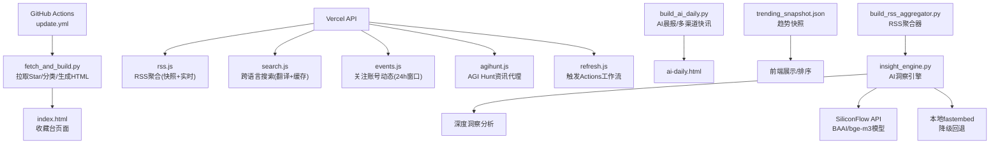

**图表来源**
- [README.md:1-22](file://README.md#L1-L22)
- [fetch_and_build.py:1-200](file://fetch_and_build.py#L1-L200)
- [insight_engine.py:1-1003](file://insight_engine.py#L1-L1003)
- [build_rss_aggregator.py:6008-6099](file://build_rss_aggregator.py#L6008-L6099)

章节来源
- [README.md:1-22](file://README.md#L1-L22)

## 核心组件
- 自动拉取与智能分类：基于 Python 脚本拉取用户 Star 列表，结合规则与已知分类映射，将项目归入 11 个类别，并生成静态页面。
- **增强** AI 洞察引擎：基于 LlamaIndex 的语义分析流水线，包含 AgnesLLM 包装类、MockLLM 降级方案、统一嵌入基础设施、向量索引构建、关键词提取、话题聚类和深度洞察生成。
- **重大更新** 统一嵌入基础设施：实现了多提供商嵌入模型支持，优先使用 SiliconFlow BAAI/bge-m3 API（生产环境），自动降级到本地 fastembed 模型，确保系统可靠性。
- **重大更新** 智能聚类标签生成：_extract_cluster_label 函数实现了复杂的 TF-IDF 权重系统，采用3-4 gram n-gram标记化策略，结合全局 IDF 计算和增强的中英文高频词支持，显著改进了从聚类内容生成有意义主题标签的能力。
- **重大更新** 文档加载配额制：实现了平衡的代表性机制，确保热榜、Trending、RSS 等不同数据源都有适当的代表性，避免高优先级源挤占全部名额。
- AI 项目趋势分析：多 topic 搜索构建 AI 项目池，计算热度与新秀榜，输出趋势快照供前端展示。
- RSS 内容聚合：服务端聚合多源 RSS/Atom，深度清洗 HTML，按层级（T1/T2/T3）合并快照与实时抓取，并提供中文翻译与去重。
- 实时搜索：中文输入自动翻译为英文，组合查询 GitHub 搜索 API，结果内存缓存，支持分页与语言过滤。
- 关注账号动态：聚合关注用户的公开事件，按 24 小时滚动窗口过滤，映射为 7 类事件。
- 工作流触发：通过安全头校验后调用 GitHub API 触发 Actions 工作流，实现手动刷新。

章节来源
- [fetch_and_build.py:18-128](file://fetch_and_build.py#L18-L128)
- [fetch_and_build.py:152-200](file://fetch_and_build.py#L152-L200)
- [insight_engine.py:76-158](file://insight_engine.py#L76-L158)
- [insight_engine.py:299-353](file://insight_engine.py#L299-L353)
- [insight_engine.py:394-574](file://insight_engine.py#L394-L574)
- [insight_engine.py:635-697](file://insight_engine.py#L635-697)
- [api/rss.js:1-120](file://api/rss.js#L1-L120)
- [api/search.js:1-60](file://api/search.js#L1-L60)
- [api/events.js:1-40](file://api/events.js#L1-L40)
- [api/refresh.js:1-30](file://api/refresh.js#L1-L30)

## 架构总览
系统由"构建流水线 + Serverless API + 前端页面 + AI 洞察引擎"组成。构建流水线负责每日数据更新与页面生成；Serverless API 提供实时数据服务（RSS、搜索、事件、资讯代理、刷新）；前端页面消费这些接口并渲染交互界面；AI 洞察引擎提供深度语义分析和智能聚类功能，支持多提供商嵌入模型和完善的降级机制。

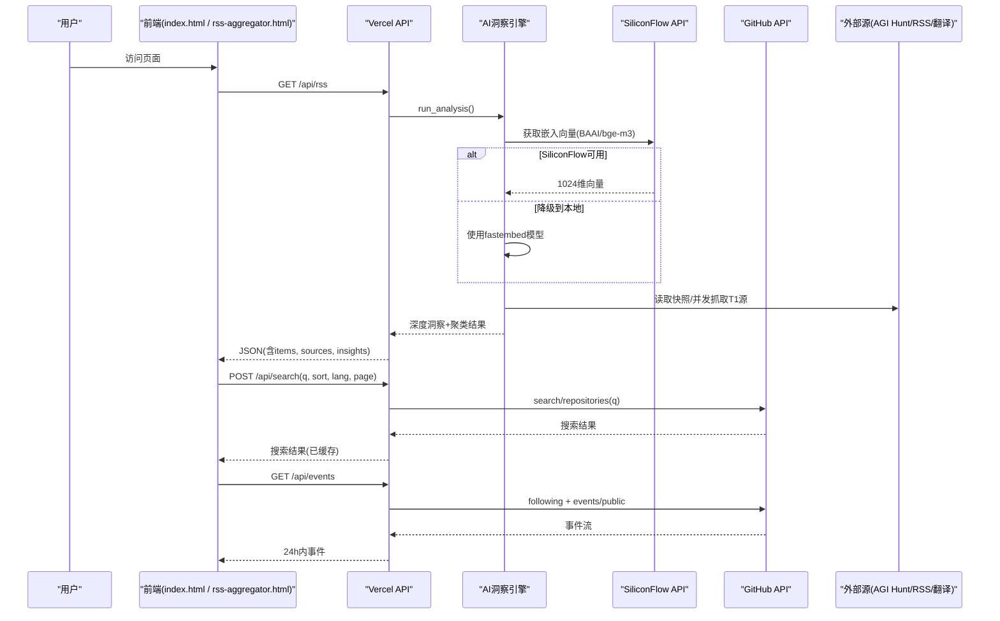

**图表来源**
- [api/rss.js:289-468](file://api/rss.js#L289-L468)
- [insight_engine.py:299-353](file://insight_engine.py#L299-L353)
- [insight_engine.py:725-822](file://insight_engine.py#L725-822)
- [api/search.js:96-177](file://api/search.js#L96-L177)
- [api/events.js:114-161](file://api/events.js#L114-L161)

## 详细组件分析

### 自动拉取与智能分类（11个类别）
- 自动拉取：脚本分页拉取用户 Star 列表，合并去重，必要时回退本地 JSON。
- 智能分类：对未知新项目使用关键词规则进行分类，优先匹配语义明确的短语，避免泛词误伤；已有项目走 known_categories.json 保持稳定。
- 11个类别：AI Agent & Skills、思维蒸馏 & 认知、AI 视频创作、AI 编程 & 工具链、内容创作 & 排版、AI 学习 & 教程、AI 助手 & 应用、实用工具 & 资源、金融 & 交易、商业 · 一人公司与知产、前端 & 设计系统。
- 页面生成：根据分类与语言颜色、默认置顶项等生成 index.html。

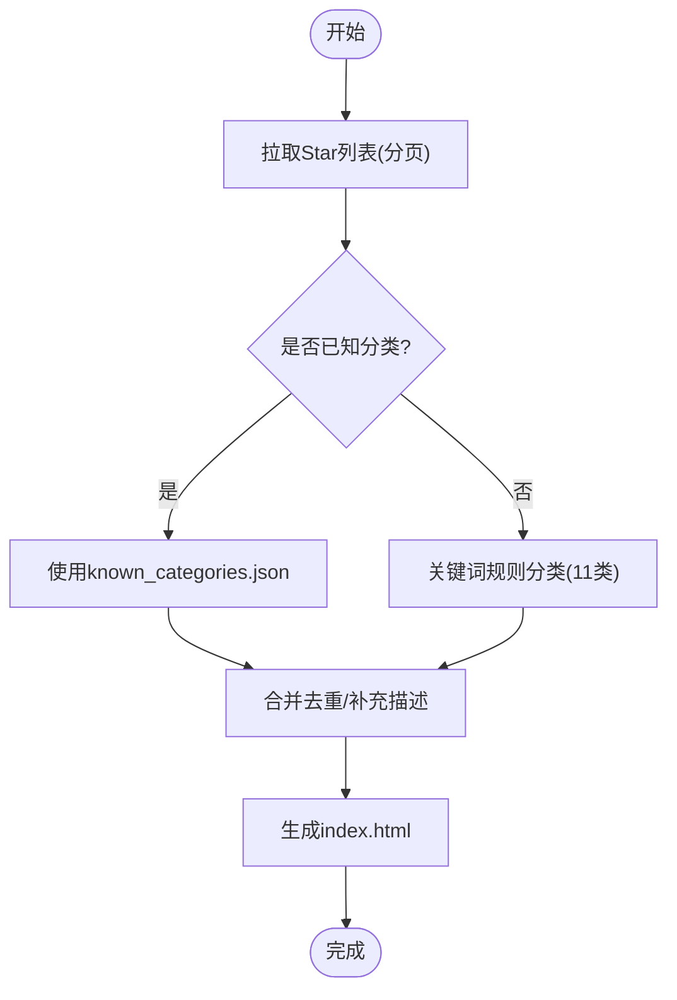

**图表来源**
- [fetch_and_build.py:18-128](file://fetch_and_build.py#L18-L128)
- [known_categories.json:1-200](file://known_categories.json#L1-L200)

章节来源
- [fetch_and_build.py:18-128](file://fetch_and_build.py#L18-L128)
- [known_categories.json:1-200](file://known_categories.json#L1-L200)

### AI 洞察引擎（LlamaIndex 语义分析）
**增强** 基于 LlamaIndex 的智能分析流水线，提供深度语义理解和洞察生成能力，现已实现统一的嵌入基础设施。

- **AgnesLLM 包装类**：封装 Agnes AI 聊天补全 API，支持系统提示、温度控制和最大令牌数设置。
- **MockLLM 降级方案**：在离线或无密钥场景下提供确定性模拟响应，确保系统可用性。
- **统一嵌入基础设施**：实现了多提供商嵌入模型支持，优先使用 SiliconFlow BAAI/bge-m3 API（生产环境），自动降级到本地 fastembed 模型。
- **文档加载与索引构建**：将热榜、趋势数据和 RSS 内容转换为 LlamaIndex 文档对象，构建向量索引用于语义检索。
- **关键词提取**：使用 LLM 从文本样本中提取最重要的关键词，支持 JSON 格式解析和降级处理。
- **智能聚类**：基于嵌入向量的贪心聚类算法，按余弦相似度分组相似内容，支持预计算向量复用。
- **跨平台语义匹配**：检测不同平台间的语义相似内容，识别跨平台热点。
- **深度洞察生成**：利用 LLM 生成叙事分析、因果链条、异动信号和未来展望。

**重要改进** 提示约束增强：在深度洞察生成过程中添加了严格的提示约束，明确禁止AI提及上下文中缺失的关键词，要求AI只分析上下文中实际存在的内容。这一改进有效减少了AI幻觉问题，提升了内容生成的准确性和可靠性。

**章节来源**
- [insight_engine.py:76-158](file://insight_engine.py#L76-L158)
- [insight_engine.py:162-225](file://insight_engine.py#L162-L225)
- [insight_engine.py:299-353](file://insight_engine.py#L299-L353)
- [insight_engine.py:490-512](file://insight_engine.py#L490-L512)
- [insight_engine.py:652-676](file://insight_engine.py#L652-676)
- [insight_engine.py:1002-1018](file://insight_engine.py#L1002-L1018)

### 统一嵌入基础设施（多提供商支持）
**重大更新** 实现了统一的嵌入基础设施，支持多提供商嵌入模型和完善的降级机制。

- **SiliconFlow API集成**：优先使用 SiliconFlow BAAI/bge-m3 API，提供1024维向量表示，支持8192 token上下文，中英双语支持。
- **批量处理优化**：每批最多处理32条文本，提高API调用效率。
- **本地fastembed回退**：当SiliconFlow API不可用时，自动降级到本地fastembed模型（BAAI/bge-m3或BAAI/bge-small-en-v1.5）。
- **模型选择策略**：记录最近一次成功的嵌入模型名称，用于后续索引构建和元数据报告。
- **错误处理机制**：详细的错误日志和异常捕获，确保系统稳定性。

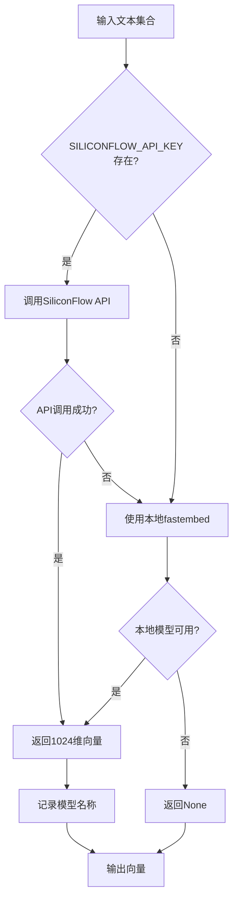

**图表来源**
- [insight_engine.py:299-353](file://insight_engine.py#L299-L353)

**章节来源**
- [insight_engine.py:299-353](file://insight_engine.py#L299-L353)

### 智能聚类标签生成（TF-IDF 权重系统与3-4 gram标记化）
**重大更新** _extract_cluster_label 函数实现了复杂的 TF-IDF 权重系统，采用3-4 gram n-gram标记化策略，显著提升了聚类标签生成的质量。

- **3-4 gram n-gram标记化**：相比传统的2-gram，3-4 gram提供了更强的语义辨识度（如"杰出论" vs "出论"），有效避免了短词组的歧义性。
- **全局 IDF 计算**：遍历所有文档文本，计算每个中文 n-gram 的全局文档频率（DF），用于平滑 IDF 计算。
- **中文高频 n-gram 提取**：去除停用字符和无意义 n-gram，计算簇内频率，结合全局 IDF 加权评分。
- **长度奖励机制**：为更长的 n-gram（4-gram）提供额外分数奖励，鼓励选择更有语义完整性的标签。
- **英文/混合词处理**：过滤常见英文停用词，统计高频英文单词，选择出现次数最多的词汇作为标签。
- **阈值控制**：要求候选标签在簇内至少出现 2 次或占总数的 30%，确保标签的代表性。
- **降级策略**：当无法提取有意义的标签时，回退到最长文本截断策略。

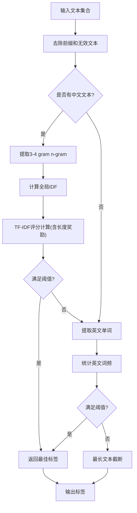

**图表来源**
- [insight_engine.py:394-574](file://insight_engine.py#L394-L574)

**章节来源**
- [insight_engine.py:394-574](file://insight_engine.py#L394-L574)

### 增强型聚类算法（阈值优化与自动去重）
**重大更新** 聚类算法进行了多项重要优化，提升了话题分离的准确性和效率。

- **聚类阈值优化**：相似度阈值从0.5调整到0.55，支持更精细的话题分离，减少误聚类现象。
- **自动标签去重和合并**：在聚类完成后，自动检测并合并相同标签的簇，防止冗余话题表示。
- **锚点比较机制**：使用锚点比较（而非贪婪链接）防止链式聚类，提高聚类质量。
- **单簇上限控制**：限制单个簇的最大成员数量，防止巨型簇的形成。
- **预计算向量复用**：支持传入预计算的embedding向量，避免重复调用API，提高效率。
- **多级回退机制**：SiliconFlow API不可用时自动回退到本地fastembed模型，再失败则使用字符重叠聚类。

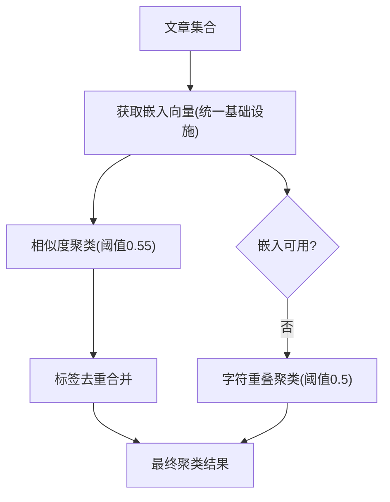

**图表来源**
- [insight_engine.py:635-697](file://insight_engine.py#L635-L697)
- [insight_engine.py:577-606](file://insight_engine.py#L577-L606)

**章节来源**
- [insight_engine.py:635-697](file://insight_engine.py#L635-L697)
- [insight_engine.py:577-606](file://insight_engine.py#L577-L606)

### 文档加载配额制（平衡数据源代表）
**重大更新** load_documents 函数实现了智能配额制机制，确保不同数据源的平衡代表。

- **配额分配策略**：默认 max_documents=500 时，RSS 350 + 热榜 100 + Trending 50，确保各类型数据都有适当代表。
- **优先级保障**：热榜数据最高优先级，Trending 次之，RSS 最低，但都保证最低配额。
- **动态回退机制**：未用完的配额会优先分配给 RSS（因为话题聚类依赖它），然后依次分配给热榜和 Trending。
- **灵活性保障**：即使某个数据源为空，其他数据源也能充分利用配额空间。
- **质量控制**：RSS 数据截取 summary 前300字符，整体文本限制500字符，确保处理效率。

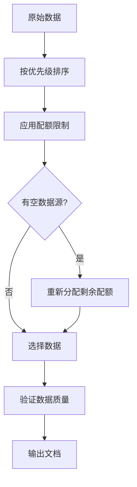

**图表来源**
- [insight_engine.py:175-245](file://insight_engine.py#L175-L245)

**章节来源**
- [insight_engine.py:175-245](file://insight_engine.py#L175-L245)

### AI 项目趋势分析系统（排行榜算法、趋势数据、新项目发现）
- 项目池构建：按多个 AI 相关 topic 搜索 GitHub 仓库，设置最小星标阈值，合并去重形成候选池。
- 排行榜算法：综合编辑评分、跨源报道数、信源权重、分类权重与新鲜度，计算头条候选分数，选出 Top N。
- 趋势快照：维护 trending_snapshot.json，作为前端展示与排序的基础数据。
- 新项目发现：通过较低星标阈值与时间窗口筛选，识别新兴项目进入新秀榜。

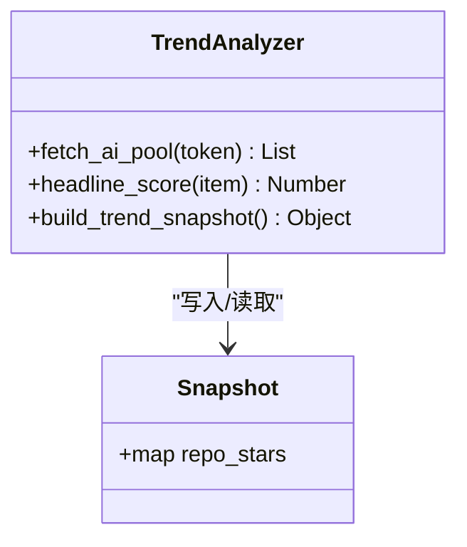

**图表来源**
- [fetch_and_build.py:152-200](file://fetch_and_build.py#L152-L200)
- [trending_snapshot.json:1-20](file://trending_snapshot.json#L1-L20)

章节来源
- [fetch_and_build.py:152-200](file://fetch_and_build.py#L152-L200)
- [trending_snapshot.json:1-20](file://trending_snapshot.json#L1-L20)

### RSS 内容聚合（多源聚合、内容提取与格式化、分类浏览）
- 多源聚合：加载 rss_sources.json，按 tier 分层处理；T1 实时抓取，T2/T3 从构建时生成的快照读取。
- 内容提取与清洗：解析 RSS/Atom，提取标题、链接、摘要、发布时间；深度清洗 HTML，移除广告、推广、订阅引导等噪音，保留安全标签。
- 翻译与缓存：对 T1 英文源标题与摘要进行多端点降级翻译（Google gtx → MyMemory → Google dict-chrome），翻译结果持久化至 translations.json。
- 分类浏览：前端按分类与来源组织卡片墙，支持未读标记、搜索高亮、来源面板折叠展开。
- **增强** AI 洞察集成：通过 build_rss_aggregator.py 集成 insight_engine，提供深度洞察分析和智能聚类功能，支持多提供商嵌入模型。

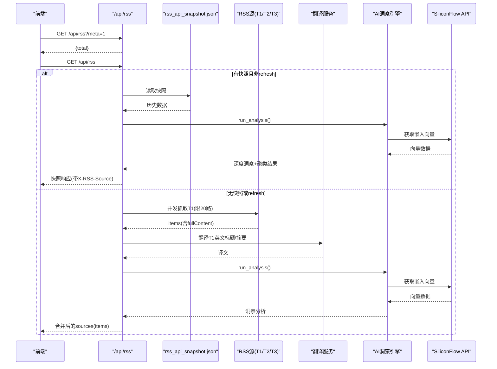

**图表来源**
- [api/rss.js:19-468](file://api/rss.js#L19-L468)
- [build_rss_aggregator.py:6008-6099](file://build_rss_aggregator.py#L6008-L6099)
- [insight_engine.py:299-353](file://insight_engine.py#L299-L353)
- [insight_engine.py:725-822](file://insight_engine.py#L725-822)

章节来源
- [api/rss.js:1-468](file://api/rss.js#L1-L468)
- [rss-aggregator.html:1-200](file://rss-aggregator.html#L1-L200)
- [build_rss_aggregator.py:6008-6099](file://build_rss_aggregator.py#L6008-L6099)

### 实时搜索（跨语言搜索、智能翻译、缓存机制）
- 跨语言搜索：中文输入自动翻译为英文，构建 "中文 OR 英文" 查询；若翻译失败则仅用原词。
- 智能翻译：优先 Google gtx，失败降级 MyMemory，再失败尝试 Google dict-chrome；翻译结果按原文哈希缓存 1 小时。
- 缓存机制：搜索结果按 query|sort|page 键值缓存 10 分钟；分页上限 34（每页 30）。
- 安全防护：CORS 白名单、X-Search-Key 校验、GitHub Token 环境变量注入。

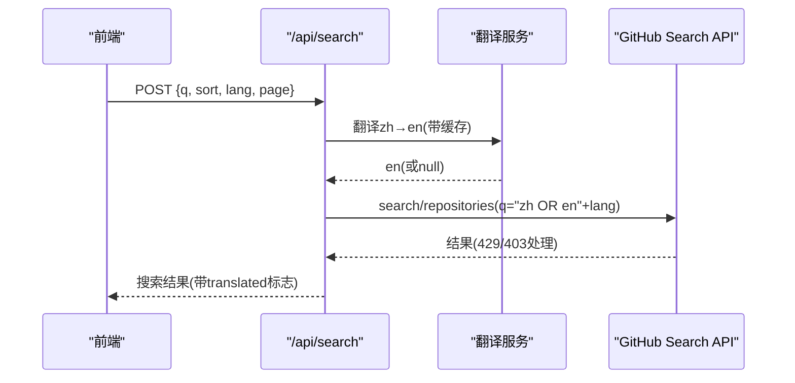

**图表来源**
- [api/search.js:30-91](file://api/search.js#L30-L91)
- [api/search.js:96-177](file://api/search.js#L96-L177)

章节来源
- [api/search.js:1-177](file://api/search.js#L1-L177)

### 关注账号动态（近24小时滚动窗口）
- 数据获取：拉取关注用户列表，逐用户获取 events/public（最多 2 页），按创建时间过滤到最近 24 小时。
- 事件映射：将 CreateEvent、WatchEvent、FollowEvent、PullRequestEvent、ReleaseEvent、PublicEvent、PushEvent 映射为统一结构。
- 缓存与限流：结果内存缓存 10 分钟；每批并发 3 个用户，失败静默跳过。

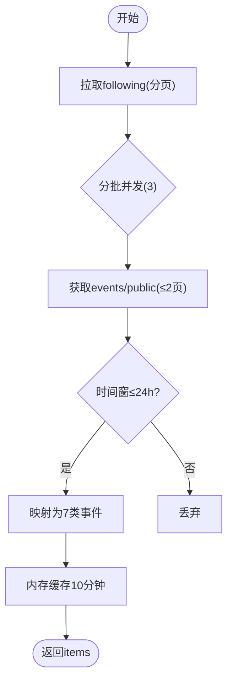

**图表来源**
- [api/events.js:55-112](file://api/events.js#L55-L112)
- [api/events.js:114-161](file://api/events.js#L114-L161)

章节来源
- [api/events.js:1-161](file://api/events.js#L1-L161)

### 工作流触发（手动刷新）
- 安全校验：CORS 白名单或携带正确 X-Refresh-Key；检查 REFRESH_KEY 环境变量。
- 触发流程：调用 GitHub API 触发 update.yml 工作流（ref=main），成功返回 ok。

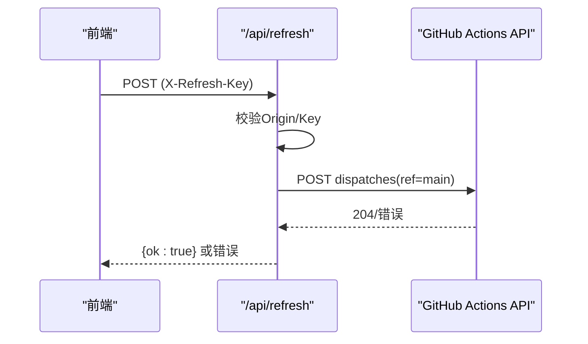

**图表来源**
- [api/refresh.js:1-65](file://api/refresh.js#L1-L65)

章节来源
- [api/refresh.js:1-65](file://api/refresh.js#L1-L65)

### AGI Hunt 资讯代理
- 代理模式：服务端持有 AGIHUNT_API_KEY，前端通过代理访问 AGI Hunt Agent API，避免密钥泄露。
- 参数校验：channel 白名单、day 格式校验、sort 取值限制。
- 缓存策略：按 channel|day|sort 键值缓存 10 分钟，最多 20 条，淘汰最旧条目。
- CORS 防护：仅允许指定域名，OPTIONS 预检直接返回。

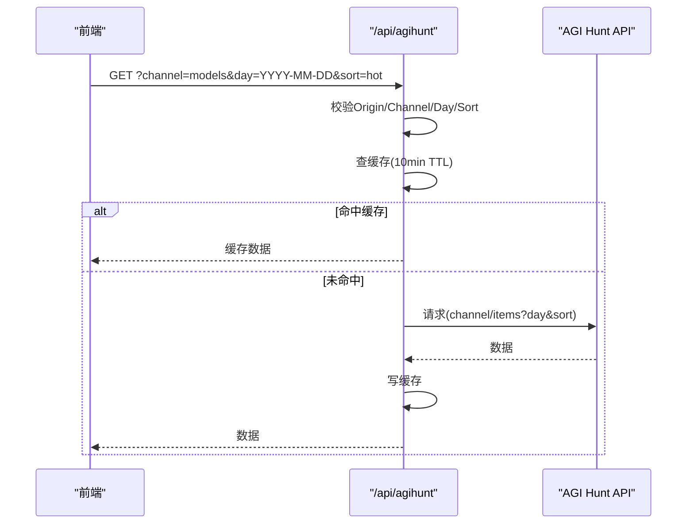

**图表来源**
- [api/agihunt.js:1-113](file://api/agihunt.js#L1-L113)

章节来源
- [api/agihunt.js:1-113](file://api/agihunt.js#L1-L113)

## 依赖关系分析
- 运行时依赖：Node.js 环境用于 Vercel Serverless 函数；Python 标准库用于构建脚本；可选的 LlamaIndex 和 FastEmbed 用于 AI 洞察引擎。
- 外部依赖：GitHub API（搜索、事件、Actions）、AGI Hunt API、RSS/Atom 源、翻译服务（Google gtx、MyMemory、Google dict-chrome）、Agnes AI API、SiliconFlow API。
- 数据文件：known_categories.json、rss_sources.json、rss_api_snapshot.json、translations.json、trending_snapshot.json、analysis_snapshot.json、build_config.json。

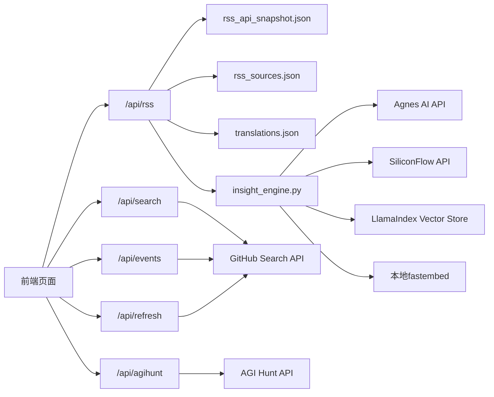

**图表来源**
- [api/rss.js:1-120](file://api/rss.js#L1-L120)
- [insight_engine.py:1-1003](file://insight_engine.py#L1-L1003)
- [api/search.js:1-60](file://api/search.js#L1-L60)
- [api/events.js:1-40](file://api/events.js#L1-L40)
- [api/agihunt.js:1-40](file://api/agihunt.js#L1-L40)
- [api/refresh.js:1-30](file://api/refresh.js#L1-L30)

章节来源
- [package.json:1-9](file://package.json#L1-L9)

## 性能考量
- RSS 聚合：单源超时 5s，并发 20 路；完整响应缓存 5 分钟；失败回滚到滚动缓存，保证可用性。
- 搜索：内存缓存 10 分钟，翻译缓存 1 小时；分页上限 34；异常状态码（403/429）友好提示。
- 事件聚合：24 小时窗口过滤，结果缓存 10 分钟；每批并发 3，失败静默跳过。
- AGI Hunt：10 分钟 TTL，最多 20 条缓存；上游超时 10s。
- **重大优化** AI 洞察引擎：文档加载限制 200 条，关键词提取限制 30 个，话题聚类限制 15 个；嵌入模型使用 SiliconFlow API（BAAI/bge-m3）提供高性能双语嵌入，支持批量处理（每批32条）；LLM 调用超时 30s，支持 MockLLM 降级；实现了统一的嵌入基础设施，避免重复API调用。
- **重大优化** 智能聚类优化：全局 IDF 计算批量处理，3-4 gram n-gram 提取使用正则表达式优化，英文词频统计使用集合去重减少重复计算；聚类阈值优化到0.55，提升话题分离精度；支持预计算向量复用，提高聚类效率。
- **重大优化** 配额制优化：智能配额分配确保数据源平衡，避免单一数据源主导分析结果，提升整体分析质量。
- **重要改进** 提示约束优化：通过禁止AI提及上下文中缺失的关键词，减少了不必要的解释性内容，提高了洞察生成的专注度和准确性。

[本节为通用性能指导，不直接分析具体文件]

## 故障排查指南
- RSS 聚合失败：
  - 检查 rss_api_snapshot.json 是否存在；若不存在，将回退到实时抓取。
  - 查看 rollingCache 中是否有旧数据；若仍为空，确认各源 URL 可达性与 UA/Accept 头。
  - 参考路径：[api/rss.js:203-273](file://api/rss.js#L203-L273)
- 搜索不可用：
  - 确认 GH_TOKEN 已配置；检查 X-Search-Key 是否正确；关注 429/403 限流提示。
  - 参考路径：[api/search.js:109-117](file://api/search.js#L109-L117)
- 事件聚合错误：
  - 确认 GH_TOKEN 已配置；关注用户事件可能受限，失败会静默跳过。
  - 参考路径：[api/events.js:126-130](file://api/events.js#L126-L130)
- AGI Hunt 代理错误：
  - 检查 AGIHUNT_API_KEY 是否配置；确认 channel 在白名单内；day 格式是否符合 YYYY-MM-DD 或 YYYYMMDD。
  - 参考路径：[api/agihunt.js:57-75](file://api/agihunt.js#L57-L75)
- 刷新工作流失败：
  - 确认 REFRESH_KEY 与 X-Refresh-Key 一致；检查 GH_TOKEN 权限（Actions:write）。
  - 参考路径：[api/refresh.js:16-32](file://api/refresh.js#L16-L32)
- **增强** AI 洞察引擎问题：
  - 检查 AGNES_API_KEY 和 SILICONFLOW_API_KEY 环境变量是否配置；确认 llama-index 依赖是否安装。
  - 查看 insight_engine.py 中的日志输出，确认 LLM 调用和嵌入模型是否成功。
  - 如果 LLM 不可用，系统将自动降级到 MockLLM；如果 SiliconFlow API 不可用，将回退到本地 fastembed 模型。
  - 检查嵌入基础设施的工作状态，确认多提供商切换是否正常。
  - 验证文档加载配额制是否正常工作，确保各数据源都有适当代表。
  - **新** 提示约束相关问题：如果洞察生成出现幻觉或无关内容，检查提示约束是否生效，确认AI遵循了"不要提及上下文中缺失关键词"的约束。
  - 参考路径：[insight_engine.py:148-158](file://insight_engine.py#L148-L158)
  - 参考路径：[insight_engine.py:299-353](file://insight_engine.py#L299-L353)
  - 参考路径：[insight_engine.py:635-697](file://insight_engine.py#L635-697)
  - 参考路径：[insight_engine.py:175-245](file://insight_engine.py#L175-L245)
  - 参考路径：[insight_engine.py:1002-1018](file://insight_engine.py#L1002-L1018)

章节来源
- [api/rss.js:203-273](file://api/rss.js#L203-L273)
- [api/search.js:109-117](file://api/search.js#L109-L117)
- [api/events.js:126-130](file://api/events.js#L126-L130)
- [api/agihunt.js:57-75](file://api/agihunt.js#L57-L75)
- [api/refresh.js:16-32](file://api/refresh.js#L16-L32)
- [insight_engine.py:148-158](file://insight_engine.py#L148-L158)
- [insight_engine.py:299-353](file://insight_engine.py#L299-L353)
- [insight_engine.py:635-697](file://insight_engine.py#L635-697)
- [insight_engine.py:175-245](file://insight_engine.py#L175-L245)
- [insight_engine.py:1002-1018](file://insight_engine.py#L1002-L1018)

## 结论
本系统通过"构建流水线 + Serverless API + 前端页面 + AI 洞察引擎"的解耦架构，实现了 GitHub Star 收藏台的自动化管理与 AI 热点内容的实时聚合。**最新的AI洞察引擎实现了统一的嵌入基础设施，支持多提供商（SiliconFlow BAAI/bge-m3模型）和完善的降级机制，显著提升了系统的可靠性和性能**。特别是 _extract_cluster_label 函数实现的复杂 TF-IDF 权重系统和3-4 gram n-gram标记化策略，显著提升了从聚类内容生成有意义主题标签的质量。聚类阈值的优化（从0.5到0.55）和自动标签去重功能的加入，进一步提高了话题分离的准确性和效率。SiliconFlow API集成为系统提供了高性能的双语嵌入模型支持，配合本地fastembed降级机制确保了系统的稳定性。**新增的文档加载配额制机制确保了不同数据源的平衡代表，避免了高优先级数据源挤占全部名额的问题**。**重要改进**：在深度洞察生成过程中添加了严格的提示约束，禁止AI提及上下文中缺失的关键词，有效减少了幻觉问题，提升了内容生成的准确性和可靠性。智能分类与趋势分析提升了信息价值，RSS 聚合与实时搜索增强了用户体验，关注动态与工作流触发完善了运维闭环。整体设计兼顾稳定性（缓存、降级、回滚）与可扩展性（多源、多端点、分层处理），适合持续迭代与扩展。

[本节为总结性内容，不直接分析具体文件]

## 附录
- 快速上手：
  - 配置环境变量：GH_TOKEN、REFRESH_KEY、AGIHUNT_API_KEY、AGNES_API_KEY（可选）、SILICONFLOW_API_KEY（可选）。
  - 部署 Vercel：确保 api/* 函数可访问；配置 CORS 白名单。
  - 运行构建：在 GitHub Actions 中触发 update.yml，或手动调用 /api/refresh。
  - **增强** AI 洞察引擎：安装 llama-index-core、llama-index-embeddings-fastembed、fastembed 依赖；配置 SILICONFLOW_API_KEY 以获得更好的嵌入效果。
- 关键路径参考：
  - 自动更新与分类：[fetch_and_build.py:1-200](file://fetch_and_build.py#L1-L200)
  - **增强** AI 洞察引擎：[insight_engine.py:1-1003](file://insight_engine.py#L1-L1003)
  - **重大更新** 统一嵌入基础设施：[insight_engine.py:299-353](file://insight_engine.py#L299-L353)
  - **重大更新** 智能聚类标签：[insight_engine.py:394-574](file://insight_engine.py#L394-L574)
  - **重大更新** 增强型聚类算法：[insight_engine.py:635-697](file://insight_engine.py#L635-L697)
  - **重大更新** 文档加载配额制：[insight_engine.py:175-245](file://insight_engine.py#L175-L245)
  - **新增** SiliconFlow API集成：[insight_engine.py:299-353](file://insight_engine.py#L299-L353)
  - **重要改进** 提示约束增强：[insight_engine.py:1002-1018](file://insight_engine.py#L1002-L1018)
  - RSS 聚合：[api/rss.js:1-468](file://api/rss.js#L1-L468)
  - 跨语言搜索：[api/search.js:1-177](file://api/search.js#L1-L177)
  - 关注动态：[api/events.js:1-161](file://api/events.js#L1-L161)
  - 资讯代理：[api/agihunt.js:1-113](file://api/agihunt.js#L1-L113)
  - 工作流触发：[api/refresh.js:1-65](file://api/refresh.js#L1-L65)
  - 趋势快照：[trending_snapshot.json:1-20](file://trending_snapshot.json#L1-L20)
  - 分类映射：[known_categories.json:1-200](file://known_categories.json#L1-L200)
  - **增强** 测试用例：[test_insight_engine.py:1-534](file://test_insight_engine.py#L1-L534)
  - **增强** 配置文件：[build_config.json:1-14](file://build_config.json#L1-L14)

[本节为附录说明，不直接分析具体文件]