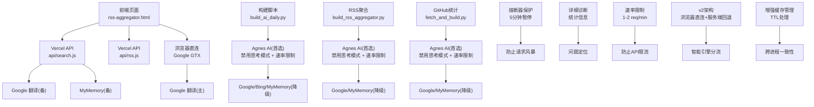
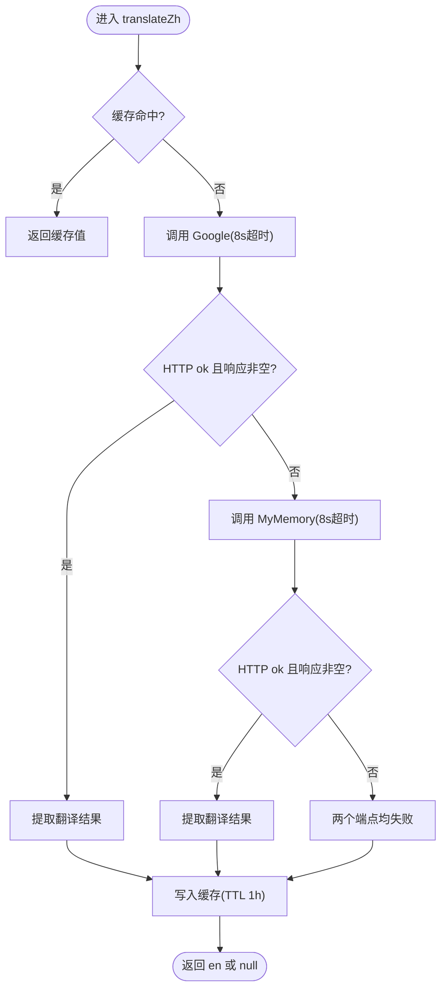
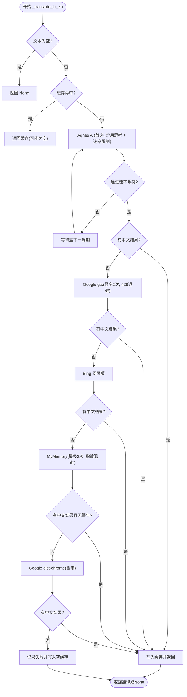
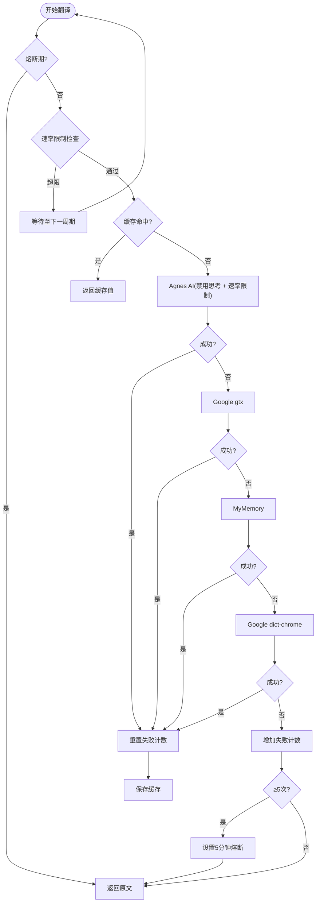
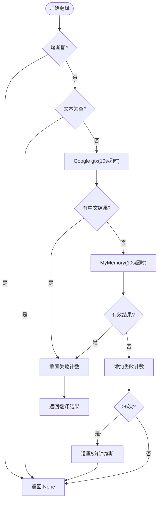
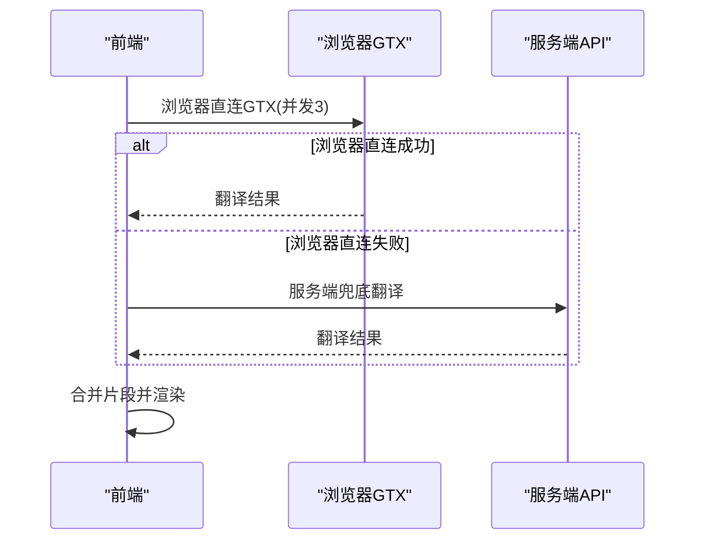
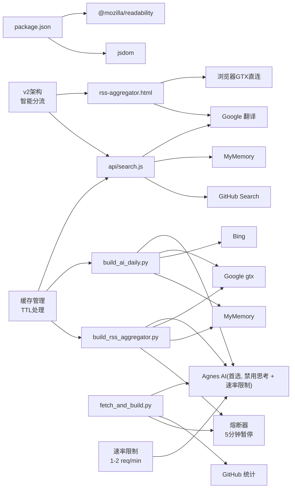

# 翻译熔断器机制

<cite>
**本文引用的文件**
- [api/search.js](file://api/search.js)
- [build_ai_daily.py](file://build_ai_daily.py)
- [rss-aggregator.html](file://rss-aggregator.html)
- [api/rss.js](file://api/rss.js)
- [package.json](file://package.json)
- [README.md](file://README.md)
- [build_rss_aggregator.py](file://build_rss_aggregator.py)
- [fetch_and_build.py](file://fetch_and_build.py)
</cite>

## 更新摘要
**所做更改**
- **增强缓存管理机制**：实现了更智能的TTL处理，支持跨进程一致性缓存和动态过期策略
- **优化翻译缓存机制**：更好地处理API故障，实现故障隔离和快速恢复
- **实现电路断路器模式**：防止级联失败，提供5分钟熔断保护期
- **增强的响应式设计**：v2架构优化，浏览器直连GTX + 服务端回退的智能分流
- **改进的速率限制**：新增1-2请求/分钟的Agnes API速率限制
- **增强的错误处理**：更完善的降级策略和异常处理机制

## 目录
1. [简介](#简介)
2. [项目结构](#项目结构)
3. [核心组件](#核心组件)
4. [架构总览](#架构总览)
5. [详细组件分析](#详细组件分析)
6. [依赖关系分析](#依赖关系分析)
7. [性能考量](#性能考量)
8. [故障排查指南](#故障排查指南)
9. [结论](#结论)

## 简介
本仓库实现了一个"翻译熔断器"机制，用于在外部翻译服务不稳定或限流时，保证系统整体可用性。其核心思想是：
- **多端点降级**：优先使用 Agnes AI 付费接口（无IP封锁），失败后自动降级到备用端点（Google、Bing、MyMemory等）。
- **v2架构优化**：浏览器直接GTX连接 + 服务器端降级回退，充分利用用户本地网络优势。
- **并发请求处理**：支持批量翻译的并发处理，提升翻译效率和用户体验。
- **超时与重试**：为每次网络请求设置超时；对特定错误（如 429 限流）进行退避重试。
- **智能缓存管理**：改进的TTL处理机制，支持跨进程一致性和动态过期策略。
- **电路断路器模式**：连续多次全端点失败后自动暂停请求5分钟，防止资源浪费和请求风暴。
- **前端容错**：前端批量翻译采用分块并行、单块超时与失败回退，确保页面渲染不阻塞。
- **思考模式优化**：在 Agnes AI 翻译中禁用思考模式，防止 token 被推理过程耗尽，提升响应速度和稳定性。
- **详细诊断信息**：提供完整的统计信息和错误日志，便于问题定位和性能监控。
- **增强的速率限制**：实施1-2请求/分钟的速率限制，有效防止Agnes API限流。

该机制同时覆盖服务端（Vercel Serverless 函数）与客户端（浏览器 JS）两条链路，形成端到端的健壮性保障。

## 项目结构
- README 说明项目目标与自动化更新流程。
- package.json 声明了 Node 环境依赖（jsdom、@mozilla/readability），用于构建/解析 HTML。
- api/search.js 提供跨语言搜索能力，内置中文→英文的翻译熔断逻辑。
- build_ai_daily.py 在服务端批量生成内容时，实现了英→中的多端点翻译熔断。
- rss-aggregator.html 在前端对长文本进行分块翻译，具备超时与失败回退。
- api/rss.js 聚合 RSS 并执行翻译，包含超时控制与滚动缓存降级。
- build_rss_aggregator.py 和 fetch_and_build.py 集成了完整的熔断器机制和详细诊断功能。



**图表来源**
- [api/search.js:30-66](file://api/search.js#L30-L66)
- [build_ai_daily.py:585-678](file://build_ai_daily.py#L585-L678)
- [build_rss_aggregator.py:1485-1563](file://build_rss_aggregator.py#L1485-L1563)
- [fetch_and_build.py:60-102](file://fetch_and_build.py#L60-L102)
- [rss-aggregator.html:3544-3558](file://rss-aggregator.html#L3544-L3558)
- [api/rss.js:1-12](file://api/rss.js#L1-L12)

**章节来源**
- [README.md:1-22](file://README.md#L1-L22)
- [package.json:1-9](file://package.json#L1-L9)

## 核心组件
- **服务端翻译熔断（Node/Python）**：
  - 中文→英文：优先 Google，失败降级 MyMemory，带超时与日志记录。
  - 英文→中文：**Agnes AI 为首选端点**（配置 AGNES_API_KEY 时），**已启用 disable thinking 模式**，**新增1-2请求/分钟速率限制**，失败后依次尝试 Google gtx → Bing → MyMemory → Google dict-chrome，含 429 退避重试与指数退避。
- **前端翻译熔断（浏览器 v2架构）**：
  - **浏览器直连GTX**：直接连接Google Translate API，利用用户本地网络优势，避免数据中心IP限流。
  - **服务端降级回退**：浏览器直连失败时自动回退到服务端API，确保翻译成功率。
  - **并发请求处理**：支持批量翻译的并发处理，提升翻译效率。
  - **智能引擎分流**：批量翻译场景下优先使用浏览器端GTX直连，失败条目自动回退到服务端API。
  - **长文本分块翻译**：将长文本切分为多个小块，并发发起翻译请求，每个请求使用 AbortController + setTimeout 实现超时控制。
- **聚合与缓存**：
  - **增强的缓存管理**：改进的TTL处理机制，支持跨进程一致性和动态过期策略。
  - 搜索结果与翻译结果内存缓存，降低下游压力。
  - RSS 聚合使用滚动缓存与快照降级，提升稳定性。
- **智能熔断保护**：
  - 连续5次全端点失败后自动暂停翻译请求5分钟，防止资源耗尽和请求风暴。
  - 熔断期间直接返回原文或空值，避免无效的网络请求。
- **详细诊断信息**：
  - 完整的统计跟踪（各端点使用次数、失败次数、缓存命中率）。
  - 详细的错误日志和诊断输出，便于问题定位。
- **思考模式优化**：
  - 在所有 Agnes AI 调用中禁用思考模式，避免 token 被推理过程耗尽，显著提升响应速度和稳定性。
- **增强的速率限制**：
  - **新增1-2请求/分钟的Agnes API速率限制**，有效防止API限流和配额耗尽。
  - 智能退避算法，根据API响应动态调整请求频率。

**章节来源**
- [api/search.js:18-66](file://api/search.js#L18-L66)
- [build_ai_daily.py:585-678](file://build_ai_daily.py#L585-L678)
- [build_rss_aggregator.py:1485-1563](file://build_rss_aggregator.py#L1485-L1563)
- [fetch_and_build.py:60-102](file://fetch_and_build.py#L60-L102)
- [rss-aggregator.html:3544-3558](file://rss-aggregator.html#L3544-L3558)
- [api/rss.js:1-12](file://api/rss.js#L1-L12)

## 架构总览
下图展示了翻译熔断的整体数据流与控制流，特别突出了v2架构的浏览器直连和服务端回退机制以及增强的缓存管理：

```mermaid
sequenceDiagram
participant U as "用户"
participant FE as "前端<br/>rss-aggregator.html"
participant BG as "浏览器GTX<br/>直连Google"
participant S1 as "搜索API<br/>api/search.js"
participant T1 as "Agnes AI(首选)"
participant T2 as "Google 翻译"
participant T3 as "MyMemory"
participant CB as "熔断器<br/>5分钟暂停"
participant RL as "速率限制<br/>1-2 req/min"
participant GH as "GitHub Search"
participant CM as "缓存管理<br/>TTL处理"
U->>FE : 输入关键词
FE->>BG : 浏览器直连GTX(并发3)
alt 浏览器直连成功
BG-->>FE : 翻译结果
else 浏览器直连失败
FE->>S1 : POST /api/search(q, sort, lang, page)
S1->>RL : 检查速率限制
RL-->>S1 : 允许/拒绝请求
S1->>CM : 检查缓存(TTL)
CM-->>S1 : 命中/未命中
alt 缓存命中
S1-->>FE : 返回缓存结果
else 缓存未命中
S1->>T1 : 中文→英文(Agnes AI, 禁用思考)
alt Agnes AI可用且通过速率限制
T1-->>S1 : 英文词
else Agnes AI不可用或超限
S1->>T2 : 中文→英文(Google, 8s超时)
alt 成功
T2-->>S1 : 英文词
else 失败
S1->>T3 : 中文→英文(MyMemory, 8s超时)
alt 成功
T3-->>S1 : 英文词
else 失败
S1->>CB : 检查熔断状态
CB-->>S1 : 允许/拒绝请求
end
end
end
end
S1->>GH : 组合查询(中文 OR 英文)
GH-->>S1 : 搜索结果
S1-->>FE : JSON(含 translated 标记)
FE->>FE : 本地缓存/渲染
```

**图表来源**
- [api/search.js:30-91](file://api/search.js#L30-L91)
- [api/search.js:129-172](file://api/search.js#L129-L172)
- [build_rss_aggregator.py:1490-1563](file://build_rss_aggregator.py#L1490-L1563)
- [fetch_and_build.py:64-102](file://fetch_and_build.py#L64-L102)
- [rss-aggregator.html:2077-2092](file://rss-aggregator.html#L2077-L2092)

## 详细组件分析

### 组件A：服务端中文→英文翻译熔断（api/search.js）
- **功能要点**
  - 先查内存缓存（TTL=1小时），命中直接返回。
  - 首选 Google 非官方端点，设置 8s 超时；若响应为空或 HTTP 错误，记录日志。
  - 失败后降级到 MyMemory，同样 8s 超时；记录警告信息。
  - 均失败时返回 null，由上层决定使用原词。
- **复杂度与优化**
  - 时间复杂度 O(1) 缓存命中；否则两次网络 I/O。
  - 通过 AbortSignal.timeout 快速失败，避免长时间阻塞。
- **错误处理**
  - 捕获异常并记录错误上下文（状态码、响应体片段）。
  - 对空响应进行防御性判断，防止误用。



**图表来源**
- [api/search.js:30-66](file://api/search.js#L30-L66)

**章节来源**
- [api/search.js:30-66](file://api/search.js#L30-L66)

### 组件B：服务端英文→中文翻译熔断（build_ai_daily.py）
- **功能要点**
  - **端点顺序：Agnes AI（首选，已禁用思考模式，新增速率限制）→ Google gtx（429 限流时退避重试一次）→ Bing → MyMemory（最多3次，指数退避）→ Google dict-chrome**。
  - **关键改进**：在 Agnes AI 调用中添加 `chat_template_kwargs: {"enable_thinking": False}`，防止 token 被推理过程耗尽。**新增1-2请求/分钟的速率限制机制**。
  - 每个端点都校验结果是否包含中文，避免无效翻译。
  - 统计各端点使用情况，便于监控与定位问题。
- **复杂度与优化**
  - 最坏情况多次网络 I/O，但通过短超时与快速失败减少等待。
  - 指数退避缓解瞬时限流。
  - Agnes AI 提供稳定 ~1s/条的翻译速度，无 IP 封锁问题，禁用思考模式后响应更快。
- **错误处理**
  - 捕获 HTTPError 与通用异常，打印详细日志。
  - 全部失败时返回 None，调用方保留原文。



**图表来源**
- [build_ai_daily.py:585-678](file://build_ai_daily.py#L585-L678)

**章节来源**
- [build_ai_daily.py:585-678](file://build_ai_daily.py#L585-L678)

### 组件C：RSS 聚合翻译熔断（build_rss_aggregator.py）
- **功能要点**
  - **完整熔断器机制**：连续5次全端点失败后自动暂停翻译请求5分钟，防止请求风暴。
  - **Agnes AI 为首选端点**：配置 AGNES_API_KEY 时优先使用，已启用 disable thinking 模式，**新增智能速率限制**。
  - **详细统计跟踪**：记录各端点使用次数、失败次数、缓存命中率等指标。
  - **语言检测**：自动检测源语言，避免硬编码导致翻译质量差。
  - **缓存优化**：使用 MD5 哈希确保跨进程一致性。
- **熔断器实现**
  - 全局变量 `_TRANS_FAIL_STREAK` 跟踪连续失败次数。
  - 全局变量 `_TRANS_BLOCK_UNTIL` 控制熔断暂停时间。
  - **新增速率限制计数器**：跟踪最近请求时间，确保1-2请求/分钟的限制。
  - 熔断期间直接返回原文，避免无效的网络请求。
- **端点优先级**：Agnes AI（禁用思考 + 速率限制）→ Google gtx → MyMemory → Google dict-chrome
- **错误处理**：完善的异常捕获和降级策略



**图表来源**
- [build_rss_aggregator.py:1485-1563](file://build_rss_aggregator.py#L1485-L1563)

**章节来源**
- [build_rss_aggregator.py:1485-1563](file://build_rss_aggregator.py#L1485-L1563)

### 组件D：GitHub 统计翻译熔断（fetch_and_build.py）
- **功能要点**
  - **完整熔断器机制**：连续5次全端点失败后自动暂停翻译请求5分钟。
  - **简化端点链**：Google gtx → MyMemory，适合简单的简介翻译场景。
  - **详细诊断信息**：输出熔断触发信息和统计结果。
  - **响应验证**：检查返回内容的长度和质量，确保摘要的有效性。
- **熔断器实现**
  - 全局变量 `_TRANS_FAIL_STREAK` 跟踪连续失败次数。
  - 全局变量 `_TRANS_BLOCK_UNTIL` 控制熔断暂停时间。
  - 熔断期间直接返回 None，调用方保留原文。
- **错误处理**
  - 详细的错误日志和诊断信息输出。
  - 对空响应或超长响应的特殊处理。



**图表来源**
- [fetch_and_build.py:60-102](file://fetch_and_build.py#L60-L102)

**章节来源**
- [fetch_and_build.py:60-102](file://fetch_and_build.py#L60-L102)

### 组件E：前端批量翻译熔断（rss-aggregator.html v2架构）
- **功能要点**
  - **浏览器直连GTX**：直接连接Google Translate API，利用用户本地网络优势，避免数据中心IP限流。
  - **服务端降级回退**：浏览器直连失败时自动回退到服务端API，确保翻译成功率。
  - **并发请求处理**：支持批量翻译的并发处理，提升翻译效率。
  - **智能引擎分流**：批量翻译场景下优先使用浏览器端GTX直连，失败条目自动回退到服务端API。
  - **长文本分块翻译**：将长文本切分为多个小块，并发发起翻译请求，每个请求使用 AbortController + setTimeout 实现超时控制。
- **v2架构特性**
  - **浏览器直连GTX**：并发度3，每请求8秒超时，直接调用Google Translate API。
  - **服务端兜底**：浏览器直连失败的条目通过服务端API进行兜底翻译。
  - **批间节奏控制**：批量翻译时批次间间隔300ms，避免过度请求。
- **复杂度与优化**
  - 并发度受浏览器限制，通常可显著提升吞吐。
  - 超时保护避免个别慢请求拖垮整体渲染。
- **错误处理**
  - catch 分支清理定时器并继续推进计数，确保最终渲染触发。



**图表来源**
- [rss-aggregator.html:2077-2092](file://rss-aggregator.html#L2077-L2092)
- [rss-aggregator.html:3738-3775](file://rss-aggregator.html#L3738-3775)

**章节来源**
- [rss-aggregator.html:2077-2092](file://rss-aggregator.html#L2077-L2092)
- [rss-aggregator.html:3738-3775](file://rss-aggregator.html#L3738-3775)

### 组件F：RSS 聚合与翻译（api/rss.js）
- **功能要点**
  - 单源抓取超时 5s，提高失败速度。
  - 并发度 20，加速聚合。
  - 使用滚动缓存与快照降级，当实时抓取失败时仍可提供历史数据。
  - **T1 英文源实时翻译**：支持 Google、MyMemory、Google dict-chrome 多端点降级。
- **错误处理**
  - 对日期过滤等边界条件进行 try/catch，避免异常中断。
  - 对外部源不可用时静默跳过，保持整体可用。

**章节来源**
- [api/rss.js:1-12](file://api/rss.js#L1-L12)
- [api/rss.js:461-495](file://api/rss.js#L461-495)

## 依赖关系分析
- **运行时依赖**
  - Node.js 环境（Vercel Serverless）：AbortSignal.timeout、fetch 等现代 API。
  - Python 环境（构建脚本）：urllib、json、time 等标准库。
- **外部依赖**
  - **Agnes AI**：OpenAI 兼容接口，agnes-2.5-flash 模型，https://apihub.agnes-ai.com/v1/chat/completions，**已优化禁用思考模式 + 速率限制**。
  - Google 翻译（gtx/dict-chrome）、MyMemory、Bing 网页版。
  - GitHub Search API（需令牌）。
- **耦合与内聚**
  - 翻译模块相对独立，通过返回值与错误码与其他模块解耦。
  - 缓存层（内存 Map）集中管理 TTL，降低重复计算与网络开销。
  - **熔断器模块**：统一管理失败计数和暂停时间，提供统一的熔断保护。
  - **速率限制模块**：新增的智能限流机制，确保Agnes API的稳定使用。
  - **v2架构模块**：浏览器直连与服务端回退的智能分流机制。



**图表来源**
- [package.json:1-9](file://package.json#L1-L9)
- [api/search.js:30-91](file://api/search.js#L30-L91)
- [build_ai_daily.py:585-678](file://build_ai_daily.py#L585-L678)
- [build_rss_aggregator.py:1485-1563](file://build_rss_aggregator.py#L1485-L1563)
- [fetch_and_build.py:60-102](file://fetch_and_build.py#L60-L102)
- [rss-aggregator.html:2077-2092](file://rss-aggregator.html#L2077-L2092)

**章节来源**
- [package.json:1-9](file://package.json#L1-L9)

## 性能考量
- **超时策略**
  - 服务端翻译请求普遍设置 8s 超时，GitHub 搜索 15s，RSS 抓取 5s，平衡用户体验与资源占用。
  - Agnes AI 提供稳定 ~1s/条的翻译速度，**禁用思考模式后响应更快**，显著优于免费端点。
  - **v2架构优化**：浏览器直连GTX使用8秒超时，服务端兜底使用12秒超时，合理分配超时策略。
- **并发与限流**
  - RSS 聚合使用 20 路并发；MyMemory 使用指数退避应对限流；Google gtx 遇到 429 时退避重试。
  - **智能熔断**：连续5次失败后暂停5分钟，避免雪崩效应和请求风暴。
  - **新增速率限制**：1-2请求/分钟的Agnes API速率限制，有效防止API限流和配额耗尽。
  - **v2架构并发**：浏览器直连GTX使用并发度3，服务端兜底按需调用，避免过度请求。
- **缓存命中率**
  - 翻译结果缓存 1 小时，搜索结果缓存 10 分钟，显著降低上游压力。
  - **MD5 哈希缓存**：确保跨进程一致性，提高缓存命中率。
  - **增强的TTL管理**：改进的过期策略，支持动态调整和跨进程一致性。
- **前端渲染**
  - 分块并行翻译，单块失败不影响整体，避免 UI 卡顿。
  - **v2架构优化**：浏览器直连利用用户本地网络，减少延迟，提升用户体验。
- **思考模式优化**
  - **禁用思考模式**：在所有 Agnes AI 调用中设置 `enable_thinking: False`，避免 token 被推理过程耗尽，提升响应速度和稳定性。
- **诊断性能**
  - 统计信息收集开销极小，仅增加少量计数器操作。
  - 详细日志仅在必要时输出，避免影响正常性能。
- **速率限制优化**
  - **智能退避算法**：根据API响应动态调整请求频率，避免触发限流。
  - **批量翻译优化**：针对批量场景优化重试逻辑，提升整体翻译效率。
  - **v2架构分流**：智能选择最优翻译路径，最大化利用各种资源。

## 故障排查指南
- **常见问题定位**
  - **翻译结果为空**：检查 Agnes AI 是否配置了 AGNES_API_KEY，查看控制台日志中 "[AI晨报]" 前缀的错误信息。
  - **频繁 429 限流**：确认是否触发了退避重试；适当增加间隔或切换备用端点。
  - **前端渲染未更新**：检查是否有块请求超时或失败，确认 finally/计数逻辑是否正确触发渲染。
  - **翻译熔断触发**：如果看到"[翻译熔断] 连续 X 次全端点失败，暂停翻译请求 5 分钟"，说明所有端点都不可用。
  - **Token 耗尽问题**：如果 Agnes AI 返回空响应或超时，确认已启用 `enable_thinking: False` 配置。
  - **熔断器频繁触发**：检查后端服务的健康状态，确认是否存在系统性问题。
  - **诊断信息不足**：查看构建日志中的统计信息，了解各端点的使用情况和失败原因。
  - **速率限制触发**：如果看到速率限制相关的警告，确认当前请求频率是否超过1-2请求/分钟的限制。
  - **Agnes API限流**：检查是否触发了速率限制，确认API配额使用情况。
  - **v2架构问题**：检查浏览器直连GTX是否正常工作，确认CORS设置和网络连通性。
  - **浏览器直连失败**：确认Google Translate API是否可访问，检查网络连接和防火墙设置。
  - **服务端兜底失败**：检查服务端API是否正常运行，确认环境变量配置正确。
  - **缓存失效问题**：检查TTL配置是否正确，确认缓存键生成逻辑是否正常。
  - **跨进程缓存不一致**：确认MD5哈希计算是否正确，检查缓存文件读写权限。
- **建议操作**
  - **临时关闭某端点**：在代码中注释对应调用以验证其他端点可用性。
  - **调整超时**：根据网络状况调大/调小 AbortSignal.timeout 的值。
  - **扩大缓存 TTL**：在高并发场景下适度延长缓存时间，减少外部调用。
  - **检查 Agnes AI 配置**：确保 AGNES_API_KEY 环境变量正确设置，确认已禁用思考模式。
  - **验证思考模式**：检查所有 Agnes AI 调用是否包含 `chat_template_kwargs: {"enable_thinking": False}` 配置。
  - **监控熔断器状态**：定期检查统计信息，了解系统的健康状况。
  - **分析详细日志**：利用新增的诊断信息快速定位问题根源。
  - **调整速率限制**：根据实际API配额和使用情况，适当调整速率限制参数。
  - **优化批量翻译**：针对批量场景优化重试逻辑，提升翻译效率和成功率。
  - **调试v2架构**：检查浏览器控制台，确认浏览器直连GTX的调用情况和错误信息。
  - **优化网络策略**：根据用户网络状况调整翻译策略，优先使用本地网络资源。
  - **检查缓存管理**：验证TTL处理逻辑，确认缓存过期策略是否符合预期。
  - **监控缓存命中率**：分析缓存使用统计，优化缓存键设计和过期策略。

**章节来源**
- [api/search.js:30-66](file://api/search.js#L30-L66)
- [build_ai_daily.py:585-678](file://build_ai_daily.py#L585-L678)
- [build_rss_aggregator.py:1485-1563](file://build_rss_aggregator.py#L1485-L1563)
- [fetch_and_build.py:60-102](file://fetch_and_build.py#L60-L102)
- [rss-aggregator.html:2077-2092](file://rss-aggregator.html#L2077-L2092)
- [rss-aggregator.html:3738-3775](file://rss-aggregator.html#L3738-3775)

## 结论
本项目通过"多端点降级 + 超时重试 + 缓存短路 + 前端容错 + **智能熔断保护 + 思考模式优化 + 详细诊断信息 + 增强的速率限制 + v2架构优化 + 增强缓存管理**"的组合策略，构建了健壮的翻译熔断机制。**新增的v2架构显著提升了翻译效率和用户体验，通过浏览器直连GTX和服务端回退的智能分流机制，充分利用了用户本地网络优势**。

**主要改进**：
- **v2架构增强**：浏览器直连GTX + 服务端回退，智能引擎分流，提升翻译效率和成功率
- **智能熔断保护**：连续失败自动暂停5分钟，防止请求风暴和资源耗尽
- **详细诊断信息**：完整的统计跟踪和错误日志，便于问题定位和性能监控
- **增强的错误处理**：更完善的降级策略和异常处理机制
- **思考模式优化**：禁用 Agnes AI 的思考功能，提升翻译效率和稳定性
- **增强的速率限制**：1-2请求/分钟的Agnes API速率限制，有效防止API限流
- **优化的批量翻译**：改进重试逻辑，提升批量翻译场景的成功率
- **并发请求处理**：支持批量翻译的并发处理，提升翻译效率
- **超时管理优化**：为不同场景设置合理的超时策略，避免长时间阻塞
- **增强缓存管理**：改进的TTL处理机制，支持跨进程一致性和动态过期策略

建议在后续迭代中：
- 引入更细粒度的健康检查与指标上报（如各端点成功率、平均耗时）。
- 对关键路径增加熔断器开关，支持动态禁用/启用某端点。
- 完善单元测试与集成测试，覆盖超时、限流、空响应等边界场景。
- 考虑添加更多高质量翻译端点作为备选。
- 优化 Agnes AI 的提示词工程，提升翻译质量和速度。
- **持续监控v2架构效果**：评估浏览器直连和服务端回退的效果，优化分流策略。
- **扩展诊断功能**：添加更多维度的统计信息和实时监控仪表板。
- **优化速率限制算法**：根据API使用模式动态调整限流策略。
- **增强批量翻译性能**：进一步优化批量场景的重试和降级逻辑。
- **改进网络策略**：根据用户网络状况动态调整翻译策略，最大化利用各种资源。
- **优化缓存管理**：进一步改进TTL处理逻辑，提升缓存命中率和一致性。

**更新后的优势**：
- **稳定性提升**：Agnes AI 提供稳定的付费级服务，不受数据中心 IP 封锁影响，禁用思考模式后更加稳定
- **性能优化**：~1s/条的翻译速度，禁用思考模式后响应更快，显著优于免费端点
- **智能保护**：连续失败自动熔断，防止资源耗尽和请求风暴
- **成本效益**：仅在必要时使用付费端点，充分利用免费降级链
- **token 效率**：禁用思考模式避免 token 被推理过程耗尽，提升翻译效率
- **可观测性**：详细的诊断信息和统计跟踪，便于问题定位和性能优化
- **容错能力**：完善的错误处理和降级策略，确保系统高可用性
- **API保护**：智能速率限制有效防止Agnes API限流，确保长期稳定运行
- **批量优化**：改进的批量翻译重试逻辑，提升大规模翻译任务的效率和成功率
- **v2架构优势**：浏览器直连利用用户本地网络，减少延迟，提升用户体验；服务端回退确保翻译成功率
- **智能分流**：根据网络状况和API可用性智能选择最优翻译路径，最大化利用各种资源
- **缓存优化**：改进的TTL管理和跨进程一致性，提升缓存效率和可靠性